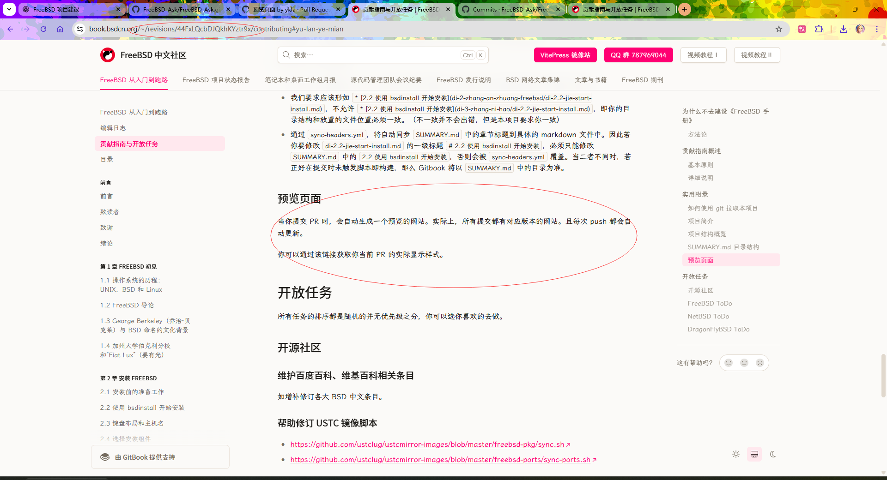

# 贡献指南与开放任务

## 为什么不去建设《FreeBSD 手册》

FreeBSD 项目对除季度报告外的实质性 PR 多采取长期搁置的处理方式。从提交数据来看，freebsd-doc 项目的活跃度在过去十余年持续走低：

使用统计分析 git 项目[EB/OL]. [2026-03-26]. <https://gist.github.com/ykla/6c3df44c371d37fc3196ddf5fa87ce5f> 对 freebsd-doc 进行分析的结果参见：freebsd-doc-2025 分析报告[EB/OL]. [2026-03-26]. <https://gist.github.com/ykla/363bf922d0785d0b02dd43f8289368db>。

- 2005–2006 年：第一次显著下滑
- 2015–2016 年：第二次大幅下滑

该项目结构复杂且混乱，例如在翻译过程中部分数据引用的可复用性难以判断，即使对于维护者而言亦是如此。

此外，其安全报告的文件名包含英文冒号 `:`，这在 Windows 系统中属于非法字符，导致整个项目无法在 Windows 环境下正常检出：

```powershell
PS C:\Users\ykla> git clone https://github.com/freebsd/freebsd-doc
Cloning into 'freebsd-doc'...
remote: Enumerating objects: 617155, done.
remote: Counting objects: 100% (294/294), done.
remote: Compressing objects: 100% (120/120), done.
remote: Total 617155 (delta 217), reused 219 (delta 174), pack-reused 616861 (from 4)
Receiving objects: 100% (617155/617155), 483.71 MiB | 786.00 KiB/s, done.
Resolving deltas: 100% (358420/358420), done.
error: invalid path 'website/static/security/advisories/FreeBSD-EN-04:01.twe.asc' # 观察 FreeBSD-EN-04:01.twe.asc，该文件名在 Windows 下是非法的
fatal: unable to checkout working tree
warning: Clone succeeded, but checkout failed.
You can inspect what was checked out with 'git status'
and retry with 'git restore --source=HEAD :/'
```

## 贡献指南概述

若您希望将教程收录至本书，可通过以下方式提交：

- 若您熟悉 GitHub 操作，可点击桌面端网页右侧的“编辑此页”按钮进入项目进行编辑。本项目采用 Markdown 语法配合 GitBook 平台，易于上手（具体操作详见项目 WiKi）。
- 若上述方式存在困难，您也可发送 PDF、Word 或 TXT 格式的文档至电子邮箱 `yklaxds@gmail.com`（我们将在 3 个工作日内回复。若未收到回复，请更换邮箱再次发送或提交 issue）；若有视频教程，建议提供各大云盘的分享链接。

本书现收录以下类型的内容：

- 一切与 BSD 相关（包括但不限于 FreeBSD、OpenBSD、NetBSD）及各种体系架构的教程。您既可以扩充现有教程，也可以创建新的章节。
- 下方的 ToDo 列表或 GitHub Project 中的任务。
- 您亦可在文学故事章节分享您与 BSD 的故事及个人心得体会。

### 基本原则与方法论

#### 基本原则

- 内容应尽可能详尽且基础，勿假定读者具备任何使用背景
- 介绍大型软件（如 IDE、Java）时，请注明软件版本号
- **引用应注重权威性、时效性与准确性。优先采用原始文献，次选二手文献，避免使用三手文献**
- 引用其他网站内容时，请核实其内容是否真实可信，尽量查阅一手来源而非直接引用网站内容
- 请提交至 main 分支
- 请避免学术不端行为，参见：高等学校预防与处理学术不端行为办法[EB/OL]. [2026-03-26]. <https://www.gov.cn/zhengce/2016-07/19/content_5713390.htm> （AIGC 相关规定除外）
- 请遵守 [FreeBSD 中文社区行为规范](https://docs.bsdcn.org/CODE_OF_CONDUCT)
- 所有 AIGC（AI-Generated Content，人工智能生成内容）必须经过人工二次确认，核实其原始出处与来源的可靠性，不得直接提交。但纯粹翻译可作为例外绕过本规定。任何人对所提交内容自行负责，无论其是否由 AIGC 生成

#### 使之成为“一本书”，而不仅是字典或手册

- 若某一技术在最新版本中已被移除，应及时移除其在本书中的对应内容
- 使全书语气温和而坚定
- 在尽量减少原文引用的前提下，重写各章节内容并删除冗余部分
- 实现 BSD 中文文档协作方式的现代化与简化：
  - 自动化（CI 检查、预览、生成 HTML/PDF）
  - 仅使用最基础的 Markdown 语法，避免复杂扩展和繁琐流程
  - 技术与选材应与时俱进，确保内容的现代化
- 严格验证每一部分内容：
  - 参考文献：不仅要求来源可查，更要求来源可信
  - 原理性内容：
    - 追溯至具体的 FreeBSD 源代码文件、提交记录或函数
    - 明确引用相关标准、规范或法律文件
    - 分析其设计哲学与开发思路
  - 操作性内容：应在 FreeBSD 环境中亲自测试，确保可复现
- 审视原作者的开发哲学与理念，评价其合理性，并尝试简单参与相关项目
- 指出并修正上游官方手册中的错误或过时内容
- 生成英文版本

#### 细则

- 非拉丁字符与拉丁字符之间应添加空格（中英文/数字之间应有一个半角空格），许多 Markdown 格式化工具可自动完成此操作
- 不应使用 `sudo` 而应使用 `#` 代替，除非是特殊情况（如讲解如何使用 `sudo` 本身）；普通用户权限请使用 `$` 表示
- 安装软件时，请提供 pkg（FreeBSD 的二进制包管理器，用于安装、更新和管理预编译软件包，提供依赖关系解析和版本管理功能）或 ports 两种方法，除非极不建议使用 pkg（如特定内核模块等）
- 请注意版权问题。引用内容或受到启发时，请备注文章链接出处，必要时可使用互联网档案馆进行快照保存
- 编辑时请尽量以最新的 FreeBSD RELEASE（FreeBSD 的正式发布版本，经过充分测试和稳定化，适合生产环境使用，每个 RELEASE 版本均有长期支持周期）为基准，绝对避免出现 `pkg_add` 等过时内容。如有必要，必须注明相关版本
- 关于编写时长，理论上会持续进行，跟随每个 FreeBSD 大版本迭代更新
- 若因各种原因无法立即验证所写内容的正确性，请编辑者添加“警告：以下内容为理论，未经实际测试，仅供参考，如可使用请提交 issue 以移除本标签。”的提示标签进行区分
- 不应在文学故事章节进行除错别字和排版以外的删减
- 请勿使用 Gitee 等境内无法确保信息安全与数据稳定的平台（此类平台无法保证文件的长期可访问性，不适合存放需长期归档的内容，未来存在无法获取文件的重大风险）
- 进行错别字修改时，请务必确认其确为错别字，可参考《现代汉语词典》第 7 版等资料进行佐证

## 实用附录

### 如何使用 Git 拉取本项目

> **技巧**
>
> 您完全可以通过 GitHub 在线完成所有提交。


本项目体积较大，使用 Git 拉取时可能导致缓冲区溢出，可通过修改 Git 配置文件来扩大缓冲区。

以下是一个可用的 `~/.gitconfig`（在 Windows 系统中的位置为 `C:\Users\你的用户名\.gitconfig`）的文件示例：

```ini
[filter "lfs"]
	required = true
	clean = git-lfs clean -- %f
	smudge = git-lfs smudge -- %f
	process = git-lfs filter-process
[user]
	name = # 你的用户名
	email = # 你的邮箱
	signingkey = # 你的密钥 ID，使用密钥签名时需要
[commit]
	gpgsign = true # 使用密钥签名时需要
[core]
	autocrlf = true # 自动调整末尾回车与换行
[http]
	proxy = http://localhost:7890 # 设置使用 http 代理
	postBuffer = 1048576000 # 扩大缓冲区，约 1 GB
	maxRequestBuffer = 1048576000 # 扩大缓冲区，约 1 GB
```

名词解释：

- `autocrlf`：配置 Git 自动处理（转换）行结束符的默认行为。参见：配置 Git 处理行结束符 - GitHub Docs[EB/OL]. [2026-03-26]. <https://docs.github.com/zh/get-started/git-basics/configuring-git-to-handle-line-endings>.
- `signingkey`：指设置带签名提交时默认使用的签名密钥。signingkey 既可指 GPG Key，亦可指 SSH Key。自 Git 2.34 起，Git 支持了 SSH 签名验证功能。参见：关于提交签名验证 - GitHub Docs[EB/OL]. [2026-03-26]. <https://docs.github.com/zh/authentication/managing-commit-signature-verification/about-commit-signature-verification>.

拉取命令：

```sh
$ git clone https://github.com/FreeBSD-Ask/FreeBSD-Ask
```

#### 附录：Windows Git 配置示例

```ini
[filter "lfs"]
	required = true
	clean = git-lfs clean -- %f
	smudge = git-lfs smudge -- %f
	process = git-lfs filter-process
[user]
	name = ykla
	email = yklaxds@gmail.com
	signingkey = 11B44C23A0A0B986
[commit]
  gpgsign = true
[core]
	autocrlf = true
	longpaths = true
	editor = 'C:/Program Files/Notepad++/notepad++.exe' -multiInst -nosession
[difftool "sourcetree"]
	cmd = "'' "
[mergetool "sourcetree"]
	cmd = "'' "
	trustExitCode = true
[http]
	proxy = http://localhost:7890
	postBuffer = 1048576000
	maxRequestBuffer = 1048576000

[gpg]
	program = C:/Program Files/GnuPG/bin/gpg.exe
[safe]
	directory = C:/Users/ykla/Documents/hub/unix-haters
```

#### 故障排除

- `致命错误：无法访问 'https://github.com/FreeBSD-Ask/FreeBSD-Ask/': Recv failure: 连接被对方重置`

请尝试拉取项目 `https://github.com/FreeBSD-Ask/LDWG`。

若报错类似，说明您的网络存在问题，请使用代理。

### 项目简介

本项目主要托管在 GitBook（即 `https://book.bsdcn.org`）；

`https://docs.bsdcn.org` 由社区自行构建，docs 网站本身的贡献指南参见：FreeBSD 从入门到跑路 VitePress 镜像项目[EB/OL]. [2026-03-26]. <https://github.com/FreeBSD-Ask/FreeBSD-Ask.github.io/blob/main/README.md>。

> **技巧**
>
> 若您仅想贡献内容本身，尚无改进 docs 网站浏览体验与构建优化等意向，则仅需阅读本文即可。

### 项目结构概览

```sh
> FreeBSD-Ask-main
│  .gitattributes  # 用于让 GitHub 正确识别 markdown，用于在 GitHub 正确高亮，正确显示编程语言（Languages）的统计信息
│  .gitignore # 一些规则，用于阻止 git 上传特定类型的文件或目录，如 node_modules
│  CHANGELOG-ARCHIVE.md # 普通文件，记录既往所有重要变动
│  CHANGELOG.md # 普通文件，记录当前季度的重要变动。当你有新的子章节提交或彻底重写时，请将其记录到此处
│  CODE_OF_CONDUCT.md # 用于合规，行为准则
│  CONTRIBUTING.md # 贡献指南（本文本身）
│  LICENSE # 许可证
│  mu-lu.md # 由 GitHub Action mulu.yml 自动同步
│  README.md # 主页
│  SECURITY.md # 用于合规，安全报告策略
│  SUMMARY.md # 目录文件，同时用于生成 vitepress 左侧边栏
│
├─.gitbook # 图片目录
│  └─assets # 图片
│          1-install.png
│          1.png
│          1011.png
│          其他图片从略
│
├─.github  # Github Action 相关
│  │  .autocorrectrc # 由 AutoCorrect.yml 调用
│  │  .markdownlint.json # 由 markdown-lint2.yml 调用
│  │  auto_assign.yml # 由 Auto-Assign.yml 调用
│  │  dependabot.yml # 检查 GitHub Action 调用的 Action 有无更新，并提交 PR
│  │  lychee.toml # 由 links.yml 调用
│  │
│  ├─ISSUE_TEMPLATE  # GitHub issue、PR 模板
│  │      bug_report.md  # GitHub issue 模板
│  │      feature_request.md  # GitHub PR 模板
│  │
│  ├─scripts # GitHub Action 相关，由 yml 脚本调用
│  │      check_images.py # 由 check-images.yml 调用
│  │      update_ga4_readme.py # 由 update-ga4.yml 调用
│  │      update_progress.sh # 由 Update-commit-progress.yml 调用
│  │
│  └─workflows # GitHub Action，用于自动化处理一些简单任务
│          Auto-Assign.yml # 自动为 issue PR 分配人员进行处理
│          AutoCorrect.yml # markdown 格式修正，会自动提交 PR
│          check-images.yml # 检查图片的调用情况，有无正确引用图片，不正确会生成 issue
│          create-pdf.yml # 用于在 GitHub release 生成电子书 PDF、EPUB
│          file-name-check.yml # 检查 SUMMARY.md 目录中的文件引用是否正确，不正确会生成 issue
│          links.yml # 链接检查，检查文中调用的 URL 是否能正常访问
│          markdown-lint2.yml # markdown 格式检查
│          md-padding.yml # markdown 空格检查与修复
│          mulu.yml # 从 SUMMARY.md 生成的镜像文件
│          sync-headers.yml # 从 SUMMARY.md 更新所有 markdown 文件的一级标题。如果你要修改 # 标题，必须在此处进行修改，否则会被其覆盖
│          Update-commit-progress.yml # 进度检查工具，每 3533 次提交为一个版本，用于插入到 README.md
│          update-ga4.yml # 谷歌统计数据，用于插入到 README.md
│
├─.vitepress # vitepress 相关，详见 FreeBSD-Ask/FreeBSD-Ask.github.io
│  │  config.mts
│  │
│  └─theme # vitepress 相关，详见 FreeBSD-Ask/FreeBSD-Ask.github.io
│          custom.css
│          index.js
│          Layout.vue
│
├─di-1-zhang-zou-jin-freebsd # 第 1 章的章节目录
│      di-1.1-unix.md # 第 1 章的文件
│      di-1.2-dao-lun.md
│      di-1.3-jie-freebsd-jian-shi.md
│      di-1.4-Fiat-Lux.md
│
├─di-10-zhang-vpn-yu-dai-li # 第 10 章的章节目录
│      di-10.1-jie-http-dai-li.md # 第 10 章的文件
│      di-10.2-jie-v2ray.md
│      di-10.3-jie-clash.md
│      di-10.4-jie-openvpn.md
│
└─其他目录和文件从略
│
├─public # vitepress 相关，参见 FreeBSD-Ask/FreeBSD-Ask.github.io
│      favicon.ico
│      logo.svg
│
└─其他目录和文件从略
```

### 如何新建章节

自行操作时参见操作实例 Commit 6023cc8[EB/OL]. [2026-03-26]. <https://github.com/FreeBSD-Ask/FreeBSD-Ask/commit/6023cc8d58f3a1b9849ff11fa63bf3980177c370> 和下方 `SUMMARY.md` 结构说明。

若有困难可发邮件联系 ykla 协助操作。

#### `SUMMARY.md` 目录结构

```md
# Table of contents

* [FreeBSD 从入门到跑路](README.md)
* [编辑日志](CHANGELOG.md)
* [贡献指南与开放任务](CONTRIBUTING.md)
* [目录](mu-lu.md)

## 前言

* [前言](qian-yan/qian-yan.md)
* [致读者](qian-yan/zhi-du-zhe.md)
* [致谢](qian-yan/zhi-xie.md)
* [绪论](qian-yan/xu-lun.md)

## 第 1 章 FreeBSD 初见

* [1.1 操作系统的历程：UNIX、BSD 和 Linux](di-1-zhang-zou-jin-freebsd/di-1.1-unix.md)
* [1.2 FreeBSD 导论](di-1-zhang-zou-jin-freebsd/di-1.2-dao-lun.md)
* [1.3 George Berkeley（乔治·贝克莱）与 BSD 命名的文化背景](di-1-zhang-zou-jin-freebsd/di-1.3-jie-freebsd-jian-shi.md)
* [1.4 加州大学伯克利分校和“Fiat Lux”（要有光）](di-1-zhang-zou-jin-freebsd/di-1.4-Fiat-Lux.md)

## 第 2 章 安装 FreeBSD

* [2.1 安装前的准备工作](di-2-zhang-an-zhuang-freebsd/di-2.1-install-pre.md)
* [2.2 使用 bsdinstall 开始安装](di-2-zhang-an-zhuang-freebsd/di-2.2-jie-start-install.md)
* [2.3 键盘布局和主机名](di-2-zhang-an-zhuang-freebsd/di-2.3-jie-use-bsdinstall.md)
* [2.4 选择安装组件](di-2-zhang-an-zhuang-freebsd/di-2.4-jie-select.md)
* [2.5 分配磁盘空间](di-2-zhang-an-zhuang-freebsd/di-2.5-jie-fen-pei-disk.md)
* [2.6 设置 root 密码](di-2-zhang-an-zhuang-freebsd/di-2.6-root-jie.md)
* [2.7 网络设置](di-2-zhang-an-zhuang-freebsd/di-2.7-jie-net.md)
* [2.8 时区、服务、安全、固件和账户](di-2-zhang-an-zhuang-freebsd/di-2.8-jie-more.md)
* [2.9 完成安装](di-2-zhang-an-zhuang-freebsd/di-2.9-end-jie.md)
* [2.10 故障排除](di-2-zhang-an-zhuang-freebsd/di-2.10-jie-eol.md)
* [2.11 将 U 盘启动盘恢复为普通 U 盘（基于 Windows）](di-2-zhang-an-zhuang-freebsd/di-2.11-jie-usb.md)

其他从略
```

可以看到，`SUMMARY.md` 在形式上就是普通的 Markdown 文档，并无特殊支持。

但有一些注意事项：

- 第一行 `# Table of contents` 绝对不允许变更，否则 GitBook 将无法识别，导致失去同步。
- 要求格式应为 `* [2.2 使用 bsdinstall 开始安装](di-2-zhang-an-zhuang-freebsd/di-2.2-jie-start-install.md)`，不允许出现 `* [2.2 使用 bsdinstall 开始安装](di-3-zhang-ni-hao/di-2.2-jie-start-install.md)` 这种情况，即目录结构与文件放置位置必须一致（不一致虽不会报错，但本项目要求保持一致）。
- 通过 `sync-headers.yml`，将自动同步 `SUMMARY.md` 中的章节标题到具体的 Markdown 文件中。因此若需修改 `di-2.2-jie-start-install.md` 的一级标题 `# 2.2 使用 bsdinstall 开始安装`，必须仅修改 `SUMMARY.md` 中的 `2.2 使用 bsdinstall 开始安装`，否则会被 `sync-headers.yml` 覆盖。当二者不一致时，若提交时未触发脚本构建，则 GitBook 将以 `SUMMARY.md` 中的目录为准。

### 预览页面

当您提交 PR 时，系统会自动生成一个预览网站。

实际上，所有提交都有对应的网站版本：


您可通过该链接获取当前 PR 的实际显示样式：




且每次 push 都会自动更新：


## 开放任务

所有任务的排序均为随机，无优先级之分，您可选择感兴趣的任务进行。

### 开源社区

#### 维护百度百科、维基百科相关条目

如增补修订各 BSD 中文条目。

#### 帮助修订 USTC 镜像脚本

- <https://github.com/ustclug/ustcmirror-images/blob/master/freebsd-pkg/sync.sh>
- <https://github.com/ustclug/ustcmirror-images/blob/master/freebsd-ports/sync-ports.sh>

### FreeBSD ToDo

**不再需要** 的内容（请 **不要** 撰写下列条目）：

- [ ] 9.6.图像扫描仪（谁有？而且谁支持 FreeBSD？）
- [ ] 18.7.在 MAC Jail 中运行 Nagios（过时，不写。请用其他案例代替）
- [ ] 第 11 章 打印（本节对中英文均无意义，不引入）
- [ ] 24.8.基于 FreeBSD 的 Xen™ 虚拟机（过时、支持差。真的支持 Windows 11 吗？10 也行。Xen 真难用，而且删除了 PV 支持）
- [ ] 31.4.Sendmail（过时，用 Postfix 等代替）
- [ ] 32.2.inetd 超级服务器（过时。谁在用？）
- [ ] 32.4.网络信息系统（NIS）（过时，用 SSSD-LADP 代替）
- [ ] 30.5.使用 ATM 上的 PPP (PPPoA)（过时）
- [ ] 29.4.拨入服务（过时）
- [ ] gbde 相关加密（已从 [源代码](https://github.com/freebsd/freebsd-src/commit/8d2d1d651678178aa7f24f0530347f860423fd9e)移除）
- [ ] 29.5.拨出服务（过时）
- [ ] 30.2.配置 PPP（过时）
- [ ] 31.3.DragonFly 邮件代理（DMA）（过时，用 Postfix 等代替）
- [ ] 20.10.文件系统快照（UFS）（UFS 快照？？？）
- [ ] 21.8.通过 GEOM 实现 UFS 日志（无意义）

**Just for fun**（可有可无）

- [ ] 20.7.创建和使用软盘（谁还有这种东西？2024，日本政府决定全面淘汰软盘）（无意义，但勉强可以写，若有光驱和软盘 *Just for fun*）
- [ ] 20.6.创建和使用 DVD（无意义，但勉强可以写，若有光驱和光盘 *Just for fun*）
- [ ] 20.5.创建和使用 CD（无意义，但勉强可以写，若有光驱和光盘 *Just for fun*）
- [ ] 16.9.Kerberos（谁在用？）

**需要重写** 的内容（请撰写这些内容）：

参见：Projects[EB/OL]. [2026-03-26]. <https://github.com/FreeBSD-Ask/FreeBSD-Ask/projects>。
