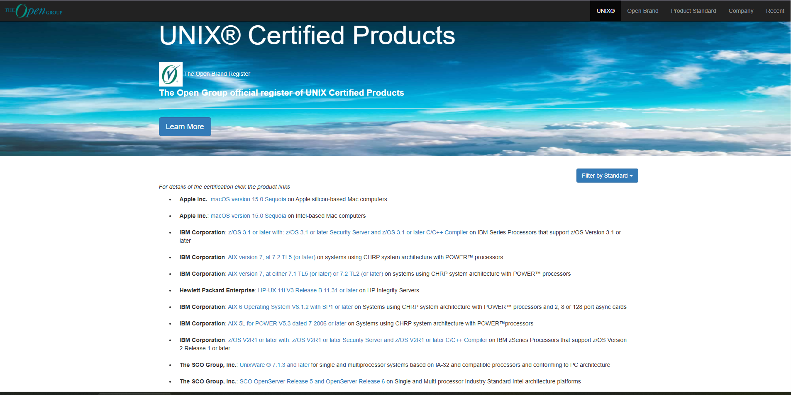

# 1.1 什么是 UNIX？

## 何谓 UNIX？

UNIX 的内涵经历了从具体技术实现到文化象征的演变过程。

20 世纪 60 年代末至 70 年代初，UNIX 是一款操作系统，最初采用汇编语言编写，后来主要以 C 语言重写。UNIX 系统起源于美国电话电报公司（American Telephone & Telegraph，AT&T）贝尔实验室。

20 世纪 80 年代以后，UNIX 逐渐成为一种 **[标准规范](https://www.opengroup.org/openbrand/register/xym0.htm)**。

在当今的大部分场景下，UNIX 不仅意味着一个法律上的 **[商标](https://www.opengroup.org/openbrand/register/index2.html)**，更是一种 **哲学思想** 和一系列 **软件工程原则** 的集合。

根据当前 UNIX 商标持有者开放组织（The Open Group）官网 [UNIX® Certification](https://www.opengroup.org/openbrand/register/) 所述，“Only systems that are fully compliant and certified according to the Single UNIX Specification are qualified to use the UNIX® trademark.”（只有完全符合并经过《单一 UNIX 规范》认证的系统，才有资格使用 UNIX® 商标）

---

查询美国专利商标局 UNIX 商标注册情况。

---

UNIX 操作系统认证查询网址：[The Open Group official register of UNIX Certified Products](http://www.opengroup.org/openbrand/register)。

根据开放组织要求，认证 UNIX 需要满足以下两项核心条件：

1. 技术标准要求：符合 [单一 UNIX 规范](https://www.opengroup.org/openbrand/register/xym0.htm)（Single UNIX Specification，SUS），该规范定义了 UNIX 系统必须实现的接口、命令、实用程序和库函数，确保了不同 UNIX 操作系统之间的兼容性。
2. 法律与费用要求：缴纳相应的 [认证费用](https://www.opengroup.org/openbrand/Brandfees.htm)。

常见的经过认证的 UNIX 操作系统是 Apple 公司的 macOS。从商标角度看，macOS 是标准的 UNIX 操作系统。~~故，要安装 UNIX 的人可考虑 macOS。~~

> **技巧**
>
> macOS/iOS 与 BSD 的关系
>
> 从历史角度看，macOS（以及由此衍生的 iOS、iPadOS 等）的核心层（Darwin）确实是基于 BSD 代码，并融合了其他技术。因此 macOS 系列操作系统可被视为独立的、类 BSD 操作系统分支，与 OpenBSD、NetBSD 和 FreeBSD 等系统具有同等地位。参见：Jason Perlow. Apple's Open Source Roots: The BSD Heritage Behind macOS and iOS[EB/OL]. (2024-07-08)[2026-03-26]. <https://thenewstack.io/apples-open-source-roots-the-bsd-heritage-behind-macos-and-ios/>.
>
> 看似是 Android 和 iOS 之争，实则是 Linux 与 BSD 之争。~~这也许还是大教堂与市集之争。~~

## 传统的 UNIX 哲学观（以《UNIX 编程艺术》为核心）

UNIX 哲学是在 UNIX 操作系统长期开发实践中逐渐形成的一套设计理念，由肯·汤普森（Ken Thompson）与丹尼斯·里奇（Dennis Ritchie）等早期核心开发者共同塑造。其核心主张可归纳为以下原则：

- **小即美**：程序应设计得简洁小巧，功能单一明确，便于理解和维护。
- **一个程序只做一件事**：每个工具专注于单一功能，通过组合多个工具协作完成复杂任务。
- **原型先行**：先快速构建可工作的原型，再逐步优化，避免过度设计。
- **可移植性先于高效性**：优先保证代码能在不同平台上运行，性能优化次之。
- **避免使用不必要的二进制格式或复杂表示**：使用简单、文本格式，便于人工阅读和处理。
- **沉默是金**：程序在正常执行时不输出多余信息，仅在出错时提示，成功操作无输出，不显示进度等。
- **避免仅用户界面**：应提供命令行接口，确保可通过脚本实现自动化操作。

> **思考题**
>
>> 1. UNIX 哲学一言以蔽之，即大道至简。“Keep it simple, stupid”。
>
>> 2. 小弗雷德里克·P. 布鲁克斯. 人月神话[M]. UMLChina, 译. 纪念典藏版. 北京: 清华大学出版社, 2023. ISBN: 978-7-302-63538-3
>
> 阅读上述文本和参考文献，如何理解 UNIX 哲学的局限性，以及背后的时代背景。

这些原则在当时的软件设计中相互配合，帮助开发者构建出简洁、高效、可维护的系统。

> **思考题**
>
>> Those who do not understand UNIX are condemned to reinvent it, poorly.（那些不懂 UNIX 的人注定要再造一个四不像式 UNIX）
>>
>> NASA. The Apollo Lunar Surface Journal and Apollo Flight Journal[EB/OL]. [2026-04-04]. <https://www.nasa.gov/history/alsj/henry.html>.
>
> 作者亨利·斯宾塞（Henry Spencer）并未明确批评哪个操作系统，那么，现在这句话更适合哪个常见的操作系统？为什么？

### 参考文献

- 埃里克·雷蒙德. 《UNIX 编程艺术》[M]. 北京：电子工业出版社，2012. ISBN：978-7-121-17665-4. 系统阐述 UNIX 哲学与软件工程实践原则。
- 迈克·甘卡兹. Linux/Unix 设计思想[M]. 北京:人民邮电出版社, 2012. ISBN: 978-7-115-26692-7. （已绝版）提炼 UNIX 系统设计核心思想与实践方法。
- The Open Group. The Open Group Standards Process[EB/OL]. [2026-03-25]. <https://www.opengroup.org/standardsprocess/certification.html>. 规范 UNIX 认证流程与技术标准框架。

## UNIX 的一段历史

UNIX 的诞生有其历史背景，这要从它的前身 Multics 开始说起。

### Multics

Multics 是一个对 UNIX 产生直接影响的重要项目。1964 年，麻省理工学院（Massachusetts Institute of Technology，MIT）推出了 **兼容分时系统**（Compatible Time-Sharing System，CTSS），这是当时最具创新性的操作系统。有了 CTSS 这种高效的操作系统，研究人员决定设计一个更好的版本——**多路复用**信息和计算服务（Multiplexed Information and Computing Service，Multics）系统。

Multics 旨在创造功能强大的新软件，以及比肩 IBM 7094 功能更丰富的新硬件，麻省理工学院邀请了两家公司来协助。

美国通用电气公司（General Electric，GE）负责设计及生产具备全新硬件特性、能更好地支撑分时及多用户体系的计算机。贝尔实验室在计算机发展早期就开发了自己的操作系统。

麻省理工学院邀请了贝尔实验室与美国通用电气公司共同开发 Multics。

最终 Multics 的开发陷入困境，该系统设计了大量程序及功能，且时常融入矛盾组件，导致系统过于复杂。1969 年，在贝尔实验室看来，作为信息处理工具，Multics 已无法实现为实验室提供计算服务的目标，且设计成本过高。同年 4 月，贝尔实验室退出 Multics 项目，仅麻省理工学院和美国通用电气公司继续开发。

### UNICS

UNICS 是 UNIX 的直接前身，它的诞生源于一个游戏项目。贝尔实验室退出 Multics 开发项目后，项目组成员肯尼斯·蓝·汤普森（Kenneth Lane Thompson）找到了一台数字设备公司（Digital Equipment Corporation，DEC）PDP-7 型计算机，该计算机性能有限，仅 4 KB 内存，但图形界面较为美观。Thompson 在其上开发了游戏 Space Travel（《星际旅行》）。PDP-7 的磁盘转速远低于计算机的读写速度，为解决这一问题，Thompson 编写了磁盘调度算法以提高磁盘总吞吐量。

> **技巧**
>
> 《星际旅行》已被移植，现在可以直接在网页上进行体验（[Space Travel](https://akr.am/st/)），移植后的项目源代码位于 [C port of Ken Thompson's Space Travel](https://github.com/mohd-akram/st)。
>
> ~~虽然操作简单，但还是看不懂怎么玩。~~

如何测试这个新算法？需要往磁盘写入数据，Thompson 需要编写一个批量写入数据的程序。

他需要编写三个程序，每周编写一个：创建代码的编辑器、将代码转换为 PDP-7 能运行的机器语言的汇编器，再加上“内核的外层——操作系统”即告完成。

新的 PDP-7 操作系统开发不久后，Thompson 与几位同事进行讨论，当时系统尚未命名，最初称为“UnICS”（**非复用信息和计算机服务**，Uniplexed Information and Computing Service），后改为 UNIX，更易于记忆。

## 课后习题

1. 查找 PDP-7 模拟器与早期 UNIX 源码存档，构建一个可运行的早期 UNIX 环境，并运行一个 C 语言的“Hello world”程序。
2. 在网页端体验 Thompson 最初的 Space Travel，并总结其玩法。
3. 试列举 SUS 规范与 Windows 操作系统设计与实现的差异。
