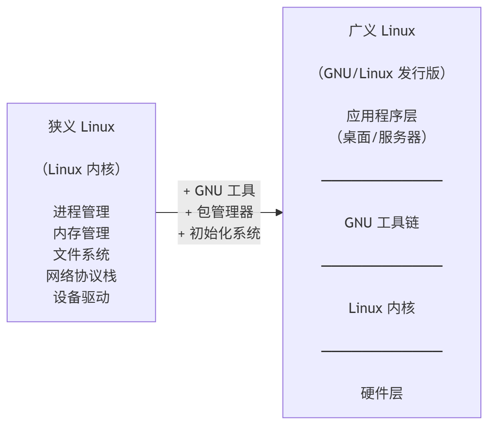

# 1.3 Linux 与类 UNIX

本节以 Linux 内核官方文档的定义为起点，阐述 Linux 作为 UNIX 克隆操作系统的技术架构与许可证体系，并说明其“类 UNIX”属性的法律与功能依据。

## 何谓 Linux？

Linux 是当今世界广泛使用的开源操作系统。Linux 在不同语境下含义不同：狭义上指 Linux 内核，广义上通常指完整的操作系统，即 GNU/Linux。Linux 内核官方文档对这一问题的回答如下：

> What is Linux?（什么是 Linux？）
>
> Linux is a clone of the operating system Unix, written from scratch by Linus Torvalds with assistance from a loosely-knit team of hackers across the Net. It aims towards POSIX and Single UNIX Specification compliance.（Linux 是 UNIX 操作系统的克隆版本，由 Linus Torvalds 从零开始编写，并在网络上一支组织松散的极客团队协助下完成。Linux 旨在实现对 POSIX 和单一 UNIX 规范的兼容）
>
> It has all the features you would expect in a modern fully-fledged Unix, including true multitasking, virtual memory, shared libraries, demand loading, shared copy-on-write executables, proper memory management, and multistack networking including IPv4 and IPv6.（Linux 拥有现代化、功能完备的 UNIX 系统所应具备的全部特性：真正的多任务处理、虚拟存储器、共享库、按需加载、共享写时复制可执行文件、完善的内存管理，并且支持多协议栈网络，包括 IPv4 和 IPv6）
>
> It is distributed under the GNU General Public License v2 - see the accompanying COPYING file for more details.（Linux 在 GNU 通用公共许可证 v2 下进行分发——更多有关细节，请参阅随附的版权文件）
>
> 参见 Linux Kernel Organization. What is Linux?[EB/OL]. [2026-04-04]. <https://www.kernel.org/doc/html/latest/admin-guide/README.html>.

以下框架图可更清晰地展示 Linux 系统的层次结构：

**核心系统工具层**包含 GNU 基础工具（如 bash、gcc、glibc 等）、包管理器和初始化系统等组件。**GNU 基础工具**是 GNU 项目开发的命令行工具和系统库，为操作系统提供基本功能。

Linux 的开发受 Minix 启发，后者是一种专用于教学的微内核操作系统，诞生于 UNIX 版权受限的背景之下。Linus Torvalds 时年 21 岁，就读于芬兰赫尔辛基大学计算机科学系。彼时芬兰大学体系中，学生入学后通常直接攻读硕士学位，本科仅为中间学位而非独立招生阶段，因此学制较为灵活；1991 年 Torvalds 仍处于学业的早期阶段。

GNU 与 Linux 的成功离不开 Minix 引发的社区讨论。1992 年，Andrew Stuart “Andy” Tanenbaum（Minix 作者）就内核架构与 Linus 展开激烈辩论，认为 Linux 的宏内核设计已然过时；Linus 则承认微内核在理论上更优，但从实用性角度为宏内核设计辩护。Linux 自始即采用宏内核架构，这场论战并未改变其架构选择，但使宏内核与微内核的优劣之争成为操作系统领域的经典议题。同一时期，Linus 原有的许可证禁止任何收费分发（包括收取介质成本），在社区请求与 GNU copyleft 兼容的推动下，Linus 于 Linux 0.12 版本将许可证更改为 GPL，并吸收 GNU 组件，逐步完善 Linux 的生态体系。

Linus Torvalds 的硕士毕业论文是 [《Linux: A Portable Operating System》](https://www.cs.helsinki.fi/u/kutvonen/index_files/linus.pdf)（Linux：一种可移植的操作系统），他在 1997 年（27 岁）获得理学硕士学位。由于赫尔辛基大学当时并无最长学习期限限制，他得以长期保留学籍。根据该校官网的说明，课程成绩的有效期为十年，但课程到期不会影响在大学继续学习的权利。官网明确指出：“课程到期不会影响在大学继续学习的权利。”（注：芬兰《大学法》（UNIVERSITIES ACT）规定了自 2005 年 8 月 1 日起，学位完成的目标时间和最长时间。）

> 我们探讨了在将 Linux 操作系统移植到多种 CPU 和总线架构时所暴露出的硬件可移植性问题。我们还讨论了软件接口的可移植性问题，尤其是与能够共享同一硬件平台的其他操作系统之间的二进制兼容性问题。文中描述了 Linux 所采取的方法，并对其中几个架构进行了更为详细的介绍。
>
> 论文摘要中文译文。

> **技巧**
>
> 几乎每颗英特尔处理器上的管理引擎（Intel Management Engine）都运行着基于 Minix 的微内核。自 ME 11（随 Skylake 处理器引入）起，Intel Management Engine 基于 Intel Quark x86 微控制器并运行 MINIX 3 操作系统。
>
> ~~或许基于 Minix 的微内核才是世界上最广泛部署的操作系统内核。~~

UNIX 标准 SUS 包含 POSIX 标准，前者是后者的超集。Single UNIX Specification 的基础卷是现有 POSIX.1 和 POSIX.2 规范的超集。Linux 实现了 POSIX 标准，但未获得 POSIX 认证：IEEE, The Open Group.

### 参考文献

- 杨天平，金如意.博洛尼亚进程述论[J].华东师范大学学报(教育科学版),2009,27(01):9-22.DOI:10.16382/j.cnki.1000-5560.2009.01.007. 关于芬兰学制的发展。
- 芬兰. Universities Act (No. 558/2009, amendments up to No. 644/2016 included) [Z]. 2009-07-24.
- The Open Group. The Base Specifications Issue 6, Preface[EB/OL]. [2026-04-23]. <https://pubs.opengroup.org/onlinepubs/009604299/frontmatter/preface.html>. 指出“These were selected since they were a superset of the existing POSIX.1 and POSIX.2 specifications and had some organizational aspects that would benefit the audience for the new revision.”
- Portnoy E, Eckersley P. Intel's Management Engine is a security hazard[EB/OL]. (2017-05-08)[2026-04-23]. <https://www.eff.org/deeplinks/2017/05/intels-management-engine-security-hazard-and-users-need-way-disable-it>.
- HandWiki. Intel Management Engine[EB/OL]. [2026-04-23]. <https://handwiki.org/wiki/Intel_Management_Engine>.
- jmcph4. Intel Management Engine[EB/OL]. [2026-04-23]. <https://jmcph4.dev/wiki/ime.html>.
- University of Helsinki. Expiry of Studies[EB/OL]. (2026-02-16)[2026-04-04]. <https://studies.helsinki.fi/instructions/article/expiry-studies>. 芬兰赫尔辛基大学官网的说明。
- POSIX Certification Policy[EB/OL]. (2012-12-05)[2026-04-04]. <http://get.posixcertified.ieee.org/docs/POSIX_Certification_Policy_v1.1.pdf>.
- Torvalds L. Linux: a Portable Operating System[D/OL]. Helsinki: University of Helsinki, 1997 [2026-04-04]. <https://www.cs.helsinki.fi/u/kutvonen/index_files/linus.pdf>. Linus 的论文。

## 狭义 Linux：操作系统内核

Linux 在不同语境下含义不同。狭义上，Linux 指 Linux 内核。[Linux kernel](https://www.kernel.org/) 项目始于 1991 年。

## 广义 Linux：GNU/Linux 操作系统

广义上，Linux 通常指完整的操作系统。GNU/Linux = Linux 内核 + GNU 等软件 + 包管理器。

**[Chimera Linux](https://chimera-linux.org/) 除外。**

Linux 的全称为 GNU/Linux。

从 GNU 这一递归缩写（GNU's Not Unix，意为“GNU 不是 UNIX”）可以看出，Linux 与 UNIX 并无直接的源流关系。

具体而言：

- GNU/Linux 发行版 = Ubuntu、RHEL、Deepin、openSUSE……
  - Ubuntu = Linux kernel + apt/dpkg + GNOME（默认桌面环境）
  - openSUSE = Linux kernel + libzypp/rpm（包管理器后端，支持 RPM 格式）+ KDE（默认桌面环境之一）

> **思考题**
>
> 1. 如果去掉文件系统、Linux 内核、Shell、systemd（init）、桌面环境、包管理器以及所有第三方软件，一种 Linux 发行版还剩下哪些内容？
> 2. 在上述组件全部移除，并将其重新组合后，若仍将该系统称为“发行版”，它与传统 Linux 发行版相比存在哪些本质区别？
> 3. 在这种情况下，该系统是否仍然可以视为原来的发行版？请说明理由。
> 4. 如果不能视为原来的发行版，是在移除哪一类关键组件之后，其不再具备“发行版”的属性？
> 5. 如果仍然可以视为原来的发行版，那么哪些部分可以认为真正继承自原有发行版，依据是什么？

> **技巧**
>
> 如有疑虑，建议亲自安装 [Gentoo](https://www.gentoo.org/downloads/)（stage3）或 [Slackware](https://www.slackware.com/)，若仍存疑虑可亲自体验 [Gentoo (stage1)](https://wiki.gentoo.org/wiki/Stage_file) 或 [LFS](https://www.linuxfromscratch.org/lfs/)。
>
> 上述操作较为复杂，需要一定的经验与基础知识。~~又陷入了前理解循环。~~

## Linus 与 Linux 基金会

“Linux”商标的所有权属于 Linux 的创造者 Linus Torvalds 本人，但由 Linux 基金会代为管理。Linux 基金会是美国旧金山的一家非营利组织（**501(c)(6)**），组织形式类似中国的行业联盟或商业协会。

Linux 基金会的官方网站是 <https://www.linuxfoundation.org>。

501(c)(6) 是指美国《国内税收法典》（*Internal Revenue Code*, IRC）中 C 章 6 款，现将其与 C 章 3 款做比较：

| 维度 | §501(c)(3) | §501(c)(6) |
| ---- | ----------- | ----------- |
| 法律依据 | 《美国国内税收法典》§501(c)(3) | 《美国国内税收法典》§501(c)(6) |
| 法定组织类型 | 公司、信托、基金会、基金等 | 商业联盟、商会、房地产委员会、交易所协会、职业体育联盟 |
| 法定目的 | 必须“专门（exclusively）”用于宗教、慈善、科学、公共安全测试、文学、教育；或促进业余体育；或防止虐待儿童/动物 | 不得以营利为目的（not organized for profit），用于促进一个或多个行业的共同商业利益，并改善商业条件 |
| 目的标准 | 虽写“exclusively”，司法解释为“主要目的测试（primary purpose test）”，不得“实质性（substantial）存在”非公益目的 | “主要用于促进行业共同商业利益”，行业自利性本身是合法目的组成部分 |
| 利润分配限制 | 严格禁止任何净收益向私人股东或个人分配（private inurement absolute prohibition） | 同样禁止净收益向私人分配（但成员共享行业收益属于允许结构） |
| 私人利益规则 | 严格 private benefit doctrine，仅允许附带性（incidental）私人利益 | 允许成员获得行业性共同利益（mutual benefit 本身即制度目的） |
| 游说限制 | 仅允许非实质性游说；可选择 §501(h) 额度制；超限可能导致失去免税资格 | 可进行游说；但会费中用于游说部分不得税前扣除（§162(e)） |
| 政治活动 | 绝对禁止参与或干预任何选举政治（Johnson Amendment） | 允许进行行业相关政治游说与倡议，但需遵守税务披露与费用拆分规则 |
| 捐赠税务处理 | 符合条件的捐赠可抵扣（§170 慈善扣除） | 不属于慈善捐赠；通常作为商业费用扣除（§162），但游说部分不可扣除 |
| UBIT（非相关业务税） | 适用（§511） | 适用（§511） |
| 失格后果 | 免税资格撤销 + 可能追溯征税 | 免税资格撤销 + 转为一般公司税制 |
| 法律本质 | 公共利益补贴型实体（public benefit entity） | 行业共同利益型实体（mutual benefit association） |
| 制度功能 | 国家通过税收补贴公共服务供给（教育、慈善、宗教等） | 为行业提供协调平台、降低交易成本、集中游说与政策表达 |

## UNIX-like 系统的概念界定

除获得正式 UNIX 认证的系统外，还有许多采用类似 UNIX 设计理念的操作系统。

UNIX-like 即类 UNIX，指基本符合 UNIX 标准，或基本遵守 POSIX 规范但未获得相应认证、商标使用权的操作系统。

该术语用于描述设计理念和技术实现上与 UNIX 高度相似但缺乏正式认证的系统。

当前主流操作系统中，许多遵循 POSIX 规范或采用类 UNIX 设计理念的操作系统可称为 UNIX-like，其典型代表包括 Linux 和各种 BSD 系统。

## 课后习题

1. 在现代 FreeBSD 环境中配置交叉编译工具链，构建并在 QEMU 中运行 4.4BSD-Lite2，记录交叉编译过程中遇到的工具链兼容性问题。
2. 查阅 SUS 与 POSIX 标准的正式文档，从系统调用接口、C 标准库函数和编译程序约定三个维度列举两者的异同。
3. 梳理 OpenRC 与 FreeBSD 原生 rc.d 框架在服务依赖解析机制上的差异。
