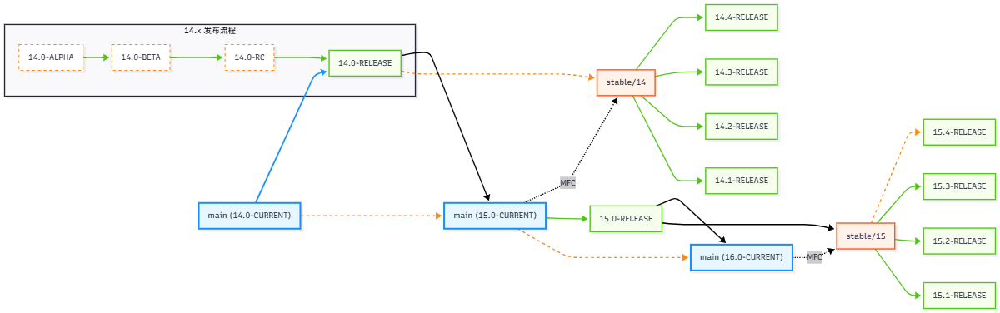
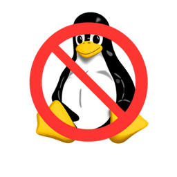

# 1.4 FreeBSD 导论

## FreeBSD 版本概述

FreeBSD 的版本管理体系分为以下类型（或开发阶段）：ALPHA、BETA、RC、RELEASE、CURRENT、STABLE。

**RELEASE** 版本适用于生产环境。**STABLE** 和 **CURRENT** 则属于开发分支，其中 FreeBSD 的 ***STABLE*** 分支与一般 Linux 发行版中的“稳定版”概念不同，其名称中的“稳定”指的是该分支的 ABI（Application Binary Interface，应用程序二进制接口）保持稳定，而非指系统整体稳定性，亦可理解为“固定”。（FreeBSD Wiki. FreeBSD Glossary STABLE[EB/OL]. [2026-03-26]. <https://wiki.freebsd.org/Glossary#STABLE>.）

ALPHA 是 CURRENT 进入 RELEASE 的第一步。具体流程是：CURRENT → ALPHA（进入 STABLE 分支）→ BETA → RC → RELEASE。

CURRENT 分支中的代码在经过充分测试后（需满足 MFC 最短三天的要求，MFC 指 `Merge From CURRENT`，类似于 `backporting` 即向后移植）会推送到 STABLE 分支，但这并不保证两个分支都没有重大缺陷。参见：FreeBSD Release Engineering[EB/OL]. [2026-03-26]. <https://docs.freebsd.org/en/articles/freebsd-releng/>.

> **警告**
>
> 使用非生产版本（如 CURRENT、STABLE、ALPHA、BETA、RC 等非 RELEASE 版本）的 FreeBSD 的用户会被社区推定为具备一定的探索精神、关注开发进展和邮件列表的意愿、动手实践的能力、积极反馈问题的意愿以及乐观的心态。但对大多数读者而言则存在较大困难且无实际必要。如果不满足上述条件，建议始终使用面向生产环境的 RELEASE！



> **注意**
>
> 该图展示的版本更迭关系较为简化，实际流程中 X.0-RELEASE 来自 X-STABLE 分支，而 X-STABLE 直接由 X-1.CURRENT 转化而来。

> **注意**
>
> 只有 ALPHA、BETA、RC 和 RELEASE（[且是一级架构](https://www.freebsd.org/platforms/)）才能使用命令 `freebsd-update` 更新系统，其余版本需通过源代码编译或使用二进制的 pkgbase 更新。
>
> FreeBSD 开发计划准备删除命令 `freebsd-update`，一律改用 pkgbase。
>
> 参考文献：FreeBSD Project. freebsd-update(8)[EB/OL]. [2026-04-23]. <https://man.freebsd.org/cgi/man.cgi?freebsd-update>.

## FreeBSD 项目宗旨

FreeBSD 项目有着明确的宗旨。FreeBSD 项目（FreeBSD Project）致力于提供一款真正的自由软件，实践自由软件的使命：使 FreeBSD 的代码得到最大程度的利用，让所有人，无论其目的为何，都能从中受益。简而言之，这一宗旨可概括为“只求我为人人，不求人人为我”的开放共享理念。

FreeBSD 项目的源代码中包含部分受 GNU 通用公共许可证（GPL）和 GNU 宽通用公共许可证（LGPL）授权的软件，项目方正持续努力减少其比重。尽管这些许可证要求开源而非闭源，但它们仍带来一定的法律挑战和额外复杂性。为更好地实现 FreeBSD 的宗旨，即尽可能提供无附加条件的软件以降低商业使用中的复杂性，FreeBSD 项目在可能的情况下更倾向于采用限制更少的 BSD 许可证。

> **思考题**
>
>> BSD 2 条款许可证摘录：“在满足以下条件的前提下，允许在源代码和二进制形式中 **重新分发** 和使用本软件”
>>
>> “你可以继续从上游获取 BSD 授权的原始源代码，但如果你使用了基于原 BSD 衍生代码但以 GPL 再授权的版本，则仍需遵循 GPL。这形成了一条从 BSD 到 GPL 的单向通道：一旦 BSD 源代码被并入 GPL 项目，就如同进入了‘黑洞’，即 **BSD 代码的 GPL 化** 是不可逆的。BSD 世界逐渐被 GPL 蚕食。但事实上，BSD 代码在开源和闭源世界都得到了最大程度的复用。”
>
> 1. 除了可以将 BSD 授权的软件转为专有软件外，还能怎样理解这种“重新分发”？在满足条件（主要是一些免责和版权声明）后，能以何种许可证再分发和重授权？
>
> 2. 为什么自由软件基金会称 BSD 2 条许可证和 GPLv2/GPLv3 兼容？如果 BSD 授权的软件 A 进入 GPLv2 项目 B 中成为其一部分。下游用户再分发时，在何种条件下，要求软件 A 也遵守 GPLv2 而非通过 BSD 协议转为专有软件？为什么？
>
> 3. 站在许可证的感染性角度，再理解 Linux kernel 的 GNU 化以及 FreeBSD 基本系统的去 GNU 化。
>
> 4. 怎样理解这种代码复用目的的成功达成？

## FreeBSD 开发模型

FreeBSD 的开发模型是一个完整的协作体系，包括存储库、基金会、社区、提交者和核心小组等多个组成部分。


## 什么是 FreeBSD？

FreeBSD 不是 Linux，也不是 UNIX 的克隆。FreeBSD 作为一款自由软件，其源代码公开且可自由使用、修改和分发。



FreeBSD 这个词语由两部分构成，即“Free”和“BSD”。

BSD 最初由加州大学伯克利分校（University of California, Berkeley）的计算机系统研究小组（CSRG）开发，他们将这一工作命名为 `Berkeley Software Distribution`（伯克利软件发行版）。FreeBSD 等 BSD 系统都是计算机系统研究小组（CSRG）工作的延续。

Free 包含自由（Liberty）和免费（Gratis）两种含义。

FreeBSD 日为 6 月 19 日。FreeBSD 基金会和社区在这天庆祝 FreeBSD 的生日。参考文献：FreeBSD Foundation. Join us to celebrate FreeBSD Day![EB/OL]. [2026-03-26]. <https://freebsdfoundation.org/freebsd-day/>.

## 谁在使用 FreeBSD

FreeBSD 的稳定性和可靠性使其在许多领域得到了广泛应用。以下是一些典型的应用案例。


图片来源 [FreeBSD 基金会宣传图](https://i.imgur.com/qW0IePB.png)。

- 华纳兄弟. 黑客帝国[EB/OL]. [2026-03-26]. <https://movie.douban.com/subject/1291843/>. 黑客帝国的特效就是在一组 FreeBSD 集群上制作的。另见 Urban M, Tiemann B. FreeBSD 技术内幕[M]. 智慧东方工作室，译. 北京：机械工业出版社，2002：2. ISBN: 978-7-111-10201-4、FreeBSD Project. FreeBSD Press Release: April 22, 1999[EB/OL]. (1999-04-22)[2026-03-26]. <https://www.freebsd.org/press/press-rel-1/>.
- The New Stack. Apple’s Open Source Roots: The BSD Heritage Behind macOS and iOS[EB/OL]. [2026-03-26]. <https://thenewstack.io/apples-open-source-roots-the-bsd-heritage-behind-macos-and-ios/>. Apple 的操作系统如 macOS、iOS 等大量复用了 BSD（不只是 FreeBSD）的技术栈。BSD 堪称 macOS 的开源基石。
- Sony. FreeBSD Kernel[EB/OL]. [2026-03-26]. <https://www.playstation.com/en-us/oss/ps4/freebsd-kernel/>. 索尼（Sony）的游戏机 PlayStation 4（PS4）和 PlayStation 5（PS5）使用的操作系统基于 FreeBSD。PlayStation 3（PS3）的 CellOS 和 PlayStation Vita（PSV）的操作系统也以 FreeBSD 和 NetBSD 为基础构建。
- FreeBSD Foundation. Netflix Case Study[EB/OL]. [2026-03-26]. <https://freebsdfoundation.org/netflix-case-study/>. 奈飞（Netflix）几乎所有网络活动（内容缓存/CDN）均基于 FreeBSD 设备运行。
- QNX. Search Results[EB/OL]. [2026-03-26]. <https://www.qnx.com/developers/docs/8.0/search.html?searchQuery=freebsd>. QNX 操作系统。QNX 作为一款微内核实时操作系统（RTOS），其内核为自主研发，并非基于 FreeBSD。QNX 以前是黑莓手机的操作系统。QNX 现在广泛应用为汽车安全操作系统——在主流座舱架构中，QNX Hypervisor 负责安全关键域（如仪表盘、ADAS），同时将 Android Automotive 作为客户操作系统运行于虚拟机中，以实现信息娱乐功能（参见：BlackBerry QNX. QNX Hypervisor 8.0[EB/OL]. [2026-04-17]. <https://blackberry.qnx.com/en/products/foundation-software/qnx-hypervisor>）。国内新能源车辆广泛采用了 QNX 操作系统，QNX 在汽车安全关键系统中占据重要市场份额。QNX 在网络子系统和部分用户空间组件中复用了 FreeBSD 的代码。
- Dell. PowerScale OneFS：了解基于源的路由[EB/OL]. (2024-05-28)[2026-03-26]. <https://www.dell.com/support/kbdoc/zh-cn/000020056/isilon-onefs-understanding-source-based-routing-sbr-in-isilon?lang=zh>. Dell EMC Isilon，戴尔的 Isilon（面向企业的 NAS 存储设备）设备使用的操作系统 OneFS 基于 FreeBSD。
- Beckhoff. TwinCAT/BSD: operating system for Industrial PCs[EB/OL]. [2026-03-26]. <https://www.beckhoff.com/en-en/products/ipc/software-and-tools/twincat-bsd/>. Beckhoff 倍福自动化控制系统的操作系统 TwinCAT/BSD。
- OpenHarmony. kernel_liteos_a[EB/OL]. [2026-03-26]. <https://gitee.com/openharmony/kernel_liteos_a/tree/master>. OpenHarmony LiteOS 内核引入了 FreeBSD 代码用于驱动程序等方面。

### 参考文献

- FreeBSD Foundation. Read how organisations are using FreeBSD across the globe[EB/OL]. [2026-03-25]. <https://freebsdfoundation.org/end-user-stories/>. FreeBSD 基金会官方版本，汇集了 FreeBSD 在各领域的典型应用案例。

## 为什么选择 FreeBSD

选择一款操作系统往往是基于多方面的考虑。下文将阐述选择 FreeBSD 的理由。

### 一句话原因：FreeBSD 能在这流变的世界中寻求理想的中道

相较于大多数主流操作系统或内核，FreeBSD 的 Kernel API/ABI 比较稳定。

FreeBSD 项目相对保守。FreeBSD 项目奉行最小惊讶原则（Principle of Least Astonishment，POLA），即设计须符合用户的习惯、期望和心智能力。FreeBSD 配置文件和系统组件不会频繁变化，这在大版本变动时尤为突出。FreeBSD 也谨慎对待破坏性变化（Breaking change），要求在大版本内保持 ABI 的稳定。

FreeBSD 不仅仅在生命周期内不变，大版本更新也具有连贯性和稳定性，可便捷实现大版本间的迁移。FreeBSD 上的软件版本可以滚动更新，不会锁定特定版本（如 Python 等）。

### 选择 FreeBSD 的一般原因

- 追求软件的稳定性与新颖性，既需具备二进制源，又须支持编译安装。除了 FreeBSD 之外难以找到这样的开源系统（~~VoidLinux 还是算了吧~~）。
- BSD 赋予了更纯粹的自由：不以限制自由来保障自由，而以信任与开放成就真正的自由。
- FreeBSD 是学院派工程实践的成果，也是 UNIX 哲学的现代延续。
- 当其他操作系统生态愈发碎片化的同时，FreeBSD 的一体化设计避免了持续的选择困境，但这并非限制，若有需求，亦可便捷地进行修改。
- BSD 是一款完整的操作系统，而不是内核。内核和基本系统作为一个项目来整体维护。缺乏基本系统的概念，将带来持续的混乱与违背直觉的行为。
- FreeBSD 社区是由核心小组领导的。
- FreeBSD 无论社区还是开发者都秉持着“慢就是快，快就是慢”的哲学思想。~~我们的确需要花些时间慢下来，审视自己的一切，无论知识还是自我。花些时间在路旁的花朵石子上面，也许并不是浪费时间，无所事事。~~

- 教育与研究：FreeBSD 项目将内核与用户空间整合在同一个代码仓库中，极大地方便了研究和学习，且代码注释清晰丰富。可便捷地查阅特定功能的实现方式。

> **技巧**
>
> 还可以从更多视角审视选择 FreeBSD 的原因：
>
> - 从佛法来说，因为缘分。万物缘起性空，有缘相聚，会者定离。万般诸相皆如此。
>
> - 从基督教来讲，这是主的指引。上帝在永恒的现在中创世。就像《出埃及记》一样，看上去是自己的选择，实际上都是主的安排。
> - 从黑格尔来讲，由于辩证否定。FreeBSD 是 UNIX 的直接后裔，而很多协议又脱胎于 UNIX，所以注定了要来到这里。

### 选择 FreeBSD 的技术性原因

#### 一般技术原因

- FreeBSD 基本系统的配置文件与第三方软件配置文件相分离，系统级配置文件与用户配置文件相分离。FreeBSD 的文件系统层次结构遵循明确的组织原则，参见 [hier(7)](https://man.freebsd.org/cgi/man.cgi?query=hier&sektion=7)。~~再也不用到处用 find 命令查找某个 `.conf` 文件到底安装在哪了。~~
- 由于基本系统的存在，第三方的软件几乎不影响系统的稳定性。FreeBSD 在软件更新和系统稳定之间找到了平衡点。
- 通过 BSD 的 Ports 可以编译安装软件，自由配置。
- 不会锁定软件版本。例如 Python、GCC 等常见的系统依赖软件。但所有的 FreeBSD 都共用相同的 Ports，无论新旧系统，其第三方软件的版本都是相同的；仅极个别软件和系统版本硬捆绑，其余所有软件都可滚动更新。
- 由于 Ports 系统的存在，旧版 FreeBSD 系统仍能正常获取并编译软件，并非在达到生命周期终点（EoL）后便无法获得软件更新。
- 在 FreeBSD 项目中，文档不再是附属品。FreeBSD doc 项目与 src 项目是同等地位的，不分高下。
- 可便捷地为根分区（`/`）配置使用 ZFS 文件系统。ZFS 被公认为功能最为完备的文件系统之一。
- 接近 2 年的版本发布周期和 4 年的维护周期（自 FreeBSD 15 起由原先的 5 年调整为 4 年）赋予了 FreeBSD 稳定性。
- Jail 与 bhyve 虚拟化不需要额外安装和维护底层虚拟化堆栈，也不需要为每个实例启动完整的操作系统内核和用户空间，节约系统资源。
- 传统的 BSD init 引导，回归简单，回归真实可见的纯文本。
- DTrace 框架与 GEOM 存储框架。
- Linux 二进制兼容层可运行 Linux 软件，且运行性能通常不逊色于 Linux。
- FreeBSD 的驱动大体上与内核解耦合。
- FreeBSD 秉持人人自由开发的理念，可以直接在 GitHub 上[提交代码](https://github.com/freebsd/freebsd-src/pulls)，或者注册账号在 <https://reviews.freebsd.org/> 进行大规模变更。
- FreeBSD 的代码风格是 Kernighan & Ritchie 经典著作 The C Programming Language（中译本：Kernighan B W, Ritchie D M. C 程序设计语言[M]. 徐宝文，李志，译. 第 2 版. 北京：机械工业出版社，2019. ISBN: 978-7-111-61794-5.）中使用的风格。

#### 安全原因

- Leidinger 博客：Leidinger, J. FreeBSD Security Hardening with Compiler Options[EB/OL]. (2025-05-24)[2026-03-26]. <https://www.leidinger.net/blog/2025/05/24/freebsd-security-hardening-with-compiler-options/>. FreeBSD 项目对部分 Port 进行了加固。另见 Bug 284270：FreeBSD Project. Bug 284270 - Security: FreeBSD Security Hardening[EB/OL]. [2026-03-26]. <https://bugs.freebsd.org/bugzilla/show_bug.cgi?id=284270>.
- 披露的安全漏洞少于其他主流操作系统（尽管可能存在样本数量较少的客观因素）。截至 2025 年 9 月，FreeBSD 基本系统（用户空间与内核）的 CVE 漏洞数量约为 Linux 内核的二十分之一（根据 CVEdetails.com. CVE security vulnerability database. Security vulnerabilities, exploits, references and more[EB/OL]. [2026-03-26]. <https://www.cvedetails.com/>. 统计），而 Linux 内核的 CVE 数量远超 Windows（二者并非同一维度：Linux 内核仅为内核，而 Windows 通常指全部组件）。同期，OpenBSD 的 CVE 漏洞数量约为 FreeBSD 的 40%。
- 可以避免在产品和架构中出现共同故障点。
- 安全事件审计。
- Robert Watson, Stacey Son. TrustedBSD - FreeBSD Wiki[EB/OL]. (2022-09-15)[2026-03-26]. <https://wiki.freebsd.org/TrustedBSD/>. FreeBSD 集成了标准 UNIX DAC、ACL、TrustedBSD MAC 安全框架（基于 POSIX®.1e 草案的安全扩展）
- 集成 W^X 策略，参见 D28050 代码审查：kib. Implement enforcing write XOR execute mapping policy[EB/OL]. (2021-01-08)[2026-03-26]. <https://reviews.freebsd.org/D28050>.
- 默认启用了内核和用户空间的 PIE 和 ASLR。ASLR 最初由 D27666 代码审查提出（2020-12-18），PIE 默认启用由 D28328 实现，二者合并至 HEAD 后，自 FreeBSD 13.2-RELEASE（2023 年 4 月 11 日）起 ASLR 对 64 位可执行文件默认启用。参见 D27666 代码审查:mw. Enable ASLR by default for 64-bit executables[EB/OL]. (2020-12-18)[2026-04-17]. <https://reviews.freebsd.org/D27666>; D28328 代码审查:mw. Enable PIE by default on 64-bit architectures[EB/OL]. [2026-04-17]. <https://reviews.freebsd.org/D28328>; FreeBSD 13.2-RELEASE 公告:FreeBSD Project. FreeBSD 13.2-RELEASE Announcement[EB/OL]. (2023-04-11)[2026-04-17]. <https://www.freebsd.org/releases/13.2R/announce/>.
- FreeBSD 通过了 National Institute of Standards and Technology（NIST，美国国家标准及技术研究所）安全软件开发框架（SSDF）认证，参见 FreeBSD 基金会 SSDF 认证新闻：FreeBSD Foundation. FreeBSD Foundation Announces SSDF Attestation[EB/OL]. (2023-11-03)[2026-03-26]. <https://freebsdfoundation.org/news-and-events/latest-news/freebsd-foundation-announces-ssdf-attestation/>.
- 实现了 FreeBSD 14 CIS 基准。参见 FreeBSD 基金会 CIS 基准博客：FreeBSD Foundation. New CIS® FreeBSD 14 Benchmark: Secure Your Systems with Expert-Guided Best Practices[EB/OL]. (2024-08-19)[2026-03-26]. <https://freebsdfoundation.org/blog/new-cis-freebsd-14-benchmark-secure-your-systems-with-expert-guided-best-practices/>.
- 正在实现 FreeBSD 的零信任构建，参见 Sovereign Tech Agency 相关赞助。
- 基于 GEOM 框架的全盘加密（含 ZFS、Swap）方案。
- 正在改进软件物料清单（Software Bill of Materials，SBOM），参见 Sovereign Tech Agency 相关赞助。
- Capsicum 框架，并且已经对基本系统中大量工具进行了能力化加固。参见 Capsicum Wiki：FreeBSD Project. Capsicum - FreeBSD Wiki[EB/OL]. [2026-03-26]. <https://wiki.freebsd.org/Capsicum>.
- FreeBSD 内核拥有五种不同的安全级别（securelevel）可以自由选择，参见 mitigations 手册页：FreeBSD Project. mitigations - FreeBSD Security Vulnerability Mitigations[EB/OL]. [2026-03-26]. <https://man.freebsd.org/cgi/man.cgi?query=mitigations>. 手册页还介绍了 FreeBSD 上若干安全漏洞缓解手段。

#### 参考文献

- FreeBSD Foundation. Submitting GitHub Pull Requests to FreeBSD[EB/OL]. [2026-03-25]. <https://freebsdfoundation.org/our-work/journal/browser-based-edition/configuration-management-2/submitting-github-pull-requests-to-freebsd/>. 详解 FreeBSD 通过 GitHub 接受贡献的流程与规范。
- FreeBSD Project. Contribution Guidelines for GitHub[EB/OL]. [2026-03-25]. <https://github.com/freebsd/freebsd-src/blob/main/CONTRIBUTING.md>. FreeBSD 源代码贡献的官方指导与要求。
- Linux Kernel Documentation. Linus Torvalds 是决定改动能否进入 Linux 内核的最终裁决者[EB/OL]. [2026-03-25]. <https://www.kernel.org/doc/html/latest/translations/zh_CN/process/submitting-patches.html>. 展示 Linux 内核开发的集中式决策模式。
- Linux Kernel Documentation. Linux 内核编码风格[EB/OL]. [2026-03-25]. <https://www.kernel.org/doc/html/latest/process/coding-style.html>. 规范 Linux 内核代码风格与格式要求。
- Linux Kernel Documentation. Linux 内核开发是个较为封闭的过程[EB/OL]. [2026-03-25]. <https://www.kernel.org/doc/html/latest/process/submitting-patches.html>. 说明 Linux 内核开发的参与门槛与流程。
- Cdaemon. Sandbox Your Program Using FreeBSD's Capsicum[EB/OL]. [2026-03-25]. <https://cdaemon.com/posts/capsicum>. FreeBSD 安全沙盒框架的基本原理与使用方法。

### 选择 FreeBSD 的社会意义

#### 红帽公司影响下的 Linux 生态偏向

GNOME、Xorg（X11）、D-Bus、systemd、PulseAudio、Wayland、PipeWire 等主流 Linux 项目实际上受到红帽公司（Red Hat）的显著影响，且大多难以完全适配其他类 UNIX 操作系统。

目前 FreeBSD 上的桌面部件的缺失很大程度上是因为它们对 Linux 特有函数库存在较强依赖，例如包含 `ip` 命令的 `iproute2` 软件包。更主要的原因则是这些桌面或部件与 systemd 存在深度捆绑或强制依赖关系，比如 `NetworkManager`。而 Samba 开发者则说“We use Linux, we develop for Linux, all others please submit patches”（我们使用 Linux，为 Linux 开发，其他系统的用户请自行提交补丁）FreeBSD 社区将此类现象称为“Linuxism”（Linux 主义/Linux 偏向）。

这种行为将导致何种后果尚不得而知，但此类程序正变得越来越多，并有成为主流的趋势。许多开发者在开发程序（如 `todesk`）时也不再考虑对传统 init 系统的兼容。Java 程序亦逐渐丧失了可移植性，FreeBSD 上的 Eclipse 近两年未获更新，其原因亦在于此类捆绑问题（D'Pong P. Bug 562443 - SWT spams temp folder with innumerable folders[EB/OL]. (2020-05-26)[2026-04-05]. <https://gitlab.simantics.org/simantics/eclipse/eclipse.platform.swt/-/commit/19153b908d6d4cedcbd59824686717502cfde4f7>.）若此趋势持续，可运行在 Linux 上的程序的可移植性可能进一步降低。

目前 FreeBSD 所面临的困境，可能是未来其他系统也会遇到的。

- 选择 FreeBSD，即选择保留自由软件的根基。
- 选择 FreeBSD，即选择保留一份真正自由的操作系统。能够使开源事业继续坚持下去，并践行真正的 UNIX 哲学。

#### FreeBSD 基金会重大捐赠事件

> 上周，我向 FreeBSD 基金会捐赠了 100 万美元，FreeBSD 基金会支持着开源操作系统 FreeBSD。FreeBSD 帮助了数百万程序员追随他们的热情、实现创意。我自己就是受益者。在 90 年代末，我开始使用 FreeBSD，那时我经济拮据，住在政府提供的住房中。在某种程度上，FreeBSD 帮助我摆脱了贫困——我能进入 Yahoo!（雅虎）工作的重要原因是他们使用 FreeBSD，而这正是我首选的操作系统。多年后，当 Brian 和我开始创建 WhatsApp 时，我们依然使用 FreeBSD 来支撑我们的服务器运营，直到今天亦如此。
>
> 我发布这项捐赠的消息，是希望让更多人看到 FreeBSD 基金会所做的有益工作，并激励他人也能支持 FreeBSD。我们大家都会受益，如果 FreeBSD 能够继续为像我一样的人提供机会，帮助更多的移民子女脱贫，帮助更多的初创公司取得成功，甚至是具有变革性的成果。
>
> ——WhatsApp 原 CEO 及创始人 Jan Koum（FreeBSD Foundation. Updated! – FreeBSD Foundation Announces Generous Donation and Fundraising Milestone[EB/OL]. (2014-11-17)[2026-04-05]. <https://freebsdfoundation.org/blog/updated-freebsd-foundation-announces-generous-donation-and-fundraising-milestone/>.）

#### 诚实与可信

像 FreeBSD 这样默默地在后台工作以至于几近被用户遗忘的系统，堪称老古董。如果每日不时出现一些蓝屏报错、Kernel Panic 抑或“内部错误”、`You are in emergency mode`、`BusyBox (initramfs)`、`grub rescue>` 等，反而能提醒用户自己的存在。

目前，大多数将 Linux 用作专用设备操作系统，或基于其他 GPL 软件构建商业产品的公司，并未严格遵守 GPL 协议发布其修改后的代码。部分国内企业对 GPL 的含义认识不足，仅将“免费”视为唯一考量。那些为规避 GPL 强制开源规定而采取规避措施的企业产品，其合规性与技术可信度均存疑。抢注开源软件商标的现象亦时有发生。相较而言，采用 FreeBSD 的公司在许可证合规方面更为规范、可靠，亦切实推动了 BSD 代码的广泛复用。纵然有人认为 FreeBSD 已趋衰落，事实上，大量用户可能始终受益于 FreeBSD 技术的支撑。

##### 参考文献

- 王波. FreeBSD 在中国的未来[M]//王波. FreeBSD 使用大全. 第2版. 北京：机械工业出版社，2002：前言. ISBN: 978-7-111-10286-1. 探讨了 FreeBSD 在中国的发展前景与应用前景。

## FreeBSD 项目治理结构

### 源代码存储库

FreeBSD 项目历史悠久，其使用的版本控制工具历经了 CVS、SVN、Git。多年来，FreeBSD 的中央源代码树由 CVS（Concurrent Versions System）维护，该工具免费提供源代码控制功能。2008 年 6 月，项目切换至 SVN（Subversion），因为随着源代码树的快速扩张和已存储历史记录的大量增加，CVS 的技术局限性日益明显。文档项目和 Ports 集合的存储库也分别于 2012 年 5 月和 2012 年 7 月从 CVS 迁移至 SVN。2020 年 12 月，项目将源代码和文档存储库迁移至 Git，Ports 集合随后于 2021 年 4 月完成迁移。目前使用 Git 进行协作开发。

FreeBSD 项目的存储库分为三个：freebsd-src（源代码）、freebsd-ports（Ports 软件移植）、freebsd-doc（文档）。三个项目地位平等。

### FreeBSD 基金会

FreeBSD 基金会是美国科罗拉多州博尔德的一家 501(c)(3) 非营利机构，致力于在全球范围内支持和推广 FreeBSD 项目及社区。基金会通过项目资助为软件开发提供资金，并配备专职人员以即时应对紧急问题和实现新功能。基金会购买硬件以改善和维护 FreeBSD 基础设施，资助人员以提高测试覆盖率、持续集成和自动化水平。基金会通过在全球技术会议和活动中推广 FreeBSD 来为其进行宣传。基金会还提供研讨会、教育材料和演示，以招募更多用户和贡献者加入 FreeBSD。此外，基金会还代表 FreeBSD 项目执行合同、许可协议及其他需要认可法律实体的法律安排。基金会的所有权力集中在董事会，董事由现有董事会成员选举产生（新董事仅限现任董事提名），每位董事任期 1 年，可连选连任。

在大部分国家，FreeBSD 商标由 FreeBSD 基金会持有。

### FreeBSD 社区

FreeBSD 项目通过网络进行远程开发。

FreeBSD 社区由来自全世界各地的开发者和用户构成。FreeBSD 社区并不是一个法律实体，也无固定办事处。FreeBSD 社区不仅是英文社区，还有中文、俄语、韩语、日语等社区。

### 提交者

提交者是指那些有权力直接写入 FreeBSD 存储库的人。若要成为提交者，须经过导师机制，必须由已有提交者推荐。为了防范潜在的安全风险，提交者并非终身制：对于 `freebsd-src` 和 `freebsd-doc`，提交者在 18 个月内应有一次提交；对于 `freebsd-ports` 则是 12 个月。非活跃提交者的权限将被暂停，但可以申请恢复。

### FreeBSD 核心小组

FreeBSD 核心小组是 FreeBSD 项目的最高领导机构，按章程由 9 名成员组成，采取集体领导制度，每位成员分管不同的子项目。FreeBSD 核心小组负责授予或撤销提交者权限及账户、执行行为准则（CoC）、管理项目子团队等。

FreeBSD 核心小组选举每两年举行一次，成员可以连选连任。只有在过去 12 个月内有过提交的提交者（视为活跃提交者）才拥有选举权和被选举权。活跃开发者可以表决罢免 FreeBSD 核心小组成员。此外，核心团队还负责招募新的核心团队成员，以替代离任的成员。

历史上并未出现每两年核心小组所有成员都被完全轮替的情况（即全体都是新成员），一位核心小组成员在实践中通常会连任两届或更多届。核心小组成员和 FreeBSD 董事会成员往往存在交叉任职的情况。

FreeBSD 核心小组成员并不直接从中获取任何利益，同样也都是志愿者。有些成员可能会接受 FreeBSD 基金会的雇佣或赞助来参与特定项目的开发。

## UNIX 之船：FreeBSD 是不是 UNIX？

关于 FreeBSD 与 UNIX 的关系，始终是一个引人深思的话题。该问题远非表面所见般清晰明确。诸多讨论者，甚至是那段岁月的亲历者，也难以给出明确回答或澄清。或者只是简单地说，BSD 并未进行过任何 UNIX 认证，没有持有法律上的商标便简单定论；更有甚者只是笼统地说 FreeBSD 是 UNIX 的延续者与正统继承者，仅是“有实无名”；另有观点认为，BSD 之于 UNIX，正如 Linux 之于 UNIX。

上述回答之所以存在分歧，原因在于该问题并非可简单套用法律商标归属或代码继承性加以分析的纯粹技术性难题。这牵涉一个深刻的本体论哲学问题，究竟是不能两次踏进同一条河流，还是一次也不能踏进同一条河流？（类似的问题如谷堆问题、秃头问题，感兴趣的读者可参见 SEP 条目 Identity Over Time[EB/OL]. [2026-03-26]. <https://plato.stanford.edu/entries/identity-time>. Sorites Paradox[EB/OL]. [2026-03-26]. <https://plato.stanford.edu/entries/sorites-paradox/>.）。对这个问题的回答如何，映射着哲学观与科学技术观。

>> **忒修斯之船**
>>
>>忒修斯和雅典青年安全返航所乘的是有三十支桨的大帆船，雅典人把这只船一直保存到德米特里·法勒琉斯的时代。他们一次又一次地拆掉了朽烂的旧船板，换上坚实的新船板。从此以后，这只船就成为哲学家们就事物的发展问题展开争论时经常援引的实例，一派认为它还是原来那只船，另一派争辩说它已不再是原来的船了。
>>
> - Plutarch. 希腊罗马名人传[M]. 黄宏煦，陆永庭，吴彭鹏，译. 北京：商务印书馆，1990：23.
>
> **思考题**
>
> 1. 如果这艘船替换了若干组件，这艘船是不是忒修斯之船？
>
> 2. 如果有一天，这艘船原有的所有组件都被完全替换了一遍，这艘船还是不是忒修斯之船？
>
> 3. 如果将所有替换下来的组件拼凑起来，组成一艘新船，这艘船是不是忒修斯之船？

BSD 操作系统并非复制品，而是 AT&T Research Unix 操作系统的开源衍生版本，也是现代 UNIX® System V 的先驱。在 4.4BSD 以前，BSD 全称为 BSD UNIX。


最初，UNIX 是 AT&T 开发的操作系统。在 20 世纪 70 年代末，加州大学伯克利分校的计算机系统研究小组（CSRG）开始对 UNIX 进行深入研究，并为其开发了大量用户空间的程序，形成了名为 BSD 的新系统。随着时间推移，BSD 系统逐渐发展，加入了许多创新，比如实现了 TCP/IP 协议栈。到了 90 年代初，CSRG 发起了重新实现 AT&T 专有代码的工作，发布了 Networking Release 2（Net/2）。然而，Net/2 中仍残留少量 AT&T 代码，这成为日后 USL 诉讼的导火索。直至 1994 年诉讼和解后发布的 4.4BSD-Lite，才彻底移除了所有 AT&T 代码。此后，BSD 系统分裂为多个项目：1993 年 FreeBSD 和 NetBSD 诞生，1995 年 OpenBSD 从 NetBSD 中复刻出来，2003 年 DragonFlyBSD 从 FreeBSD 中复刻出来。

如果查阅 FreeBSD 的源代码，还会看到早期开发者在 1982 年留下的注释和版权声明：

```C
/*-
 * SPDX-License-Identifier: BSD-3-Clause
 *
 * Copyright (c) 1982, 1986, 1993
 *	The Regents of the University of California.  All rights reserved.

 ……以下省略许可证原文……

 */
```

上面这段版权声明出自源代码文件 `sys/sys/_timespec.h`。

> **思考题**
>
> 如何理解 FreeBSD 与 UNIX 的关系？

## FreeBSD 当前困境

FreeBSD 具有诸多优势，但也面临着现实的挑战。

- 大型技术企业对 FreeBSD 支持不足，如长久以来未提供 GitHub Actions 支持，NVIDIA CUDA 亦未予重视，在 AI 与 LLM 时代明显滞后。
- FreeBSD 项目缺乏对欧洲和北美以外地区的关注与投入。
- 相比其他开源项目中“仁慈的终身独裁者”模式，集体领导在 FreeBSD 项目中并未显现出明显优势，有时甚至可能导致责任分散、效率低下的问题（即“集体行动困境”）。部分分管 FreeBSD 子项目的核心成员对项目本身的了解和关注尚有不足，面对若干问题亦难以有效决策和承担责任。
- FreeBSD 项目整体风格偏于保守，新技术的引入往往需要数年跨越多个大版本。通常需等待已有技术轮替一到两代后才会引入；引入后亦往往缺乏后续关注与维护开发。
- FreeBSD 系统在部分方面尚欠现代化，缺乏某些现代操作系统应有的特性。尤其是在嵌入式方面仍有较大提升空间。
- FreeBSD 未在基本系统中提供预配置的桌面环境。
- FreeBSD 的硬件驱动支持相对有限。
- 关于 FreeBSD 的学习资料相对较少。
- FreeBSD 的开发者数量较少，且对外部贡献者的反馈往往不及时。
- FreeBSD 基金会、期刊、Bug 报告系统等对外部贡献者的反馈也常有不及时的情况。
- FreeBSD 文档项目曾停滞多年，个人贡献者除季度报告外的提交事实上很难被接纳；src 和 Ports 项目也同样难以接纳新的个人贡献者。
- 尚未完全支持安全启动（Secure Boot）。
- 对 TPM 的支持有限。
- 由于存在“Linuxism”（对 Linux 特有特性的依赖），导致许多软件（如 NetworkManager）无法直接移植，桌面环境组件也因此难以完善。
- 由于 FreeBSD 项目的基本目标和设计理念，其基本系统不包含某些在 Linux 发行版中常见的软件和命令。
- FreeBSD 支持的两款主要文件系统 ZFS 与 UFS，其存储空间通常只能扩大，难以直接缩小。
- FreeBSD 在面向最终用户的上层应用生态方面有所欠缺，即使拥有类似 Docker 的底层技术 Jail，也未能形成成熟的生态；其虚拟化技术 bhyve 也有待改进。

## FreeBSD 重要历史节点

- 1961 年分时操作系统（Timesharing OS）

在 20 世纪 60 年代初，分时操作系统诞生了。1961 年 11 月，麻省理工学院的 Fernando Corbató 在 IBM 709 上首次演示了兼容分时系统（CTSS），这是最早的分时系统之一。同期，英国曼彻斯特项目（Manchester Project in England）设计的 Atlas 计算机上也实现了 Atlas 监控程序，该系统于 1962 年 12 月正式投入运行，首次将虚拟存储器投入实际使用——虚拟存储器的概念则由德国物理学家 Fritz-Rudolf Güntsch 于 1956 年在其博士论文中率先提出（参见：Denning P J. Virtual Memory[J]. ACM Computing Surveys, 1970, 2(3): 153-189）。在那个时代，分时共享系统意味着两个人共用同一台计算机，通常需要安排一张小时时间表来规划他们使用计算机的时间。

- 1964 年 MULTICS（**多路复用** 信息和计算服务）

Multics 最初的规划与开发始于 1964 年，地点位于马萨诸塞州的剑桥市。一开始，Multics 是由麻省理工学院（Fernando Corbató 领导的 MAC 项目）主导的项目；1965 年，通用电气公司和贝尔实验室加入，形成三方合作。开发于专为操作系统设计的通用电气 645 计算机上；首个完整的系统于 1967 年 1 月交付给麻省理工学院。

- 1969 年 UNIX（UNIX 操作系统）

在贝尔实验室退出 Multics 项目前，Dennis Ritchie 和 Ken Thompson 已经意识到了 Multics 的潜力。1969 年，Ken Thompson 在一台闲置的 PDP-7 计算机上开始着手开发一款新程序，这个程序被称为 Unics（Uniplexed Information and Computing Service，**非复用** 信息和计算服务）。随后在 1971 年，他们以开发文字处理系统的名义从贝尔实验室法务部门获得资金，购买了一台 PDP-11/20 计算机，将 Unics 移植到了这台性能更强的机器上。

- 1973 年 UNIX 代码迁移到 C 语言

Dennis Ritchie 决定为 UNIX 开发一种高级语言，使其语句能编译成少数几条机器指令。这促使他开发了 C 编程语言。1973 年夏天，第四版研究 UNIX（Research Unix V4）使用 C 语言重写了内核（Thompson 曾在 1972 年做过尝试但放弃了）。这使得 UNIX 具备了可移植性，从而改写了操作系统的历史。

- 1974 年加州大学伯克利分校引入 UNIX

1974 年，加州大学伯克利分校的 Bob Fabry 教授从 AT&T 获得了 UNIX 的源代码许可证。Bob Fabry 此前在 1973 年的国际计算机学会（Association for Computing Machinery，ACM）操作系统原理研讨会上见过 UNIX 第 4 版，并有意将其引入加州大学伯克利分校。该校的计算机系统研究小组（CSRG）开始修改和改进 AT&T Research Unix，并将修改后的版本称为“BSD Unix”或“BSD”。

- 1978 年 3 月 9 日 1BSD 发布

基于 UNIX 创建的伯克利软件发行版（1BSD）是 UNIX 第六版的一款附加组件，而非独立完整的操作系统。此版本发行了大约 30 份。

- 1979 年 5 月 10 日 2BSD 发布

第二款伯克利软件发行版（2BSD）发布于 1979 年 5 月。涉及 1BSD 的软件更新，以及由 Bill Joy 新开发的两个至今仍在 UNIX 系统上使用的程序：vi 文本编辑器（ex 的可视化版本）和 Csh。2BSD 是 Bill Joy 参与 PDP-11 相关工作的最后一个 BSD 版本，发行了约 75 份。

- 1980 年 4 月 DARPA 的赞助

在 1980 年初，美国国防高级研究计划局（DARPA, Defense Advanced Research Projects Agency）正在寻找一种有助于军事项目的操作系统。基于 3BSD 的成功，Bob Fabry 于 1979 年秋向 DARPA 提交了提案，建议伯克利为 DARPA 社区开发 3BSD 的增强版本。1980 年 4 月，DARPA 与伯克利签订了为期 18 个月的合同，开始赞助伯克利进行相关工作。

- 1983 年 8 月 4.2BSD 发布

4.2BSD 正式发布于 1983 年 8 月。这是在 Bill Joy 离开（伯克利），并与他人创建了 Sun Microsystems（太阳计算机系统公司）后（1982 年）的第一个版本。该版本也首次引入了 BSD 的吉祥物：出现在 John Lasseter 的画作中，并作为 USENIX 发行的纸质手册封面。该版本发行了 1000 余份拷贝，意味着已有大量计算机在使用。

- 1988 年 6 月 4.3BSD-Tahoe

随着开发人员逐渐淘汰老旧的 VAX 平台，4.3BSD-Tahoe 发布了针对 Power 6/32 平台（TAHOE）的版本。这次发布颇具价值，因为它将 BSD 中的机器相关代码同机器无关代码剥离开来，从而提高了后续系统的可移植性。

- 1991 年 386BSD 和 Net/2

Keith Bostic 发起了一个项目，旨在不使用 AT&T 代码的前提下，重新实现大多数标准的 UNIX 软件。最终发布了 Networking Release 2（Net/2）——一款几乎完全可自由分发的操作系统。在 Net/2 的基础上，BSD 为英特尔 80386 架构分别移植了两个版本：由 William Jolitz 开发的免费的 386BSD、由 Berkeley Software Design（BSDi）开发的专有 BSD/386（后来更名为 BSD/OS）。386BSD 本身昙花一现，但成为不久后启动的 NetBSD 和 FreeBSD 项目的代码基础。

- 1992 年 USL 诉讼案

BSDi 很快就陷入了与 AT&T 的 Unix System Laboratories（USL，Unix 系统实验室）子公司的法律纠纷中，当时 USL 是 System V 版权和 UNIX 商标的所有者。USL 对 BSDi 的诉讼于 1992 年提起，并导致对 Net/2 的分发禁令。该诉讼于 1994 年 2 月达成和解。和解条件之一是加州大学伯克利分校承认 Net/2 中有三个文件属于“受限制代码”（encumbered code），必须予以删除，因为这些代码归 Novell 所有（Novell 此前从 AT&T 处获得了这些权利）。作为交换，Novell“认可”了 4.4BSD-Lite 发布时将被声明为不受限制的代码，并强烈鼓励所有现有的 Net/2 用户迁移至 4.4BSD-Lite。FreeBSD 亦在此列，项目被要求在 1994 年 7 月底之前停止发布基于 Net/2 的产品。根据协议条款，项目被允许在截止日期前进行最后一次发布，即 FreeBSD 1.1.5.1。在 BSD 的约 18,000 个文件中，仅需删除三个文件，并对另外 70 个文件进行修改以添加 USL 的版权声明。本次和解为首个基于 4.4BSD-Lite 的 FreeBSD RELEASE 的发布铺平了道路。

- 1993 年 6 月 FreeBSD 的创建

FreeBSD 项目诞生于 1993 年初，部分源于非官方 386BSD 补丁包（Unofficial 386BSD Patchkit）的最后三位协调人 Nate Williams、Rod Grimes 和 Jordan Hubbard 的努力。该补丁包的原始目标是生成 386BSD 的一个中间快照，以修复补丁包机制本身无法解决的诸多问题。项目早期的工作标题为“386BSD 0.5”或“386BSD Interim”（临时版），以反映其定位。386BSD 是 Bill Jolitz 的操作系统，但当时已被忽视了近一年，补丁包的体积日益膨胀。当 Bill Jolitz 突然撤回对项目的许可且未给出明确替代方案时，三位协调人认为目标仍然值得坚持，遂采用了 David Greenman 提出的“FreeBSD”名称。为了改善 FreeBSD 的发行渠道，Jordan Hubbard 随后联系了 Walnut Creek CDROM。Walnut Creek CDROM 不仅支持在 CD 上发行 FreeBSD，还为此项目提供了一台工作用机和高速互联网连接。若无 Walnut Creek CDROM 对这一当时完全未知项目的近乎前所未有的信任，FreeBSD 很可能无法如此迅速地发展到今天的程度。1993 年 6 月 19 日，该项目正式选择了“FreeBSD”这个名字。首个 FreeBSD RELEASE（FreeBSD 1.0）发布于 1993 年 12 月，基于 4.3BSD-Lite（“Net/2”）磁带，并包含 386BSD 和自由软件基金会提供的许多组件。

- 1994 年 8 月 FreeBSD Ports

FreeBSD 的 Ports 和软件包为用户和管理员提供了一种简便的安装应用程序的方式。Ports 现在提供了多达 34,000 个 port。它们首次现身于 1994 年，当时 Jordan Hubbard 将“port make macros”提交到 FreeBSD 的 CVS 存储库中，目的是给他的软件包安装套件“Makefile”打补丁。

- 1994 年 11 月 22 日 IPFW

ipfirewall（IPFW）随 FreeBSD 2.0-RELEASE 引入，这种采用“首次匹配（First Match）”规则的防火墙自此成为系统的重要组成部分。ipfw 曾作为 Mac OS X 的内置防火墙而广泛使用。

- 1998 年 5 月软更新（Soft Updates）

1998 年 5 月，FreeBSD 采用了软更新依赖跟踪系统。软更新旨在通过跟踪并强制执行元数据更新之间的依赖关系，以维护文件系统元数据的完整性，防止因崩溃或断电导致损坏。

- 1999 年 10 月 17 日首届 BSD 大会

首届 FreeBSD 大会（FreeBSDCon'99）在加利福尼亚州伯克利举行。来自世界各地的 350 多名开发者和用户参加了此次活动，标志着 FreeBSD 在受欢迎度和影响力上的一个重要里程碑。

- 2000 年 3 月 14 日 FreeBSD Jail

FreeBSD Jail 随 2000 年初发布的 FreeBSD 4.0 引入。Jail 是一种操作系统级虚拟化机制，允许管理员将 FreeBSD 系统划分为多个独立的子系统，各子系统之间相互隔离。

- 2000 年 3 月 28 日 FreeBSD 基金会成立

FreeBSD 基金会是一家总部位于美国的非营利组织，注册为 501(c)(3) 机构，致力于支持 FreeBSD 项目、其开发和社区。资金来自个人和企业的捐款，用于赞助开发人员进行特定活动、购买硬件和网络基础设施，并提供开发者峰会的差旅津贴。该基金会由 Justin Gibbs 等人于 2000 年 3 月 28 日创立。

- 2000 年 7 月 27 日 kqueue(2)

kqueue(2) 是取代 select/poll 的创新解决方案，于 2000 年 7 月 27 日随着 FreeBSD 4.1-RELEASE 引入。这一可扩展的事件通知接口后来启发了 Linux 的 epoll 机制。

- 2000 年 9 月首次核心团队选举

尽管此前已存在一个自我推选产生的核心团队，但首次通过选举形式组建核心团队是在 2000 年 9 月。当时任命了由 9 名成员组成的一个团队，自此以后每两年举行一次选举。

- 2001 年 11 月 EuroBSDCon

EuroBSDCon 2001 于 2001 年 11 月 9 日至 11 日在英国布莱顿举行（EuroBSDCon. Short History of EuroBSDCon[EB/OL]. [2026-04-18]. <https://2024.eurobsdcon.org/history.html>.）。随着全球社区的不断扩大，EuroBSDCon 的目标是聚集在 BSD 操作系统家族及相关项目上工作的用户和开发者。

- 2004 年 1 月 12 日 5.2-RELEASE

在 5.1 版本实验性支持 amd64 架构后，5.2-RELEASE 正式提供了对 amd64 的支持。amd64 成为首个被列为一级（Tier 1）架构的 64 位平台。

- 2004 年 3 月首届 AsiaBSDCon 和 BSDCan

在 EuroBSDCon 获得成功之后，首届 AsiaBSDCon 于 2004 年 3 月 13 日至 15 日在台湾“中央研究院”举办，紧随其后的是 BSDCan，于 5 月 13 日至 16 日在加拿大渥太华举行。随着 FreeBSD 社区的不断壮大，全球范围内对以 BSD 为主题的会议需求也随之增长。

- 2005 年谷歌编程之夏

FreeBSD 基金会在首年度的谷歌编程之夏就参与其中。谷歌编程之夏始于 2005 年，为新的开发者提供了一个机会，使其参与开源编程项目。在项目结束后，许多参与该项目的学生成为了 FreeBSD 的贡献者。

- 2004 年 11 月 6 日 5.3-RELEASE 移植 PF

PF（Packet Filter）最初设计用于 OpenBSD，于 2003 年 7 月被移植到 FreeBSD，2004 年 2 月 26 日集成到基本系统，随 5.3-RELEASE 一同发布。

- 2004 年 11 月 6 日 Libarchive

Libarchive 最初是为 FreeBSD 5.3 开发的，随该版本一同发布。它作为一款用 C 语言编写的程序库，提供对多种不同存档格式的流式访问功能。

- 2005 年 8 月首位执行董事

Deb Goodkin 于 2005 年 8 月加入基金会，成为基金会首位雇员，后担任执行董事。她之前在数据存储设备的市场营销、销售和开发领域有着 20 余年的工作经验。

- 2005 年 11 月 1 日新的 FreeBSD Logo

项目举行了一项 Logo 设计大赛，由 Anton K. Gural 设计的 Logo 获胜（当前仍在使用）。

- 2007 年 jemalloc

Jason Evans 于 2004 年初开始构思 jemalloc，2005 年 9 月将其集成到 FreeBSD 的 libc 中，2006 年正式作为 FreeBSD 默认内存分配器投入使用（Evans J. A Scalable Concurrent malloc(3) Implementation for FreeBSD[C]//BSDCan, 2006）。该工具作为一款内存分配器，改进了 FreeBSD 的可扩展性和碎片化行为。

- 2008 年 3 月 ZFS

ZFS 由 Sun Microsystems 自 2001 年起开始开发，作为一款集成了文件系统和逻辑卷管理器的系统。该系统具有良好的可扩展性，并提供强大的数据完整性保护与高效的数据压缩功能。OpenSolaris 版本的 ZFS 于 2007 年导入 FreeBSD 源代码树，随 2008 年 2 月 27 日发布的 FreeBSD 7.0-RELEASE 首次进入 FreeBSD 系统。

- 2009 年 1 月 4 日 DTrace

Sun Microsystems 开发了 DTrace，DTrace 可用于实时调试生产系统中的内核和应用程序问题。尽管该工具最初是为 Solaris 开发的，但它随 FreeBSD 7.1-RELEASE（2009 年 1 月 4 日发布）成为 FreeBSD 的标准组成部分，FreeBSD 为 DTrace 提供了全面支持。

- 2010 年 8 月 Capsicum

Capsicum 作为一款轻量级的操作系统能力和沙盒框架。它可用于应用程序沙盒化、将大型软件架构分解为隔离的组件，并限制软件漏洞的影响范围。Capsicum 最初由剑桥大学开发，并首次作为可选功能发布在 FreeBSD 9.0 中，后来成为 FreeBSD 10.0 中的默认功能。

- 2012 年 CHERI

CHERI（Capability Hardware Enhanced RISC Instructions）项目源于 DARPA 的 CRASH/CTSRD 计划，该计划于 2010 年 9 月启动，由剑桥大学与 SRI International 合作开展，主要研究者包括 Robert N. M. Watson 等（与 Capsicum 同一研究者）。2012 年 3 月，CHERI 首篇论文在 RESoLVE'12 研讨会上发表。CHERI 将混合能力模型引入 CPU 架构领域，实现在进程地址空间内的细粒度隔离，并支持当前软件设计。

- 2012 年 Poudriere

Poudriere 是一款通过 Jail 测试 port，并构建 FreeBSD 镜像的工具，它被添加到了 Ports 中。

- 2012 年 4 月 12 日 Clang/LLVM

LLVM 项目是一组模块化和可重用的编译器和工具链技术。Clang 项目为 LLVM 项目提供了 C 语言前端基础设施。这些程序目前是 FreeBSD 的编译基础设施。

- 2012 年 11 月 11 日黑客入侵

FreeBSD 项目集群检测到黑客入侵，虽然未发现明显破坏，但仍然花费数月进行审计与还原。

- 2013 年 2 月 28 日从 CVS 迁移到 Subversion

由于大多数 port 已经在 Subversion 中进行开发，项目于 2013 年 2 月 28 日正式完成了从 CVS 到 Subversion 的迁移。此后，FreeBSD Ports 不再使用 CVS。

- 2013 年 9 月 17 日 OpenZFS 项目启动

OpenZFS 项目衍生于 OpenSolaris。2013 年 9 月 17 日，ZFS 开源项目宣布 OpenZFS 成为 ZFS 的继任者，并创建了一个正式的社区来维持开发和支持。但此时 FreeBSD 依旧使用的是最早的 OpenSolaris ZFS。

- 2014 年 1 月 20 日 pkg 成为默认的软件包管理器

pkg 首次出现在 9.1-RELEASE 中。在 10.0-RELEASE 中，pkg 成为默认的软件包管理器，取代了 `pkg_*` 等一系列命令。

- 2014 年 1-2 月 FreeBSD 期刊创刊号

作为 FreeBSD 社区的声音，也是跟进 FreeBSD 最新发布版本和新进展的最佳途径，FreeBSD 期刊的创刊号是 2014 年 1/2 月刊，重点关注 FreeBSD 10。最初是以付费订阅模式进行发行，直至 2019 年 1 月才将 FreeBSD 期刊转为免费出版物，随后同时在基金会网站上进行刊载（同时提供了 HTML 和 PDF）。

- 2017 年 6 月 19 日首个“FreeBSD 日”

国际 FreeBSD 日是每年一度的庆祝活动，旨在赞扬 FreeBSD 对技术的开创性和持续影响，并纪念其传承的价值。

- 2018 年 FreeBSD 中文社区（CFC）成立

在千禧年代曾存在多个中文社区，但后来逐渐衰落。这些早期社区的部分核心成员虽仍活跃于 FreeBSD 项目，但已不再专注于中文社区事务，转而投身于个人事业与家庭。FreeBSD 中文社区（CFC）最早由百度贴吧 FreeBSD 吧发展而来。

- 2021 年 4 月 6 日从 Subversion 迁移到 Git

至此，FreeBSD 项目完成了从 Subversion 到 Git 的迁移。此过程始于 2019 年 5 月的 DevSummit，当时成立了一个 Git 工作小组。

- 2021 年 4 月 13 日由 OpenSolaris ZFS 切换到 OpenZFS

在 13.0-RELEASE 中，由于 OpenSolaris 的继任者 illumos 开发基本停滞，FreeBSD 将 ZFS 实现切换到了 OpenZFS。该迁移计划最早于 2018 年提出。

- 2024 年 9 月笔记本和桌面工作组 LDWG 成立

笔记本和桌面工作组（LDWG）如其名称所示，旨在通过一系列功能改进和新增，使 FreeBSD 在个人设备上实现“开箱即用”的体验。该工作计划为期 1 至 2 年。

- 2024 年 9 月德国主权技术基金赞助 FreeBSD 项目实施基础设施现代化

该项目的主要目标是改进基本系统、Ports 和软件包的安全工具，更新项目基础设施以加快开发速度、增强构建安全性，并降低新开发者的参与门槛。预计于 2025 年底完成。

- 2024—2025 Alpha-Omega 审计

Alpha-Omega 项目先后对 FreeBSD 的 bhyve 虚拟机监视器、Capsicum 沙盒框架以及基本系统中的第三方程序进行了安全审计，以提升 FreeBSD 项目的安全性与合规性。

- 2025 年 12 月 2 日引入 pkgbase

历经了十年岁月磨炼，终于在 15.0-RELEASE 中，新增了 pkgbase 安装方式，旨在通过软件包来管理基本系统。这种方式最初源于 TrueOS 项目。

## FreeBSD 的读音规范

FreeBSD 的正确读法是新用户普遍关注的问题。目前社区共识和普遍的读法是：/ˌfriːˌbiːɛsˈdiː/，即读作“Free（/friː/）+ B（/biː/）+ S（/ɛs/）+ D（/diː/）”，即类似于“福瑞/必/哎司/地”。

即先读 Free，再逐字母拼读 B、S、D。

通常不会将 BSD 或 FreeBSD 视为一个词语进行连读。不会读作“百思得”或“福瑞百思德”。~~FreeBSD 基金会在中国大陆注册商标的机构中文译名为“福瑞百思德基金会”。~~

### 参考文献

- FreeBSD Foundation. Timeline[EB/OL]. [2026-03-25]. <https://freebsdfoundation.org/freebsd/timeline/>. FreeBSD 发展历史时间线。
- McKusick M K, Neville-Neil G V, Watson R N M. FreeBSD 操作系统设计与实现[M]. 陈向群，郭立峰，叶顺平，译. 原书第2版. 北京：机械工业出版社，2021：VI. 记载“1995 年 OpenBSD 组从 NetBSD 组中分离出来”。
- FreeBSD Foundation. Staff[EB/OL]. [2026-04-16]. <https://freebsdfoundation.org/about-us/our-team/>. 记载 Deb Goodkin 于 2005 年 8 月加入基金会，为首位雇员。
- SeaGL. 25+ Years of FreeBSD and Why You Should Get Involved![EB/OL]. (2019-11-15)[2026-04-16]. <https://osem.seagl.org/conferences/seagl2019/program/proposals/611>. 记载 Deb Goodkin “joining as the first employee back in August 2005”。
- FreeBSD Wiki. Jails[EB/OL]. [2026-04-16]. <https://wiki.freebsd.org/Jails>. 记载“Jails were introduced by Poul-Henning Kamp in March 2000 with FreeBSD 4.0-RELEASE”。
- Watson R N M, et al. CHERI: A Hybrid Capability-System Architecture for Scalable Software Compartmentalization[C]//ISCA. 2015. CHERI 原始论文，阐述硬件能力架构扩展的设计与实现。
- ACM. Fernando J ("Corby") Corbato[EB/OL]. [2026-04-17]. <https://amturing.acm.org/award_winners/corbato_1009471.cfm>. 记载 CTSS 于 1961 年 11 月在 IBM 709 上首次演示。
- Tom Van Vleck. The Multicians web site[EB/OL]. (2026-04-08)[2026-04-17]. <https://multicians.org/history.html>. 记载 Multics 项目历史，贝尔实验室与通用电气于 1965 年加入。
- FreeBSD Project. Core Bylaws[EB/OL]. [2026-04-17]. <https://www.freebsd.org/internal/bylaws/>. 记载首次核心团队选举于 2000 年 9 月举行。
- FreeBSD Foundation. Resolutions Document[EB/OL]. [2026-04-17]. <https://freebsdfoundation.org/wp-content/uploads/2015/12/ResolutionsDocument-1.pdf>. 记载 FreeBSD 基金会成立文件签署日期为 2000 年 3 月 28 日。
- FreeBSD Project. FreeBSD News Flash October 1999[EB/OL]. [2026-04-17]. <https://ftpmirror.your.org/pub/FreeBSD-CVS/www/data/news/1999/index.html>. 记载 FreeBSDCon'99 参会人数超过 350 人。
- USENIX. Announcing the USENIX AsiaBSDCon and Request for Papers[EB/OL]. (2003-10)[2026-04-17]. <https://web.archive.org/web/20041217153402/https://www.bsdnewsletter.com/2003/10/News107.html>. 记载首届 AsiaBSDCon 于 2004 年 3 月 13 日至 15 日在台湾“中央研究院”举办。
- IEEE Computer Society. Linus Torvalds[EB/OL]. [2026-04-17]. <https://www.computer.org/profiles/linus-torvalds/>. 记载 Linus Torvalds 于 1988 年入学赫尔辛基大学，后获得计算机科学硕士学位。
- Evans J. A Scalable Concurrent malloc(3) Implementation for FreeBSD[C]//BSDCan, 2006. 记载 jemalloc 的设计与实现，2005 年集成到 FreeBSD libc。
- Evans J. jemalloc Background[EB/OL]. [2026-04-17]. <https://github.com/jemalloc/jemalloc/wiki/Background>. 记载 jemalloc 最初构思于 2004 年初，2005 年 9 月集成到 FreeBSD。
- OpenZFS. History[EB/OL]. [2026-04-17]. <https://www.openzfs.org/wiki/History>. 记载 ZFS 开发始于 2001 年，2008 年随 FreeBSD 7.0 移植发布。
- FreeBSD Project. FreeBSD 7.0-RELEASE Announcement[EB/OL]. (2008-02-27)[2026-04-17]. <https://www.freebsd.org/releases/7.0R/announce/>. FreeBSD 7.0-RELEASE 发布日期为 2008 年 2 月 27 日。
- FreeBSD Project. FreeBSD 7.1-RELEASE Announcement[EB/OL]. (2009-01-04)[2026-04-17]. <https://www.freebsd.org/releases/7.1R/announce/>. FreeBSD 7.1-RELEASE 发布日期为 2009 年 1 月 4 日，DTrace 随此版本引入。
- Watson R N M, Neumann P G, Woodruff J, et al. CHERI: A Research Platform Deconflating Hardware Virtualization and Protection[C]//RESOLV'12 Workshop, London, UK, 2012-03. CHERI 首篇论文。
- SRI International. CTSRD Final Technical Report[EB/OL]. [2026-04-17]. <https://web.archive.org/web/20251122133531/https://www.csl.sri.com/~neumann/20191213-ctsrd-ftr-final.pdf>. 记载 CTSRD/CHERI 项目始于 2010 年 9 月 24 日。
- MCKUSICK M K. Twenty Years of Berkeley Unix: From AT&T-Owned to Freely Redistributable[M]//SALUS P H, ed. Open Sources: Voices from the Open Source Revolution. Sebastopol: O'Reilly, 1999. 记载 DARPA 合同始于 1980 年 4 月，为期 18 个月。
- FreeBSD Core Team. Change to FreeBSD release scheduling and support period[EB/OL]. (2024-07-10)[2026-04-18]. <https://lists.freebsd.org/archives/freebsd-announce/2024-July/000143.html>. 自 FreeBSD 15 起，稳定分支支持周期由 5 年缩短为 4 年。
- USL v. BSDi Settlement Agreement[EB/OL]. (1994-02-04)[2026-04-17]. <https://web.archive.org/web/20240613194116/https://www.bell-labs.com/usr/dmr/www/bsdi/USLsettlement.pdf>. 记载 Net/2 中仍残留 AT&T 代码，和解后 4.4BSD-Lite 方彻底移除。
- FreeBSD Foundation. Navigating FreeBSD's New Quarterly and Biennial Release Schedule[EB/OL]. (2024-07-16)[2026-04-17]. <https://freebsdfoundation.org/blog/navigating-freebsds-new-quarterly-and-biennial-release-schedule/>. 记载自 15.x 起维护周期从 5 年缩短至 4 年，大版本周期约 2 至 3 年。
- FreeBSD Project. FreeBSD 5.2-RELEASE Announcement[EB/OL]. (2004-01-12)[2026-04-17]. <https://www.freebsd.org/releases/5.2R/announce/>. FreeBSD 5.2-RELEASE 发布日期为 2004 年 1 月 12 日，amd64 成为 Tier 1 架构。
- FreeBSD Project. FreeBSD 5.3-RELEASE Announcement[EB/OL]. (2004-11-06)[2026-04-17]. <https://www.freebsd.org/releases/5.3R/announce/>. FreeBSD 5.3-RELEASE 发布日期为 2004 年 11 月 6 日，PF 及 Libarchive 均随此版本发布。
- Libarchive Project. LibarchiveUsers[EB/OL]. [2026-04-17]. <https://github.com/libarchive/libarchive/wiki/LibarchiveUsers>. 记载“libarchive was originally developed for FreeBSD; it was first released with FreeBSD 5.3 in November 2004”。
- Max Laier. Packet Filter (pf) An Extended Introduction[EB/OL]. (2004-10-21)[2026-04-17]. <https://web.archive.org/web/20250503030531/https://people.freebsd.org/~mlaier/sucon.pdf>. PF 移植者 Max Laier 的演讲，PF 于 2003 年 3 月移植到 FreeBSD，2004 年 2 月 26 日集成到 FreeBSD 基本系统。

## 课后习题

1. 在 QEMU 中运行 FreeBSD 1.0 版本，记录启动过程中与当代 FreeBSD 的显著差异，并分析这些差异所反映的系统设计演进。
2. 分析 FreeBSD 的提交者（Committer）机制与核心小组选举制度，选取另一个开源项目（如 Linux 内核或 OpenBSD），从治理结构、代码审查流程和决策机制三个维度进行比较。
3. 观看纪录片《操作系统革命》（Moore J T S, 导演. 操作系统革命[V]. 美国: Seventh Art Releasing, 2002.），结合影片内容与本章所述 UNIX/BSD 历史，分析开源运动对传统软件商业模式的冲击。
