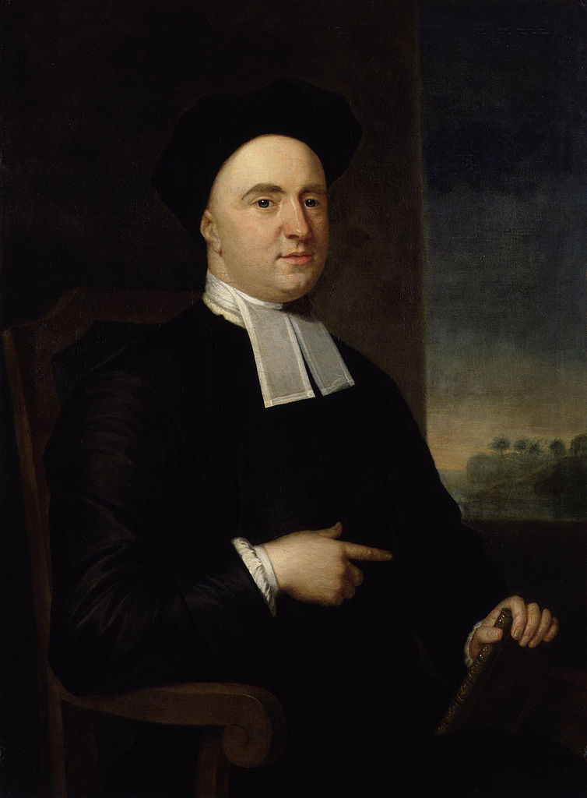

# 1.5 乔治·贝克莱（George Berkeley）与 BSD 的命名渊源

BSD（Berkeley Software Distribution，伯克利软件发行版）的命名源于其发源地——美国加州大学伯克利分校（University of California, Berkeley）。BSD 是加州大学伯克利分校计算机系统研究小组（Computer Systems Research Group，CSRG）对其在 AT&T 32V UNIX 基础上所做的改进与扩展的统称，FreeBSD 即为 CSRG 工作的衍生成果。

加州大学伯克利分校及其所在城市伯克利市（Berkeley）的名称，均来自爱尔兰近代经验论哲学家乔治·贝克莱（George Berkeley，1685—1753）。在诸多著作与文献中，他常被称为克洛因主教（Bishop of Cloyne）或贝克莱主教。

“Berkeley”在中文音译上存在不同写法，其美式与英式发音也不同（英 /ˈbɑːkli, ˈbəːkli/ 美 /ˈbɚkli/），但英文拼写保持一致。

受政治正确（涉及其[黑奴问题](https://www.lib.berkeley.edu/about/news/george-berkeley-portrait)）及翻译习惯（历史上曾译作“巴克莱”等）的影响，这一关联不仅在汉语世界鲜为人知，在英语世界也可能如此。

## 乔治·贝克莱生平简介

以下画像展示了这位哲学家的形象：

图片出处：[George Berkeley](https://www.npg.org.uk/collections/search/portrait.php?search=ap&npgno=653&eDate=&lDate=)。

乔治·贝克莱（1685.3.12—1753.1.14），2023 年是他逝世 270 周年。2025 年则是其 340 周年诞辰。

- 1685.3.12 出生于爱尔兰的基尔肯尼，乡绅家庭，是家中长子；
- 1696 年，11 岁时进入基尔肯尼学院；
- 1700 年，15 岁时进入都柏林圣三一学院；
- 1704 年，19 岁时获授文学学士学位；
- 1707 年，22 岁时被授予文学硕士学位，同年留校任特别研究员，讲授希腊语；
- 1709 年，24 岁时为满足学院规定，任爱尔兰教会执事。同年发表其首部著作《视觉新论》，其哲学思想基本形成；
- 1710 年，25 岁时任爱尔兰教会牧师。同年发表《人类知识原理》，其中已包含许多关于运动的论述；
- 1713 年，28 岁时发表《海拉斯与斐洛诺斯对话三篇》；
- 1716 年，31 岁时再次前往欧洲大陆，在意大利任圣乔治·阿什（St George Ashe）之子导师，陪同其旅欧约 4 年，至 1721 年返回爱尔兰；
- 1717 年，32 岁时被任命为圣三一学院高级研究员；
- 1721 年，36 岁时被授予神学博士学位，同年（或次年）任爱尔兰教会德罗莫尔教区座堂主任牧师（Dean），但他再次选择留在都柏林圣三一学院讲授神学和希伯来语，并发表 De Motu（论运动），其中指出牛顿的许多基本思想可能存在错误，并批评了牛顿的绝对时空观；
- 1723 年，38 岁时获得了一笔来自朋友的巨额遗产；
- 1724 年，39 岁时任爱尔兰教会德里教区座堂主任牧师（Dean），但从未赴任；
- 1725 年，40 岁时准备在百慕大筹建一所神学院，但他一生从未去过百慕大。同年为筹款放弃了先前的座堂主任牧师职位；
- 1728 年，43 岁时与 Anne Forster 结婚，六周后启程前往美洲寻求办学赞助。他们在罗德岛居住数年，购置了一座种植园，并购买了数名非洲黑奴在园内劳作（此事存在争议）；
- 1729 年，44 岁时有了第一个孩子；
- 1731 年，46 岁时因办学无望而返回伦敦。随后将罗德岛的地产与图书馆捐赠给耶鲁大学。日后，他又将大部分财产及为办学筹备的物资捐赠给了相关大学；
- 1734.1.18 48 岁时被爱尔兰教会任命为克洛因主教（Bishop of Cloyne），同年 5 月 19 日祝圣；并发表《分析家》一文。此后专注于基督教事业，逐渐淡出公众视野；
- 1739 年，伦敦育婴堂医院成立，他曾积极参与其中；
- 1744 年，59 岁时出版《西利斯：关于焦油水的功效以及与之有关的、相互引发的其他课题的哲学反思和探讨之链》，他在书中主张将松焦油用作包治百病的“万灵药”。该书是其生前销量最高的著作。据记载，他使用此疗法为患者治疗，亦取得了同样显著的疗效；
- 1752 年，67 岁时放弃克洛因主教职位，移居牛津；
- 1753.1.14 67 岁时，在妻子 Anne Forster 诵读布道文的陪伴下，他在牛津安息，归于主怀；
- 1786 年，妻子 Anne Forster 去世。

注：此处爱尔兰教会指爱尔兰圣公会，隶属于英国圣公会体系。

## 贝克莱悖论与数学基础

贝克莱不仅在哲学领域影响深远：其对微积分基础的批判亦构成了数学史上的重要篇章。贝克莱的著作引发了关于无穷小量的数学哲学讨论（即贝克莱悖论，参见其 1734 年发表的《分析学家；或一篇致一位不信神数学家的论文，其中审查一下近代分析学的对象、原则及论断是不是比宗教的神秘、信仰的要点有更清晰的表达，或更明显的推理》）。

贝克莱悖论本身并未被“解决”，其哲学层面仍是开放性问题。ε‑δ 定义只是使实分析在 ZFC 公理体系下变得形式自洽。许多人常以该定义来尝试解决芝诺悖论（Stanford Encyclopedia of Philosophy. Zeno’s Paradoxes[EB/OL]. [2026-04-04]. <https://plato.stanford.edu/entries/paradox-zeno/>.）进而否定其哲学价值。

更多相关资源可参阅关于非标准分析、超实数及数学哲学等方面的书籍。

## 贝克莱与爱因斯坦

贝克莱的思想不仅影响了哲学和数学，也对现代科学产生了间接影响。贝克莱主教以其形而上学思想，特别是对牛顿绝对时空观的批判，启发了包括爱因斯坦（他认为时间并非绝对，而是与观察者的运动状态密切相关）在内的众多 20 世纪科学家。

> **技巧**
>
> 爱因斯坦信奉马赫主义，而马赫是贝克莱主义者。

> **逐渐地，哲学家和科学家们得出了一个令人震惊的结论**：既然每个物体仅仅是其性质的总和，而这些性质又只存在于心灵之中，那么整个由物质与能量、原子与星辰构成的客观宇宙，除了作为意识的建构外并不存在——它只是一个由人类感官塑造的常规符号体系。
>
>> “天上的浩瀚星辰与地下的山川草木，简而言之，所有构成这个宏伟世界框架的实体，离开心灵便毫无实体可言……只要它们没有被我实际感知，或不存在于我的心灵，或者其他被创造的灵魂之中，它们要么根本不存在，要么只能存在于某个永恒灵的心中。”
> 正如贝克莱——唯物主义的死敌——所表述的那样：
>
> 爱因斯坦将这一逻辑推向了极致，证明了即便是空间与时间，也只是直觉的形式，无法与意识分离，正如我们关于颜色、形状或大小的概念一样。空间除了作为我们感知中物体的排列和次序外，没有客观实在性；而时间也无法脱离我们用以衡量事件顺序的体系独立存在。
>
> **意识到** 我们对宇宙的全部认知不过是被我们不完美的感官所蒙蔽的印象残余，这让对现实的追求显得无望。如果一切的存在都必须以被感知为前提，那么世界似乎会分崩离析，沦为个体感知的无序状态。
>
> 然而，我们的感知中却存在一种奇特的秩序，仿佛确实存在某种客观现实的底层，而我们的感官将其翻译了出来。尽管没有人能够确定自己对红色或中央 C 的感受是否与他人相同，但我们仍然可以基于这样的假设行动：每个人对颜色和音调的感知大致相似。
>
> ——Barnett L. The Universe and Dr. Einstein[M]. New York: William Sloane Associates, 1948.

## 贝克莱思想简介

贝克莱最著名的哲学命题是关于存在与感知的关系。

> “esse est percipi, to be is to be perceived（存在就是被感知）”
>
> ——George Berkeley

> **注意**
>
> **上述命题绝不代表贝克莱主张主观唯心主义，也绝不代表他否认客观物质的存在。**

可参见《人类知识原理》等著作，其中贝克莱论证了上帝的必然存在。在贝克莱哲学中，物质存在的客观性与上帝存在并不冲突。该著作也回应了诸多误解和诘难。

简言之：不存在任何独立且不依赖于人的思想与知觉的客观物质（我们所理解的“客观物质”必然是我们的思想与知觉所能把握的，否则这一概念便无意义）。如果存在这样的物质，由于它是不可知的，便等同于不存在，设定其存在也就没有意义（此外，若承认物质的不可知性，那便不是纯粹的唯物主义，与贝克莱哲学也无根本区别）。因此，我们所认为的、通常意义上的客观存在，必定依赖于我们的知觉才能被感知，即“存在就是被感知”。除此之外的所谓“客观存在”是不可知的，也无意义。所以，贝克莱认为，物质存在依赖于心灵的感知，没有正在被感知却存在着的物质，是不可设想的。但众所周知，我们的世界是存在的（如果你否认这一点，贝克莱哲学亦无太大分别）。故，为了确保这一点，神是必然存在的。总是不言自明地暗含地把经过实践之存在肯定为物质性的，这是不对的。如果实践活动的“物质性”本身是可质疑的，那么非物质性的存在如何能赋予这种活动以物质属性（靠松果腺吗）？而这种实践活动的“物质性”本身是无法被确证的，因为人类无法认识超越于自身感知以外的存在。除非诉诸上帝，但那样一来，你本身就预设了其非物质性。

可见，当代现象学与贝克莱哲学有异曲同工之妙——两者都强调直接经验和知觉的首要性。

> **思考题**
>
> 有关他的思想，最著名的一则哲学实验是：“假如一棵树在森林里倒下而没有人在附近听见，它有没有发出声音？”
>>
>>- 如果你认为没有。恭喜你，你现在是贝克莱者了。
>>
>>- 如果认为有，并给出了物理学（或其他科学、数学上）的证明。恭喜，你现在是贝克莱者了。
>>
> 问题一：如何理解量子力学中的“观察者”与“树在森林中倒下”这一存在的关系？
>>
>>- 如果认为有，因为世界是客观存在的，是不以人的意志为转移的。恭喜，你现在是贝克莱者了。
>>
>>- 如果认为有没有不一定或者不可知或者别的什么情况。恭喜，你现在是贝克莱者了。
>>
> 问题二：请结合上文或进一步阅读贝克莱著作，分别阐述上述结论的依据。

贝克莱还认为货币的价值并不取决于其金属含量，货币只是一种商品交换的手段。其价值来源于信用与社会共识。他认为应该使收入在国民间平均分配以实现经济公平。

他还主张通过教育、培训，依靠民众来发展经济。他认为应该通过开展大型工程建设来改善贫困问题。

贝克莱主张各宗教团体放下纷争，为共同利益而团结。在他淡出公众视野后，专注于为当地民众（无论天主教徒还是新教徒）兴办公益事业。

尽管贝克莱的思想在其有生之年未被广泛接受，但在数百年后却大放异彩。

几乎在每一本主流的哲学史著作中都能找到他的身影[旧版人教版思想政治必修四（生活与哲学）第 13 页即为一例（教育部普通高中思想政治课课程标准实验教材编写组. 思想政治必修 4 生活与哲学[M]. 北京：人民教育出版社，2018. ISBN: 978-7-107-32710-0.）]，而关于他的哲学实验也是哲学考试中经久不衰的论述题。

在高中思想政治教材中，也能看到贝克莱思想的相关介绍 ~~尽管该教材表述被认为有误，教育部组织编写. 普通高中教科书思想政治必修 4 哲学与文化[M]. 北京：人民教育出版社，2019. ISBN: 978-7-107-34195-3. 已删去相关内容~~。

## 伯克利市、加州大学伯克利分校、BSD 的命名

从贝克莱于 1726 年创作的一首诗《论在美洲传播艺术与学术之前景的诗篇》来了解伯克利之名。

The Muse, disgusted at an age and clime
Barred of every glorious theme,
In distant lands now waits a better time,
Producing subjects worthy fame.

In happy climes, where from the genial sun
And virgin earth such scenes ensue,
The force of art by nature seems outdone,
And fancied beauties by the true;

In happy climes, the seat of innocence,
Where nature guides and virtue rules,
Where men shall not impose for truth and sense
The pedantry of courts and schools:

There shall be sung another golden age,
The rise of empire and of arts,
The good and great inspiring epic rage,
The wisest heads and noblest hearts.

Not such as Europe breeds in her decay;
Such as she bred when fresh and young,
When heavenly flame did animate her clay,
By future poets shall be sung.
Westward the course of empire takes its way;

The four first Acts already past,
A fifth shall close the Drama with the day;
Time’s noblest offspring is the last.

BERKELEY G. Verses on the Prospect of Planting Arts and Learning in America[C]//A miscellany, containing several tracts on various subjects. London: Printed for J. and R. Tonson, and S. Draper, 1752.

译文：

缪斯厌弃这时代与这气候/一切光辉题材皆被阻绝/遂在远方之地静候更好的时辰/孕育值得传名的主题。

在那幸福的土地上，由和煦的阳光/与处女般的原野所生成的景象/艺术之力似被自然所胜/幻想之美亦不及真实。

在那幸福的土地上，乃纯真之所/自然引导，德行主宰/人们不再以宫廷与学校的迂腐学究之见/冒充真理与理性；

在那里，将歌唱另一个黄金时代/帝国与艺术的兴起/善与伟激发史诗般的激情/最睿智的头脑与最高贵的心灵。

并非如欧洲在衰败中所滋生者/而是如其昔日初生而年轻之时所孕育者/当神圣之火曾赋予其尘土以生命/将为后世诗人所吟唱/帝国之进程，向西而行；

前四幕已然过去/第五幕将随白昼而终结此剧/时间最崇高的产物，乃最后登场。

伯克利市（Berkeley）的命名可以追溯至 1866 年。当时，加州学院（College of California）的受托人弗雷德里克·比林斯（Frederick Billings）援引贝克莱的诗句“Westward the course of empire takes its way”（帝国之路向西延伸），建议将新校址所在城镇命名为 Berkeley。1868 年，加利福尼亚州的立法机构决定在该土地上建立加州大学。

20 世纪 70 年代，加州大学伯克利分校的计算机科学研究人员开始对 AT&T 贝尔实验室开发的 UNIX 操作系统进行修改与扩展。由于这些修改与扩展最初以软件发行包的形式发布，因此被称为伯克利软件发行版（Berkeley Software Distribution，BSD）。

## 参考文献

- Berkeley G. 人类知识原理和三篇对话[M]. 张桂权，译. 北京：人民出版社，2022. ISBN: 978-7-01-023684-1. 系统阐述贝克莱唯心主义哲学体系与存在感知理论。
- 阎吉达. 贝克莱思想新探[M]. 上海：复旦大学出版社，1987. ISBN: 7-309-00033-1. 深入剖析贝克莱哲学思想与科学方法论。
- Berkeley G. 西利斯[M]. 曹曼，高新民，译. 北京：商务印书馆，2000. ISBN: 978-7-100-02886-8. 西利斯中译本。
- Downing L. George Berkeley[EB/OL]. (2021)[2026-03-25]. <https://plato.stanford.edu/archives/fall2021/entries/berkeley/>. SEP 贝克莱条目。提供了贝克莱哲学思想的权威学术综述与研究现状。
- Easwaran K, Hájek A, Mancosu P, et al. Infinity[EB/OL]. (2024)[2026-03-25]. <https://plato.stanford.edu/archives/sum2024/entries/infinity/>. SEP 无穷条目。探讨了数学哲学中无穷概念的历史发展与哲学争议。
- Urmson J O. 贝克莱[M]. 孟令朋，译. 北京：清华大学出版社，2019. ISBN: 978-7-302-52555-4. 深入浅出介绍贝克莱哲学思想与历史影响。
- 汪芳庭. 数学基础[M]. 修订版. 北京：高等教育出版社，2018. ISBN: 978-7-04-050242-8. 系统阐述数学基础理论与公理集合论框架。
- Robinson A. 非标准分析[M]. 申又根，王世强，张锦文，译. 北京：科学出版社，1980. 统一书号：13031-1267. 建立超实数理论，为无穷小量提供数学基础。
- Tao T. 陶哲轩实分析[M]. 李馨，译. 第4版. 北京：人民邮电出版社，2025. ISBN: 978-7-115-66554-6. 从数学基础（自然数和集合论）构建实分析体系，强调严谨性与直觉的结合。
- Berkeley G. The Querist, containing several queries proposed to the consideration of the public[M]. Farmington Hills：Gale ECCO，Print Editions，2018. ISBN: 978-1-38541-101-8. 探讨货币、经济与社会问题的哲学思考。
- Schabas M. Economics in Early Modern Philosophy[EB/OL]. (2022)[2026-03-25]. <https://plato.stanford.edu/archives/sum2022/entries/economics-early-modern/>. 梳理近代经济思想的哲学根基与历史脉络。
- Cloyne District Community Council. George Berkeley, Bishop of Cloyne/Philosopher[EB/OL]. [2026-03-25]. <http://cloyne.ie/about/george-berkeley-bishop-of-cloyne/>. 介绍贝克莱主教在克洛因教区的生平与工作。
- Britannica. George Berkeley[EB/OL]. [2026-03-25]. <https://www.britannica.com/biography/George-Berkeley>. 提供贝克莱生平与思想的权威百科介绍。
- Stadtman V A, Centennial Publications Staff. The Centennial Record of the University of California, 1868–1968[M/OL]. Berkeley：University of California，1967[2026-04-18]. <https://digicoll.lib.berkeley.edu/record/81096/files/centennial.pdf>. 记载 1866 年 Frederick Billings 援引贝克莱诗句建议将城镇命名为 Berkeley 的历史。
- 胡化凯. 20 世纪 50-70 年代中国科学批判资料选（上下）[M]. 济南：山东教育出版社，2009. ISBN: 978-7-5328-5386-1. 其中整本下册均涉及对爱因斯坦的批判。记录特定历史时期科学与政治交织的学术史料。
- O'Grady P. Berkeley, George[EB/OL]//Dictionary of Irish Biography. [2026-04-18]. <https://www.dib.ie/biography/berkeley-george-a0611>. 爱尔兰传记词典贝克莱条目，提供贝克莱生平最详尽权威之学术传记，含精确日期（如 1696 年 7 月 17 日入基尔肯尼学院、1700 年 3 月 21 日入都柏林圣三一学院、1707 年 6 月当选研究员、1710 年春受按立为牧师等）。
- Stock J. An Account of the Life of George Berkeley, D.D., Late Bishop of Cloyne in Ireland[M]. Dublin，1776：12. 贝克莱最早之传记，记载其临终时妻子在旁诵读布道文等细节。
- Popper K R. A Note on Berkeley as Precursor of Mach[J]. The British Journal for the Philosophy of Science，1953，4(13)：26-36. 论证贝克莱对牛顿绝对时空观之批判先于马赫，为爱因斯坦广义相对论之思想先驱。
- Berkeley Historical Society. Why Is Berkeley Called Berkeley?[EB/OL]. [2026-04-18]. <https://berkhistory.org/why-is-berkeley-called-berkeley/>. 伯克利历史学会与博物馆，Frederick Billings 于 1866 年援引贝克莱诗句命名伯克利。
- Berkeley Plaque Project. How Berkeley Got Its Name[EB/OL]. [2026-04-18]. <https://berkeleyplaques.org/plaque/how-berkeley-got-its-name/>. 1866 年 5 月 24 日采纳 Berkeley 之名。

## 课后习题

1. 将 *The analyst; or, a discourse addressed to an infidel mathematician. Wherein it is examined whether the object, principles, and inferences of the modern analysis are more distinctly conceived, or more evidently deduced, than religious mysteries and points of faith*（《分析学家；或一篇致一位不信神数学家的论文，其中审查一下近代分析学的对象、原则及论断是不是比宗教的神秘、信仰的要点有更清晰的表达，或更明显的推理》）翻译为中文，并尝试将之公理化。
2. 比较贝克莱《人类知识原理》的原始文本与中文译本，复现其中关于存在与感知关系的核心论证，并用一阶逻辑符号重构其推理结构。
3. 查阅历史资料，选取加州大学伯克利分校计算机科学研究中的一个重要技术创新（如 BSD、RAID、RISC-V 等），分析其产生的技术背景与学术影响。
