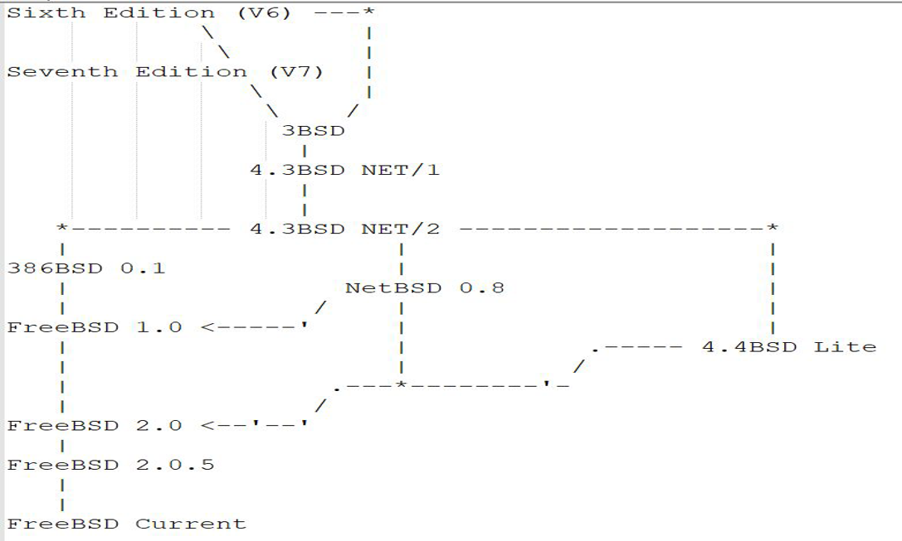

# 第 1.2 节 关于 FreeBSD 项目

## FreeBSD 项目宗旨

FreeBSD 项目致力于提供一款真正的自由软件，实践自由软件的使命：使 FreeBSD 的代码得到最大程度的利用，让所有人——无论其目的为何——都能从中受益。简而言之，“只求我为人人，不求人人为我”，这正是我们热情拥护的宗旨。

在 FreeBSD 项目的源代码中包含部分以 GNU 通用公共许可证（GPL）和 GNU 宽通用公共许可证（LGPL）授权的软件，我们持续努力减少其比重。尽管这些许可证要求开源，而非闭源，但它们仍带来一定的法律挑战和额外的复杂性。为了更好地实现 FreeBSD 的宗旨，尽可能提供无附加条件的软件，从而减少在商业使用中的复杂性，FreeBSD 项目在可能的情况下，更倾向于采用限制更少的 BSD 许可证。

## FreeBSD 开发模型

### 存储库

FreeBSD 项目历史悠久，其使用的版本控制工具历经了 CVS、SVN、Git。目前使用 Git 进行协作开发。

FreeBSD 项目的存储库分为三个：freebsd src（源代码）、freebsd ports（Port 软件移植）、freebsd doc（文档）。三个项目地位相等。

### FreeBSD 基金会

FreeBSD 商标由 FreeBSD 基金会持有。FreeBSD 基金会是美国科罗拉多州的一家 501(c)3 非营利机构，负责接收捐赠，支持项目开发，充当 FreeBSD 项目法律实体，会议赞助，宣传和推广 FreeBSD 项目。基金会的所有权力集中在董事会，董事由现有董事会成员选举产生（新董事仅限现任董事提名），每位董事人数任期 1 年，可连选连任。

### FreeBSD 社区

FreeBSD 社区由来自全世界各地的开发者和用户构成。FreeBSD 社区并不是一个法律实体。

### 提交者

提交者是那些有权力直接写入 FreeBSD 存储库的人。要想成为提交者，须经过导师机制，必须由已有提交者推荐。为了防范潜在的安全风险，提交者并非终身制：对于 freebsd src 和 freebsd doc，提交者在 18 个月应有一次提交；对于 freebsd ports 则是 12 个月。

### FreeBSD 核心小组

FreeBSD 核心小组是 FreeBSD 项目的最高权力机关，共计 9 人，每位成员分管不同的子项目。FreeBSD 核心小组负责授予或撤销提交者权限及账户、执行冲突守则（CoC）、管理项目子团队等。FreeBSD 核心小组选举每两年举行一次，可以连选连任。只有在过去一年内有过提交的提交者（成为活跃开发者）才有资格投票参见选举，被选举者也必须是提交者。活跃开发者可以表决罢免 FreeBSD 核心小组成员。

FreeBSD 核心小组成员并不直接从中获取任何利益，同样也都是志愿者。

## FreeBSD 简史

UNIX -> Networking Release 1-> Networking Release 2 -> 386BSD -> FreeBSD 1.0

386BSD -> 诉讼（1991-1994） -> 4.4 BSD-Lite -> FreeBSD 2.0

### FreeBSD 时间线

- 1962 年 分时操作系统（Timesharing OS）

在 20 世纪 60 年代初，分时操作系统诞生了，其中最早的一款分时系统出现英国曼彻斯特项目（Manchester Project in England）设计的 Atlas 品牌计算机上（Atlas 监控程序）。在那个时代，分时共享系统意味着两个人共用同一台计算机，通常需要安排一张小时时间表来规划他们使用计算机的时间。

- 1964 年 MULTICS（多任务信息与计算系统）

Multics 最初的规划和开发始于 1964 年的马萨诸塞州的剑桥市。一开始，Multics 是由麻省理工学院（Fernando Corbató 领导的 MAC 项目）与通用电气公司和贝尔实验室合作的项目。开发于专为操作系统设计的通用电气 645 计算机上；首个完整的系统于 1967 年 1 月交付给麻省理工学院。

- 1969 年 UNIX（UNIX 操作系统）

在贝尔实验室退出 Multics 项目前，Dennis Ritchie 和 Ken Thompson 已经发觉了 Multics 的潜力。他们从贝尔实验室法务部门获得了资金，购买了一台更强大的 PDP-11/20 机器。在 1969 年，Ken Thompson、Dennis Ritchie 等人开始着手开发一款新程序，以充分利用这台功能更强大的计算机。这个程序被称为 Unics（Uniplexed Information and Computing Service，非复用信息和计算机服务）。

- 1972 年 UNIX 代码迁移到 C 语言

Dennis Ritchie 决定为 UNIX 开发一种高级汇编语言，其中的语句可以翻译成两到三条指令。这促使他开发了 C 编程语言。第四版研究 UNIX（Research Unix）使用 C 语言重写。这使得 UNIX 具备了可移植性，从而改写了操作系统的历史。

- 1974 年 UNIX 被引入加州大学伯克利分校

1974 年，加州大学伯克利分校的 Bob Fabry 教授从 AT&T 获得了 UNIX 的源代码许可。Bob Fabry 此前在 1973 年的 ACM 操作系统原理研讨会（Association for Computing Machinery）上见过 UNIX 4，并有意将其引入伯克利大学。计算机系统研究小组（CSRG）开始修改和改进 AT&T Research Unix。他们将这个修改后的版本称为“BSD Unix”/“BSD”。

- 1978 年 3 月 9 日 1BSD 发布

基于 UNIX 创建的伯克利软件发行版（1BSD）是 UNIX 第六版的一款附加组件，而非独立完整的操作系统。此版本发行了大约 30 份。

- 1979 年 5 月 10 日 2BSD 发布

第二款伯克利软件发行版（2BSD）发布于 1979 年 5 月。涉及 1BSD 的软件更新，以及由 Bill Joy 新开发的两个至今仍在 Unix 系统上使用的程序：vi 文本编辑器（ex 的可视化版本）和 Csh。2BSD 是由 Bill Joy 参与 PDP-11 工作的最后一个 BSD 版本。发行了约 75 份。

- 1980 年 6 月 DARPA 的赞助

在 1980 年初，DARPA（Defense Advanced Research Projects Agency，美国国防高级研究计划局）当时正在寻找一种有助于军事项目的操作系统。Bill Joy 关于 UNIX 系统（特别是 BSD）功能的一篇论文引起了他们的注意。他们于 1980 年 6 月，开始赞助伯克利进行相关工作。

- 1983 年 8 月 4.2BSD 发布

4.2BSD 正式发布于 1983 年 8 月。值得注意的是，这是在  Bill Joy 离开（伯克利），并与他人创建了 Sun Microsystems（太阳计算机系统公司）后（1982 年）的第一个版本。它也标志着 BSD 的吉祥物的首次问世：出现在 John Lasseter 的画作中，即 USENIX 发行的纸质手册的封面上。这次发布了 1000 余份，意味着有大量的计算机在使用。

- 1988 年 6 月 4.3BSD-Tahoe

随着开发人员逐渐淘汰老旧的 VAX 平台，4.3BSD-Tahoe 发布了针对 Power 6/32 平台（TAHOE）的版本。这次发布相当有价值，因为它将 BSD 中的机器相关代码同机器无关代码剥离开来，从而提高了后续系统的可移植性。

- 1991 年 386BSD 和 Net/2

Keith Bostic 发起了一个项目，旨在在不使用 AT&T 的代码的前提下，重新实现大多数标准的 Unix 软件。最终发布了 Networking Release 2（Net/2）——一款几乎完全可自由分发的操作系统。在 Net/2 的基础上，BSD 为英特尔 80386 架构分别移植了两个版本：由 William Jolitz 开发的免费的 386BSD、由 Berkeley Software Design（BSDi）开发的专有 BSD/386（后来更名为 BSD/OS）。386BSD 本身昙花一现，但成为随后不久开始的 NetBSD 和 FreeBSD 项目的原初代码基础。

- 1992 年 USL 诉讼案

BSDi 很快就陷入了与 AT&T 的 Unix System Laboratories（USL，Unix 系统实验室）子公司的法律纠纷中，当时 USL 是 System V 版权和 Unix 商标的所有者。USL 对 BSDi 的诉讼于 1992 年提起，并导致对 Net/2 的分发禁令。该诉讼于 1994 年 1 月达成和解。在 BSD 的 18,000 个文件中，仅须删除三个文件；并对 70 个文件进行修改，用以展示 USL 版权声明。本次和解为首款 FreeBSD RELEASE 的发布铺平了道路。

- 1993 年 6 月 FreeBSD 的创建

386BSD 的开发进展缓慢。在经过一段时间的搁置后，为了能够使操作系统保持最新状态，一群 386BSD 用户决定自力更生，创建了 FreeBSD。1993 年 6 月 19 日，此项目选择了“FreeBSD”这个名字。首个 FreeBSD RELEASE 发布于 1993 年 11 月。

- 1994 年 8 月 FreeBSD Ports

FreeBSD 的 Ports 和软件包为用户和管理员提供了一种简单的安装应用程序的方式。Ports 现在提供了多达 34,000 个 port。它们首次现身于 1994 年，当时 Jordan Hubbard 将“port make macros”提交到 FreeBSD 的 CVS 存储库中，目的是给他的软件包安装套件“Makefile”打补丁。

- 1994 年 11 月 22 日 IPFW

ipfirewall 是在 FreeBSD 2.0-RELEASE 中被引入的，这种“先入为主（First Match）”防火墙自此成为操作系统的重要组成部分。ipfw 曾作为 Mac OS X 的内置防火墙而广泛使用。

- 1998 年 5 月 软更新（Soft Updates）

1998 年 5 月，FreeBSD 采用了软更新依赖跟踪系统。软更新旨在通过跟踪和执行更新之间的依赖关系，保持文件系统元数据的完整性，以防发生崩溃和停电。

- 1999 年 10 月 17 日 首届 BSD 大会

首届 FreeBSD 大会（FreeBSDCon'99）在加利福尼亚州伯克利举行。来自世界各地的 300 多名开发者和用户参加了此次活动，标志着 FreeBSD 在受欢迎度和影响力上的一个重要里程碑。

- 2000 年 3 月 14 日 FreeBSD Jail

FreeBSD Jail 引入于 2000 年初发布的 FreeBSD 4.0。Jail 机制是操作系统级别的虚拟化实现，能让系统管理员将一个 FreeBSD 系统分割为多个独立的小系统（"Jail"）。这使得系统管理员能够更好地保护和优化他们的 FreeBSD 系统。

- 2000 年 3 月 15 日 FreeBSD 基金会成立

FreeBSD 基金会是一家总部位于美国的非营利组织，注册为 501(c)(3) 机构，致力于支持 FreeBSD 项目、其开发和社区。资金来自个人和企业的捐款，用于赞助开发人员进行特定活动、购买硬件和网络基础设施，并提供开发者峰会的差旅津贴。该基金会由 Justin Gibbs 于 2000 年 3 月 15 日创立。

- 2000 年 7 月 27 日 kqueue(2)

kqueue(2) 是取代 select/poll 的创新解决方案，于 2000 年 7 月 27 日随着 FreeBSD 4.1-RELEASE 引入。这个可扩展的事件通知接口启发了 Linux 的 epoll() 机制。

- 2000 年 10 月 17 日 首次核心团队选举

尽管此前已经存在一个自我推选的核心团队，但首次核心团队选举是在 2000 年 9 月举行的。当时任命了由 9 名成员组成的一个团队，自此以后每两年举行一次选举。

- 2001 年 9 月 EuroBSDCon

EuroBSDCon 2001 于 2001 年末在英国布莱顿举行。随着全球社区的不断扩大，EuroBSDCon 的目标是聚集在 BSD 操作系统家族及相关项目上工作的用户和开发者。

- 2004 年 1 月 9 日 AMD64 磁盘镜像

在版本 5.1 实验性地支持 amd64 后，5.2-RELEASE 正式支持了 amd64。amd64 成为了首个 64 位的一级平台。

- 2004 年 3 月 12 日 首届 AsiaBSDCon 和 BSDCan

在 EuroBSDCon 获得成功之后，首届 AsiaBSDCon 于 2004 年 3 月 12 日发起，紧随其后的是 BSDCan——于 5 月 13 日举行。随着 FreeBSD 社区的不断发展壮大，全球范围内对于以 BSD 为重点的会议的需求也随之增长。

- 2004 年 5 月 1 日 谷歌编程之夏

FreeBSD 基金会在首年度的谷歌编程之夏就参与其中。谷歌编程之夏为新的开发者提供了一个机会，让他们参与当前的开源编程项目。在项目结束后，许多参与该项目的学生成为了 FreeBSD 的贡献者。

- 2004 年 11 月 3 日 移植 PF

在 2006 年，原本设计用于 OpenBSD 的 Packet Filter（简称 PF）被移植到了 FreeBSD，与 5.3-RELEASE 一同分发。

- 2004 年 11 月 17 日 Libarchive

Libarchive 最初是为 FreeBSD 5.3 开发的，该发行版于 2004 年末发布。它是一款用 C 语言编写的程序库，提供对多种不同存档格式的流式访问功能。

- 2005 年 8 月 首位执行董事

Deb Goodkin 于 2005 年加入基金会，成为首位执行董事。她之前在数据存储设备的市场营销、销售和开发领域有着 20 余年的工作经验。

- 2005 年 10 月 8 日 新的 FreeBSD Logo

举行了一项 Logo 设计大赛，由 Anton K. Gural 设计的 Logo 获胜（当前仍在使用）。

- 2007 年 JEMALLOC

Jason Evans 于 2005 年开发了 jemalloc，这是一款内存分配器。与此同时，FreeBSD 需要一款可扩展的多处理器内存分配器，因此 Evans 将 jemalloc 集成到了 FreeBSD 的 libc 中，这改进了其可扩展性和碎片化行为。

- 2008 年 3 月 ZFS

在 2005 年，Sun Microsystems 开发了一种新型文件系统，最终产物是 ZFS。ZFS 是一款集成了文件系统和逻辑卷管理器的系统。该系统具有可扩展性，并提供了广泛的数据完整性保护和高效的数据压缩功能。ZFS 于 2008 年初进入到 FreeBSD 系统中。

- 2009 年 1 月 6 日 DTrace

Sun Microsystems 开发了 DTrace，DTrace 可用于实时调试生产系统中的内核和应用程序问题。尽管该程序最初是为 Solaris 开发的，但它成为 FreeBSD 的标准组成部分，并为 DTrace 提供了全面支持。

- 2010 年 8 月 Capsicum

Capsicum 是一款轻量级的操作系统能力和沙盒框架。它可以用于应用程序分隔、将较大的软件体系分解为隔离的组件，并限制软件漏洞的影响。Capsicum 最初由剑桥大学开发，并首次作为可选功能发布在 FreeBSD 9.0 中，后来成为 FreeBSD 10.0 中的默认功能。

- 2012 年 CHERI

在 2012 年，剑桥大学开始开发了 Capability Hardware Enhanced RISC Instructions (CHERI)，这是基于之前的 Capsicum 项目的发展而来的。CHERI 将 Capsicum 的混合能力模型转移到 CPU 架构领域，实现在进程地址空间内的细粒度隔离，并支持当前软件设计。

- 2012 年 POUDRIERE

Poudriere 是一款通过 jail 测试 port，并继而构建 FreeBSD 镜像的工具，它被添加到了 Ports 中。

- 2012 年 4 月 12 日 CLANG/LLVM

LLVM 项目是一组模块化和可重用的编译器和工具链技术。Clang 项目为 LLVM 项目提供了 C 语言前端和工具基础设施。这些程序目前是 FreeBSD 的编译基础设施。

- 2013 年 2 月 28 日 从 CVS 迁移到 Subversion

由于大多数 port 已经在 Subversion 中进行开发，于 2013 年 2 月 28 日正式完成了从 CVS 到 Subversion 的迁移。此后，FreeBSD Ports 不再使用 CVS。

- 2013 年 9 月 17 日 开源 ZFS 项目启动

ZFS 开源项目衍生于 OpenSolaris 项目。在 2013 年 9 月 17 日，ZFS 开源项目宣布 OpenZFS 成为 ZFS 的继任者，并创建了一家正式的社区来维持开发和支持。

- 2014 年 1-2 月 FreeBSD 期刊创刊号

作为 FreeBSD 社区的声音，并是跟进 FreeBSD 最新发布版本和新进展的最佳途径，FreeBSD 期刊的创刊号是 2014 年 1/2 月刊，重点关注 FreeBSD 10。

- 2017 年 6 月 19 日 首个“FreeBSD 日”

国际 FreeBSD 日是每年一度的庆祝活动，旨在赞扬 FreeBSD 对技术的开创性和持续影响，并纪念其传承的价值。

- 2021 年 4 月 6 日 Git 迁移完成

于 2021 年 4 月 6 日 完成了从 Subversion 到 Git 的迁移。此过程始于 2019 年 5 月的 DevSummit，当时成立了一个 Git 工作小组。

## 参考文献

- 原文来自 [Timeline](https://freebsdfoundation.org/freebsd/timeline/)，有改动。

