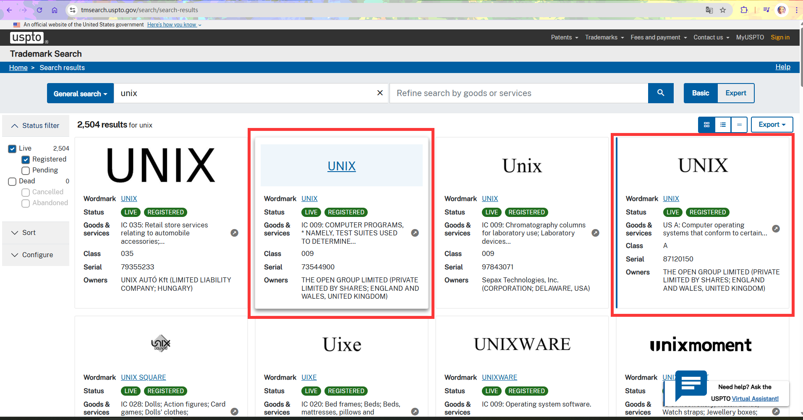
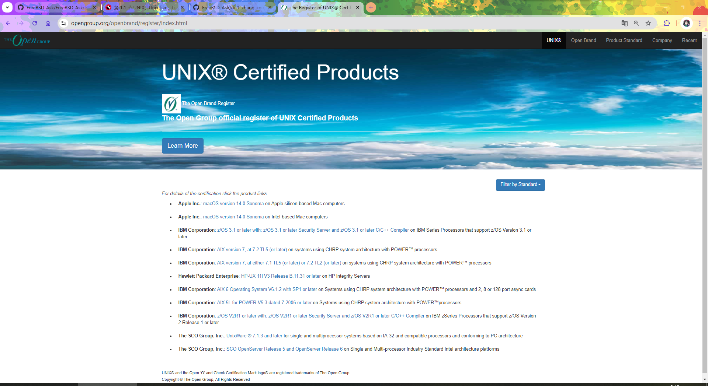

# 1.1 操作系统的历程与开源往事

## 什么是 UNIX？

从前，UNIX 是一款操作系统。最后由 C 语言改写产生。——源自 `AT&T`（American Telephone & Telegraph，美国电话电报公司）的贝尔实验室。

现在是一种 **标准规范**、一款 **法律上的商标**。更是一种 **哲学思想**，一项 **软件工程原则。**

---

查询美国专利商标局 UNIX 商标注册情况：



---

UNIX 认证查询网址：[The Open Group official register of UNIX Certified Products](http://www.opengroup.org/openbrand/register)




现在，我们可以知道认证 UNIX 需要：

1. [符合单一 UNIX 规范](https://www.opengroup.org/openbrand/register/xym0.htm)
2. 交钱认证


可以看到，常见的，经过认证的 UNIX 操作系统有 Apple macOS。即从商标的角度上讲，macOS 可以称得上是标准的 UNIX 操作系统。~~故，要安装 UNIX 的人可以去黑苹果了~~

>**技巧**
>
>macOS/iOS 等与 BSD 的关系
>
>从历史与现实来看，macOS/iOS 等基于 BSD 确凿无疑，但并非全然基于某款 BSD：macOS/iOS 等应该被理解为一款独立的 BSD 操作系统——同 OpenBSD、NetBSD 和 FreeBSD 一样。参见 [《苹果的开源基石：macOS 和 iOS 背后的 BSD 传统》](https://book.bsdcn.org/fan-yi-wen-zhang-cun-dang/2024-nian-11-yue/apple)
>
>所以看似是安卓和苹果之争，其实是 Linux 与 BSD 之争。~~也许也是大教堂与市集之争。~~


### UNIX 哲学与软件工程原则简介

#### 传统的 Unix 哲学观（以《UNIX 编程艺术》为核心）

>**思考题**
>
>> Those who do not understand Unix are condemned to reinvent it, poorly. （那些不懂 Unix 的人注定要再造一个四不像式 Unix）
>>
>>——[Henry Spencer](https://www.nasa.gov/history/alsj/henry.html)
>
>作者 Henry Spencer 并未明确批评哪个操作系统，那么你认为，现在这句话更适合哪个常见的操作系统？为什么？

Unix 哲学源于 UNIX 操作系统的开发，作者是 Ken Thompson。Unix 哲学一言以蔽之即大道至简（“keep it simple, stupid”）：


- 小即美
- 一个程序只做一件事
- 原型先行
- 可移植性先于高效率性
- 不使用二进制
- 沉默是金（无报错就沉默，成功则无输出，不显示操作进度等）
- 避免仅用户界面（避免无命令行，仅 GUI）

##### 参考文献

- 《UNIX 编程艺术》，Eric Raymond 著，ISBN: 9787121176654，电子工业出版社。
- 《Linux/Unix 设计思想》，Mike Gancarz 著，9787115266927，人民邮电出版社。（已绝版）
- [The Open Group Standards Process](https://www.opengroup.org/standardsprocess/certification.html)

### 二十一世纪四分之一处的 Unix 哲学观

事实证明，技术很快就会过时。这也是很多人在今天认为谈论 Unix，谈论 Unix 哲学毫无意义的重要原因。因为他们的确过时了，将 Unix 哲学简单仅归结为纯粹而具体的技术性操作，这是对 Unix 哲学最大的误读。也是促使不少人走上苦难哲学这条改旗易帜的歪路的诱因。

真正的 Unix 哲学绝不是上面那些陈旧古板的祖宗之法，Unix 哲学的精髓在于以人为本，真正的 Unix 哲学是一种人道主义。在不同的年代，Unix 哲学应有不同的诠释，但是归根结底是一种人道主义——我们要高扬人的主体性。正是为了好玩，为了玩太空旅行才诞生了 Unix，为了“Just For Fun”才有了 Linux：这无不说明，是改造计算机以适应人，而非强迫让人去适应所谓计算机的规则，去迎合吹捧那些本就拙劣不堪的设计思路。

大道至简在西方哲学中表现为奥卡姆的剃刀，即“如无必要，勿增实体。”这在某种程度上也启发了现象学的观念，我们应该把一些自行设定的观念从我们的脑子里排除出去，只留下我们能够直接感受到的东西——即回到事物本身。

我们现在回到操作系统本身，回到计算机本身，计算机不应成为一种额外的负担，而应为人所服务——正如 FreeBSD 的口号“The Power To Serve（服务的力量）”那样。

所以，现代的 Unix 哲学具体不应该是“避免仅用户界面”，而应该是“避免仅命令行”。每款程序都应该报告自己的操作进度，最好还有进度条（无论是否真的体现了进度），可以使用参数静默上述行为，但默认行为不应该是所谓的沉默是金——你有多少次在使用 `dd`、`cp` 等命令的时候渴望看到一个进度条而不是什么都没有，即使是卡死了也不知道？ChatGPT 这种程序无疑是对“小即美”，“一个程序只做一件事”最大的反叛。人们需要什么，就应该有什么。

### Unix 的一段历史

#### Multics

1964 年麻省理工学院推出的 CTSS（兼容分时系统），是当时最有创造性的操作系统，有了 CTSS 这种高效的操作系统，麻省理工学院的研究人员决定做一个更好的版本。他们开始设计 Multics 系统。Multics 意思是多路复用信息和计算服务。

Multics 意图创造强悍的新软件和比肩 IBM 7094 功能更丰富的新硬件，麻省理工学院邀请了两家公司来帮忙。美国通用电气公司负责设计及生产有全新硬件特性、能更好地支撑分时及多用户体系的计算机，贝尔实验室在计算机发展早期就开发了自己的操作系统，因此麻省理工邀请了贝尔实验室与美国通用电气公司共同开发 Multics。

最终 Multics 的开发陷入了困境，Multics 设计了大量的程序及功能，经常塞入很多不同的东西进去，导致系统过于复杂。1969 年，由于在贝尔实验室看来作为一套信息处理工具，它已经无法为实验室提供计算服务的目标，它的设计太昂贵了，于是在同年 4 月，贝尔实验室退出 Multics 项目，只剩麻省理工和美国通用电气公司继续开发。

#### UNICS

贝尔实验室退出 Multics 开发项目后，项目组成员 Kenneth Lane Thompson 找到一台 DEC PDP-7 型计算机，这台计算机性能不算强大，只有 4KB 内存，但是图形界面比较美观，Thompson 用他写了个游戏 *Space Travel*（《星际旅行》），PDP-7 有个问题就是磁盘转速远远低于计算机的读写速度，为了解决这个问题，Thompson 写了磁盘调度算法来提高磁盘总吞吐量。

>**技巧**
>
>《星际旅行》被人移植了，现在可以直接在网页上玩，项目位于 [C port of Ken Thompson's Space Travel](https://github.com/mohd-akram/st)，在线游玩的网站是 [Space Travel](https://akr.am/st/)。
>
>~~虽然操作简单但是看不懂怎么玩~~

如何测试这个新的算法？需要往磁盘上装载数据，Thompson 需要写一个批量写数据的程序。

他需要写三个程序，每周写一个：创建代码的编辑器，将代码转换为 PDP-7 能运行的机器语言汇编器，再加“内核的外层——操作系统就完成了”。

新的 PDP-7 操作系统编写没多时，Thompson 和几个同事讨论，当时新系统还没有名字，当时它被命名为“UnICS”（Uniplexed Information and Computing Service，非复用信息和计算机服务），UnICS 最后改名为 **UNIX**，这个名字更加方便记忆。

## GNU 与自由软件运动

由于 Unix 在后期愈发封闭，许可证昂贵、受限制于商业公司等原因，RMS（Richard Matthew Stallman）就想创造一款自由且兼容 Unix 的操作系统。

- 1983 年，RMS 发表 [《GNU 宣言》](https://www.gnu.org/gnu/manifesto.html)，其中 GNU 即 GNU is Not Unix（GNU 不是 Unix）。GNU 是一款操作系统——旨在完全替代 Unix。
- 1984 年，创建 [GNU 项目](https://www.gnu.org/)
- 1985 年，RMS 创建自由软件基金会（Free Software Foundation，FSF）
- 1989 年，FSF 发布 GPLv1
- 1991 年，FSF 发布 GPLv2
- 2007 年，FSF 发布 GPLv3

一开始他为 Unix 写了很多实用程序（用户空间），然而 GNU 的目标操作系统始终缺乏稳定的内核（即使到了 2025 年，[GNU Hurd](https://hurd.gnu.org/) 仍未完成）。Linux 内核的诞生为这一困境带来了突破。作为一款由 Linux 内核和 GNU 软件拼凑起来的操作系统，Linux 不断地的 GNU 化，成为了一款操作系统——这就是 GNU/Linux 其中 GNU 的来历，然而很多人无视这一事实，掩盖了 GNU 软件的贡献。这是因为：Linux 内核由创始人 Linus Torvalds 一人裁决。Linus 本人对 FSF 和 RMS 并不认可。所以显而易见的，Linux 项目的理念与自由软件运动的理念、乃至于同真正开源的理念（Linux 内核里存在大量非开源非自由的存在，参见 [Linux-libre](https://www.fsfla.org/ikiwiki/selibre/linux-libre/)）都存在明显的张力。并且 Linux 内核使用 GPLv2，而非 GNU 推荐的 GPLv3。事实是，Linus Torvalds 随意移除 Linux 项目的参与者，却未同时移除他们贡献的代码。——这同自由还是开源理念都是冲突的。

我们将 Linux 之前这段时间称作“自由软件运动”（代表人物 RMS）。Linux 的流行促成了另一种理念的兴起，即“开源运动”——代表人物有 Eric S. Raymond，OSI（Open Source Initiative，开放源代码促进会）的创始人，《UNIX 编程艺术》、《大教堂与集市》的作者；Bruce Perens，Debian 项目前领导人——想想下面有关开源的定义为什么是自 [Debian 的开源定义 DFSG](https://www.debian.org/social_contract#guidelines) 衍生而来？

自由软件运动并未停止，但人们对开源的误解却越来越重。

### 自由软件运动与开源运动之间的张力

需要注意的是，根据笔者与 RMS 的通讯，其强调的 GNU 与自由软件运动并不强调“开源”（甚至是反对开源），而是强调“Free”式自由。有些人可能认为现在的“开源”仅仅是由 [OSI 定义](https://opensource.org/osd) 的那样，这是一种极其片面的观点。

>致所有阅读我邮件的 NSA（美国国家安全局）和 FBI 特工：请考虑一下，捍卫美国宪法以抵御一切敌人，无论是外国的还是本国的，是否需要你效仿斯诺登的做法。
>
>>但是我有点困惑：GNU 项目是否强制要求开发必须开源？因为 GNU 通用公共许可证（GPL）强制开源。
>
>GNU 项目并不倡导“开源”。我们从不用这个词，除非是为了表达与它的分歧。我们代表的是自由软件（Free Software）——自由如同自由的言论。我们致力于在计算中为用户争取自由。
>
>请参见：<https://gnu.org/philosophy/free-software-even-more-important.html>
>
>“开源”这个词是一些反对自由软件运动的人发明的——他们与我们意见相左。他们想谈论同样的软件，却又掩盖自由的理念。
>
>关于自由软件与开源的区别，请参见：<https://gnu.org/philosophy/open-source-misses-the-point.html>
>
>另请阅读 Evgeny Morozov 的文章：<https://thebaffler.com/salvos/the-meme-hustler>，他在文中也探讨了这一点。
>
>所以请不要问我们关于“开源”或“开放”某些东西的问题。我们不是那样思考的。你真正应该问我们的是：我们如何以自由软件的方式做事情。
>
>>它属于 GNU 项目，那么 GNU 项目是否也会强制他人……
>
>我不太确定你所说的“强制”是什么意思，这里可能存在误解。通常我们会告诉人们我们认为什么是对的，什么是错的，但我们无法命令他们做什么。
>
>唯一的例外是他们使用了 GPL 许可的软件代码。在这种情况下，GNU GPL 本身是一种法律上的约束，规定了他们如何使用这些代码。它要求他们在再发布代码时，尊重其他用户的自由。
>
>这正是 copyleft（著佐权）的意义所在。
>
>如果你还有更多问题，请写信至 licensing@gnu.org。

此为私人通信引用，不涉及隐私话题。

## 什么是 Linux？

```
+-----------------------------------------+
|               应用程序层                |
|  (浏览器/办公软件/开发工具/数据库等)      |
+-----------------------------------------+
|             图形界面（可选）             |
|       (GNOME █ KDE █ XFCE 等)           |
+-----------------------------------------+
|           核心系统工具层                 |
|  █ GNU 基础工具 (bash/gcc/glibc 等)      |
|  █ 包管理器 (apt/yum/pacman 等)          |
|  █ 初始化系统 (systemd/OpenRC 等)        |
+-------------------+---------------------+
|                   |   狭义的 Linux       |
|    Linux 内核层   +---------------------+
|                   | (直接控制硬件的中枢)  |
+-------------------+---------------------+
|                   硬件层                 |
|    (CPU █ 内存 █ 硬盘 █ 网卡 █ 外设)      |
+-----------------------------------------+
```

Linux 是一款开源软件。

Linux 之名来自 Linux 之父 Linus Torvalds。

Linux 受启发于 Minix（UNIX 版权限制下的产物），一款设计用于教学的微内核操作系统。当时 22 岁的 Linus Torvalds 是芬兰赫尔辛基大学计算机科学系的研究生。

Linus Torvalds 的硕士毕业论文是 [《Linux: A Portable Operating System》](https://www.cs.helsinki.fi/u/kutvonen/index_files/linus.pdf)（Linux：一款可移植的操作系统），他在 1997 年（28 岁）获得理学硕士学位。为什么花了这么长时间都没被学校清退呢？芬兰是典型的学分制国家。根据芬兰赫尔辛基大学官网说明，并无 [最长学习期限](https://studies.helsinki.fi/instructions/article/expiry-studies?) 限制，仅规定某课程成绩有效时间为十年。“你的课程到期不会影响你在大学继续学习的权利”。

>我们探讨了在将 Linux 操作系统移植到多种 CPU 和总线架构时所暴露出的硬件可移植性问题。我们还讨论了软件接口的可移植性问题，尤其是与能够共享同一硬件平台的其他操作系统之间的二进制兼容性问题。文中描述了 Linux 所采取的方法，并对其中几个架构进行了更为详细的介绍。
>
>《Linux：一款可移植的操作系统》论文摘要

>**技巧**
>
>现在，几乎每颗英特尔处理器上都运行着 Minix。
>
>~~或许 Minix 才是世界上最流行的操作系统~~

UNIX 标准 SUS 包含了 POSIX 标准，是其超集。Linux 实现了 POSIX 标准，但是未进行 [POSIX 认证](http://get.posixcertified.ieee.org/)。

本质上说 Linux 是 UNIX 的一种仿制品或者说克隆产物（类似于人与机器人的关系）。


### 狭义 Linux 是内核

[Linux kernel](https://www.kernel.org/) 项目 1991；

### 广义 Linux 是 GNU/Linux

GNU/Linux = Linux kernel + GNU 等软件 + 包管理器

>**[Chimera Linux](https://chimera-linux.org/) 除外。**

Linux 全称为 GNU/Linux；

GNU's Not Unix，从 GNU 这个名字（GNU 不是 UNIX）你也能看出来 Linux 与 UNIX 并无直接关联。

具体地：

- GNU/Linux 发行版 = Ubuntu、RHEL、Deepin、OpenSUSE……
  - Ubuntu = Linux kernel + apt/dpkg + Gnome
  - OpenSUSE = Linux kernel + libzypp/rpm + KDE

> **注意**
>
> 如果你还是不明白，建议亲自安装试试 [Gentoo](https://www.gentoo.org/downloads/)（stage3）或 [Slackware](http://www.slackware.com/)，再不明白可以试试 [Gentoo（stage1）](https://wiki.gentoo.org/wiki/Stage_file) 或 [LFS](https://www.linuxfromscratch.org/lfs/)。
>
> 上述操作较为复杂，需要一定的经验与基础知识。

## 什么是 Unix-like？

Unix-like 即类 Unix，亦即一切符合 UNIX 标准的操作系统，基本遵守 POSIX 规范，而未获得第一节中所说的 UNIX 的认证。

也就是说，除了 Windows，基本上世界上大多数操作系统都被叫做 Unix-like，其中就包括 Linux 和 FreeBSD。

## 附录：自由软件与开源软件语境下的典型误解与思想偏差探析

我们必须先给自由软件和开源协议分别下个定义，我们引用 [GNU 网站](https://www.gnu.org/philosophy/free-sw.zh-cn.html) 的相关内容来定义什么是自由软件的自由。

### 厘清“营利”和“盈利”

这两个词语代表的意义是不同的，用法也不同。

- “盈利”：名词，扣除成本后获得的利润，也作赢利。《现代汉语词典》（ISBN：9787100124508，中国社会科学院语言研究所词典编辑室编，商务印书馆，第 7 版，第 1572 页）
- “营利”：动词，谋求利润。《现代汉语词典》（ISBN：9787100124508，中国社会科学院语言研究所词典编辑室编，商务印书馆，第 7 版，第 1572 页）

### 自由软件定义：四项基本自由

>如果一款软件是自由软件，那么它必须为用户提供以下四项基本自由：
>
>自由度 0：无论用户出于何种目的，必须可以按照用户意愿，自由地运行该软件。
>
>自由度 1：用户可以自由地学习并修改该软件，以此来帮助用户完成用户自己的计算。作为前提，用户必须可以访问到该软件的源代码。
>
>自由度 2：用户可以自由地分发该软件的拷贝，这样就可以助人。
>
>自由度 3：用户可以自由地分发该软件修改后的拷贝。借此，用户可以把改进后的软件分享给整个社区令他人也从中受益。作为前提，用户必须可以访问到该软件的源代码。

即：“用户可以自由地运行，拷贝，分发，学习，修改并改进该软件。”

推论 1：如果商业用户为了营利（自由度 0）而修改（自由度 1）再分发（自由度 2）只要修改后仍然开源（自由度 3）那么，商业用户的行为是完全合规的，且这说明商业用户完全有权自由使用、修改、分发、通过此软件营利。任何自由度均未限制 **营利** 行为。引证 1：[自由软件可以是商业软件](https://www.gnu.org/philosophy/free-sw.zh-cn.html#four-freedoms)；

### 开源协议定义与开源软件定义

为了坚持开源定义 (OSD)，并防范开源运动原则的滥用而成立的开源促进会（OSI）对开源协议是这么定义的（基于 [Debian Free Software Guidelines](https://www.debian.org/social_contract#guidelines), DFSG），为了避免歧义，我们 [全文引用](https://opensource.org/osd) 如下：

>导言
>
>开源不仅仅意味着可以访问源代码。开源软件的分发条款必须符合以下标准
>
>1. 自由再分发
>
>许可证不得限制任何一方出售或赠送该软件，作为包含来自多个不同来源的程序的聚合软件分发包的组件。许可证不得要求对此类销售收取版税或其他费用。
>
>2. 源代码
>
>程序必须包含源代码，并且必须允许以源代码以及编译形式分发。如果某种形式的产品未与源代码一起分发，则必须有公开的方式来获取源代码，费用不得超过合理的复制成本，最好是通过互联网免费下载。源代码必须是程序员修改程序时的首选形式。故意混淆的源代码是不允许的。中间形式，例如预处理器或翻译器的输出，是不允许的。
>
>3. 衍生作品
>
>许可证必须允许修改和衍生作品，并且必须允许它们按照与原始软件许可证相同的条款进行分发。
>
>4. 作者源代码的完整性
>
>许可证可以限制以修改形式分发源代码，仅当许可证允许分发带有源代码的“补丁文件”，以便在构建时修改程序。许可证必须明确允许分发从修改后的源代码构建的软件。许可证可以要求衍生作品使用与原始软件不同的名称或版本号。
>
>5. 不得歧视个人或群体
>
>许可证不得歧视任何个人或群体。
>
>6. 不得歧视应用领域
>
>许可证不得限制任何人在特定应用领域中使用该程序。例如，它不得限制该程序在商业中使用，或用于基因研究。
>
>7. 许可证的分发
>
>附加到程序的权利必须适用于所有重新分发程序的人，而无需这些方执行额外的许可证。
>
>8. 许可证不得特定于产品
>
>附加到程序的权利不得取决于程序是否为特定软件分发包的一部分。如果程序从该分发包中提取出来，并在程序许可证的条款范围内使用或分发，则所有重新分发程序的一方都应享有与原始软件分发包授予的权利相同的权利。
>
>9. 许可证不得限制其他软件
>
>许可证不得对与许可软件一起分发的其他软件施加限制。例如，许可证不得坚持要求在同一介质上分发的所有其他程序都必须是开源软件。
>
>10. 许可证必须保持技术中立
>
>许可证的任何条款都不得基于任何个人技术或界面风格。

OSI（Open Source Initiative，开源促进会）基于开放软件定义（OSD）的开放认证许可证，已成为全球公认的开放软件判定标准，并通过国际组织、产业界与政府政策的采纳而确立其权威性。参见 [International Authority & Recognition](https://opensource.org/about/authority)。

受 OSI 认可的开源协议有：[OSI Approved Licenses](https://opensource.org/licenses)，严格意义上讲，只有列表中的许可证才属于开源许可证。

### 关于各种软件的定义

根据 [自由与非自由软件的分类](https://www.gnu.org/philosophy/categories.zh-cn.html)，我们定义如下：

- 自由软件：符合上述四项基本自由定义的软件即称为自由软件。推论：商业软件可以是自由软件，商业 ≠ 非自由。引证 1：[自由软件可以是商业软件](https://www.gnu.org/philosophy/free-sw.zh-cn.html#four-freedoms)；引证 2; [Words to Avoid (or Use with Care) Because They Are Loaded or Confusing](https://www.gnu.org/philosophy/words-to-avoid.html),“Commercial”部分
- 开源软件：使用上述开源协议授权的软件。理论上和自由软件基本上同义，但可能存在例外
- 专有软件/私有软件（proprietary software）：即真正意义上的“非自由软件”，大部分商业软件属此类型。这是 GNU 宣言一开始真正的目标
- 免费软件：定义模糊。其他类别的软件均可能是“免费”的，但并不一定
- 商业软件：商业软件是由企业作为其业务的一部分所开发的软件

#### 推论

- 推论 1：商业软件可以是开源软件/自由软件。反之，开源软件/自由软件也同样可以是商业软件。
- 推论 2：商业软件形式的开源软件/自由软件可以营利（无论项目作者是不是参与此商业软件），且合规。比如我们常见的行为是淘宝商户拿开源许可的软件营利，遭到原作者的不忿。其实这种行为是合规的，只要其标注了原作者并愿意分发相应的源码（如许可证要求）。现实中对此类商家的指责，多源于公众对所采用的开源协议缺乏理解——不少人甚至未通读协议（含中文译本），从而产生误解。在遵守许可的前提下，此类营利可是合乎伦理的，尽管若只是简单搬运可能惹人不快；
- 推论 3：商业软件不一定是私有软件或专有软件。反之，私有软件或专有软件也不一定是商业软件（如将你的个人项目无营利目的地闭源分发给你的几位朋友）。

### 自由/开源软件与免费

根据“自由度 2：用户可以自由地分发该软件的拷贝”，事实上只要阅读过 GPL 2/3 等相关开源协议，就会知道协议并未限制开源软件的营利行为。从现实出发的红帽公司就是一个典型例子。

开源软件/自由软件 ≠ 免费。

### 开源 ≠ 无版权？协议不可撤销？

很多人会混淆开源与无版权，认为开源=无版权。这种想法在实际上存在逻辑问题：如果你没有持有版权，那么你凭什么要求别人按照你的开源协议做事？（部分人会将版权转给 GNU 协会，但仍在事实上存在版权）

在司法实践中也存在矛盾，许多开源软件项目作者仍然被追究了法律责任，如果是无版权，那么应该追究谁的责任？

在各国版权法中，版权是不可转让所有权利的，只能让渡一部分，让渡全部权利（包括人身权）是荒谬且存在逻辑问题的。以《中华人民共和国著作权法》为例，只有“第（五）项至第（十七）项”是可以让渡的，发表权、署名权、修改权、保护作品完整权都是无法让渡的。

在实例中，作者永远不会受到开源协议本身的限制（除非他也引用了别人的项目），那是用来限制别人的，即使是协议的不可撤销性，在司法实践中也是无效的，并且存在过相应的判例。

### CC-BY-NC（所有版本）、CC-BY-ND（所有版本）既不自由也不开源

根据 [各类许可证及其评论](https://www.gnu.org/philosophy/categories.zh-cn.html)，结合 [OSI Approved Licenses](https://opensource.org/licenses)，CC-BY-NC（所有版本）、CC-BY-ND（所有版本）等均不属于开源软件许可证或自由软件许可证，因此在该许可证授权下的项目既非传统意义上的自由软件亦非开源软件。

原因很简单，上述协议都歧视商业用户，剥夺了商业用户的“自由”。

此外，前项 CC 协议也不符合自由软件精神，即要求冗长的署名与声明，这种广告条款增加了项目复用时的合规成本。

笔者注意到，不少项目虽然采用了前项 CC 协议进行授权，却依然自诩支持开源软件，拥护自由软件运动，甚至标榜自己是忠实拥趸。这一现象表明，尽管“自由软件”和“开源软件”的名号已广为人知，但其背后的理念却未必真正得到了理解与践行。

### 可以获取源代码 ≠ 开源 ≠ 自由

根据微软的 Enterprise Source Licensing Program: ESLP 协议（或者 Microsoft Reference Source License, Ms-RSL），商业用户只要购买了一定量的产品副本（并不要求多么离谱的数量或额度），即可获取其对应的源代码。

你可以获取源代码，并且微软的限制条件仍然在表面上看似符合“自由度 1”（自由修改参见 [神州网信](https://www.cmgos.com/) 的 Windows 10 神州网信政府版）。

但是你很难说这种协议是一种开源协议，在某种意义上 CC-BY-NC（所有版本）、CC-BY-ND（所有版本）其实和这种许可协议没有什么本质区别。

