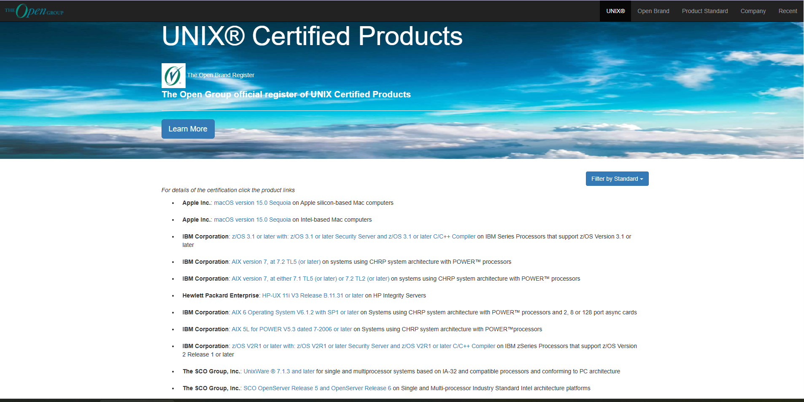
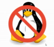

# 第 1.1 节 操作系统的历程：UNIX、Unix-like、Linux & FreeBSD

## 什么是 UNIX？

从前，UNIX 是一款操作系统。最后由 C 语言改写产生。——源自 `AT&T`（美国电话电报公司）的贝尔实验室。

现在是一种 **标准规范**、一款 **法律上的商标**。更是一种 **哲学思想**，一项 **软件工程原则。**

---

查询美国专利商标局 UNIX 商标注册情况：

---

UNIX 认证查询网址：[The Open Group official register of UNIX Certified Products](http://www.opengroup.org/openbrand/register)

现在，我们可以知道认证 UNIX 需要：

1. [符合单一 UNIX 规范](https://www.opengroup.org/openbrand/register/xym0.htm)
2. 交钱认证

可以看到，常见的，经过认证的 UNIX 操作系统有 Apple macOS。即从商标的角度上讲，macOS 可以称得上是标准的 UNIX 操作系统。~~故，要安装 UNIX 的人可以去黑苹果了~~

>**技巧**
>
>macOS/iOS 等与 BSD 的关系
>
>从历史与现实来看，macOS/iOS 等基于 BSD 确凿无疑，但并非全然基于某款 BSD：macOS/iOS 等应该被理解为一款独立的 BSD 操作系统——同 OpenBSD、NetBSD 和 FreeBSD 一样。参见[《苹果的开源基石：macOS 和 iOS 背后的 BSD 传统》](https://book.bsdcn.org/fan-yi-wen-zhang-cun-dang/2024-nian-11-yue/apple)
>
>所以看似是安卓和苹果之争，其实是 Linux 与 BSD 之争。~~也许也是大教堂与市集之争。~~

### UNIX 哲学与软件工程原则简介

#### 传统的 Unix 哲学观（以《UNIX 编程艺术》为核心）

>**思考题**
>
>> Those who do not understand Unix are condemned to reinvent it, poorly. （那些不懂 Unix 的人注定要再造一个四不像式 Unix）
>>
>>——[Henry Spencer](https://www.nasa.gov/history/alsj/henry.html)
>
>作者 Henry Spencer 并未明确批评哪个操作系统，那么你认为，现在这句话更适合哪个常见的操作系统？为什么？

Unix 哲学源于 UNIX 操作系统的开发，作者是 Ken Thompson。Unix 哲学一言以蔽之即大道至简（“keep it simple, stupid”）：

- 小即美
- 一个程序只做一件事
- 原型先行
- 可移植性先于高效率性
- 不使用二进制
- 沉默是金（无报错就沉默，成功则无输出，不显示操作进度等）
- 避免仅用户界面（避免无命令行，仅 GUI）

##### 参考文献

- 《UNIX 编程艺术》，Eric Raymond 著，ISBN: 9787121176654，电子工业出版社。
- 《Linux/Unix 设计思想》，Mike Gancarz 著，9787115266927，人民邮电出版社。（已绝版）
- [The Open Group Standards Process](https://www.opengroup.org/standardsprocess/certification.html)

### 二十一世纪的 Unix 哲学观

真正的 Unix 哲学绝不是上面那些陈旧古板的祖宗之法，Unix 哲学的精髓在于以人为本，真正的 Unix 哲学是一种人道主义。

大道至简在西方哲学中表现为奥卡姆的剃刀，即“如无必要，勿增实体。”这在某种程度上也启发了现象学的观念，我们应该把一些自行设定的观念从我们的脑子里排除出去，只留下我们能够直接感受到的东西——即回到事物本身。

我们现在回到操作系统本身，回到计算机本身，计算机不应成为一种额外的负担，而应为人所服务——正如 FreeBSD 的口号“The Power To Serve`（服务的力量）”那样。

### 详细说明

#### Mutlics

1964 年麻省理工学院推出的 CTSS（兼容分时系统），是当时最有创造性的操作系统，有了 CTSS 这种高效的操作系统，麻省理工学院的研究人员决定做一个更好的版本。他们开始设计 Multics 系统。Mutlics 意思是多路复用信息和计算服务。

Multics 意图创造强悍的新软件和比肩 IBM 7094 功能更丰富的新硬件，麻省理工学院邀请了两家公司来帮忙。美国通用电气公司负责设计及生产有全新硬件特性、能更好地支撑分时及多用户体系的计算机，贝尔实验室在计算机发展早期就开发了自己的操作系统，因此麻省理工邀请了贝尔实验室与美国通用电气公司共同开发 Multics。

最终 Multics 的开发陷入了困境，Multics 设计了大量的程序及功能，经常塞入很多不同的东西进去，导致系统过于复杂。1969 年，由于在贝尔实验室看来作为一套信息处理工具，它已经无法为实验室提供计算服务的目标，它的设计太昂贵了，于是在同年 4 月，贝尔实验室退出 Multics 项目，只剩麻省理工和美国通用电气公司继续开发。

#### UNICS

贝尔实验室退出 Multics 开发项目后，项目组成员 Kenneth Lane Thompson 找到一台 DEC PDP-7 型计算机，这台计算机性能不算强大，只有 4KB 内存，但是图形界面比较美观，Thompson 用他写了个游戏 *Space Travel*（《星际旅行》），PDP-7 有个问题就是磁盘转速远远低于计算机的读写速度，为了解决这个问题，Thompson 写了磁盘调度算法来提高磁盘总吞吐量。

>**技巧**
>
>《星际旅行》被人移植了，现在可以直接在网页上玩，项目位于 [C port of Ken Thompson's Space Travel](https://github.com/mohd-akram/st)，在线游玩的网站是 [Space Travel](https://akr.am/st/)。
>
>~~虽然操作简单但是看不懂怎么玩~~

如何测试这个新的算法？需要往磁盘上装载数据，Thompson 需要写一个批量写数据的程序。

他需要写三个程序，每周写一个：创建代码的编辑器，将代码转换为 PDP-7 能运行的机器语言汇编器，再加“内核的外层——操作系统就完成了”。

新的 PDP-7 操作系统编写没多时，Thompson 和几个同事讨论，当时新系统还没有名字，当时它被命名为“UnICS”（Uniplexed Information and Computing Service，非复用信息和计算机服务），UnICS 最后改名为 **UNIX**，这个名字更加方便记忆。

## 什么是 Unix-like？

Unix-like 即类 Unix，亦即一切符合 UNIX 标准的操作系统，基本遵守 POSIX 规范，而没有获得第一节中所说的 UNIX 的认证。

也就是说，除了 Windows，基本上世界上大多数操作系统都被叫做 Unix-like，其中就包括 Linux 和 FreeBSD。

## 什么是 Linux？

Linux 受启发于 Minix（UNIX 版权限制下的产物），一款设计用于教学的微内核操作系统。

>**技巧**
>
>现在，几乎每颗英特尔处理器上都运行着 Minix。
>
>~~或许 Minix 才是世界上最流行的操作系统~~

UNIX 标准 SUS 包含了 POSIX 标准，是其超集。Linux 实现了 POSIX 标准，但是未进行 [POSIX 认证](http://get.posixcertified.ieee.org/)。

本质上说 Linux 是 UNIX 的一种仿制品或者说克隆产物（类似于人与机器人的关系）。

Linux 之名来自 Linux 之父 Linus Torvalds。

### 狭义 Linux 是内核

[Linux kernel](https://www.kernel.org/) 项目 1990；

### 广义 Linux 是 GNU/Linux

GNU/Linux = Linux kernel + GNU 等软件 + 包管理器

>**[Chimera Linux](https://chimera-linux.org/) 除外。**

Linux 全称为 GNU/Linux；

[GNU 项目](https://www.gnu.org/) 1984——GNU's Not Unix，从 GNU 这个名字（GNU 不是 UNIX）你也能看出来 Linux 与 UNIX 并无直接关联。

具体地：

- GNU/Linux 发行版 = Ubuntu、RHEL、Deepin、OpenSUSE……
  - Ubuntu = Linux kernel + apt/dpkg + Gnome
  - OpenSUSE = Linux kernel + libzypp/rpm + KDE

> **注意**
>
> 如果你还是不明白，建议亲自安装试试 [Gentoo](https://www.gentoo.org/downloads/)（stage3）或 [Slackware](http://www.slackware.com/)，再不明白可以试试 [Gentoo（stage1）](https://wiki.gentoo.org/wiki/Stage_file) 或 [LFS](https://www.linuxfromscratch.org/lfs/)。
>
> 上述操作较为复杂，需要一定的经验与基础知识。

## 什么是 FreeBSD？

FreeBSD 不是 Linux。FreeBSD 也不是 UNIX 的克隆产物。

---

FreeBSD 这个词语由两部分构成，即“Free”和“BSD”。

BSD 最初是由加州大学伯克利分校（University of California, Berkeley）所开发的，意为 `Berkeley Software Distribution`（伯克利软件发行版）。

Free 则代表 Liberty 式自由和免费两种含义。

---

FreeBSD 未进行过 UNIX 认证，从版权角度来看，FreeBSD 的确不是 UNIX。但从历史来看 FreeBSD 可以被视为 UNIX 的直系后裔。

BSD 操作系统并非复制品，而是 AT&T 研究 UNIX（Research Unix）操作系统的开源衍生版本，也是现代 UNIX® System V 的祖先。在 4.4BSD 以前，BSD 全称为 BSD UNIX。

FreeBSD 日为 6 月 19 日。FreeBSD 基金会和社区在这天庆祝 FreeBSD 的生日。——[Join us to celebrate FreeBSD Day!](https://freebsdfoundation.org/freebsd-day/)

### UNIX 之船：FreeBSD 是不是 UNIX？

这个问题远没有想象中的那么清楚明白。我看到不少讨论者，甚至是亲历当初那段岁月的人，亦难以回答或澄清。或者只是简单的说，BSD 并未进行过任何 UNIX 认证，没有持有法律上的商标就草草终结话题；更有甚者只是笼统地说 FreeBSD 是 UNIX 的延续者与正统继承者，仅是“有实无名”；还有人认为，BSD 之于 UNIX，正如 Linux 之于 UNIX。

之所以有上述这些不同的回答，正是因为这个问题不是能够简单地套用法律上的商标归属或者代码上继承性进行分析的纯粹技术性难题。这其实牵涉到了一个深刻的本体论哲学问题——我们究竟是不能两次踏进同一条河流，还是一次也不能踏进同一条河流？（类似的问题如谷堆问题、秃头问题，感兴趣的读者可参见 SEP 条目“[Identity Over Time](https://plato.stanford.edu/entries/identity-time)”、“[Sorites Paradox](https://plato.stanford.edu/entries/sorites-paradox/)”）。对这个问题回答如何，其实映射着你的哲学观与科学技术观。

>**忒修斯之船**
>
>忒修斯和雅典青年安全返航所乘的是有三十支桨的大帆船，雅典人把这只船一直保存到德米特里·法勒琉斯的时代。他们一次又一次地拆掉了朽烂的旧船板，换上坚实的新船板。从此以后，这只船就成为哲学家们就事物的发展问题展开争论时经常援引的实例，一派认为它还是原来那只船，另一派争辩说它已不再是原来的船了。
>
>- [古希腊] 普鲁塔克. 希腊罗马名人传[M]. 译者：黄宏煦 主编 / 陆永庭 / 吴彭鹏, 第1版. 商务印书馆, 1990-11. 第 23 页（23）。

最初，Unix 是 `AT&T` 开发的操作系统，可以获取源代码，但并非开源。在 20 世纪 70 年代末，伯克利大学的计算机系统研究小组（Computer Systems Research Group，CSRG）开始对 Unix 进行深入研究，并为其开发了大量用户空间的程序，形成了名为 BSD（Berkeley Software Distribution，伯克利软件套件）的新系统。随着时间推移，BSD 系统逐渐发展，加入了许多创新，比如实现了 TCP/IP 协议栈。尽管 Unix 内核经历了多个版本的演变，但到了 90 年代，Net/2 版本发布后，Unix 内核中的 AT&T 代码已经被完全替换，成为了一款没有专利代码的系统。BSD 系统逐渐演化成为 4.2BSD，BSD 4.4-lite……进而成为了 386BSD。

在此过程中，BSD 和 AT&T 之间的关系发生了变化，最终引发了法律争议，导致 BSD 系统的分裂。1993 年，BSD 的核心代码分裂为两个主要的项目：NetBSD 和 FreeBSD。1996 年，OpenBSD 从 NetBSD 中复刻出来；2003 年，DragonFlyBSD 从 FreeBSD 中复刻出来。
