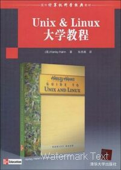
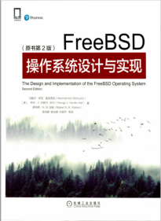
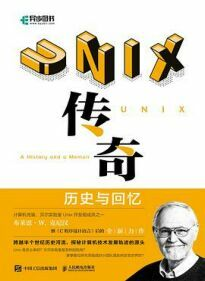
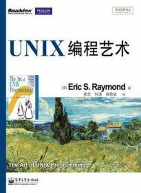
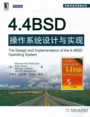
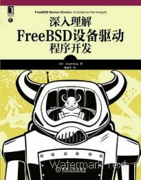
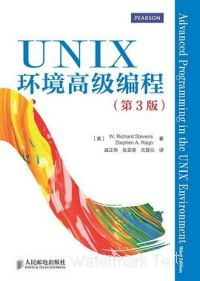
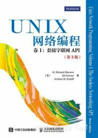
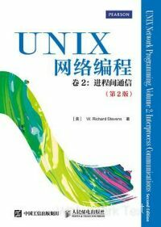

# 第 1.17 节 参考资料与贡献者名单

## 参考书目

相关书籍：新的变化也不是很大。不像 Linux 有这么多入门书籍。出于历史上的原因，看 UNIX 相关书籍即可。

### 在线书籍

[《FreeBSD 简体中文手册》](https://handbook.bsdcn.org/)

### 出版物

> 提示：以下有多本书籍可通过微信读书免费阅读。

|                                                    封面                                                     |                       书名                        |                              作者                              |     ISBN      |     出版社      |                                      原版书名                                       |                                      说明                                      |
| :---------------------------------------------------------------------------------------------------------: | :-----------------------------------------------: | :------------------------------------------------------------: | :-----------: | :-------------: | :---------------------------------------------------------------------------------: | :----------------------------------------------------------------------------: |
|  |            _**Absolute FreeBSD 3rd**_             |                        Michael W. Lucas                        | 9781593278922 | No Starch Press |                                          /                                          | 英文版，目前没有译文。词汇包括内容都非常基础。**有计算机基础的人不需要阅读。** |
|                                                        |             《Unix & Linux 大学教程》             |                          Harley Hahn                           | 9787302209560 | 清华大学出版社  |                     _**Harley Hahn's Guide to Unix and Linux**_                     |                                   命令行基础                                   |
|                                        |    《UNIX/Linux 系统管理技术手册（第 5 版）》     | Evi Nemeth、Garth Snyder、Trent R.Hein、Ben Whaley、Dan Mackin | 9787115532763 | 人民邮电出版社  |           _**UNIX and Linux System Administration Handbook 5th Edition**_           |                             命令行进阶与 UNIX 基础                             |
|                               |   《FreeBSD 操作系统设计与实现（原书第 2 版）》   |   Marshall McKusick、George Neville-Neil、Robert N.M. Watson   | 9787111689973 | 机械工业出版社  |        _**Design and Implementation of the FreeBSD Operating System, 2nd**_         |                                主要讲解了内核。                                |
|                                                 |             《UNIX 传奇——历史与回忆》             |                       Brian W Kernighan                        | 9787115557179 | 人民邮电出版社  |                         _**UNIX: A History and a Memoir**_                          |                          主要讲解了 UNIX 的发展历史。                          |
|                                                           |                 《UNIX 编程艺术》                 |                          Eric Raymond                          | 9787121176654 | 电子工业出版社  | _**The Art of UNIX Programming (The Addison-Wesley Professional Computng Series)**_ |                   主要讲解了 UNIX 的设计哲学与软件工程理论。                   |
|                                                           |                 《大教堂与集市》                  |                        Eric S. Raymond                         | 9787111452478 | 机械工业出版社  |                          _**The Cathedral & the Bazaar**_                           |                          主要介绍了开源运动的发展史。                          |
|                                                    |           《4.4BSD 操作系统设计与实现》           |                     Marshall Kirk McKusick                     | 9787111366478 | 机械工业出版社  |         _**The Design and Implementation of the 4.4BSD Operating System**_          |                           4.4BSD 操作系统设计与实现                            |
|                                          |       《深入理解 FreeBSD 设备驱动程序开发》       |                          Joseph Kong                           | 9787111411574 | 机械工业出版社  |               _**FreeBSD Device Drivers: A Guide for the Intrepid**_                |                            FreeBSD 设备驱动程序开发                            |
|                                                    |         《UNIX 环境高级编程（第 3 版）》          |               W.Richard Stevens、Stephen A.Rago                | 9787115352118 | 人民邮电出版社  |          _**Advanced Programming in the UNIX Environment, Third Edition**_          |                   深入了解驱动 UNIX 内核的编程接口的实用知识                   |
|                                 | 《UNIX 网络编程 卷 1：套接字联网 API（第 3 版）》 |       W. Richard Stevens、Bill Fenner、Andrew M. Rudoff        | 9787115367198 | 人民邮电出版社  | _**UNIX Network Programming, Volume 1: The Sockets Networking API, Third Edition**_ |                        如何使用套接字 API 进行网络编程                         |
|                                     |   《UNIX 网络编程 卷 2：进程间通信（第 2 版）》   |                       W. Richard Stevens                       | 9787115367204 | 人民邮电出版社  | _**UNIX Network Programming,Vovum 2：Interprocess Communications,Second Edition**_  |       深入了解各种进程间通信形式。**这书原作者没出第 3 版，不用再找了**        |

## 贡献者名单（以下排名随机排序）

[凌莞](https://clansty.com)

星不萌

雨天

[柳离枝](https://github.com/liulitchi)

[peiyafei](https://github.com/peiyafei)

[ykla](https://github.com/ykla)

艳阳天

施主

fjh1997

X-Ray

freyr

[fanyang1997](https://github.com/fanyang1997)

[orzyyyy](https://github.com/orzyyyy)

[Rintim](https://github.com/Rintim)

[DogeW](https://github.com/DogeW)

[tomblackwhite](https://github.com/tomblackwhite)

isNijikawa

[matatabi-wang](https://github.com/matatabi-wang)

地铁卡

ruur

[puffinjiang](https://github.com/puffinjiang)

[heguru5](https://github.com/heguru5)

李大鹏

liguangsheng

kuntop

[matatabi-wang](https://github.com/matatabi-wang)

[星不萌](https://www.moebsd.cn)

[Alex6357](https://github.com/Alex6357)

[qinghecyn](https://github.com/qinghecyn)

[清热解毒口服液](https://linuxacme.cn)

墨子

201724

April Simone🍥

心即理物即心

Jack

Zomby7e

tergel93

奇点

兜率

[safreya](https://github.com/safreya)

杭永聪

Shengyun

仰望天空

[魔王酱](https://github.com/maou-sama-desu)

极品盗号

[blu10ph](https://github.com/blu10ph)

livrth

欧卓华

**注意：如果缺少了你的信息或者不想被列出，请发起 issue。**

