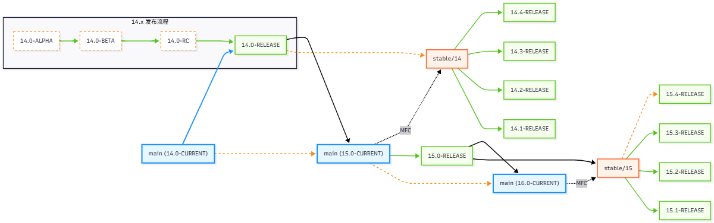
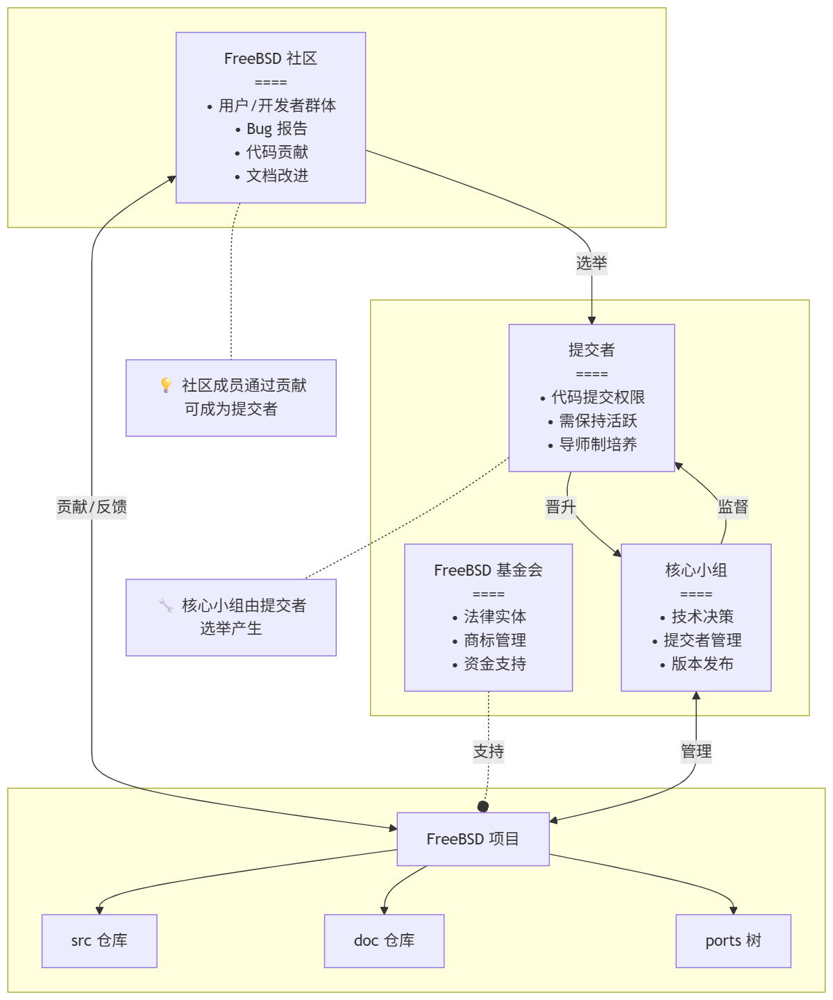
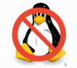
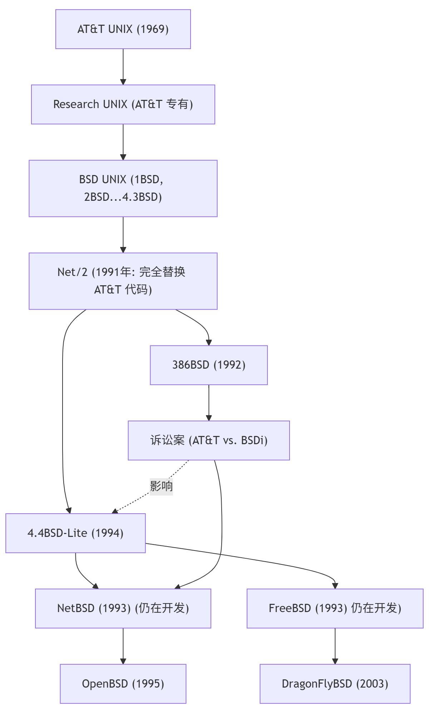
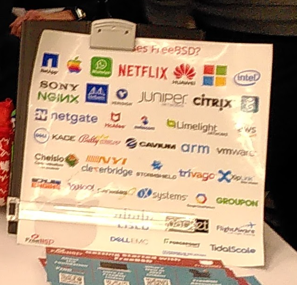

# 1.2 FreeBSD 导论

## FreeBSD 版本概述

已知 FreeBSD 有如下版本（或阶段）：alpha、rc、beta、release、current、stable。

**release** 版本是适用于生产环境的，即一般意义上的 **稳定版** 或者说 LTS。而 ***stable*** 和 ***current*** 都是 **开发分支**，都是 **不稳定的**（稳定与不稳定是相对的，[Netflix 几乎所有节点都运行着 **current**](https://freebsdfoundation.org/netflix-case-study/)），一般情况下不建议将其用于生产环境。

>**注意**
>
>FreeBSD 的 ***stable*** 与一般 Linux 发行版的“稳定版”之概念并不一致，反而是一种 **不稳定** 的“开发版”。
>
>FreeBSD 的 ***stable*** 的真实意思是该分支的 ABI（Application Binary Interface，应用程序二进制接口）是稳定的。
>
> ——参见 [FreeBSD Glossary STABLE](https://wiki.freebsd.org/Glossary#STABLE)

alpha 是 current 进入 release 的第一步。具体过程是 current --> alpha（进入 stable 分支）--> beta --> rc --> release。

current 相对稳定后（即 MFC 最短三天，MFC 即 `Merge From Head`，类似向后移植 `backporting`）会推送到 stable，但是不保证二者没有大的 bug。参见 [FreeBSD Release Engineering](https://docs.freebsd.org/en/articles/freebsd-releng/)。

>**警告**
>
>使用非生产版本（如 CURRENT、STABLE、Alpha、BETA、RC 等非 RELEASE 版本）的 FreeBSD 的用户会被社区推定为需要具有一定的探索精神，关注开发进展和邮件列表的意愿以及动手去做的潜能，并且拥有可以积极反馈 Bug 的乐观心态。这对大多数读者来说都是困难的且无必要的。如果并不满足上述条件，建议读者始终使用面向生产环境的 RELEASE！

>**警告**
>
>上图并不严谨，X.0-RELEASE 其实来自 X-STABLE；X-STABLE 直接由 X-1.CURRENT 转化而来。暂无力修改。待定。

>**注意**
>
>只有 alpha、rc、beta 和 release（[且是一级架构](https://www.freebsd.org/platforms/)）才能使用命令 `freebsd-update` 更新系统，其余版本系统均需要通过源代码编译的方式（或使用二进制的 pkgbase）更新系统。
>
>FreeBSD 开发计划准备删除命令 `freebsd-update`，一律改用 pkgbase。
>
> ——参见 [FreeBSD Manual Pages freebsd-update](https://man.freebsd.org/cgi/man.cgi?freebsd-update)

## FreeBSD 项目宗旨

FreeBSD 项目（FreeBSD Project）致力于提供一款真正的自由软件，实践自由软件的使命：使 FreeBSD 的代码得到最大程度的利用，让所有人——无论其目的为何——都能从中受益。简而言之，“只求我为人人，不求人人为我”，这正是我们热情拥护的宗旨。

在 FreeBSD 项目的源代码中包含部分以 GNU 通用公共许可证（GPL）和 GNU 宽通用公共许可证（LGPL）授权的软件，FreeBSD 项目持续努力减少其比重。尽管这些许可证要求开源，而非闭源，但它们仍带来一定的法律挑战和额外的复杂性。为了更好地实现 FreeBSD 的宗旨，尽可能提供无附加条件的软件，从而减少在商业使用中的复杂性，FreeBSD 项目在可能的情况下，更倾向于采用限制更少的 BSD 许可证。

>**思考题**
>
>>BSD 2 条款许可证摘录：“在满足以下条件的前提下，允许在源代码和二进制形式中 **重新分发** 和使用本软件”
>
>>“你可以继续从上游继续取得 BSD 授权的初始源代码，但是如果你使用以 GPL 再授权的原 BSD 衍生代码依旧要遵循 GPL，如此实现了 BSD 到 GPL 代码的单行道，只要 BSD 源代码进入 GPL 项目就等同进入了黑洞，即 **BSD 代码的 GPL 化** 是不可逆的。BSD 世界逐渐被 GPL 蚕食。但是事实上 BSD 代码在开源和闭源世界都得到了最大程度的复用。”
>
>1.除了可以将 BSD 授权的软件转为私有软件外，还能怎样理解这种“重新分发”？在满足条件（主要是一些免责和版权声明）后，能以何种许可证再分发和重授权？
>
>2.为什么自由软件基金会称 BSD 2 条款许可证和 GPLv2/GPLv3 兼容？如果 BSD 授权的软件 A 进入 GPLv2 项目 B 中成为其一部分。下游用户再分发时，在何种条件下，要求软件 A 也遵守 GPLv2 而非通过 BSD 协议转为专有软件？为什么？
>
>3.站在许可证的感染性角度，再理解 Linux kernel 的 GNU 化以及 FreeBSD 基本系统的去 GNU 化。
>
>4.你怎样理解这种代码复用目的的成功达成？

## FreeBSD 开发模型

### 存储库

FreeBSD 项目历史悠久，其使用的版本控制工具历经了 CVS、SVN、Git。目前使用 Git 进行协作开发。

FreeBSD 项目的存储库分为三个：freebsd src（源代码）、freebsd ports（Port 软件移植）、freebsd doc（文档）。三个项目地位相等。

### FreeBSD 基金会

FreeBSD 基金会是美国科罗拉多州博尔德县的一家 501(c)3 非营利机构，负责接收捐赠，支持项目开发，充当 FreeBSD 项目法律实体，会议赞助，宣传和推广 FreeBSD 项目。基金会的所有权力集中在董事会，董事由现有董事会成员选举产生（新董事仅限现任董事提名），每位董事任期 1 年，可连选连任。

在大部分国家，FreeBSD 商标都由 FreeBSD 基金会持有。

### FreeBSD 社区

FreeBSD 项目通过网络远程开发。

FreeBSD 社区由来自全世界各地的开发者和用户构成。FreeBSD 社区并不是一个法律实体，也无固定办事处。FreeBSD 社区不仅仅是英文世界的声音，我们还有中文社区、俄语社区、韩语社区、日语社区等。

### 提交者

提交者是那些有权力直接写入 FreeBSD 存储库的人。要想成为提交者，须经过导师机制，必须由已有提交者推荐。为了防范潜在的安全风险，提交者并非终身制：对于 freebsd src 和 freebsd doc，提交者在 18 个月应有一次提交；对于 freebsd ports 则是 12 个月。非活跃提交者的权限将被暂停，但可以申请恢复。

### FreeBSD 核心小组

FreeBSD 核心小组是 FreeBSD 项目的最高领导机关，共计 9 人，FreeBSD 核心小组采取集体领导制度，每位成员分管不同的子项目。FreeBSD 核心小组负责授予或撤销提交者权限及账户、执行冲突守则（CoC）、管理项目子团队等。

FreeBSD 核心小组选举每两年举行一次，可以连选连任。只有在过去 12 个月内有过提交的提交者（视为活跃提交者）才拥有选举权和被选举权。活跃开发者可以表决罢免 FreeBSD 核心小组成员。此外，核心团队还负责招募新的核心团队成员，以替代离任的成员。

在历史上并不会出现每两年所有核心小组所有成员都被完全轮替的情形（即所有人都是新手），一位核心小组成员在实践上会连任两届或更多届。核心小组成员和 FreeBSD 董事会成员往往是交叉接替任职。

FreeBSD 核心小组成员并不直接从中获取任何利益，同样也都是志愿者。有些成员可能会接受 FreeBSD 基金会的雇佣或赞助来参与专门开发某项目。

## FreeBSD 当前困境

- 大型技术企业对 FreeBSD 支持不足，如长久以来都未提供 GitHub actions 的支持，Nvidia CUDA 的忽视，在 AI 与 LLM 时代的全面溃败；
- FreeBSD 项目缺乏对欧洲和北美以外地区的关注与投入；
- 相比其他开源项目中仁慈的终身独裁者，集体领导在 FreeBSD 项目中并未显出任何特色，反而造成了“三个和尚没水喝”的局面。分管 FreeBSD 子项目的核心成员对项目本身也缺乏应有的了解和关注。面对一些小问题都无法承担责任；
- FreeBSD 项目整体过于保守，新技术的引入往往需要数年跨越多个大版本。往往要等待已有技术轮替一到两代后才会引入；但这并不显得多么有远见，引入后也往往无人问津并且没有相关后续维护与开发；
- FreeBSD 系统总体上不够现代化，缺乏现代操作系统应有的实现。尤其是在嵌入式方面比较差。
- FreeBSD 没有为用户提供带桌面的基本系统；
- FreeBSD 的驱动支持较差；
- FreeBSD 的资料相对较少；
- FreeBSD 的开发者非常少，且对外部贡献者严重缺乏时间感；
- FreeBSD 基金会、期刊、Bug 报告等对外部贡献者严重缺乏时间感；
- FreeBSD 文档项目严重停滞十年之久，个人贡献者除季度报告外的任何提交在事实上都不会被接纳；src ports 也一样难以接纳新的个人贡献者。
- 尚未完全支持安全启动（Secure boot）
- 对 TPM 的支持有限
- 由于 Linuxism，导致很多软件比如 NetworkManager 无法移植，桌面环境的组件也无法完善；
- 由于 FreeBSD 项目的基本目标和设计问题，FreeBSD 基本系统不包含 Linux 发行版中常用的一些软件和命令；
- FreeBSD 两款原生的文件系统 ZFS 与 UFS 都只能扩大不能缩小；
- FreeBSD 缺乏上层应用软件设计，即使底层有类似 docker 的技术 jail 也没能发展起来；FreeBSD 的虚拟化技术 Bhyve 也需要改进。

## FreeBSD 怎么读

目前社区共识和普遍的读法是：/ˌfriːˌbiːɛsˈdiː/，即读作“Free（/friː/）+ B（/biː/）+ S（/ɛs/）+ D（/diː/）”，即类似于“福瑞/必/哎司/地”。

Free 和三个字母 B、S、D 分别分开读——先说 Free 这个完整的词，再 B、S、D 逐字母拼读。

一般不会把 BSD 或 FreeBSD 视作一个词语连读。不会将其读做“百思得”或“福瑞/百思德”（~~FreeBSD 基金会在中国大陆注册商标的机构中文翻译是“福瑞百思德基金会”~~）。

## 什么是 FreeBSD？

FreeBSD 不是 Linux。FreeBSD 也不是 UNIX 的克隆产物。FreeBSD 是一款自由软件。

FreeBSD 这个词语由两部分构成，即“Free”和“BSD”。

BSD 最初是由加州大学伯克利分校（University of California, Berkeley）所开发的，意为 `Berkeley Software Distribution`（伯克利软件发行版）。

Free 则代表 Liberty 式自由和免费两种含义。

FreeBSD 日为 6 月 19 日。FreeBSD 基金会和社区在这天庆祝 FreeBSD 的生日。——[Join us to celebrate FreeBSD Day!](https://freebsdfoundation.org/freebsd-day/)

### UNIX 之船：FreeBSD 是不是 UNIX？

这个问题远没有想象中的那么清楚明白。我看到不少讨论者，甚至是亲历当初那段岁月的人，亦难以回答或澄清。或者只是简单的说，BSD 并未进行过任何 UNIX 认证，没有持有法律上的商标就草草终结话题；更有甚者只是笼统地说 FreeBSD 是 UNIX 的延续者与正统继承者，仅是“有实无名”；还有人认为，BSD 之于 UNIX，正如 Linux 之于 UNIX。

之所以有上述这些不同的回答，正是因为这个问题不是能够简单地套用法律上的商标归属或者代码上继承性进行分析的纯粹技术性难题。这其实牵涉到了一个深刻的本体论哲学问题——我们究竟是不能两次踏进同一条河流，还是一次也不能踏进同一条河流？（类似的问题如谷堆问题、秃头问题，感兴趣的读者可参见 SEP 条目“[Identity Over Time](https://plato.stanford.edu/entries/identity-time)”、“[Sorites Paradox](https://plato.stanford.edu/entries/sorites-paradox/)”）。对这个问题回答如何，其实映射着你的哲学观与科学技术观。

>>**忒修斯之船**
>>
>>忒修斯和雅典青年安全返航所乘的是有三十支桨的大帆船，雅典人把这只船一直保存到德米特里·法勒琉斯的时代。他们一次又一次地拆掉了朽烂的旧船板，换上坚实的新船板。从此以后，这只船就成为哲学家们就事物的发展问题展开争论时经常援引的实例，一派认为它还是原来那只船，另一派争辩说它已不再是原来的船了。
>>
>>- [古希腊] 普鲁塔克. 希腊罗马名人传 [M]. 译者：黄宏煦 主编 / 陆永庭 / 吴彭鹏, 第 1 版. 商务印书馆, 1990-11. 第 23 页（23）。
>
>**思考题**
>
>① 如果这艘船替换了若干组件，这艘船是不是忒修斯之船？
>
>② 如果有一天，这艘船原有的所有组件都被完全替换了一遍，这艘船还是不是忒修斯之船？
>
>③ 如果把所有替换下来的组件拼凑起来，组成一艘新船，这艘船是不是忒修斯之船？

BSD 操作系统并非复制品，而是 AT&T 研究 UNIX（Research Unix）操作系统的开源衍生版本，也是现代 UNIX® System V 的祖先。在 4.4BSD 以前，BSD 全称为 BSD UNIX。

最初，Unix 是 `AT&T` 开发的操作系统，可以获取源代码，但并非开源。在 20 世纪 70 年代末，伯克利大学的计算机系统研究小组（Computer Systems Research Group，CSRG）开始对 Unix 进行深入研究，并为其开发了大量用户空间的程序，形成了名为 BSD（Berkeley Software Distribution，伯克利软件套件）的新系统。随着时间推移，BSD 系统逐渐发展，加入了许多创新，比如实现了 TCP/IP 协议栈。尽管 Unix 内核经历了多个版本的演变，但到了 90 年代，Net/2 版本发布后，Unix 内核中的 AT&T 代码已经被完全替换，成为了一款没有专利代码的系统。BSD 系统逐渐演化成为 4.2BSD，BSD 4.4-lite……进而成为了 386BSD。

在此过程中，BSD 和 AT&T 之间的关系发生了变化，最终引发了法律争议，导致 BSD 系统的分裂。1993 年，BSD 的核心代码分裂为两个主要的项目：NetBSD 和 FreeBSD。1996 年，OpenBSD 从 NetBSD 中复刻出来；2003 年，DragonFlyBSD 从 FreeBSD 中复刻出来。

如果你现在去查阅 FreeBSD 的源代码，你极有可能还会看到以前的开发者在 1982 年留下的注释和版权声明。

>**思考题**
>
>你如何理解 FreeBSD 与 Unix 的关系？

## 谁在使用 FreeBSD

图片来源 [FreeBSD 基金会宣传图](https://i.imgur.com/qW0IePB.png)

- 华纳兄弟的电影《[黑客帝国](https://movie.douban.com/subject/1291843/)》（*[The Matrix](https://www.imdb.com/title/tt0133093/)*）的特效就是在一组 FreeBSD 集群上制作的。——参见 [*FreeBSD Used to Generate Spectacular Special Effects*](https://www.freebsd.org/press/press-rel-1/) 及《[FreeBSD 技术内幕](https://book.douban.com/subject/1240853/)》 (简体中文译本)，机械工业出版社。ISBN 7-111-10201-0，第 2 页。
- 苹果（Apple）的操作系统如 MacOS、IOS 等大量复用了 BSD（不止是 FreeBSD）的技术栈。BSD 可以称得上是 MacOS 的开源基石。——参见 [Apple’s Open Source Roots: The BSD Heritage Behind macOS and iOS](https://thenewstack.io/apples-open-source-roots-the-bsd-heritage-behind-macos-and-ios/)
- 索尼（Sony）的游戏机 PlayStation 3（PS3）、PlayStation Vita（PSV）、PlayStation 4（PS4）、和 Playstation 5（PS5）使用的操作系统。参见索尼官网 [FreeBSD Kernel](https://www.playstation.com/en-us/oss/ps4/freebsd-kernel/)、[Free BSD License](https://www.playstation.com/en-us/oss/ps3/free-bsd/)、[FreeBSD](https://www.playstation.com/en-us/oss/ps-vita/)。PS 5 并未列出许可证，但是根据 [Kernel](https://www.psdevwiki.com/ps5/index.php?title=Kernel)。仍然使用了 FreeBSD 11。
- 奈飞（Netflix）几乎所有网络活动（内容缓存/CDN）都使用 FreeBSD 设备进行。——参见 [Netflix Case Study](https://freebsdfoundation.org/netflix-case-study/)
- QNX 操作系统。QNX 是一款实时操作系统。QNX 以前是黑莓手机的操作系统。QNX 现在被广泛应用为汽车安全操作系统（即车机，**安卓是运行在 QNX 之上的操作系统，与车机系统分离**）。国内新能源车辆普遍采用了 QNX 操作系统（关键领域占比超过九成）。QNX 大量复用了 FreeBSD 的技术栈。——参见 [QNX](https://www.qnx.com/developers/docs/8.0/search.html?searchQuery=freebsd) 官网、[中国汽车实现“芯魂兼具”应从两方面发力](http://auto.ce.cn/auto/gundong/202407/31/t20240731_39088063.shtml)、[Automotive](https://www.qnx.com/content/qnx/cn/solutions/industries/automotive/)。同时查询 FreeBSD 基金会 2024 [捐款页面](https://freebsdfoundation.org/our-donors/donors/?donationYear=2024)，上面也有黑莓（QNX 开发者）。
- Dell EMC Isilon，戴尔的 Isilon（面向企业的 NAS 存储设备）设备使用的操作系统 OneFS 基于 FreeBSD。——参见 [PowerScale OneFS：了解基于源的路由](https://www.dell.com/support/kbdoc/zh-cn/000020056/isilon-onefs-understanding-source-based-routing-sbr-in-isilon?lang=zh)，中明确提及“OneFS 是基于 FreeBSD 的”。另见 [DSA-2020-086: Dell EMC Isilon OneFS Security Update for FreeBSD libfetch Vulnerability](https://www.dell.com/support/kbdoc/000153860/dsa-2020-086-dell-emc-isilon-onefs-security-update-for-freebsd-libfetch-vulnerability?lang=en) 等安全报告。附 [IsilonSystems](https://wiki.freebsd.org/IsilonSystems)
- Beckhoff 倍福自动化控制系统的操作系统 TwinCAT/BSD。——参见 [TwinCAT/BSD](https://www.beckhoff.com/en-en/products/ipc/software-and-tools/twincat-bsd/)
- OpenHarmony LiteOS 内核引入了一些 FreeBSD 代码用作驱动等。——参见 [kernel_liteos_a](https://gitee.com/openharmony/kernel_liteos_a/tree/master)

### 参考文献

- [谁在使用 FreeBSD](https://book.bsdcn.org/fan-yi-wen-zhang-cun-dang/2025-nian-1-yue/di-1.5-jie-shui-zai-shi-yong-freebsd)，有一份 FreeBSD 基金会官方版本

## 为什么选择 FreeBSD

### 一句话原因——FreeBSD 能在这流变的世界中寻求理想的中道

背景：相较于 OpenBSD 和 Linux 等操作系统，FreeBSD 的 Kernel API/ABI 比较地稳定。

你也可以说 FreeBSD 项目相对保守。FreeBSD 项目奉行最小惊讶原则（Principle of Least Astonishment，POLA），简而言之就是你的设计必须符合用户的习惯、期望和心智能力。

如果你想选择一款在大版本更新后也不怎么影响日常工作的系统，而不是每天都在和操作系统斗智斗勇，那么 FreeBSD 值得信赖。

FreeBSD 配置文件和系统组件不会 **变来变去的**，这在大版本变动时尤为突出。FreeBSD 也谨慎对待 **破坏性变化**（Breaking change），FreeBSD 要求在大版本内保持 ABI 的稳定。

FreeBSD 不仅仅是 **在生命周期内不变**，大版本更新也具有连贯性和稳定性，轻而易举地就可以实现大版本间的迁移。FreeBSD 上软件的版本都是可以滚动变化的，不会锁定如 Python 版本等。

### 选择 FreeBSD 的一般原因

- 从道家来讲，你爱用不用，不用也无妨：人间一游，开心快乐才是最重要的事情。
- 从佛法来说，因为缘分。万物缘起性空，我们有缘相聚，又会者定离。万般诸相皆如此。
- 从基督教来讲，这是主的指引。上帝在永恒的现在中创世。就像出埃及记一样，你看上去是自己的选择，实际上都是主的安排。
- 从黑格尔来讲，是因为辩证否定。FreeBSD 是 UNIX 直接后裔，而很多协议又脱胎于 UNIX，所以你注定了要来到这里。
- 追求软件的稳定和新，既要有二进制源，又要能编译安装。除了 FreeBSD 之外难以找到这样的开源系统（~~VoidLinux 还是算了吧~~）。
- BSD 赋予了你更纯粹的自由：不以限制自由来保障自由，而是以信任与开放成就真正的自由。
- FreeBSD 是学院派的工程实践成果，更是 UNIX 哲学的现代延续者。
- 当其他操作系统生态愈发碎片化的同时，FreeBSD 的一体化设计避免了无休止的选择困难——但这并非限制，如果你喜欢，很轻松就能对其进行修改。
- BSD 是一款完整的操作系统，而不是内核。内核和基本系统作为一个项目来整体维护。缺乏基本系统的概念，将带来无尽的混乱与违反直觉的行为。
- FreeBSD 社区是由核心小组集体领导的。
- 教育与研究：FreeBSD 项目将内核与用户空间融入一个存储库之中，极大地便利了各种人群对其进行研究和学习，并且注释清晰丰富。你可以轻易地找到某某功能究竟是如何实现的。
- FreeBSD 无论社区还是开发者都秉持着“慢就是快，快就是慢”的哲学思想。~~我们的确需要花些时间慢下来，审视自己的一切，无论知识还是自我。花些时间在路旁的花朵石子上面，也许并不是浪费时间，无所事事。~~
  
### 选择 FreeBSD 的技术性原因

#### 一般技术原因

- FreeBSD 基本系统的配置文件与第三方软件配置文件相分离，系统级配置文件与用户配置文件相分离。~~再也不用到处用 find 命令查找某个 `.conf` 文件到底安装在哪了。~~
- 由于基本系统的存在，第三方的软件几乎不影响系统的稳定性。FreeBSD 在软件更新和系统稳定之间找到了平衡点。
- 通过 BSD 的 Ports 可以编译安装软件，自由配置。
- 不会锁定软件版本。比如 Python GCC 等常见的系统依赖软件。但所有的 FreeBSD 都共用相同的 Ports，无论新旧系统，其第三方软件的版本都是相同的；仅极个别软件和系统版本硬捆绑，其余所有软件都可滚动更新。
- 由于 Ports 的存在，旧版 FreeBSD 系统的软件源仍可正常使用，而不像其他操作系统那样一旦 EoL 就没有软件源可用了。
- 在 FreeBSD 项目中，文档不再是附属品。FreeBSD doc 项目与 src 项目是同等地位的，不分高下。
- 接近 2 年的版本发布周期，4 年的维护周期赋予了 FreeBSD 稳定性。
- 可以轻松地为你的根分区（`/`）配置使用 ZFS 文件系统。ZFS 被誉为最强大的文件系统。
- Jail 与 bhyve 虚拟化，不需要额外安装和维护底层虚拟化堆栈。也不需要为每个实例启动完整的操作系统内核和用户空间，节约系统资源。
- 传统的 BSD INIT 引导，回归简单，回归真实可见的纯文本。
- DTrace 框架与 GEOM 存储框架。
- Linux 二进制兼容层，可运行 Linux 软件。且软件运行速度并不逊色于 Linux。
- FreeBSD 的驱动在大致上与内核解耦合。
- FreeBSD 秉持人人自由开发的理念，目前 [你可以直接在 Github 上提交你的代码](https://github.com/freebsd/freebsd-src/pulls)，或者注册个账号在 <https://reviews.freebsd.org/> 进行大规模变更。
- FreeBSD 的代码风格是 Kernighan & Ritchie 经典著作《C 程序设计语言》（*The C Programming Language*）中使用的风格。

#### 安全原因

- 对部分 Ports 进行了加固，参见 [FreeBSD security hardening with compiler options](https://www.leidinger.net/blog/2025/05/24/freebsd-security-hardening-with-compiler-options/)、[Add new features fortify, stack_autoinit and zeroregs](https://bugs.freebsd.org/bugzilla/show_bug.cgi?id=284270)
- 披露的安全漏洞少于其他主流操作系统（尽管可能存在样本数量较少的客观因素）。截至 2025 年 9 月，FreeBSD 基本系统（用户空间 + 内核）CVE 漏洞仅为 Linux 内核的约二十分之一（根据 <https://www.cvedetails.com/> 统计 CVE），后者与 Windows CVE 数量大致持平。其中 OpenBSD 的 CVE 漏洞数量约为 FreeBSD 的 40%。
- 可以避免在产品和架构中出现共同故障点。
- 安全事件审计。
- 集成了标准 Unix DAC、ACL、TrustedBSD MAC 安全框架（基于 POSIX®.1e 草案的安全扩展），参见 [wiki TrustedBSD](https://wiki.freebsd.org/TrustedBSD/)
- 集成 W^X 策略，参见 [Implement enforcing write XOR execute mapping policy.](https://reviews.freebsd.org/D28050)
- 默认启用了内核和用户空间的 PIE 和 ASLR，参见 [Enable ASLR by default for 64-bit executables.](https://reviews.freebsd.org/D27666)
- FreeBSD 通过了 National Institutes of Standards and Technology（NIST，美国国家标准及技术研究所）安全软件开发框架（SSDF）认证，参见 [FreeBSD Foundation Announces SSDF Attestation](https://freebsdfoundation.org/news-and-events/latest-news/freebsd-foundation-announces-ssdf-attestation/)
- 实现了 FreeBSD 14 CIS 基准。参见 [New CIS® FreeBSD 14 Benchmark: Secure Your Systems with Expert-Guided Best Practices](https://freebsdfoundation.org/blog/new-cis-freebsd-14-benchmark-secure-your-systems-with-expert-guided-best-practices/)
- 正在实现 FreeBSD 的零信任构建，参见 Sovereign Tech Agency 相关赞助
- 基于 GEOM 框架的全盘加密（含 ZFS、Swap）方案
- 正在改进软件物料清单（Software Bill of Materials，SBOM），参见 Sovereign Tech Agency 相关赞助
- Capsicum 框架，并且已经对基本系统中大量工具进行了能力化加固。参见 [wiki Capsicum](https://wiki.freebsd.org/Capsicum)
- FreeBSD 内核拥有五种不同的安全级别（securelevel）可以自由选择，参见 [man mitigations](https://man.freebsd.org/cgi/man.cgi?query=mitigations)，还介绍了 FreeBSD 上若干安全漏洞缓解手段
  
  
#### 参考文献

- [Submitting GitHub Pull Requests to FreeBSD](https://freebsdfoundation.org/our-work/journal/browser-based-edition/configuration-management-2/submitting-github-pull-requests-to-freebsd/)，翻译在 [在 GitHub 上向 FreeBSD 提交 PR](https://github.com/taophilosophy/freebsd-journal-cn/blob/main/2024-0506/zai-github-shang-xiang-freebsd-ti-jiao-pr.md)
- [Contribution Guidelines for GitHub](https://github.com/freebsd/freebsd-src/blob/main/CONTRIBUTING.md)，应该以此为准
- Linux Kernel 由 Linus 一人裁决：“[Linus Torvalds 是决定改动能否进入 Linux 内核的最终裁决者。](https://www.kernel.org/doc/html/latest/translations/zh_CN/process/submitting-patches.html)”
- [Linux 内核编码风格](https://www.kernel.org/doc/html/latest/process/coding-style.html)
- Linux 内核开发是个 [较为封闭的过程](https://www.kernel.org/doc/html/latest/process/submitting-patches.html)，只有少数人能够参与直接提交代码
- [Sandbox Your Program Using FreeBSD's Capsicum](https://cdaemon.com/posts/capsicum)，翻译在 [利用 FreeBSD Capsicum 框架实现程序沙箱化](https://book.bsdcn.org/fan-yi-wen-zhang-cun-dang/2025-nian/capsicum)。这是篇有关 Capsicum 框架的简介
  
### 选择 FreeBSD 的社会意义

#### 红帽公司控制下的 Linux 歧视

不难发现 GNOME、Xorg（X11）、DBus、Systemd、PulseAudio、Wayland、PipeWire 目前这些主流的 Linux 项目其实都是由红帽公司（Red Hat）实际控制和施加影响的，而且关键在于他们大都难以完全适配其他类 Unix 操作系统。

显而易见：目前 FreeBSD 上的桌面部件的缺失很大程度上是因为他们过分依赖了 Linux 特有函数库，比如包含 `ip` 命令的 `iproute2` 软件包。更多的原因则是因为这些桌面或部件和 systemd 做了深度捆绑或者根本就是强制依赖，比如 `NetworkManager`。而 Samba 开发者则说“We use Linux, we develop for Linux, all others please submit patches”（我们使用 Linux，我们为 Linux 开发，其余系统的用户请提交补丁）FreeBSD 社区的人把这种行为叫做“Linuxism”（Linux 主义/Linux 歧视）。

这种行为会导致何种后果我们不得而知，但是这种程序愈来愈多了，而且有成为主流的趋势，甚至就连大部分开发者在开发程序（如 `todesk`）时也不再考虑兼容 init。甚至 Java 程序都丧失掉了他的可移植性，为什么 FreeBSD 上的 Eclipse 将近两年没有更新？就是因为这类 [捆绑问题](https://git.eclipse.org/r/c/platform/eclipse.platform.swt/+/163641/)。预计在将来所有可运行在 Linux 上的程序也将失去任何的可移植性。

现在 FreeBSD 所面临的这种困境，将是未来所有人都要面对的。

- 选择 FreeBSD，就是选择保留一份自由软件的火种。
- 选择 FreeBSD，就是选择保留下一份真正自由的操作系统。能够使开源事业继续坚持下去，并践行真正的 UNIX 哲学。

#### 旧闻：《[FreeBSD 基金会收到史上最大一笔捐款](https://freebsdfoundation.blogspot.com/2014/11/freebsd-foundation-announces-generous.html)》

>上周，我向 FreeBSD 基金会捐赠了 100 万美元，FreeBSD 基金会支持着开源操作系统 FreeBSD。FreeBSD 帮助了数百万程序员追随他们的热情、实现创意。我自己就是受益者。在 90 年代末，我开始使用 FreeBSD，那时我经济拮据，住在政府提供的住房中。在某种程度上，FreeBSD 帮助我摆脱了贫困——我能进入 Yahoo!（雅虎）工作的重要原因是，他们使用 FreeBSD，而这正是我首选的操作系统。多年后，当 Brian 和我开始创建 WhatsApp 时，我们依然使用 FreeBSD 来支撑我们的服务器运营，直到今天亦如此。
>
>我发布这项捐赠的消息，是希望让更多人看到 FreeBSD 基金会所做的有益工作，并激励他人也能支持 FreeBSD。我们大家都会受益，如果 FreeBSD 能够继续为像我一样的人提供机会，帮助更多的移民子女脱贫，帮助更多的初创公司创造出成功，甚至是具有变革性的成果。
>
>——WhatsApp 原 CEO 及创始人 Jan Koum

实际上，这并非一锤子买卖，在查阅 FreeBSD 基金会捐款名单（可查 [2018](https://freebsdfoundation.org/our-donors/donors/?donationYear=2018)、[2019](https://freebsdfoundation.org/our-donors/donors/?donationYear=2019)、[2020](https://freebsdfoundation.org/our-donors/donors/?donationYear=2020)、[2021](https://freebsdfoundation.org/our-donors/donors/?donationYear=2021)、[2022](https://freebsdfoundation.org/our-donors/donors/?donationYear=2022)）后就会发现，Jan Koum 仍在继续以 [Koum Family Foundation](https://philanthropynewsdigest.org/news/other-sources/article/?id=15306123&title=Tech-Philanthropy-Watch:-WhatsApp-Founder-Jan-Koum-Has-a-New-$1.5-Billion-Fund) 的名义在持续地为 FreeBSD 捐款。每年都捐款 25 万美元以上。

#### 诚实与可信

像 FreeBSD 这样默默地在后台工作以至于快被用户遗忘的系统，可能真算得上是个老古董了，如果每日时不时地出现一些蓝屏报错，Kernel Panic 亦或者“内部错误”、`You are in emergency mode`、`BusyBox （initramfs）`、`grub  rescue>` 等等，反而能提醒用户自己的存在。不是吗？那些弹窗软件、3Q 大战、摇一摇的恶俗广告、百度的莆田系和国产操作系统、从绿坝娘再到现在安卓手机预装的反诈软件不也挺成功的吗？

目前大部分使用 Linux 作为专用设备操作系统，或是基于其他 GPL 软件构建自己商业产品的公司，都没有严格遵守 GPL 协议发布他们的代码。而对于国内公司来说，他们甚至不知 GPL 为何物，只认为免费就可以了，那些为了逃避 GPL 强制开源规定的企业之产品是不值得我们去使用的。抢注开源软件商标的事情亦时有发生。比较起来，那些使用 FreeBSD 的公司至少更为诚实、可靠和值得信赖。也真正使得 BSD 的代码为众人所用——哪怕有人认为 FreeBSD 已经日薄西山——尽管在这些人的确一直生活在 FreeBSD 的光芒的照耀之下。

##### 参考文献

王波《FreeBSD 在中国的未来》。引自《FreeBSD 使用大全》第二版，机械工业出版社，2002，ISBN 9787111102861

## FreeBSD 重要历史节点

- 1962 年 分时操作系统（Timesharing OS）

在 20 世纪 60 年代初，分时操作系统诞生了，其中最早的一款分时系统出现英国曼彻斯特项目（Manchester Project in England）设计的 Atlas 品牌计算机上（Atlas 监控程序）。在那个时代，分时共享系统意味着两个人共用同一台计算机，通常需要安排一张小时时间表来规划他们使用计算机的时间。

- 1964 年 MULTICS（多任务信息与计算系统）

Multics 最初的规划和开发始于 1964 年的马萨诸塞州的剑桥市。一开始，Multics 是由麻省理工学院（Fernando Corbató 领导的 MAC 项目）与通用电气公司和贝尔实验室合作的项目。开发于专为操作系统设计的通用电气 645 计算机上；首个完整的系统于 1967 年 1 月交付给麻省理工学院。

- 1969 年 UNIX（UNIX 操作系统）

在贝尔实验室退出 Multics 项目前，Dennis Ritchie 和 Ken Thompson 已经发觉了 Multics 的潜力。他们从贝尔实验室法务部门获得了资金，购买了一台更强大的 PDP-11/20 机器。在 1969 年，Ken Thompson、Dennis Ritchie 等人开始着手开发一款新程序，以充分利用这台功能更强大的计算机。这个程序被称为 Unics（Uniplexed Information and Computing Service，非复用信息和计算机服务）。

- 1972 年 UNIX 代码迁移到 C 语言

Dennis Ritchie 决定为 UNIX 开发一种高级汇编语言，其中的语句可以翻译成两到三条指令。这促使他开发了 C 编程语言。第四版研究 UNIX（Research Unix）使用 C 语言重写。这使得 UNIX 具备了可移植性，从而改写了操作系统的历史。

- 1974 年 加州大学伯克利分校引入 UNIX

1974 年，加州大学伯克利分校的 Bob Fabry 教授从 AT&T 获得了 UNIX 的源代码许可。Bob Fabry 此前在 1973 年的 ACM 操作系统原理研讨会（Association for Computing Machinery）上见过 UNIX 4，并有意将其引入伯克利大学。计算机系统研究小组（CSRG）开始修改和改进 AT&T Research Unix。他们将这个修改后的版本称为“BSD Unix”/“BSD”。

- 1978 年 3 月 9 日 1BSD 发布

基于 UNIX 创建的伯克利软件发行版（1BSD）是 UNIX 第六版的一款附加组件，而非独立完整的操作系统。此版本发行了大约 30 份。

- 1979 年 5 月 10 日 2BSD 发布

第二款伯克利软件发行版（2BSD）发布于 1979 年 5 月。涉及 1BSD 的软件更新，以及由 Bill Joy 新开发的两个至今仍在 Unix 系统上使用的程序：vi 文本编辑器（ex 的可视化版本）和 Csh。2BSD 是由 Bill Joy 参与 PDP-11 工作的最后一个 BSD 版本。发行了约 75 份。

- 1980 年 6 月 DARPA 的赞助

在 1980 年初，DARPA（Defense Advanced Research Projects Agency，美国国防高级研究计划局）当时正在寻找一种有助于军事项目的操作系统。Bill Joy 关于 UNIX 系统（特别是 BSD）功能的一篇论文引起了他们的注意。他们于 1980 年 6 月，开始赞助伯克利进行相关工作。

- 1983 年 8 月 4.2BSD 发布

4.2BSD 正式发布于 1983 年 8 月。值得注意的是，这是在  Bill Joy 离开（伯克利），并与他人创建了 Sun Microsystems（太阳计算机系统公司）后（1982 年）的第一个版本。它也标志着 BSD 的吉祥物的首次问世：出现在 John Lasseter 的画作中，即 USENIX 发行的纸质手册的封面上。这次发布了 1000 余份，意味着有大量的计算机在使用。

- 1988 年 6 月 4.3BSD-Tahoe

随着开发人员逐渐淘汰老旧的 VAX 平台，4.3BSD-Tahoe 发布了针对 Power 6/32 平台（TAHOE）的版本。这次发布相当有价值，因为它将 BSD 中的机器相关代码同机器无关代码剥离开来，从而提高了后续系统的可移植性。

- 1991 年 386BSD 和 Net/2

Keith Bostic 发起了一个项目，旨在在不使用 AT&T 的代码的前提下，重新实现大多数标准的 Unix 软件。最终发布了 Networking Release 2（Net/2）——一款几乎完全可自由分发的操作系统。在 Net/2 的基础上，BSD 为英特尔 80386 架构分别移植了两个版本：由 William Jolitz 开发的免费的 386BSD、由 Berkeley Software Design（BSDi）开发的专有 BSD/386（后来更名为 BSD/OS）。386BSD 本身昙花一现，但成为随后不久开始的 NetBSD 和 FreeBSD 项目的原初代码基础。

- 1992 年 USL 诉讼案

BSDi 很快就陷入了与 AT&T 的 Unix System Laboratories（USL，Unix 系统实验室）子公司的法律纠纷中，当时 USL 是 System V 版权和 Unix 商标的所有者。USL 对 BSDi 的诉讼于 1992 年提起，并导致对 Net/2 的分发禁令。该诉讼于 1994 年 1 月达成和解。在 BSD 的 18,000 个文件中，仅须删除三个文件；并对 70 个文件进行修改，用以展示 USL 版权声明。本次和解为首款 FreeBSD RELEASE 的发布铺平了道路。

- 1993 年 6 月 FreeBSD 的创建

386BSD 的开发进展缓慢。在经过一段时间的搁置后，为了能够使操作系统保持最新状态，一群 386BSD 用户决定自力更生，创建了 FreeBSD。1993 年 6 月 19 日，此项目选择了“FreeBSD”这个名字。首个 FreeBSD RELEASE 发布于 1993 年 11 月。

- 1994 年 8 月 FreeBSD Ports

FreeBSD 的 Ports 和软件包为用户和管理员提供了一种简单的安装应用程序的方式。Ports 现在提供了多达 34,000 个 port。它们首次现身于 1994 年，当时 Jordan Hubbard 将“port make macros”提交到 FreeBSD 的 CVS 存储库中，目的是给他的软件包安装套件“Makefile”打补丁。

- 1994 年 11 月 22 日 IPFW

ipfirewall 是在 FreeBSD 2.0-RELEASE 中被引入的，这种“先入为主（First Match）”防火墙自此成为操作系统的重要组成部分。ipfw 曾作为 Mac OS X 的内置防火墙而广泛使用。

- 1998 年 5 月 软更新（Soft Updates）

1998 年 5 月，FreeBSD 采用了软更新依赖跟踪系统。软更新旨在通过跟踪和执行更新之间的依赖关系，保持文件系统元数据的完整性，以防发生崩溃和停电。

- 1999 年 10 月 17 日 首届 BSD 大会

首届 FreeBSD 大会（FreeBSDCon'99）在加利福尼亚州伯克利举行。来自世界各地的 300 多名开发者和用户参加了此次活动，标志着 FreeBSD 在受欢迎度和影响力上的一个重要里程碑。

- 2000 年 3 月 14 日 FreeBSD Jail

FreeBSD Jail 引入于 2000 年初发布的 FreeBSD 4.0。Jail 机制是操作系统级别的虚拟化实现，能让系统管理员将一个 FreeBSD 系统分割为多个独立的小系统（"Jail"）。这使得系统管理员能够更好地保护和优化他们的 FreeBSD 系统。

- 2000 年 3 月 15 日 FreeBSD 基金会成立

FreeBSD 基金会是一家总部位于美国的非营利组织，注册为 501(c)(3) 机构，致力于支持 FreeBSD 项目、其开发和社区。资金来自个人和企业的捐款，用于赞助开发人员进行特定活动、购买硬件和网络基础设施，并提供开发者峰会的差旅津贴。该基金会由 Justin Gibbs 于 2000 年 3 月 15 日创立。

- 2000 年 7 月 27 日 kqueue(2)

kqueue(2) 是取代 select/poll 的创新解决方案，于 2000 年 7 月 27 日随着 FreeBSD 4.1-RELEASE 引入。这个可扩展的事件通知接口启发了 Linux 的 epoll() 机制。

- 2000 年 10 月 17 日 首次核心团队选举

尽管此前已经存在一个自我推选的核心团队，但首次核心团队选举是在 2000 年 9 月举行的。当时任命了由 9 名成员组成的一个团队，自此以后每两年举行一次选举。

- 2001 年 9 月 EuroBSDCon

EuroBSDCon 2001 于 2001 年末在英国布莱顿举行。随着全球社区的不断扩大，EuroBSDCon 的目标是聚集在 BSD 操作系统家族及相关项目上工作的用户和开发者。

- 2004 年 1 月 9 日 AMD64 磁盘镜像

在版本 5.1 实验性地支持 amd64 后，5.2-RELEASE 正式支持了 amd64。amd64 成为了首个 64 位的一级平台。

- 2004 年 3 月 12 日 首届 AsiaBSDCon 和 BSDCan

在 EuroBSDCon 获得成功之后，首届 AsiaBSDCon 于 2004 年 3 月 12 日发起，紧随其后的是 BSDCan——于 5 月 13 日举行。随着 FreeBSD 社区的不断发展壮大，全球范围内对于以 BSD 为重点的会议的需求也随之增长。

- 2004 年 5 月 1 日 谷歌编程之夏

FreeBSD 基金会在首年度的谷歌编程之夏就参与其中。谷歌编程之夏为新的开发者提供了一个机会，让他们参与当前的开源编程项目。在项目结束后，许多参与该项目的学生成为了 FreeBSD 的贡献者。

- 2004 年 11 月 3 日 移植 PF

在 2006 年，原本设计用于 OpenBSD 的 Packet Filter（简称 PF）被移植到了 FreeBSD，与 5.3-RELEASE 一同分发。

- 2004 年 11 月 17 日 Libarchive

Libarchive 最初是为 FreeBSD 5.3 开发的，该发行版于 2004 年末发布。它是一款用 C 语言编写的程序库，提供对多种不同存档格式的流式访问功能。

- 2005 年 8 月 首位执行董事

Deb Goodkin 于 2005 年加入基金会，成为首位执行董事。她之前在数据存储设备的市场营销、销售和开发领域有着 20 余年的工作经验。

- 2005 年 10 月 8 日 新的 FreeBSD Logo

举行了一项 Logo 设计大赛，由 Anton K. Gural 设计的 Logo 获胜（当前仍在使用）。

- 2007 年 JEMALLOC

Jason Evans 于 2005 年开发了 jemalloc，这是一款内存分配器。与此同时，FreeBSD 需要一款可扩展的多处理器内存分配器，因此 Evans 将 jemalloc 集成到了 FreeBSD 的 libc 中，这改进了其可扩展性和碎片化行为。

- 2008 年 3 月 ZFS

在 2005 年，Sun Microsystems 开发了一种新型文件系统，最终产物是 ZFS。ZFS 是一款集成了文件系统和逻辑卷管理器的系统。该系统具有可扩展性，并提供了广泛的数据完整性保护和高效的数据压缩功能。OpenSolaris 版本的 ZFS 于 2008 年初进入到 FreeBSD 系统中。

- 2009 年 1 月 6 日 DTrace

Sun Microsystems 开发了 DTrace，DTrace 可用于实时调试生产系统中的内核和应用程序问题。尽管该程序最初是为 Solaris 开发的，但它成为 FreeBSD 的标准组成部分，并为 DTrace 提供了全面支持。

- 2010 年 8 月 Capsicum

Capsicum 是一款轻量级的操作系统能力和沙盒框架。它可以用于应用程序分隔、将较大的软件体系分解为隔离的组件，并限制软件漏洞的影响。Capsicum 最初由剑桥大学开发，并首次作为可选功能发布在 FreeBSD 9.0 中，后来成为 FreeBSD 10.0 中的默认功能。

- 2012 年 CHERI

在 2012 年，剑桥大学开始开发了 Capability Hardware Enhanced RISC Instructions (CHERI)，这是基于之前的 Capsicum 项目的发展而来的。CHERI 将 Capsicum 的混合能力模型转移到 CPU 架构领域，实现在进程地址空间内的细粒度隔离，并支持当前软件设计。

- 2012 年 POUDRIERE

Poudriere 是一款通过 jail 测试 port，并继而构建 FreeBSD 镜像的工具，它被添加到了 Ports 中。

- 2012 年 4 月 12 日 CLANG/LLVM

LLVM 项目是一组模块化和可重用的编译器和工具链技术。Clang 项目为 LLVM 项目提供了 C 语言前端和工具基础设施。这些程序目前是 FreeBSD 的编译基础设施。

- 2012 年 11 月 11 日 黑客入侵

FreeBSD 项目集群检测到黑客入侵，虽然未发现任何明显破坏，但仍然花费数月进行审计与还原。

- 2013 年 2 月 28 日 从 CVS 迁移到 Subversion

由于大多数 port 已经在 Subversion 中进行开发，于 2013 年 2 月 28 日正式完成了从 CVS 到 Subversion 的迁移。此后，FreeBSD Ports 不再使用 CVS。

- 2013 年 9 月 17 日 OpenZFS 项目启动

OpenZFS 项目衍生于 OpenSolaris。在 2013 年 9 月 17 日，ZFS 开源项目宣布 OpenZFS 成为 ZFS 的继任者，并创建了一个正式的社区来维持开发和支持。但此时 FreeBSD 依旧使用的是最早的 OpenSolaris ZFS。

- 2014 年 1 月 20 日 pkg 成为默认的软件包管理器

pkg 首次出现在 9.1-RELEASE 中。在 10.0-RELEASE 中成为默认的软件包管理器，取代了 `pkg_*` 等一系列命令。

- 2014 年 1-2 月 FreeBSD 期刊创刊号

作为 FreeBSD 社区的声音，也是跟进 FreeBSD 最新发布版本和新进展的最佳途径，FreeBSD 期刊的创刊号是 2014 年 1/2 月刊，重点关注 FreeBSD 10。最初是以付费订阅模式进行发行，直至 2019 年 1 月才将 FreeBSD 期刊转为免费出版物，后同时在基金会网站上进行刊载（同时提供了 HTML 和 PDF）。

- 2017 年 6 月 19 日 首个“FreeBSD 日”

国际 FreeBSD 日是每年一度的庆祝活动，旨在赞扬 FreeBSD 对技术的开创性和持续影响，并纪念其传承的价值。

- 2018 年 FreeBSD 中文社区（CFC）成立

在千禧年代曾存在多个中文社区，但后来无人问津。这些早期社区的部分核心成员仍活跃在 FreeBSD 项目中，但他们已经不再关注中文世界，而是专注于自己的家庭和事业。FreeBSD 中文社区（CFC）最早由百度贴吧 FreeBSD 吧发展而来。

- 2021 年 4 月 6 日 从 Subversion 迁移到 Git

在今天，FreeBSD 项目终于完成了从 Subversion 到 Git 的迁移。此过程始于 2019 年 5 月的 DevSummit，当时成立了一个 Git 工作小组。

- 2021 年 4 月 13 日 由 OpenSolaris ZFS 切换到 OpenZFS

在 13.0-RELEASE 中，由于 OpenSolaris 继任者 illumos 开发基本停滞，切换到 OpenZFS 实现。该迁移计划最早出现在 2018 年。

- 2024 年 9 月 笔记本和桌面工作组 LDWG 成立

笔记本和桌面工作组 LDWG 如字面所述，旨在提供一系列改进和新增的 FreeBSD 功能，使 FreeBSD 能够在个人设备上“开箱即用”。计划为期 1-2 年。

- 2024 年 9 月 德国主权技术基金赞助 FreeBSD 项目实施基础设施现代化

该项目主要目标是改进基本系统、Ports 和软件包的安全工具，更新项目基础设施以加快开发速度，增强构建安全性，并让新开发者更容易上手。预计于 2025 年底结束。

- 2024-2025 Alpha-Omega 审计

Alpha-Omega 项目先后审计了 FreeBSD 的 bhyve 虚拟机管理程序和 Capsicum 沙箱框架，以及 FreeBSD 基本系统的第三方程序，旨在增强 FreeBSD 项目的安全性与合规性。

- 2025 年 12 月 2 日 引入 pkgbase

在 15.0-RELEASE 中，新增了 pkgbase 安装方式，旨在通过软件包管理基本系统。该方式最早出现在 TrueOS 中，是其遗产之一。

### 参考文献

- 原文来自 [Timeline](https://freebsdfoundation.org/freebsd/timeline/)，有改动。

