# 第 1.2 节 欢迎来到 FreeBSD

## FreeBSD 怎么读

目前社区共识和普遍的读法是：/ˌfriːˌbiːɛsˈdiː/，即读作“Free（/friː/）+ B（/biː/）+ S（/ɛs/）+ D（/diː/）”，即类似于“福瑞/必/哎司/地”。

Free 和三个字母 B、S、D 分别分开读——先说 Free 这个完整的词，再 B、S、D 逐字母拼读。

一般不会把 BSD 或 FreeBSD 视作一个词语连读。不会将其读做“百思得”或“福瑞/百思得”。

## 什么是 FreeBSD？

FreeBSD 不是 Linux。FreeBSD 也不是 UNIX 的克隆产物。FreeBSD 是一款自由软件。

FreeBSD 这个词语由两部分构成，即“Free”和“BSD”。

BSD 最初是由加州大学伯克利分校（University of California, Berkeley）所开发的，意为 `Berkeley Software Distribution`（伯克利软件发行版）。

Free 则代表 Liberty 式自由和免费两种含义。

FreeBSD 日为 6 月 19 日。FreeBSD 基金会和社区在这天庆祝 FreeBSD 的生日。——[Join us to celebrate FreeBSD Day!](https://freebsdfoundation.org/freebsd-day/)

### UNIX 之船：FreeBSD 是不是 UNIX？

这个问题远没有想象中的那么清楚明白。我看到不少讨论者，甚至是亲历当初那段岁月的人，亦难以回答或澄清。或者只是简单的说，BSD 并未进行过任何 UNIX 认证，没有持有法律上的商标就草草终结话题；更有甚者只是笼统地说 FreeBSD 是 UNIX 的延续者与正统继承者，仅是“有实无名”；还有人认为，BSD 之于 UNIX，正如 Linux 之于 UNIX。

之所以有上述这些不同的回答，正是因为这个问题不是能够简单地套用法律上的商标归属或者代码上继承性进行分析的纯粹技术性难题。这其实牵涉到了一个深刻的本体论哲学问题——我们究竟是不能两次踏进同一条河流，还是一次也不能踏进同一条河流？（类似的问题如谷堆问题、秃头问题，感兴趣的读者可参见 SEP 条目“[Identity Over Time](https://plato.stanford.edu/entries/identity-time)”、“[Sorites Paradox](https://plato.stanford.edu/entries/sorites-paradox/)”）。对这个问题回答如何，其实映射着你的哲学观与科学技术观。

>>**忒修斯之船**
>>
>>忒修斯和雅典青年安全返航所乘的是有三十支桨的大帆船，雅典人把这只船一直保存到德米特里·法勒琉斯的时代。他们一次又一次地拆掉了朽烂的旧船板，换上坚实的新船板。从此以后，这只船就成为哲学家们就事物的发展问题展开争论时经常援引的实例，一派认为它还是原来那只船，另一派争辩说它已不再是原来的船了。
>>
>>- [古希腊] 普鲁塔克. 希腊罗马名人传[M]. 译者：黄宏煦 主编 / 陆永庭 / 吴彭鹏, 第1版. 商务印书馆, 1990-11. 第 23 页（23）。
>
>**思考题**
>
>①如果这艘船替换了若干组件，这艘船是不是忒修斯之船？
>
>②如果有一天，这艘船原有的所有组件都被完全替换了一遍，这艘船还是不是忒修斯之船？
>
>③如果把所有替换下来的组件拼凑起来，组成一艘新船，这艘船是不是忒修斯之船？

BSD 操作系统并非复制品，而是 AT&T 研究 UNIX（Research Unix）操作系统的开源衍生版本，也是现代 UNIX® System V 的祖先。在 4.4BSD 以前，BSD 全称为 BSD UNIX。

最初，Unix 是 `AT&T` 开发的操作系统，可以获取源代码，但并非开源。在 20 世纪 70 年代末，伯克利大学的计算机系统研究小组（Computer Systems Research Group，CSRG）开始对 Unix 进行深入研究，并为其开发了大量用户空间的程序，形成了名为 BSD（Berkeley Software Distribution，伯克利软件套件）的新系统。随着时间推移，BSD 系统逐渐发展，加入了许多创新，比如实现了 TCP/IP 协议栈。尽管 Unix 内核经历了多个版本的演变，但到了 90 年代，Net/2 版本发布后，Unix 内核中的 AT&T 代码已经被完全替换，成为了一款没有专利代码的系统。BSD 系统逐渐演化成为 4.2BSD，BSD 4.4-lite……进而成为了 386BSD。

在此过程中，BSD 和 AT&T 之间的关系发生了变化，最终引发了法律争议，导致 BSD 系统的分裂。1993 年，BSD 的核心代码分裂为两个主要的项目：NetBSD 和 FreeBSD。1996 年，OpenBSD 从 NetBSD 中复刻出来；2003 年，DragonFlyBSD 从 FreeBSD 中复刻出来。

如果你现在去查阅 FreeBSD 的源代码，你极有可能还会看到以前的开发者在 1982 年留下的注释和版权声明。

>**思考题**
>
>你如何理解 FreeBSD 与 Unix 的关系？

## 为什么选择 FreeBSD

### 一句话原因——FreeBSD 能在这流变的世界中寻求理想的中道

背景：Linux Kernel API/ABI 的从不稳定，Linus 本人也反对将其稳定，为此商业发行版如 RHEL 做了大量工作使其稳定。

如果你想选择一款同 Windows、Android 一样的，在大版本更新后也不怎么影响日常工作的系统，而不是每天都在和操作系统斗智斗勇，FreeBSD 值得信赖。

绝大部分或者说几乎所有的 Linux 的配置文件和系统组件都是 **变来变去的**，这在大版本变动时尤为突出。而且 Linux 始终是在进行着 **破坏性变化**（Breaking change）。

CentOS、Debian 只是 **在生命周期内不变** 罢了，但是大版本更新也不具有任何的连贯性和稳定性。且由于 **长期不变**，大版本的 **变动**，只会更加离谱，更加无法迁移。而且由于 Linux 设计上从未区分基本系统与第三方用户软件，故此类系统 **在生命周期内不变** 的代价是，任何软件的版本也不会变，也变不了，更不能变。

这意味着：

1、如果你需要不断地更新你工作所需的软件版本或者开发工作。那么你几乎总是在处理和操作系统有关的故障，不能专注于自己的开发或服务或者解决其本身的实际问题。

你几乎就是每天都在和系统打架，修理这个难用的锤子，因为他总是会脱把。而不是真正在用它来钉钉子。——单是 Systemd 造成的 Bug 几辈子也修不完，你每天基本上不用干活，都在和这些东西斗智斗勇。

2、除非你的 Linux 环境从未升级过也从未打过补丁更新，因为生产工具和环境已经固定且不再变动，也不想或没有意义花钱更新，即直接放弃了更新与升级。事实上，之前大部分 Linux 就是这么被使用的。所以看起来没有一点问题。但是这存在着巨大的安全隐患和共同故障点。并且你迟早是要升级的，除非你破产倒闭了。这只是时间问题。但是因为你选择了 Linux，升级将是不可能的，几乎所有的配置文件和依赖项目都在变，甚至不存在了，变没了也是常有的事，只能从头再来。你原来的稳定性将不复存在。

即使你 **不想变**，那些非技术人员和整个市场也会迫使你去更新换代，**让你不得不变**。比如，你现在还能继续使用你的 Flash 吗？

### 选择 FreeBSD 的一般原因

- 从道家来讲，你爱用不用，不用也无妨。
- 从佛法来说，因为缘分。万物缘起性空，我们有缘相聚，又会者定离。万般诸相皆如此。
- 从基督教来讲，这是主的指引。上帝在永恒的现在中创世。就像出埃及记一样，你看上去是自己的选择，实际上都是主的安排。
- 从黑格尔来讲，是因为辩证否定。FreeBSD 是 UNIX 直接后裔，而 Linux 仅仅是款仿制品，而很多协议又脱胎于 UNIX，所以你注定了要来到这里。
- 追求软件的稳定和新，既要有二进制源，又要能编译安装。除了 FreeBSD 之外难以找到这样的 Linux 系统。（~~VoidLinux 还是算了吧~~）
- 在 GPL 与 BSD 许可的抉择中，BSD 赋予你更纯粹的自由：不以限制自由来保障自由，而是以信任与开放成就自由。
- FreeBSD 是学院派的工程实践成果，更是 UNIX 哲学的现代延续者。
- 当 Linux 生态愈发碎片化，FreeBSD 的一体化设计避免了无休止的选择困难——但这并非限制，如果你喜欢，很轻松就能对其进行修改。
- BSD 是一款完整的操作系统，而不是内核。内核和基本系统作为一个项目来整体维护。而 Linux 世界没有基本系统的概念，这带来无尽的混乱与违反直觉的行为。
- 就连 Linus 也曾感叹，Linux 社区早已陷入纷争与泥淖之中。内核开发之路，从未真正纯净。
- 教育与研究：FreeBSD 项目将内核与用户空间融入一个存储库之中，极大地便利了各种人群对其进行研究和学习，并且注释清晰丰富。你可以轻易地找到某某功能究竟是如何实现的。

### 选择 FreeBSD 的技术性原因

- 基本系统的配置文件与第三方软件配置文件相分离。你不会遇到像在 RHEL 中使用 rpm 命令卸载 glibc 导致系统毁灭这种奇葩的事情（无独有偶，有时候 yum 的错误操作会卸载包括使用中的所有内核），FreeBSD 的包管理器不干涉基本系统。
- 不会锁定软件版本，比如 Python GCC 等 Linux 中系统依赖的软件。所有软件都会滚动更新。这些非滚动版本的 linux 的软件版本基本上在该版本上锁死的，不会得到任何功能版本更新。滚动版本的又有一堆稳定性问题。BSD 所有版本共用一个 ports，只有极小一部分软件和系统版本硬捆绑，其他都是可以滚动更新的。而且由于基本系统的存在，第三方的软件几乎不影响系统的稳定性。GNU/Linux 则无法在软件更新和系统稳定之间找到平衡点。
- 在 FreeBSD，文档不再是附属品。FreeBSD doc 项目与 src 项目是同等地位的，不分高下。
- 安全漏洞相比于 Linux 较少。
- 可以避免在产品和架构中出现共同故障点。
- 接近 2 年的版本发布周期，4 年的维护周期赋予了 FreeBSD 稳定性。
- 通过 BSD 的 Ports 可以编译安装软件，进行自由配置。
- ZFS 文件系统可以被配置为 `\` 分区。ZFS 被誉为最强大的文件系统。
- Jail 与 byhve 虚拟化，不需要额外安装和维护底层虚拟化堆栈。也不需要为每个实例启动完整的操作系统内核和用户空间，节约系统资源。
- 传统的 BSD INIT 引导，回归简单，回归文本。
- DTrace 框架与 GEOM 存储框架。
- Linux 二进制兼容层，可运行 Linux 软件，只要其支持 CentOS 或 Ubuntu/Debian。且软件运行速度快于 Linux。
- 安全事件审计。
- 不同于 Linux 驱动捆绑内核的做法，FreeBSD 的驱动在大致上与内核解耦合。
- Linux 内核开发是个[相当封闭的过程](https://www.kernel.org/doc/html/latest/process/submitting-patches.html)，只有少数人能够参与直接提交代码。而 FreeBSD 秉持人人自由开发的理念，目前[你可以直接在 Github 上提交你的代码](https://github.com/freebsd/freebsd-src/pulls)，或者注册个账号在 <https://reviews.freebsd.org/> 进行大规模变更。
- 另请参见 [Linux 内核编码风格](https://www.kernel.org/doc/html/latest/process/coding-style.html)。而 FreeBSD 的代码风格是 Kernighan & Ritchie 的《C 程序设计语言》中使用的风格。
- 由于 Ports 的存在，FreeBSD 的老系统的软件源仍然可以正常使用，而不像 Linux 那样一旦 EoL 就没有软件源可用了。

#### 参考文献

- [Submitting GitHub Pull Requests to FreeBSD](https://freebsdfoundation.org/our-work/journal/browser-based-edition/configuration-management-2/submitting-github-pull-requests-to-freebsd/)，翻译在[在 GitHub 上向 FreeBSD 提交 PR](https://github.com/taophilosophy/freebsd-journal-cn/blob/main/2024-0506/zai-github-shang-xiang-freebsd-ti-jiao-pr.md)
- [Contribution Guidelines for GitHub](https://github.com/freebsd/freebsd-src/blob/main/CONTRIBUTING.md)，应该以此为准

### 选择 FreeBSD 的社会意义

#### GNU 与自由软件运动已走到了尽头

Linux 用户空间乃至内核开发都已经完全由商业公司控制，仔细查查，就不难发现 GNOME、Systemd、PulseAudio、Wayland、PipeWire 这些目前主流的 Linux 项目其实都是由红帽公司（Red Hat）实际控制和施加影响的。这就是 Linux 引以为豪的商业策略。这也是为什么 RHEL 拼命排挤 KDE 的原因。

- Linux Kernel 由 Linus 一人裁决：“[Linus Torvalds 是决定改动能否进入 Linux 内核的最终裁决者。](https://www.kernel.org/doc/html/latest/translations/zh_CN/process/submitting-patches.html)”而 FreeBSD 最终由两年一届的核心团队集体决策。

>**思考题**
>>
>> 显而易见：目前 FreeBSD 上的桌面部件的缺失很大程度上是因为他们过分依赖了 Linux 特有函数库，比如包含 `ip` 命令的 `iproute2` 软件包。更多的原因则是因为这些桌面或部件和 systemd 做了深度捆绑或者根本就是强制依赖，比如 `NetworkManager` 。而 Samba 开发者则会说“We use Linux, we develop for Linux, all others please submit patches”。FreeBSD 社区的人把这种行为叫做“Linuxism”（Linux 主义/Linux 歧视），你会在文学故事章节里引用的链接中再次见到这个词，且某些人以此为豪。
>>
>> 这种行为会导致何种后果我们不得而知，但是这种程序愈来愈多了，而且有成为主流的趋势，甚至就连大部分开发者在开发程序时也不再考虑兼容 init，比如 `todesk`。甚至 Java 程序都丧失掉了他的可移植性，为什么 FreeBSD 上的 Eclipse 将近两年没有更新？就是因为这类[捆绑问题](https://git.eclipse.org/r/c/platform/eclipse.platform.swt/+/163641/)。最近甚至还有了 `systemd-boot` 来取代 `grub2`，在可预见的未来，Linux 将被 systemd 统一。而其程序（预计所有可运行在 Linux 上的程序）也不再具有任何的可移植性。
>>
>>或许 Linux 的开源到了尽头。“你可以继续造你的轮子，但是你不兼容我的 systemd 你就运行不了任何程序。”现在 FreeBSD 所面临的这种困境，将是所有人要面对的。
>>
>>Linux 已经完完全全背弃了他所出发的哲学与思想这件事是确凿无疑的。
>
>真的是这样吗？又为什么会这样，你怎么看？

- 选择 FreeBSD，就是选择在 Linux 被的商业公司控制以后，还能够保留一份火种。纵观各大操作系统，有能力替代的，开源的操作系统只有 FreeBSD。
- 选择 FreeBSD，就是选择保留下一份真正开源的、自由的操作系统。能够使开源事业继续坚持下去，并践行真正的 UNIX 哲学，不走改旗易帜的邪路，封闭之路。

#### 旧闻：《[FreeBSD 基金会收到史上最大一笔捐款](https://freebsdfoundation.blogspot.com/2014/11/freebsd-foundation-announces-generous.html)》

>上周，我向 FreeBSD 基金会捐赠了 100 万美元，FreeBSD 基金会支持着开源操作系统 FreeBSD。FreeBSD 帮助了数百万程序员追随他们的热情、实现创意。我自己就是受益者。在 90 年代末，我开始使用 FreeBSD，那时我经济拮据，住在政府提供的住房中。在某种程度上，FreeBSD 帮助我摆脱了贫困——我能进入 Yahoo!（雅虎）工作的重要原因是，他们使用 FreeBSD，而这正是我首选的操作系统。多年后，当 Brian 和我开始创建 WhatsApp 时，我们依然使用 FreeBSD 来支撑我们的服务器运营，直到今天亦如此。
>
>我发布这项捐赠的消息，是希望让更多人看到 FreeBSD 基金会所做的有益工作，并激励他人也能支持 FreeBSD。我们大家都会受益，如果 FreeBSD 能够继续为像我一样的人提供机会，帮助更多的移民子女脱贫，帮助更多的初创公司创造出成功，甚至是具有变革性的成果。
>
>——WhatsApp 原 CEO 及创始人 Jan Koum

实际上，这并非一锤子买卖，在查阅 FreeBSD 基金会捐款名单（可查 [2018](https://freebsdfoundation.org/our-donors/donors/?donationYear=2018)、[2019](https://freebsdfoundation.org/our-donors/donors/?donationYear=2019)、[2020](https://freebsdfoundation.org/our-donors/donors/?donationYear=2020)、[2021](https://freebsdfoundation.org/our-donors/donors/?donationYear=2021)、[2022](https://freebsdfoundation.org/our-donors/donors/?donationYear=2022)）后就会发现，Jan Koum 仍在继续以 [Koum Family Foundation](https://philanthropynewsdigest.org/news/other-sources/article/?id=15306123&title=Tech-Philanthropy-Watch:-WhatsApp-Founder-Jan-Koum-Has-a-New-$1.5-Billion-Fund) 的名义在持续地为 FreeBSD 捐款。每年都捐款 25 万美元以上。

#### 诚实与可信

像 FreeBSD 这样默默地在后台工作以至于快被用户遗忘的系统，可能真算得上是个老古董了，如果每日时不时地出现一些蓝屏报错，Kernel Panic 亦或者“内部错误”、`You are in emergency mode`、`BusyBox （initramfs）`、`grub  rescue>` 等等，反而能提醒用户自己的存在。不是吗？那些弹窗软件、3Q 大战、摇一摇的恶俗广告、百度的莆田系和国产操作系统、从绿坝娘再到现在安卓手机预装的反诈软件不也挺成功的吗？

目前大部分使用 Linux 作为专用设备操作系统，或是基于其他 GPL 软件构建自己商业产品的公司，都没有严格遵守 GPL 协议发布他们的代码。而对于国内公司来说，他们甚至不知 GPL 为何物，只认为免费就可以了，那些为了逃避 GPL 强制开源规定的企业之产品是不值得我们去使用的。抢注开源软件商标的事情亦时有发生。比较起来，那些使用 FreeBSD 的公司至少更为诚实、可靠和值得信赖。也真正使得 BSD 的代码为众人所用——哪怕有人认为 FreeBSD 已经日薄西山——尽管在这些人的确一直生活在 FreeBSD 的光芒的照耀之下。

##### 参考文献

王波《FreeBSD 在中国的未来》。引自《FreeBSD 使用大全》第二版，机械工业出版社，2002，ISBN 9787111102861

### 进一步了解

- 有基金会的官方版本，参见[《为什么你应该使用 FreeBSD》](https://book.bsdcn.org/fan-yi-wen-zhang-cun-dang/2024-nian-11-yue/why)。
- [systemd 背后的真正动机](https://freebsd.gitbook.io/translated-articles/the-real-motivation-behind-systemd)
- [systemd 在任何地方都不安全](https://freebsd.gitbook.io/translated-articles/systemd-isnt-safe-to-run-anywhere)
- [GPL 之殇](https://freebsd.gitbook.io/translated-articles/the-problems-with-the-gpl)
- [为什么你应该将所有东西从 Linux 迁移到 BSD](https://freebsd.gitbook.io/translated-articles/why-you-should-migrate-everything-from-linux-to-bsd)
- [新的 Ports 提交者：oel Bodenmann (jbo@freebsd.org)](https://book.bsdcn.org/freebsd-za-zhi-jian-ti-zhong-wen-ban/2023-1112/xin-de-port-ti-jiao-zhe-oel-bodenmann-jbofreebsd.org)

## 谁在使用 FreeBSD

图片来源 [FreeBSD 基金会宣传图](https://i.imgur.com/qW0IePB.png)

- 华纳兄弟的电影《[黑客帝国](https://movie.douban.com/subject/1291843/)》（*[The Matrix](https://www.imdb.com/title/tt0133093/)*）的特效就是在一组 FreeBSD 集群上制作的。——参见 [*FreeBSD Used to Generate Spectacular Special Effects*](https://www.freebsd.org/press/press-rel-1/) 及《[FreeBSD 技术内幕](https://book.douban.com/subject/1240853/)》 (简体中文译本)，机械工业出版社。ISBN 7-111-10201-0，第 2 页。
- 苹果（Apple）的操作系统如 MacOS、IOS 等大量复用了 BSD（不止是 FreeBSD）的技术栈。BSD 可以称得上是 MacOS 的开源基石。——参见 [Apple’s Open Source Roots: The BSD Heritage Behind macOS and iOS](https://thenewstack.io/apples-open-source-roots-the-bsd-heritage-behind-macos-and-ios/)
- 索尼（Sony）的游戏机 PlayStation 3（PS3）、PlayStation Vita（PSV）、PlayStation 4（PS4）、和 Playstation 5（PS5）使用的操作系统。参见索尼官网 [FreeBSD Kernel](https://www.playstation.com/en-us/oss/ps4/freebsd-kernel/)、[Free BSD License](https://www.playstation.com/en-us/oss/ps3/free-bsd/)、[FreeBSD](https://www.playstation.com/en-us/oss/ps-vita/)。PS 5 并未列出许可证，但是根据 [Kernel](https://www.psdevwiki.com/ps5/index.php?title=Kernel)。仍然使用了 FreeBSD 11。
- 奈飞（Netflix）几乎所有网络活动（内容缓存/CDN）都使用 FreeBSD 设备进行。——参见 [Netflix Case Study](https://freebsdfoundation.org/netflix-case-study/)
- QNX 操作系统。QNX 是一款实时操作系统。QNX 以前是黑莓手机的操作系统。QNX 现在被广泛应用为汽车安全操作系统（即车机，**安卓是运行在 QNX 之上的操作系统，与车机系统分离**）。国内新能源车辆普遍采用了 QNX 操作系统（关键领域占比超过九成）。QNX 大量复用了 FreeBSD 的技术栈。——参见 [QNX](https://www.qnx.com/developers/docs/8.0/search.html?searchQuery=freebsd) 官网、[中国汽车实现“芯魂兼具”应从两方面发力](http://auto.ce.cn/auto/gundong/202407/31/t20240731_39088063.shtml)、[Automotive](https://www.qnx.com/content/qnx/cn/solutions/industries/automotive/)。同时查询 FreeBSD 基金会 2024 [捐款页面](https://freebsdfoundation.org/our-donors/donors/?donationYear=2024)，上面也有黑莓（QNX 开发者）。
- Dell EMC Isilon，戴尔的 Isilon（面向企业的 NAS 存储设备）设备使用的操作系统 OneFS 基于 FreeBSD。——参见 [PowerScale OneFS：了解基于源的路由](https://www.dell.com/support/kbdoc/zh-cn/000020056/isilon-onefs-understanding-source-based-routing-sbr-in-isilon?lang=zh)，中明确提及“OneFS 是基于 FreeBSD 的”。另见 [DSA-2020-086: Dell EMC Isilon OneFS Security Update for FreeBSD libfetch Vulnerability](https://www.dell.com/support/kbdoc/000153860/dsa-2020-086-dell-emc-isilon-onefs-security-update-for-freebsd-libfetch-vulnerability?lang=en) 等安全报告。附 [IsilonSystems](https://wiki.freebsd.org/IsilonSystems)
- Beckhoff 倍福自动化控制系统的操作系统 TwinCAT/BSD。——参见 [TwinCAT/BSD](https://www.beckhoff.com/en-en/products/ipc/software-and-tools/twincat-bsd/)
- OpenHarmony LiteOS 内核引入了一些 FreeBSD 代码用作驱动等。——参见 [kernel_liteos_a](https://gitee.com/openharmony/kernel_liteos_a/tree/master)

### 参考文献

- [谁在使用 FreeBSD](https://book.bsdcn.org/fan-yi-wen-zhang-cun-dang/2025-nian-1-yue/di-1.5-jie-shui-zai-shi-yong-freebsd)，有一份 FreeBSD 基金会官方版本
