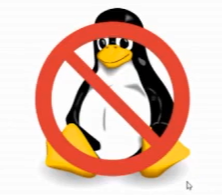
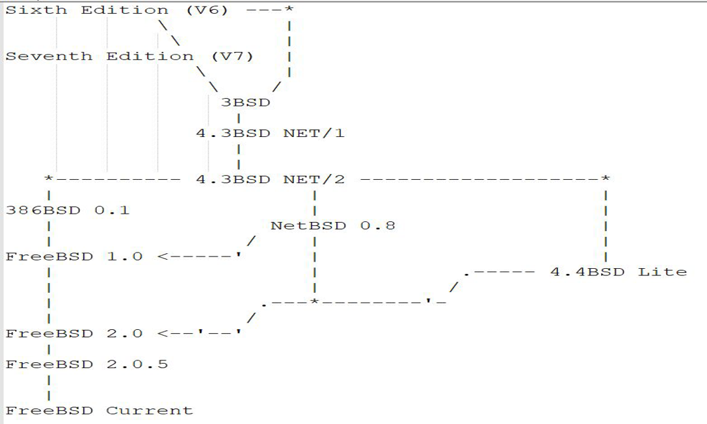

# 第1.4节 FreeBSD 与其他操作系统

## 什么是 FreeBSD？

BSD 最初是由 University of California, Berkeley 所开发的，意为 `Berkeley Software Distribution`（伯克利软件套件）。值得注意地是，Berkeley 伯克利之名来自著名的近代经验论哲学家乔治·贝克莱（George Berkeley，1685－1753，音译问题，原词是一致的），伯克利市和伯克利大学都是来源他的名字。贝克莱主教通过他的形而上学（反对牛顿绝对时空观等）启发了20世纪一众科学家，例如爱因斯坦，在某种意义上指导了现代科技革命。

> esse est percipi, to be is to be perceived（存在就是被感知）。——【英】乔治·贝克莱

FreeBSD 不是 Linux，不是国产操作系统，不兼容 Systemd，不能吃鸡，亦不是 UNIX。目前在 BSD 系中，FreeBSD 的用户是最多的。一些 Linux 下的软件基本上在 FreeBSD 中都能够被找到，即使找不到的也可以通过 CentOS 兼容层运行，你也可以自己通过 debootstrap 构建一个 debian 或者 ubuntu 的 / 系统。

> **FreeBSD 不是 Linux，亦不是 UNIX，是类 UNIX**

UNIX -> Networking Release 1->Networking Release 2 ->386BSD -> FreeBSD 1.0

386BSD -> 诉讼（1991-1994） -> 4.4 BSD-Lite -> FreeBSD 2.0

Linus“I have never even checked 386BSD out; when I started on Linux it wast available”

> 图片来源：https://github.com/freebsd/freebsd-src/blob/main/share/misc/bsd-family-tree

## FreeBSD or Others

* Linux

首先大概许多人是从 Linux 跑过来的，这样说我也没什么统计依据，不过姑且这样说罢。如果你发现在哪本书是举例提到 FreeBSD 是一种 Linux 发行版，那么我个人是不建议你继续看下去的，这属于误人子弟，我也曾在某些慕课网站上看到过类似行为。

严格来说 Linux 是指 Linux kernel，只是个内核而非操作系统,而 FreeBSD 是个操作系统。FreeBSD 采用 BSD 授权许可（见 [https://www.freebsd.org/zh\_CN/copyright/freebsd-license.html](https://www.freebsd.org/zh\_CN/copyright/freebsd-license.html) ）。FreeBSD 驱动方面一直是个大 Bug，不如 Linux。

* macOS & iOS

macOS & iOS 在一定程度上来说，都基于 FreeBSD。可见 FreeBSD 的 GUI 并不是搞不好，只是 Xorg 和开发方向有问题。

首先 macOS 和 iOS 某种程度上都基于 FreeBSD。但是这时候就要说易用性了，FreeBSD 和 Linux 还都是那套 Xorg，很明显不行。但是本着你行你上的观点我也上不去……图形界面才是第一 x3。

到底是苹果成就了 macOS、iOS 还是反过来 二者成就了苹果呢？举例来说，买 Mac 装 Windows 当然这是个人喜好，没有任何值得批评的地方。假设 iOS 预装 Android （这么举例可能不恰当），相当一部分纯果粉应该是接受不了的。

生态环境。这个见 Windows Phone。那么为什么选择 Apple 就不是 1% 的生活了？成功的商业化运作起着很大的用处。就像在这个贴吧里总有人看我不爽但又骂不过我一样，逞得口舌之利都不如我。FreeBSD 在大陆镜像站都没有，甚至因为 free 这个英文单词连官网都被电信屏蔽过。这个生态环境相比可知了。而且现在 UNIX 认证很宽容，所谓什么血统那是扯淡。好不好用自己心里没数吗？资本家之所以是资本家就在于产出再投入。对于这里而言，苹果的软件多就是因为用的人多。这个初期是怎么积累的？ FreeBSD 一场官司，初期就没有得到很好的发展，不然就没有 Linux 了，这话是 linus 说的。

国民素质有待提高。这个不是看不起嘲讽，这是客观事实。很多大学生甚至不知道什么是 Android，还有人说万物基于 MIUI。这和术业有专攻这句话已经完全无关了。当然不是说用水果就是素质低，这么理解的人语文有毛病。

水果摆脱了开源界所谓的苦难哲学。

* Microsoft Windows

微软非常重视用户体验，而一些社区可能完全忽视了这一点。直接的结果就是需要自己动手解决的地方略多。有人认为 Windows 简单因为都是图形化界面。事实上这是一种非常错误的说法，Windows 非常复杂。举例来说，你精通注册表否？知道每个选项什么意思吗？

至于安全性，很多人认为 UNIX-like 不需要杀毒软件，但是事实上这种观点是不正确的，当你发现自己中毒的时候，已经成为了病毒的培养基。但是目前来说，FreeBSD 远比 Windows 安全。

至于游戏什么的，已知 Steam 运行正常，运行 Minecraft 这种 java 软件也没毛病。

## 基本对比

|     操作系统     |                                发布/生命周期（主要版本）                                |                              主要包管理器（命令）                             |                            许可证（主要）                           |  工具链  |    shell   |     桌面     |
| :----------: | :-------------------------------------------------------------------------: | :-----------------------------------------------------------------: | :----------------------------------------------------------: | :---: | :--------: | :--------: |
|    Ubuntu    |              [2 年/10 年](https://ubuntu.com/about/release-cycle)             |       [apt](https://ubuntu.com/server/docs/package-management)      | [GNU](https://ubuntu.com/legal/intellectual-property-policy) |  gcc  |    bash    |    Gnome   |
| Gentoo Linux |                                     滚动更新                                    |       [Portage（emerge）](https://wiki.gentoo.org/wiki/Portage)       |                              GNU                             |  gcc  |    bash    |     可选     |
|  Arch Linux  |                                     滚动更新                                    |          [pacman](https://wiki.archlinux.org/title/pacman)          |                              GNU                             |  gcc  |    bash    |     可选     |
|     RHEL     | [3/最长 12 年](https://access.redhat.com/zh\_CN/support/policy/updates/errata) | [RPM（yum、dnf）](https://www.redhat.com/sysadmin/how-manage-packages) |                              GNU                             |  gcc  |    bash    |    Gnome   |
|    FreeBSD   |                [约 2.5/5 年](https://www.freebsd.org/security/)               |                              pkg/ports                              |                              BSD                             | clang |   csh/sh   |     可选     |
|    Windows   |        [不固定](https://docs.microsoft.com/zh-cn/lifecycle/faq/windows)        |                                  可选                                 |                              专有                              |   可选  | powershell | Windows 桌面 |
|     MacOS    |                                  1 年/约 5 年                                  |                                  无                                  |            [专有](https://www.apple.com/legal/sla/)            | clang |     zsh    |    Aqua    |
