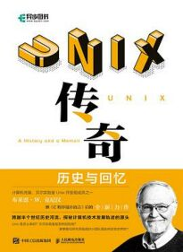
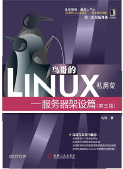

# 第1.9节 参考资料与贡献者名单

## 参考书目

相关书籍：新的变化也不是很大。不像 Linux 有这么多入门书籍。出于历史上的原因，看 UNIX 相关书籍即可。

### 在线书籍

[《FreeBSD 官方简体中文手册 2022 新译》](https://handbook.bsdcn.org/)

### 出版物

> 提示：以下有多本书籍可通过微信读书免费阅读。

|封面|书名|作者|ISBN|出版社|原版书名|说明|
|:---:|:---:|:---:|:---:|:---:|:---:|:---:|
||《Absolute FreeBSD 3rd》|Michael W. Lucas|9781593278922|No Starch Press|/|英文版，目前没有译文。词汇包括内容都非常基础，有计算机基础的人不需要阅读。|
|| 《FreeBSD 操作系统设计与实现（原书第2版）》|Marshall McKusick、George Neville-Neil、Robert N.M. Watson|9787111689973| 机械工业出版社| _**Design and Implementation of the FreeBSD Operating System, 2nd**_|主要讲解了内核。|
||《UNIX 传奇——历史与回忆》|Brian W Kernighan|9787115557179|人民邮电出版社|_**UNIX: A History and a Memoir**_|主要讲解了 UNIX 的发展历史。|
||《UNIX 编程艺术》|Eric Raymond|9787121176654|电子工业出版社| _**The Art of Unix Programming**_|主要讲解了 UNIX 的设计哲学与软件工程理论。|
||《大教堂与集市》|Eric S. Raymond|9787111452478|机械工业出版社|_**The Cathedral and the Bazaar**_|主要介绍了开源运动的发展史。|
||《鸟哥的 Linux 私房菜——基础学习篇(第三版)》|鸟哥|9787115226266|人民邮电出版社|/|注意：存在更新的第四版。但是第四版是针对 systemd 撰写的，完全偏离了传统的 init，仍然建议使用第三版，与 FreeBSD 更有相关性。但是其中的一些 grep 等命令的参数会有所不同，值得注意。有一些章节对于 FreeBSD 是无必要的，可以跳过去：0、2、3、4、15、17、21、22、23、25、26。|
||《鸟哥的 Linux 私房菜———服务器架设篇(第三版)》|鸟哥|9787111384991|机械工业出版社|/|/|
||《4.4BSD 操作系统设计与实现》|Marshall Kirk McKusick|9787111366478|机械工业出版社|_**The Design and Implementation of the 4.4BSD Operating System**_|4.4BSD 操作系统设计与实现|

## 贡献者名单（以下排名随机排序）

[凌莞](https://clansty.com)

星不萌

雨天

[柳离枝](https://github.com/liulitchi)

[peiyafei](https://github.com/peiyafei)

[ykla](https://github.com/ykla)

艳阳天

施主

fjh1997

X-Ray

freyr

[fanyang1997](https://github.com/fanyang1997)

[orzyyyy](https://github.com/orzyyyy)

[Rintim](https://github.com/Rintim)

[DogeW](https://github.com/DogeW)

[tomblackwhite](https://github.com/tomblackwhite)

isNijikawa

matatabi-wang

地铁卡

李大鹏

liguangsheng

kuntop

[matatabi-wang](https://github.com/matatabi-wang)

[星不萌](https://www.moebsd.cn)

[qinghecyn](https://github.com/qinghecyn)

[清热解毒口服液](https://linuxacme.cn)

墨子

201724

April Simone🍥

心即理物即心

Jack

Zomby7e

tergel93

兜率

[safreya](https://github.com/safreya)

杭永聪

Shengyun

仰望天空

[魔王酱](https://github.com/maouchandesu)

极品盗号

[blu10ph](https://github.com/blu10ph)

livrth

**注意：如果缺少了你的信息或者不想被列出，请发起 issue。**
