# 第 1.9 节 谁在使用 FreeBSD

本页面是对 <https://freebsdfoundation.org/about-us/testimonials/> 的翻译。

**推荐信**

热爱 FreeBSD 为你的组织所做的贡献吗？请发送你的推荐信给我！

你的公司是否已使用 FreeBSD 造就了巨大的辉煌？通过提交公司的推荐信，帮助我们宣传有关这个项目的信息。你不仅将进一步帮助提升人们对 FreeBSD 的认知，而且你的推荐信还将包含你公司的链接，并将在 FreeBSD 基金会网站首页、推荐信页面以及每月通讯中展示至少一次。推荐信通常由董事或副总裁撰写，内容包括你为何使用 FreeBSD、你获得了哪些益处，*以及为何读者应该向基金会捐款或为项目做出贡献。* 希望你今天能考虑撰写一份推荐信，以帮助提升 FreeBSD 的知名度和促进发展！感兴趣吗？请填写[此表格](https://goo.gl/forms/EzHZMprvySWKbLO12)或与 marketing@freebsdfoundation.org 联系。

**看看已经为 FreeBSD 欢呼雀跃的公司名单：**

## NetApp

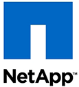 

2020 年 5 月 20 日

NetApp 自豪地将 FreeBSD 作为我们的 ONTAP 存储操作系统的核心组件。借助 FreeBSD，我们能够提供高性能产品，并具备客户所期望的可靠性、安全性和可支持性。作为 FreeBSD 社区的一部分，NetApp 能够与业界领先的技术公司合作。FreeBSD 基金会在推动 FreeBSD 创新和促进跨公司和跨行业合作方面做得非常出色。你持续的成功为所有 FreeBSD 用户的成功作出了贡献。谢谢。

——[ONTAP](https://www.netapp.com/us/index.aspx) 工程总监 Matt Hambrick

## Netflix

 

2015 年 12 月 28 日

在全球范围内有超过 3 千万 Netflix 位流媒体会员每月观看超过 10 亿小时的电影和电视节目。在美国，Netflix 的视频流媒体占据了峰值下行互联网流量的三分之一。Netflix 创建了 Open Connect——一个专用的内容传递网络，以帮助传递这些千万亿字节的数据。

Open Connect 的主要组件是 Open Connect Appliance，一种小型的网络流媒体设备。Open Connect Appliance 是一个 4U 的基于 Intel 的服务器，旨在在适合 ISP 数据中心和城域网交换的空间和功耗占用的前提下，经济高效地最大化存储密度。

Open Connect Appliance 在 FreeBSD 9 上运行。Netflix 选择了 FreeBSD 9，因为它是一个高性能、低维护成本和可靠性的操作系统，得到了主要硬件供应商的支持。FreeBSD 9 提供了可靠性、性能和免管理性的基础。结合轻量级高性能的 Web 服务器 NGINX，FreeBSD 9 提供了一个简单但强大的解决方案，能够通过多个 10Gbit 光纤链路同时传送数以万计的视频流。

除了其技术优势之外，FreeBSD 还拥有出色的开发人员、供应商和用户生态系统，他们公开分享专业知识、才能和技术改进。Netflix 已经融入了这个社区，并致力于回馈其错误修复和增强功能，从而完成了社区合作的循环。

——[Netflix](http://www.netflix.com/) 内容传递架构总监 David Fullagar，

## Modirum

 

2019 年 12 月 30 日

Modirum 是一家规模虽小但不断发展跨国公司，为全球的银行、商家、支付服务提供商和信用卡公司提供软件和托管服务。我们在世界各地的托管服务中都使用 FreeBSD，从路由器和防火墙到应用服务器和数据库。

和许多其他情况一样，我们使用 FreeBSD 起源于很久以前做出的个人选择。现在我们可能有更多或不同的原因坚持使用 FreeBSD，但是在很久以前做出这些选择的原因仍然是明智的：它比其他 Unix 更合理，文档更完善，努力更加专注，并且它有一个一致的用户空间，在多年间基本没有变化。

FreeBSD 在很多方面表现出色，而在一些方面甚至表现异常出色。我们喜爱它的审计工具、ZFS、jail 以及整体的高效性。

感谢你们，FreeBSD 社区！

——[Modirum](https://www.modirum.com/) 首席运营官 Eirik Øverby

## Mellanox
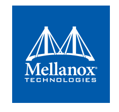 

2019 年 9 月 6 日

Mellanox Technologies 是一家领先的以太网和 InfiniBand 智能互连解决方案和服务供应商，为服务器和存储设备提供端到端的解决方案。Mellanox 的互连解决方案通过提供最高吞吐量和最低延迟，提高数据中心效率，将数据更快地传递给应用程序，释放系统性能，提高数据安全性。Mellanox 提供多种快速互连产品：适配器、交换机、软件和硅芯，加速应用程序性能，为云和超大规模、高性能计算、人工智能、企业数据中心、网络安全、存储、金融服务等广泛的市场最大化业务成果。

Mellanox 的产品解决了对低延迟和高带宽网络不断增长的需求，以及 FreeBSD 用户对低 CPU 利用率的需求。除了严格维护之外，FreeBSD 操作系统还提供尖端技术，吸引了高度专业的用户、开发人员和供应商，他们持续分享想法、专业知识和技术支持，从而实现了不断发展的 FreeBSD 生态系统。

Mellanox Technologies 长期以来一直是 FreeBSD 社区的开发者和贡献者，在通用的 FreeBSD 操作系统中集成了 Mellanox 领先的 RDMA 和其他先进的卸载技术。目前，Mellanox 有三位 SRC（System Revision Control）提交者。我们很高兴并自豪地继续赞助、贡献和维护 InfiniBand、RDMA、LinuxKPI 和 USB 子系统，并在不断壮大的 FreeBSD 项目中促进基础架构的变化。

Mellanox 始终乐于回应并接受广泛社区提出的新挑战，促进了 FreeBSD 和 Mellanox 的进步。

——[Mellanox Technologies](https://www.mellanox.com/) 软件副总裁 Yaron Gepstein

## simPRO

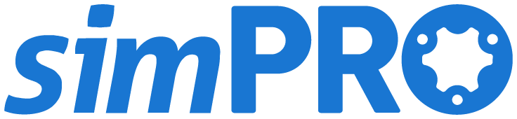 

2019年8月29日

simPRO 是领先的云端工作和项目管理软件提供商，为现场服务和贸易承包行业提供服务，并且是提供SAAS平台软件的早期先驱。

我们从澳大利亚发展起来，现在在新西兰、英国和美国设有办事处。

我们已经使用 FreeBSD 运行了大约 7 年的时间，通过全球 6 个生产数据中心提供所有产品服务，包括 300 多个 FreeBSD 实例的整个平台。

全球有超过 5000 家公司和 140,000 多名用户在使用 simPRO，而 FreeBSD 为我们提供了所需的可扩展性和可靠性，以向客户提供关键任务的产品。

我们大量使用 ZFS 来加速数据库性能并保护 500TB 的客户数据，同时我们还使用 FreeBSD 内置的一系列集群和复制工具来保持我们的实例在全球范围内同步。FreeBSD的 Ports 使我们能够在知道软件包适合目的、维护良好且易于升级的情况下扩展我们的服务。

FreeBSD 的出色安全性和更新、网络性能以及出色的 IO 和内存管理使得运行这个大型、流量密集且关键性的应用程序变得更加容易。操作系统承担了大部分繁重的工作，这意味着我的工程师可以专注于产品发展，而非服务器维护。

自从我们转向 FreeBSD 后，我们的正常运行时间显著提高。这不仅是对其稳定性的证明，还表明操作系统的维护和升级以及其附带的软件包的便捷性。

——[simPRO](https://www.simpro.us/) 首席技术官 Jonathan Eastgate

## MSI/FUNTORO
 

2018 年 5 月 31 日

MSI/FUNTORO 利用 FreeBSD 为巴士、火车、体育场和酒店提供高性能的按需音视频流媒体服务。

选择 FreeBSD 是因为其稳定性和可靠性，易于升级和维护，安全更新的可靠性以及软件包的整体出色质量。

——[MSI/FUNTORO](http://www.funtoro.com/global/) 董事兼总经理 Scott Chen

## cleverbridge

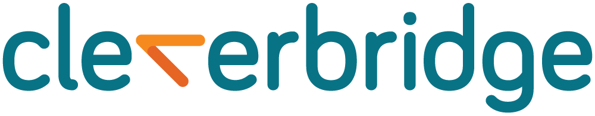 

2017 年 10 月 3 日

cleverbridge 公司总部位于德国科隆，办事处遍布芝加哥、旧金山和东京。在我们的开发、测试和生产环境中使用 FreeBSD 已超过 12 年。FreeBSD 为我们提供了独特的安全功能、可靠性、业界领先的技术和惊人的性能。从我们的 Web 服务器、电子邮件服务器到存储服务器，FreeBSD 有助于推动我们的全球电子商务解决方案。

——[cleverbridge](https://www.cleverbridge.com/corporate/) IT 技术总监 Paul Herman，

## XipLink
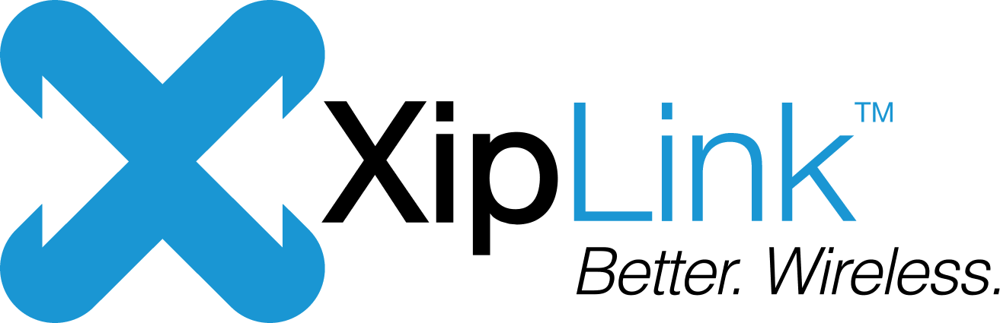 

2017 年 6 月 2 日

XipLink 专注于优化无线链接、广域网（WAN）或任何存在高延迟、不对称分配或高比特错误率的网络。XipLink 的解决方案主要应用于卫星网络、航空、军事、政府和海上系统。

由于我们的解决方案涵盖范围广泛，我们需要提供能够同时优化数十万用户会话的软件和硬件。为此，我们需要最稳定、高效、受支持且文档齐全的网络堆栈，我们还可以根据需要进行修改。

自从 4.5 版本发布以来，FreeBSD 一直为 XipLink 提供了这些东西。它友好的 BSD 许可模行和丰富的网络堆栈文档（特别是 Wright 和 Stevens 的 TCP/IP Illustrated Series）使我们首次实现空间通信协议标准变得更加容易。

从那时起，情况稳步改善。系统可靠性、性能、广泛的代码审查和对细节的关注贯穿整个源代码，使 FreeBSD 成为我们不断演进和增加功能的完美环境。

XipLink 很自豪地支持 FreeBSD，通过赞助 FreeBSD 开发人员、提交补丁和功能，或仅通过订阅 FreeBSD Journal 和向基金会捐款来实现。

——[XipLink Inc](http://www.xiplink.com/) 工程副总裁 Karim Fodil-Lemelin，

## Verisign

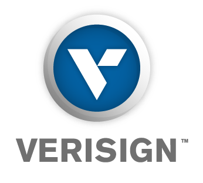 

2015 年 11 月 19 日

Verisign 为全球用户提供关键的互联网基础设施。Verisign 不仅运营着互联网 13 个根域名服务器中的两个，还运营着解析 .com 和 .net 顶级域名的域名服务器。如果你使用全球域名系统（DNS），那么你很可能依赖于 Verisign 的基础设施。

Verisign 的 .com 和 .net 域名服务器每秒响应 1110 亿个查询，而在高流量事件或高带宽分布式拒绝服务（DDOS）攻击时，负载往往更高。这些域名服务器部署在全球约 80 个地点，以确保无论你在哪里，都可以获得低延迟和高可靠性的 DNS 响应。

确保弹性 DNS 服务的一种方式是通过使用多样化的操作系统。FreeBSD 占据了为根区域和 .com、.net 区域提供服务的操作系统组合中的重要部分。多个操作系统仅仅是分层设计的一个组成部分，该设计在系统架构中融合了冗余性和多样性。

当我们决定改变操作系统组合时，我们进行了全面的调查，考虑了各种替代方案。在审查了所有这些操作系统之后，基于以下六个考虑因素，我们选择了 FreeBSD 用于 .com、.net 和根域名服务器：

- 系统代码多样性：BSD 内核和网络堆栈与 Linux 内核和网络堆栈之间的差异足以提供对零日漏洞的阻止。我们审查了源代码，以及 FreeBSD 开发人员使用的开发哲学。
- 网络性能：FreeBSD 为域名服务器工作负载提供了类似 Linux 的性能。看到持续关注和努力改进 FreeBSD 上的网络性能令人鼓舞。
- 硬件支持：Verisign 定期更新构成我们域名服务器环境的硬件。在硬件更新周期内，FreeBSD 通常适用于 Verisign 选择的通用服务器硬件。了解在引入新服务器硬件和在 FreeBSD 中支持该硬件之间将会有合理短的延迟非常重要。
- 可靠性的历史证明：FreeBSD 作为一个可靠的服务器的声誉对我们来说至关重要。托管在 FreeBSD 上的服务具有非常高的可用性要求，加上 FreeBSD 的坚如磐石的运行记录直接解决了这一标准。
- 安全运行的历史证明：FreeBSD 开发社区长期以来一直认真对待安全问题。当发现漏洞时，我们通常会看到迅速的披露和几乎立即可用的补丁。
- 许可证：社区致力于提供高质量的开源内容，而不会限制其使用，这对 Verisign 非常重要。

作为 Verisign“回馈”社区的许多方式之一，就是每两年举办一次 vBSDcon 会议。该会议通常安排在 10 月/11 月时间框架的一个周末；此前的会议分别在 2013 年和 2015 年举行。

自从转向使用 FreeBSD 以来，我们很高兴看到它实现了我们的期望。FreeBSD 开发社区应该为在 FreeBSD 上提供关键的互联网基础设施感到自豪；他们的辛勤工作使互联网更加安全和可靠。Verisign 自豪地参与了 FreeBSD 开发社区，并且有员工为 FreeBSD 贡献工作。

——[Verisign，Inc.](http://www.verisign.com/) 首席工程师 Glen Wiley

## Stormshield
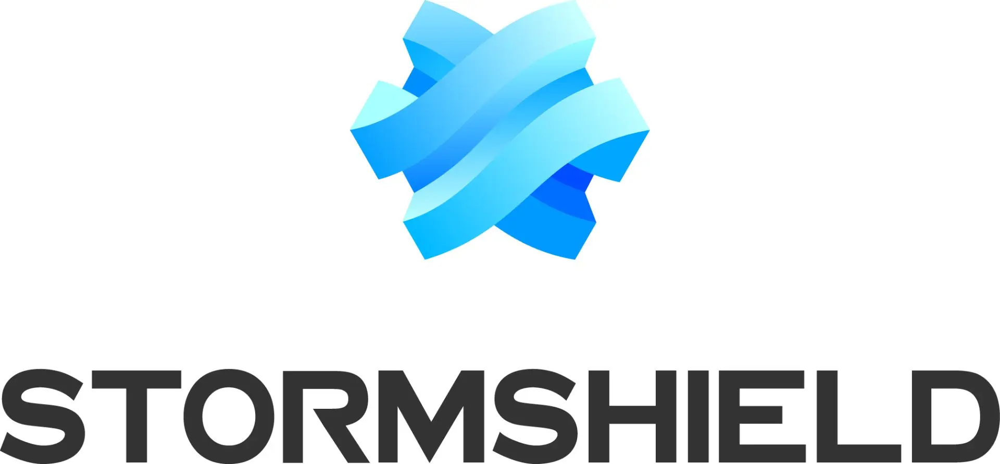 

2016 年 11 月 21 日

自 1998 年以来，Stormshield 充分利用 FreeBSD 提供高性能的统一威胁管理（UTM）和下一代防火墙技术。我们通过技术贡献和赞助不断地表达对 FreeBSD 的支持；作为公司，我们完全致力于这个伟大社区的持续成功。

——[Stormshield](https://www.stormshield.eu/) 首席创新官 Fabien Thomas

## IXC (IntereXchange Carrier)
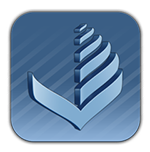 

2016 年 8 月 19 日

IXC（IntereXchange Carrier）是乌克兰的 VoIP 系统开发商，设计、开发并销售现代的软交换和计费系统，适用于具有大容量用户和广泛市场覆盖的企业。该公司创造了一个独特的综合解决方案，包括高性能软交换、实时计费、用户友好的 Web 界面等模块。它在 50 多个国家广为人知，并成为批发业务的顶级 VoIP 软交换供应商。

在过去的 17 年里，IXC 一直努力为 VoIP 业务提供竞争力强的解决方案。这种技术需要在性能、容错性和 SLA 保证方面进行大量工作。因此，选择一个满足这些要求的操作系统起着重要作用。

在 VoIP 服务中，能够在高负载下工作是关键问题，而 FreeBSD 的 sysctl 服务提供了将 NIC 性能调整到最大水平的机会。这种配置可以将并发呼叫数增加到 3000 个甚至更多。

Ports 基础设施是将系统与其他 Unix 派生系统区分开的一个元素，也是构建适合我们自己需求的软件环境的强大工具。最后但同样重要的是，我们想要强调出色的安全性。在当今时代，这是一个难以高估的方面。

我们每年测试各种 Unix 发行版的操作系统。从 4.X 版本开始，每年 FreeBSD 都是我们的主要操作系统。

我们很荣幸能成为一个正在努力发展 FreeBSD 的大型 IT 社区的一部分。

——[IXC](http://interexc.com/) 运营副总裁 Evgeniy Gordashnik，

## NeoSmart Technologies
 

2016 年 4 月 11 日

在 NeoSmart Technologies，我们不仅仅在操作系统之上构建应用程序——我们为操作系统本身构建应用程序。我们的 Easy Recovery Essentials® 系列可启动系统修复光盘每天被全球数千名终端用户、IT 专业人员和系统管理员使用，用于检测和纠正可能出现的与用户的硬件、引导配置、操作系统和应用程序有关的问题，以一种安全、稳定和可靠的方式。

Easy Recovery Essentials 是有意由（主要是）跨平台的 C/C++ 混合编写，还包含少量汇编代码和一个 HTML 用户界面，以便我们可以评估不同的“宿主”平台，从而在成千上万台不同的 PC 上启动和运行我们的软件，这些 PC 从数十年前的老设备到最新的尖端设备，来自各种制造商和 OEM 厂商。与在数据中心或云中的服务器上部署操作系统不同，那里的硬件完全在你的控制之下，我们实际上需要的是能够可靠地在终端用户的硬件上运行，包括图形用户界面，而且问题较少的解决方案... 这是一个艰巨的任务。

在将 Windows® PE 和各种 Linux 发行版在生产环境中试用了几年之后，我们发现只有 FreeBSD 在最底层级别上提供了一个坚固、开放、良构且协调的平台，我们可以在此基础上可靠地构建我们的软件，并期望它在几乎所有客户的任何地方“正常工作”。逻辑和集中化但又模块化的代码库使我们能够轻松理解操作系统的工作原理，并在不破坏系统的情况下为其添加我们需要的功能，从而使我们能够专注于开发我们的产品，而不是解决启动环境中的问题。

最后但同样重要的是，FreeBSD 完全自由、没有任何附加条件的许可模式让我们可以根据自己的意愿并利用 FreeBSD，而不需要一个律师团队告诉我们是否可以使用 FreeBSD 来完成惊人的事情，这使我们可以简单地将几乎所有的改进、Port、集成和错误修复都回馈到社区中，使用与我们最初获取的相同的开放许可证。

对我们来说，继续坚持并支持 FreeBSD 是一个不言而喻的选择。我们自豪地每年赞助 FreeBSD，并在被问及我们对于一个快速、经过实战检验且可靠的平台的建议时，毫不犹豫地推荐它。

——[NeoSmart Technologies](http://neosmart.net/) Mahmoud Al-Qudsi

## Chelsio Communications

2016 年 4 月 4 日

Chelsio Communications 是高性能以太网适配器领域的领导者，为虚拟化企业数据中心、公有云、私有云和集群计算环境提供网络和存储解决方案。Chelsio 的网络适配器提供行业内最全面的网络接口卡（NIC）、iSCSI 和 iWARP 卸载能力，从而在更高的性能下降低处理器的利用率。

我们的许多大客户选择了 FreeBSD，由于我们出色的支持质量和对 FreeBSD 的承诺，我们发现那些选择 FreeBSD 的客户大多也选择了 Chelsio。我们很感谢有机会成为 FreeBSD 社区的一部分。Chelsio 团队很高兴能够为社区做出贡献，学习和共同成长。

——[Chelsio Communications](http://www.chelsio.com/) 工程副总裁 Mehdi Mohtashemi

## Acceleration Systems
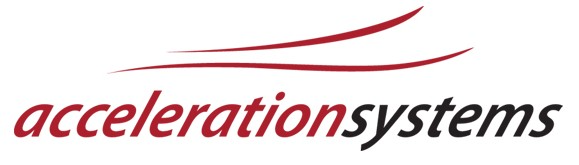

2016 年 3 月 3 日

Acceleration Systems 是一家云服务提供商，在 SaaS 模型中提供 WAN 优化服务。我们的解决方案使企业能够在受限链路上特别是网络性能受限的情况下，获得生产力和网络性能的大幅提升。我们团队的许多成员曾在之前的公司中使用开源软件构建基础设施，并且有着共同的心态，支持支持社区和驱动互联网的项目。

在我们的旗舰产品“远程业务加速器”中，FreeBSD 扮演了重要角色。尽管我们团队中的大多数人都有 Linux 的基础，但选择 FreeBSD 是因为它的精简占用、大量的 Port 以及在这个极其稳定的操作系统上支持的载波级应用。我们团队的成员认可它作为首选系统，他们有着 15 年前追溯到 FreeBSD 4.1 时代的经验——当时他们在肯塔基大学。

我们感谢有机会使用 BSD 许可证所提供的灵活性来构建产品。Acceleration Systems 团队很高兴为这个项目做出贡献，帮助保持互联网成为一个学习和创造的好地方！

——[Acceleration Systems](http://accelerationsystems.com/) 工程副总裁 Jack McKinney，

## ScaleEngine

2016 年 1 月 28 日

ScaleEngine 是一家全球性的视频流媒体和内容传送网络。我们专注于通过靠近用户的服务器向他们提供实时和点播的视频流，以降低延迟，确保最佳的观看体验。我们的小团队的开发人员和系统管理员在遍布 11 个国家的 38 个数据中心中管理着 100 多台服务器。之所以能够在如此小的团队中实现如此规模，主要是因为 FreeBSD 提供了广泛的文档、可观察性、监控和自动化工具。丰富的专业知识资源也使 FreeBSD 特别具有吸引力。

ScaleEngine 在其整个基础设施中都使用了 FreeBSD。在需要管理超过 1000TB 存储的情况下，访问频繁更新的 OpenZFS 对我们的产品至关重要。我们还广泛使用 bhyve、jail 和 FreeBSD 的通用可扩展性。

ScaleEngine 赞助 FreeBSD 基金会，以确保我们能够定期获得及时的发布，同时为 FreeBSD 项目提供所需的支持，以促使其蓬勃发展。

——[ScaleEngine，Inc.](https://www.scaleengine.com/) 运营副总裁 Allan Jude

## NGINX

2016 年 2 月 28 日

NGINX 是现代网络的隐秘核心，为全球 1/3 最繁忙的站点和应用程序提供动力。开源项目 NGINX 始于 2002 年，由于 Igor Sysoev 的远见和我们忠实用户社区的热情支持，在过去的 10 年里得到了指数级的增长。

我们公司提供屡获殊荣的、业界领先的高性能 Web 应用技术，为互联网上超过 1.3 亿个站点提供可扩展性、速度和安全性，确保了流畅的网络用户体验。公司依赖于 NGINX 技术进行负载均衡、内容缓存、媒体流传输、Web 服务等。超过 40%的互联网最繁忙的网站依赖 NGINX 来提升其 Web 应用程序的性能，包括 Netflix、Pinterest、Airbnb、Box、Instagram、SoundCloud 和 Zappos 等巨头。公司总部位于旧金山。

从历史上看，NGINX 团队一直是 FreeBSD 项目的忠实支持者。我们中的一些人是活跃的 FreeBSD 提交者、代码贡献者和用户。

2002 年，当 Igor 开始着手开发 NGINX 项目时，他的主要开发平台就是 FreeBSD。如今，我们继续将 FreeBSD 作为 NGINX 和 NGINX Plus 开发和测试的参考平台。我们赞赏其成熟性、稳定性和出色的性能。

我们还赞助 FreeBSD 活动并参与 FreeBSD 会议。

——[NGINX](https://www.nginx.com/) 工程副总裁兼联合创始人 Maxim Konovalov

## 微软

2015 年 12 月 28 日

微软正在构建面向移动优先、云优先世界的一流平台和生产力服务，我们的使命是赋予地球上的每个人和每个组织更多的力量来实现更多。

微软 Hyper-V 是基于 hypervisor 的 x86-64 系统的虚拟化系统，为微软的云计算平台 Microsoft Azure 提供服务虚拟化，这是一个日益增长的集成服务集合，包括分析、计算、数据库、移动、网络、存储和 Web 等，以实现更快的进步，取得更大的成就，节省更多的费用。

让 FreeBSD 在 Hyper-V 上取得成功的推动几乎完全取决于许多主要的设备（网络、存储、安全等）将 FreeBSD 作为其基础操作系统来构建其产品。

随着虚拟化的持续趋势，设备供应商越来越多地从物理设备业务转向虚拟设备，因为这可以通过降低开发和制造成本来显著提高毛利率。确保基于 FreeBSD 的这些虚拟设备在 Hyper-V 上以及最终在 Azure 上运行良好，对于微软来说是一项战略性重要的投资，因为它确保了随着这一趋势的继续，微软的技术堆栈在私有云和公共云部署中对于客户来说是最好的选择。

——[微软](https://www.microsoft.com/) 首席产品经理经理 Jason M. Anderson

## Tera Bear Consulting

2015 年 12 月 28 日

Tera Bear Consulting 是科罗拉多州的一个网络应用开发和互联网咨询公司，我们在许多关键客户项目中依赖 FreeBSD。我们提供定制、预配置、硬化和安全的虚拟服务器，使用 FreeBSD Jail 项目进行支持。我们在 FreeBSD 7 之前就已成功地为客户在生产环境中运行 FreeBSD。在过去十多年里，作为网络应用托管提供商和网络开发公司，我们管理系统时所体验到的 FreeBSD 的优点和稳定性几乎是无懈可击的。

我第一次了解 FreeBSD 是在博尔德市从事基于网络的草根社区媒体项目时，自那以后我基本上一直在使用它，随着我与开发团队一起合作，生产更大、更复杂的商业应用。我们大部分本地和远程承包商在过渡到 FreeBSD 的语法和更新程序时没有任何问题，他们在这个“真实”的 UNIX 环境中拥有完全的控制权，我们的客户也是如此。这种灵活性，加上该项目对稳定性、安全性和可扩展性的持续承诺，使得在我们的大多数 Web 开发项目中选择 FreeBSD 成为正确的选择。

因此，Tera Bear Consulting 现在和将来都致力于使用和支持 FreeBSD。

——[Tera Bear Consulting](http://terabear.com/) Jon Lybrook

## Tarsnap Backup Inc.
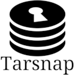

2015 年 12 月 28 日

Tarsnap 是一个适用于 BSD、Linux、OS X 和其他“类 Unix”操作系统的在线备份服务。我在 2006 年开始着手开发 Tarsnap，当时作为 FreeBSD 的安全主管，我对我的笔记本上的信息安全（如未发布的安全公告）感到担忧；这引发了一个备份系统的设计，激发了标语“为真正偏执的人提供在线备份”。

Tarsnap 之所以存在，还有另一个原因是因为 FreeBSD：正如其名称所示，Tarsnap 软件基于标准的 UNIX tar 实用程序，为此，我开始使用在之前几年内在 FreeBSD 内部开发的优秀的 bsdtar 实用程序进行开发。如果我不能从 tar 实用程序中重用代码，启动 Tarsnap 将需要花费我更多的时间；而且 bsdtar 的许可证（BSD）和代码质量（优秀）对于我能够重用它至关重要。

除了在客户端软件中重用 FreeBSD 的代码外，Tarsnap 还完全依赖 FreeBSD 来支持其服务器基础架构。除了易于维护和管理外，FreeBSD 在“基本”系统和第三方“Port”代码之间的分离在响应安全问题时也被证明是非常有用的：例如，对于最近的“shellshock”漏洞，我只需确认我从未从 Ports 中安装过 bash。如果在 Tarsnap 的任何服务器上安装了 bash，就需要一个更耗时的过程来审查可能使用 bash 的所有方式——即使最终的结论是从未使用过 bash。

Tarsnap Backup Inc.为支持 FreeBSD 感到自豪，不仅通过我的个人工作（最近，维护 FreeBSD/EC2 平台），还通过成为 FreeBSD 基金会的银级赞助商；而且 Tarsnap 直接受益于 FreeBSD 基金会支持的项目和活动。回馈不仅仅是慈善行为；它真正是一种投资，可以产生出色的回报。

——[Tarsnap Backup Inc.](http://www.tarsnap.com/) 总裁 Colin Percival

## Netgate Inc.

2015 年 12 月 28 日

pfSense® 项目提供了一个免费的、开源的 FreeBSD 发行版，专为防火墙、路由器和 VPN 平台设计。该项目由 Netgate 赞助和运营，并包括一长串相关功能和一个允许最终用户添加更多功能的软件包系统。自从十年前开始，pfSense 就基于 FreeBSD。我们最新的发布，pfSense 2.2 是基于 FreeBSD 10.1-RELEASE。pfSense 系统的其他部分来自 FreeBSD Ports。与 FreeBSD 一起，这些组件使 Netgate 和 pfSense 社区的其他成员能够将 pfSense 平台构建成一个在 250,000 多个位置保护网络的安全工具系统。与 FreeBSD 一样，pfSense 采用 BSD 许可证。这种许可证使得其他组织，包括 VMware 和 Avaya，可以将 pfSense 源代码调整为他们的商业产品。BSD 许可证使我们能够自由地使用和贡献代码，也允许我们的客户和 FreeBSD 的使用者做同样的事情。

Netgate 是 FreeBSD 项目的自豪的银级赞助商。如果没有 FreeBSD 社区及其成员和赞助者的贡献，pfSense 项目不会继续像今天这样繁荣。Netgate 致力于回馈其修复错误和增强功能，并继续为 FreeBSD 项目提供财务支持。我们鼓励任何有兴趣的人也捐赠给 FreeBSD 基金会。这样做有助于增加 FreeBSD 的发展和普及，造福所有人。

——[Netgate Inc.](http://store.netgate.com/) CTO Jim Thompson，

## NYC\*BUG

2016 年 1 月 28 日

NYC\*BSD 用户组（NYC*BUG）已经有近 12 年的历史，这为 \*BSD 生态系统提供了一个有用的视角。

NYC\*BUG 是纽约市的一个技术用户组。我们每月举行会议，并在不同形式下举办了五次会议，此外还维护着各种邮件列表。

我们还在纽约互联网公司管理着一个完整的机柜，托管了许多项目，如 BSD 认证组和一系列镜像。

我们的位置为我们提供了多个观察 FreeBSD 在纽约大都市区的使用情况的角度，从初次探索 FreeBSD 的终端用户到依赖 FreeBSD 的企业基础架构。我们成功地吸引了有经验的人，也吸引了第一次尝试 \*BSD 的人。尽管 NYC\*BUG 树立了一个旗帜，保持了稳定的 \*BSD 存在，但我们受益于对 FreeBSD 作为一个稳定、明智的操作系统的日益关注和依赖。在过去的几年中，FreeBSD 在 Netflix 的角色以及云服务提供商 Digital Ocean 对 FreeBSD 的支持，更不用说像 Xinuos 和纽约互联网这样严重依赖该项目的公司。

FreeBSD 的声誉在我们的长期可持续性中起到了关键作用。我们知道我们的组织能力和特定的技术职责只能做到这么多。从 64 位 ARM 到新的 pkg 系统的持续发展为我们提供了继续在纽约技术社区中扮演重要角色的动力。

更一般地说，我们指出 FreeBSD 项目和基金会是扩展开源项目的可靠模式，不像许多一炮而红的项目一样，它们的热度迅速就会消失。

FreeBSD 基金会定期支持我们的大型活动。我们很高兴继续与更广泛的 FreeBSD 技术社区和基金会紧密合作。

——[NYC*BUG](http://www.nycbug.org/index.cgi) NYC\*BUG 的管理员小组

## Xinuos

2015 年 12 月 28 日

当 Xinuos 在寻求一款成熟稳定的操作系统，具备现代特性，可以作为其现有客户的替代选择时，FreeBSD 显然是最佳选择。我们 OpenServer X 发行版，是基于 FreeBSD 的，正是我们的客户需要用来运行业务的，Xinuos 将在未来的许多年里支持他们。

我们的经销商特别赞赏 BSD 许可证的自由度，它为创建定制的解决方案栈提供了业界最好的灵活性。我们预计在未来几年内，对于这种许可证的自由度和灵活性的市场需求将大幅增长，而我们也打算推动和支持这一发展。FreeBSD 是我们未来的重要组成部分。

——[Xinuos](https://www.xinuos.com/) 总裁兼首席运营官 Sean Snyder

## Atlantic.Net
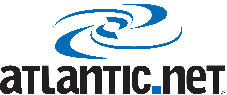

2015 年 12 月 28 日

Atlantic.Net 是一家专注于云计算和 SSD VPS（虚拟服务器）服务的托管解决方案提供商。我们成立于 1994 年，最初为佛罗里达州的次要和农村市场提供拨号上网服务。多年来，我们的业务模式发生了变化，从提供居民拨号上网服务、企业连接和业务解决方案、服务器托管，到最近的托管和 VPS 服务。

FreeBSD 已经成为塑造许多当今互联网技术的重要组成部分，这些技术惠及了全球所有互联网用户。我们已经使用 FreeBSD 数十年，基于我们的历史，它一直是一个灵活的工具，能够适应随着互联网的增长而发生的变化条件。在这个过程中，FreeBSD 一直是稳定、有序和管理互联网最有价值资源之一——“Free”BSD 操作系统的标志。

我们全力推荐 FreeBSD，并认为它是全球互联网的最佳礼物和永久宝藏之一。这么多年后，许多互联网技术仍然从 FreeBSD 提供的基础中汲取着力量。在过去的 20 年里，我们非常自豪 FreeBSD 和社区如何发展和改进。我们迫不及待地想看到未来 20 年会带来什么！

——[Atlantic.Net](https://www.atlantic.net/) 创始人/CEO Marty Puranik

## WhatsApp

2015 年 12 月 28 日

在 WhatsApp，我们利用 FreeBSD 和 Erlang 来提供行业领先的持续运行时间。在廉价硬件上实现线性扩展的能力使 WhatsApp 能够保持低成本的服务。如我们在[博客文章](http://blog.whatsapp.com/index.php/2012/01/1-million-is-so-2011/)中所述，我们的单个 FreeBSD 服务器上可以同时运行 200 万至 300 万个并发 TCP 连接。

WhatsApp 是全球领先的移动消息服务。WhatsApp Messenger 是一款跨平台移动消息应用程序，让你在不支付短信费用的情况下交换消息，并可用于 Android、BlackBerry、iPhone、Windows Phone 和 Nokia 手机！由于 WhatsApp Messenger 使用与电子邮件和网络浏览相同的互联网数据计划，因此与朋友保持联系和发送消息是没有费用的。

——[WhatsApp](http://www.whatsapp.com/) CEO，即高级 Tweet 经理 Jan Koum

## iXsystems

2015 年 12 月 28 日

iXsystems 是一家领先的服务器级硬件提供商，专为运行 FreeBSD 而设计。我们业务战略的一个重要组成部分是为 FreeBSD 开发人员提供资金，以不断改进和优化 FreeBSD。我们的内部基础设施和服务都基于 FreeBSD，这使我们能够轻松地识别出 FreeBSD 中需要改进的领域。

我们坚信，对于 FreeBSD 有益的事情也对我们的客户有益，而对于我们的客户有益的事情也对我们有益。BSD 许可证使我们可以自由地使用和贡献代码，也允许我们的客户和 FreeBSD 的使用者做同样的事情。多年来，FreeBSD 受益于开放共享和合作，这使其成为了一个稳定、成熟、高性能的操作系统。

——[iXsystems](http://www.ixsystems.com/) CIO Josh Paetzel

## NYI

2015 年 12 月 28 日

NYI 是一家数据中心提供商，我们在所有内部和面向客户的解决方案中使用 FreeBSD，包括托管和专用服务器、云计算和托管服务。在公司早期，我们最初选择的技术包括与专有硬件绑定的商业 Unix 系统。然而，FreeBSD 的成本和可移植性是我们在公司创立初期改变平台的决定性因素。

从那以后，我们享受了 FreeBSD 的功能和可靠性。我们依赖它进行网络任务，如路由器、VPN、防火墙和流量整形，以及 Web 应用程序，如共享托管、后端界面、负载均衡器和代理。我们特别赞赏社区支持和集中的文档，这意味着我们不必像其他项目那样四处搜寻信息碎片。

——[NYI](http://www.nyi.net/) 运营副总裁 Phillip Koblence

## Juniper

2015 年 12 月 28 日

Juniper 提供由 JUNOS（TM）软件驱动的高性能网络基础设施，这是一个集成了路由、交换、安全和网络服务的网络操作系统。FreeBSD 是 JUNOS 软件的基础，为 UNIX 系统提供了许多基本的操作系统服务。如今，JUNOS 软件在 Juniper 设计的广泛产品组合上运行，以满足从小型办公室到世界上最大的 TeraPop 站点的各种复杂和严苛需求的融合网络。

Juniper 从领先的大学、个人和商业组织之间强大的合作中受益，这些合作推动了 FreeBSD 的操作系统功能的进步。FreeBSD 发布系统为 Juniper 提供了功能的路线图和稳定的基础，使我们的代码在其上运行，而其实用的许可证使 Juniper 能够开发知识产权来推动高性能网络的发展。Juniper 拥有许多积极参与 FreeBSD 开发的开发人员，他们不断为 FreeBSD 项目做出贡献，进一步将其发展成为一流的操作系统。

——[Juniper Networks](http://www.juniper.net/) 基础技术部副总裁 Naren Prabhu

## pair Networks

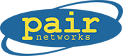

2015 年 12 月 28 日

Pair Networks 是一家世界一流的网络托管公司，为来自 150 多个国家的企业、博主、艺术家、音乐家、教育机构和非营利组织提供全面的托管服务。在 pair Networks 的数据中心中，数千台服务器每天为数十亿个 Web 访问提供服务。pair Networks 的客户群体包括大量高知名度、高流量的网站。

自 1995 年成立以来，pair Networks 一直将 FreeBSD 作为提供世界级网站托管服务的重要工具。FreeBSD 的可靠性和稳定性使我们能够为客户提供超过 99.9%的服务器正常运行时间。我们的客户依赖 FreeBSD 的卓越安全性，以保持其网站的正常运行和数据的安全性。作为一个开源系统，当安全威胁出现时，FreeBSD 易于更新以提供新的保护措施。我们承诺客户，他们的网站将始终托管在最先进的设备上，并且有足够的空间供其增长。FreeBSD 的稳定性和强大性使我们能够信守这个承诺。

从 FreeBSD 2.0.5 到最新版本，我们对 FreeBSD 的性能和稳定性感到满意，而这些特点也是我们的客户欣赏和期望我们的服务的。FreeBSD 是一项出色的技术，拥有出色的社区支持。

——[pair Networks](http://www.pair.com/) CEO Kevin Martin

## isilon

2015 年 12 月 28 日

Isilon Systems 选择了 FreeBSD，因为它是一个现代、稳定、高性能的 \* NIX 操作系统，具有非常宽松的许可条款。我们需要一个强大和完整的代码基础，以便我们可以完全专注于我们自己的产品，并具有完全的创新自由，使我们的产品能够变得更好。

Isilon 从多个方面受益于使用 FreeBSD，但最重要的好处是我们能够利用社区的开源努力来改进我们的产品。由于我们是这个社区的一部分，我们会回馈源代码，赞助特定的开发工作，并雇用社区成员进行合同开发 - 这反过来为我们提供了接触优秀人才和持续访问优秀软件的机会。

简而言之，FreeBSD 是一个稳定、成熟、高性能的操作系统，拥有活跃的开发社区，摆脱了许可问题和顾虑。

那么为什么对我们和其他人来说，保持 FreeBSD 的自由如此重要呢？

FreeBSD 是那些在创新过程中需要完全自由的个人或公司的唯一选择。诸如 CDDL 和 GPL 之类的许可强制创新者非常谨慎地选择构建代码的方式和位置，这限制了他们的设计选择，可能导致糟糕的技术决策或许可权利的困境。 Isilon 的绝大多数创新都在内核中，我们的知识产权散布在各处。

使用另一个开源操作系统根本不可能实现这一点 - 许可操作系统源代码是一个很高的准入门槛。

——[Isilon Systems](http://www.isilon.com/) 软件工程总监 Nicholas Kirsch

## Experts Exchange

2015 年 12 月 28 日

Experts Exchange 是位于 experts-exchange.com 的技术帮助网站——我们开发了一种专利的问答系统，使查找解决方案更加容易。人们提出问题，由来自世界各地的专家提供可靠的答案。

自 2009 年以来，Experts Exchange 将 FreeBSD 作为其所有外部面向的 Web 服务器和内部工具托管的首选操作系统。

大约 3 年前，Experts Exchange 对我们的网站进行了广泛的性能测试，测试了几种不同的 Linux 和 UNIX 发行版，包括 FreeBSD 7。在页面加载时间指标和 Lucene 搜索索引性能测试中，FreeBSD 的表现超过了所有其他测试的操作系统。从那时起，我们将开发人员、测试和生产服务器迁移到了 FreeBSD。我们还使用 FreeBSD jails 来托管我们的开发测试服务器，并且已经在本地办公数据中心和合作位置数据中心堆栈中依赖于 FreeBSD。

由于我们对 FreeBSD 的投资，我们继续拥有多名系统管理员致力于改进 FreeBSD 以改善我们的生产环境，他们的改进希望也能帮助其他公司和用户。

感谢 FreeBSD 社区的开放友好态度以及你为 Experts Exchange 的发展做出的巨大贡献！

——[Experts Exchange，LLC](http://www.experts-exchange.com/) 网站主管 Andrew Alsup

## Apache 软件基金会

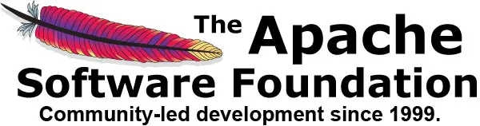

2016 年 1 月 18 日

Apache 软件基金会（ASF）为大量的开源软件项目提供组织、法律和财务支持。该基金会为知识产权和财务捐赠提供了一个既限制了捐赠者潜在法律风险，又确立的框架。通过协作和有功开发过程，Apache 项目提供企业级、免费的软件产品，吸引了大量的用户社区。实用的 Apache 许可证使所有用户，包括商业和个人用户，都可以轻松地部署 Apache 产品。

ASF 支持了一半的互联网，处理了 PB 级的数据，进行了 TF 级的操作，处理了数十亿个对象，并丰富了无数用户和开发者的生活。ASF 成立于 1999 年，负责管理、开发和孵化开源创新，以“Apache 方式”为核心，ASF 监督了 150 多个项目，由超过 350 名个人成员和 3000 名贡献者组成，分布在六大洲。

在加拿大不久前举行的 ApacheCon 北美大会 2011 年度大会中，FreeBSD 在 DevOps 领域的讲座中成为了亮点。Apache 软件基金会本身在几乎所有的公共服务中都使用了 FreeBSD，包括世界上最大的 SVN 仓库之一。我们的仓库在多个大陆上都有镜像，包含了超过 140 万个跨足十多年的版本。我们甚至会协助将 FreeBSD 的 Ports CVS 转换为 SVN。

Apache 软件基金会使用自定义的 FreeBSD Tinderbox 和 FreeBSD Update 服务器，在多个数据中心中自动、快速、高效地执行应用程序和基础系统更新。Apache 基础设施团队经常与 FreeBSD 开发人员直接合作，在真实世界负载下测试先进的功能，比如 ZFS。

与 FreeBSD 基金会一样，ASF 也是一个 501（c）3 组织。通过 FreeBSD 基金会捐赠给 FreeBSD，也会使 Apache 变得更好，帮助你和其他人的日常生活更加轻松。

——[Apache 软件基金会](http://www.apache.org/) 前基础设施副主席 Philip M. Gollucci

## Hobnob, Inc.

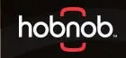

2021 年 1 月 18 日

Hobnob 为企业和公共交通机构提供大规模移动 WiFi 网络解决方案。Hobnob Diversified Networks™ 是唯一能够为移动设备和非直线视线（non-LOS）位置（如公交车、铁路车厢、远程办公室和建筑工地）提供企业级速度和可靠性的移动 WiFi 网络。

Hobnob 选择 FreeBSD，因为它是唯一真正支持我们使命的操作系统：为我们的客户提供快速可靠的网络服务。

当 Hobnob 解决一个与我们核心业务无关的技术问题时，我们可以自由地赞助该工作，并将其贡献回社区。然而，当我们有一个对公司未来至关重要的重大技术突破时，我们并不会被迫放弃核心知识产权，从而使自己陷入困境。

赞助和贡献非 Hobnob 核心代码不仅加强了每个人，包括 Hobnob 在内的基础，还节省了 Hobnob 在维护和持续工程方面的时间和金钱。与 FreeBSD 的这种关系为快速创新和问题解决创造了理想的条件，这是任何计划在当前商业环境中生存的公司所需的两个关键要求。

——[Hobnob](http://www.hobnob.com/) ECO Aron Hall

## Summersault Website Development

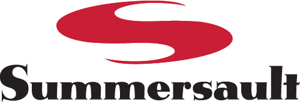

2021 年 1 月 18 日

在 1997 年，我和一个朋友创办了我们的技术公司，当时我们并没有选择 FreeBSD，而是 FreeBSD 选择了我们。但我们非常高兴它这么做了，并且我们开始在 FreeBSD 上建立我们的公司。

作为一个小型网站设计和 Web 应用程序开发公司，我们并不打算涉足 Web 托管业务。我们开始听到客户说，他们希望能够通过与为他们构建网站的提供商托管他们的网站，因此我们决定尝试提供这项服务作为一种便利。当时，我们与共享办公空间的本地互联网服务提供商有一个带有空间的 FreeBSD 2.1 服务器，所以我们获得了用户名和密码，然后就开始运行了。

当我们的业务发展到需要自己的服务器来托管网站时，我们没有花太多时间来寻找选择。当时的共识（现在是 1998 年）是 Linux、FreeBSD 和 NetBSD 基本上都是相同的，这主要是一个偏好的问题，以及哪种商业支持可以帮助你解决任何困难（尽管当时的许可证之争确实还在继续）。由于我们的互联网服务提供商朋友就在书架的另一侧，我们知道我们拥有一些最好的 FreeBSD 产品支持，这是我们所能期望的。

到了 2000 年，我们的业务模式基本转向了构建基于数据库的网站应用程序，对于 Web 托管服务应提供哪些功能的期望也有了显著的扩展。我们不再只是在 FreeBSD 上提供基于 Apache 的 Web 托管服务 - 我们知道我们需要支持对 PostgreSQL 和 MySQL 数据库系统、qmail 和 vpopmail 电子邮件系统以及其他专用服务的不断依赖。我们开始构建新的服务器作为专用的单功能盒子，而在每种情况下，安装 FreeBSD 都是毫不费力的。我们使用 Ports 将其转变为我们所需的类型的服务器，从而在这一过程中节省了大量时间。随着我们过渡到更“主流”的托管平台，比如我们使用 cPanel，FreeBSD 仍然在幕后提供支持。

你可能不一定需要听到 FreeBSD 是一个可靠的运行互联网服务的平台。但我认为重要的是要记住，像 FreeBSD 这样的软件每天都在影响着人们的生活方式，无论是支持像我们这样的企业，还是帮助刚刚接触开源软件的业余爱好者，或者它在扮演的成千上万个其他“现实世界”的角色。

对于世界上的许多人来说，选择操作系统是一个随意的决定。我们相信，对于我们来说，这在建立一个成功的业务方面产生了巨大的差异。

——[Summersault Website Development](http://www.summersault.com/) 联合创始人 Chris Hardie

## Colocation America

2021 年 1 月 18 日

Colocation America 为那些希望将服务器托管在美国的企业提供托管、专用服务器、VoIP 和托管数据中心服务。凭借 22 个数据中心位置，Colocation America 已成为托管服务的领先提供商之一。我们的大多数客户依赖 FreeBSD 操作系统，为他们提供一个安全的环境来托管他们的网络基础设施。他们称赞 FreeBSD 能够加密敏感数据，以及 ZFS 高级文件系统使管理服务器文件变得轻松。许多公司客户选择使用 FreeBSD 来运行他们的 MySQL 数据库系统和电子邮件服务器，这是因为操作系统具有出色的网络组件。

选择与我们合作托管服务器的开发人员也选择在他们的专用服务器上安装 FreeBSD。BSD 许可证的开源性质为他们提供了开发创新软件所需的灵活性。此外，他们可以访问一个免费的企业级操作系统，该操作系统具有活跃的开发社区，并允许他们贡献自己的技能，使系统对于他们自己的开发变得更好。我们问过几个客户为什么决定使用 FreeBSD，答案总是一样的：操作系统的成本和网络能力与商业许可证竞争对手相媲美。

我们的客户不是 FreeBSD 的唯一粉丝。由于操作系统能够管理防火墙和 Web 应用程序，并同时处理多个托管账户的服务器负载，我们使用 FreeBSD 来管理我们的共享托管服务器。通过 WebHost Manager cPanel 附加组件，可以在单个专用服务器上管理多个 Web 托管帐户，我们的共享托管服务器能够为寻求廉价网站托管的客户提供服务。FreeBSD 的社区支持以及其开源性质为我们的客户提供了一个安全的托管环境。要了解更多关于带有 FreeBSD 操作系统的专用服务器托管的信息，你可以访问我们的 FreeBSD 专用服务器页面。

——[Colocation America](http://www.colocationamerica.com/) 业务发展总监 Albert Ahdoot

