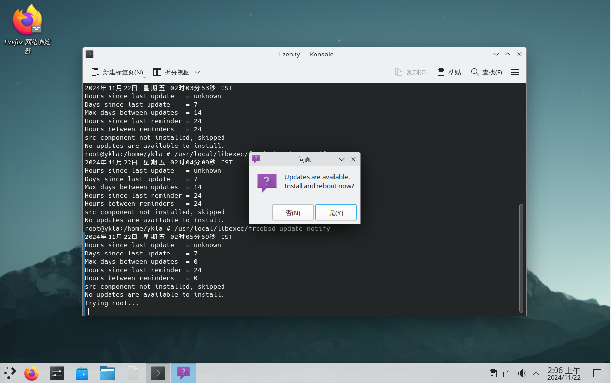
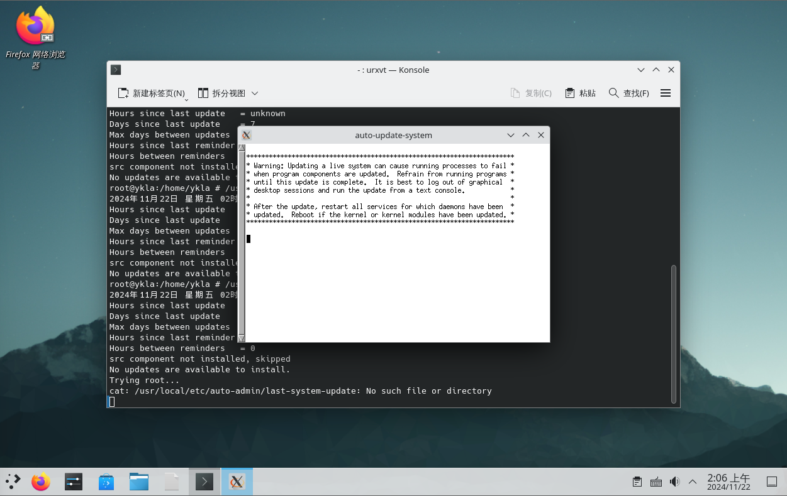
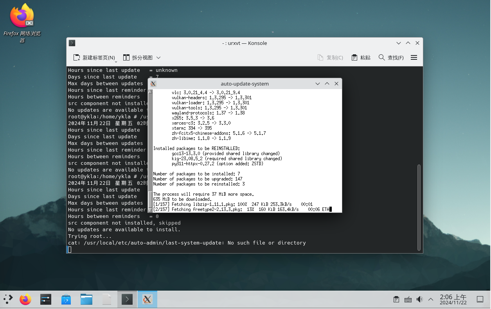

# 10.4 系统更新检测工具

> **技巧**
>
> FreeBSD 下的 KDE6 自带类似功能，无需安装 `freebsd-update-notify`，本节仅作示例。

freebsd-update-notify 可以自动检测 FreeBSD 系统和 pkg 包的更新。

## 安装 freebsd-update-notify

使用 pkg 安装：

```sh
# pkg install freebsd-update-notify
```

或使用 Ports 安装：

```sh
# cd /usr/ports/deskutils/freebsd-update-notify/
# make install clean
```

## 配置 freebsd-update-notify

freebsd-update-notify 的配置文件位于 `/usr/local/etc/freebsd-update-notify/freebsd-update-notify.conf`：

默认配置的更新间隔较长，可以改为：

```ini
max-days-between-updates    1   # 更新检测间隔（日）
hours-between-reminders     8   # 提醒间隔（小时）
```

## 图片示例

> **注意**
>
> 截图为手动执行示例，实际上程序可以在后台自动运行，无需手动验证。若无法再现，可以将 `freebsd-update-notify.conf` 中两个值都改为 `0`，再手动以 `root` 权限执行 `/usr/local/libexec/freebsd-update-notify`。

freebsd-update-notify 的日志位于 `/var/log/freebsd-update-cron` 和 `/var/log/freebsd-update-notify`。若要反馈故障，请使用英文提交至 [issue](https://github.com/outpaddling/freebsd-update-notify/issues)。







## 课后习题

1. 使用更优雅的方式进行系统更新提示。
2. 尝试将更新提示功能基于合并入 pkg 源代码。
