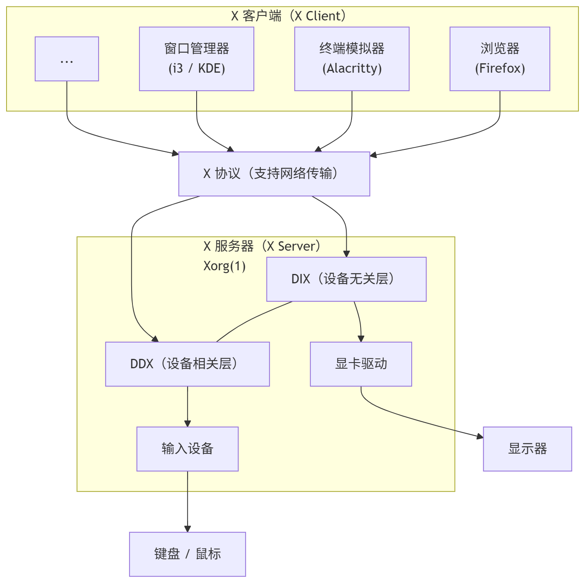

# 10.1 X Window 系统概论

X Window 系统是 UNIX 平台传统的图形架构，既支持最新技术，又兼顾对历代应用程序的支持。包括桌面组件在内的应用程序由 Xorg(1) 服务器承载。该系统具有网络感知能力，其各个组件可以跨网络协同工作。目前 X Window 系统有两个分支，分别是 XLibre 和 X11。

X Window 系统采用客户端-服务器（Client-Server）架构：

对于 X11 用户，必须在安装显卡驱动后，再安装 X.org 服务器以承载桌面。还需要将用户添加到 video 组。
