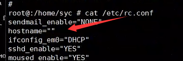
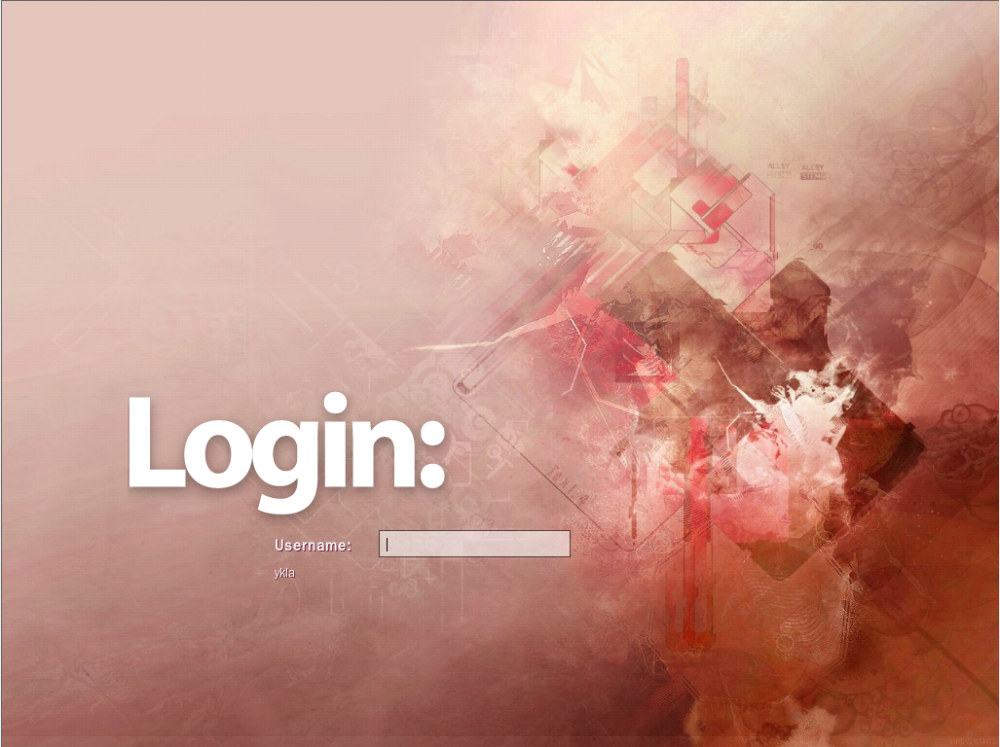

# 10.2 显示管理器

桌面环境通常需要显示管理器（DM）才能顺利登录桌面。

## SDDM

SDDM，即 Simple Desktop Display Manager，简易桌面显示管理器。

### 安装 SDDM

使用 pkg 安装：

```sh
# pkg ins sddm
```

或者使用 Ports 安装：

```sh
# cd /usr/ports/x11/sddm/ 
# make install clean
```

启用 SDDM 显示管理器：

```sh
# service sddm enable
```

### 设置 SDDM 显示管理器的语言为简体中文

执行命令：

```sh
# sysrc sddm_lang="zh_CN"
```


### 允许 root 用户登录

> **警告**
>
> root 账户拥有最高权限，不当使用 root 账户可能导致系统损坏，因此以其登录图形界面存在极高的安全风险。

更改 **/usr/local/etc/pam.d/sddm** 文件：将 `include` 之后的 `login`，改为 `system`，共计四处。

重启 SDDM 服务：

```sh
# service sddm restart
```

重启后可使用 root 登录 SDDM。

### 参考文献

- FreeBSD Forums. SDDM login screen with KDE: change language?[EB/OL]. [2026-03-25]. <https://forums.freebsd.org/threads/sddm-login-screen-with-kde-change-language.80535/>. 讨论 SDDM 登录界面语言设置不生效的解决方法。

### 故障排除

#### SDDM 登录闪退

如果在 VMware 虚拟机中 SDDM 底部选项未显示，请按照虚拟机配置章节的教程设置屏幕自动缩放。

#### 启动 SDDM 提示 **/usr/bin/xauth**: `(stdin):1: bad display name`，但仍可正常 `startx`

需要在 **/etc/rc.conf** 文件中检查是否已设置 `hostname="XXX"`（该条目应当存在，且不应为 `hostname=""`）：



按需设置 `hostname` 即可。

## LightDM

LightDM，即 Light Display Manager，轻量级显示管理器。

### 安装 LightDM

使用 pkg 安装：

```sh
# pkg ins lightdm
```

使用 Ports 安装：

```sh
# cd /usr/ports/x11/lightdm/ 
# make install clean
```

设置 LightDM 显示管理器开机自启：

```sh
# service lightdm enable
```

### 中文环境

编辑 **/etc/rc.conf** 文件，加入下面一行：

```ini
lightdm_env="LC_MESSAGES=zh_CN.UTF-8"
```

设置 LightDM 环境变量，将系统消息语言指定为中文。

### 安装 greeter

greeter 提供了图形化界面，因此 LightDM 需要至少一个 greeter 才能正常工作。

#### lightdm-gtk-greeter

Port **x11/lightdm-gtk-greeter** 是使用 GTK 构建的 LightDM LightDM。Port **x11/lightdm-gtk-greeter-settings** 是一款 LightDM GTK+ 登录界面的图形配置工具。


使用 pkg 安装：

```sh
# pkg ins lightdm-gtk-greeter lightdm-gtk-greeter-settings
```

使用 Ports 安装：

```sh
# cd /usr/ports/x11/lightdm-gtk-greeter/ && make install clean
# cd /usr/ports/x11/lightdm-gtk-greeter-settings && make install clean
```

#### slick-greeter

Port **x11/slick-greeter** 是 Linuxmint 项目维护的登录界面。

使用 pkg 安装：

```sh
# pkg ins slick-greeter
```

使用 Ports 安装：

```sh
# cd /usr/ports/x11/slick-greeter/ 
# make install clean
```

Port **x11/slick-greeter** 需要编辑 **/usr/local/etc/lightdm/lightdm.conf** 文件方可启用：将 `greeter-session` 设置为 `slick-greeter`。

##### slick-greeter 配置注释

创建 **/usr/local/etc/lightdm/slick-greeter.conf** 文件，写入以下配置。

```ini
[Greeter]
# 设置登录界面的背景图片路径
background=/home/ykla/cat.png

# 是否绘制用户自定义的背景图片
draw-user-backgrounds=false

# 设置 GTK+ 主题名称
theme-name=Dracula

# 设置图标主题名称
icon-theme-name=Adwaita

# 是否显示主机名
show-hostname=true

# 设置字体名称和大小
font-name=Sans 12

# 是否显示虚拟键盘选项
show-keyboard=true

# 是否显示电源管理选项（如关机、重启）
show-power=true

# 是否显示时钟
show-clock=true

# 是否显示退出选项
show-quit=true
```


### 允许 root 用户登录

> **警告**
>
> root 账户拥有最高权限，不当使用 root 账户可能导致系统损坏，因此以其登录图形界面存在极高的安全风险。

编辑 **/usr/local/etc/pam.d/lightdm** 文件，注释掉 `account requisite pam_securetty.so` 这一行（在行首添加 `#`）。

重启 LightDM 服务：

```sh
# service lightdm restart
```

### 参考文献

- FreeBSD Forums. lightdm not reading slick-greeter.conf[EB/OL]. [2026-03-25]. <https://forums.freebsd.org/threads/lightdm-not-reading-slick-greeter-conf.92256/>. 解决了 LightDM 无法正确读取 slick-greeter 配置文件的技术问题。

## SLiM

SLiM, Simple Login Manager 简单的登录管理器。

>**警告**
>
> SLiM 已经不再维护，请谨慎使用。



使用 pkg 安装 SLiM：

```sh
# pkg ins slim
```

使用 Ports 安装 SLiM：

```sh
# cd /usr/ports/x11/slim/ 
# make install clean
```

设置 SLiM 显示管理器开机自启：

```sh
# service slim enable
```

SLiM 默认允许 root 用户登录。

## GDM

GDM，即 GNOME Display Manager，GNOME 显示管理器。GDM 随 GNOME 安装。

### 允许 root 用户登录

> **警告**
>
> root 账户拥有最高权限，不当使用 root 账户可能导致系统损坏，因此以其登录图形界面存在极高的安全风险。

编辑配置文件 **/usr/local/etc/pam.d/gdm-password**，注释掉 `account requisite pam_securetty.so` 这一行（在行首添加 `#`）。

重启 GDM 服务：

```sh
# service gdm restart
```
