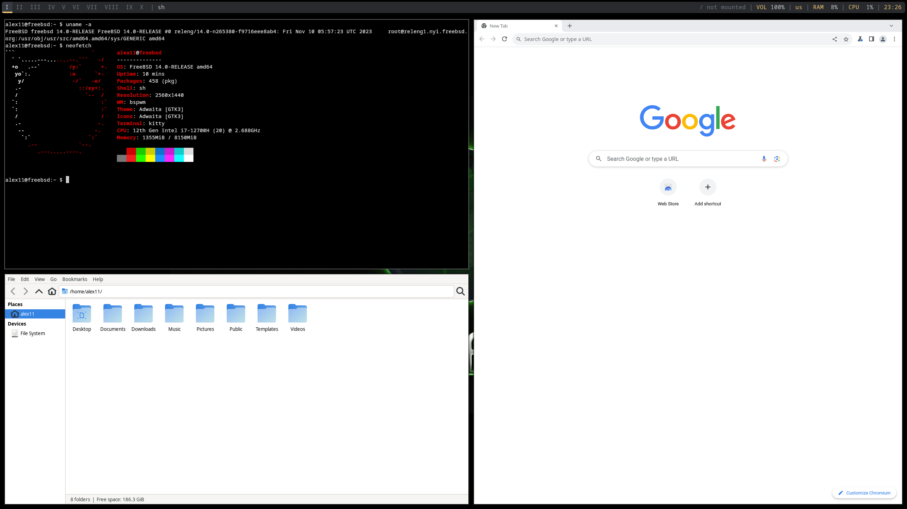

# 10.3 X11 窗口管理器

大多数倾向于轻量化的用户不会选择使用完整的桌面套件，而是使用窗口管理器。

例如完整的 X Window 系统将安装 X11 窗口管理器 twm。

## bspwm

bspwm 是一款平铺式窗口管理器，按二叉空间分区方式组织窗口。设计理念契合 UNIX 哲学原则。

### 安装 bspwm

- 通过 pkg 安装：

```sh
# pkg install xorg bspwm sxhkd rofi kitty feh picom tint2 dunst wqy-fonts xdg-user-dirs
```

- 使用 Ports 安装：

```sh
# cd /usr/ports/x11/xorg/ && make install clean
# cd /usr/ports/x11-wm/bspwm/ && make install clean
# cd /usr/ports/x11/sxhkd/ && make install clean
# cd /usr/ports/x11/rofi/ && make install clean
# cd /usr/ports/x11/kitty/ && make install clean
# cd /usr/ports/graphics/feh/ && make install clean
# cd /usr/ports/x11-wm/picom/ && make install clean
# cd /usr/ports/x11/tint/ && make install clean
# cd /usr/ports/sysutils/dunst/ && make install clean
# cd /usr/ports/x11-fonts/wqy/ && make install clean
# cd /usr/ports/devel/xdg-user-dirs/ && make install clean
```

登录管理器建议使用 LightDM。

| 包名 | 作用说明 |
| ---- | -------- |
| `xorg` | X 窗口系统 |
| `bspwm` | 轻量级平铺窗口管理器（Binary Space Partitioning Window Manager） |
| `sxhkd` | 快捷键绑定工具（Simple X Hotkey Daemon） |
| `rofi` | 程序启动器（Rofi），支持应用启动、窗口切换等功能 |
| `kitty` | 终端模拟器（Kitty） |
| `feh` | 桌面背景设置工具（Feh） |
| `picom` | 窗口合成器（Picom），提供透明、阴影和动画效果 |
| `x11/tint` | 面板工具，显示系统信息和应用图标等 |
| `dunst` | 通知管理器（Dunst） |
| `wqy-fonts` | 文泉驿字体（WenQuanYi Fonts） |
| `xdg-user-dirs` | 用户目录管理工具（XDG User Dirs），管理如“桌面”、“下载”等目录 |

## 启用服务

设置 D-Bus 服务开机自启：

```sh
# service dbus enable
```

## 相关文件结构

```sh
~/
├── .config/
│   ├── bspwm/
│   │   └── bspwmrc # bspwm 配置文件
│   ├── sxhkd/
│   │   └── sxhkdrc # sxhkd 配置文件
│   └── polybar/
│       ├── config.ini # Polybar 配置文件
│       └── launch.sh  # Polybar 启动脚本
└── .xinitrc # 启动配置文件

/usr/local/
├── etc/
│   └── polybar/
│       └── config.ini # Polybar 示例配置文件
├── share/
│   ├── examples/
│   │   └── bspwm/
│   │       ├── bspwmrc # bspwm 示例配置文件
│   │       └── sxhkdrc # sxhkd 示例配置文件
│   └── xsessions/
│       └── bspwm.desktop # LightDM 桌面入口文件
```

### 创建配置文件

```sh
$ mkdir -p ~/.config                  # 创建用户配置目录
$ mkdir -p ~/.config/bspwm            # 创建 bspwm 配置目录
$ mkdir -p ~/.config/sxhkd            # 创建 sxhkd 配置目录
$ cp /usr/local/share/examples/bspwm/bspwmrc ~/.config/bspwm   # 复制 bspwm 示例配置文件到用户目录
$ cp /usr/local/share/examples/bspwm/sxhkdrc ~/.config/sxhkd   # 复制 sxhkd 示例配置文件到用户目录
$ chmod +x ~/.config/bspwm/bspwmrc    # 设置 bspwm 配置文件为可执行权限
```

编辑 **~/.config/sxhkd/sxhkdrc** 文件，修改如下：

```sh
super + Return
    kitty   # 使用超级键 + 回车启动 Kitty 终端

super + @space
    rofi -show drun   # 使用超级键 + 空格启动 Rofi 应用启动器
```

> **思考题**
>
> 回顾基础入门章节的内容，“超级键”是什么？更多快捷键设置可参考 **~/.config/sxhkd/sxhkdrc** 文件。

### 设置 polybar 启动脚本和配置文件

```sh
$ mkdir ~/.config/polybar                    # 创建 Polybar 配置目录
$ cp /usr/local/etc/polybar/config.ini ~/.config/polybar   # 复制 Polybar 示例配置文件到用户目录
```

创建 **~/.config/polybar/launch.sh** 文件，写入：

```sh
#!/bin/sh
killall -q polybar                        # 安静地终止所有正在运行的 Polybar 实例
polybar example 2>&1 | tee -a /tmp/polybar.log   # 启动 Polybar 并将输出追加到日志文件
```

然后执行以下命令为 Polybar 启动脚本设置可执行权限：

```sh
$ chmod +x ~/.config/polybar/launch.sh
```

### 设置 picom、polybar、dunst 开机启动

在 bspwm 配置中启动 picom：

```sh
$ echo "picom &" >> ~/.config/bspwm/bspwmrc
```

在 bspwm 配置中启动 Polybar：

```sh
$ echo "\$HOME/.config/polybar/launch.sh" >> ~/.config/bspwm/bspwmrc
```

在 bspwm 配置中启动 Dunst 通知守护进程：

```sh
$ echo "dunst &" >> ~/.config/bspwm/bspwmrc
```

### 通过 startx 启动 bspwm

在 `.xinitrc` 文件中添加启动 bspwm 的命令：

```sh
$ echo "exec bspwm" >> ~/.xinitrc
```

### 通过 LightDM 启动 bspwm

创建配置路径：

```sh
# mkdir -p /usr/local/share/xsessions
```

编辑 **/usr/local/share/xsessions/bspwm.desktop** 文件，写入以下内容：

```ini
[Desktop Entry]
Name=bspwm
Comment=Log in with bspwm
Exec=/usr/local/bin/bspwm
Type=Application
```

### 设置桌面背景

初次设置预览。使用 feh 设置壁纸并居中显示：

```sh
$ feh --bg-center "$HOME/.local/share/wallpapers/wallpaper.jpg"
```

预览后如满意则设为永久生效（开机在后台执行 feh 保存的壁纸设置脚本）。在 **~/.config/bspwm/bspwmrc** 文件中的 polybar 启动脚本 **前** 添加：

```sh
$HOME/.fehbg &
```

### 展示图片



图片中显示的 Chrome 浏览器和 Thunar 文件管理器均需用户自行安装。