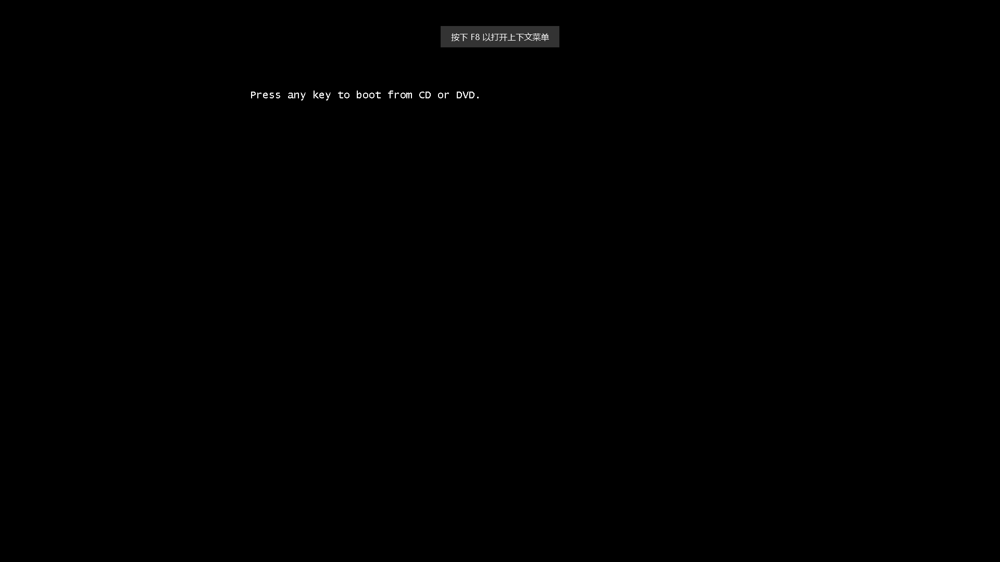
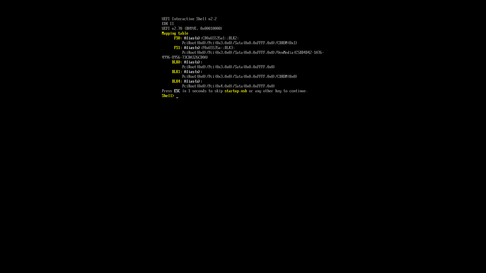

# 第 10.5 节 使用 bhyve 安装 Windows 10

## 安装固件与软件

以下教程基于 FreeBSD 13.1 release + Windows 10 22H2。

> Windows 10 22H2 原版系统磁力链接：
>
> magnet:?xt=urn:btih:7bcf7952a6c114c25c92cdefc64a35fa4d30cd75\&dn=SW_DVD9_Win_Pro_10_22H2_64BIT_ChnSimp_Pro_Ent_EDU_N_MLF_X23-20012.ISO\&xl=5953392640

加载内核模块：

> 只需要这一次，以后 vm-bhyve 会自己加载该模块的。

```shell-session
kldload vmm
```

首先，安装 UEFI 固件、VNC 与 vm-bhyve：

```shell-session
# pkg install bhyve-firmware vm-bhyve tigervnc-viewer
```

在 `/etc/rc.conf` 中指定启动 vm 与虚拟机的位置：

```shell-session
vm_enable="YES"
vm_dir="/home/ykla/vm" #注意该位置，以下操作都会用到
```

复制模板到虚拟机模板位置：

```shell-session
#cp /usr/local/share/examples/vm-bhyve/* /home/ykla/vm/.templates
```

创建虚拟交换机，`public` 是你在模板里指定的，`ue0` 是我正在上网用的网卡，你需要改成你自己的，否则会创建失败且虚拟机报错：`exit with error 4`：

```shell-session
# vm switch create public
# vm switch add public ue0
```

> 如果创建错了，可以销毁之：
>
> ```shell-session
> # vm switch destroy public
> ```

查看分配的虚拟交换机：

```shell-session
root@ykla:/usr/home/ykla # vm switch list
NAME    TYPE      IFACE      ADDRESS  PRIVATE  MTU  VLAN  PORTS
public  standard  vm-public  -        no       -    -     ue0
```

为了在 13.0 之后的 FreeBSD 宿主机中正确使用 xhci 鼠标，应该使用驱动 hms(4)，请在 `/boot/loader.conf` 中添加：

```shell-session
hw.usb.usbhid.enable=1
usbhid_load="YES"
```

## 进一步配置

> 注意，如果你运行的是比 Windows 10 更早的 Windows 版本，你将需要使用 `disk0_opts="sectorsize=512"` 选项将磁盘扇区大小设置为 512。 当你想在 Windows 系统上安装 Microsoft SQL Server 时，你也必须将磁盘扇区大小设置为 512。

根据模板创建 windows 虚拟机，磁盘占用 50GB：

```shell-session
# vm create -t windows -s 50G winguest
```

> 销毁虚拟机的命令:
>
> ```shell-session
> root@ykla:/usr/home/ykla # vm  destroy winguest
>
> Are you sure you want to completely remove this virtual machine (y/n)? Are you sure you want to completely remove this virtual machine (y/n)? #这里输入 y 回车即可删除
> ```

但是注意该模板是有问题的，需要进行修改如下，文件路径是 `/usr/home/ykla/vm/winguest/winguest.conf`：

> 不必疑惑路径问题，`/home/` 是被软连接到 `/usr/home/` 的，是一样的。

```shell-session
loader="uefi" #不支持 UEFI 的 windows 不能够启动，例如 XP 操作系统，但是请注意 win7 是支持 UEFI 的
graphics="yes" #指定暂停虚拟机直至 VNC 链接。
xhci_mouse="yes"
cpu=2 #CPU，这个最好多给一些
memory=4G #内存

# put up to 8 disks on a single ahci controller.
# without this, adding a disk pushes the following network devices onto higher slot numbers,
# which causes windows to see them as a new interface
ahci_device_limit="8"

# ideally this should be changed to virtio-net and drivers installed in the guest
# e1000 works out-of-the-box
network0_type="e1000" #开箱即用的虚拟网卡
network0_switch="public" #虚拟交换机

disk0_type="ahci-hd"
disk0_name="disk0.img"

# windows expects the host to expose localtime by default, not UTC
utctime="no" #指定 windows 使用 UTC 时间，避免时间差 8 个小时

graphics_res="1024x768" #指定 VNC 链接的屏幕分辨率，可用数值在下文列出
uuid="af86e094-56da-11ed-958f-208984999cc9"
network0_mac="58:9c:fc:0c:5e:bb"
root@ykla:/usr/home/ykla #
```

终止虚拟机：

> 如果虚拟机卡死该命令无效，请自行 `kill -9` 以免影响关机，如果真的阻碍了物理机关机，可以在 tty 按 `Ctrl`+ `C` 跳过等待虚拟机，强制关机

```shell-session
root@ykla:/usr/home/ykla # vm stop winguest
Sending ACPI shutdown to winguest
```

## 安装系统

通过指定 Windows iso 文件开始正常的安装。当在安装模式下运行时，`vm-bhyve` 将等待，直到 VNC 客户端连接后再启动客户机。这允许你抓住 Windows 可能显示的“从 CD/DVD 启动“选项。你可以在 `vm list` 中看到，在这一点上，客户机将显示为锁定：

```shell-session
# vm install winguest Windows.iso
```

## 从 VNC 访问 Win10

查看指定的虚拟机状态：

```shell-session
root@ykla:/usr/home/ykla # vm info winguest
------------------------
Virtual Machine: winguest
------------------------
  state: stopped
  datastore: default
  loader: uefi
  uuid: af86e094-56da-11ed-958f-208984999cc9
  cpu: 2
  memory: 4G

  network-interface
    number: 0
    emulation: e1000
    virtual-switch: public
    fixed-mac-address: 58:9c:fc:0c:5e:bb
    fixed-device: -

  virtual-disk
    number: 0
    device-type: file
    emulation: ahci-hd
    options: -
    system-path: /home/ykla/vm/winguest/disk0.img
    bytes-size: 53687091200 (50.000G)
    bytes-used: 23557898240 (21.940G)

root@ykla:/usr/home/ykla #
```

查看所有虚拟机状态：

```shell-session
root@ykla:/usr/home/ykla # vm list
NAME      DATASTORE  LOADER  CPU  MEMORY  VNC  AUTO  STATE
winguest  default    uefi    2    4G      -    No    Stopped
```

打开 tigervnc-viewer 输入 `localhost:5900`，点击连接，然后按任意键以进入安装过程。

## 故障排除

有问题先重启一遍自己的物理机。还有问题自己 `ifconfig` 对比上文看看是不是有了多余的网卡，将其销毁掉。

如果虚拟机一直是 stopped 的状态，检查一下你的网络。

查看网络，这是虚拟机关闭状态下的：

```shell-session
root@ykla:/usr/home/ykla # ifconfig
alc0: flags=8802<BROADCAST,SIMPLEX,MULTICAST> metric 0 mtu 1500
        options=c319a<TXCSUM,VLAN_MTU,VLAN_HWTAGGING,VLAN_HWCSUM,TSO4,WOL_MCAST,WOL_MAGIC,VLAN_HWTSO,LINKSTATE>
        ether 20:89:82:94:7c:c9
        media: Ethernet autoselect
        nd6 options=29<PERFORMNUD,IFDISABLED,AUTO_LINKLOCAL>
lo0: flags=8049<UP,LOOPBACK,RUNNING,MULTICAST> metric 0 mtu 16384
        options=680003<RXCSUM,TXCSUM,LINKSTATE,RXCSUM_IPV6,TXCSUM_IPV6>
        inet6 ::1 prefixlen 128
        inet6 fe80::1%lo0 prefixlen 64 scopeid 0x2
        inet 127.0.0.1 netmask 0xff000000
        groups: lo
        nd6 options=21<PERFORMNUD,AUTO_LINKLOCAL>
ue0: flags=8943<UP,BROADCAST,RUNNING,PROMISC,SIMPLEX,MULTICAST> metric 0 mtu 1500
        options=8000b<RXCSUM,TXCSUM,VLAN_MTU,LINKSTATE>
        ether f8:e2:3b:3f:ea:4c
        inet 192.168.31.169 netmask 0xffffff00 broadcast 192.168.31.255
        media: Ethernet autoselect (1000baseT <full-duplex>)
        status: active
        nd6 options=29<PERFORMNUD,IFDISABLED,AUTO_LINKLOCAL>
vm-public: flags=8843<UP,BROADCAST,RUNNING,SIMPLEX,MULTICAST> metric 0 mtu 1500
        ether 3a:e1:fa:98:33:b4
        id 00:00:00:00:00:00 priority 32768 hellotime 2 fwddelay 15
        maxage 20 holdcnt 6 proto rstp maxaddr 2000 timeout 1200
        root id 00:00:00:00:00:00 priority 32768 ifcost 0 port 0
        member: ue0 flags=143<LEARNING,DISCOVER,AUTOEDGE,AUTOPTP>
                ifmaxaddr 0 port 3 priority 128 path cost 20000
        groups: bridge vm-switch viid-4c918@
        nd6 options=9<PERFORMNUD,IFDISABLED>
root@ykla:/usr/home/ykla #
```

查看网络，这是虚拟机开启状态下的，会多出来一个 `tap0`：

```shell-session
tap0: flags=8943<UP,BROADCAST,RUNNING,PROMISC,SIMPLEX,MULTICAST> metric 0 mtu 1500
        description: vmnet/winguest/0/public
        options=80000<LINKSTATE>
        ether 58:9c:fc:10:ff:d6
        groups: tap vm-port
        media: Ethernet autoselect
        status: active
        nd6 options=29<PERFORMNUD,IFDISABLED,AUTO_LINKLOCAL>
        Opened by PID 2519
```

## 可选配置（我没测试过，自己试用）

### VNC 配置选项

如果你想让 VNC 监听一个特定的主机 IP 地址，请指定以下选项：

```shell-session
graphics_listen="1.2.3.4"
```

你也可以选择一个 5900 以外的端口。显然，如果你有多个客户机，需要为每个客户机使用不同的端口号。如果没有指定，我们会自动选择一个可用的端口，从 5900 开始：

```shell-session
graphics_port="5901"
```

默认情况下，屏幕分辨率被设置为 `800x600`。要指定一个不同的分辨率，请使用以下选项：

```shell-session
graphics_res="1600x900"
```

请注意，目前只支持以下分辨率：

```shell-session
1920x1200
1920x1080
1600x1200
1600x900
1280x1024
1280x720
1024x768
800x600
640x480
```

### 添加 VirtIO 网络驱动

虽然“e1000”网络适配器开箱即用，允许访客获得网络访问，但建议尽可能使用“virtio-net”设备。有几种安装这些驱动程序的方法。

- 如果机器可以通过 e1000 设备访问互联网，你可以直接在客户机中下载并安装 virtio 驱动。安装完毕后，关闭客户机，在客户机配置中改变设备并重新启动。
- 可以在安装模式下启动客户机，但要指定 VirtIO ISO 文件。

```shell-session
# vm install winguest virtio-installer.iso
```

- 可以添加 CD 设备到客户机上，并指向 ISO 文件

```shell-session
disk1_type="ahci-cd"
disk1_dev="custom"
disk1_name="/full/path/to/virtio-installer.iso"
```

### 关于 CPU

某些版本的 Windows（大多数桌面版本）不支持一个以上的物理 CPU。默认情况下，bhyve 配置单个虚拟 CPU 和单核心。

可以修改 sysctl `hw.vmm.topology.cores_per_package` 以告诉 bhyve 为每个 CPU 创建多核心，而不是单核心。例如，将这个 sysctl 设置为 4 将配置一个有 8 个 vCPU 的客户机，有 2 x 4 个核心。

必须在 /boot/loader.conf 中设置（并重新启动才能生效）`hw.vmm.topology.cores_per_package`。

当在 FreeBSD 12 上，使用 vm-bhyve 1.3 时，可以使用配置选项来控制每个客户的 CPU 拓扑结构：

```shell-session
cpu=8
cpu_sockets=2
cpu_cores=4
cpu_threads=1
```

### 关于 NVMe 支持

如同 FreeBSD 12.1R，bhyve 支持 NVMe 仿真。对于 vm-bhyve 配置，请遵循以下选项：

```shell-session
disk0_type="nvme"
disk0_name="disk0.img"
disk0_opts="maxq=16,qsz=8,ioslots=1,sectsz=512,ser=ABCDEFGH"
```

你甚至可以在没有虚拟磁盘的情况下将客户机安装到物理 NVMe 磁盘上。以下是一个例子：

```shell-session
loader="uefi"
graphics="yes"
xhci_mouse="yes"
cpu=2
ram=8G
network0_type="e1000"
network0_switch="public"
utctime="no"
passthru0="4/0/0"
```

`4/0/0` 是一个 passthru NVMe SSD。

目前，NVMe 启动支持 Windows 8.1 及更新的 Windows 操作系统，如果你想从 NVMe 磁盘启动 Windows 7，请按照以下步骤进行。

- 使用 ahci-HD 控制器安装 Windows 7 客户机，就像正常程序一样。
- 安装后，用 nvme 控制器附加一个额外的 disk1.img。
- 安装微软的 nvme 补丁，即 `Windows6.1-KB2990941-v3-x64.msu` 和 `Windows6.1-KB3087873-v2-x64.msu`，确保 nvme 控制器和磁盘 1 出现在 windows7 客户的设备管理器中。
- 关闭客户机电源，交换客户机配置中的 disk0.img 和 disk1.img。再次启动。
- 关闭客户机电源，删除 ahci 控制器和 disk1.img。留下 nvme 控制器和 disk0.img，再次启动。

现在 Windows 7 客户机设备管理器中只有 nvme 控制器，没有 ahci 控制器。

## 参考资料

- [vm-bhyve/wiki/Running-Windows](https://github.com/churchers/vm-bhyve/wiki/Running-Windows)
- [The win11 release ISO requires the install-time regedit TPM workaround](https://twitter.com/bhyve_dev/status/1446404943020056581)
- [windows 11 on bhyve](https://forums.freebsd.org/threads/windows-11-on-bhyve.82371/)
- [FreeBSD, bhyve и Windows 11](https://dadv.livejournal.com/209650.html)
- [iki/bhyve/Windows](https://wiki.freebsd.org/bhyve/Windows)
- [churchers/vm-bhyve/wiki](https://github.com/churchers/vm-bhyve/wiki)
- [Using Windows on FreeBSD's vm-bhyve](https://srobb.net/vm-bhyve.html)

## 图片







