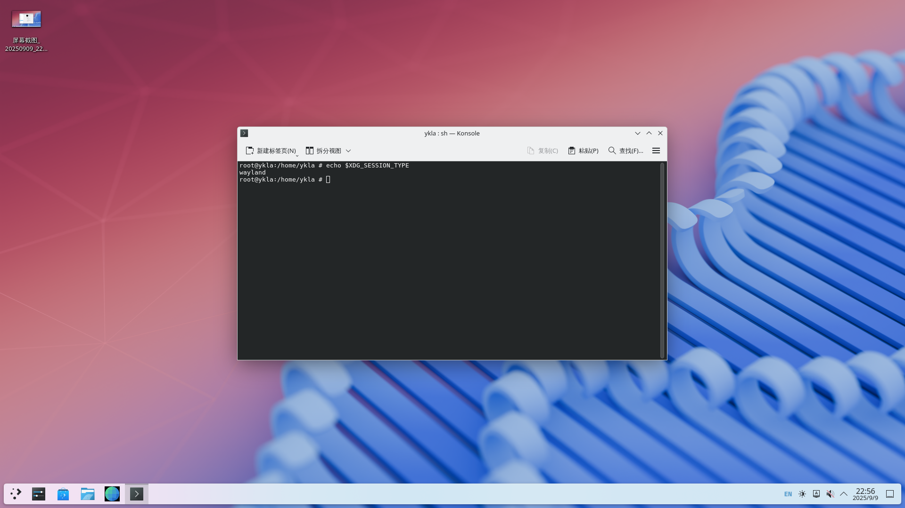
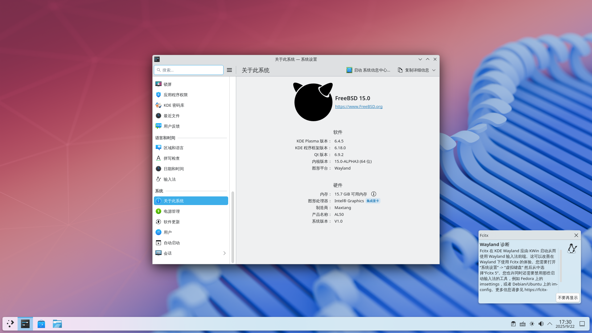

# 10.2 KDE 6 桌面环境（Wayland 会话）

## 概述

Wayland 是取代 X11 的显示服务器协议，KDE Plasma 自 Plasma 5.4 起逐步完善了 Wayland 支持，至 5.27 LTS 时已相当成熟，KDE 6 在此基础上进一步增强。

FreeBSD DRM 驱动移植仅覆盖了 Intel、AMD 和 NVIDIA 等 GPU，vmwgfx 和 virtio 等虚拟化 GPU 驱动尚不支持（参见：freebsd/drm-kmod. Request to restore support for vboxvideo, vmwgfx and virtio DRM drivers #356[EB/OL]. [2026-04-04]. <https://github.com/freebsd/drm-kmod/issues/356>）。因此，VMware、VirtualBox 或基于 Virtio 的虚拟机中无法复现本节内容，必须在物理主机上操作。

NVIDIA 显卡尚未经过测试。本节以 Intel 第 12 代处理器（i7-1260P）的集成显卡为测试环境。

参照前述章节安装 DRM、KDE 6、Fcitx 5、Firefox 浏览器等软件包，**并配置 DRM 显卡驱动。** 其余软件包仅安装，暂不配置。请确保将用户加入 video 组。

## 用户权限配置：加入 video 组

将指定用户加入 video 组，获取调用显卡设备的权限：

```sh
# pw groupmod video -m 实际用户名
```

## seatd 相关

### 安装 seatd

seatd 是一款 seat 管理守护进程，用于非 systemd 环境下管理 Wayland 会话和设备访问。

- 使用 pkg 安装：

```sh
# pkg install seatd
```

- 或通过 Ports 安装：

```sh
# cd /usr/ports/sysutils/seatd/
# make install clean
```

### 配置 seatd 服务

添加并启用服务：

```sh
# service dbus enable # 设置 D-Bus 服务开机自启
# service seatd enable # 设置 Seatd 服务开机自启
```

## 启动 KDE 6

### 方法 ① SDDM

设置 SDDM 服务开机自启：

```sh
# service sddm enable
```

使用 SDDM 显示管理器启动 KDE，在登录界面选择“Wayland”会话。

### 方法 ②：通过脚本启动

- 在 **~/** 下新建脚本 `kde.sh`：

```sh
#! /bin/sh
export LANG=zh_CN.UTF-8 # 设置中文，Fcitx 需要
export LANGUAGE=zh_CN.UTF-8 # 设置中文，Fcitx 需要
export LC_ALL=zh_CN.UTF-8 # 设置中文，Fcitx 需要
export XMODIFIERS='@im=fcitx' # Fcitx 需要
/usr/local/bin/ck-launch-session /usr/local/lib/libexec/plasma-dbus-run-session-if-needed /usr/local/bin/startplasma-wayland # 启动桌面的命令
```

- 授予 **~/kde.sh** 可执行权限：

```sh
$ chmod 755 ~/kde.sh
```

> **注意**
>
> 需要停止 SDDM 服务才能使用该脚本。检查 **/etc/rc.conf** 是否有 `sddm_enable="YES"` 字样，如有则删除。按快捷键 Ctrl+Alt+F2 进入 TTY，登录 root 后输入 `service sddm stop` 停止 SDDM 服务。

- 进入 KDE

此时应在 TTY 界面以普通用户身份登录，且没有任何 X11 会话正在运行（如存在，请禁用相关服务并重启再试）。

```sh
$ sh ~/kde.sh
```

## 图示


> **技巧**
>
> 上图显示为“Intel UHD Graphics”而非“Iris Xe Graphics”，这是因为系统未启用某些硬件加速特性（与内存配置有关）。~~无力购买第二根 DDR5 内存条。~~ 参见：Intel® Iris® Xe Graphics Shows As Intel® UHD Graphics in the Intel® Graphics Command Center and Device Manager[EB/OL]. [2026-03-26]. <https://www.intel.com/content/www/us/en/support/articles/000059744/graphics.html>（网站对应页面的中文翻译不准确）。

- 显示当前会话类型（如 X11 或 Wayland）

```sh
# echo $XDG_SESSION_TYPE
```



## 配置 Fcitx 5 输入法框架

配置 Fcitx 5 自动启动：

```sh
$ mkdir -p ~/.config/autostart/ # 创建自启动目录
$ cp /usr/local/share/applications/org.fcitx.Fcitx5.desktop ~/.config/autostart/ # 系统启动时自动启动 Fcitx 5
```

初次进入 KDE Wayland 桌面时，KDE 会在右下角提示需在系统设置的虚拟键盘中完成配置后方可启用输入法。须留意该提示。如未完成此设置，将无法切换输入法或输入中文。



打开 KDE 系统设置：找到“键盘”→“虚拟键盘”


选择“Fcitx 5 Wayland 启动器（实验性）”


在 Konsole 终端、Firefox 和 Chromium（使用 `chrome --no-sandbox` 启动）中均可输入中文。


## 视频播放测试


## 故障排除与未竟事宜

### 以 root 账户登录时没有声音

表现为右下角声音控件提示“未连接到音频服务”。可设置 PulseAudio 自启动：于 KDE 设置中添加该服务并赋予可执行权限。

## 参考文献

- Euroquis. KDE Plasma 6 Wayland on FreeBSD[EB/OL]. [2026-03-25]. <https://euroquis.nl/kde/2025/09/07/wayland.html>. 提供了在 FreeBSD 上配置 KDE Plasma 6 Wayland 会话的技术指南，明确指出 seatd 服务的必要性。
