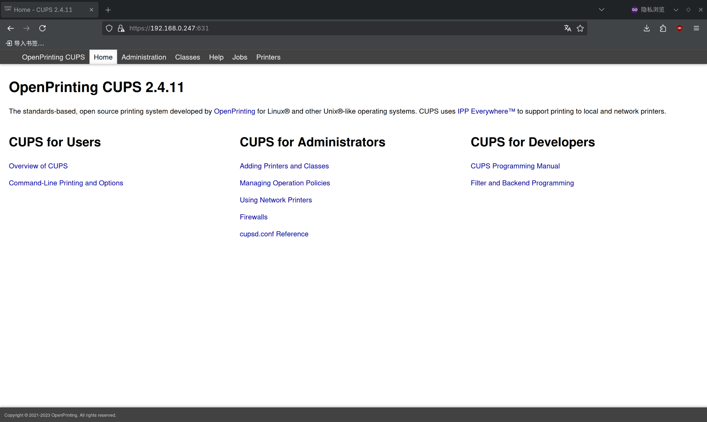
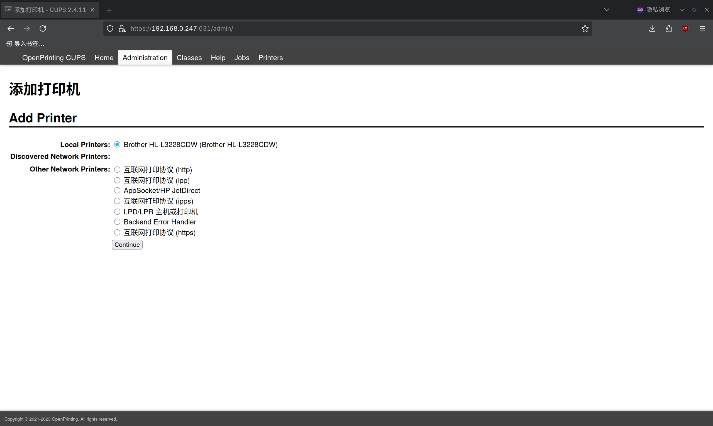
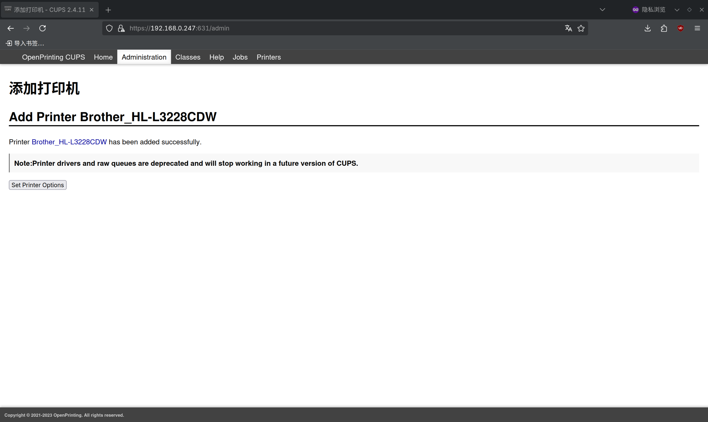
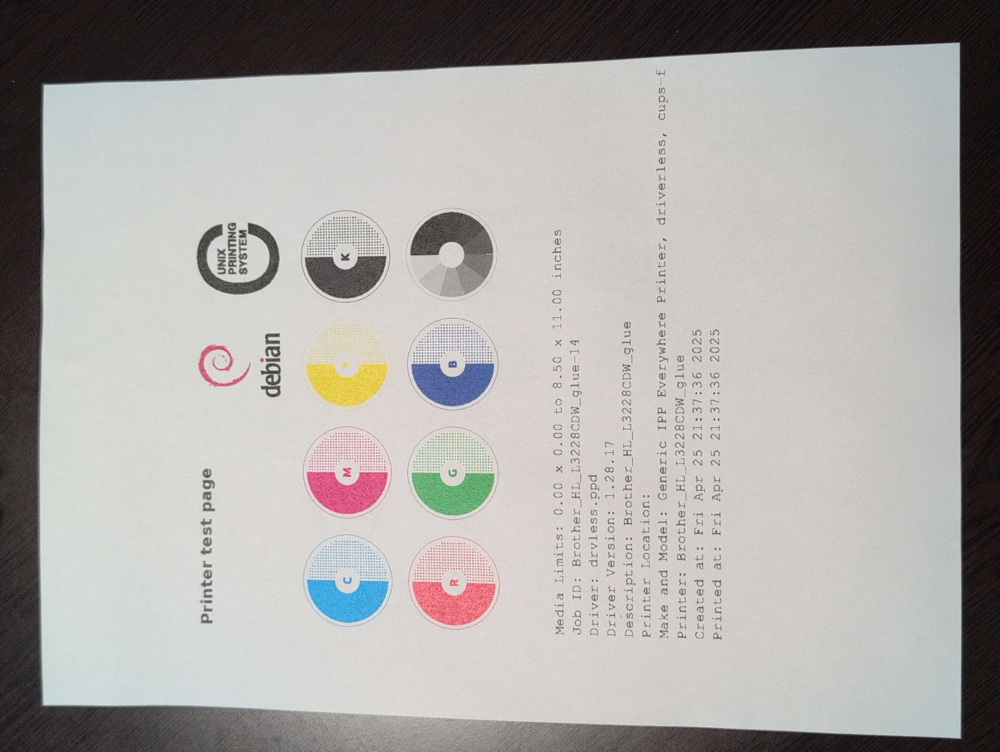

# 11.2 打印机

CUPS（通用 Unix 打印系统，Common Unix Printing System）是模块化打印系统架构，支持多种打印协议和打印机设备，可将打印机通过 IPP（互联网打印协议，Internet Printing Protocol）或 SMB（服务器消息块，Server Message Block）协议共享到网络。

打印机通过 USB（通用串行总线，Universal Serial Bus）总线接入打印服务器（即 FreeBSD 系统）。打印服务器将打印机共享到局域网中。局域网内其他计算机可通过发送多播数据包，利用零配置网络技术自动查询可用打印机。

已在 Android、macOS、Debian 等平台上测试通过，上述系统均可正常发现并使用该打印服务器。

## 安装 CUPS（通用 Unix 打印系统）

安装 CUPS：

- 使用 pkg（二进制包管理器）安装：

```sh
# pkg install cups cups-filters
```

- 或通过 Ports（源代码包管理器）安装：

```sh
# cd /usr/ports/print/cups/ && make install clean
# cd /usr/ports/print/cups-filters/ && make install clean
```

> **技巧**
>
> 如果使用桌面环境，请在 Ports 选项界面中选中 `x11` 编译选项，可在系统中生成添加和配置打印机的图形化应用图标。

## 软件包说明

| 软件包 | 作用说明 |
| ------ | -------- |
| `cups` | 用于提供 CUPS 核心打印服务 |
| `cups-filters` | 提供 CUPS 所需的附加后端、过滤器及其他软件，包括免驱动打印（IPP Everywhere 协议）支持 |
| `dbus` | Avahi 需要，作为 CUPS 依赖自动安装 |
| `avahi-app` | Avahi 所需组件，作为 CUPS 的依赖自动安装，用于局域网中的打印机自动发现 |

> **技巧**
>
> 本节介绍将 FreeBSD 配置为打印服务器。如果 FreeBSD 仅作为打印客户端，通过 USB 本地连接打印机打印，而不需要共享打印服务，avahi-app 和 dbus 并非必需组件。

> **注意**
>
> 如果打印机不支持免驱动打印，则需要安装对应的厂商驱动程序。

## 添加服务

将 D-Bus（进程间通信总线）、avahi‑daemon（Avahi 守护进程）和 cupsd（CUPS 守护进程）服务设置为系统启动时自动启用，以确保打印服务及其自动发现功能在系统重启后仍可正常运行：

```sh
# service dbus enable           # 设置 D‑Bus 服务开机自启动
# service avahi-daemon enable   # 设置 Avahi 守护进程开机自启动（用于网络服务发现）
# service cupsd enable          # 设置 CUPS 打印服务开机自启动
```

立即启动上述服务：

```sh
# service dbus start
# service avahi-daemon start
# service cupsd start
```

启动服务后，其他设备应能够自动发现内网中的共享打印机。可打印测试页以验证功能是否正常。

## 向局域网共享打印服务

如果未设置“允许局域网访问”，则除本地回环地址 `localhost` 外的其他主机将无法使用该打印服务。

相关文件结构：

```sh
/usr/local/
├── etc/
│   └── cups/
│       └── cupsd.conf # CUPS 主配置文件
└── var/
    └── run/
        └── cups/
            └── cups.sock # CUPS UNIX 套接字
```

编辑 CUPS 主配置文件 **/usr/local/etc/cups/cupsd.conf**：

- 在现有的监听配置段

```ini
Listen localhost:631
Listen /var/run/cups/cups.sock
```

后面添加以下配置（将其中 IP 替换为 FreeBSD 系统的局域网 IP 地址）：

```ini
Listen IP:631
```

该配置指定 CUPS 打印服务监听的网络接口 IP 地址和端口号（631 是 IPP 协议的标准端口）。

- 再将

```apache
# Restrict access to the server...
<Location />
  Order allow,deny
</Location>

# Restrict access to the admin pages...
<Location /admin>
  AuthType Default
  Require user @SYSTEM
  Order allow,deny
</Location>
```

改为：

```apache
# Restrict access to the server...
<Location />
  Allow from 192.168.0.0/24   # 允许访问的 IP 网段
  Order allow,deny
</Location>

# Restrict access to the admin pages...
<Location /admin>
  Allow from 192.168.0.0/24   # 允许访问的 IP 网段
  AuthType Default             # 使用默认认证类型
  Require user @SYSTEM         # 仅系统用户可访问
  Order allow,deny
</Location>
```

> **技巧**
>
> 上述示例中的 `192.168.0.0/24` 为占位符，须替换为实际的值。

完成配置后，CUPS 管理页面即可从局域网内访问。

## 添加打印机

在浏览器中输入 `http://IP:631`，该地址为打印服务器的管理页面。



点击 `Administration-Add Printer`，根据提示创建打印机。

该步骤将提示输入账号和密码，使用 `root` 用户或 `wheel` 组内的用户登录（输入其在 FreeBSD 系统中的账户密码）即可。


点击 `Add Printer`，添加打印机。


本节中使用的打印机型号为 Brother HL-L3228CDW。



在创建时务必勾选 `Share This Printer`。


选择型号。


如果打印机支持免驱动打印，`Model` 请选择 `Generic IPP Everywhere Printer (en)`；否则需要安装相应驱动，并选择对应的打印机型号。


打印机添加成功。



## 在 KDE 桌面添加打印机

无需额外操作，需要打印的设备通常可自动发现打印服务器，并自动将其加入打印机列表，打印文件时即可选择。例如在 KDE 桌面上：


## 打印测试页

从内网的 Debian 机器打印测试页：



## 故障排除与未竟事宜

### 打印机免驱动支持问题

如需确认打印机是否支持免驱动打印，可在 [OpenPrinting](https://openprinting.github.io/printers/) 查询。以本节使用的打印机为例：


惠普（HP）打印机可通过安装 Port `print/hplip` 获得支持。

### FreeBSD 打印的测试页示例

在 CUPS 管理页面中选择打印机，点击“Print Test Page”即可打印测试页，验证打印功能是否正常。
