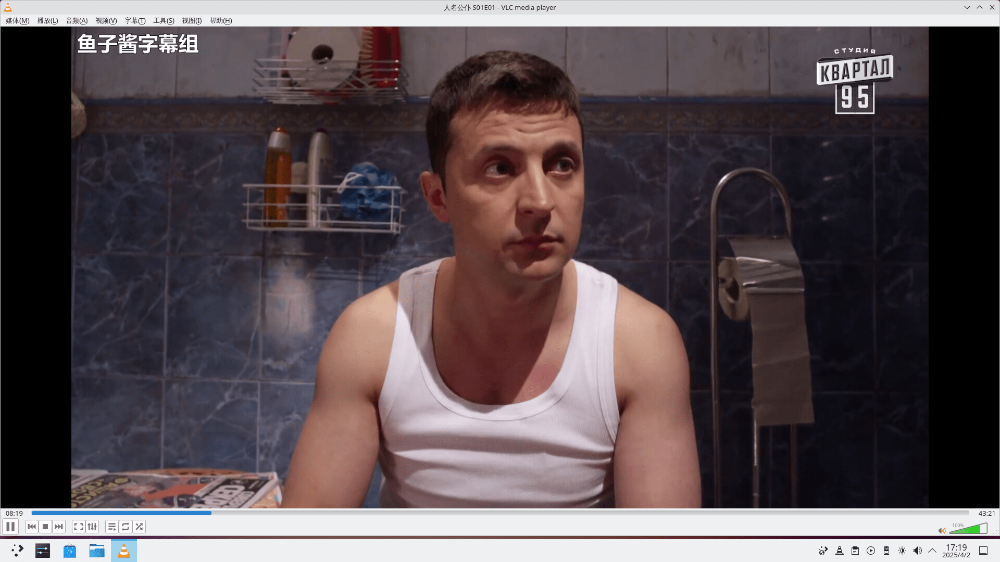
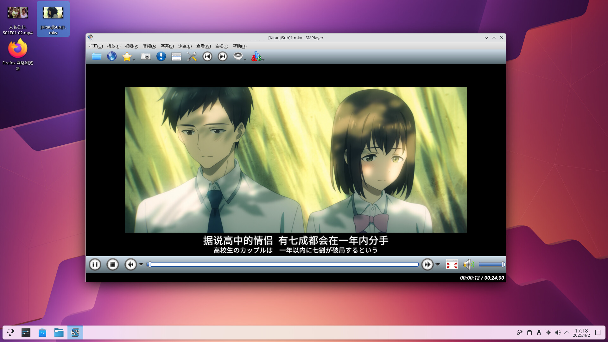
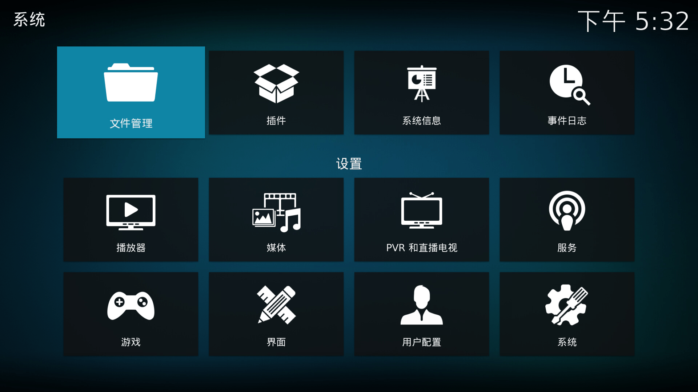

# 11.6 视频播放器

FreeBSD 上主要的视频播放器包括 VLC、SMPlayer 和 Kodi，均支持 pkg 安装。本节另附 mpv 在 TTY 下直接播放视频的配置方法。

## VLC

### 安装 VLC

- 使用 pkg（二进制包管理器）安装：

```sh
# pkg install vlc
```

- 或者使用 Ports（源代码包管理器）编译安装：

```sh
# cd /usr/ports/multimedia/vlc/
# make install clean
```

### 使用 VLC 播放视频

经测试，常用视频格式均能在 VLC 中正常播放。




## SMPlayer

SMPlayer 是 MPlayer（一款命令行视频播放器）和 mpv 的 Qt 图形前端。

### 安装 SMPlayer

- 使用 pkg 二进制包管理器安装：

```sh
# pkg install smplayer
```

- 或者使用 Ports 源代码编译安装：

```sh
# cd /usr/ports/multimedia/smplayer/
# make install clean
```

### 使用 SMPlayer 播放视频

经测试，常用视频格式均能在 SMPlayer 中正常播放。





## Kodi

Kodi 是一款开源媒体中心软件，其曾用名为 XBMC（Xbox Media Center）。

### 安装 Kodi

- 使用 pkg 二进制包管理器安装：

```sh
# pkg install kodi
```

- 或者使用 Ports 源代码编译安装：

```sh
# cd /usr/ports/multimedia/kodi/
# make install clean
```

### 为 Kodi 设置中文环境

首先打开 Kodi 主界面中的 `interface`（界面）设置选项：


点击 `Skin`（皮肤）选项，随后点击界面左下角的设置级别按钮，将当前的 `Basic`（简单）级别改为 `Expert`（专家）或 `Standard`（标准）级别，否则无法看到 `Fonts`（字体）等高级设置选项。随后将 `Fonts`（字体）设置为 `Arial based`，否则中文可能显示为乱码。


返回上一级菜单后，依次选择 `Regional`（区域）→ `Language`（语言）→ `Chinese (Simplified)`（简体中文）选项以完成语言切换。


中文界面设置完成后的效果如下：



### 使用 Kodi 播放视频

经测试，常用视频格式均能在 Kodi 媒体中心中正常播放。


## 附录：直接在 TTY 播放视频（mpv）

可直接在 Linux/FreeBSD 的 TTY（电传打字机，Teletypewriter，即纯文本终端）环境中使用 mpv 命令播放视频文件。

- 使用 pkg（二进制包管理器）安装：

```sh
# pkg install mpv
```

- 还可通过 Ports 源代码编译安装：

```sh
# cd /usr/ports/multimedia/mpv/
# make install clean
```

切换到 TTY 终端环境后，使用 mpv 播放器播放视频文件 `1.mp4`：

```sh
$ mpv 1.mp4
```

> **注意**
>
> 此功能依赖 DRM（Direct Rendering Manager，直接渲染管理器）图形子系统，在虚拟机环境中可能无法正常运作。
