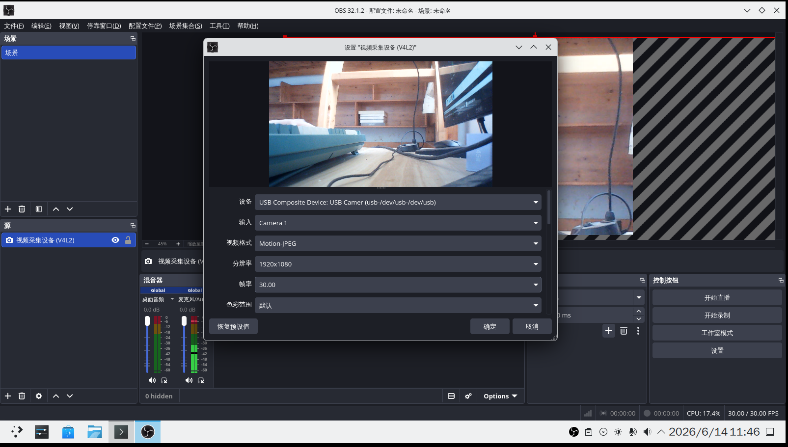
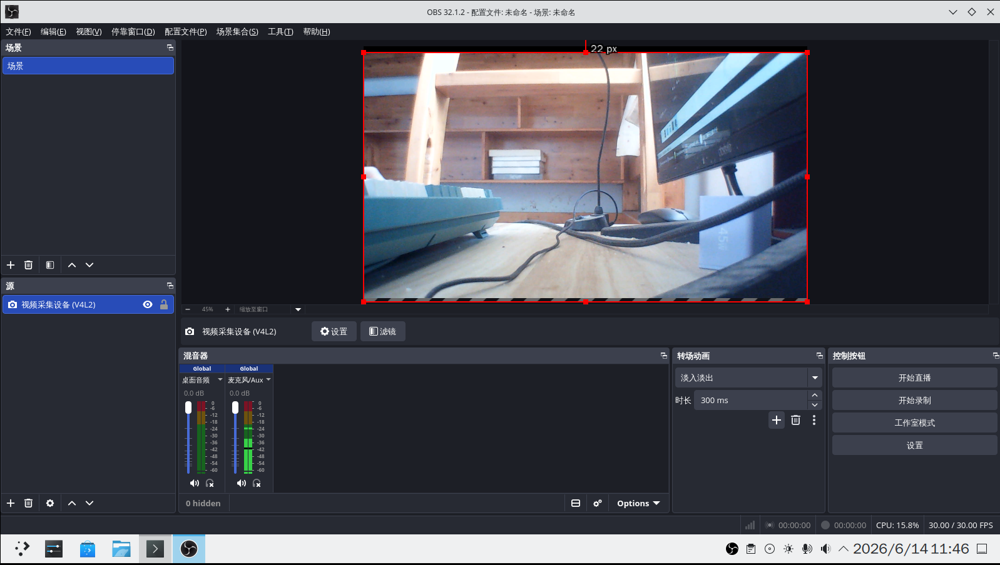
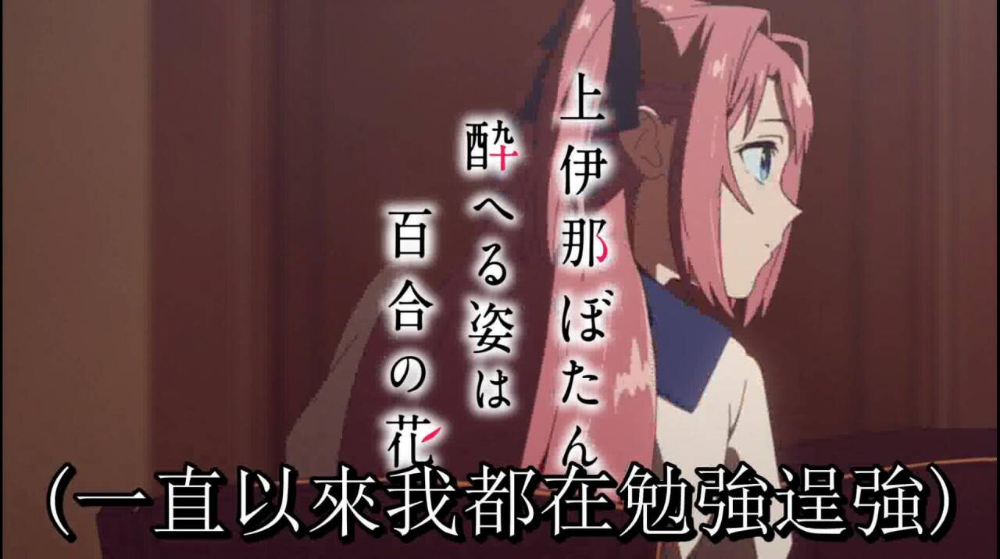

# 11.7 多媒体处理

FreeBSD 支持 Audacity（音频剪辑）、Kdenlive/FFmpeg（视频与字幕处理）、Inkscape（矢量图形处理）、MuseScore（制谱）、Blender（3D 建模）及 Krita（数字绘画）等工具。本节按类别给出安装与基本使用方法。

## 视频串流与直播录制

### OBS Studio

OBS Studio 是一款自由且开源的视频串流与直播录制软件。

使用 pkg 安装：

```sh
# pkg install obs-studio
```

或者使用 Ports 编译安装：

```sh
# cd /usr/ports/multimedia/obs-studio/
# make install clean
```

调整 OBS Studio 视频输入源：



麦克风可自适应，调整后的主界面：



## 音频剪辑

### Audacity

Audacity 是一款开源跨平台音频编辑软件。

使用 pkg 安装：

```sh
# pkg install audacity
```

或者使用 Ports 编译安装：

```sh
# cd /usr/ports/audio/audacity/
# make install clean
```


## 视频剪辑

### Kdenlive

Kdenlive 是一款开源的非线性视频编辑软件。

使用 pkg 安装 Kdenlive：

```sh
# pkg install kdenlive
```

或者使用 Ports 编译安装：

```sh
# cd /usr/ports/multimedia/kdenlive/
# make install clean
```

## 字幕

### FFmpeg

FFmpeg 是一款开源多媒体处理框架，可用于将字幕烧录到视频中。

使用 pkg 安装 FFmpeg：

```sh
# pkg install ffmpeg
```

或者使用 Ports 编译安装：

```sh
# cd /usr/ports/multimedia/ffmpeg/
# make install clean
```

使用 FFmpeg 将 ASS（Advanced SubStation Alpha）格式字幕烧录到视频中的示例命令：

```sh
$ ffmpeg -i 视频文件.mp4 -vf subtitles=对应字幕.ass 输出视频.mp4
```

其中：

- `-i` 指定输入视频文件；
- `-vf subtitles=` 应用字幕滤镜并指定字幕文件路径；
- `输出视频.mp4` 指定了输出视频文件的名称。



## 抠图

Inkscape 是矢量制图程序，本节介绍基本抠图操作。

### 安装 Inkscape

- 使用 pkg 安装 Inkscape：

```sh
# pkg install inkscape
```

- 或者使用 Ports 源代码编译安装：

```sh
# cd /usr/ports/graphics/inkscape/
# make install clean
```

### Inkscape 基本抠图方法

1. 使用快捷键 `Ctrl` + `O`（字母 `o`）打开待处理的图片文件；
2. 使用快捷键 `Shift` + `F6` 切换到贝塞尔曲线和直线绘制模式；
3. 用贝塞尔曲线沿目标区域边缘绘制封闭路径（回到起始点闭合路径）；
4. 按住 `Shift` 键，依次点击选中图片和封闭路径（路径需位于图片上方）；
5. 在菜单栏中选择 **对象** → **裁剪** → **设置裁剪** 选项，以实现抠图效果。

### 参考文献

- Inkscape. Inkscape Tutorials[EB/OL]. [2026-03-25]. <https://inkscape.org/zh-hans/learn/tutorials/>. 提供 Inkscape 矢量绘图软件的详细中文教程，涵盖基础操作与高级功能。

## 音乐

### 制谱软件 MuseScore

MuseScore 是一款开源的音乐制谱软件，支持乐谱创作、编辑和播放。

使用 pkg 安装：

```sh
# pkg install musescore
```

或者使用 Ports 安装：

```sh
# cd /usr/ports/audio/musescore/
# make install clean
```


## 三维图像

### 3D 建模 Blender

Blender 是一款开源的 3D 建模和动画制作软件，支持建模、渲染、动画等功能。

使用 pkg 安装：

```sh
# pkg install blender
```

或者使用 Ports 安装：

```sh
# cd /usr/ports/graphics/blender/
# make install clean
```

软件支持简体中文。通过菜单 **Edit** → **Preferences** → **Interface** → **Translation**，在 **Language** 下拉菜单中选择 **Simplified Chinese (简体中文)** 即可切换界面语言。


## 绘画

### Krita

Krita 是一款开源的数字绘画软件，专为插画师和概念艺术家设计。

使用 pkg 安装：

```sh
# pkg install krita
```

或者使用 Ports 安装：

```sh
# cd /usr/ports/graphics/krita/
# make install clean
```


