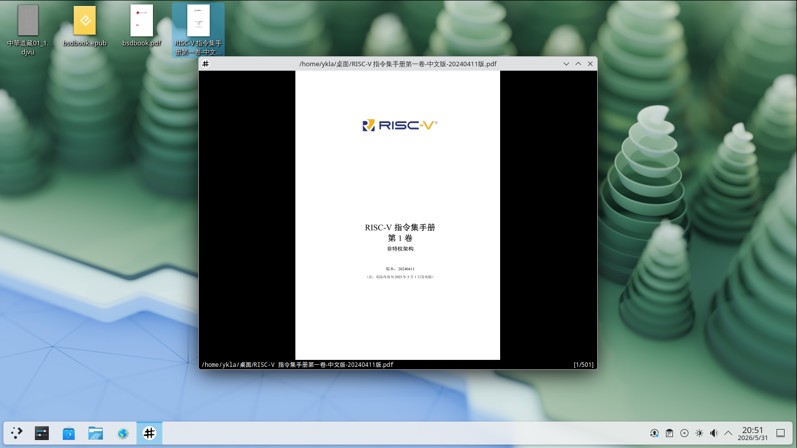

# 11.7 文档查看器

自 UNIX 问世以来，许多新的文档格式逐渐流行，如 PDF、DjVu、MOBI、AZW3、EPUB 等，而这些格式所需的查看器在基本系统中或许并不存在。本节介绍如何安装文档查看器。

## Calibre 文档管理（PDF、EPUB、MOBI、AZW3 等格式）

Calibre 是电子书管理工具，支持多种电子书格式的阅读、转换和组织，还支持自定义 CSS 样式。

使用 pkg 安装 Calibre：

```sh
# pkg install calibre
```

使用 Ports 安装：

```sh
# cd /usr/ports/deskutils/calibre/
# make install clean
```

Calibre 的主界面如下。


## Okular

Okular 是一款通用文档查看器，属于 KDE Plasma 项目的一部分，会随 KDE 桌面环境一道安装。Okular 结合了出色的功能，支持多种文档格式，如 PDF、Postscript、DjVu、CHM、XPS、ePub 等。

使用 pkg 安装 Okular：

```sh
# pkg install okular
```

使用 Ports 安装：

```sh
# cd /usr/ports/graphics/okular/
# make install clean
```


## Evince

Evince 是一款支持 PDF 文档格式的文档查看器，属于 GNOME 项目的一部分，会随 GNOME 桌面环境一道安装。

使用 pkg 安装 Evince：

```sh
# pkg install evince
```

使用 Ports 安装：

```sh
# cd /usr/ports/graphics/evince/
# make install clean
```


## ePDFView

ePDFView 是一款轻量级的 PDF 文档查看器，仅使用 Gtk+ 和 Poppler 库。ePDFView 的目标是提供简单的 PDF 文档查看器，类似于 Evince，但不使用 GNOME 库。操作较为简洁，仍有较大改进空间。

使用 pkg 安装 ePDFView：

```sh
# pkg install epdfview
```

使用 Ports 安装：

```sh
# cd /usr/ports/graphics/epdfview/
# make install clean
```


## Xpdf

对于喜欢小巧 FreeBSD PDF 查看器的用户，Xpdf 提供了一款 PDF 查看器。当前 `graphics/xpdf` 已是 `graphics/xpdf4` 的 slave port，默认依赖 Qt5 工具包，不再是传统的纯 X11 轻量版本。

使用 pkg 安装 Xpdf：

```sh
# pkg install xpdf
```

使用 Ports 安装：

```sh
# cd /usr/ports/graphics/xpdf/
# make install clean
```


## Zathura

Zathura 是一款高度可定制且功能强大的文档查看器。它提供简约、节省空间的界面，主要专注于键盘交互，使用体验方面仍有较大改进空间。

### PDF 支持（MuPDF 后端）

**zathura-pdf-mupdf** 使用 MuPDF 库作为后端，更加轻量化。

使用 pkg 安装支持 PDF 的 Zathura：

```sh
# pkg install zathura-pdf-mupdf
```

使用 Ports 安装：

```sh
# cd /usr/ports/graphics/zathura-pdf-mupdf/ 
# make install clean
```


### PDF 支持（Poppler 后端）

此外，还可以安装使用了 Poppler 库的 **graphics/zathura-pdf-poppler** 作为 PDF 支持的替代选择：

使用 pkg 安装支持 PDF 的 Zathura：

```sh
# pkg install zathura-pdf-poppler
```

使用 Ports 安装：

```sh
# cd /usr/ports/graphics/zathura-pdf-poppler/ 
# make install clean
```



### DjVu 支持

使用 pkg 安装支持 DjVu 的 Zathura：

```sh
# pkg install zathura-djvu
```

使用 Ports 安装：

```sh
# cd /usr/ports/graphics/zathura-djvu/
# make install clean
```


