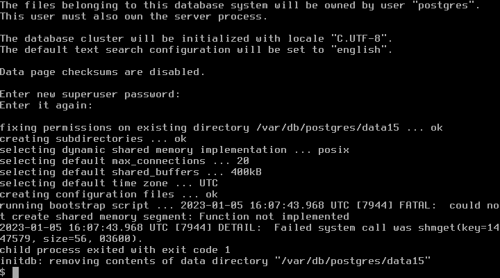

# 11.3 使用 Qjail 管理 Jail

Qjail 是用于部署 Jail 环境的工具，源自 ezjail 3.1。

常见的 Jail 管理工具包括 ezjail、Qjail 和 iocage。

ezjail 在 2015 年更新至 3.4.2 后未再进行关键更新，其 ports 更新依赖 portsnap，现已废弃。

iocage 依赖 ZFS 文件系统，因此使用 UFS 文件系统的用户无法使用。

Qjail 不存在这些方面的限制。

ezjail 不支持 Jail 的 vnet 功能，而 iocage 和 Qjail 支持该功能。

ezjail 和 Qjail 使用 sh 编写，iocage 使用 Python 编写。

下文中部署的 Jail 在概念上结构如下图：


## 预留 jail 的 ip

在 `/etc/rc.conf` 文件中添加如下配置

```ini
cloned_interfaces="lo1"  # 克隆出 lo1，尽量和宿主机网络配置分开。①
ifconfig_lo1_alias0="inet 192.168.1.0-9" # 此处示例选择 `192.168.1.0/24` 网段，旨在为 jail 创建一个与宿主机实际网络分离的独立网段，请根据您的实际网络环境调整 IP 地址范围
```

>**注意**
>
>① 如果要生成多个接口，也应在同一行中以空格分隔描述，而不是另外创建多行，例如 cloned_interfaces="lo1 lo2" 。分行书写时，只有第一行会生效。

运行以下命令重启所有网络接口：

```sh
# service netif restart
```

lo1 将获得 10 个 IP 地址，其中 1-9 号 IP 将用于分配给各个 jail。

## 安装 Qjail 工具

- 使用 pkg 安装：

```sh
# pkg install qjail
```

- 或者使用 Ports 安装：

```sh
# cd /usr/ports/sysutils/qjail/ 
# make install clean
```

设置系统服务开机启动 qjail：

```sh
# sysrc qjail_enable=YES
```

## 部署 Qjail 使用的目录结构

在使用 Qjail 之前，首先需要部署 Qjail 所使用的目录结构，可通过以下两种方式完成：

### 附录：从官方镜像站自动下载

```sh
# qjail install
```

此时 Qjail 会从 FreeBSD 官网下载 base.txz 文件，示例输出如下：

```sh
# qjail install
resolving server address: ftp.freebsd.org:80
requesting http://ftp.freebsd.org/pub/FreeBSD/releases/amd64/amd64/15.0-RELEASE/base.txz
remote size / mtime: 195363380 / 1652346155
...
```

### 附录：从境内镜像站下载

由于境内网络访问限制，也可以使用镜像站手动下载，以中国科学技术大学镜像为例（注意下载文件版本号，Qjail 要求文件版本与宿主机一致，此处示例为 FreeBSD amd64 15.0）。

```sh
# 从镜像服务器下载 FreeBSD 基础系统文件
# fetch https://mirrors.ustc.edu.cn/freebsd/release/amd64/15.0-RELEASE/base.txz

# 使用 qjail 安装基础系统到指定 jail
# qjail install base.txz
```

部署好 Qjail 的目录结构后 `/usr/jails` 目录下会自动生成 `sharedfs` `template` `archive` `flavors` 四个目录：

- **sharedfs** 包含一份只读的操作系统可执行文件库，通过 nullfs 挂载，在各个 jail 之间共享，以节省存储空间
- **template** 包含操作系统的配置文件，将被复制到每个 jail 的基本文件系统中
- **archive** 保存 jail archive 命令产生的存档文件
- **flavors** 包含系统风格（flavors）和用户创建的自定义风格，其实就是自己定义的配置文件等

## 部署 jail

```sh
# qjail create -n lo1 -4 192.168.1.1 jail1
```

- `-n` 指定使用 lo1 作为网络接口
- `-4` 指定 ipv4 地址

生成 jail1 后，`/usr/jails/` 目录下会创建 `jail1` 目录（`/usr/jails/jail1/`）用于保存对应文件。


可以在前述的 `flavors` 目录中创建自定义配置文件，以便在部署新的 jail 时自动复制。例如，新建 `/usr/jails/flavors/default/usr/local/etc/pkg/repos/FreeBSD.conf`，则之后创建的 jail 会自动复制该文件，即

```sh
# qjail create -n lo1 -4 192.168.1.2 jail2
```

建立 jail2 后，自动建立 `/usr/jails/jail2/usr/local/etc/pkg/repos/FreeBSD.conf`，即修改了之后所有 jail 的默认 pkg 镜像。但对应 jail1 并没有生成这个文件，因为生成 jail1 时，还没有在 flavors 目录中写入相应文件。

## Qjail 基本用法

- 列出 Qjail 管理的 jail

```sh
# qjail list
```

- 启用 jail

```sh
# qjail start # 启动所有 jail
# qjail start jail1 # 启动 jail1
```

- 停止 jail

```sh
# qjail stop # 停止所有 jail
# qjail stop jail1 # 停止 jail1
```

- 重启 jail

```sh
# qjail restart # 重启所有 jail
# qjail restart jail1 # 重启 jail1
```

- 进入 jail 控制台

```sh
# qjail console jail1  # 进入 jail1 控制台
```

进入 jail 控制台后，将以 jail 中的 root 账户身份操作（无需输入密码）。由于 jail 可能开启对外服务，为安全起见，建议设置 root 账户密码。

- 备份 jail

```sh
# qjail archive -A  # 备份所有 jail
# qjail archive jail1  # 备份 jail1
```

- 从备份中恢复 jail

```sh
# qjail restore jail1  # 从备份中恢复 jail1
```

- 删除 jail

```sh
# qjail delete jail1  # 删除 jail1
# qjail delete -A     # 删除所有 jail
```

## 更新 jail

下面更新 jail 的部分不针对单个 jail，而是针对每个 jail，因为这些文件利用 nullfs 共享一份。

### 更新 jail 中的基本系统

即上面提到的 sharedfs 中的文件

```sh
# qjail update -b
```

### 更新 ports

这里有 `-p`（小写）、`-P`（大写）两个选项，`-p`（小写）使用 portsnap 更新 jail 的 ports tree。`-P`（大写）使用宿主机的 ports 更新 jail 的 ports。若主机已有 ports，则建议使用 `-P`（大写），避免重复下载 ports。

```sh
# qjail update -P  # 这里注意要大写
```

### 更新系统源代码

```sh
# qjail update -S # 大写
```

### 更新过程

请先自行安装配置 `gitup`。

开始更新：

```sh
# 获取并安装 FreeBSD 系统更新
# freebsd-update fetch install

# 更新源代码树
# gitup src

# 更新 Ports 树
# gitup ports

# 停止所有 qjail jail
# qjail stop

# 更新 qjail 基础系统
# qjail update -b

# 更新 qjail 源代码
# qjail update -S

# 更新 qjail Ports
# qjail update -P

# 启动所有 qjail jail
# qjail start
```

## jail 设置

Qjail 可以用 `qjail config` 命令对每个 jail 另作设置，运行 `qjail config` 前须选停用指定的 jail。

`qjail config` 命令选项较多，这里列出几个常用的，更多的请参考手册页

[qjail --	Utility	for deployment of jail environments](https://www.freebsd.org/cgi/man.cgi?query=qjail&manpath=FreeBSD+15.0-RELEASE+and+Ports)

### `-h`

```sh
# qjail config -h jail1
```

快速开启 jail1 的 ssh 服务，新建一个 wheel 组用户，用户名和密码同 jail 名，首次用这个用户登录要求修改密码。也可以在登录 jail 控制台后，自行配置 sshd 服务。

### `-m` `-M`

```sh
# qjail config -m jail1
```

设置 jail1 需手动启动（manual 状态），`qjail_enable="YES"` 写入 `/etc/rc.conf` 后在系统启动时会自动启动各个 jail，设为手动启动后则不会在系统启动时自动启动相应的 jail，须用 `qjail start jailname` 启动。

对应小写的 `-m` 选项，有大写的 `-M` 选项，作用为关闭手动启动状态，即清除 manual 状态，可以在系统启动时自动启用 jail。Qjail 中有大量类似的选项，小写字母的选项启用某个功能，大写字母的选项关闭对应功能。如果下文中同时出现小写和大写的选项就不再过多作出说明。

### `-r` `-R`

```sh
# qjail config -r jail1
```

将 jail1 设为不允许启动（norun 状态），相当于禁用该 jail。

### `-y` `-Y`

```sh
# qjail config -y jail1
```

启用该 jail 的 SysV IPC，在 jail 中安装 PostgreSQL 时，需要打开这个选项，PostgreSQL 运行基于这个功能。

## 网络设定

>**注意**
>
>有的教程里会教你用 `qjail config -k jailname` 打开 raw_sockets 功能来打开外网访问的能力，其实这是个误区。raw_sockets 只是像 ping 一类的工具需要使用而已，并不是说网络访问一定要打开 raw_sockets。而且在 jail 中打开 raw_sockets 本身有安全风险，这是 jail 环境默认的一种安全设计。所以除非你一定要在 jail 中用 ping 之类的工具，否则无论是用什么方式构建的 jail 都不建议打开 raw_sockets 功能。

此时的 jail 还不能连接网络，因为 jail 绑定在 lo1 网络接口上，lo1 并不能直接访问外网，接下来通过 pf 设定网络，其中 `em0` 为外网接口

- 在 `/etc/pf.conf` 中写入

```ini
nat pass on em0 inet from lo1 to any -> em0  # 使 jail 可以访问网络，从 lo1 接口发出的连接通过 nat 转发到 em0
rdr pass on em0 inet proto tcp from any to em0 port 22 -> 192.168.1.1 port 22  # 使宿主机外可以访问指定 jail，端口重定向，将连接到 em0 上 22 端口上的 tcp 连接重定向到 192.168.1.1 地址（即 jail1）的 22 端口上
```

- 启动防火墙

```sh
# 启用防火墙服务 pf 开机自启动
# service pf enable

# 启动防火墙服务 pf
# service pf start
```

此时，绑定在 lo1 上的 jail 可以访问宿主机外网络，宿主机外网络可以通过宿主机 22 号端口连接 jail1 的 22 号端口。

## 示例：部署 PostgreSQL jail

假设已经如上文所述预留 jail ip，并成功运行 `qjail install` 命令。

这里以 PostgreSQL 15 为例，其它版本也适用。

### 宿主机中操作

在 jail 中创建并启用 PostgreSQL：

```sh
# 创建名为 postgres 的 jail，绑定到 lo1 接口，IPv4 地址为 192.168.1.3
# qjail create -n lo1 -4 192.168.1.3 postgres

# 配置 postgres jail，启用 SysV IPC
# qjail config -y postgres

# 启动 postgres jail
# qjail start postgres
```

编辑 `/etc/pf.conf` 文件：

```ini
nat pass on em0 inet from lo1 to any ->em0  # 上文已作说明
rdr pass on em0 inet proto tcp from any to em0 port 5432 -> 192.168.1.3 port 5432 # 不建议写下此句，作用为使宿主机外可以访问 jail 中的 postgresql，此处应考虑安全和实际需要开启端口转发，不建议直接向外提供 postgresql 连接
```

启动防火墙服务 pf：

```sh
# service pf start
```

进入名为 postgres 的 jail 的控制台：

```sh
# qjail console postgres
```

### jail 控制台中的操作

下面命令皆在 jail 控制台下运行，pkg 安装与否使用镜像请自行决定，若使用镜像可以在 jail 控制台中如同宿主机般进行设置，请参考相关文章。

- 使用 pkg 安装：

```sh
# pkg install postgresql15-server
```

- 或者使用 Ports 安装

```sh
# cd /usr/ports/databases/postgresql15-server/ 
# make install clean
```

---

配置 PostgreSQL：

```sh
# service postgresql enable # 设置 PostgreSQL 服务开机自启动
# mkdir -p -m 0700 /var/db/postgres/data15  # 注意版本号
# chown postgres:postgres /var/db/postgres/data15  # 这个目录应属于 postgres 用户
# su postgres   # 这里切换到 postgres 用户，注意下面提示符的变化
$ initdb -A scram-sha-256 -E UTF8 -W -D /var/db/postgres/data15
$ exit   #  回到 jail root 用户，注意提示符变化
# service postgresql start # 立刻启动 PostgreSQL 服务
```

此处使用 `initdb` 而非安装时提示的 `/usr/local/etc/rc.d/postgresql initdb`，目的是避免在设置数据库密码时反复修改 `pg_hba.conf` 文件。下面对各选项进行简要说明：


- **`-A`** 为本地用户指定在 `pg_hba.conf` 中使用的默认认证方法

- **`-E`** 选择模板数据库的编码。

- **`-W`** 让 initdb 提示要求为数据库超级用户给予一个口令

- **`-D`** 指定数据库集簇应该存放的目录

至此 PostgreSQL 服务已经可以运行。

如果在上述过程中未使用 `qjail config -y postgres` 命令开启 SysV IPC，可能会出现如下错误：

初始化数据库集簇时的错误



启动 PostgreSQL 时的错误


---

此时在宿主机控制台下执行 `qjail config -y postgres` 即可修正错误，具体如下：

```sh
# 停止 postgres jail
# qjail stop postgres

# 配置 postgres jail，启用 SysV IPC
# qjail config -y postgres

# 启动 postgres jail
# qjail start postgres
```

再次进入 jail 的控制台就可以正常初始化数据库集簇和运行 PostgreSQL 服务了。
