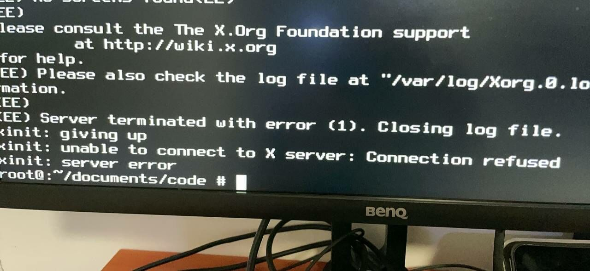
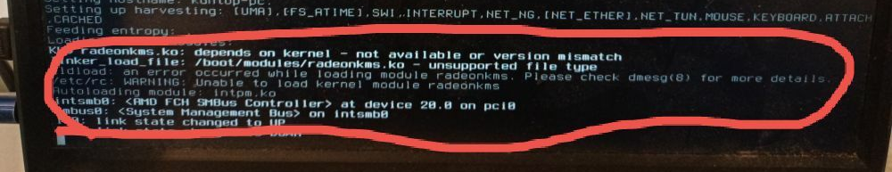

# 11.1 Intel 和 AMD 显卡驱动配置

> **警告**
>
> 请勿使用 `sysutils/desktop-installer`，该工具在当前环境下可能引发错误和配置冲突。

## 引言

图形驱动作为连接操作系统内核与图形硬件的关键抽象层，其正确配置对于桌面环境的运行与性能很重要。

本节阐述 FreeBSD 操作系统中 Intel 和 AMD 图形处理器驱动程序的安装与配置方法。

## 未安装显卡驱动的设备图片示例



上图展示了未安装显卡驱动时可能出现的报错界面。

## 显卡支持情况

FreeBSD 的 i915 和 AMD 显卡驱动与基本系统分离，以移植的长期支持（Long Term Support，LTS）版本 Linux 内核 DRM（Direct Rendering Manager，直接渲染管理器）驱动形式作为 Port 提供。不同系统版本对应的 Linux 内核版本也不相同。

DRM 是 Linux 内核的子系统，负责与现代显卡的 GPU 进行交互。FreeBSD 在内核中实现了 Linux 内核编程接口（LinuxKPI，Linux Kernel Programming Interface），并移植了 Linux DRM，类似地，还有一些无线网卡驱动也采用了这种移植方式。

> **技巧**
>
> 这种移植并不覆盖 Linux 现有的全部 DRM GPU 驱动，目前仅包括 i915、amdgpu 和 radeon，其他如 vmwgfx、xe、virtio 等均未进行移植。因此在一般情况下，也无法在 Wayland 上运行上述未移植的 GPU，它们目前只能使用 X11 显示协议。

> **注意**
>
> DG2 Arc 显卡尚不受支持（截至 DRM 6.1 版本），相关技术细节可参见：Intel Arc A770: Kernel panic on kldload i915kms.ko #315[EB/OL]. [2026-03-26]. <https://github.com/freebsd/drm-kmod/issues/315>。可能需要等到 6.12 的移植才能提供支持。

| FreeBSD 版本 | 对应 DRM 驱动版本 | GPU 支持范围（AMD / Intel） | 备注 |
| ------------ | ----------------- | --------------------------- | ---- |
| **FreeBSD 14.3-RELEASE** | **drm-61-kmod（基于 Linux 6.1 DRM）** | - **AMD：** <br>**GCN 1（Southern Islands）** <br>**GCN 2（Sea Islands）** <br>**GCN 3（Volcanic Islands）** <br>**GCN 4（Polaris）** <br>**GCN 5（Vega）** <br> **RDNA 1 / RDNA 2 / RDNA 3（Radeon RX 7000 系列）**<br>- **Intel：** <br>**Gen 4（GMA X3000 / 965）**<br>**Gen 5（Ironlake）**<br>**Gen 6（Sandy Bridge）**<br>**Gen 7（Ivy / Haswell）**<br>**Gen 8（Broadwell）**<br>**Gen 9（Skylake / Kaby Lake / Coffee Lake）**<br>**Gen 10（Cannon Lake – 已废弃）**<br>**Gen 11（Ice Lake / Jasper Lake）**<br>**Gen 12（Tiger Lake / Alder Lake）** | 理论支持 Intel Gen 4 ～ Gen 12 核芯显卡 |
| **FreeBSD 15.0/16.0-CURRENT** | **drm-66-kmod（基于 Linux 6.6 DRM）** | - **AMD：** 自 **GCN 1** 起至 **RDNA 3（Radeon RX 7000 系列）**，并包含 **Instinct MI300 加速卡** 支持。<br>- **Intel：** <br> **Gen 4–8：** 旧核芯显卡（GMA、HD Graphics 4000 等）<br> **Gen 9：** Skylake / Kaby Lake / Coffee Lake<br> **Gen 10：** Cannon Lake（已废弃）<br> **Gen 11：** Ice Lake / Jasper Lake<br> **Gen 12：** Tiger Lake / Alder Lake <br> **Gen 12.7：** Raptor Lake（基本兼容 Alder Lake 驱动）<br> **Xe-LPG：** Meteor Lake（实验性，已合入 drm-66） | 实测 **Intel Alder Lake-N (N100)、i7-1260P** 显卡驱动加载正常，显示与视频加速功能稳定；<br><br>理论支持 Intel Gen 4 ～ Xe-LPG 核芯显卡（含 Meteor Lake），但 Raptor Lake 及以后缺乏充分实测 |

- 非 LTS 版本（Port graphics/drm-latest-kmod，仅 15.0/16.0，目前为 6.9）：
  - Intel：Meteor Lake 图形在 6.7 后默认启用；
  - AMD：覆盖 GCN 到 RDNA 3 全部架构。RDNA 4 驱动需等待更新的 Linux 内核版本移植。

> **技巧**
>
> 可在 port 开发者手册的最后一章中查询 OSVERSION 对应的版本和 Git 提交。
>
> 查看本机 `OSVERSION`，显示系统版本构建标识符：
>
> ```sh
> # uname -U
> 1500019
> ```

> **警告**
>
> 每次点版本或大版本升级时，可能需要重新获取系统源代码并重新编译安装显卡驱动模块，方可顺利完成升级，而非卡在黑屏界面；或者使用“模块源”。

## 加入 video 组

video 组是负责访问 DRM 和 DRI 视频设备的用户组。只有加入该组的用户才能正常使用显卡的硬件加速功能以及 Wayland 会话功能。

需将指定用户添加到 video 用户组：

```sh
# pw groupmod video -m 实际用户名
```

> **警告**
>
> 即使已加入 `wheel` 组，也应再加入 `video` 组，否则硬件解码功能会出现问题，且 Wayland 下普通用户将无权限调用显卡。

## 安装 Intel 核芯显卡/AMD 显卡驱动

> **注意**
>
> 在使用 GNOME 时，如果自动锁屏/熄屏，可能无法再次进入桌面。相关技术问题可参见：Bug 255049 - x11/gdm doesn't show the login screen[EB/OL]. [2026-03-26]. <https://bugs.freebsd.org/bugzilla/show_bug.cgi?id=255049>。

> **注意**
>
> 使用 Ports 安装时，drm 驱动需要在 `/usr/src` 中有一份当前版本的系统源代码，具体可参考系统更新章节。若已参考本书其他章节进行安装，系统中很可能已有一份源代码，无需再次获取。

### FreeBSD 14.x

> **技巧**
>
> 若要使用 pkg 安装，请参照本书其他章节配置的 kernel modules（kmods）内核模块源。

```sh
# cd /usr/ports/graphics/drm-61-kmod
# make BATCH=yes install clean
```

或者使用 pkg 安装（如有问题请使用此方法）：

```sh
# pkg install drm-61-kmod
```

### FreeBSD 15.0

使用 Ports 安装：

```sh
# cd /usr/ports/graphics/drm-66-kmod
# make BATCH=yes install clean
```

> **注意**
>
> 对于英特尔三代处理器的 HD 4000 等较古老的核芯显卡，在传统 BIOS 模式下无需额外安装显卡驱动，但在 UEFI 模式下可能出现花屏现象（FreeBSD 13.0 及以后版本无此问题），此时需要安装此 DRM 显卡驱动。

## 配置 Intel 核芯显卡/AMD 显卡

### Intel 核芯显卡

在 `/etc/rc.conf` 文件中添加 `i915kms` 内核模块到 `kld_list`，以便系统启动时加载：

```sh
# sysrc -f /etc/rc.conf kld_list+=i915kms
```

### AMD

- 对于 HD 7000 以后的 AMD 显卡，在 `/etc/rc.conf` 文件中添加 `amdgpu` 内核模块（多数用户应使用此驱动，若未生效再修改为 `radeonkms`）到 `kld_list`，以便系统启动时加载：

```sh
# sysrc -f /etc/rc.conf kld_list+=amdgpu
```

- 对于 HD 7000 以前的 AMD 显卡，在 `/etc/rc.conf` 文件中添加 `radeonkms` 内核模块（较早期的显卡驱动）到 `kld_list`，以便系统启动时加载：

```sh
# sysrc -f /etc/rc.conf kld_list+=radeonkms
```

## 视频硬解

> **警告**
>
> 如果忽略此部分，Blender 等软件将无法运行，并会直接发生“段错误”。

### 安装 Intel VA-API 媒体驱动

- 使用 pkg 安装：

```sh
# pkg install libva-intel-media-driver
```

- 或使用 Ports 安装：

```sh
# cd /usr/ports/multimedia/libva-intel-media-driver/
# make install clean
```

### 安装 Mesa 的 Gallium VA-API 和 VDPAU 支持包

- 使用 pkg 安装：

```sh
# pkg install mesa-gallium-va mesa-gallium-vdpau
```

- 或使用 Ports 安装：

```sh
# cd /usr/ports/graphics/mesa-gallium-va/ && make install clean
# cd /usr/ports/graphics/mesa-gallium-vdpau/ && make install clean
```

#### 附录：X11 设置

若上述配置未生效，可能还需要配置 X11。

将以下内容写入 `/usr/local/etc/X11/xorg.conf.d/20-amdgpu-tearfree.conf` 文件（请自行创建该文件）：

```ini
Section "Device"
  Identifier "AMDgpu"          # 设置设备标识符为 AMDgpu
  Driver "amdgpu"              # 使用 amdgpu 驱动
  Option "TearFree" "on"       # 启用 TearFree 功能以防止屏幕撕裂
EndSection
```

配置完成后，可使用命令 `mpv --hwdec xxx.mp4` 进行测试。请自行安装 mpv。

## 亮度调节

### 通用

对于一般计算机，需要在 `/boot/loader.conf` 文件中启用 ACPI 视频支持：

```sh
# sysrc -f /boot/loader.conf acpi_video_load="YES"
```

对于 ThinkPad，可以启用 IBM ACPI 支持和 ACPI 视频支持。

- 在 `/boot/loader.conf` 文件中启用 IBM ACPI 支持：

```sh
# sysrc -f /boot/loader.conf acpi_ibm_load="YES"
```

- 在 `/boot/loader.conf` 文件中启用 ACPI 视频支持：

```sh
# sysrc -f /boot/loader.conf acpi_video_load="YES"
```

### 英特尔/AMD

`backlight` 工具自 FreeBSD 13 引入。

```sh
# backlight          # 打印当前亮度
# backlight decr 20  # 降低 20% 亮度
# backlight +        # 默认调整亮度增加 10%
# backlight -        # 默认调整亮度减少 10%
```

若上述操作不起作用，请检查 `/dev/backlight` 路径下有哪些设备。

- 示例（请使用 `ls /dev/backlight` 命令查看实际设备）：

设置 amdgpu_bl00 背光亮度为 10：

```sh
# backlight -f /dev/backlight/amdgpu_bl00 10
```

设置 backlight0 背光亮度为 10：

```sh
# backlight -f /dev/backlight/backlight0 10
```

### 参考文献

- Vadot E. backlight -- configure backlight hardware[EB/OL]. (2022-07-19)[2026-03-25]. <https://man.freebsd.org/cgi/man.cgi?backlight>. 经测试，此部分教程适用于 renoir 显卡。

## 检查状态

判断是否成功驱动显卡：

```sh
$ ls -al /dev/dri/card0
lrwxr-xr-x  1 root wheel 8 Jul  2 19:39 /dev/dri/card0 -> ../drm/0

$ ls -al /dev/backlight/backlight0
crw-rw---- 1 root video 1, 177 2025年 8月22日 /dev/backlight/backlight0  # 台式机 HDMI 等输出可能没有
```

成功驱动后，系统中将出现名为 `card0` 的设备（一般编号为 `0`，若有第二块显卡，则为 `card1`），同时可能还会出现名为 `backlight0` 的设备（HDMI 输出下通常不存在该设备）。

## 故障排除与未竟事宜

> **注意**
>
> 遇到任何问题时，请先使用 Ports 重新编译安装，尤其是在版本升级时。

- 若显卡驱动使用有问题，请直接联系维护者：<https://github.com/freebsd/drm-kmod/issues>。
- 若笔记本出现唤醒时屏幕点不亮的问题，可在 `/boot/loader.conf` 文件中添加 `hw.acpi.reset_video="1"` 以在唤醒时重置显示适配器。
- 普通用户若非 `wheel` 组成员，请加入 `video` 组。若普通用户未加入 video 组（仅加入 wheel 组不够），KDE 设置中将始终显示显卡驱动为“llvmpipe”，这会影响 Wayland 下普通用户的显示或硬解调用。

### KLD XXX.ko depends on kernel - not available or version mismatch.

提示内核版本不符，请先升级系统或使用 ports 编译安装。14.3-RELEASE 及以上版本可使用内置的内核模块源（参见其他章节），应不会出现类似问题。



## 参考文献

- FreeBSD Project. Graphics[EB/OL]. [2026-03-25]. <https://wiki.freebsd.org/Graphics>. FreeBSD 官方维基。是图形硬件兼容性详细列表与配置指南。

## 课后习题

1. 尝试自动化 FreeBSD 上的 DRM 移植流程。
2. 尝试从 OpenBSD 重新移植 DRM 实现。
