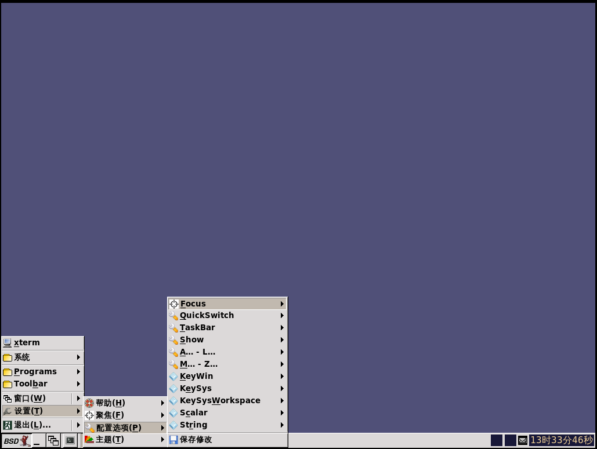
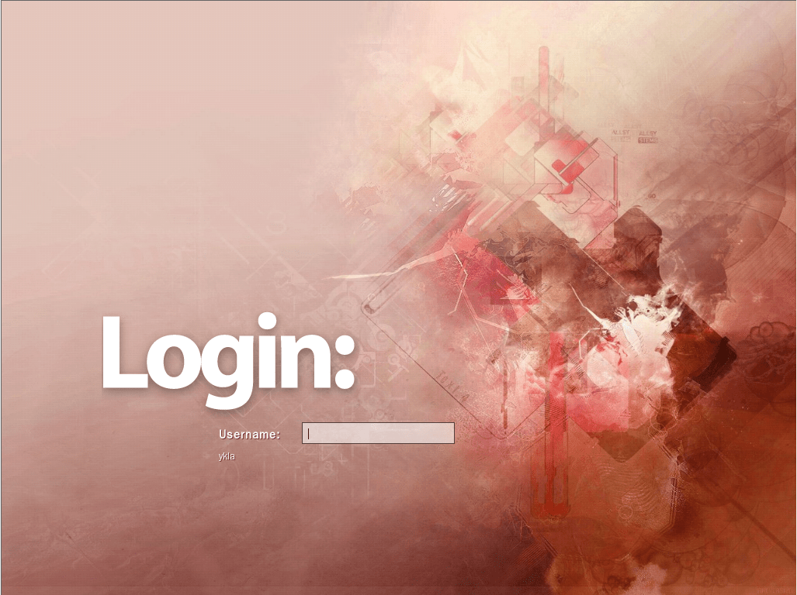

# 11.12 IceWM

## IceWM 窗口管理器概述

IceWM 是基于 X 窗口系统的窗口管理器。其设计目标是实现快速响应、结构简洁，并且不干扰用户操作流程。它内置分页任务栏、全局及窗口级别的快捷键绑定，并提供动态菜单系统。可通过键盘与鼠标组合来管理窗口。用户可以将窗口图标化到任务栏、系统托盘或桌面区域，或者将其隐藏。用户可以通过快速窗口切换（Alt+Tab）或使用窗口列表来管理窗口。多种可配置的窗口焦点模式均可通过菜单进行选择。多显示器环境由 RandR 和 Xinerama 扩展提供支持。IceWM 具有高度可配置性，支持自定义主题，并提供完善的文档。IceWM 提供可选的外部壁纸管理器（支持透明效果）、简易会话管理器和系统托盘。IceWM 可在主流 Linux 发行版以及大多数 *BSD 系统上运行。——引自 [IceWM Window Manager](https://ice-wm.org/)

## 安装 IceWM 窗口管理器

- 使用 pkg 安装：

```sh
# pkg install xorg icewm slim wqy-fonts xdg-user-dirs
```

- 使用 Ports 安装：

```sh
# cd /usr/ports/x11-wm/icewm/ && make install clean
# cd /usr/ports/x11-themes/icewm-extra-themes/ && make install clean
# cd /usr/ports/x11/xorg/ && make install clean
# cd /usr/ports/x11/slim/ && make install clean
# cd /usr/ports/x11-fonts/wqy/ && make install clean
# cd /usr/ports/devel/xdg-user-dirs/ && make install clean
```

### 软件包说明

| 包名 | 作用说明 |
| ---- | -------- |
| `xorg` | X 窗口系统 |
| `icewm` | 轻量级窗口管理器 |
| `slim` | 轻量级图形显示管理器 |
| `wqy-fonts` | 文泉驿中文字体 |
| `xdg-user-dirs` | 管理用户目录，如“桌面”、“下载”等 |

## startx

编辑 `~/.xinitrc` 文件并加入以下内容（应以当前登录用户的身份进行修改）：

```ini
exec icewm-session
```

如此即可在 TTY 中使用 `startx` 命令启动 IceWM 会话。

## 启动项

设置 D-Bus 服务开机自启动（作为依赖自动安装）：

```sh
# service dbus enable
```

设置 SLiM 显示管理器开机自启动：

```sh
# service slim enable
```

## 挂载 proc 文件系统

编辑 **/etc/fstab** 文件，加入下行：

```ini
proc           /proc       procfs  rw  0   0
```

该行将 procfs 文件系统以读写模式挂载到 **/proc**。

## 配置中文环境

编辑 **/etc/login.conf** 文件，找到 `default:\` 部分，将 `:lang=C.UTF-8` 修改为 `:lang=zh_CN.UTF-8`。

还需要根据 `login.conf` 文件重新生成能力数据库，以使配置生效：

```sh
# cap_mkdb /etc/login.conf
```

## 桌面欣赏



安装后的默认界面如上图所示，可以选择更换主题：




## 故障排除与未竟事宜

### 中文环境不完整

该问题已反馈至 [Many UI Strings Are Missing from .po Files](https://github.com/bbidulock/icewm/issues/821)。

## 参考文献

- FreeBSD Project. icewm-preferences(5)[EB/OL]. [2026-03-25]. <https://man.freebsd.org/cgi/man.cgi?query=icewm-preferences>. IceWM 窗口管理器配置选项的官方手册页，详细说明了各项配置参数。

## 课后习题

1. 测试输入法的可用性。
2. 为 IceWM 添加 i18n 支持。
3. IceWM 以极低资源占用实现了完整的窗口管理功能集，但其默认外观与当代桌面审美存在显著差距。分析窗口管理器在功能完备性与视觉默认值之间的资源分配取舍，并讨论是否应该将主题美化纳入上游维护者的责任范围。
