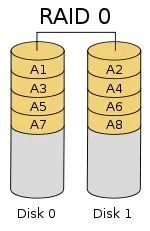
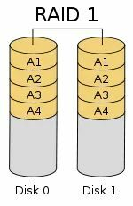

# 第 12.2 节 RAID

## RAID 0

**实现方式：** RAID 0 是最简单的实现方式，就是把多块同样的硬盘串联在一起创建一个大的逻辑硬盘。最大优点就是可以整倍的提高硬盘的容量。如使用了三块 10T 的硬盘组建成 RAID 0 模式，那么磁盘容量就会是 30 TB。

**RAID 0 数据恢复：** 由于不提供数据冗余保护，阵列中某一磁盘发生故障，将导致其中数据丢失，无法恢复。

**应用场景：** RAID 0 一般适用于对性能要求严格但对数据安全性和可靠性不高的应用，如视频、音频存储、临时数据缓存空间等。

**最少硬盘数：** 创建 RAID 0 最少需要 2 块硬盘

**可用容量：** 磁盘空间利用率为 100%

## RAID 1

**实现方式：** RAID 1 使用了两组相同的磁盘系统互做镜像，在主硬盘上存放数据的同时也在镜像硬盘上写一样的数据。当主硬盘损坏时，镜像硬盘则代替主硬盘工作。

**RAID1 数据恢复：** 如任一磁盘发生损坏，可以马上从镜像磁盘进行数据恢复。如：上图 `Disk0` 损坏导致数据丢失，我们可以用新盘替换故障盘，读取`Disk1`的数据，将其复制到新盘上，从而实现了数据的恢复。

**应用场景：** RAID 1 应用于对顺序读写性能要求高以及对数据保护极为重视的应用。如：服务器、数据库存储领域。

**最少硬盘数：** 创建 RAID 1 最少需要 2 块硬盘

**可用容量：** 实际可用的硬盘为总硬盘数量的一半

##  RAID 3

RAID 3：假设你有 N 块硬盘，其中 1 块硬盘作为校验使用，其余的 N-1 块硬盘相当于构成了 RAID 0，当其中一块硬盘损坏时，就可以通过校验硬盘的校验码还原出损坏磁盘的的原始数据。

## 参考资料

- [21.4.RAID3——带有专用奇偶校验的字节级条带](https://handbook.bsdcn.org/di-21-zhang-geom-mo-kuai-hua-ci-pan-zhuan-huan-kuang-jia/21.4.-raid3-dai-you-zhuan-yong-qi-ou-xiao-yan-de-zi-jie-ji-tiao-dai.html)
