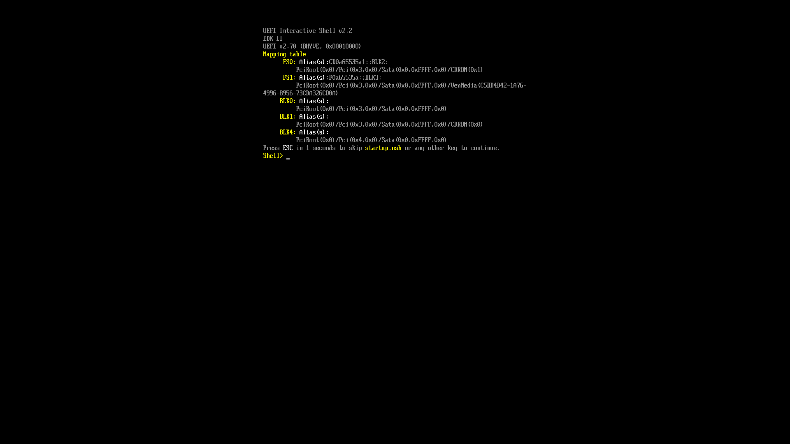
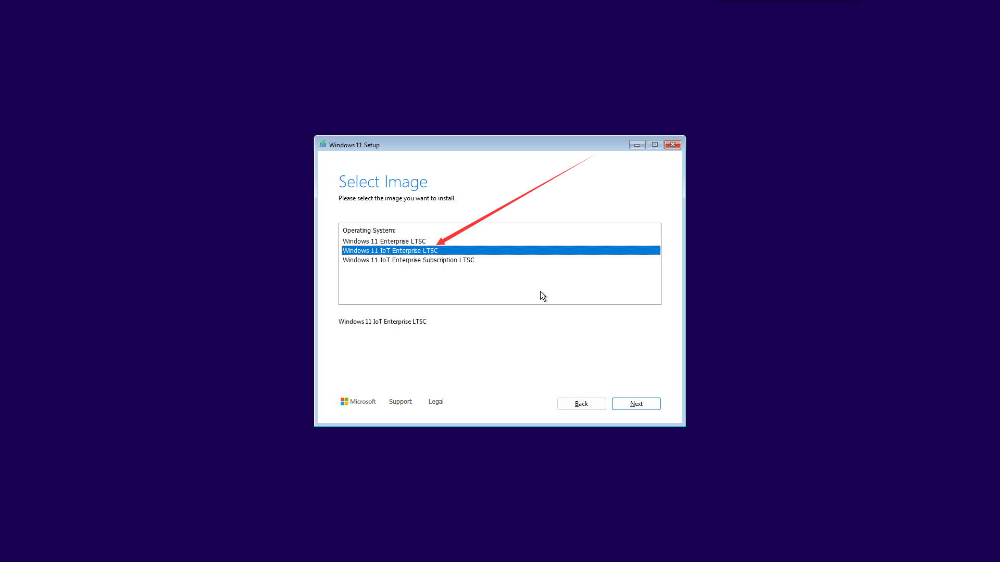
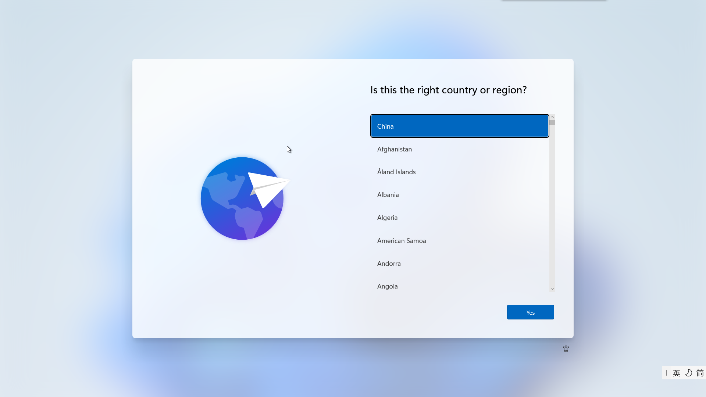
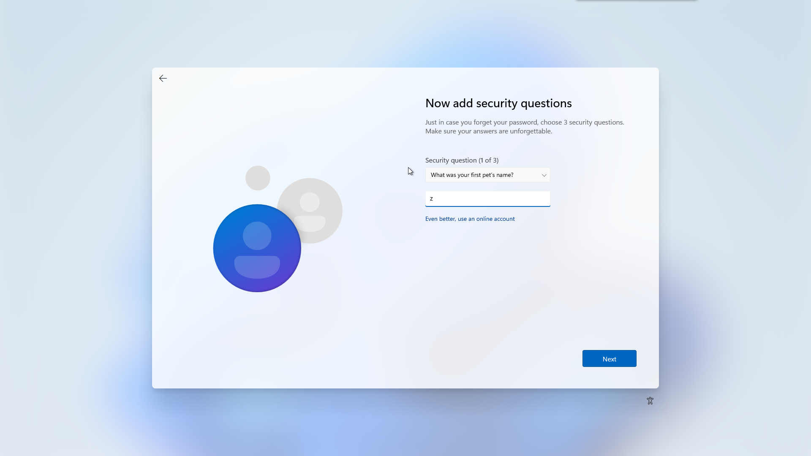
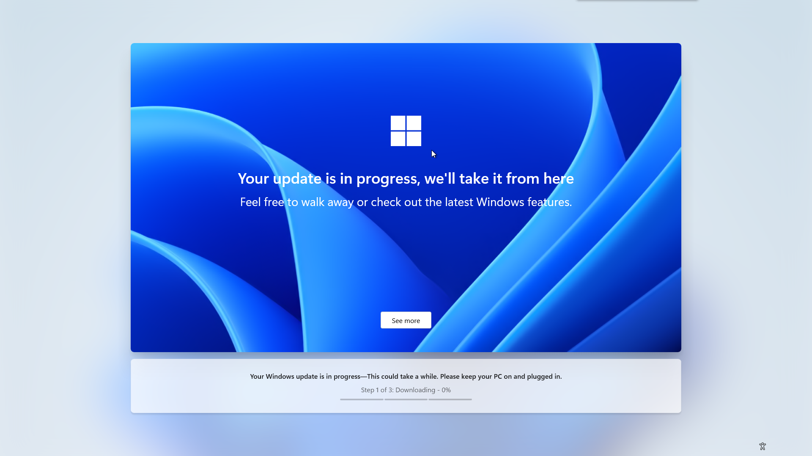
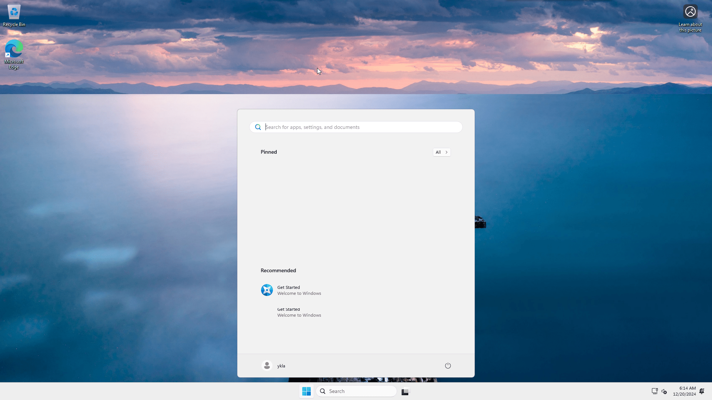
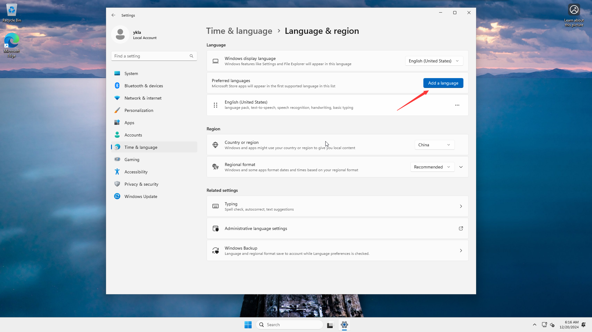
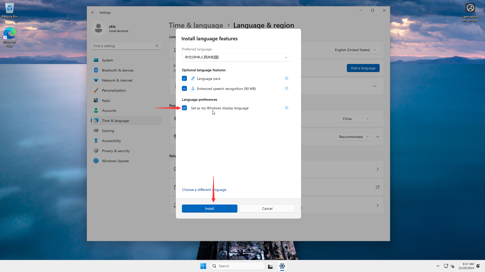

# 12.2 使用 bhyve 及 vm-bhyve 工具安装 Windows 11

作为 bhyve 的命令行前端工具，vm-bhyve 封装了底层 bhyve 命令，降低了手动配置虚拟机的复杂度。

本节基于 FreeBSD 14.2-RELEASE 和 Windows 11 IoT Enterprise LTSC 系统。

本节介绍安装 bhyve 虚拟机管理工具、配置环境以及准备 Windows 11 系统镜像的详细步骤。

## 准备 Windows 镜像

Windows 11 IoT Enterprise LTSC，版本 24H2 (x64) - DVD (英文) 系统下载链接（来自 [itellyou](https://next.itellyou.cn/)）：

IoT 版本将可信平台模块（TPM）列为可选要求，内存大小等安装限制也有所放宽，降低了部署门槛。

SHA256 校验和：`4F59662A96FC1DA48C1B415D6C369D08AF55DDD64E8F1C84E0166D9E50405D7A`

磁力链接：`magnet:?xt=urn:btih:7352bd2db48c3381dffa783763dc75aa4a6f1cff&dn=en-us_windows_11_iot_enterprise_ltsc_2024_x64_dvd_f6b14814.iso&xl=5144817664`

## 加载内核模块

首先需要加载虚拟机管理相关的内核模块。vmm 是 FreeBSD 内核提供的虚拟机监控程序模块，为 bhyve 提供硬件辅助虚拟化支持，该模块只需加载一次，之后 vm-bhyve 会自动管理。

> **技巧**
>
> 只需执行一次，之后 vm-bhyve 会自动加载该模块。

```sh
# kldload vmm	# 加载 FreeBSD 虚拟机管理模块（vmm）
```

查看已加载的 vmm 相关内核模块：

```sh
# kldstat | grep vmm
 7    1 0xffffffff83320000     44b0 vmmemctl.ko
10    1 0xffffffff83400000   33e438 vmm.ko
```

## 安装 vm-bhyve 相关软件

接下来安装统一可扩展固件接口（UEFI）固件、虚拟网络计算（VNC）客户端与 vm-bhyve 管理工具。UEFI 固件为虚拟机提供现代启动支持，VNC 客户端用于访问虚拟机图形界面。

1. **使用 pkg 安装**：

    ```sh
    # pkg install bhyve-firmware vm-bhyve tigervnc-viewer
    ```

2. **或使用 Ports 安装**：

    ```sh
    # 安装 bhyve 固件
    # cd /usr/ports/sysutils/bhyve-firmware && make install clean

    # 安装 vm-bhyve 管理工具
    # cd /usr/ports/sysutils/vm-bhyve && make install clean

    # 安装 TigerVNC Viewer
    # cd /usr/ports/net/tigervnc-viewer && make install clean
    ```

## 配置 vm-bhyve

在 `/etc/rc.conf` 文件中指定启动 vm 与虚拟机的位置：

```sh
# 启用 vm-bhyve 服务
vm_enable="YES"

# 指定虚拟机存放目录，后续操作均使用此路径
vm_dir="/home/ykla/vm"
```

创建模板路径：

```sh
# mkdir -p /home/ykla/vm/.templates
```

复制模板到虚拟机模板位置：

```sh
# cp /usr/local/share/examples/vm-bhyve/* /home/ykla/vm/.templates
```

接下来配置虚拟网络。`public` 为模板中指定的虚拟交换机名称，`ue0` 为当前宿主机的物理网络接口名称，请根据实际网卡修改（可通过命令 `ifconfig` 查看）。虚拟交换机通过 bridge(4) 实现网络桥接功能，将虚拟机网络栈与宿主机物理网络接口连接，使虚拟机能够直接访问物理网络。

```sh
# 创建名为 public 的虚拟交换机
# vm switch create public

# 将物理网卡 ue0 添加到 public 虚拟交换机
# vm switch add public ue0
```

创建后查看新增的 `vm-public`：

```sh
# ifconfig

………省略一部分……

vm-public: flags=1008843<UP,BROADCAST,RUNNING,SIMPLEX,MULTICAST,LOWER_UP> metric 0 mtu 1500
	options=0
	ether 62:bc:e8:9f:f7:e1
	id 00:00:00:00:00:00 priority 32768 hellotime 2 fwddelay 15
	maxage 20 holdcnt 6 proto rstp maxaddr 2000 timeout 1200
	root id 00:00:00:00:00:00 priority 32768 ifcost 0 port 0
	member: ue0 flags=143<LEARNING,DISCOVER,AUTOEDGE,AUTOPTP>
	        ifmaxaddr 0 port 3 priority 128 path cost 20000
	groups: bridge vm-switch viid-4c918@
	nd6 options=9<PERFORMNUD,IFDISABLED>
```

> **技巧**
>
> 如创建错误，可以将其删除：
>
> ```sh
> # vm switch destroy public
> ```

查看分配的虚拟交换机：

```sh
# vm switch list
NAME    TYPE      IFACE      ADDRESS  PRIVATE  MTU  VLAN  PORTS
public  standard  vm-public  -        no       -    -     ue0
```

为了在 FreeBSD 13.0 及更高版本的宿主机中正确使用 xHCI 鼠标，应启用 USB HID 子系统，请在 `/boot/loader.conf` 文件中添加：

```sh
# 启用 USB HID 支持
hw.usb.usbhid.enable=1

# 开机自动加载 usbhid 内核模块
usbhid_load="YES"
```

相关文件结构：

```sh
/
├── boot/
│   └── loader.conf # 内核模块加载配置
├── etc/
│   └── rc.conf # 系统启动配置
├── home/
│   └── ykla/
│       ├── vm/ # 虚拟机存放目录
│       │   ├── .templates/ # 虚拟机模板目录
│       │   └── winguest/
│       │       ├── winguest.conf # 虚拟机配置文件
│       │       └── disk0.img # 虚拟机磁盘镜像
│       └── en-us_windows_11_iot_enterprise_ltsc_2024_x64_dvd_f6b14814.iso # Windows ISO 镜像
└── usr/
    ├── local/
    │   └── share/
    │       └── examples/
    │           └── vm-bhyve/ # vm-bhyve 示例文件
    └── ports/
        ├── sysutils/
        │   ├── bhyve-firmware/ # bhyve 固件 Ports 目录
        │   └── vm-bhyve/ # vm-bhyve Ports 目录
        └── net/
            └── tigervnc-viewer/ # TigerVNC Viewer Ports 目录
```

## 配置虚拟机模板

虚拟机模板是创建虚拟机的基础配置文件，本节介绍如何创建并配置 Windows 虚拟机模板。

> **技巧**
>
> 如运行的是 Windows 10 之前的版本，或在 Windows 系统上安装 Microsoft SQL Server 时，需要使用参数 `disk0_opts="sectorsize=512"` 将磁盘扇区大小设置为 512。

根据模板创建 Windows 虚拟机，磁盘占用 40 GB：

```sh
# vm create -t windows -s 40G winguest
```

> **技巧**
>
> 销毁虚拟机的命令：
>
> ```sh
> # vm destroy winguest
>
> Are you sure you want to completely remove this virtual machine (y/n)? # 在这里输入 y，再按回车键即可删除
> ```

需要注意的是，默认模板存在问题，需要进行修改。配置文件路径为 `/home/ykla/vm/winguest/winguest.conf`：

> **注意**
>
> 旧版 FreeBSD 中（FreeBSD 14.0 以前），`/home/` 是软链接到 `/usr/home/` 的，两者是相同的。
>
> 自 FreeBSD 14 以降，不再使用软链接，而是直接使用 `/home/` 目录。

```ini
# 设置虚拟机使用 UEFI 启动，不支持 UEFI 的 Windows 无法启动（如 Windows XP），Windows 7 64 位支持
loader="uefi"

# 启用图形界面，虚拟机启动时暂停，直到 VNC 客户端连接
graphics="yes"

# 启用 USB 3.0 鼠标支持
xhci_mouse="yes"

# 分配 CPU 数量，建议根据宿主机性能适当调整
cpu=2

# 分配内存大小
memory=4G

# 限制单个 AHCI 控制器挂载的设备数量，避免添加磁盘后 PCI 插槽编号变化
# 导致 Windows 将网络设备识别为新网卡
ahci_device_limit="8"

# 网络配置
# 建议改为 virtio-net 并在 guest 安装驱动，e1000 开箱即用
network0_type="e1000"
network0_switch="public"

# 磁盘配置
disk0_type="ahci-hd"
disk0_name="disk0.img"

# Windows 默认使用本地时间而非 UTC
utctime="no"

# VNC 显示分辨率
graphics_res="1920x1080"

# 虚拟机唯一标识符
uuid="af86e094-56da-11ed-958f-208984999cc9"

# 网络 MAC 地址
network0_mac="58:9c:fc:0c:5e:bb"
```

## 安装 Windows 系统

完成虚拟机配置后，即可开始安装 Windows 11 系统。在安装模式下运行时，`vm-bhyve` 会等待，直到 VNC 客户端连接后才启动虚拟机，从而可以捕捉到 Windows 可能显示的提示“Press any key to boot from a CD/DVD”。此时在 `vm list` 中可以看到虚拟机显示为锁定状态：

```sh
# vm install winguest /home/ykla/en-us_windows_11_iot_enterprise_ltsc_2024_x64_dvd_f6b14814.iso # 请替换为实际路径
Starting winguest
  * found guest in /home/ykla/vm/winguest
  * booting...
```

### 从 VNC 访问 Win11

虚拟机启动后，需要通过 VNC 客户端连接才能完成系统安装，具体操作步骤如下：


当出现 `Press any key to boot from a CD/DVD` 提示时，请快速按几次回车键。

> **技巧**
>
> 如忘记按键而退回到了 UEFI shell，请停止虚拟机，重新执行上面的安装步骤。
>
> 


请注意将第二项改为“Chinese (Simplified, Mainland China)”。



选择“Chinese (Simplified, Mainland China)”。


开始安装。在安装过程中可能会断开若干次 VNC 连接，重新连接即可。

在 tigervnc-viewer 中输入 `localhost`，点击连接，然后按任意键继续安装过程。

> **技巧**
>
> 终止虚拟机：若虚拟机卡死导致命令无效，请使用 `kill -9` 强制终止，以避免影响宿主机关机；若阻碍物理机关机，可在 tty 中按 `Ctrl`+`C` 跳过等待并强制关机。
>
> ```sh
> # vm list
> NAME      DATASTORE  LOADER  CPU  MEMORY  VNC           AUTO  STATE
> winguest  default    uefi    2    4G      0.0.0.0:5900  No    Running (2072)
> # vm stop winguest
> Sending ACPI shutdown to winguest
> ```
>
> 如无效：
>
> ```sh
> # ps -el
> UID  PID PPID C PRI NI     VSZ    RSS MWCHAN STAT TT     TIME COMMAND
>   0 1858    1 1  68  0   16388      4 wait   IW    3  0:00.00 () /bin/sh /usr/local/sbin/vm _run winguest /home/ykla/zh-cn_windows_11_business_editions_version_24h2_x64_dvd
> # kill -9 1858
> ```

### 安装后配置

系统安装完成后，需要进行初始配置，具体步骤如下：



选择“China”。

安装后启动虚拟机：

```sh
# vm start winguest
```

打开 VNC 连接即可。


输入用户名。


输入密码。


重复输入密码。



输入安全问题，系统会重复三次，要求设置三个不同问题。


隐私设置。可根据需要调整，然后点击“Accept”。



系统在安装过程中会进行更新，可能存在跳过的方法（经测试 `oobe\bypassnro` 无效），请根据需要自行探索。




中文环境配置：







### 故障排除与未竟事宜

本节提供 bhyve 虚拟机使用过程中可能遇到的问题及其解决方法。

如遇问题，请先重启宿主机；若问题仍然存在，可通过 `ifconfig` 检查是否存在多余网卡，并将其删除。

如虚拟机一直是 stopped 状态，请检查网络配置。

查看网络配置（虚拟机关闭状态）：

```sh
# ifconfig
alc0: flags=8802<BROADCAST,SIMPLEX,MULTICAST> metric 0 mtu 1500
        options=c319a<TXCSUM,VLAN_MTU,VLAN_HWTAGGING,VLAN_HWCSUM,TSO4,WOL_MCAST,WOL_MAGIC,VLAN_HWTSO,LINKSTATE>
        ether 20:89:82:94:7c:c9
        media: Ethernet autoselect
        nd6 options=29<PERFORMNUD,IFDISABLED,AUTO_LINKLOCAL>
lo0: flags=8049<UP,LOOPBACK,RUNNING,MULTICAST> metric 0 mtu 16384
        options=680003<RXCSUM,TXCSUM,LINKSTATE,RXCSUM_IPV6,TXCSUM_IPV6>
        inet6 ::1 prefixlen 128
        inet6 fe80::1%lo0 prefixlen 64 scopeid 0x2
        inet 127.0.0.1 netmask 0xff000000
        groups: lo
        nd6 options=21<PERFORMNUD,AUTO_LINKLOCAL>
ue0: flags=8943<UP,BROADCAST,RUNNING,PROMISC,SIMPLEX,MULTICAST> metric 0 mtu 1500
        options=8000b<RXCSUM,TXCSUM,VLAN_MTU,LINKSTATE>
        ether f8:e2:3b:3f:ea:4c
        inet 192.168.31.169 netmask 0xffffff00 broadcast 192.168.31.255
        media: Ethernet autoselect (1000baseT <full-duplex>)
        status: active
        nd6 options=29<PERFORMNUD,IFDISABLED,AUTO_LINKLOCAL>
vm-public: flags=8843<UP,BROADCAST,RUNNING,SIMPLEX,MULTICAST> metric 0 mtu 1500
        ether 3a:e1:fa:98:33:b4
        id 00:00:00:00:00:00 priority 32768 hellotime 2 fwddelay 15
        maxage 20 holdcnt 6 proto rstp maxaddr 2000 timeout 1200
        root id 00:00:00:00:00:00 priority 32768 ifcost 0 port 0
        member: ue0 flags=143<LEARNING,DISCOVER,AUTOEDGE,AUTOPTP>
                ifmaxaddr 0 port 3 priority 128 path cost 20000
        groups: bridge vm-switch viid-4c918@
        nd6 options=9<PERFORMNUD,IFDISABLED>
```

查看网络配置（虚拟机开启状态），此时会多出一个网络接口 `tap0`：

```sh
tap0: flags=8943<UP,BROADCAST,RUNNING,PROMISC,SIMPLEX,MULTICAST> metric 0 mtu 1500
        description: vmnet/winguest/0/public
        options=80000<LINKSTATE>
        ether 58:9c:fc:10:ff:d6
        groups: tap vm-port
        media: Ethernet autoselect
        status: active
        nd6 options=29<PERFORMNUD,IFDISABLED,AUTO_LINKLOCAL>
        Opened by PID 2519
```

## 可选配置

可选配置提供了额外的虚拟机管理命令，方便日常使用。

1. **查看所有虚拟机状态**：

    ```sh
    # vm list
    NAME      DATASTORE  LOADER  CPU  MEMORY  VNC  AUTO  STATE
    winguest  default    uefi    2    4G      -    No    Stopped
    ```

2. **查看指定的虚拟机状态**：

    ```sh
    # vm info winguest
    ------------------------
    Virtual Machine: winguest
    ------------------------
      state: stopped
      datastore: default
      loader: uefi
      uuid: af86e094-56da-11ed-958f-208984999cc9
      cpu: 2
      memory: 4G

      network-interface
        number: 0
        emulation: e1000
        virtual-switch: public
        fixed-mac-address: 58:9c:fc:0c:5e:bb
        fixed-device: -

      virtual-disk
        number: 0
        device-type: file
        emulation: ahci-hd
        options: -
        system-path: /home/ykla/vm/winguest/disk0.img
        bytes-size: 42949672960 (40.000G)
        bytes-used: 23557898240 (21.940G)
    ```

## 参考文献

- vm-bhyve 项目. vm-bhyve/wiki/Running-Windows[EB/OL]. vm-bhyve 项目, [2026-03-25]. <https://github.com/churchers/vm-bhyve/wiki/Running-Windows>. 教程主要参考此处，详述了 Windows 虚拟机部署；中文版本在 [vm-bhyve Wiki](https://book.bsdcn.org/wen-zhang/wen-zhang/vm-bhyve)。
- bhyve dev. The win11 release ISO requires the install-time regedit TPM workaround[EB/OL]. Twitter, (2021-10-08)[2026-03-25]. <https://twitter.com/bhyve_dev/status/1446404943020056581>. 提供了 Windows 11 TPM 绕过方法。
- rootbert. windows 11 on bhyve[EB/OL]. The FreeBSD Forums, [2026-03-25]. <https://forums.freebsd.org/threads/windows-11-on-bhyve.82371/>. 社区讨论 Windows 11 部署问题与解决方案。
- dadv. FreeBSD, bhyve и Windows 11[EB/OL]. livejournal.com, [2026-03-25]. <https://dadv.livejournal.com/209650.html>. 提供了俄语 Windows 11 部署指南。
- FreeBSD Project. wiki/bhyve/Windows[EB/OL]. FreeBSD Wiki, [2026-03-25]. <https://wiki.freebsd.org/bhyve/Windows>. 官方 Wiki，提供了 Windows 虚拟机支持信息。
- vm-bhyve 项目. churchers/vm-bhyve/wiki[EB/OL]. vm-bhyve 项目, [2026-03-25]. <https://github.com/churchers/vm-bhyve/wiki>. vm-bhyve 官方文档。
- srobb.net. Using Windows on FreeBSD's vm-bhyve[EB/OL]. srobb.net, [2026-03-25]. <https://srobb.net/vm-bhyve.html>. 提供了 Windows 虚拟机实用配置指南。
- Microsoft. 最低系统要求 - Windows IoT Enterprise[EB/OL]. Microsoft Learn, [2026-04-17]. <https://learn.microsoft.com/zh-cn/windows/iot/iot-enterprise/hardware/system_requirements>. Windows 11 IoT Enterprise LTSC 将 TPM 2.0 列为可选要求。
- FreeBSD Project. usbhid(4)[EB/OL]. FreeBSD Manual Pages, [2026-04-17]. <https://man.freebsd.org/cgi/man.cgi?query=usbhid&sektion=4>. FreeBSD USB HID 子系统手册页。
- Microsoft. Firmware WEG: Frequently asked questions (FAQ)[EB/OL]. Microsoft Learn, [2026-04-17]. <https://learn.microsoft.com/en-us/windows-hardware/drivers/bringup/frequently-asked-questions>. Windows UEFI 启动要求说明，64 位 Windows 7 需要 CSM 或 64 位 UEFI 固件支持。

## 课后习题

1. 使用 vm-bhyve 命令行工具创建一个新的虚拟机模板，对比默认模板与自行创建的模板配置差异。

2. 修改虚拟机配置文件中的网络设备类型（从 e1000 改为 virtio-net），在 Windows 虚拟机中安装对应驱动，验证网络功能是否正常，并将步骤记录到本节。
