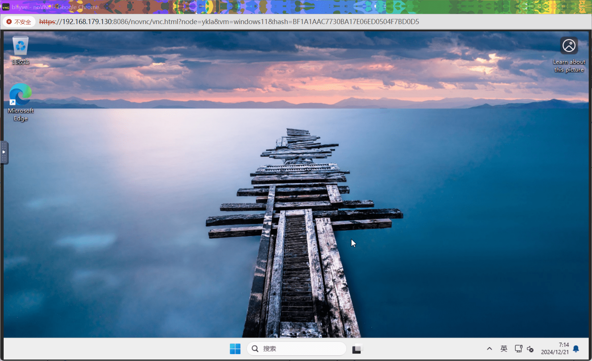

# 12.1 使用 BVCP 通过 Web 界面管理 bhyve

BVCP 是一款基于 Web 的 BHyve（Bhyve）管理软件。该软件运行流畅，操作简便。

支持 FreeBSD 12 及更高版本，本文基于 FreeBSD 14.2 RELEASE。本文所使用的 BVCP 2.1.4 版本尚不支持中文。

本软件尚未开源，可在以下地址查看：<https://github.com/DaVieS007/bhyve-webadmin>

>**技巧**
>
>无需提前配置任何服务、加载任何模块或安装其他软件。按照本文步骤即可完成操作。

## 安装 BVCP

- 下载 BVCP 分发文件：

```sh
# fetch https://bhyve.npulse.net/release.tgz
```

- 解压缩 BVCP 分发文件：

```sh
# tar -xzvf release.tgz
```

- 安装 BVCP：

```sh
# cd bhyve-webadmin 
root@ykla:/home/ykla/bhyve-webadmin-2.1.4 # ./install.sh 
Installing BVCP into your FreeBSD Installation within seconds ...

Press [CTRL] + [C] to Abort !
bvcp_enable:  -> YES
 N  2024-12-21 11:32:35 | Kinga-Framework | 2024/02-17@build-336/FreeBSD64-L
 N  2024-12-21 11:32:35 | Product Name    | BVCP-Backend
 N  2024-12-21 11:32:35 | Description     | BVCP Bhyve Backend/Helper Module
 N  2024-12-21 11:32:35 | License         | Community Edition
 N  2024-12-21 11:32:35 | Copyright       | All rights reserved for the author: nPulse.net / Viktor Hlavaji
 N  2024-12-21 11:32:35 | Guardian | Create Process, PID: 1132
 N  2024-12-21 11:32:35 | SW | VFS:BuiltIn Loaded
 N  2024-12-21 11:32:35 | ThreadPool | 10/10 Threads initialised
 N  2024-12-21 11:32:35 | LVM::MAIN | Initialising ..


                    ██████╗ ██╗   ██╗ ██████╗██████╗ 
                    ██╔══██╗██║   ██║██╔════╝██╔══██╗
                    ██████╔╝██║   ██║██║     ██████╔╝
                    ██╔══██╗╚██╗ ██╔╝██║     ██╔═══╝ 
                    ██████╔╝ ╚████╔╝ ╚██████╗██║     
                    ╚═════╝   ╚═══╝   ╚═════╝╚═╝     

            Bhyve Virtual-Machine Control Panel under FreeBSD
        
 N  2024-12-21 11:32:35 | BVCP | Initialising BVCP-Backend 2.1.4 Application

  [>] Generating Entropy ... [217157D53CDD4122589AEE05D866C84C]

 Welcome to initial setup menu!
 The Software is located at: /var/lib/nPulse/BVCP

 The Software is producing pseudo filesystem scheme for virtual machines using symlinks
 Where to create metadata, iso_images, database, config, logs: (Does not need much space), default: [/vms]_>   # 按回车确认，安装所需的 iso_images 镜像将存放在此目录下

……省略一部分……


            Bhyve Virtual-Machine Control Panel under FreeBSD
        
 N  2024-12-21 11:33:46 | BVCP | Initialising BVCP-Backend 2.1.4 Application
 N  2024-12-21 11:33:48 | BVCP | Starting Database ...
 (!) Admin Credentials recreated,
   - User: admin 		# 用户名 admin
   - Password: AdJFjNjG # 密码 AdJFjNjG

 N  2024-12-21 11:33:48 | SW | Program exited gracefully...
Installation Finished!
Navigate: https://[your-ip]:8086  # 访问地址 https://localhost:8086（在安装 BVCP 的机器上访问的地址）
```

## 安装 Ubuntu 24.04


下载 Ubuntu 24.04：

```sh
# fetch https://mirrors.ustc.edu.cn/ubuntu-releases/noble/ubuntu-24.04.1-desktop-amd64.iso
```

将镜像移动到 `iso_images`（安装中指定的路径）：

```sh
# mv ubuntu-24.04.1-desktop-amd64.iso /vms/iso_images
```


忽略上方显示的电子邮件（email），直接输入安装过程中生成的用户名 `admin`，然后输入对应密码即可。


安装后按回车重启。


进入新系统：


进入安装好的 Ubuntu 24.04。

## 安装 Windows 11 IoT Enterprise LTSC, version 24H2 (x64) - DVD (English)

详细步骤省略，可参见上节 10.2 以及前文 Ubuntu 24.04 的安装说明，仅列出不同之处。

在 `Create new network interface` 步骤中创建新网卡接口时：


请务必选择 `Intel PRO e1000`，因为默认网卡不自带驱动。


开始安装



## 故障排除与未竟事宜

### 如何卸载 BVCP

可参见官方文档 [Uninstallation of BVCP](https://bhyve.npulse.net/uninstall) 进行卸载操作。

## 参考文献

- [bhyve を GUI で 操作 する BVCP の 導入。](https://running-dog.net/2024/02/post_2933.html)
- [How to install BVCP](https://bhyve.npulse.net/installation)，官方安装说明
- [TroubleShoot / Frequently Asked Questions (FAQ)](https://bhyve.npulse.net/technical)，常见疑难解答
- [Deploy Virtual Machine (Windows)](https://bhyve.npulse.net/deploy_windows)，官方 Windows 安装说明
