# 12.2 使用 bhyve 安装 Windows 11（vm-bhyve）

以下教程基于 FreeBSD 14.2 RELEASE + Windows 11 IoT Enterprise LTSC。

## 安装固件与所需软件

> Windows 11 IoT Enterprise LTSC, version 24H2 (x64) - DVD (English) 系统链接（来自 [itellyou](https://next.itellyou.cn/)）：
>
> 因为 IoT 版本解除了 TPM、内存大小等安装限制。
>
> SHA256:4F59662A96FC1DA48C1B415D6C369D08AF55DDD64E8F1C84E0166D9E50405D7A
>
> `magnet:?xt=urn:btih:7352bd2db48c3381dffa783763dc75aa4a6f1cff&dn=en-us_windows_11_iot_enterprise_ltsc_2024_x64_dvd_f6b14814.iso&xl=5144817664`

加载内核模块：

>**技巧**
>
>只需要这一次，以后 vm-bhyve 会自己加载该模块的。

```sh
# kldload vmm
```

检查：

```sh
# kldstat | grep vmm
 7    1 0xffffffff83320000     44b0 vmmemctl.ko
10    1 0xffffffff83400000   33e438 vmm.ko
```

---

首先，安装 UEFI 固件、VNC 与 vm-bhyve。

- 使用 pkg 安装：

```sh
# pkg install bhyve-firmware vm-bhyve tigervnc-viewer
```

- 或者使用 Ports 安装：

```
# cd /usr/ports/sysutils/bhyve-firmware/ && make install clean
# cd /usr/ports/sysutils/vm-bhyve/ && make install clean
# cd /usr/ports/net/tigervnc-viewer/ && make install clean
```

---

在 `/etc/rc.conf` 中指定启动 vm 与虚拟机的位置：

```sh
vm_enable="YES"
vm_dir="/home/ykla/vm" #注意该位置，以下操作都会用到
```

创建模板路径：

```sh
# mkdir -p /home/ykla/vm/.templates
```

复制模板到虚拟机模板位置：

```sh
# cp /usr/local/share/examples/vm-bhyve/* /home/ykla/vm/.templates
```

创建虚拟交换机，`public` 是你在模板里指定的，`ue0` 是我正在上网用的网卡，你需要改成你自己的（命令 `ifconfig` 可以看），否则会创建失败且虚拟机报错：`exit with error 4`：

```sh
# vm switch create public
# vm switch add public ue0
```

创建后查看新增的 `vm-public`：

```sh
root@ykla:~ # ifconfig

………省略一部分……

vm-public: flags=1008843<UP,BROADCAST,RUNNING,SIMPLEX,MULTICAST,LOWER_UP> metric 0 mtu 1500
	options=0
	ether 62:bc:e8:9f:f7:e1
	id 00:00:00:00:00:00 priority 32768 hellotime 2 fwddelay 15
	maxage 20 holdcnt 6 proto rstp maxaddr 2000 timeout 1200
	root id 00:00:00:00:00:00 priority 32768 ifcost 0 port 0
	member: em0 flags=143<LEARNING,DISCOVER,AUTOEDGE,AUTOPTP>
	        ifmaxaddr 0 port 1 priority 128 path cost 20000
	groups: bridge vm-switch viid-4c918@
	nd6 options=9<PERFORMNUD,IFDISABLED>
```

>**技巧**
>
> 如果创建错了，可以销毁之：
>
> ```sh
> # vm switch destroy public
> ```

查看分配的虚拟交换机：

```sh
root@ykla:/usr/home/ykla # vm switch list
NAME    TYPE      IFACE      ADDRESS  PRIVATE  MTU  VLAN  PORTS
public  standard  vm-public  -        no       -    -     ue0
```

为了在 13.0 之后的 FreeBSD 宿主机中正确使用 xhci 鼠标，应该使用驱动 hms(4)，请在 `/boot/loader.conf` 中添加：

```sh
hw.usb.usbhid.enable=1
usbhid_load="YES"
```

## 配置虚拟机模板

> 注意，如果你运行的是 Windows 10 之前的旧版本或当你想在 Windows 系统上安装 Microsoft SQL Server 时，你需要使用参数 `disk0_opts="sectorsize=512"` 将磁盘扇区大小设置成 512。

根据模板创建 windows 虚拟机，磁盘占用 40GB：

```sh
# vm create -t windows -s 40G winguest
```

>**技巧**
>
> 销毁虚拟机的命令：
>
> ```sh
> root@ykla:/usr/home/ykla # vm  destroy winguest
>
> Are you sure you want to completely remove this virtual machine (y/n)? Are you sure you want to completely remove this virtual machine (y/n)? # 这里输入 y 回车即可删除
> ```

但是注意该模板是有问题的，需要进行修改如下，文件路径是 `/home/ykla/vm/winguest/winguest.conf`：

> **注意**
>
> 旧版 FreeBSD 中（FreeBSD 14.0 以前），`/home/` 是被软连接到 `/usr/home/` 的，是一样的。
>
> FreeBSD 14 以降，不再是软连接，而是直接使用 `/home/`。

```sh
loader="uefi" # 不支持 UEFI 的 windows 不能够启动，例如 XP 操作系统，但是请注意 win7 是支持 UEFI 的
graphics="yes" # 指定暂停虚拟机直至 VNC 链接。
xhci_mouse="yes"
cpu=2 # CPU，这个最好多给一些
memory=4G # 内存

# put up to 8 disks on a single ahci controller.
# without this, adding a disk pushes the following network devices onto higher slot numbers,
# which causes windows to see them as a new interface
ahci_device_limit="8"

# ideally this should be changed to virtio-net and drivers installed in the guest
# e1000 works out-of-the-box
network0_type="e1000" # 开箱即用的虚拟网卡
network0_switch="public" # 虚拟交换机

disk0_type="ahci-hd"
disk0_name="disk0.img"

# windows expects the host to expose localtime by default, not UTC
utctime="no" # 指定 windows 使用 UTC 时间，避免时间差 8 个小时

graphics_res="1920x1080" # 指定 VNC 链接的屏幕分辨率，可用数值在下文列出
uuid="af86e094-56da-11ed-958f-208984999cc9"
network0_mac="58:9c:fc:0c:5e:bb"
```


## 安装系统

指定 Windows iso 文件开始正常安装。当在安装模式下运行时，`vm-bhyve` 将等待，直到 VNC 客户端连接后再启动虚拟机。这能让你抓住 Windows 可能显示的提示“Press any key to boot from a CD/DVD“。你能在 `vm list` 中看到，在此时，虚拟机将显示为锁定：

```sh
# vm install winguest /home/ykla/en-us_windows_11_iot_enterprise_ltsc_2024_x64_dvd_f6b14814.iso # 替换成你自己的路径
Starting winguest
  * found guest in /home/ykla/vm/winguest
  * booting...
```

### 从 VNC 访问 Win11


当出现 `Press any key to boot from a CD/DVD` 时，请快速地按几次回车键。

>**技巧**
>
>如果你忘记按了退回到了 UEFI shell，请停止虚拟机，重新执行上面的安装步骤。
>
>


请注意将第二项改为“Chinese (Simplified, Mainland China)”

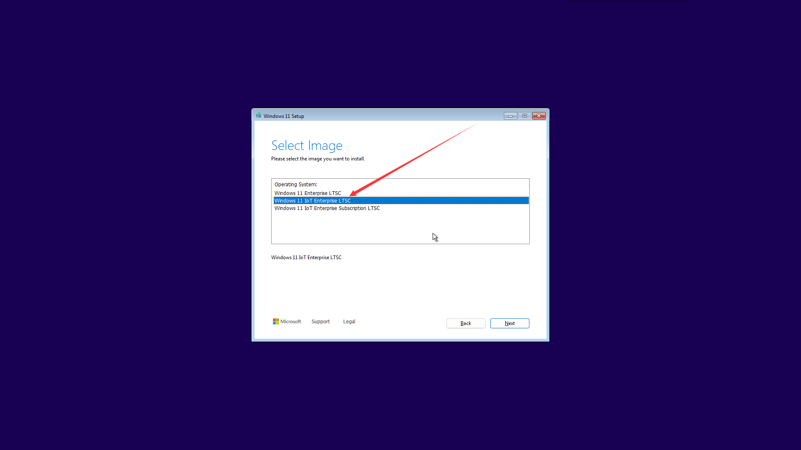

我们选择“Chinese (Simplified, Mainland China)”


开始安装。在安装中会断开若干次 VNC 连接，重新连接即可。


打开 tigervnc-viewer 输入 `localhost`，点击连接，然后按任意键以进入安装过程。


>技巧
>
>终止虚拟机：如果虚拟机卡死该命令无效，请自行 `kill -9` 以免影响关机，如果真的阻碍了物理机关机，可以在 tty 按 `Ctrl`+ `C` 跳过等待虚拟机，强制关机
>
>```sh
>root@ykla:~ #  vm list
>NAME      DATASTORE  LOADER  CPU  MEMORY  VNC           AUTO  STATE
>winguest  default    uefi    2    4G      0.0.0.0:5900  No    Running (2072)
>root@ykla:/usr/home/ykla # vm stop winguest
>Sending ACPI shutdown to winguest
>```
>
>如果无效：
>
>```
>root@ykla:~ # ps -el
>UID  PID PPID C PRI NI     VSZ    RSS MWCHAN STAT TT     TIME COMMAND
>  0 1858    1 1  68  0   16388      4 wait   IW    3  0:00.00 () /bin/sh /usr/local/sbin/vm _run winguest /home/ykla/zh-cn_windows_11_business_editions_version_24h2_x64_dvd
>root@ykla:~ # kill -9 1858
>```

### 安装后配置

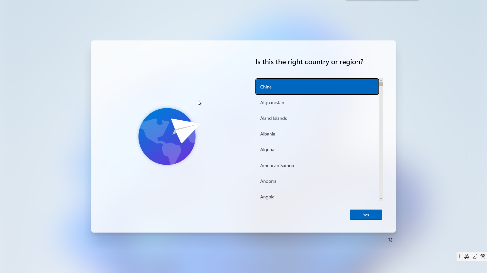

选择“China”。

安装后开机：

```sh
# vm start winguest
```

打开 VNC 连接即可。


输入用户名


输入密码


重复输入密码

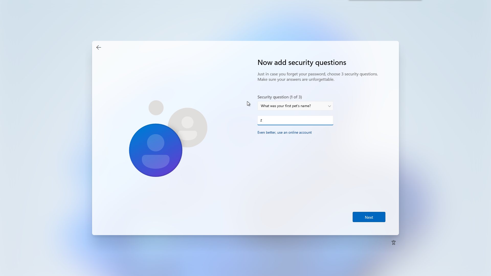

输入安全问题，会重复三次要求你设置三个不同问题。

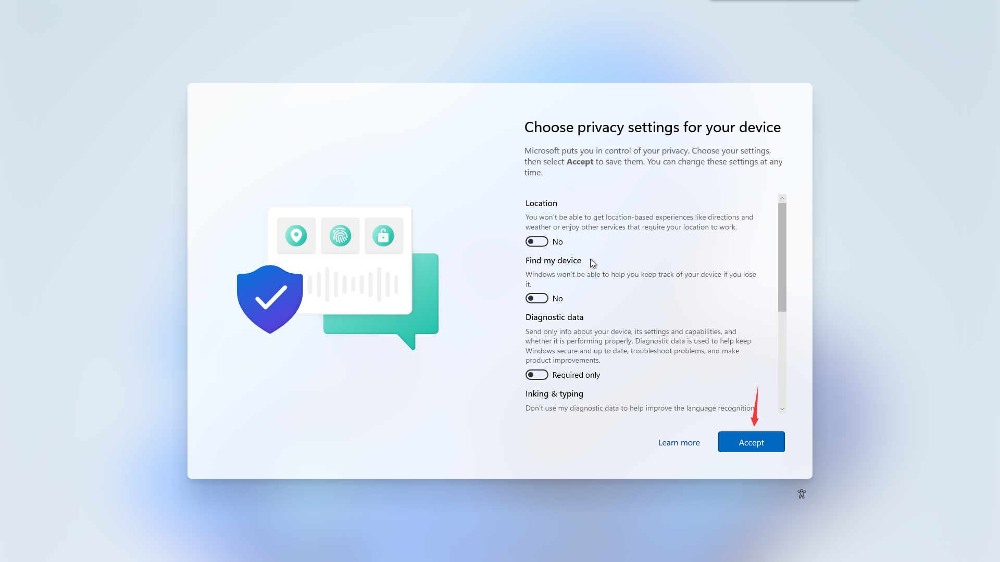

隐私设置。可随意调整，然后点击“Accept”

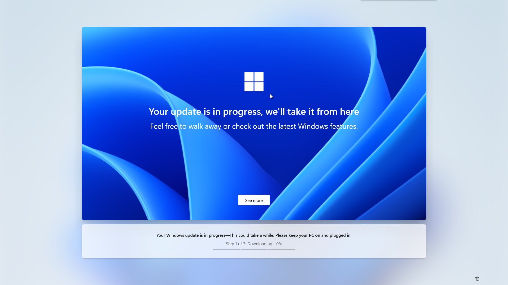

……它会在安装中更新，可能有一些方法可以跳过（经测试 oobe\bypassnro 无效），这里请读者自行研究。


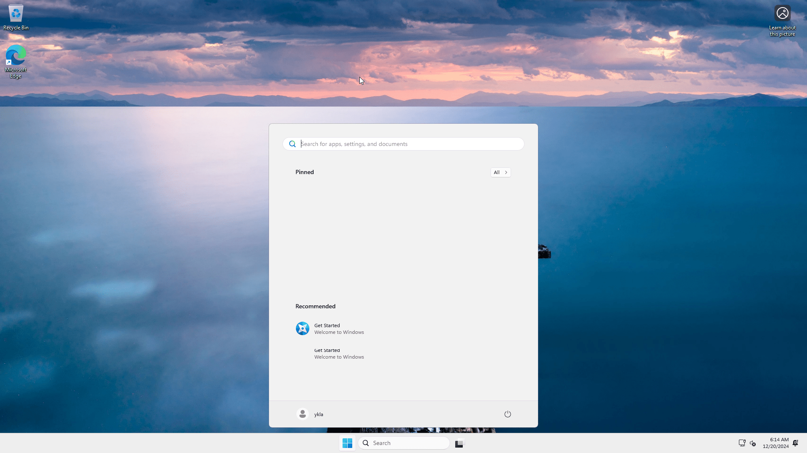

汉化系统：

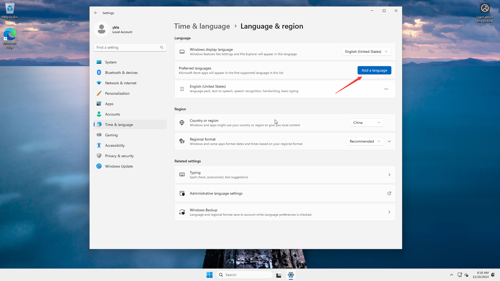

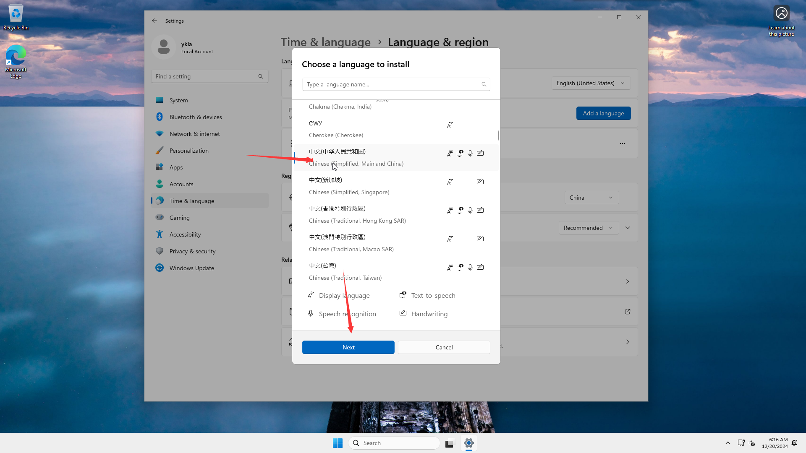

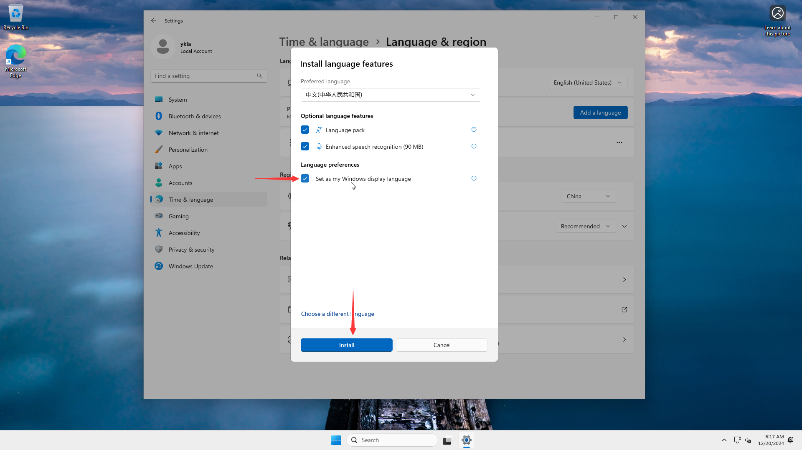

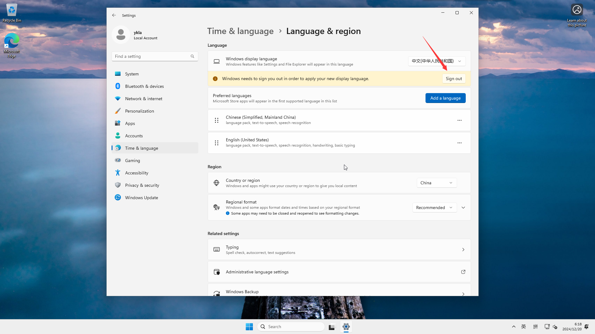

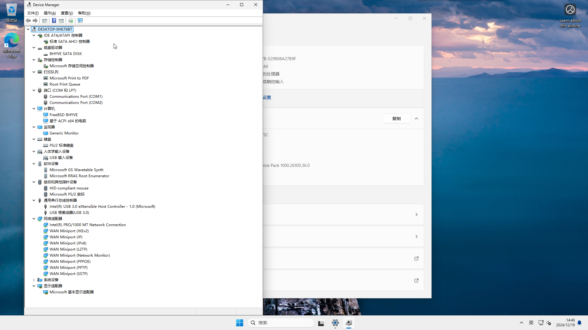


### 故障排除与未竟事宜

有问题先重启一遍自己的物理机。还有问题自己 `ifconfig` 对比上文看看是不是有了多余的网卡，将其销毁掉。

如果虚拟机一直是 stopped 的状态，检查一下你的网络。

查看网络，这是虚拟机关闭状态下的：

```sh
root@ykla:/usr/home/ykla # ifconfig
alc0: flags=8802<BROADCAST,SIMPLEX,MULTICAST> metric 0 mtu 1500
        options=c319a<TXCSUM,VLAN_MTU,VLAN_HWTAGGING,VLAN_HWCSUM,TSO4,WOL_MCAST,WOL_MAGIC,VLAN_HWTSO,LINKSTATE>
        ether 20:89:82:94:7c:c9
        media: Ethernet autoselect
        nd6 options=29<PERFORMNUD,IFDISABLED,AUTO_LINKLOCAL>
lo0: flags=8049<UP,LOOPBACK,RUNNING,MULTICAST> metric 0 mtu 16384
        options=680003<RXCSUM,TXCSUM,LINKSTATE,RXCSUM_IPV6,TXCSUM_IPV6>
        inet6 ::1 prefixlen 128
        inet6 fe80::1%lo0 prefixlen 64 scopeid 0x2
        inet 127.0.0.1 netmask 0xff000000
        groups: lo
        nd6 options=21<PERFORMNUD,AUTO_LINKLOCAL>
ue0: flags=8943<UP,BROADCAST,RUNNING,PROMISC,SIMPLEX,MULTICAST> metric 0 mtu 1500
        options=8000b<RXCSUM,TXCSUM,VLAN_MTU,LINKSTATE>
        ether f8:e2:3b:3f:ea:4c
        inet 192.168.31.169 netmask 0xffffff00 broadcast 192.168.31.255
        media: Ethernet autoselect (1000baseT <full-duplex>)
        status: active
        nd6 options=29<PERFORMNUD,IFDISABLED,AUTO_LINKLOCAL>
vm-public: flags=8843<UP,BROADCAST,RUNNING,SIMPLEX,MULTICAST> metric 0 mtu 1500
        ether 3a:e1:fa:98:33:b4
        id 00:00:00:00:00:00 priority 32768 hellotime 2 fwddelay 15
        maxage 20 holdcnt 6 proto rstp maxaddr 2000 timeout 1200
        root id 00:00:00:00:00:00 priority 32768 ifcost 0 port 0
        member: ue0 flags=143<LEARNING,DISCOVER,AUTOEDGE,AUTOPTP>
                ifmaxaddr 0 port 3 priority 128 path cost 20000
        groups: bridge vm-switch viid-4c918@
        nd6 options=9<PERFORMNUD,IFDISABLED>
```

查看网络，这是虚拟机开启状态下的，会多出来一个 `tap0`：

```sh
tap0: flags=8943<UP,BROADCAST,RUNNING,PROMISC,SIMPLEX,MULTICAST> metric 0 mtu 1500
        description: vmnet/winguest/0/public
        options=80000<LINKSTATE>
        ether 58:9c:fc:10:ff:d6
        groups: tap vm-port
        media: Ethernet autoselect
        status: active
        nd6 options=29<PERFORMNUD,IFDISABLED,AUTO_LINKLOCAL>
        Opened by PID 2519
```


## 可选配置

- 查看所有虚拟机状态：


```sh
root@ykla:/usr/home/ykla # vm list
NAME      DATASTORE  LOADER  CPU  MEMORY  VNC  AUTO  STATE
winguest  default    uefi    2    4G      -    No    Stopped
```

- 查看指定的虚拟机状态：

```sh
root@ykla:/usr/home/ykla # vm info winguest
------------------------
Virtual Machine: winguest
------------------------
  state: stopped
  datastore: default
  loader: uefi
  uuid: af86e094-56da-11ed-958f-208984999cc9
  cpu: 2
  memory: 4G

  network-interface
    number: 0
    emulation: e1000
    virtual-switch: public
    fixed-mac-address: 58:9c:fc:0c:5e:bb
    fixed-device: -

  virtual-disk
    number: 0
    device-type: file
    emulation: ahci-hd
    options: -
    system-path: /home/ykla/vm/winguest/disk0.img
    bytes-size: 42949672960 (40.000G)
    bytes-used: 23557898240 (21.940G)
```


## 参考资料

- [vm-bhyve/wiki/Running-Windows](https://github.com/churchers/vm-bhyve/wiki/Running-Windows)，教程主要参考此处。中文版本在 [vm-bhyve Wiki](https://book.bsdcn.org/wen-zhang/wen-zhang/vm-bhyve)
- [The win11 release ISO requires the install-time regedit TPM workaround](https://twitter.com/bhyve_dev/status/1446404943020056581)
- [windows 11 on bhyve](https://forums.freebsd.org/threads/windows-11-on-bhyve.82371/)
- [FreeBSD, bhyve и Windows 11](https://dadv.livejournal.com/209650.html)
- [iki/bhyve/Windows](https://wiki.freebsd.org/bhyve/Windows)
- [churchers/vm-bhyve/wiki](https://github.com/churchers/vm-bhyve/wiki)
- [Using Windows on FreeBSD's vm-bhyve](https://srobb.net/vm-bhyve.html)


