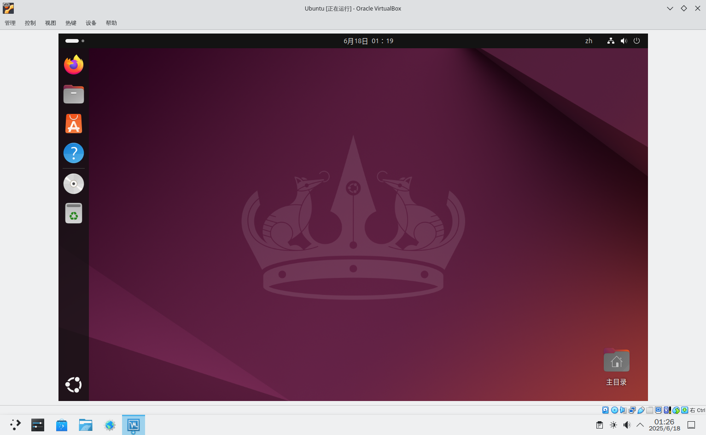

# 12.4 在 FreeBSD 上安装 VirtualBox

VirtualBox 是由 Oracle 公司（Oracle）开发的一款虚拟化平台，遵循 GPL 协议发布；闭源的 VirtualBox 扩展包（VirtualBox Extension Pack）尚未支持，其提供 USB 2.0/3.0、NVMe 磁盘加密等功能。

## 安装 VirtualBox

VirtualBox 在 FreeBSD 上有多个版本，截至本文撰写时，包括：`emulators/virtualbox-ose-legacy`（5.X）、`emulators/virtualbox-ose`（6.X）、`emulators/virtualbox-ose-70` 和 `emulators/virtualbox-ose-71`，其中均提供无 X11 的 `-nox11` 版本（例如 `emulators/virtualbox-ose-71-nox11`，无图形界面，仅命令行操作，命令为 `VBoxManage`）。


本文安装最新的 `emulators/virtualbox-ose-71`。

使用 pkg 安装可能会出现内核相关报错，因此推荐使用 Ports 安装：

```sh
# cd /usr/ports/emulators/virtualbox-ose-71/ 
# make install clean
```

>**注意**
>
>编译过程需要在 `/usr/src/` 目录下存在内核源码。


## 查看安装后说明

```sh
# pkg info -D virtualbox-ose-71
virtualbox-ose-71-7.1.10:
On install:
VirtualBox was installed.  
VirtualBox 已安装。

You need to load the vboxdrv kernel module via /boot/loader.conf:  
你需要通过 `/boot/loader.conf` 加载 vboxdrv 内核模块：

vboxdrv_load="YES"

You also have to add all users to your vboxusers group in order to use vbox.  
你还需要将使用 VirtualBox 的用户加入 vboxusers 组

% pw groupmod vboxusers -m jerry

Reboot the machine to load the needed kernel modules.  
重启系统以加载所需的内核模块。


Bridging Support:  
=================  
桥接支持：

For bridged networking please add the following line to your /etc/rc.conf:  
要启用桥接网络，请将以下行添加到 /etc/rc.conf：

vboxnet_enable="YES"


USB Support:  
============  
USB 支持：

For USB support your user needs to be in the operator group and needs read  
and write permissions to the USB device.  
要启用 USB 支持，用户需要属于 operator 组，并具有对 USB 设备的读写权限。

% pw groupmod operator -m jerry

Add the following to /etc/devfs.rules (create if it doesn't exist):  
将以下内容添加到 `/etc/devfs.rules`（如文件不存在，请创建）：

[system=10]  
add path 'usb/*' mode 0660 group operator

To load these new rule add the following to /etc/rc.conf:  
要加载这些新规则，请在 /etc/rc.conf 中添加以下行：

devfs_system_ruleset="system"

Then restart devfs to load the new rules:  
然后重启 devfs 以使新规则生效：

% /etc/rc.d/devfs restart


Troubleshooting:  
================  
故障排查：

Running VirtualBox as non-root user may fail with a fatal error  
NS_ERROR_FACTORY_NOT_REGISTERED. In this case delete /tmp/.vbox-*-ipc file.  
以非 root 用户运行 VirtualBox 时可能会因致命错误 NS_ERROR_FACTORY_NOT_REGISTERED 而失败。此时请删除 /tmp/.vbox-*-ipc 文件。

If you experience "Network: write Failed: Cannot allocate memory" errors  
try to increase net.graph.maxdata in /boot/loader.conf  
如果遇到 “Network: write Failed: Cannot allocate memory” 错误，请尝试在 /boot/loader.conf 中增加 net.graph.maxdata 的值。

If you are using AIO, then increase these limits (https://bugs.freebsd.org/168298):  
如果你正在使用 AIO，请提高以下限制值（详见 https://bugs.freebsd.org/168298）：
vfs.aio.max_buf_aio=8192  
vfs.aio.max_aio_queue_per_proc=65536  
vfs.aio.max_aio_per_proc=8192  
vfs.aio.max_aio_queue=65536  
To check if AIO is used use: kldstat -v | grep aio  
要检查是否启用了 AIO，可运行：kldstat -v | grep aio

If you are experiencing VMs freezes with an error in VBox.log such as:  
如果你的虚拟机出现冻结，并在 VBox.log 中出现如下错误信息：

"
00:01:29.590192 AssertLogRel /usr/ports/emulators/virtualbox-ose/work/VirtualBox-6.1.44
/src/VBox/VMM/VMMR3/PGMPhys.cpp(5148) int PGMR3PhysAllocateHandyPages(PVM): RT_SUCCESS(rc)
00:01:29.590221 87/128: idPage=0x3d400 HCPhysGCPhys=000000027eaed000 rc=VERR_NO_MEMORY
00:01:29.590247 Changing the VM state from 'RUNNING' to 'GURU_MEDITATION'
00:01:29.590261 Console: Machine state changed to 'GuruMeditation'
00:01:29.590695 !!!!!!!!!!!!!!!!!!!!!!!!!!!!!!!!!!!!!!!!!!!!!!!!!!!!!!!!!!!!!!!!!!!!!!
00:01:29.590696 !!
00:01:29.590697 !!         VCPU0: Guru Meditation -8 (VERR_NO_MEMORY)
"

and see a lot of free RAM, then increase sysctl vm.max_user_wired  
(https://bugs.freebsd.org/252227).  
如果系统存在大量空闲内存，但仍出现问题，请增加 sysctl vm.max_user_wired 的值（详见 https://bugs.freebsd.org/252227）。

For dedicated VM servers, a good start is:  
对于专用虚拟机服务器，可以按以下公式设置初始值：
（“内存容量（GB）” − max(1, “内存容量（GB） / 32”)） × 1024 × 1024 × 1024 ÷ PAGE_SIZE
x86 架构下 PAGE_SIZE 为 4096。

Examples with different RAM sizes in GB:  
不同内存容量的示例（单位：GB）：
 16: ( 16-max(1, 16/32)*1024*1024*1024/4096 = 3932160  =>  15GB  
 32: ( 32-max(1, 32/32)*1024*1024*1024/4096 = 8126464  =>  31GB  
 48: ( 48-max(1, 48/32)*1024*1024*1024/4096 = 12189696 =>  46.5GB  
 64: ( 64-max(1, 64/32)*1024*1024*1024/4096 = 16252928 =>  62GB  
128: (128-max(1,128/32)*1024*1024*1024/4096 = 32505856 => 124GB  
256: (256-max(1,256/32)*1024*1024*1024/4096 = 65011712 => 248GB

When assigning IP addresses in host-only mode from ranges outside  
of VirtualBox's defaults, the respective ranges need to be listed  
in /usr/local/etc/vbox/networks.conf (https://bugs.freebsd.org/259399).  
如果你在 host-only 模式下分配的 IP 地址超出 VirtualBox 默认范围，请将对应的地址范围写入 /usr/local/etc/vbox/networks.conf（详见 https://bugs.freebsd.org/259399）。

Check the wiki page for known issues and troubleshooting:  
查看官方 Wiki 页面获取已知问题和故障排查信息：  
https://wiki.freebsd.org/VirtualBox

Please report any problems to emulation@. Thanks!  
如遇问题，请发送邮件报告至 emulation@，谢谢！


On upgrade from virtualbox-ose-71<6.1.22:  
从 virtualbox-ose-71 小于 6.1.22 的版本升级时：

The PULSEAUDIO option has been forcibly disabled since VirtualBox  
version 6.1.24 due to a bug in it preventing virtual machines  
configured to use it from starting.  
从 VirtualBox 6.1.24 起，PULSEAUDIO 选项已被强制禁用，因为其存在导致配置使用它的虚拟机无法启动的错误。

When upgrading from a previous version please reconfigure any virtual  
machines using the Pulseaudio host audio driver to use another  
supported one.  
升级后，请将所有使用 Pulseaudio 主机音频驱动的虚拟机改为使用其他受支持的音频驱动。


On upgrade from virtualbox-ose-71>6.1.26<6.1.32_1:  
从 virtualbox-ose-71 版本大于 6.1.26 且小于 6.1.32_1 的版本升级时：

To comply to hier(7) requirements, networks.conf's location changed  
to /usr/local/etc/vbox/networks.conf.  
为符合 hier(7) 要求，networks.conf 的位置已更改为 /usr/local/etc/vbox/networks.conf。

In case /etc/vbox/networks.conf exists, it needs to be moved to  
/usr/local/etc/vbox and /etc/vbox should be deleted.  
如果 /etc/vbox/networks.conf 存在，请将其移动到 /usr/local/etc/vbox，并删除 /etc/vbox 目录。
```

## 配置

- 将以下行写入 `/boot/loader.conf` 以加载所需内核模块：

```sh
vboxdrv_load="YES"
```

- 启用桥接网络支持

```sh
# service vboxnet enable
```

默认的 `net.graph.maxdata` 值应该足够，不需要修改。

### 普通用户所需

需要分别加入 `vboxusers`、`operator`（USB 支持）组

```sh
# 将当前用户添加到 operator 用户组
# pw groupmod operator -m 你的用户名

# 将当前用户添加到 vboxusers 用户组
# pw groupmod vboxusers -m 你的用户名
```

将以下内容添加到 `/etc/devfs.rules`（如果不存在请创建）：

```ini
[system=10]  
add path 'usb/*' mode 0660 group operator
```

要加载这些新规则，请在 `/etc/rc.conf` 中添加以下行：

```ini
devfs_system_ruleset="system"
```

然后重启 devfs 以加载新规则：

```sh
% /etc/rc.d/devfs restart
```

以非 root 用户运行 VirtualBox 时可能会报错 `NS_ERROR_FACTORY_NOT_REGISTERED`。此时请 `$ rm -rf /tmp/.vbox-*-ipc`。


## 测试



## 故障排除与未竟事项

### TPM 不支持

但是在设置中可见该选项，虚拟机无法启动。
