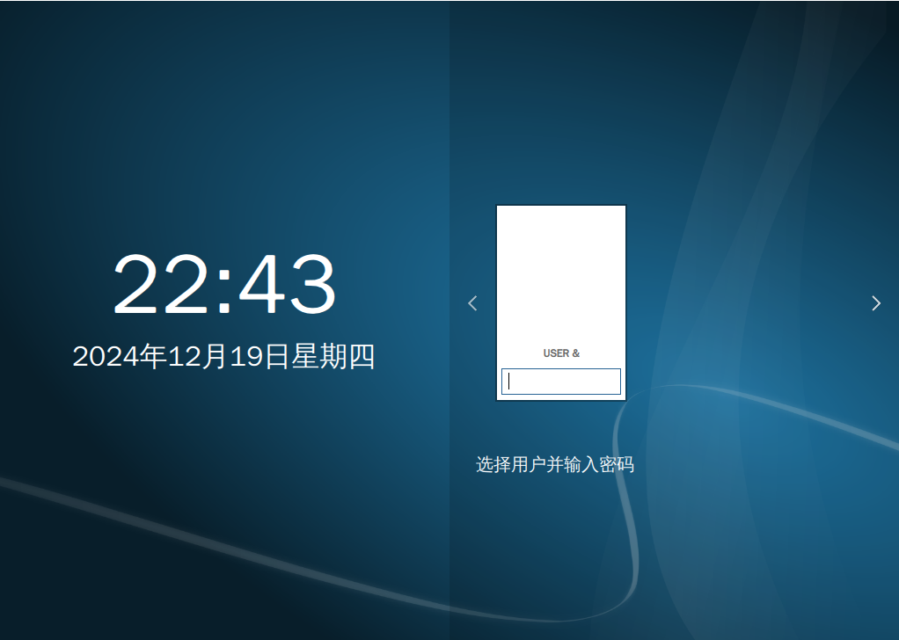
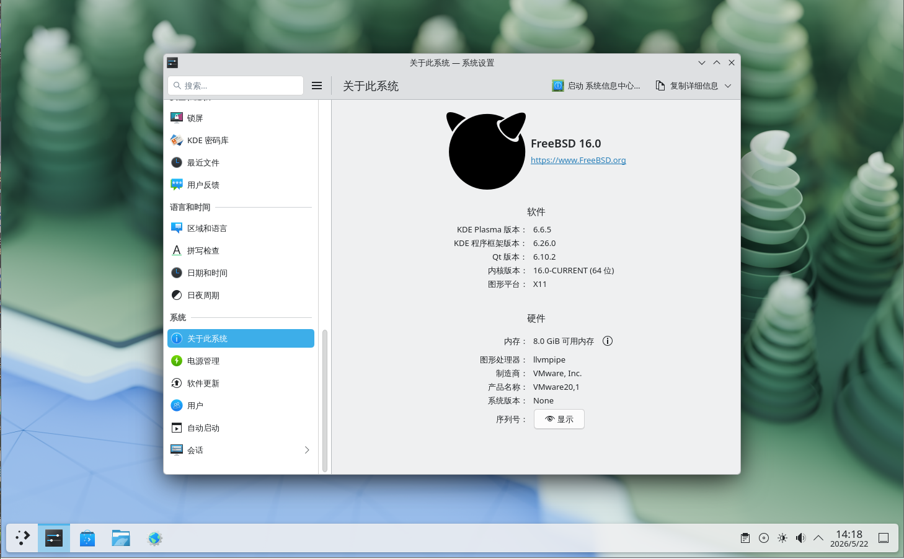
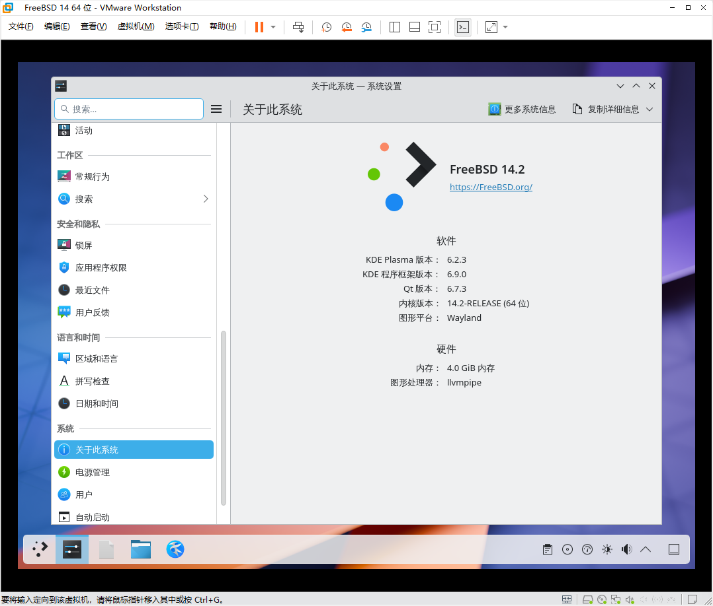
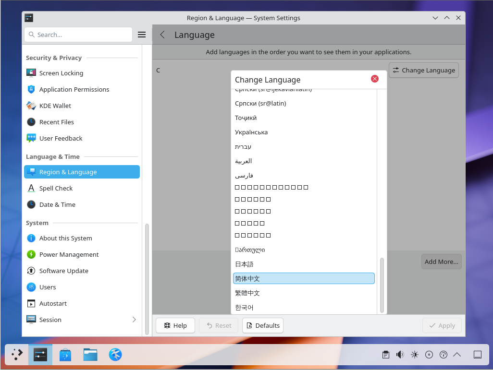
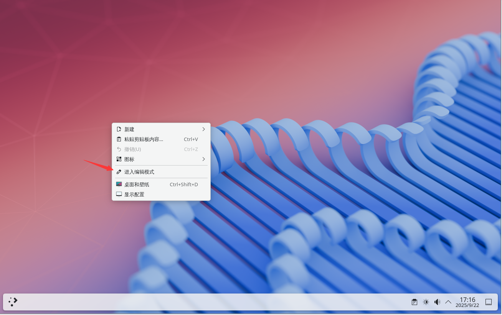
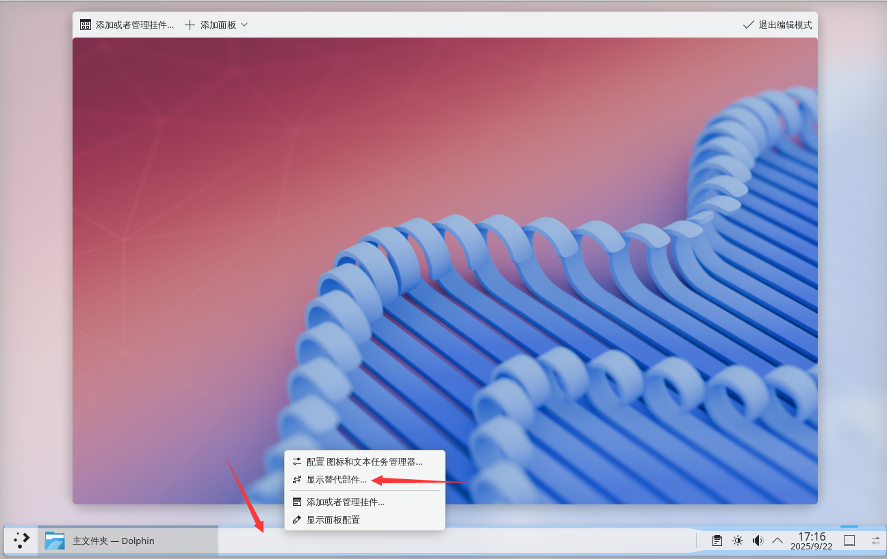
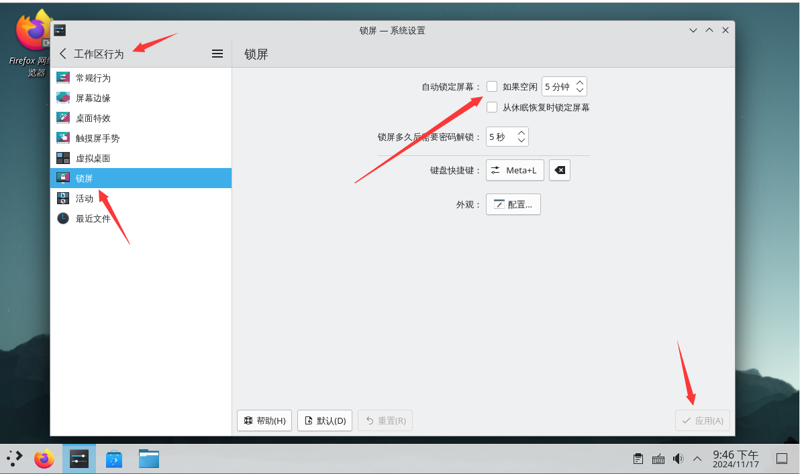

# 12.1 KDE 6 桌面环境（X11 会话）

KDE Plasma 是一款易于使用的现代化桌面环境，提供外观与操作体验一致的应用程序集合，包括统一的菜单与工具栏、快捷键、配色方案、本地化支持，以及集中式、对话框驱动的桌面配置工具。

KDE 桌面环境借鉴了 Windows 等多种桌面环境的交互范式，二者界面设计有相似之处。~~也可能是 Windows 借鉴 KDE 桌面较多。~~

> **技巧**
>
> 视频教程可参见：FreeBSD 中文社区. 003-FreeBSD14.2 安装 KDE6[EB/OL]. [2026-03-26]. <https://www.bilibili.com/video/BV12zAYeKEej>.

## 安装完整的 KDE 桌面环境

> **技巧**
>
> 不希望捆绑安装大量附加工具和软件的用户可使用下方的最小化安装方案，无需自定义配置的用户可继续使用本方案。

- 使用 pkg 安装：

```sh
# pkg install xorg kde wqy-fonts
```

> **技巧**
>
> 如果提示 `pkg` 未找到该命令或未提供 kde 软件包，可能是二进制包尚未构建完成，或需切换软件源分支。参考本书其他相关章节。如无二进制包，则需使用 Ports 编译安装。

- 或者使用 Ports 安装：

```sh
# cd /usr/ports/x11/xorg/ && make install clean
# cd /usr/ports/x11/kde/ && make install clean
# cd /usr/ports/x11-fonts/wqy/ && make install clean
```

### 软件包说明

| 包名 | 作用 |
| ---- | ---- |
| `xorg` | X 窗口系统 |
| `kde` | KDE 桌面环境 |
| `wqy-fonts` | 文泉驿中文字体 |

## 启动项设置

D-Bus 用于桌面环境的进程间通信，作为依赖项自动安装。

启用 D-Bus：

```sh
# service dbus enable
```



## startx

```sh
$ echo "exec ck-launch-session startplasma-x11" > ~/.xinitrc
```

> **注意**
>
> 如果之前以 root 身份执行过上述命令，新用户仍需再执行一次，方可正常执行 startx（无需 root 权限或 sudo）。

## 权限设置

普通用户还须加入 `wheel` 组与 `video` 组，否则部分设置无法显示，图形界面功能可能受限：

```sh
# pw groupmod wheel -m 用户名
# pw groupmod video -m 用户名
```

将“用户名”替换为实际用户名。

## 配置中文环境

除了通过用户分级设置中文环境外，还可以通过以下方式设置中文环境。



### 通过 KDE 系统设置中文环境

点击应用程序启动器 → System Settings → Language & Time，在 Region & Language 的 Language 栏点击 Modify，找到并选择“简体中文”。如果显示为 `□□□□`，请检查中文字体是否已安装。随后单击 Apply 按钮；注销后重新登录，此时系统语言将切换为中文。





### 参考文献

- silversack. デスクトップ 環境 の 構築 - 4-7. LXQT のインストールと 設定 (LXQT 2.0.0)[EB/OL]. [2026-03-25]. <https://silversack.my.coocan.jp/bsd/fbsd11x_bde-4-7_lxqt.htm>. 日文 FreeBSD 桌面环境构建指南中 LXQt 的安装与配置部分。

## 附录：最小化 KDE 桌面安装方案

直接安装 **x11/kde** 会将 Plasma 桌面各组件和 **x11/kde-baseapps** 作为依赖一并安装，其中捆绑了大量工具软件，在某些场景下不便于部署和使用。

### 使用 pkg 安装

基础桌面安装方案。

```sh
# pkg install xorg sddm plasma6-plasma-desktop plasma6-sddm-kcm wqy-fonts plasma6-kactivitymanagerd plasma6-kscreen plasma6-systemsettings
```

| 软件包 | 作用 |
| ------ | ---- |
| **plasma6-kactivitymanagerd** | 管理用户活动、跟踪使用模式等的系统服务。缺少该服务可能导致 KDE 桌面无法正常显示 |
| **plasma6-kscreen** | KDE 屏幕管理器。**未安装该软件将无法调整分辨率** |
| **plasma6-sddm-kcm** | SDDM 配置模块，用于在系统设置中配置 SDDM |
| **plasma6-systemsettings** | 系统设置 |

与上文重复的软件包在此不再列出。

可选软件包：

```sh
# pkg install konsole dolphin kate plasma6-plasma-systemmonitor plasma6-plasma-pa plasma6-discover kdeconnect-kde plasma6-plasma-workspace-wallpapers plasma6-plasma-disks ark
```

| 软件包 | 作用 |
| ------ | ---- |
| **konsole** | 终端命令行工具 |
| **dolphin** | 文件管理器 |
| **kate** | 文本编辑器 |
| **plasma6-plasma-systemmonitor** | 系统监视器 |
| **plasma6-plasma-pa** | 音频管理 |
| **plasma6-discover** | 软件管理 |
| **kdeconnect-kde** | 移动设备与桌面互联 |
| **plasma6-plasma-workspace-wallpapers** | 桌面壁纸 |
| **plasma6-plasma-disks** | 磁盘健康（S.M.A.R.T.）监测 |
| **ark** | 解压缩软件 |

### 使用 Ports 安装

基础桌面安装方案。

```sh
# cd /usr/ports/x11/xorg/ && make install clean
# cd /usr/ports/x11/plasma6-plasma-desktop/ && make install clean
# cd /usr/ports/deskutils/plasma6-sddm-kcm/ && make install clean
# cd /usr/ports/x11/sddm/ && make install clean
# cd /usr/ports/x11-fonts/wqy/ && make install clean
# cd /usr/ports/x11/plasma6-kscreen/ && make install clean
# cd /usr/ports/x11/plasma6-kactivitymanagerd/ && make install clean
# cd /usr/ports/sysutils/plasma6-systemsettings/ && make install clean
```

可选 Ports：

```sh
# cd /usr/ports/x11/konsole/ && make install clean # 终端
# cd /usr/ports/x11-fm/dolphin/ && make install clean # 文件管理器
# cd /usr/ports/editors/kate/ && make install clean # 文本编辑器
# cd /usr/ports/sysutils/plasma6-plasma-systemmonitor/ && make install clean # 系统监视器
# cd /usr/ports/audio/plasma6-plasma-pa/ && make install clean # 音频管理器
# cd /usr/ports/sysutils/plasma6-discover/ && make install clean # 软件管理器
# cd /usr/ports/deskutils/kdeconnect-kde/ && make install clean # 移动设备与桌面互联
# cd /usr/ports/x11-themes/plasma6-plasma-workspace-wallpapers/ && make install clean # 桌面壁纸
# cd /usr/ports/sysutils/plasma6-plasma-disks/ && make install clean # 磁盘健康（S.M.A.R.T.）监测
# cd /usr/ports/archivers/ark/ && make install clean # 解压缩软件
```

### xinitrc

> **注意**
>
> 如果采用 KDE 最小化安装方案，必须配置 **.xinitrc** 文件。

### 最小化安装 KDE 图示

> **技巧**
>
> 使用此方案安装的 KDE 桌面缺少较多功能，可参照 [x11/plasma6-plasma](https://www.freshports.org/x11/plasma6-plasma/) 的“Runtime dependencies”（运行时依赖）和“Library dependencies”（库依赖）来补全功能。

未安装可选包：


## 附录：展开任务栏图标

右键单击桌面空白处，点击“进入编辑模式”。



点击任务栏中间的空白处，随后点击“显示替代部件”。



在弹出窗口中选择“图标和文本任务管理器”。


## 附录：解决开机时自动打开特定程序

打开设置，选择“会话”→“桌面会话”，在右侧的“会话恢复”中，修改为“启动为空会话”。最后点击右下角的“应用”保存即可。


## 桌面主题美化

以下安装 [WhiteSur](https://www.pling.com/p/1398840/) 主题。

1. 下载主题源代码包：`git clone https://github.com/vinceliuice/WhiteSur-kde`
2. 进入主题包目录：`cd WhiteSur-kde`
3. 修改 shebang：编辑 `install.sh` 文件，修改第一行为 `#!/usr/local/bin/bash`，随后保存。
4. 执行安装：`bash install.sh`

### 背景图片

[下载地址](https://github.com/vinceliuice/WhiteSur-kde/tree/master/wallpaper)。

## 故障排除与未竟事宜

### 菜单缺少关机、重启等选项

修改 **/etc/sysctl.conf** 文件，将其中 `security.bsd.see_other_uids` 的值改为 `1`。重启后即可。`1` 为开启，该值默认为 `1`，可能由于在安装过程中错误地设置了该安全加固选项。

如果无效，请检查是否在 SDDM 界面选择了“用户会话”（读取 `.xinitrc` 文件），应选择 `plasma-x11`。

#### 参考文献

- FreeBSD Forums. Missing power buttons when logged in from SDDM[EB/OL]. [2026-03-25]. <https://forums.freebsd.org/threads/missing-power-buttons-when-logged-in-from-sddm.88231/>. FreeBSD 官方论坛讨论，解决 SDDM 登录后电源按钮缺失的技术问题。

### 解除自动锁屏

单击“设置”→“安全和隐私”→“锁屏”→“自动锁定屏幕”选择“不自动锁屏”，随后点击“应用”。（休眠唤醒后锁定屏幕可按需设置）

注销后重新登录即可。



### 状态栏不显示时间和日期

打开时区设置，选择“Asia/Shanghai”时区即可。如果仍无效，请先更新相关软件包。
