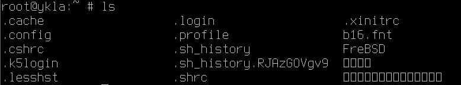

# 13.5 系统字体替换

良好的字体配置对于多语言环境（特别是中文）的正确显示至关重要。本节将介绍如何在 FreeBSD 系统中配置系统字体，包括图形界面字体和控制台字体的配置方法。

## GUI 图形界面字体

首先提取 Windows `C:\Windows\Fonts` 目录下的所有 `.ttf` 和 `.ttc` 字体文件。对于 macOS 的字体，需要进行特殊处理，尽管其文件格式也为 `.ttf`。

为便于管理新字体，创建一个目录存放 Windows 字体：

```sh
# mkdir -p /usr/local/share/fonts/WindowsFonts
```

将字体文件复制到 `WindowsFonts` 目录。

字体目录结构：

```sh
/usr/local/share/
└── fonts/
    └── WindowsFonts/ # Windows 字体存放目录
```

设置 Windows 字体目录及其内容的权限为 755：

```sh
# chmod -R 755 /usr/local/share/fonts/WindowsFonts
```

还需要刷新字体缓存：

```sh
# fc-cache
```

## TTY 中文控制台

FreeBSD 的新型终端 VT 原生支持 CJK 字符集（CJK 指中文、日文、韩文三种文字的统称，即中日韩统一表意文字），只需加载字体即可显示中文。

本节基于 FreeBSD 14.2-RELEASE。

字体格式为 `.fnt`（二进制字体文件，而非码表加 PNG 图片的组合），使用命令切换控制台字体为 test.fnt：

```sh
$ vidcontrol -f test.fnt
```

FreeBSD 基本系统提供了一款工具，可将 bdf 或 hex 格式转换为 fnt 文件：

```sh
$ vtfontcvt [ -h 高度 ] [ -v ] [ -w 宽度] 字体路径
```

- 示例：



```sh
# 下载 b16 字体文件
fetch https://people.freebsd.org/~emaste/newcons/b16.fnt

# 切换控制台字体为 b16
vidcontrol -f b16.fnt
```

> **技巧**
>
> 若上述链接失效，请访问 <https://github.com/FreeBSD-Ask/fnt-fonts> 下载字体。


上述命令为临时生效，若需永久生效，应将其加入 `/etc/rc.conf` 文件：

```ini
# 设置控制台所有屏幕使用 b16 字体
allscreens_flags="-f /root/b16.fnt"
```

### 故障排除与未竟事宜

#### 如何手动生成中文字体的 fnt 文件

[https://github.com/usonianhorizon/vt-fnt](https://github.com/usonianhorizon/vt-fnt) 提供的方法较难理解，可生成 bdf 文件，但会出现文中相同的报错。该项目探索了 FreeBSD 控制台字体的生成方法。文中提到的软件 FontForge 提供 Windows 版本，下载地址为 [https://fontforge.org/en-US/downloads/windows-dl/](https://fontforge.org/en-US/downloads/windows-dl/)，该页面提供 FontForge 字体编辑工具的 Windows 版本下载。

### 参考文献

- FreeBSD Project. rc.conf[EB/OL]. [2026-03-25]. <https://man.freebsd.org/cgi/man.cgi?query=rc.conf&sektion=5>. 该手册页详细说明了 rc.conf 系统配置文件的语法与选项。
- Mariusz. vidcontrol font and color via /etc/rc.conf problem[EB/OL]. [2026-03-25]. <https://forums.freebsd.org/threads/vidcontrol-font-and-color-via-etc-rc-conf-problem.81696/>. 该讨论帖探讨了控制台字体与颜色配置的相关问题。

## 课后习题

1. 从 Windows 系统提取字体文件并在 FreeBSD 中配置，测试多个 GTK 和 Qt 应用程序的字体显示效果。
2. 下载 bdf 或 hex 格式的字体文件，使用 vtfontcvt 工具将其转换为 fnt 格式，在控制台中测试显示效果。
3. 尝试使用第三方工具（如 vt-fnt）生成中文字体的 fnt 文件，验证其在 FreeBSD 控制台中的显示效果。
