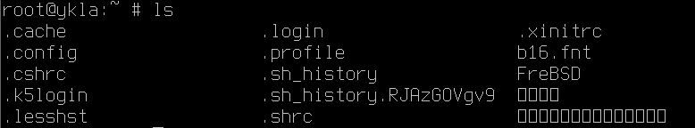
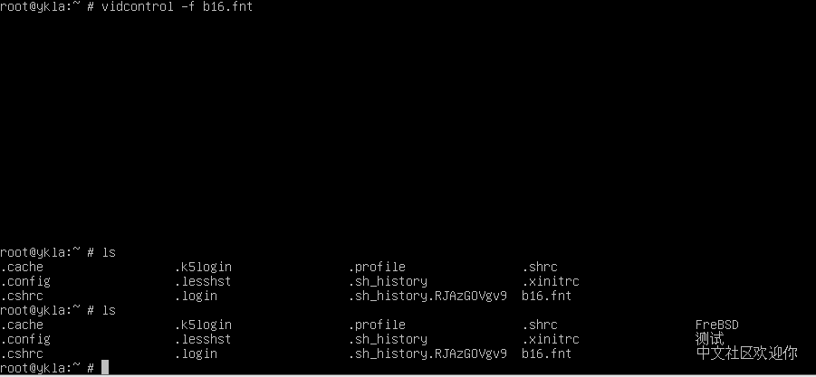

# 13.1 引导界面和虚拟控制台

## TTY 中文控制台

FreeBSD 新型终端 VT，原生支持 CJK，所以放入字体，即可显示中文。

本文基于 FreeBSD 14.2 RELEASE。

字体格式为 `.fnt`（并不是码表 + PNG 图片，而是二进制字体文件），命令：

```sh
$ vidcontrol -f test.fnt
```

FreeBSD 基本系统提供了一款工具，可用于将 bdf、hex 转换为 fnt：

```sh
$ vtfontcvt [ -h 高度 ] [ -v ] [ -w 宽度] [字体路径]
```

- 示例：




```sh
$ fetch https://people.freebsd.org/~emaste/newcons/b16.fnt
$ vidcontrol -f b16.fnt
```

>**技巧**
>
>若上述链接失效，请访问 <https://github.com/FreeBSD-Ask/fnt-fonts>



命令都是临时的，若要永久生效，将其加入 `/etc/rc.conf`:

```sh
allscreens_flags="-f /root/b16.fnt"
```

### 故障排除与未竟事宜

- 不知道如何手动生成中文字体的 fnt 文件。<https://github.com/usonianhorizon/vt-fnt> 方法看不懂，可以生成 bdf 文件，但是报错和他文中一样。里面提到的软件 FontForge  有 Windows 版本，下载路径在 <https://fontforge.org/en-US/downloads/windows-dl/>。

### 参考文献

- [rc.conf](https://man.freebsd.org/cgi/man.cgi?query=rc.conf&sektion=5)，此页搜索“allscreens_flags”
- [vidcontrol font and color via /etc/rc.conf problem](https://forums.freebsd.org/threads/vidcontrol-font-and-color-via-etc-rc-conf-problem.81696/)
- [Custom cjktty patches](https://github.com/zhmars/cjktty-patches)，Linux 中文 tty 内核补丁，作者似乎已经放弃维护了
- [Internationalizing the Kernel](https://www.linuxjournal.com/content/internationalizing-kernel)，Linus 言论出处


## 调整引导选择界面的时间为 2 秒

```sh
# ee /boot/loader.conf
```

修改：

```sh
autoboot_delay="2"
```

## 精简启动输出

```sh
# echo boot_mute="YES"  >> /boot/loader.conf # 启动显示一个 FreeBSD 的 Logo
# echo debug.acpi.disabled="thermal" >> /boot/loader.conf # 屏蔽可能存在的 ACPI 报错
# sysrc rc_startmsgs="NO" # 关闭进程启动信息
# sysrc dhclient_flags="-q" # 安静输出
# sysrc background_dhclient="YES" # 后台 DHCP
# sysrc synchronous_dhclient="YES" # 启动时同步 DHCP  
# sysrc defaultroute_delay="0" # 立即添加默认路由
# sysrc defaultroute_carrier_delay="1" # 接收租约时间为 1 秒
```


参考文献：

- [FreeBSD Desktop – Part 1 – Simplified Boot](https://vermaden.wordpress.com/2018/03/29/freebsd-desktop-part-1-simplified-boot/)
- [rc.conf -- system configuration information](https://man.freebsd.org/cgi/man.cgi?rc.conf(5))
- [acpi -- Advanced	Configuration and Power	Management support](https://man.freebsd.org/cgi/man.cgi?acpi(4))


## 屏幕保护

在默认情况下，控制台驱动程序在屏幕空闲时不会做任何特殊处理。如果你预计长时间让显示器保持开启并处于空闲状态，那么你应该启用其中某个屏幕保护程序以防止烧屏。

### `bsdconfig`

```sh
# bsdconfig
```

```sh
┌---------------------┤System Console Screen Saver├---------------------┐
│ By default, the console driver will not attempt to do anything        │
│ special with your screen when it's idle.  If you expect to leave your │
│ monitor switched on and idle for long periods of time then you should │
│ probably enable one of these screen savers to prevent burn-in.        │
│ ┌-------------------------------------------------------------------┐ │
│ │   1 None    Disable the screensaver                               │ │
│ │   2 Blank   Blank screen                                          │ │
│ │   3 Beastie "BSD Daemon" animated screen saver (graphics)         │ │
│ │   4 Daemon  "BSD Daemon" animated screen saver (text)             │ │
│ │   5 Dragon  Dragon screensaver (graphics)                         │ │
│ │   6 Fade    Fade out effect screen saver                          │ │
│ │   7 Fire    Flames effect screen saver                            │ │
│ │   8 Green   "Green" power saving mode (if supported by monitor)   │ │
│ │   9 Logo    FreeBSD "logo" animated screen saver (graphics)       │ │
│ │   a Rain    Rain drops screen saver                               │ │
│ │   b Snake   Draw a FreeBSD "snake" on your screen                 │ │
│ │   c Star    A "twinkling stars" effect                            │ │
│ │   d Warp    A "stars warping" effect                              │ │
│ │   Timeout   Set the screen saver timeout interval                 │ │
│ └-------------------------------------------------------------------┘ │
├-----------------------------------------------------------------------┤
│                         [  OK  ]     [Cancel]                         │
└----------------- Choose a nifty-looking screen saver -----------------┘


```

| 菜单 | 解释 |
| --- | --- |
| 1 None Disable the screensaver | 1 无 禁用屏幕保护程序 |
| 2 Blank Blank screen | 2 空白 显示空白屏幕 |
| 3 Beastie "BSD Daemon" animated screen saver (graphics) | 3 Beastie "BSD Daemon" 动画屏幕保护程序（图形） |
| 4 Daemon "BSD Daemon" animated screen saver (text) | 4 Daemon "BSD Daemon" 动画屏幕保护程序（文字） |
| 5 Dragon Dragon screensaver (graphics) | 5 龙 动画屏幕保护程序（图形） |
| 6 Fade Fade out effect screen saver | 6 淡出 屏幕保护程序淡出效果 |
| 7 Fire Flames effect screen saver | 7 火焰 火焰效果屏幕保护程序 |
| 8 Green "Green" power saving mode (if supported by monitor) | 8 绿色“绿色”省电模式（如果显示器支持） |
| 9 Logo FreeBSD "logo" animated screen saver (graphics) | 9 标志 FreeBSD“logo”动画屏幕保护程序（图形） |
| a Rain Rain drops screen saver | a 雨滴 雨滴屏幕保护程序 |
| b Snake Draw a FreeBSD "snake" on your screen | b 蛇 在屏幕上绘制 FreeBSD“蛇” |
| c Star A "twinkling stars" effect | c 星星 闪烁星星效果 |
| d Warp A "stars warping" effect | d 扭曲 星星扭曲效果 |
| Timeout Set the screen saver timeout interval | 超时 设置屏幕保护程序超时时间 |


选择屏保图片：主菜单中的 `7 Console`——> `5 Saver     Configure the screen saver`——> 此处我选择 `3 Beastie "BSD Daemon" animated screen saver (graphics)`。

设定屏幕超时时间：主菜单中的 `7 Console`——> `5 Saver     Configure the screen saver`——> `Timeout   Set the screen saver timeout interval`，单位是秒。

### 手动写入

编辑 `/etc/rc.conf`

```sh
saver="beastie" # 选择屏保图片
blanktime="300" # 屏幕超时时间
```

有哪些图片可选：


```sh
root@ykla:~ # ls /boot/kernel/*saver*
/boot/kernel/beastie_saver.ko	/boot/kernel/fire_saver.ko	/boot/kernel/snake_saver.ko
/boot/kernel/blank_saver.ko	/boot/kernel/green_saver.ko	/boot/kernel/star_saver.ko
/boot/kernel/daemon_saver.ko	/boot/kernel/logo_saver.ko	/boot/kernel/warp_saver.ko
/boot/kernel/dragon_saver.ko	/boot/kernel/plasma_saver.ko
/boot/kernel/fade_saver.ko	/boot/kernel/rain_saver.ko
```

## 调整引导界面和 TTY 分辨率


### 修改“gop”（通用方法）

在出来 FreeBSD 菜单的时候，按下 **ESC** 键，脱离引导。会出现提示符 `OK`。输入 `gop list` 可以看到所有支持的分辨率列表：


```sh
OK gop list
mode 0: 1920x1080x32, stride=1920
mode 1: 640x480x32, stride=640
mode 2: 800x600x32, stride=800
mode 3: 1024x768x32, stride=1024
mode 4: 1280x720x32, stride=1280
mode 5: 1280x1024x32, stride=1280
```

我这里选择 `mode 0`，先测一下效果：

```sh
OK gop set 0
```

当即立现。

如果合适，继续引导：

```sh
OK menu
```


将配置写进 `/boot/loader.conf`：

```sh
exec="gop set 0"
```


### `efi_max_resolution`（UEFI）或 `vbe_max_resolution`（BIOS）

根据文档 [LOADER.CONF(5)](https://man.freebsd.org/cgi/man.cgi?loader.conf(5))，两个变量接受以下值：

```sh
值	           分辨率
480p	        640x480
720p	        1280x720
1080p	       1920x1080
1440p	       2560x1440
2160p	       3840x2160
4k	          3840x2160
5k	          5120x2880
宽 x 高        宽 x 高
```

本文测试使用 `efi_max_resolution`：

将 `efi_max_resolution="1080p"` 写入 `/boot/loader.conf`，重启后效果与 gop 方法一致。

#### 参考文献

- [gop set \< mode \> being ignored in /boot/loader.conf](https://forums.freebsd.org/threads/gop-set-mode-being-ignored-in-boot-loader-conf.77779/)，`efi_max_resolution` 方法参考本文
- [How to find the valid values of efi_max_resolution](https://forums.freebsd.org/threads/how-to-find-the-valid-values-of-efi_max_resolution.84840/)，gop 方法参考本文，里面有个动图有点用

## 自定义引导加载程序 Logo

根据 man 页面 [BEASTIE.4TH(8)](https://man.freebsd.org/cgi/man.cgi?query=beastie.4th&sektion=8&manpath=FreeBSD)，默认有几种 logo 可选：

- `fbsdbw`
- `beastie`
- `beastiebw`
- `orb`（14.2 中默认，UEFI 下）
- `orbbw`
- `none`（无 Logo）
  
以 `fbsdbw` 为例，在 `/boot/loader.conf` 写入

```sh
loader_logo="fbsdbw"
```

重启效果：


### 参考文献

- [customize boot loader logo](https://forums.freebsd.org/threads/customize-boot-loader-logo.72903/)。本文主要来自此处
- [How to change the FreeBSD logo which appears as soon it boots with that of the little devil.](https://forums.freebsd.org/threads/how-to-change-the-freebsd-logo-which-appears-as-soon-it-boots-with-that-of-the-little-devil.85934/)，试过了一样不生效退回原 logo。
- [loader: Load a splash screen if "splash" variable is defined](https://reviews.freebsd.org/D45932)，可能有用，但是试过了也不行
