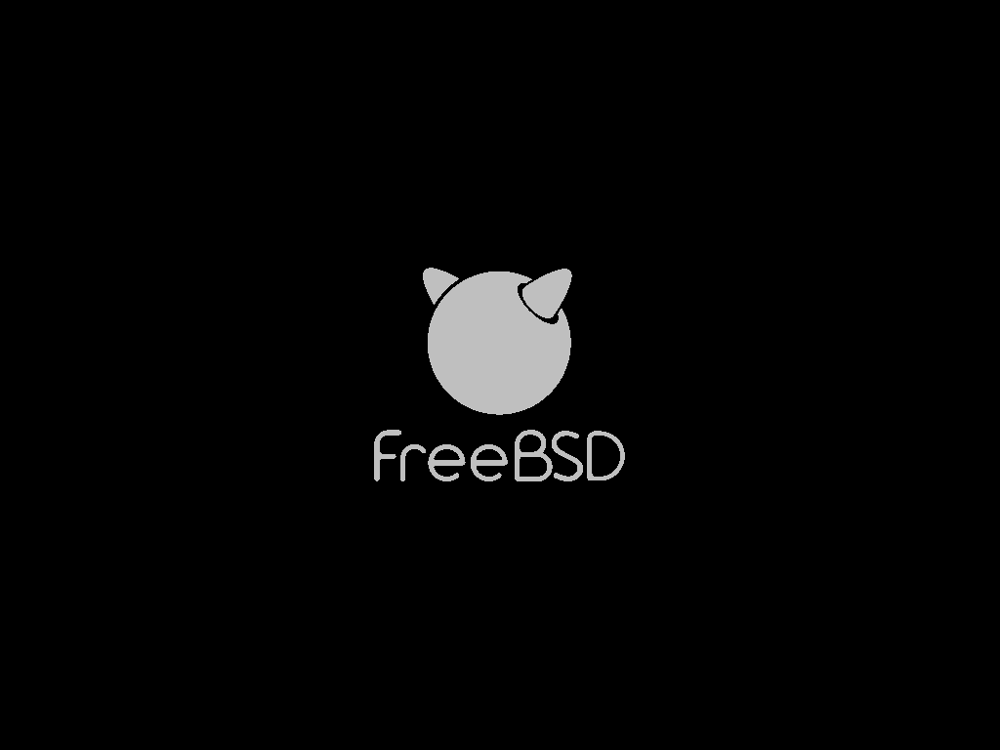
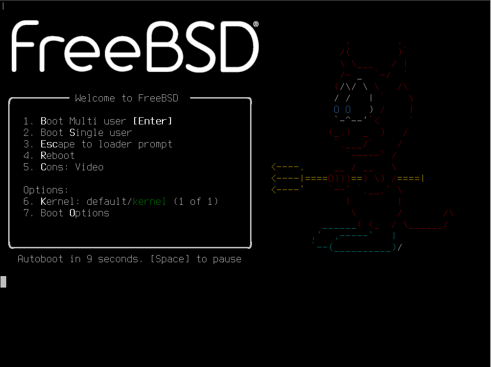
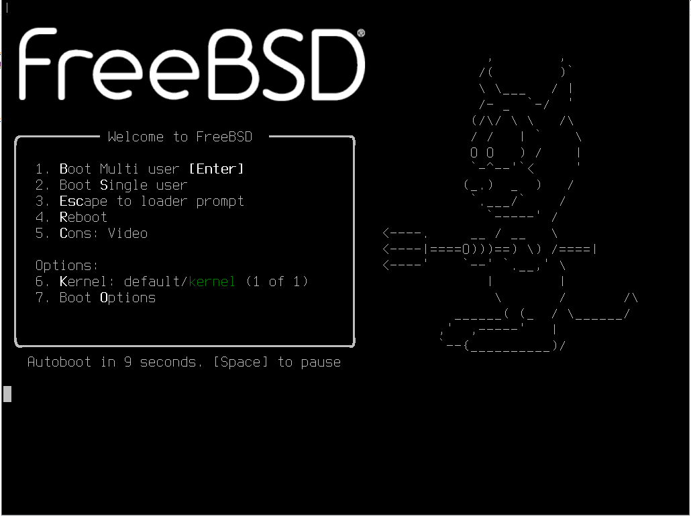
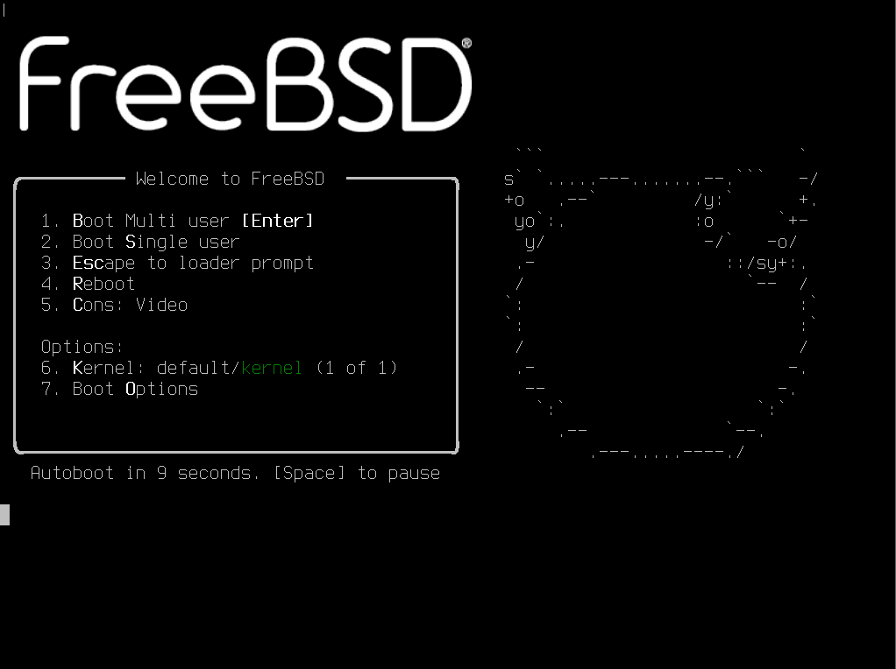

# 13.1 启动引导器及配置文件（loader.conf）

## loader.conf 的功能定位与文件结构

根据 [loader.conf(5)](https://man.freebsd.org/cgi/man.cgi?query=loader.conf) 手册页所述，loader.conf 是 FreeBSD 系统引导过程中的核心配置文件。该文件在引导加载器 loader(8) 阶段被读取，用于指定要启动的内核、传递给内核的参数以及需要加载的附加模块，同时可设置 loader(8) 支持的所有变量。

loader.conf(5) 相关的文件结构如下：

```sh
/
└── boot/ 操作系统引导过程中使用的程序和配置文件
     ├── loader.conf 用户定义设置
     ├── loader.conf.lua 使用 Lua 编写的用户定义设置（默认不存在）
     ├── loader.conf.d/ 用户定义设置的子目录（默认为空）
     │    ├── *.conf 拆分成多个文件的用户定义设置（默认不存在）
     │    └── *.lua 使用 Lua 编写并拆分成多个文件的用户定义设置（默认不存在）
     ├── loader.conf.local 机器特定设置，可覆盖其他配置文件中的设置（默认不存在）
     └── defaults/ 存放默认引导配置文件
          └── loader.conf 默认设置文件（请勿直接修改），参见 loader.conf(5)
```

loader.conf 是系统启动配置的关键文件，位于 `/boot/loader.conf` 文件。写入此处的配置比 `rc.conf` 文件 更早生效，但不当配置可能会妨碍系统正常启动。详细说明请参考 [loader.conf](https://man.freebsd.org/cgi/man.cgi?query=loader.conf) 手册页。

> **技巧**
>
> 不建议直接修改 `/boot/defaults/loader.conf` 文件。如需自定义配置，应使用 `/boot/loader.conf` 文件或 `/boot/loader.conf.local` 文件进行本地配置扩展。其中 `/boot/loader.conf.local` 文件优先级最高，专门用于机器特定设置。

## ZFS 标准安装场景下的 loader.conf 配置内容

在 ZFS 标准安装方案中，`/boot/loader.conf` 文件通常包含以下配置内容（以 15.0-RELEASE 为例）：

```ini
kern.geom.label.disk_ident.enable="0"     # 禁用 disk_ident 标签，形如 /dev/diskid/DISK-S3Z4NB0K123456（硬件序列号）
kern.geom.label.gptid.enable="0"     # 禁用基于磁盘序列号生成的设备名，形如 /dev/gptid/3f6c3a3e-4bcb-11ee-8e6d-001b217e6c8a（GPT UUID）
zfs_enable="YES"     # 默认加载 zfs 模块
```

该文件由 bsdinstall(8) 安装程序在系统安装过程中自动写入。具体而言，[usr.sbin/bsdinstall/scripts/zfsboot](https://github.com/freebsd/freebsd-src/blob/e6d579be42550f366cc85188b15c6eb0cad27367/usr.sbin/bsdinstall/scripts/zfsboot#L1385) 脚本会分别写入 `kern.geom.label.disk_ident.enable="0"`、`kern.geom.label.gptid.enable="0"` 和 `zfs_enable="YES"` 这三行配置。因此在使用 ZFS 标准安装方案的系统中，这三行即是 `/boot/loader.conf` 文件的全部初始内容。

## 默认配置文件的内容结构与说明

默认配置文件位于源代码中的 [stand/defaults/loader.conf](https://github.com/freebsd/freebsd-src/blob/main/stand/defaults/loader.conf)。以下内容基于版本 [loader.conf.5: "console" setting does not document multi-value possiblity](https://github.com/freebsd/freebsd-src/commit/240c614d48cb0484bfe7876decdf6bbdcc99ba73)：

```ini
# 这是 loader.conf —— 一个包含许多实用变量的文件
# 你可以通过设置这些变量来改变系统的默认加载行为。
# 你不应该直接编辑此文件！
# 请把任何要覆盖的设置放入 loader_conf_files 中的某个文件里
# 这样以后在更新这些默认值时，就不会影响你的原生配置信息。

#
# 所有参数都必须使用双引号。
#

###  基础配置选项  ############################
# 执行命令，在屏幕上打印“Loading /boot/defaults/loader.conf”这句话
exec="echo Loading /boot/defaults/loader.conf"     # （正在加载 /boot/defaults/loader.conf）

# 内核设置
kernel="kernel"		# /boot 子目录，包含内核和模块。
bootfile="kernel"	# 内核名称（可以是绝对路径）
kernel_options=""	# 传递给内核的标志

# 引导启动器配置文件配置
loader_conf_files="/boot/device.hints /boot/loader.conf"   # loader 默认读取的配置文件列表
loader_conf_dirs="/boot/loader.conf.d"                     # loader 读取的配置目录，将加载该目录中的 *.conf 和 *.lua 文件
local_loader_conf_files="/boot/loader.conf.local"          # 本机专用配置文件，可覆盖其他配置文件中的设置
nextboot_conf="/boot/nextboot.conf"                        # 下一次启动使用的临时配置文件
verbose_loading="NO"		# 设置为 YES 将启用详细的引导输出

###  启动画面配置  ############################
# 启动 Logo 设置
splash_bmp_load="NO"		# 设置为 YES 将启用 bmp 启动画面
splash_pcx_load="NO"		# 设置为 YES 将启用 pcx 启动画面
splash_txt_load="NO"		# 设置为 YES 将启用 TheDraw 启动画面
vesa_load="NO"			# 设置为 YES 将加载 vesa 模块
bitmap_load="NO"		# 如果想使用启动画面，请设置为 YES
bitmap_name="splash.bmp"	# 设置为文件名
bitmap_type="splash_image_data" # 并将其放在 module_path 中
splash="/boot/images/freebsd-logo-rev.png"  # 再设置 boot_mute=YES 将加载它

###  屏幕保护模块  ###################################
# 最好在 rc.conf 中设置这些屏保
screensave_load="NO"		# 设置为 YES 将加载屏幕保护程序模块
screensave_name="green_saver"	# 设置要使用的屏幕保护程序模块名称

###  早期 hostid 配置 ############################
# 这台机器的唯一标识
hostuuid_load="YES"        # 设置为 YES 来加载 hostuuid 模块
hostuuid_name="/etc/hostid" # 指定 hostid 文件路径
hostuuid_type="hostuuid"   # 指定模块类型为 hostuuid

###  随机数生成配置  ##################
# 适用于密码模块，随机数生成
# 参见 rc.conf(5)。rc.conf 中 entropy_boot_file 配置变量必须与下面的设置相同
# rc.conf 中的 entropy_boot_file 和 loader.conf 中的 entropy_cache_name 必须指定同一个文件
entropy_cache_load="YES"		# 设置为 NO 将禁用在启动时加载缓存的熵
entropy_cache_name="/boot/entropy"	# 设置为该文件的名称
entropy_cache_type="boot_entropy_cache"	# 内核查找启动时熵缓存所必需的类型。即使上面的 _name 发生变化，这个值也绝不能改变！
entropy_efi_seed="YES"			# 设置为 NO 将禁用从 UEFI 硬件随机数生成器 API 加载熵
entropy_efi_seed_size="2048"		# 设置为其他值以改变从 EFI 请求的熵数量


###  内存黑名单配置  ############################
# 屏蔽坏内存地址用，适用于服务器
ram_blacklist_load="NO"			# 设置为 YES 可加载一个文件，该文件包含需要从运行系统中排除的地址列表
ram_blacklist_name="/boot/blacklist.txt" # 设置为该文件的名称
ram_blacklist_type="ram_blacklist"	# 内核查找黑名单模块所必需的类型

###  微码加载配置  ########################
# 处理器微码配置
cpu_microcode_load="NO"			# 设置为 YES 以在启动时加载并应用微码更新文件
cpu_microcode_name="/boot/firmware/ucode.bin" # 设置为微码更新文件路径
cpu_microcode_type="cpu_microcode"	# 内核查找微码更新文件所必需的类型

###  ACPI 设置  ##########################################
acpi_dsdt_load="NO"		# DSDT 覆盖
acpi_dsdt_type="acpi_dsdt"	# 请勿修改此项
acpi_dsdt_name="/boot/acpi_dsdt.aml"     # 使用此文件覆盖 BIOS 中的 DSDT
acpi_video_load="NO"		# ACPI 视频扩展驱动

###  审计设置  #########################################
# 安全审计系统的事件定义预加载配置
audit_event_load="NO"		# 设置为 YES 将在启动早期预加载 audit_event 配置文件
audit_event_name="/etc/security/audit_event" # 指定 audit_event 配置文件路径
audit_event_type="etc_security_audit_event"  # 内核查找并识别该配置文件所需的类型

### 初始内存磁盘设置 ###########################
# 内存盘设置
#mdroot_load="YES"		# “mdroot” 前缀可任意修改
#mdroot_type="md_image"		# 在启动时创建 md(4) 内存磁盘
#mdroot_name="/boot/root.img"	# 指向包含磁盘镜像的文件路径
#rootdev="ufs:/dev/md0"		# 将根文件系统设置为 md(4) 设备

###  引导设置  ########################################
#loader_delay="3"		# 在加载任何内容前延迟的秒数。默认未设置且禁用（无延迟）
#autoboot_delay="10"		# 自动启动前延迟的秒数，-1 表示禁止用户中断，NO 表示禁用
#print_delay="1000000"		# loader 消息的慢速打印，便于调试。单位为微秒（1000000 微秒 = 1 秒）
#password=""			# 修改启动选项的密码，避免修改启动选项
#bootlock_password=""		# 设置启动锁定密码，避免未授权启动（参见 check-password.4th(8)）
#geom_eli_passphrase_prompt="NO" # 是否提示：输入 geli(8) 密码来挂载根文件系统
bootenv_autolist="YES"		# 自动填充 ZFS 启动环境列表
#beastie_disable="NO"		# 是否启用 Beastie（小恶魔）启动菜单
efi_max_resolution="1x1"	# 设置 EFI 引导下使用的最大分辨率：可选 480p、720p、1080p、1440p、2160p/4k、5k；自定义宽 x 高（例如 1920x1080）
#kernels="kernel kernel.old"	        # 在启动菜单中显示的内核列表
kernels_autodetect="YES"	        # 自动检测 /boot 中的内核目录
#loader_gfx="YES"		        # 当图形可用时使用图形界面
#loader_logo="orbbw"		        # 可选启动 Logo 有：orbbw、orb、fbsdbw、beastiebw、beastie、none
#comconsole_speed="115200"	        # 设置当前串口控制台速率
#console="vidconsole"		        # 以逗号（,）或空格（ ）分隔的控制台列表
#currdev="disk1s1a"		        # 设置当前设备
module_path="/boot/modules;/boot/firmware;/boot/dtb;/boot/dtb/overlays"  # 设置模块搜索路径
module_blacklist="drm drm2 radeonkms i915kms amdgpu if_iwlwifi if_rtw88 if_rtw89"  # 引导器模块黑名单
module_blacklist="${module_blacklist} nvidia nvidia-drm nvidia-modeset"        # 追加黑名单模块
#prompt="\\${interpret}"		        # 设置 loader 命令提示符
#root_disk_unit="0"		        # 强制设置根磁盘单元号
#rootdev="disk1s1a"		        # 设置根文件系统
#dumpdev="disk1s1b"		        # 在启动早期设置 dump 设备
#tftp.blksize="1428"		        # 设置 RFC 2348 TFTP 块大小。若 TFTP 服务器不支持 RFC 2348，则块大小为 512 有效值范围：(8,9007)
#twiddle_divisor="16"		        # 减慢进度指示器 < 16 < 加快进度指示器

###  内核设置  ########################################
# 以下 boot_ 变量通过赋值来启用
# 它们在内核环境中存在（参见 kenv(1)）时，效果与设置对应的启动标志相同（参见 boot(8)）。
#boot_askname=""	# -a：提示用户输入根设备名称
#boot_cdrom=""		# -C：尝试从 CD-ROM 光学介质挂载根文件系统
#boot_ddb=""		# -d：指示内核通过 DDB 调试器模式启动
#boot_dfltroot=""	# -r：使用静态配置的根文件系统
#boot_gdb=""		# -g：为内核调试器选择 gdb-remote 模式
#boot_multicons=""	# -D：使用多个控制台
#boot_mute=""		# -m：静默控制台
#boot_pause=""		# -p：在设备探测时每行暂停
#boot_serial=""		# -h：使用串口控制台
#boot_single=""		# -s：以单用户模式启动系统
#boot_verbose=""	# -v：打印额外调试信息
#init_path="/sbin/init:/sbin/oinit:/sbin/init.bak:/rescue/init"     # 设置 init 的候选路径列表
#init_shell="/bin/sh"	# init(8) 使用的 shell 二进制文件
#init_script=""		# init(8) 在 chroot 前运行的初始脚本
#init_chroot=""		# init(8) 要 chroot 的目录

###  内核可调参数  ########################################
#hw.physmem="1G"		# 限制物理内存大小。参见 loader(8)
#kern.dfldsiz=""		# 设置初始数据段大小限制
#kern.dflssiz=""		# 设置初始堆栈大小限制
#kern.hz="100"			# 设置内核时间间隔定时器频率
#kern.maxbcache=""		# 设置最大缓冲区缓存 KVA 存储
#kern.maxdsiz=""		# 设置最大数据段大小
#kern.maxfiles=""		# 设置系统全局最大打开文件数
#kern.maxproc=""		# 设置最大进程数
#kern.maxssiz=""		# 设置最大堆栈大小
#kern.maxswzone=""		# 设置最大交换元 KVA 存储
#kern.maxtsiz=""		# 设置最大文本段大小
#kern.maxusers="32"		# 设置各种静态表的大小
#kern.msgbufsize="65536"	# 设置内核消息缓冲区大小
#kern.nbuf=""			# 设置缓冲区头数量
#kern.ncallout=""		# 设置最大定时器事件数量
#kern.ngroups="1023"		# 设置最大附加组数
#kern.sgrowsiz=""		# 设置堆栈增长量
#kern.cam.boot_delay="10000"	# 根挂载时 CAM 总线注册延迟（毫秒），当 USB 设备作为根分区时有用
#kern.cam.scsi_delay="2000"	# 扫描 SCSI 前的延迟（毫秒）
#kern.ipc.maxsockets=""		# 设置最大可用套接字数量
#kern.ipc.nmbclusters=""	# 设置 mbuf 集群数量
#kern.ipc.nsfbufs=""		# 设置 sendfile(2) 缓冲区数量
#net.inet.tcp.tcbhashsize=""	# 设置 TCBHASHSIZE 值（TCP 控制块哈希表的大小）
#vfs.root.mountfrom=""		# 指定根分区
#vm.kmem_size=""		# 设置内核内存大小（字节）
#debug.kdb.break_to_debugger="0" # 允许控制台进入调试器
#debug.ktr.cpumask="0xf"	# 启用 KTR 的 CPU 位掩码
#debug.ktr.mask="0x1200"	# 启用的 KTR 事件位掩码
#debug.ktr.verbose="1"		# 启用 KTR 事件的控制台输出

### 模块加载语法示例  ##########################
#module_load="YES"		# 加载模块 "module"
#module_name="realname"		# 使用 "realname" 替代 "module"
#module_type="type"		# 加载时传递 "-t type"
#module_flags="flags"		# 传递 "flags" 给模块
#module_before="cmd"		# 在加载模块前执行 "cmd" 命令
#module_after="cmd"		# 在加载模块后执行 "cmd"
#module_error="cmd"		# 模块加载失败时执行 "cmd"

### 固件名称映射列表
# 在加载网卡驱动时内核会寻找对应的固件文件
iwm3160fw_type="firmware"   # iwm3160 固件类型
iwm7260fw_type="firmware"   # iwm7260 固件类型
iwm7265fw_type="firmware"   # iwm7265 固件类型
iwm8265fw_type="firmware"   # iwm8265 固件类型
iwm9260fw_type="firmware"   # iwm9260 固件类型
iwm3168fw_type="firmware"   # iwm3168 固件类型
iwm7265Dfw_type="firmware"  # iwm7265D 固件类型
iwm8000Cfw_type="firmware"  # iwm8000C 固件类型
iwm9000fw_type="firmware"   # iwm9000 固件类型
```

## 配置引导选择界面的等待时间

引导选择界面的等待时间由 `autoboot_delay` 参数控制，该参数定义了系统在自动启动默认内核前等待用户干预的时长。通过修改此参数，可以根据实际需求调整启动流程的用户交互窗口。

要调整等待时间，编辑 `/boot/loader.conf` 文件并新增以下条目：

```ini
autoboot_delay="2"
```

参数说明：`2` 表示设置系统启动自动引导延迟为 2 秒。

## 精简启动输出信息

精简系统启动输出信息可以使启动过程更加简洁。这可以通过多维度配置实现：在引导器层面减少内核加载信息，在服务启动阶段关闭状态提示，在网络配置中优化等待逻辑。以下配置从引导到多用户启动阶段逐步减少输出信息。

```sh
# echo boot_mute="YES"  >> /boot/loader.conf # 静默启动并显示 Logo
# echo debug.acpi.disabled="thermal" >> /boot/loader.conf # 屏蔽可能存在的 ACPI 报错
# sysrc rc_startmsgs="NO" # 关闭进程启动信息
# sysrc dhclient_flags="-q" # 安静输出
# sysrc background_dhclient="YES" # 后台 DHCP
# sysrc synchronous_dhclient="YES" # 启动时同步 DHCP
# sysrc defaultroute_delay="0" # 立即添加默认路由
# sysrc defaultroute_carrier_delay="1" # 接收租约时间为 1 秒
```

如下图所示，设置后可看到 FreeBSD 启动 Logo。




参考文献：

- vermaden. FreeBSD Desktop – Part 1 – Simplified Boot[EB/OL]. (2018-03-29)[2026-03-26]. <https://vermaden.wordpress.com/2018/03/29/freebsd-desktop-part-1-simplified-boot/>.
- FreeBSD Project. rc.conf(5)[EB/OL]. [2026-03-26]. <https://man.freebsd.org/cgi/man.cgi?rc.conf(5)>.
- FreeBSD Project. acpi(4)[EB/OL]. [2026-03-26]. <https://man.freebsd.org/cgi/man.cgi?acpi(4)>.

## 控制台屏幕保护程序的配置与应用

默认情况下，控制台驱动程序在屏幕空闲时不会执行任何特殊处理。如果预计长时间让显示器保持开启并处于空闲状态，应启用屏幕保护程序以防止烧屏。

## 使用 bsdconfig 配置屏幕保护程序

可以通过 `bsdconfig` 工具配置屏幕保护程序：

```sh
# bsdconfig
```

执行命令后，将显示如下界面：

```sh
┌---------------------┤System Console Screen Saver├---------------------┐
│ By default, the console driver will not attempt to do anything        │
│ special with your screen when it's idle.  If you expect to leave your │
│ monitor switched on and idle for long periods of time then you should │
│ probably enable one of these screen savers to prevent burn-in.        │
│ ┌-------------------------------------------------------------------┐ │
│ │   1 None    Disable the screensaver                               │ │
│ │   2 Blank   Blank screen                                          │ │
│ │   3 Beastie "BSD Daemon" animated screen saver (graphics)         │ │
│ │   4 Daemon  "BSD Daemon" animated screen saver (text)             │ │
│ │   5 Dragon  Dragon screensaver (graphics)                         │ │
│ │   6 Fade    Fade out effect screen saver                          │ │
│ │   7 Fire    Flames effect screen saver                            │ │
│ │   8 Green   "Green" power saving mode (if supported by monitor)   │ │
│ │   9 Logo    FreeBSD "logo" animated screen saver (graphics)       │ │
│ │   a Rain    Rain drops screen saver                               │ │
│ │   b Snake   Draw a FreeBSD "snake" on your screen                 │ │
│ │   c Star    A "twinkling stars" effect                            │ │
│ │   d Warp    A "stars warping" effect                              │ │
│ │   Timeout   Set the screen saver timeout interval                 │ │
│ ┌-------------------------------------------------------------------┐ │
├-----------------------------------------------------------------------┤
│                         [  OK  ]     [Cancel]                         │
└----------------- Choose a nifty-looking screen saver -----------------┘
```

| 菜单 | 说明 |
| ---- | ---- |
| 1 None Disable the screensaver | 1 无 禁用屏幕保护程序 |
| 2 Blank Blank screen | 2 空白 显示空白屏幕 |
| 3 Beastie "BSD Daemon" animated screen saver (graphics) | 3 Beastie "BSD Daemon" 动画屏幕保护程序（图形） |
| 4 Daemon "BSD Daemon" animated screen saver (text) | 4 Daemon "BSD Daemon" 动画屏幕保护程序（文字） |
| 5 Dragon Dragon screensaver (graphics) | 5 龙 动画屏幕保护程序（图形） |
| 6 Fade Fade out effect screen saver | 6 淡出 屏幕保护程序淡出效果 |
| 7 Fire Flames effect screen saver | 7 火焰 火焰效果屏幕保护程序 |
| 8 Green "Green" power saving mode (if supported by monitor) | 8 绿色“绿色”省电模式（如果显示器支持） |
| 9 Logo FreeBSD "logo" animated screen saver (graphics) | 9 标志 FreeBSD“logo”动画屏幕保护程序（图形） |
| a Rain Rain drops screen saver | a 雨滴 雨滴屏幕保护程序 |
| b Snake Draw a FreeBSD "snake" on your screen | b 蛇 在屏幕上绘制 FreeBSD“蛇” |
| c Star A "twinkling stars" effect | c 星星 闪烁星星效果 |
| d Warp A "stars warping" effect | d 扭曲 星星扭曲效果 |
| Timeout Set the screen saver timeout interval | 超时 设置屏幕保护程序超时时间 |

选择屏保图片：在主菜单中选择 `7 Console`，然后选择 `5 Saver     Configure the screen saver`，此处选择 `3 Beastie "BSD Daemon" animated screen saver (graphics)`。

设定屏幕超时时间：在主菜单中选择 `7 Console`，然后选择 `5 Saver     Configure the screen saver`，再选择 `Timeout   Set the screen saver timeout interval`，单位是秒。

### 手动写入配置

也可以通过手动编辑配置文件来设置屏幕保护程序。编辑 `/etc/rc.conf` 文件，添加以下配置：

```ini
saver="beastie" # 选择屏保图片
blanktime="300" # 屏幕超时时间
```

可选的屏幕保护图片模块如下：

```sh
# ls /boot/kernel/*saver*
/boot/kernel/beastie_saver.ko	/boot/kernel/fire_saver.ko	/boot/kernel/snake_saver.ko
/boot/kernel/blank_saver.ko	/boot/kernel/green_saver.ko	/boot/kernel/star_saver.ko
/boot/kernel/daemon_saver.ko	/boot/kernel/logo_saver.ko	/boot/kernel/warp_saver.ko
/boot/kernel/dragon_saver.ko	/boot/kernel/plasma_saver.ko
/boot/kernel/fade_saver.ko	/boot/kernel/rain_saver.ko
```

## 调整引导界面和 TTY 分辨率

### 修改“gop”（通用方法）

在出现 FreeBSD 菜单时，按 **ESC** 键退出引导，出现提示符 `OK`。输入 `gop list` 可查看所有支持的分辨率列表：

```sh
OK gop list
mode 0: 1920x1080x32, stride=1920   # 显示模式 0，分辨率 1920x1080，颜色深度 32 位，行跨度 1920
mode 1: 640x480x32, stride=640       # 显示模式 1，分辨率 640x480，颜色深度 32 位，行跨度 640
mode 2: 800x600x32, stride=800       # 显示模式 2，分辨率 800x600，颜色深度 32 位，行跨度 800
mode 3: 1024x768x32, stride=1024     # 显示模式 3，分辨率 1024x768，颜色深度 32 位，行跨度 1024
mode 4: 1280x720x32, stride=1280     # 显示模式 4，分辨率 1280x720，颜色深度 32 位，行跨度 1280
mode 5: 1280x1024x32, stride=1280    # 显示模式 5，分辨率 1280x1024，颜色深度 32 位，行跨度 1280
```

此处选择 `mode 0` 进行效果测试：

```sh
OK gop set 0
```

效果会立即显示。

确认效果合适后，继续引导：

```sh
OK menu
```

该命令表示操作确认或进入菜单界面。

将该配置写入 `/boot/loader.conf` 文件，设置 GOP 模式为 0：

```ini
exec="gop set 0"
```

### `efi_max_resolution`（UEFI）或 `vbe_max_resolution`（BIOS）

也可以通过配置文件设置 UEFI 或 BIOS 下的分辨率。根据文档 [LOADER.CONF(5)](https://man.freebsd.org/cgi/man.cgi?loader.conf(5))，这两个变量可接受以下值：

```sh
值	           分辨率
480p	        640x480
720p	        1280x720
1080p	       1920x1080
1440p	       2560x1440
2160p	       3840x2160
4k	          3840x2160
5k	          5120x2880
宽 x 高        宽 x 高
```

本文测试使用 `efi_max_resolution` 变量：将 `efi_max_resolution="1080p"` 写入 `/boot/loader.conf` 文件，重启后效果与 gop 方法一致。

### 参考文献

- FreeBSD Forums. gop set < mode > being ignored in /boot/loader.conf[EB/OL]. [2026-03-26]. <https://forums.freebsd.org/threads/gop-set-mode-being-ignored-in-boot-loader-conf.77779/>.
- FreeBSD Forums. How to find the valid values of efi_max_resolution[EB/OL]. [2026-03-26]. <https://forums.freebsd.org/threads/how-to-find-the-valid-values-of-efi_max_resolution.84840/>.

## 自定义引导加载程序 Logo

可以自定义引导加载程序的 Logo 以个性化系统启动界面。根据 man 页面 [BEASTIE.4TH(8)](https://man.freebsd.org/cgi/man.cgi?query=beastie.4th&sektion=8&manpath=FreeBSD)，默认有几种 Logo 可选：

- `fbsdbw`
- `beastie`
- `beastiebw`
- `orb`（14.2 中默认，UEFI 下）
- `orbbw`
- `none`（无 Logo）

以 `fbsdbw` 为例，在 `/boot/loader.conf` 文件中写入：

```ini
# 设置启动加载器使用的 logo 名称为 fbsdbw
loader_logo="fbsdbw"
```

重启后效果如下：










### 参考文献

- FreeBSD Forums. customize boot loader logo[EB/OL]. [2026-03-26]. <https://forums.freebsd.org/threads/customize-boot-loader-logo.72903/>.
- FreeBSD Forums. How to change the FreeBSD logo which appears as soon it boots with that of the little devil[EB/OL]. [2026-03-26]. <https://forums.freebsd.org/threads/how-to-change-the-freebsd-logo-which-appears-as-soon-it-boots-with-that-of-the-little-devil.85934/>.
- FreeBSD Project. loader: Load a splash screen if "splash" variable is defined[EB/OL]. [2026-03-26]. <https://reviews.freebsd.org/D45932>.

## 课后习题

1. 修改 `autoboot_delay` 为 0 并启用 `boot_mute`，对比两次系统启动的输出差异，分析引导器这种设计如何在用户体验和调试需求之间做权衡。

2. 查找 `/boot/loader.conf.d/` 目录的加载机制源码，创建一个自定义配置文件并验证其优先级，思考这种分散配置设计如何影响系统管理员的控制权。

3. 自定义一张 BMP 格式的启动 Logo，尝试替代默认 Logo 并分析加载过程，记载到本文。
