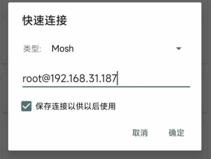
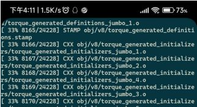

# 13.4 SSH 配置和相关工具

SSH 即 Secure Shell（安全 shell），是一种通过加密方式安全使用 shell 的方法，通常用于远程登录和管理系统。

## SSH 工具

FreeBSD 自带 SSH 客户端，可用于连接其他已安装 SSH 服务的设备，使用方法如下：

```sh
$ ssh 用户名@IP:端口
```

如使用 SSH 连接到远程主机 192.168.31.1 的 1022 端口，用户名为 ykla：

```sh
$ ssh ykla@192.168.31.1:1022
```

>**技巧**
>
>在 FreeBSD 上使用 SSH 连接时，终端对应的 TTY 是哪个？
>
>```sh
>$ tty
>/dev/pts/1 # 即 pseudo-terminal，伪终端
>```

### WinSCP

SCP 即 Secure Copy（安全复制），是一种用于在不同设备间安全传输文件的工具，其功能类似于安全版的 `cp` 命令。

WinSCP 是对 SCP 命令的图形化封装软件，同时支持 FTP 等多种协议，可方便地在 Windows 系统与 Linux 或 BSD 系统之间传输文件。

WinSCP 官方下载地址：[https://winscp.net/eng/download.php](https://winscp.net/eng/download.php)

自 OpenSSH 9.0 起，scp 命令默认使用 `SFTP` 协议进行文件传输。WinSCP 默认即是 `SFTP`。

需要注意，OpenSSH 的版本号可能因远程目标操作系统而异。

```sh
# ssh -V
OpenSSH_9.7p1, OpenSSL 3.0.14 4 Jun 2024
```

上面的输出，OpenSSH 的主要版本号为 9.7，用户无需任何修改即可使用 WinSCP。

### Xshell

Xshell 是 Windows 平台上的一款功能强大的终端工具，支持串口、SSH 和 Telnet 协议。

Xshell 下载地址（输入用户名和邮件即可）：

[https://www.netsarang.com/zh/free-for-home-school](https://www.netsarang.com/zh/free-for-home-school)

如果提示需要重新验证，请打开上面的网站重装一遍，即可。

### MobaXterm

MobaXterm 是一款集成了 SCP 功能和多种网络工具的终端软件。

MobaXterm 目前不支持中文，下载地址 <https://mobaxterm.mobatek.net/download-home-edition.html>，左右任选。


鼠标操作方式与 Xshell 类似。

### PuTTY

下载地址：<https://www.chiark.greenend.org.uk/~sgtatham/putty/latest.html>

PuTTY 界面操作相对不便，不支持多语言（i18n）（[中文版注入木马等](https://safe.it168.com/a2012/0201/1305/000001305829.shtml)），其安全性存在已知漏洞（[CVE-2024-31497](https://nvd.nist.gov/vuln/detail/CVE-2024-31497)），通常作为其他软件的组件间接使用。

### Termius


Termius 下载地址：<https://termius.com/download/>

目前不支持中文，使用需要登录和注册。

Termius 的鼠标操作方式与 PuTTY 类似，右键操作与 Xshell 不同。

## 配置 SSH

### 允许 root 使用 SSH

>**技巧**
>
>视频教程见 [004-FreeBSD14.2 允许 root 登录 SSH](https://www.bilibili.com/video/BV1gji2YLE2o)

编辑文件 `/etc/ssh/sshd_config`，去掉相应行首的 `#` 并根据需要将参数设置为 `yes` 或 `no`：

```ini
PermitRootLogin yes          # 允许 root 登录
PasswordAuthentication yes   #（可选）设置是否使用普通密码验证，如果不设置此参数则使用 PAM 认证登录，安全性更高
```


> **技巧**
>
> 如果找不到 `#PasswordAuthentication no` 这一行，请确认修改的是 `/etc/ssh/sshd_config` 文件，而不是 `/etc/ssh/ssh_config`。只有 `sshd_config` 是 SSH 服务的配置文件。


### 开启 SSH 服务

重启 sshd 服务：

```sh
# service sshd restart
```

如果提示找不到 `sshd`，请执行下一命令启用 sshd 服务：

```sh
# service sshd enable
```

然后再重启 sshd 服务：

```sh
# service sshd restart
```


## SSH 密钥登录

### 生成密钥

生成 SSH 密钥对（公钥和私钥）：

```sh
# ssh-keygen
```

OpenSSH 7.0 及以上版本默认禁用了 ssh-dss（DSA）公钥算法。FreeBSD 13.0 使用的是 OpenSSH_7.9，因此可直接使用默认值生成密钥。

```sh
# ssh-keygen
Generating public/private rsa key pair.
Enter file in which to save the key (/root/.ssh/id_rsa): #此处回车
Created directory '/root/.ssh'.
Enter passphrase (empty for no passphrase):    #此处输入密码（为了安全建议设置密码）
Enter same passphrase again:     #此处重复输入密码
Your identification has been saved in /root/.ssh/id_rsa.
Your public key has been saved in /root/.ssh/id_rsa.pub.
The key fingerprint is:
SHA256:MkcEjGhWCv6P/8y62JfbpEws9OnRN1W0adxmpceNny8 root@ykla
The key's randomart image is:
+---[RSA 2048]----+
|.  o.o...      ..|
|..+.. ..      o+*|
| +.     .     o*B|
|  .    .      o=.|
|   . .o S    . ..|
|    + o+o   .   .|
|   . o *.o o  E .|
|    + Bo= . .  . |
|   . ==O..       |
+----[SHA256]-----+
```

### 配置密钥

检查权限（默认创建的权限如下）：

```sh
drwx------  2 root  wheel   512 Mar 22 18:27 /root/.ssh # 权限为 700
-rw-------  1 root  wheel  1856 Mar 22 18:27 /root/.ssh/id_rsa  # 私钥，权限为 600
-rw-r--r--  1 root  wheel  391 Mar 22 18:27 /root/.ssh/id_rsa.pub # 公钥，权限为 644
```

生成验证公钥：

```sh
# cat /root/.ssh/id_rsa.pub >> /root/.ssh/authorized_keys # 将公钥存储到 /root/.ssh/authorized_keys
-rw-r--r--  1 root  wheel  391 Mar 22 18:39 /root/.ssh/authorized_keys # 检查权限是否为 644，若不是需要手动修改权限
```

使用 WinSCP 将私钥和公钥保存到本地后，可删除服务器上的多余文件：

```sh
# rm /root/.ssh/id_rsa*
```

### 修改 `/etc/ssh/sshd_config`

编辑 `/etc/ssh/sshd_config` 文件。

在 `sshd_config` 文件中找到对应配置项并按需修改，去掉行首 `#`，并将参数设置为 `yes` 或 `no`，如下所示：

```ini
PermitRootLogin yes                          # 允许 ROOT 用户直接登录系统
AuthorizedKeysFile     .ssh/authorized_keys  # 修改使用用户目录下密钥文件，默认已经正确配置，可再检查下
PasswordAuthentication no                    # 不允许用户使用密码方式登录
ChallengeResponseAuthentication no           # 禁止密码登录验证
PermitEmptyPasswords no                      # 禁止空密码的用户进行登录
```

### 重启 sshd 服务

重启 SSH 服务以应用配置更改：

```sh
# service sshd restart
```

使用 xshell 登录即可，输入密钥密码，导入私钥 `id_rsa`，即可登录。

如果使用其他 ssh 软件无法登录请自行转换密钥格式。

## 保持 SSH 不断线

### 传统的 screen

`screen` 是英文“屏幕”的意思，它提供一个虚拟终端环境用于操作。


安装：

```sh
# pkg install screen
```

或者：

```sh
# cd /usr/ports/sysutils/screen/
# make install clean
```

使用方法：

```sh
# screen -S xxx
```

使用 `-S` 可以指定 `xxx` 为名字，方便找到。

然后就可以进行 ssh 连接了，后续可以关闭这个窗口或软件，不影响 ssh。

查看有哪些正在运行的 screen？

```sh
# screen -ls
There are screens on:
	18380.pts-0.ykla	(Attached)
	70812.xxx	(Detached)
	67169.pts-0.ykla	(Detached)
3 Sockets in /tmp/screens/S-root.
```

`Detached` 的可以直接 `-r` 恢复。

```sh
screen -r xxx
```

`Attached` 的必须先离线再恢复：

```sh
# screen -d 18380 # 离线
[18380.pts-0.ykla detached.]

# screen -r 18380 # 恢复
```

### mosh：移动的 shell

`mosh` 即 `mobile shell`，移动的 shell。

Mosh 适合在移动设备（如手机、平板）通过移动网络远程控制服务器时使用。

Mosh 不支持多窗口、分屏模式，也不支持多个客户端连接同一服务器。客户端重启或切换设备时无法自动重新连接。若需实现这些功能，可在 Mosh 会话中使用 GNU Screen、OpenBSD tmux 等终端多路复用器。——[Mosh: A State-of-the-Art Good Old-Fashioned Mobile Shell](https://www.usenix.org/system/files/login/articles/winstein.pdf)


要使用 mosh：① 服务端和客户端都需要配置相同的 UTF-8 编码，② 双方都需要安装 mosh。


```sh
# pkg install mosh
```

或者：

```sh
# cd /usr/ports/net/mosh/
# make install clean
```

编辑 `~/.login_conf`，加入：


- 默认的系统：

```ini
me:\
        :charset=UTF-8:\
        :lang=en_US.UTF-8:\
        :setenv=LC_COLLATE=C:
```

- 已中文化的系统（配置 locale 设置）：

```ini
me:\
        :charset=UTF-8:\
        :lang=zh_CN.UTF-8:\
        :setenv=LC_COLLATE=zh_CN.UTF-8:
```

客户端也需进行相同的配置。由于 Mosh 是移动终端设计，本例使用安卓设备上的 [JuiceSSH](https://juicessh.com/) 软件进行测试。

下载地址：<https://play.google.com/store/apps/details?id=com.sonelli.juicessh>


点击“服务端命令”，设置如下：

```sh
mosh-server new -s -l LANG=zh_CN.UTF-8
```

设置 mosh 服务器新会话的语言环境为 zh_CN.UTF-8。

其他不用变：用户名、密码和 ssh 的相同。亦需要端口 22 进行验证。

列出系统中所有监听的 IPv4 套接字：

```sh
# sockstat -4l
USER     COMMAND    PID   FD  PROTO  LOCAL ADDRESS         FOREIGN ADDRESS      
root     mosh-serve 19493 4   udp4   192.168.31.187:60001  *:*
root     sshd        1140 4   tcp4   *:22                  *:*
ntpd     ntpd        1068 21  udp4   *:123                 *:*
ntpd     ntpd        1068 24  udp4   127.0.0.1:123         *:*
ntpd     ntpd        1068 26  udp4   192.168.31.187:123    *:*
root     syslogd     1017 7   udp4   *:514                 *:*
```

根据上述输出，可见主机端口为 60001。[需要放通 60000-61000 端口](https://mosh.org/#usage)。

测试连接：




断开测试：





可以看到，在断开后有提示，重连网络后自动恢复，像是没有断开一样（已结合 `screen` 使用）。


## 参考文献

- [mosh FAQ](https://mosh.org/#faq)
- [ssh && mosh](https://silbertmonaphia.github.io/ssh%E7%99%BB%E5%BD%95%E3%81%AE%E5%91%A8%E8%BE%BA-&&-Mosh.html)
- [scp — OpenSSH secure file copy](https://man.openbsd.org/scp.1)
