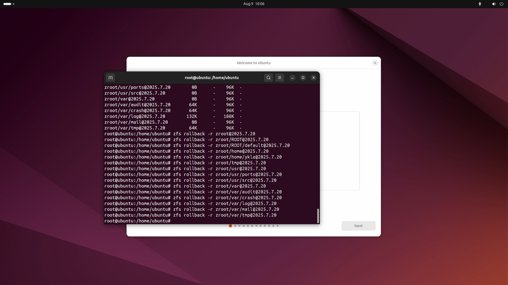

# 13.5 Live CD 与系统急救

开机按 2 进入 `single user` 即可进入单用户模式，该模式下默认无需 root 密码，可自行 passwd 重置密码。

## UFS 文件系统

```sh
# mount -u /
# mount -a -t ufs
```

## ZFS 文件系统

>**技巧**
>
>在大多数情况下，FreeBSD Live 镜像都是不可用的，无法创建挂载点，也无法修改为可写。
>
>推荐使用 Ubuntu 24.04 及更高版本的 Live 模式对 ZFS 磁盘进行修改，如还原快照等。
>
>

```sh
# mount -u
# zfs mount -a
```

挂载 zfs root：

```sh
# zpool import -fR /mnt zroot
```

### 故障排除与未竟事宜

- `passwd: pam_chauthtok(): Error in service module`

如果出现上述报错，检查 zfs 文件系统只读情况：

```sh
# zfs get all | grep readonly
```

修正只读文件系统：

```sh
# zfs set readonly=off zroot
```

#### 参考文献

- [one ZFS file system always starts with readonly=on temporary on boot](https://github.com/openzfs/zfs/issues/2133)

## 使用 U 盘设备

```sh
# mount /dev/adaXpN -o rw /mnt
```

`X`、`N` 的参数取决于具体设备。
