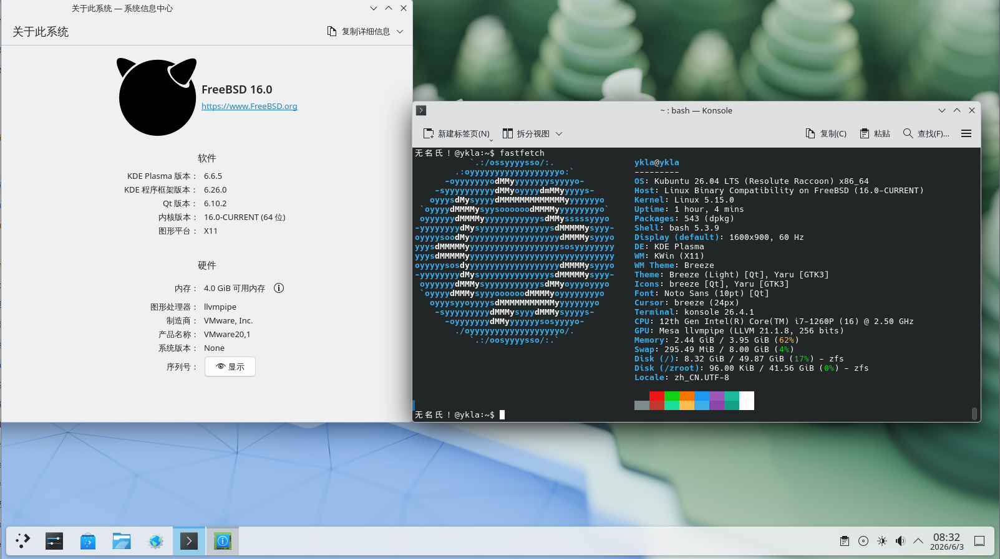

# 13.3 Ubuntu/Debian 兼容层

本节基于 debootstrap 在 FreeBSD 上构建 Ubuntu 22.04 LTS 兼容层，并附 Debian 12 构建脚本。内容包括 X11 应用运行以及与 systemd、Wine 相关的故障排除。

> **注意**
>
> 由于 FreeBSD Ports 中的 [sysutils/debootstrap](https://www.freshports.org/sysutils/debootstrap/) 长期未更新，经测试，该 Port 提供的 debootstrap 版本目前尚不支持 Ubuntu 24.04 和 Debian 13 的基本系统引导（注：上游 debootstrap 本身已支持这两个发行版，此处所述限制仅针对 FreeBSD Ports 中打包的版本）。

视频教程：[06-FreeBSD-Ubuntu 兼容层脚本使用说明](https://www.bilibili.com/video/BV1iM4y1j7E9)

## Ubuntu 兼容层


以下教程在 FreeBSD 14.3-RELEASE 上测试通过。

此外，可采用类似方法构建 Debian 兼容层。其他系统的支持情况请参见 **/usr/local/share/debootstrap/scripts/** 目录。

### 开始构建 Ubuntu 兼容层（基于 Ubuntu 22.04 LTS）

构建前，需启用相关守护进程和服务：

```sh
# service linux enable   # 启用 Linux 兼容层服务，并设置为开机自启
# service linux start    # 启动 Linux 兼容层服务
# service dbus enable    # 启用 D-Bus 服务，并设置为开机自启；通常桌面已经配置
# service dbus start     # 启动 D-Bus 服务。通常桌面已经配置
```

构建 Ubuntu 22.04 LTS 基本系统：

```sh
# pkg install debootstrap                                   # 安装 debootstrap 工具
# debootstrap jammy /compat/ubuntu http://mirrors.ustc.edu.cn/ubuntu/   # 使用 debootstrap 安装 Ubuntu Jammy 到 /compat/ubuntu
```

### 指定兼容层路径

构建完成后，需要挂载必要的文件系统。将 Linux 兼容层默认路径指向 **/compat/ubuntu** 以实现相关文件系统的自动挂载。

立刻生效：

```sh
# systctl compat.linux.emul_path=/compat/ubuntu
```

永久设置：

```sh
# echo "compat.linux.emul_path=/compat/ubuntu" >> /etc/sysctl.conf
```

### 设置 Linux 内核版本

需要设定合适的 Linux 内核版本，否则 chroot 时可能会提示 `FATAL: kernel too old`。

`6.16.2` 仅为示例，建议参考 [The Linux Kernel Archives](https://www.kernel.org/) 中公布的版本号设置。

```sh
# echo "compat.linux.osrelease=6.16.2" >> /etc/sysctl.conf   # 将 Linux 兼容层内核版本写入 sysctl 配置文件，使其永久生效
# sysctl compat.linux.osrelease=6.16.2                      # 立即设置 Linux 兼容层内核版本，便于当前会话继续使用
```

### 进入 Ubuntu 兼容层

完成文件系统挂载和内核版本设定后，进入 Ubuntu 兼容层继续配置。

chroot 进入 Ubuntu 兼容环境，移除会导致报错的软件：

```bash
# chroot /compat/ubuntu /bin/bash	# 进入 /compat/ubuntu 目录对应的 Linux 兼容环境，并启动 Bash Shell
# apt remove rsyslog # 此时已位于 Ubuntu 兼容层，卸载 rsyslog 软件包
```

### Ubuntu 切换软件源

更换 Ubuntu 兼容层的软件源可提高下载速度。

在卸载 rsyslog 之后需要更换软件源；由于 SSL 证书尚未更新，暂时无法使用 HTTPS 源。

使用文本编辑器编辑 Ubuntu 兼容环境中的 APT 软件源配置文件 **/compat/ubuntu/etc/apt/sources.list**，写入软件源：

```ini
deb http://mirrors.ustc.edu.cn/ubuntu/ jammy main restricted universe multiverse
deb-src http://mirrors.ustc.edu.cn/ubuntu/ jammy main restricted universe multiverse
deb http://mirrors.ustc.edu.cn/ubuntu/ jammy-security main restricted universe multiverse
deb-src http://mirrors.ustc.edu.cn/ubuntu/ jammy-security main restricted universe multiverse
deb http://mirrors.ustc.edu.cn/ubuntu/ jammy-updates main restricted universe multiverse
deb-src http://mirrors.ustc.edu.cn/ubuntu/ jammy-updates main restricted universe multiverse
deb http://mirrors.ustc.edu.cn/ubuntu/ jammy-backports main restricted universe multiverse
deb-src http://mirrors.ustc.edu.cn/ubuntu/ jammy-backports main restricted universe multiverse
```

进入 Ubuntu 兼容层，开始更新系统，安装常用软件：

```bash
# export LANG=C # 设定字符集，防止出现错误
# apt update && apt upgrade && apt install nano wget fonts-wqy-microhei fonts-wqy-zenhei language-pack-zh-hans # 此时已经位于 Ubuntu 兼容层了。
# update-locale LC_ALL=zh_CN.UTF-8 LANG=zh_CN.UTF-8 # 设置中文字符集
```

## 附录：Ubuntu 兼容层脚本（基于 Ubuntu 26.04 LTS）



脚本内容如下：

```sh
#!/bin/sh

ROOT_DIR=/compat
DIST_Linux=ubuntu
DIST=ubuntu-releases
DIST_FULLNAME="Ubuntu 26.04"
VER=26
SUB_VER=04
FILE=ubuntu-${VER}.${SUB_VER}-wsl-amd64.wsl
SUBDIR=""
URL=https://mirrors.ustc.edu.cn/${DIST}/${VER}.${SUB_VER}/
UPDATE_CMD="apt-get update -y"
UPGRADE_CMD="apt-get upgrade -y"
INSTALL_CMD="apt-get install -y"
UPDATE=1
UPGRADE=1
INSTALL=1

# 提前创建目标目录，确保后续操作安全
TARGET_PATH="${ROOT_DIR}/${DIST_Linux}"
mkdir -p "${TARGET_PATH}"

echo "Starting ${DIST_FULLNAME} installation"
sleep 0.5

# 检查 Linux 模块
echo "Checking required modules"

if [ "$(sysrc -n linux_enable 2>/dev/null)" != "YES" ]; then
    echo "Linux service is not enabled. Enable it now? (Y|n)"
    read ANSWER
    case $ANSWER in
        [Nn][Oo]|[Nn])
            echo "Warning: You must start the Linux service with \"service linux start\" after each FreeBSD reboot."
            echo "Are you sure you want to continue without enabling the Linux service? (y|N)"
            read ANSWER
            case $ANSWER in
                [Yy][Ee][Ss]|[Yy])
                    echo "WARNING: Linux module not enabled"
                    ;;
                [Nn][Oo]|[Nn]|"")
                    echo "Enabling Linux module"
                    service linux enable
                    ;;
                *)
                    echo "Aborting."
                    exit 4
                    ;;
            esac
            ;;
        [Yy][Ee][Ss]|[Yy]|"")
            echo "Enabling Linux module"
            service linux enable
            ;;
        *)
            echo "Aborting."
            exit 4
            ;;
    esac
fi

echo "Starting Linux service"
service linux start

# 临时修改 + 永久写入 sysctl.conf
sysctl compat.linux.emul_path="${TARGET_PATH}"
if ! grep -q "compat.linux.emul_path" /etc/sysctl.conf; then
    echo "compat.linux.emul_path=${TARGET_PATH}" >> /etc/sysctl.conf
else
    # 如果已存在则更新它
    sed -i '' "s|compat.linux.emul_path=.*|compat.linux.emul_path=${TARGET_PATH}|" /etc/sysctl.conf
fi

linux_path=$(sysctl -n compat.linux.emul_path)
echo "Now compat.linux.emul_path is $linux_path"

# 检查 dbus
if ! which -s dbus-daemon; then
    echo "dbus-daemon not found. Install D-Bus now? (Y|n)"
    read ANSWER
    case $ANSWER in
        [Nn][Oo]|[Nn])
            echo "Aborting. D-Bus not installed"
            exit 2
            ;;
        [Yy][Ee][Ss]|[Yy]|"")
            echo "Installing D-Bus"
            pkg install -y dbus
            ;;
        *)
            echo "Aborting."
            exit 4
            ;;
    esac
fi

if [ "$(sysrc -n dbus_enable 2>/dev/null)" != "YES" ]; then
    echo "D-Bus is not enabled. Enable it now? (Y|n)"
    read ANSWER
    case $ANSWER in
        [Nn][Oo]|[Nn])
            echo "WARNING: You must start D-Bus with \"service dbus start\" after each FreeBSD reboot."
            echo "Are you sure you want to continue without enabling D-Bus? (y|N)"
            read ANSWER
            case $ANSWER in
                [Yy][Ee][Ss]|[Yy])
                    echo "Warning: D-Bus service not enabled"
                    ;;
                [Nn][Oo]|[Nn]|"")
                    echo "Enabling D-Bus service"
                    service dbus enable
                    ;;
                *)
                    echo "Aborting."
                    exit 4
                    ;;
            esac
            ;;
        [Yy][Ee][Ss]|[Yy]|"")
            echo "Enabling D-Bus service"
            service dbus enable
            ;;
        *)
            echo "Aborting."
            exit 4
            ;;
    esac
fi


# 下载和解压基本系统
echo "${DIST_FULLNAME} will be installed in ${TARGET_PATH}"
echo "Downloading basic system"
fetch ${URL}/${FILE}

echo "Extracting basic system"
sleep 0.5
tar xvpf ${FILE} ${SUBDIR:-} -C ${TARGET_PATH} --numeric-owner 2>&1 | grep -v "Error exit delayed from previous errors"

# 配置 DNS
echo "Should ${DIST_FULLNAME} use Alibaba DNS or local resolv.conf? ((A)li | (L)ocal | (C)ancel)"
read ANSWER
case $ANSWER in
    [Aa][Ll][Ii]|[Aa]|"")
        echo "Setting Alibaba DNS"
        echo "nameserver 223.5.5.5" >> ${TARGET_PATH}/etc/resolv.conf
		echo "nameserver 223.6.6.6" >> ${TARGET_PATH}/etc/resolv.conf
        DNS_CONFIGURED=1
        ;;
    [Ll][Oo][Cc][Aa][Ll]|[Ll])
        echo "Using local resolv.conf"
		mkdir -p ${TARGET_PATH}/etc/
        cp /etc/resolv.conf ${TARGET_PATH}/etc/resolv.conf
        DNS_CONFIGURED=1
        ;;
    *)
        echo "Canceled."
        echo "You must manually edit ${TARGET_PATH}/etc/resolv.conf!"
        DNS_CONFIGURED=0
        ;;
esac

# 设置 USTC 镜像源
echo "Do you want to use the USTC mirror for ${DIST_FULLNAME}? (Y|n)"
read ANSWER
case $ANSWER in
    [Yy][Ee][Ss]|[Yy]|"")
echo "Setting USTC mirror"
        chroot "${TARGET_PATH}" /bin/bash -c "sed -i.bak \
            -e 's|http://archive.ubuntu.com/ubuntu/|https://mirrors.ustc.edu.cn/ubuntu/|g' \
            -e 's|http://security.ubuntu.com/ubuntu/|https://mirrors.ustc.edu.cn/ubuntu/|g' \
            /etc/apt/sources.list.d/ubuntu.sources"
		# APT::Cache-Start 可设置 apt 默认缓存偏小，按提示增大
		echo "APT::Cache-Start 90000000;" >> ${TARGET_PATH}/etc/apt/apt.conf
        ;;
    [Nn][Oo]|[Nn])
        echo "Will not set USTC mirror. Skipping update, upgrade, and installation."
        UPDATE=0
        UPGRADE=0
        INSTALL=0
        ;;
    *)
        echo "Aborting."
        exit 4
        ;;
esac

# 更新、升级和安装软件
# 检查网络连通性
if ping -c 1 -W 3 223.5.5.5 > /dev/null 2>&1; then
    echo "Network reachable, starting operations..."

    echo "Cleaning up snapd..."
    chroot "${TARGET_PATH}" /bin/bash -c "
        if dpkg -l | grep -q snapd; then
            dpkg --purge --force-all snapd 2>/dev/null
            apt-get autoremove --purge -y
        fi
    " || exit 1

    if [ "$UPDATE" = "1" ]; then
        echo "Updating package cache"
        chroot "${TARGET_PATH}" /bin/bash -c "$UPDATE_CMD" || exit 1
    fi

    if [ "$INSTALL" = "1" ]; then
        echo "Installing language-pack and tools"
        # 确保 locale 安装成功后再生成，如果安装失败则退出
        chroot "${TARGET_PATH}" /bin/bash -c "$INSTALL_CMD nano language-pack-zh-hans locales && locale-gen zh_CN.UTF-8 && update-locale LC_ALL=zh_CN.UTF-8 LANG=zh_CN.UTF-8" || exit 1
    fi

    if [ "$UPGRADE" = "1" ]; then
        echo "Upgrading system packages"
        chroot "${TARGET_PATH}" /bin/bash -c "$UPGRADE_CMD" || exit 1
    fi

else
    echo "Network unreachable, skipping update and installation."
fi

# 清理
echo "Cleaning up"
rm -f ${FILE}

echo "All done."
echo "You can switch to ${DIST_FULLNAME} with \"chroot ${TARGET_PATH} /bin/bash\""
```

## 附录：Debian 12（bookworm）（FreeBSD 14.2-RELEASE 测试通过）

脚本内容如下：

```sh
#!/bin/sh                                             # 使用 /bin/sh 作为脚本解释程序

rootdir=/compat/debian                                # 定义 Debian 根目录路径
baseurl="https://mirrors.ustc.edu.cn/debian/"        # 定义 Debian 软件源基础地址
codename=bookworm                                     # 定义 Debian 发行版代号（12）

echo "Starting Debian 12 (bookworm) installation..."    # 输出开始安装提示
echo "Checking required modules..."                              # 输出模块检查提示

# check linux module                                  # 检查 Linux 兼容层模块
if [ "$(sysrc -n linux_enable)" = "NO" ]; then        # 判断 linux 兼容层是否未启用
        echo "The Linux module is not enabled. Enable it now? (N|y)"  # 提示是否继续
        read answer                                  # 读取用户输入
        case $answer in                              # 根据用户输入进行分支判断
                [Nn][Oo]|[Nn])                        # 用户选择否
                        echo "Linux module not enabled" # 输出提示信息
                        exit 1                       # 退出脚本并返回错误码 1
                        ;;
                *)                                   # 其他情况，视为同意
                        sysrc linux_enable=YES       # 启用 linux 兼容层并写入 rc.conf 文件
                        ;;
        esac                                         # case 语句结束
fi                                                    # if 判断结束
echo "Starting Linux service"                                   # 输出启动 linux 服务提示
service linux start                                  # 启动 linux 兼容层服务

# check dbus                                         # 检查 dbus 服务
if ! /usr/bin/which -s dbus-daemon;then               # 判断 dbus-daemon 是否存在
        echo "dbus-daemon not found. Install D-Bus? [N|y]"# 提示是否安装 dbus
        read  answer                                 # 读取用户输入
        case $answer in                              # 根据用户输入进行分支判断
            [Nn][Oo]|[Nn])                            # 用户选择否
                echo "D-Bus not installed"             # 输出提示信息
                exit 2                               # 退出脚本并返回错误码 2
                ;;
            *)                                       # 其他情况，视为同意
                pkg install -y dbus                  # 使用 pkg 安装 dbus
                ;;
        esac                                         # case 语句结束
    fi                                                # if 判断结束

if [ "$(sysrc -n dbus_enable)" != "YES" ]; then       # 判断 dbus 是否未设置为启用
        echo "D-Bus is not enabled. Enable it now? (N|y)"# 提示是否继续
        read answer                                  # 读取用户输入
        case $answer in                              # 根据用户输入进行分支判断
            [Nn][Oo]|[Nn])                            # 用户选择否
                        echo "D-Bus not enabled"      # 输出提示信息
                        exit 2                       # 退出脚本并返回错误码 2
                        ;;
            *)                                       # 其他情况，视为同意
                        service dbus enable          # 启用 dbus 服务
                        ;;
        esac                                         # case 语句结束
fi                                                    # if 判断结束
echo "Starting D-Bus service"                                    # 输出启动 dbus 提示
service dbus start                                   # 启动 dbus 服务

if ! /usr/bin/which -s debootstrap; then              # 判断 debootstrap 是否存在
        echo "debootstrap not found. Install it? (N|y)" # 提示是否安装 debootstrap
        read  answer                                 # 读取用户输入
        case $answer in                              # 根据用户输入进行分支判断
            [Nn][Oo]|[Nn])                            # 用户选择否
                echo "debootstrap not installed"      # 输出提示信息
                exit 3                               # 退出脚本并返回错误码 3
                ;;
            *)                                       # 其他情况，视为同意
                pkg install -y debootstrap           # 使用 pkg 安装 debootstrap
                ;;
        esac                                         # case 语句结束
    fi                                                # if 判断结束
echo "Now bootstrapping ${codename}. Press any key to continue." # 提示开始 bootstrap
read  answer                                         # 等待用户确认

debootstrap ${codename} ${rootdir} ${baseurl}        # 使用 debootstrap 安装 Debian 系统
echo "debootstrap completed"

if [ ! "$(sysrc -f /boot/loader.conf -qn nullfs_load)" = "YES" ]; then # 检查 nullfs 是否配置加载
        echo "nullfs_load should be set to YES. Continue? (N|y)" # 提示是否继续
        read answer                                  # 读取用户输入
        case $answer in                              # 根据用户输入进行分支判断
            [Nn][Oo]|[Nn])                            # 用户选择否
                echo "nullfs is not loaded"               # 输出提示信息
				exit 4                               # 退出脚本并返回错误码 4
                ;;
            *)                                       # 其他情况，视为同意
                sysrc -f /boot/loader.conf nullfs_load=yes # 设置 nullfs 启动加载
                ;;
        esac                                         # case 语句结束
    fi                                                # if 判断结束

if ! kldstat -n nullfs >/dev/null 2>&1;then           # 判断 nullfs 模块是否已加载
        echo "Loading nullfs module"                     # 输出加载提示
        kldload -v nullfs                             # 加载 nullfs 内核模块
fi                                                    # if 判断结束

echo "Mounting required file systems for Linux"                        # 输出挂载文件系统提示
echo "devfs ${rootdir}/dev devfs rw,late 0 0" >> /etc/fstab      # 挂载 devfs
echo "tmpfs ${rootdir}/dev/shm tmpfs rw,late,size=1g,mode=1777 0 0" >> /etc/fstab # 挂载 tmpfs
echo "fdescfs ${rootdir}/dev/fd fdescfs rw,late,linrdlnk 0 0" >> /etc/fstab        # 挂载 fdescfs
echo "linprocfs ${rootdir}/proc linprocfs rw,late 0 0" >> /etc/fstab               # 挂载 linprocfs
echo "linsysfs ${rootdir}/sys linsysfs rw,late 0 0" >> /etc/fstab                  # 挂载 linsysfs
echo "/tmp ${rootdir}/tmp nullfs rw,late 0 0" >> /etc/fstab                        # 绑定 /tmp
#echo "/home ${rootdir}/home nullfs rw,late 0 0" >> /etc/fstab                     # 绑定 /home（已注释掉）
mount -al                                         # 挂载所有自动挂载的文件系统

echo "compat.linux.osrelease needs to be changed. Continue? (Y|n)" # 提示修改内核版本
read answer                                          # 读取用户输入
case $answer in                                      # 根据用户输入进行分支判断
	[Nn][Oo]|[Nn])                                    # 用户选择否
		echo "Almost done, but this step is required"                       # 输出提示信息
		exit 4                                       # 退出脚本并返回错误码 4
		;;
	[Yy][Ee][Ss]|[Yy]|"")                            # 用户选择
		echo "compat.linux.osrelease=6.16.2" >> /etc/sysctl.conf  # 写入 sysctl 配置文件
		sysctl compat.linux.osrelease=6.16.2          # 立即设置 linux 兼容层内核版本
                ;;
esac                                                 # case 语句结束

echo "Adding USTC APT sources"                        # 输出添加 APT 源提示
echo "deb http://mirrors.ustc.edu.cn/debian stable main contrib non-free non-free-firmware" > /compat/debian/etc/apt/sources.list      # 写入主仓库源
echo "# deb-src http://mirrors.ustc.edu.cn/debian stable main contrib non-free non-free-firmware" >> /compat/debian/etc/apt/sources.list # 写入源代码仓库
echo "deb http://mirrors.ustc.edu.cn/debian stable-updates main contrib non-free non-free-firmware" >> /compat/debian/etc/apt/sources.list # 写入更新源
echo "# deb-src http://mirrors.ustc.edu.cn/debian stable-updates main contrib non-free non-free-firmware" >> /compat/debian/etc/apt/sources.list # 写入更新源代码
echo "# deb http://mirrors.ustc.edu.cn/debian stable-proposed-updates main contrib non-free non-free-firmware" >> /compat/debian/etc/apt/sources.list # 写入预发布源
echo "# deb-src http://mirrors.ustc.edu.cn/debian stable-proposed-updates main contrib non-free non-free-firmware" >> /compat/debian/etc/apt/sources.list # 写入预发布源代码
echo "deb http://mirrors.ustc.edu.cn/debian-security/ stable-security main contrib non-free non-free-firmware" >> /compat/debian/etc/apt/sources.list # 写入安全更新源
echo "# deb-src http://mirrors.ustc.edu.cn/debian-security/ stable-security main contrib non-free non-free-firmware" >> /compat/debian/etc/apt/sources.list # 写入安全源代码

echo "Installing nano, fonts-wqy-microhei, fonts-wqy-zenhei, and wget" # 输出软件安装提示
chroot ${rootdir} /bin/bash -c "apt update && apt --fix-broken install -y && apt upgrade && apt install nano wget fonts-wqy-microhei fonts-wqy-zenhei -y" # 在 Debian 环境中执行软件管理命令
echo "Configuring locale"
chroot ${rootdir} /bin/bash -c "update-locale LC_ALL=zh_CN.UTF-8 LANG=zh_CN.UTF-8" # 设置中文 UTF-8 语言环境
echo "All done."
echo "Now you can run '# chroot /compat/debian/ /bin/bash' to enter Debian 12 bookworm"   # 输出完成提示
```

## 附录：运行 X11 软件

允许所有本地用户访问当前 X Server 实例：

```sh
# xhost +local:	# 此时处于 FreeBSD 系统
```

## 故障排除与未竟事宜

### 程序的命令行启动命令是什么？

按以下方法依次查找（以 `gedit` 为例）：

- 直接执行软件包名 `# gedit`；
- `whereis 软件包名`，定位后执行。`whereis gedit`；
- 通过软件图标定位，进入 **/usr/share/applications** 目录，根据软件包名找到对应文件，并使用文本编辑器（如 ee、nano）打开（**.desktop 文件** 是文本文件，而非软链接或图片），找到其中的程序启动命令并复制到终端运行即可。
- 通过 `find` 命令全局查找（如 `# find / -name gedit`）。

> 如何查找软件？
>
> ```bash
> # apt search --names-only XXX # 按名称搜索包含 XXX 的软件包
> ```
>
> 将 XXX 改为所需搜索的软件名即可。

### 缺少 .so 文件

- 首先查看缺少哪些 .so 文件，通常不会只缺失一个。

```sh
# ldd /usr/bin/qq	# 查看可执行文件 qq 所依赖的动态链接库
	linux_vdso.so.1 (0x00007ffffffff000)
	libffmpeg.so => not found
	libdl.so.2 => /lib/x86_64-linux-gnu/libdl.so.2 (0x0000000801061000)
	libpthread.so.0 => /lib/x86_64-linux-gnu/libpthread.so.0 (0x0000000801066000)
	…………………………以下省略……………………………………
```

根据输出 `libffmpeg.so => not found`，判断缺失“libffmpeg.so”。

- 安装工具

```bash
# apt install apt-file   # 安装 apt-file 工具，用于查询文件所属的软件包
# apt-file update        # 更新 apt-file 的软件包索引数据库
```

- 查看 `libffmpeg.so` 文件属于哪个包：

```bash
# apt-file search libffmpeg.so	# 查询包含 libffmpeg.so 文件的软件包
qmmp: /usr/lib/qmmp/plugins/Input/libffmpeg.so
webcamoid-plugins: /usr/lib/x86_64-linux-gnu/avkys/submodules/MultiSink/libffmpeg.so
webcamoid-plugins: /usr/lib/x86_64-linux-gnu/avkys/submodules/MultiSrc/libffmpeg.so
webcamoid-plugins: /usr/lib/x86_64-linux-gnu/avkys/submodules/VideoCapture/libffmpeg.so
```

多个包都提供了该文件，任选一个安装即可。

```bash
# apt install webcamoid-plugins	# 安装 Webcamoid 的插件组件
```

- 按照上述路径复制文件，并刷新 ldd 缓存：

```sh
# cp /usr/lib/x86_64-linux-gnu/avkys/submodules/MultiSink/libffmpeg.so /usr/lib   # 将 libffmpeg.so 文件复制到系统库目录
# ldconfig                                                                     # 重新生成动态链接库缓存
```

- 再次查看可执行文件 **/usr/bin/qq** 所依赖的动态链接库：

```sh
# ldd /usr/bin/qq
	linux_vdso.so.1 (0x00007ffffffff000)
	libffmpeg.so => /lib/libffmpeg.so (0x0000000801063000)
	…………………………以下省略……………………………………
```

## 参考文献

- Debian Project. debootstrap(8)[EB/OL]. [2026-04-17]. <https://manpages.debian.org/stable/debootstrap/debootstrap.8.en.html>. debootstrap 工具手册页，用于从指定发行版仓库引导 Debian 基本系统。
