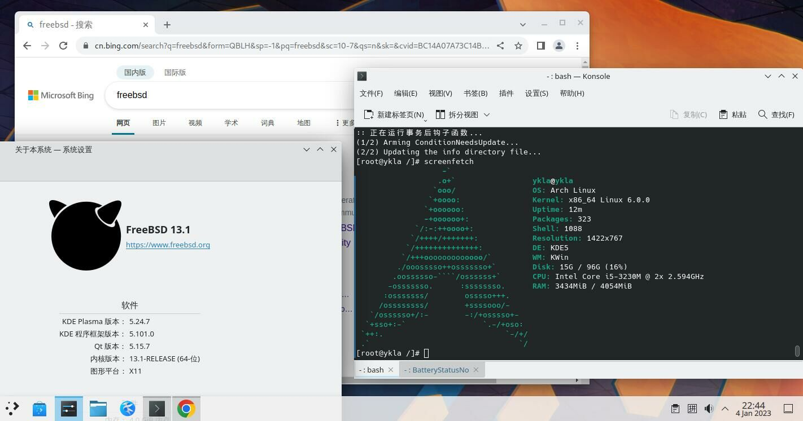

# 13.4 Arch Linux 兼容层

Arch Linux 兼容层基于 Arch bootstrap 镜像构建。

视频教程：[07-FreeBSD-Arch Linux 兼容层脚本使用说明](https://www.bilibili.com/video/BV1wg4y1w7QV)




由于 Google Chrome 浏览器在后台运行，Arch Linux 兼容层占用的系统资源略高于 Ubuntu 兼容层。

## 构建基本系统

构建 Arch Linux 兼容层需要先处理必要的服务项和设置。

### 处理所需服务项

#### Linux 服务项

```sh
# service linux enable   # 设置 Linux 兼容层服务开机自启
# service linux start    # 启动 Linux 兼容层服务
```

##### D-Bus

桌面环境通常已配置 D-Bus 服务。如果未安装，请先安装 D-Bus。

设置 D-Bus 服务开机自启：

```sh
# service dbus enable
```

启动 D-Bus 服务：

```sh
# service dbus start
```

### 调整 Linux 兼容层默认内核版本

对于滚动发行版，Linux 兼容层的默认内核版本通常较低。如果直接构建，Arch Linux 兼容层在 chroot 时会报错 `FATAL: kernel too old`。因此，需要将 Linux 兼容层中宣称的 Linux 内核版本调整为较高版本（如 6.12.63）。

查看当前 Linux 兼容层的内核版本：

```sh
# sysctl compat.linux.osrelease
compat.linux.osrelease: 5.15.0
```

> **注意**
>
> 必须先启动 `linux` 服务才能查看当前的 Linux 内核版本。

调整到较新的版本号：

```sh
# echo "compat.linux.osrelease=6.12.63" >> /etc/sysctl.conf # 将 Linux 兼容内核版本写入 sysctl 配置文件，实现持久化
# sysctl compat.linux.osrelease=6.12.63 # 立即生效设置，无需重启
```

#### 参考文献

- Kernel.org. The Linux Kernel Archives[EB/OL]. [2026-03-26]. <https://www.kernel.org/>. 参见此条目可获得所需 Linux 内核版本号

## 挂载文件系统

还需要挂载必要的文件系统。将 Linux 兼容层默认路径指向 **/compat/arch** 以实现相关文件系统的自动挂载。

立刻生效：

```sh
# sysctl compat.linux.emul_path=/compat/arch
```

永久设置：

```sh
# echo "compat.linux.emul_path=/compat/arch" >> /etc/sysctl.conf
```

重启 Linux 兼容层服务：

```sh
service linux restart
```

### 安装自举系统

```sh
# mkdir -p /compat/arch   # 创建挂载 Linux 系统的目录
# fetch https://ftp.sjtu.edu.cn/archlinux/iso/latest/archlinux-bootstrap-x86_64.tar.zst   # 下载 Arch Linux bootstrap 压缩包
# tar --use-compress-program=unzstd -xpvf archlinux-bootstrap-x86_64.tar.zst --strip-components=1 -C /compat/arch --numeric-owner   # 解压压缩包到 /compat/arch：同时保持原有 GID 和 UID。若出现 tar 报错通常可忽略
```

`--strip-components=1` 即在解压 `archlinux-bootstrap-x86_64.tar.zst` 文件时去掉外层路径 `root.x86_64`，直接解压到指定路径。

## 基本配置

### 初始化 pacman 密钥环

```sh
# cp /etc/resolv.conf /compat/arch/etc/   # 在 FreeBSD 中将 DNS 配置复制到 Arch 兼容层
# chroot /compat/arch /bin/bash           # 切换到 Arch 兼容层环境
# pacman-key --init                        # 初始化 pacman 密钥环
# pacman-key --populate archlinux          # 导入 Arch Linux 官方密钥
```

### 切换软件源

新安装的 Arch 未安装文本编辑器，需要在 FreeBSD 中编辑相关文件，设置 Arch Linux 的 pacman 使用清华大学镜像源：

```sh
# ee /compat/arch/etc/pacman.d/mirrorlist # 此时位于 FreeBSD！将下行添加至文件顶部。

Server = https://mirrors.tuna.tsinghua.edu.cn/archlinux/$repo/os/$arch
```

### 启用 DisableSandbox

FreeBSD 未实现 landlock 沙盒机制，需为 pacman 启用 DisableSandbox，否则触发错误 `error: restricting filesystem access failed because landlock is not supported by the kernel!`。

在 pacman.conf 文件中取消 DisableSandbox 选项的注释：

```sh
# sed -E -i '' 's/^[[:space:]]*#[[:space:]]*DisableSandbox/DisableSandbox/' /compat/arch/etc/pacman.conf
```

检查是否启用成功，在 pacman.conf 中查找 DisableSandbox 所在行及行号：

```sh
# grep -n 'DisableSandbox' /compat/arch/etc/pacman.conf
```

使用 pacman 安装基本系统、开发工具、文本编辑器 nano、AUR 助手 yay 以及文泉驿字体 wqy-zenhei：

```sh
# pacman -S base base-devel nano yay wqy-zenhei
```

#### 参考文献

- Arch Linux Project. pacman.conf(5)[EB/OL]. [2026-03-25]. <https://man.archlinux.org/man/pacman.conf.5.en>. 说明了 DisableSandbox 配置项的用途和适用场景。

#### archlinuxcn 源配置

配置 Arch Linux CN 仓库使用清华大学镜像：

```sh
# nano /etc/pacman.conf # 将下两行添加至文件底部。

[archlinuxcn]
Server = https://mirrors.tuna.tsinghua.edu.cn/archlinuxcn/$arch
```

安装 Arch Linux CN 仓库密钥环：

```sh
# pacman -S archlinuxcn-keyring
```

> **技巧**
>
> 在 `==> Locally signing trusted keys in keyring...` 这一步可能需要十分钟或更长时间。请耐心等待。

此外还需要卸载 fakeroot 并安装 fakeroot-tcp，否则无法使用 AUR。该 bug 见 [Problem with fakeroot and qemu](https://archlinuxarm.org/forum/viewtopic.php?t=14466)。

使用 pacman 安装 fakeroot-tcp 工具：

```sh
# pacman -S fakeroot-tcp # 会询问是否卸载 fakeroot，请确认并卸载。
```

### 区域设置

> **提示**
>
> 如不设置此项，Arch Linux 的图形化程序将无法使用中文输入法。

编辑 **/etc/locale.gen** 文件，将 `zh_CN.UTF-8 UTF-8` 前面的注释 `#` 删除。

生成系统本地化语言环境：

```sh
# locale-gen
```

## shell 脚本

脚本内容如下：

```sh
#!/bin/sh

BASE_URL="https://ftp.sjtu.edu.cn/archlinux/iso/latest"
rootdir=/compat/arch

url="${BASE_URL}/archlinux-bootstrap-x86_64.tar.zst"
BOOTSTRAP=archlinux-bootstrap-x86_64.tar.zst
SHAFILE="${BASE_URL}/sha256sums.txt"

LinuxKernel=7.0.11

echo "Starting Arch Linux installation..."

echo "Checking required modules..."

# linux compat
if [ "$(sysrc -n linux_enable)" = "NO" ]; then
    echo "Linux module is not enabled. Enable it now? (Y|n)"
    read answer
    case $answer in
        [Nn][Oo]|[Nn])
            echo "Linux module not enabled"
            exit 1
            ;;
        *)
            service linux enable
            ;;
    esac
fi

service linux start

# dbus
if ! command -v dbus-daemon >/dev/null 2>&1; then
    echo "dbus-daemon not found. Install D-Bus? [Y|n]"
    read answer
    case $answer in
        [Nn][Oo]|[Nn])
            exit 2
            ;;
        *)
            pkg install -y dbus
            ;;
    esac
fi

if [ "$(sysrc -n dbus_enable)" != "YES" ]; then
    echo "Enable D-Bus now? (Y|n)"
    read answer
    case $answer in
        [Nn][Oo]|[Nn])
            exit 2
            ;;
        *)
            service dbus enable
            ;;
    esac
fi

service dbus start

# emulation path
sysctl compat.linux.emul_path="${rootdir}"

if ! grep -q '^compat.linux.emul_path=' /etc/sysctl.conf 2>/dev/null; then
    echo "compat.linux.emul_path=${rootdir}" >> /etc/sysctl.conf
else
    sed -i '' "s|^compat.linux.emul_path=.*|compat.linux.emul_path=${rootdir}|" /etc/sysctl.conf
fi

echo "compat.linux.emul_path=$(sysctl -n compat.linux.emul_path)"

echo "compat.linux.osrelease=${LinuxKernel}"
sysctl compat.linux.osrelease=${LinuxKernel}

if ! grep -q '^compat.linux.osrelease=' /etc/sysctl.conf 2>/dev/null; then
    echo "compat.linux.osrelease=${LinuxKernel}" >> /etc/sysctl.conf
else
    sed -i '' "s|^compat.linux.osrelease=.*|compat.linux.osrelease=${LinuxKernel}|" /etc/sysctl.conf
fi

service linux restart

# bootstrap + checksum + resume + retry
echo "Downloading bootstrap..."

fetch -r -o "${BOOTSTRAP}" "${url}"

[ -f sha256sums.txt ] || fetch -o sha256sums.txt "${SHAFILE}"

verify_checksum() {
    EXPECTED=$(awk "/${BOOTSTRAP}/{print \$1}" sha256sums.txt)
    ACTUAL=$(sha256 -q "${BOOTSTRAP}")

    echo "File: ${BOOTSTRAP}"
    echo "Expected SHA256: ${EXPECTED}"
    echo "Actual SHA256:   ${ACTUAL}"

    if [ -z "$EXPECTED" ]; then
        echo "Checksum not found in sha256sums.txt"
        return 1
    fi

    if [ "$EXPECTED" != "$ACTUAL" ]; then
        return 1
    fi

    return 0
}

echo "Verifying checksum..."

if ! verify_checksum; then
    echo "First verification failed. Removing file and retrying..."

    rm -f "${BOOTSTRAP}"

    echo "Redownloading bootstrap..."
    fetch -r -o "${BOOTSTRAP}" "${url}"

    echo "Re-verifying checksum..."

    if ! verify_checksum; then
        echo "Checksum failed after retry."
        exit 1
    fi
fi

echo "Checksum OK"
rm -f sha256sums.txt

mkdir -p "${rootdir}"

tar --use-compress-program=unzstd -xpvf "${BOOTSTRAP}" --strip-components=1 -C "${rootdir}" --numeric-owner 2>&1 | grep -v "Error exit delayed from previous errors"
 
rm -f "${BOOTSTRAP}"

# initial config
echo "Continue initial Arch setup? [Y|n]"
read answer
case $answer in
    [Nn][Oo]|[Nn])
        exit 0
        ;;
esac

grep -q "nameserver 223.5.5.5" "${rootdir}/etc/resolv.conf" 2>/dev/null || \
    echo "nameserver 223.5.5.5" >> "${rootdir}/etc/resolv.conf"

grep -q "nameserver 223.6.6.6" "${rootdir}/etc/resolv.conf" 2>/dev/null || \
    echo "nameserver 223.6.6.6" >> "${rootdir}/etc/resolv.conf"

chroot "${rootdir}" /bin/bash -c "pacman-key --init"
chroot "${rootdir}" /bin/bash -c "pacman-key --populate archlinux"

cp "${rootdir}/etc/pacman.d/mirrorlist" "${rootdir}/etc/pacman.d/mirrorlist.bak"

{
    echo 'Server = https://mirrors.cernet.edu.cn/archlinux/$repo/os/$arch'
    cat "${rootdir}/etc/pacman.d/mirrorlist.bak"
} > "${rootdir}/etc/pacman.d/mirrorlist"

rm -f "${rootdir}/etc/pacman.d/mirrorlist.bak"

echo '[archlinuxcn]' >> "${rootdir}/etc/pacman.conf"
echo 'Server = https://mirrors.ustc.edu.cn/archlinuxcn/$arch' >> "${rootdir}/etc/pacman.conf"

echo '[arch4edu]' >> "${rootdir}/etc/pacman.conf"
echo 'SigLevel = Never' >> "${rootdir}/etc/pacman.conf"
echo 'Server = https://mirrors.tuna.tsinghua.edu.cn/arch4edu/$arch' >> "${rootdir}/etc/pacman.conf"
chroot "${rootdir}" /bin/bash -c "useradd -G wheel -m ykla"
echo 'ALL ALL=(ALL:ALL) NOPASSWD: ALL' >> "${rootdir}/etc/sudoers"
chroot "${rootdir}" /bin/bash -c "mv /usr/share/libalpm/hooks/21-systemd-tmpfiles.hook    /usr/share/libalpm/hooks/21-systemd-tmpfiles.hook.disabled"

sed -i '' 's/^[#[:space:]]*DisableSandbox/DisableSandbox/' "${rootdir}/etc/pacman.conf"

chroot "${rootdir}" /bin/bash -c "pacman -Syyu --noconfirm"
chroot "${rootdir}" /bin/bash -c "pacman -S --noconfirm archlinuxcn-keyring"


chroot "${rootdir}" /bin/bash -c "pacman -S --noconfirm yay base base-devel nano wqy-zenhei"

chroot "${rootdir}" /bin/bash -c "pacman -Syu libunwind libedit --noconfirm --overwrite '*'"

chroot "${rootdir}" /bin/bash -c "pacman -Rdd fakeroot --noconfirm && pacman -S --noconfirm fakeroot-tcp"

echo 'zh_CN.UTF-8 UTF-8' >> "${rootdir}/etc/locale.gen"
chroot "${rootdir}" /bin/bash -c "locale-gen"

echo "Base System ready."
echo "chroot ${rootdir} /bin/bash"
```

## 参考文献

- FreeBSD Project. linux(4)[EB/OL]. [2026-03-25]. <https://man.freebsd.org/cgi/man.cgi?query=linux&sektion=4>. 该文档详细介绍 FreeBSD Linux 兼容层的技术原理与配置方法。
- Arch Linux Project. Installation guide[EB/OL]. [2026-03-25]. <https://wiki.archlinux.org/title/Installation_guide>. 该文档提供 Arch Linux 的标准安装流程指引。
