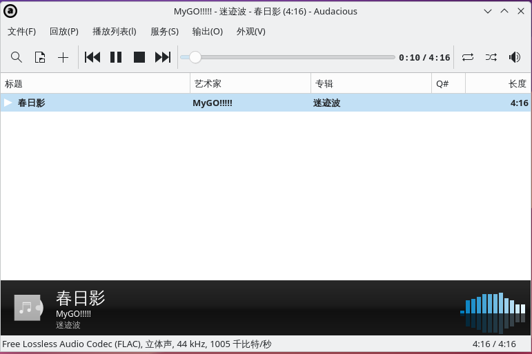
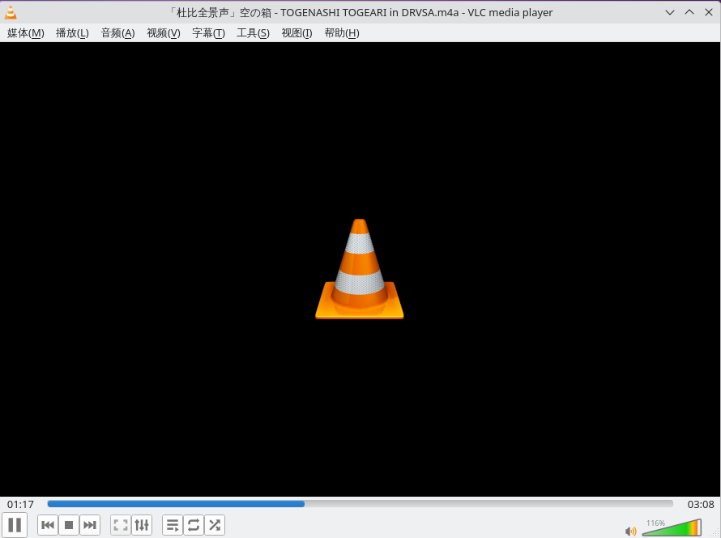

# 14.3 音频播放器

FreeBSD 上主要的音频播放器包括 Audacious、VLC 和 MPD。本节分别给出 pkg 安装方法，并介绍 MPD 播放 DSD 音频的配置流程。

## Audacious

### 安装 Audacious

- 使用 pkg（二进制包管理器）安装：

```sh
# pkg install audacious audacious-plugins
```

> **注意**
>
> `audacious-plugins` 插件包是 Audacious 主程序运行的必要依赖，不安装该插件包则无法正常启动 `audacious` 主程序。

- 或者使用 Ports（源代码包管理器）编译安装：

```sh
# cd /usr/ports/multimedia/audacious/ && make install clean
# cd /usr/ports/multimedia/audacious-plugins/ && make install clean
```

### 使用 Audacious

对 `.m4a`（MPEG-4 音频容器格式）、`.flac`（无损音频压缩编码）、`.av3a`（AVS3 音频裸码流格式）等音乐格式进行兼容性测试。`.m4a` 为容器格式，可包含多种编码（如 AAC、ALAC 等）；`.av3a` 为裸码流，实际应用中 AVS3 音频也常封装在 MP4 容器中以 `.m4a` 扩展名存储。

> **技巧**
>
> 经测试验证，在上述格式中 Audacious 默认构建仅支持 `.flac` 格式，目前不支持 `.m4a` 和 `.av3a` 等编码格式，需安装相应插件或另行配置。



## VLC

VLC（VideoLAN Client，视频局域网客户端）播放器的安装方法可参见本书视频播放器相关章节。FreeBSD 中的 `ffmpeg` 多媒体框架（名称中的"FF"无官方缩写含义，"mpeg"指 MPEG 标准，参见 [FFmpeg FAQ](https://ffmpeg.org/faq.html)）默认构建配置未启用 libuavs3d（AVS3 解码）和 libdavs2（AVS2 解码）支持，本节不再展开重新编译配置方法。

经过实际测试，VLC 播放器可以正常播放 AC-4 编码的 m4a 格式音频：



## 用 MPD 播放 DSD

Music Player Daemon（MPD）是一款灵活、强大且可扩展的音乐播放器守护进程系统，可运行于服务器或个人计算机上，并通过多种客户端程序进行远程控制。

MPD 的主要功能特性包括：支持多种音频格式解码、采用客户端—服务器分离架构、提供播放列表管理、支持流媒体传输以及具备跨平台运行能力等。

### 硬件准备

需要准备硬件支持 DSD（直接比特流数字，Direct Stream Digital）格式的声卡或 DAC（数模转换器，Digital-to-Analog Converter），以及一段 DSD 编码的音频文件用于测试。

以下配置说明基于 FreeBSD 14.0 操作系统，外置 DAC 使用海贝 R3 作为示例设备（其他类似声卡的配置方法基本相同），并采用 OSS（开放声音系统，Open Sound System）音频驱动。

### 安装 Music Player Daemon

```sh
# pkg install musicpd
```

或者通过 Ports 源代码编译安装：

```sh
# cd /usr/ports/audio/musicpd/
# make install clean
```

### 硬件设置

当前系统声卡和音频设备状态如下：

```sh
# cat /dev/sndstat
pcm0: <Realtek ALC269 (Analog 2.0+HP/2.0)> (play/rec) default
pcm1: <Intel Cougar Point (HDMI/DP 8ch)> (play)
pcm2: <USB audio> (play)
No devices installed from userspace.
```

在本实例中要使用的是 pcm2 设备，其对应的设备文件路径为 `/dev/dsp2`，下文配置中会使用该路径。

可以使用 `sysctl -d dev.pcm.2` 命令查看相关硬件参数的详细含义，摘录关键的三项参数如下：

```sh
dev.pcm.2.bitperfect: bit-perfect playback/recording (0=disable, 1=enable)
dev.pcm.2.play.vchanrate: virtual channel mixing speed/rate
dev.pcm.2.play.vchanmode: vchan format/rate selection: 0=fixed, 1=passthrough, 2=adaptive
```

按照如下所示进行参数设置（可将这些配置写入 `sysctl.conf` 文件以实现系统重启后的永久生效）：

```sh
# sysctl dev.pcm.2.bitperfect=1           # 设置声卡 2 为位完美模式
# sysctl dev.pcm.2.play.vchanrate=352800  # 设置声卡 2 播放采样率为 352800 Hz
# sysctl dev.pcm.2.play.vchanmode=1       # 设置声卡 2 播放通道模式为 passthrough
```

参数说明：

- 由于使用的是 OSS 音频驱动，Music Player Daemon 只能采用 DoP（DSD over PCM）传输模式，而 DoP 模式要求启用 bit-perfect 比特完美模式。
- 采样率（vchanrate）：DSD 音频的采样率为 44.1 kHz 的整数倍，因此不应设置为 48 kHz 的整数倍，否则可能产生音频杂音；在硬件条件允许的情况下应设置为尽可能高的数值，此处示例设置为 352.8 kHz。

- `dev.pcm.2.play.vchanmode` 虚拟通道模式参数说明：
  - `0`（fixed，固定模式）：在该模式下，音频设备使用固定的采样率和格式处理多路音频流。
  - `1`（passthrough，直通模式）：在该模式下，音频设备尽可能保持输入音频流的原始采样率和格式，不进行额外的转换处理。
  - `2`（adaptive，自适应模式）：在该模式下，音频设备会根据需要自动适配并转换输入音频流的采样率和格式。

> **技巧**
>
> 可使用 `dmesg` 命令查看内核日志中记录的硬件支持的可用采样率。在播放非 DSD 文件时，采样率设置为与音频文件本身采样率相同（或其整数倍）为宜，如此可避免重采样过程造成的音质损失。采样率并非越高越好，可经多次测试确定最适合当前硬件配置的设置。

查看内核消息中与 pcm2 声卡相关的日志：

```sh
# dmesg | grep -i pcm2

pcm2 on uaudio0

# dmesg | grep -i uaudio0

uaudio0 on uhub0
uaudio0: <HiBy R3, class 239/2, rev 2.00/ff.ff, addr 1> on usbus1
uaudio0: Play[0]: 384000 Hz, 2 ch, 32-bit S-LE PCM format, 2x4ms buffer. (selected)
uaudio0: Play[0]: 352800 Hz, 2 ch, 32-bit S-LE PCM format, 2x4ms buffer.
uaudio0: Play[0]: 192000 Hz, 2 ch, 32-bit S-LE PCM format, 2x4ms buffer.
uaudio0: Play[0]: 176400 Hz, 2 ch, 32-bit S-LE PCM format, 2x4ms buffer.
uaudio0: Play[0]: 96000 Hz, 2 ch, 32-bit S-LE PCM format, 2x4ms buffer.
uaudio0: Play[0]: 88200 Hz, 2 ch, 32-bit S-LE PCM format, 2x4ms buffer.
uaudio0: Play[0]: 48000 Hz, 2 ch, 32-bit S-LE PCM format, 2x4ms buffer.
uaudio0: Play[0]: 44100 Hz, 2 ch, 32-bit S-LE PCM format, 2x4ms buffer.
uaudio0: Play[0]: 32000 Hz, 2 ch, 32-bit S-LE PCM format, 2x4ms buffer.
uaudio0: No recording.
uaudio0: No MIDI sequencer.
pcm2 on uaudio0
uaudio0: No HID volume keys found.
```

### Music Player Daemon 基本设置

Music Player Daemon（musicpd）的配置文件为 `/usr/local/etc/musicpd.conf`。

其中默认使用的部分目录结构如下：

```sh
/
├── var
│   └── mpd
│       ├── music                     # MPD 音乐存放目录
│       └── .mpd
│           └── playlists            # MPD 播放列表目录
├── usr
│   └── ports
│       └── audio
│           └── musicpd              # MPD 音频播放器 Port
├── usr
│   └── local
│       └── etc
│           └── musicpd.conf          # MPD 配置文件
└── dev
    ├── sndstat                        # 声卡设备状态文件
    └── dsp2                           # 音频设备文件（示例）
```

MPD 默认使用的部分目录需要自行创建：

```sh
# mkdir -p /var/mpd/music            # 创建 MPD 音乐存放目录
# mkdir -p /var/mpd/.mpd/playlists  # 创建 MPD 播放列表目录
# chown -R mpd:mpd /var/mpd  # 用于将目录的所有者设置为 mpd 用户，避免出现权限问题
# chmod 777 /var/mpd/music  # 用于存放音乐文件，设置为 777 仅为方便增删文件，实际使用中可根据需要自行调整权限。
```

修改 `/usr/local/etc/musicpd.conf` 文件，在 `"Default OSS Device"` 一节后面增加一节：

```ini
audio_output {
        type            "oss"
        name            "OSS Device（dop mode）"
        device          "/dev/dsp2"     # 指定使用的设备，无需将 DAC 或声卡等设置为默认设备，dsp2 可专用于音乐播放，默认设备可用于其他用途
        dop             "yes"           # 开启 dop 模式
}
```

> **技巧**
>
> 可以指定多个输出设备，并在各类客户端中按需启用或禁用相应的输出设备。

开启 musicpd 服务：

```sh
# service musicpd enable  # 设置 MPD 服务开机自启动
# service musicpd start  # 启动 MPD 服务
```

### 客户端使用

可以使用 ncmpc（字符界面）、MaximumMPD（iPhone）等多种客户端，客户端选择较为丰富。

PC 端的 GUI 客户端建议使用 Cantata（`pkg install cantata`）。

命令行环境下建议安装 mpc（`pkg install musicpc`），适合用于绑定桌面环境的全局快捷键。

## 课后习题

1. 查找并安装 ffmpeg 的 Ports，修改其编译选项以启用 libuavs3d（AVS3 解码）和 libdavs2（AVS2 解码）支持，构建并验证其能否解码 AVS2/AVS3 编码文件。

2. 选取 MPD 的 OSS 输出配置机制，重构其最小实现。

3. 修改 MPD 配置以同时启用多个音频输出设备，验证其能否正常切换输出。
