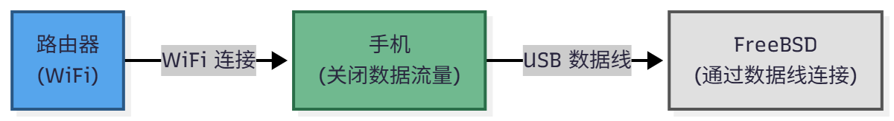

# 14.3 USB 网络共享（USB tethering）

该教程于红米手机（红米 Note 12 5G）测试通过，理论上同时支持 Android 和 iOS。

对于大多数新款安卓手机，可以实现在开启 WiFi 关闭流量的同时供给以太网给 FreeBSD。这样就不会消耗流量了：



>**技巧**
>
>如果是 root 过的 Android 设备，还可以通过数据线共享手机的 VPN 给 FreeBSD 设备。参见软件 [VPN 热点](https://play.google.com/store/apps/details?id=be.mygod.vpnhotspot&hl=zh&pli=1)。使用方法参见 [通过创建 Wifi 热点来共享 V2ray 代理](https://www.sainnhe.dev/post/v2ray-hotspot/)。

首先加载内核模块（若默认未生效）:

- 一般 Android 设备（RNDIS）：

```sh
# kldload if_urndis   # 加载 USB RNDIS 网络驱动
```

- Apple iPhone/iPad 设备：

```sh
# kldload if_ipheth   # 加载 iPhone/iPad 以太网网络驱动
```

- 其他 Android 设备（CDC ECM/NCM）

```sh
# kldload if_cdce     # 加载 USB CDC ECM/Ethernet 网络驱动
```

启动时开机加载，选择所需条目写入到：`/boot/loader.conf` 文件。

```ini
if_urndis_load="YES"    # 设置系统启动时自动加载 USB RNDIS 网络驱动
if_cdce_load="YES"      # 设置系统启动时自动加载 USB CDC ECM/Ethernet 网络驱动
if_ipheth_load="YES"    # 设置系统启动时自动加载 iPhone/iPad 以太网驱动
```

然后将 USB 数据线连接到 FreeBSD，打开手机的以太网网络共享即可。

 为 `ue0`（通常是此接口，可通过 `ifconfig` 命令研判）接口通过 DHCP 获取 IP 地址：

```sh
# dhclient ue0
```

