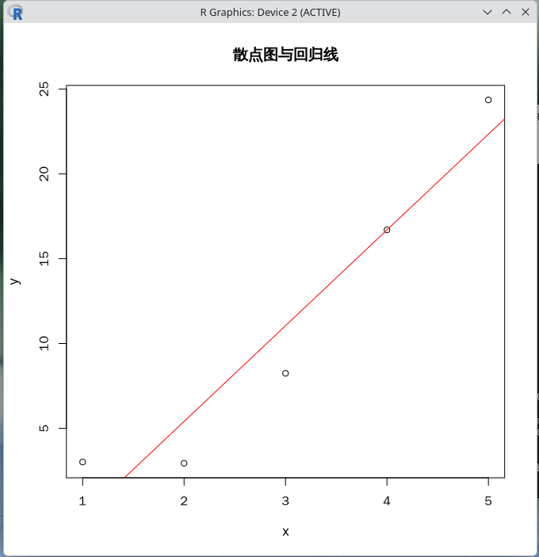

# 14.5 R 语言

R 是一款面向统计计算与图形可视化的编程语言与自由软件环境，由奥克兰大学统计系的 Ross Ihaka 与 Robert Gentleman 于 1993 年发布，现由 R 核心团队（R Core Team）维护。

其名称既是两位作者名字首字母的组合，也是对贝尔实验室 S 语言（S programming language）的继承：R 语言来自 S 语言，是 S 语言的开源（GPL）衍生，绝大多数为 S 编写的代码不经修改即可在 R 中运行。另一个 S 语言的主要后继者是 S-PLUS（是商业软件），已基本被 R 语言取代。

R 在统计学、数据科学、生物信息学、计量经济学与社会科学等领域被广泛使用，其生态系统中包含数以万计的扩展包（packages），这些包通过综合 R 存档网络（Comprehensive R Archive Network，CRAN）发布。

FreeBSD 的 Ports 与 pkg 均提供 R 的安装方式。在 Ports 中，R 语言包位于 `math/R` 分类下。

## 安装 R 语言

使用 pkg 安装：

```sh
# pkg install R
```

或者使用 Ports 安装：

```sh
# cd /usr/ports/math/R/
# make install clean
```

安装完成后，可通过以下命令验证版本：

```sh
$ R --version
R version 4.6.0 (2026-04-24) -- "Because it was There"
Copyright (C) 2026 The R Foundation for Statistical Computing
Platform: amd64-portbld-freebsd16.0

R is free software and comes with ABSOLUTELY NO WARRANTY.
You are welcome to redistribute it under the terms of the
GNU General Public License versions 2 or 3.
For more information about these matters see
https://www.gnu.org/licenses/.
```

进入交互式会话：

```r
$ R
R version 4.6.0 (2026-04-24) -- "Because it was There"
Copyright (C) 2026 The R Foundation for Statistical Computing
Platform: amd64-portbld-freebsd16.0

R是自由软件，不附带任何担保。
在某些条件下你可以将其自由分发。
用'license()'或'licence()'来看分发的详细条件。

R是个合作计划，有许多人为之做出了贡献.
用'contributors()'来看合著者的详细情况
用'citation()'会告诉你如何在出版物中正确地引用R或R程序包。

用'demo()'来看一些示例程序，用'help()'来阅读在线帮助文件，或
用'help.start()'通过HTML浏览器来看帮助文件。
输入'q()'退出R.

> q()
Save workspace image? [y/n/c]: n # 是否保存工作空间镜像
```

在交互式会话中，使用 `q()` 退出。

## CRAN 镜像与包管理

CRAN 是 R 扩展包的官方发行网络，全球设有数十个镜像站点。首次使用 `install.packages()` 时，R 会提示用户选择镜像。可通过以下方式在 R 会话中显式指定镜像（以清华大学 TUNA 镜像为例）：

```r
options(repos = c(CRAN = "https://mirrors.tuna.tsinghua.edu.cn/CRAN/"))
install.packages("ggplot2")
```

>**技巧**
>
> 由于构建 R 包并不轻松（类似于 Python），因此 FreeBSD Port 开发者维护了大量 R 包，并且他们大多命名为 `R-cran-*`。以 `ggplot2` 为例，在 Ports 中为 **graphics/R-cran-ggplot2**。

也可以在用户主目录下创建 `~/.Rprofile` 配置文件，使镜像设置在每次启动 R 时自动生效：

```r
options(repos = c(CRAN = "https://mirrors.tuna.tsinghua.edu.cn/CRAN/"))
```

常用的包管理命令包括：

```r
install.packages("软件包")   # 安装扩展包
update.packages()             # 更新已安装的扩展包
library(软件包)              # 载入扩展包
installed.packages()          # 列出所有已安装的扩展包
remove.packages("软件包")    # 移除扩展包
```

## 基本使用示例

以下示例演示 R 的基本算术运算、向量操作与简单绘图功能。启动 R 并依次执行。请读者先行安装 Port **graphics/R-cran-ggplot2**。

基本算术运算：

```r
> x <- c(1, 2, 3, 4, 5)
> mean(x)    # 算术平均值
> sd(x)      # 样本标准差
> sum(x)     # 求和
[1] 3
[1] 1.581139
[1] 15
```

向量运算：

```r
> y <- x^2 + rnorm(5, mean = 0, sd = 1)  # 加入正态分布噪声
> y
[1]  3.015682  2.941824  8.242497 16.696599 24.355322
```

简单的线性回归

```r
> fit <- lm(y ~ x)
> summary(fit)
all:
lm(formula = y ~ x)

Residuals:
        1         2         3         4         5 
 3.252108 -2.465155 -2.807887  0.002809  2.018126 

Coefficients:
            Estimate Std. Error t value Pr(>|t|)  
(Intercept)  -5.8798     3.2389  -1.815   0.1671  
x             5.6434     0.9766   5.779   0.0103 *
---
Signif. codes:  0 ‘***’ 0.001 ‘**’ 0.01 ‘*’ 0.05 ‘.’ 0.1 ‘ ’ 1

Residual standard error: 3.088 on 3 degrees of freedom
Multiple R-squared:  0.9176,    Adjusted R-squared:  0.8901 
F-statistic:  33.4 on 1 and 3 DF,  p-value: 0.0103
```

绘制散点图与回归线

```r
> plot(x, y, main = "散点图与回归线", xlab = "x", ylab = "y")
> abline(fit, col = "red")
```

输入下图：



## RStudio IDE

RStudio 是最流行的 R 集成开发环境（IDE）之一。它提供语法高亮、代码补全、绘图查看器、数据浏览器以及版本控制等功能。

使用 pkg 安装：

```sh
# pkg install rstudio
```

或者使用 Ports 安装：

```sh
# cd /usr/ports/devel/rstudio/
# make install clean
```

安装完成后，在桌面环境中通过应用程序菜单启动 RStudio，或在终端中运行：

```sh
$ rstudio
```

## 数据导入与导出

R 支持多种数据格式的读写。常见示例如下：

```r
# 读取 CSV 文件
dat <- read.csv("data.csv")

# 写入 CSV 文件
write.csv(dat, "output.csv", row.names = FALSE)

# 读取 Excel 文件（需安装 readxl 包）
library(readxl)
dat <- read_excel("data.xlsx", sheet = 1)

# 读取 SAS、SPSS、Stata 文件（需安装 haven 包）
library(haven)
dat_sas   <- read_sas("data.sas7bdat")
dat_spss  <- read_sav("data.sav")
dat_stata <- read_dta("data.dta")
```

## 统计建模与图形可视化

以下示例演示线性模型与 ggplot2 绘图的常见用法：

```r
library(ggplot2)

# 使用内置数据集 mtcars
data(mtcars)
head(mtcars)

# 以马力（hp）预测英里每加仑（mpg）
fit2 <- lm(mpg ~ hp, data = mtcars)
summary(fit2)

# 绘制散点图与拟合曲线
ggplot(mtcars, aes(x = hp, y = mpg)) +
  geom_point(color = "steelblue", size = 2) +
  geom_smooth(method = "lm", se = TRUE, color = "red") +
  labs(
    title = "mpg 与 hp 的关系",
    x     = "马力（hp）",
    y     = "英里每加仑（mpg）"
  ) +
  theme_bw()
```

## 常用包推荐

| 分类         | 包名                             | 用途                               |
| ------------ | -------------------------------- | ---------------------------------- |
| 数据处理     | dplyr、tidyr、data.table          | 数据清洗、筛选、变形与汇总         |
| 图形可视化   | ggplot2、lattice、plotly          | 静态与交互式绘图                   |
| 时间序列     | forecast、tseries、zoo           | 时间序列建模与预测                 |
| 机器学习     | caret、randomForest、xgboost      | 分类与回归模型训练                 |
| 文本挖掘     | tm、quanteda、tidytext           | 文本处理与自然语言分析             |
| 生物信息学   | Bioconductor 系列                | 高通量生物数据分析                 |
| 空间数据     | sf、sp、rgdal                    | 地理信息与空间分析                 |
| 并行计算     | parallel、future、doParallel     | 多核与分布式计算                   |

## 与其他语言的互操作

R 可以与多种编程语言互操作。以下是常见场景：

### 调用 C/C++ 代码

通过 `Rcpp` 包可在 R 中直接嵌入 C++ 代码：

```r
library(Rcpp)
cppFunction('
  double my_mean(NumericVector x) {
    int n = x.size();
    double total = 0;
    for (int i = 0; i < n; i++) {
      total += x[i];
    }
    return total / n;
  }
')
my_mean(c(1, 2, 3, 4, 5))
```

### 调用 Python 代码

通过 `reticulate` 包可在 R 会话中调用 Python：

```r
library(reticulate)
use_python("/usr/local/bin/python3")  # 替换为实际路径

py_run_string("
import numpy as np
a = np.array([1, 2, 3, 4, 5])
print('Python 中计算的均值：', a.mean())
")
```

### 在 Python 中调用 R

通过 Python 的 `rpy2` 包可在 Python 中调用 R：

```python
import rpy2.robjects as robjects
from rpy2.robjects.packages import importr

stats = importr("stats")
r_mean = robjects.r("mean")
result = r_mean(robjects.FloatVector([1, 2, 3, 4, 5]))
print("R 中计算的均值：", result[0])
```

## 命令行批处理模式

R 支持批处理运行脚本。编写脚本 `analysis.R`：

```r
x <- rnorm(100, mean = 0, sd = 1)
cat("样本均值：", mean(x), "\n")
cat("样本标准差：", sd(x), "\n")
```

在终端中执行：

```sh
$ Rscript analysis.R
```

该模式适用于将 R 整合进 Shell 脚本、定时任务或批处理工作流。

## 故障排除

**扩展包编译失败**：部分扩展包需要调用 C/C++/Fortran 编译器。请确保系统已安装 `devel/gmake`、`lang/gcc`（含 gfortran）以及相关依赖。可使用以下命令一次性安装常用编译工具链：

```sh
# pkg install gmake gcc pkgconf
```

**中文显示乱码**：请先按照其他章节正确设置 `LANG`、`LC_ALL` 等本地化环境变量。在 R 中可额外设置：

```r
options(encoding = "UTF-8")
Sys.setlocale("LC_CTYPE", "zh_CN.UTF-8")
```

**图形设备无法启动**：在无图形界面的服务器环境中，需要将绘图输出到文件设备（png、pdf、svg 等）：

```r
png("plot.png", width = 800, height = 600, res = 150)
plot(1:10, rnorm(10))
dev.off()
```

如需在 Headless（无头）环境中使用 `ggplot2`，请确保安装 `x11/cairo` 图形工具包：

```sh
# pkg install cairo
```

## 参考资料

- R 官方网站：<https://www.r-project.org/>
- CRAN 镜像列表：<https://cran.r-project.org/mirrors.html>
- R 语言入门手册（An Introduction to R）：<https://cran.r-project.org/manuals.html>
- R Development Core Team. R: A Language and Environment for Statistical Computing[M]. Vienna: R Foundation for Statistical Computing, 2025. ISBN 3-900051-07-0.
- Wickham H, Grolemund G. R for Data Science: Import, Tidy, Transform, Visualize, and Model Data[M]. Sebastopol: O'Reilly Media, 2017.
