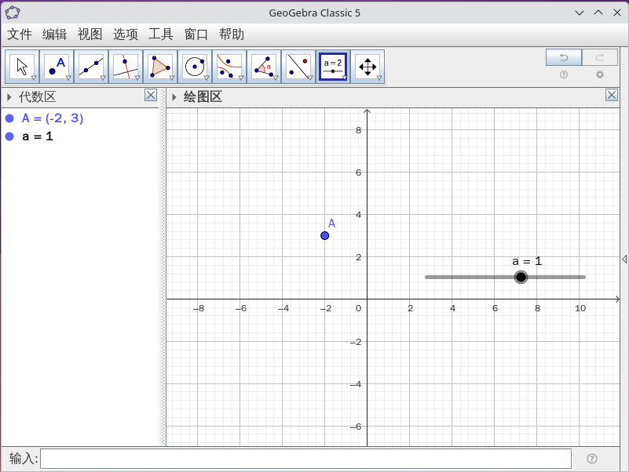
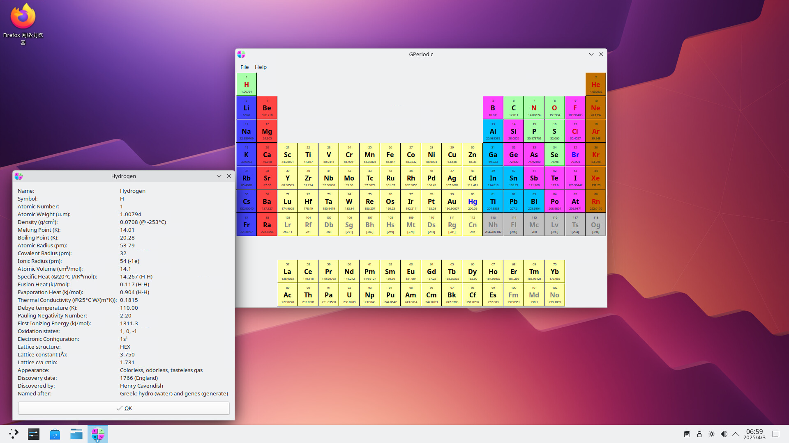
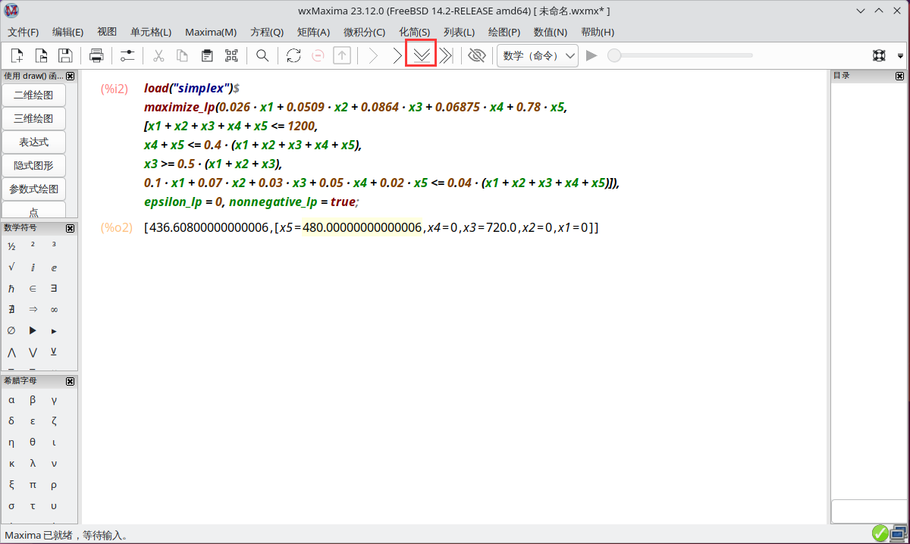

# 14.6 科研和专业计算

FreeBSD 上可运行的科研工具包括数学（GeoGebra）、天文（Stellarium）等。本节按类别列出各软件的安装方式与基本用途。

## 代数学

FreeBSD 基本系统内置两个计算器工具：bc 采用中缀表示法，dc 采用后缀表示法（逆波兰表示法）。

`dc` 是采用后缀表示法的开源任意精度计算器。在传统 Unix 系统中，`bc` 曾作为 `dc` 的预处理器实现——先将中缀表达式转换为后缀表达式，再交由 `dc` 执行计算。

其源代码位于 FreeBSD 官方源代码存储库 <https://github.com/freebsd/freebsd-src/tree/main/contrib/bc>，可供研究与学习。用户可通过 `man bc` 或 `man dc` 命令查看手册页，获取更多使用细节。

### bc（Basic Calculator）基础计算器

bc 是采用中缀表示法的交互式任意精度计算器，支持基本算术运算和函数计算。

```sh
$ bc # 进入 bc 计算器
1+15 # 加法
16
sqrt(256) # 开方
16
5^3	 # 求立方
125
90/3 # 除法
30
10%4 # 求余数
2
quit # 退出程序
```

## 几何学

### 几何绘图软件 GeoGebra

GeoGebra 是动态几何软件，支持几何、代数和微积分的可视化与计算。

使用 pkg 安装：

```sh
# pkg install geogebra
```

或者使用 Ports 安装：

```sh
# cd /usr/ports/math/geogebra/
# make install clean
```



## 线性规划

本节介绍线性规划软件 GLPK 的使用方法。线性规划是运筹学的重要分支，广泛应用于资源优化配置、生产计划制定与金融风险管理等领域。

### GLPK

GLPK（GNU Linear Programming Kit）是 GNU 项目开发的开源线性规划工具包。

使用 pkg 安装 GLPK：

```sh
# pkg install glpk
```

或者使用 Ports 安装 GLPK：

```sh
# cd /usr/ports/math/glpk/
# make install clean
```

线性规划常用单纯形法。在计算机上，有多种软件可辅助求解线性规划问题，例如 Microsoft Excel 的“规划求解”功能。

下面给出一个示例，取自希利尔 F S, 希利尔 M S. 数据、模型与决策：基于电子表格的建模和案例研究方法[M]. 李勇建, 徐芳超, 译. 第 6 版. 北京: 机械工业出版社, 2021. ISBN 978-7-111-69627-8. 例题 2.4-1.

有一家银行计划放贷，预计最高投放 1200 万元。下表显示了相关的数据。

| 贷款类型 | 利率 | 坏账率 |
| -------- | ---- | ------ |
| 个人 | 0.14 | 0.1 |
| 汽车 | 0.13 | 0.07 |
| 家用 | 0.12 | 0.03 |
| 农业 | 0.125 | 0.05 |
| 商业 | 0.1 | 0.02 |

坏账意味着不产生利润，本金也无法收回。为了同其他商业机构竞争，农业贷款和商业贷款之和不少于全部贷款的 40%；为了振兴房地产业，个人贷款、家用贷款和汽车贷款三项总计中，个人贷款占比不少于 50%；银行坏账率最高允许为全部贷款的 4%。

求解银行能获得最大利润的资金分配方式。

逐步分析，设个人、汽车、家用、农业及商业贷款的贷款量分别为 x1、x2、x3、x4 和 x5。

利润 = 0.14 · 0.9 x1 + 0.13 · 0.93 x2 + 0.12 · 0.97 x3 + 0.125 · 0.95 x4 + 0.1 · 0.98 x5

本金损失 = 0.1 x1 + 0.07 x2 + 0.03 x3 + 0.05 x4 + 0.02 x5

由此得到目标函数：max z = 利润 − 本金损失。

根据题意找出约束条件。

数学模型如下：

```text
max z = 0.026 x1 + 0.0509 x2 + 0.0864 x3 + 0.06875 x4 + 0.078 x5

s.t. x1 + x2 + x3 + x4 + x5 <= 1200,
    x4 + x5 <= 0.4 (x1 + x2 + x3 + x4 + x5),
    x3 >= 0.5 (x1 + x2 + x3),
    0.1 x1 + 0.07 x2 + 0.03 x3 + 0.05 x4 + 0.02 x5 <= 0.04 (x1 + x2 + x3 + x4 + x5),
    xi >= 0 (i = 1, 2, 3, 4, 5)
```

新建一个文本文件（命名为 `example`），输入：

```text
var x1 >= 0;
var x2 >= 0;
var x3 >= 0;
var x4 >= 0;
var x5 >= 0;

maximize z: 0.026*x1 + 0.0509*x2 + 0.0864*x3 + 0.06875*x4 + 0.078*x5;
s.t. C1: x1 + x2 + x3 + x4 + x5 <= 1200;
s.t. C2: x4 + x5 <= 0.4*(x1 + x2 + x3 + x4 + x5);
s.t. C3: x3 >= 0.5*(x1 + x2 + x3);
s.t. C4: 0.1*x1 + 0.07*x2 + 0.03*x3 + 0.05*x4 + 0.02*x5 <= 0.04*(x1 + x2 + x3 + x4 + x5);
end;
```

保存文件后，在终端中输入以下命令。

使用 GLPK 求解模型文件 `example`，并将结果输出到 `example.out` 文件：

```sh
$ glpsol -m example -o example.out
```

查看 **example.out** 文件内容：

```sh
$ cat example.out
Problem:    example
Rows:       5
Columns:    5
Non-zeros:  23
Status:     OPTIMAL
Objective:  z = 436.608 (MAXimum)

   No.   Row name   St   Activity     Lower bound   Upper bound    Marginal
------ ------------ -- ------------- ------------- ------------- -------------
     1 z            B        436.608
     2 C1           NU          1200                        1200       0.36384
     3 C2           NU             0                          -0        0.6936
     4 C3           B            360            -0
     5 C4           B          -16.8                          -0

   No. Column name  St   Activity     Lower bound   Upper bound    Marginal
------ ------------ -- ------------- ------------- ------------- -------------
     1 x1           NL             0             0                     -0.0604
     2 x2           NL             0             0                     -0.0355
     3 x3           B            720             0
     4 x4           NL             0             0                    -0.71125
     5 x5           B            480             0

……省略一部分……
```

可查看解答值为：`x3 = 720`，`x5 = 480`，其余各项值为 `0`。

## 物理和化学

### 元素周期表 `GPeriodic`

GPeriodic 是一款元素周期表查看软件，提供元素的基本信息和物理化学性质。

使用 pkg 安装：

```sh
# pkg install gperiodic
```

或者使用 Ports 安装：

```sh
# cd /usr/ports/biology/gperiodic/
# make install clean
```



## 天文地理

### 星图软件 Stellarium

Stellarium 是一款开源的天文馆软件，可模拟真实的星空观测。

使用 pkg 安装：

```sh
# pkg install stellarium
```

或者使用 Ports 安装：

```sh
# cd /usr/ports/astro/stellarium/
# make install clean
```


> **技巧**
>
> 默认进入全屏模式，按 **F11** 可切换全屏模式。

### GNOME 地图

GNOME 地图是一款地图查看软件，提供地图浏览和位置搜索功能。

使用 pkg 安装：

```sh
# pkg install gnome-maps
```

或者使用 Ports 安装：

```sh
# cd /usr/ports/deskutils/gnome-maps/
# make install clean
```


地图数据整体较新，但无法显示详细的街道信息。

## 工具与软件

### 科学计算软件 GNU Octave

GNU Octave 是一款开源的科学计算软件，兼容 MATLAB 语言，用于数值计算和数据可视化。

使用 pkg 安装：

```sh
# pkg install octave
```

或者使用 Ports 安装：

```sh
# cd /usr/ports/math/octave/
# make install clean
```

## 运筹学

### 计算机代数系统 wxMaxima

wxMaxima 是 Maxima 计算机代数系统的图形用户界面，提供直观的交互环境与强大的数学计算能力。

使用 pkg 安装：

```sh
# pkg install wxmaxima
```

或使用 Ports 安装：

```sh
# cd /usr/ports/math/wxmaxima/
# make install clean
```

上一节使用 GLPK 求解线性规划问题，本节使用功能更强大的 wxMaxima 求解。wxMaxima 不仅可数值计算，还支持符号运算与公式推导。代码示例仅供参考，详见 [官方文档](https://maxima.sourceforge.io/documentation.html)。

```text
load("simplex")$
maximize_lp(0.026 * x1 + 0.0509 * x2 + 0.0864 * x3 + 0.06875 * x4 + 0.078 * x5,
[x1 + x2 + x3 + x4 + x5 <= 1200,
x4 + x5 <= 0.4 * (x1 + x2 + x3 + x4 + x5),
x3 >= 0.5 * (x1 + x2 + x3),
0.1 * x1 + 0.07 * x2 + 0.03 * x3 + 0.05 * x4 + 0.02 * x5 <= 0.04 * (x1 + x2 + x3 + x4 + x5)]),
epsilon_lp = 0, nonnegative_lp = true;
```



点击界面中红框标识的位置执行指令，解答为：`[436.608,[x5=480.0,x4=0,x3=720.0,x2=0,x1=0]]`，该结果与 GLPK 求得的解一致。

## 参考文献

- Howard G D. bc — An arbitrary precision calculator language[EB/OL]. [2026-04-17]. <https://github.com/gavinhoward/bc>. Gavin D. Howard 开发的 bc/dc 实现。
- FreeBSD Project. Differential Revision D19982[EB/OL]. (2019-05-23)[2026-04-17]. <https://reviews.freebsd.org/D19982>. FreeBSD 自 [13.0 起](https://github.com/freebsd/freebsd-src/commit/252884ae7e4760f0e3cb45fdc2fff8fb952251ae)将 Gavin D. Howard 开发的 bc/dc 实现纳入基本系统（`contrib/bc`），bc 与 dc 在同一二进制文件中集成。
- FreeBSD Project. bc(1) -- an arbitrary precision calculator language[EB/OL]. [2026-04-17]. <https://man.freebsd.org/cgi/man.cgi?query=bc&sektion=1>. 任意精度计算器语言手册页。
- FreeBSD Project. dc(1) -- an arbitrary precision calculator[EB/OL]. [2026-04-17]. <https://man.freebsd.org/cgi/man.cgi?query=dc&sektion=1>. 任意精度计算器手册页。
