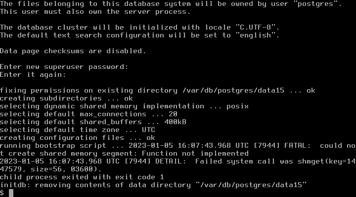
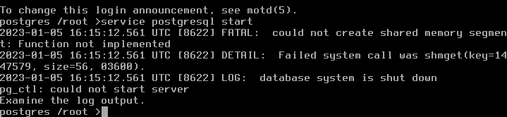

# 15.3 Qjail 管理工具

## Jail 管理工具的技术选型：三种方案对比

Qjail 是用于部署 Jail 环境的工具，源自 ezjail 3.1，它在继承 ezjail 设计理念的基础上进行了功能扩展与优化。

常见的 Jail 管理工具包括 ezjail、Qjail 和 iocage，这三种工具代表了不同的技术路线与设计哲学。

ezjail 在 2015 年更新至 3.4.2 后未再进行关键更新，其 ports 更新依赖 portsnap，现已废弃，不再推荐用于新部署。

iocage 依赖 ZFS 文件系统的高级特性，使用 UFS 文件系统的用户无法使用，这在一定程度上限制了其适用范围。

Qjail 不存在这些方面的限制，具有更广泛的文件系统兼容性。

ezjail 不支持 Jail 的 vnet 功能，而 iocage 和 Qjail 支持该功能。vnet（Virtual Network）是 FreeBSD Jail 的网络虚拟化功能，可为每个 Jail 提供独立的网络协议栈。

ezjail 和 Qjail 使用 sh（Shell 脚本）编写，iocage 使用 Python 编写，不同的实现语言带来了不同的可维护性和扩展性特征。

下文中部署的 Jail 在概念上的结构如下图所示：


## 预留 Jail 的 IP 地址：网络接口配置

在 `/etc/rc.conf` 文件中添加如下配置。克隆接口 lo1 可将 Jail 网络与宿主机网络配置分开，增强隔离性。

```ini
cloned_interfaces="lo1"  # 克隆出 lo1，应与宿主机网络配置分离 ①
ifconfig_lo1_alias0="inet 192.168.1.1-9" # 此处示例选择 `192.168.1.1-9`，共 9 个 IP 地址，旨在为 Jail 创建一个与宿主机实际网络分离的独立网段，请根据实际网络环境调整 IP 地址范围
```

>**警告**
>
> ① 如要生成多个接口，应在同一行中以空格分隔描述，而不是另外创建多行，应如 `cloned_interfaces="lo1 lo2"`。分行书写时，只有第一行会生效。

重启所有网络接口以应用配置：

```sh
# service netif restart
```

lo1 将获得 9 个 IP 地址，均可用于分配给各个 Jail。

## 安装 Qjail 工具

使用 pkg 安装 Qjail：

```sh
# pkg install qjail
```

或者使用 Ports 安装：

```sh
# cd /usr/ports/sysutils/qjail/
# make install clean
```

设置 qjail 服务开机自启动：

```sh
# sysrc qjail_enable=YES
```

## 部署 Qjail 使用的目录结构

使用 Qjail 前，首先需要部署 Qjail 所使用的目录结构，可通过以下两种方式完成：

### 方法一：从官方镜像站自动下载

```sh
# qjail install
```

此时 Qjail 会从 FreeBSD 官网下载 base.txz 文件，示例输出如下：

```sh
# qjail install
resolving server address: ftp.freebsd.org:80
requesting http://ftp.freebsd.org/pub/FreeBSD/releases/amd64/amd64/15.0-RELEASE/base.txz
remote size / mtime: 195363380 / 1652346155
...
```

### 方法二：从境内镜像站下载

境内网络访问有限制时，可使用镜像站手动下载，以中国科学技术大学开源镜像站为例。使用 `freebsd-version` 命令可确认宿主机的 FreeBSD 版本，Qjail 要求文件版本与宿主机一致。以下示例为 FreeBSD amd64 15.0：

从镜像服务器下载 FreeBSD 基本系统文件：

```sh
# fetch https://mirrors.ustc.edu.cn/freebsd/releases/amd64/15.0-RELEASE/base.txz
```

使用 qjail 安装基本系统到指定 jail：

```sh
# qjail install base.txz
```

部署好 Qjail 的目录结构后，`/usr/jails` 目录下会自动生成 `sharedfs`、`template`、`archive`、`flavors` 四个目录，这四个目录构成了 Qjail 的核心文件系统架构：

- **sharedfs** 包含一份只读的操作系统可执行文件库，通过 nullfs（一种特殊的文件系统，用于在同一主机的不同位置挂载同一文件系统）挂载，在各个 Jail 之间共享，以节省存储空间。
- **template** 包含操作系统的配置文件模板，将被复制到每个 Jail 的基本文件系统中，作为新 Jail 的初始配置。
- **archive** 保存 Jail archive 命令产生的存档文件，用于 Jail 的备份与恢复。
- **flavors** 包含系统风格（flavors）和用户创建的自定义风格，本质上是预定义的配置文件集合，用于快速定制新 Jail 的配置。

文件结构：

```sh
/usr/jails/
├── sharedfs/         # 只读操作系统库（各 Jail 共享）
├── template/         # 配置文件模板
├── archive/          # Jail 存档文件
├── flavors/          # 系统风格配置
│   └── default/
│       └── usr/
│           └── local/
│               └── etc/
│                   └── pkg/
│                       └── repos/
│                           └── FreeBSD.conf  # 自定义 pkg 镜像配置
├── jail1/            # jail1 的根目录
└── jail2/            # jail2 的根目录
    └── usr/
        └── local/
            └── etc/
                └── pkg/
                    └── repos/
                        └── FreeBSD.conf  # 自动复制的配置
```

## 部署 Jail

创建名为 jail1 的 Jail，指定网络接口和 IPv4 地址：

```sh
# qjail create -n lo1 -4 192.168.1.1 jail1
```

- `-n` 指定使用 lo1 作为网络接口
- `-4` 指定 IPv4 地址

生成 jail1 后，`/usr/jails/` 目录下会创建 `jail1` 目录（`/usr/jails/jail1/`）用于保存对应文件。

可在前述的 `flavors` 目录中创建自定义配置文件，以便在部署新的 Jail 时自动复制。例如，新建 `/usr/jails/flavors/default/usr/local/etc/pkg/repos/FreeBSD.conf` 文件，则之后创建的 Jail 会自动复制该文件：

```sh
# qjail create -n lo1 -4 192.168.1.2 jail2
```

建立 jail2 后，自动建立 `/usr/jails/jail2/usr/local/etc/pkg/repos/FreeBSD.conf` 文件，即修改了之后所有 Jail 的默认 pkg 镜像。但对应的 jail1 并没有生成这个文件，因为生成 jail1 时，还没有在 flavors 目录中写入相应文件。

## Qjail 基本用法

列出 Qjail 管理的 Jail：

```sh
# qjail list
```

启用 Jail：

```sh
# qjail start # 启动所有 Jail
# qjail start jail1 # 启动 jail1
```

停止 Jail：

```sh
# qjail stop # 停止所有 Jail
# qjail stop jail1 # 停止 jail1
```

重启 Jail：

```sh
# qjail restart # 重启所有 Jail
# qjail restart jail1 # 重启 jail1
```

进入 Jail 控制台：

```sh
# qjail console jail1
```

进入 Jail 控制台后，将以 Jail 中的 root 账户身份操作（无需输入密码）。由于 Jail 可能开启对外服务，为安全起见，可设置 root 账户密码。

备份 Jail：

```sh
# qjail archive -A  # 备份所有 Jail
# qjail archive jail1  # 备份 jail1
```

从备份中恢复 Jail：

```sh
# qjail restore jail1
```

删除 Jail：

```sh
# qjail delete jail1  # 删除 jail1
# qjail delete -A     # 删除所有 Jail
```

## 更新 Jail

更新 Jail 的部分不针对单个 Jail，而是针对所有 Jail，因为这些文件通过 nullfs 共享一份。

### 更新 Jail 中的基本系统

更新 sharedfs 中的文件：

```sh
# qjail update -b
```

### 更新 ports

有 `-p`（小写）、`-P`（大写）两个选项，`-p`（小写）使用 portsnap 更新 Jail 的 Ports 树。`-P`（大写）使用宿主机的 ports 更新 Jail 的 Ports 树。若主机已有 Ports，则可使用 `-P`（大写），避免重复下载 ports：

```sh
# qjail update -P # 注意 P 要大写
```

### 更新系统源代码

```sh
# qjail update -S # S 大写
```

### 更新过程

完整的更新流程如下：

获取并安装 FreeBSD 系统更新：

```sh
# freebsd-update fetch
# freebsd-update install
```

停止所有 qjail Jail：

```sh
# qjail stop
```

更新 qjail 基本系统：

```sh
# qjail update -b
```

更新 qjail 源代码：

```sh
# qjail update -S
```

更新 qjail Ports：

```sh
# qjail update -P
```

启动所有 qjail Jail：

```sh
# qjail start
```

## Jail 设置

Qjail 提供 `qjail config` 命令以对每个 Jail 进行定制化配置。由于 Jail 的核心配置参数在其运行状态下无法安全地进行修改，运行该命令前须先停止目标 Jail。

`qjail config` 命令提供丰富的配置选项，以下列出几个常用参数，完整说明请参考手册页。

### `-h`

为 jail1 快速配置 ssh 服务：

```sh
# qjail config -h jail1
```

该命令会快速开启 jail1 的 ssh 服务，新建一个 wheel 组用户，用户名和密码均与 jail1 名称相同，首次使用该用户登录时，系统会要求修改密码。也可在登录 jail1 控制台后，自行配置 sshd 服务。

### `-m`、`-M`

设置 jail1 为手动启动状态：

```sh
# qjail config -m jail1
```

设置 jail1 需手动启动（manual 状态），`qjail_enable="YES"` 写入 `/etc/rc.conf` 文件后在系统启动时会自动启动各个 Jail，设为手动启动后则不会在系统启动时自动启动相应的 Jail，须用 `qjail start jailname` 启动。

对应小写的 `-m` 选项，有大写的 `-M` 选项，作用为关闭手动启动状态，即清除 manual 状态，可在系统启动时自动启用 Jail。Qjail 中有大量类似的选项，小写字母的选项启用某个功能，大写字母的选项关闭对应功能。下文中同时出现小写和大写的选项时不再说明。

### `-r`、`-R`

将 jail1 设为不允许启动（norun 状态）：

```sh
# qjail config -r jail1
```

该配置相当于禁用该 jail1。

### `-y`、`-Y`

启用 jail1 的 System V IPC（进程间通信）机制：

```sh
# qjail config -y jail1
```

System V IPC 是一套经典的 UNIX 进程间通信机制，包括共享内存、信号量和消息队列，在 jail1 中部署 PostgreSQL 等依赖共享内存和信号量的应用时，必须启用该选项。

## 网络设定

部分教程中会提到使用 `qjail config -k jailname` 打开 raw_sockets 功能来实现外网访问，这是不正确的理解。raw_sockets 仅为 ping 等工具所需，并非网络访问的必要条件。在 Jail 中打开 raw_sockets 存在安全风险，这是 Jail 环境默认的安全设计。因此除非确实需要在 Jail 中使用 ping 等工具，否则不建议打开 raw_sockets 功能。

此时的 Jail 还不能连接网络，因为 Jail 绑定在 lo1 网络接口上，lo1 并不能直接访问外网，需要通过 pf 设定网络，其中 `em0` 为外网接口。使用 `ifconfig` 命令可查找系统中的外网接口名称。

在 `/etc/pf.conf` 文件中写入配置。网络地址转换（NAT）可使 Jail 访问外部网络，端口重定向可使外部网络访问指定 Jail 的服务：

```ini
rdr pass on em0 inet proto tcp from any to em0 port 22 -> 192.168.1.1 port 22 # 使宿主机外可以访问指定 Jail，端口重定向，将连接到 em0 上 22 端口上的 tcp 连接重定向到 192.168.1.1 地址（即 jail1）的 22 端口上
nat pass on em0 inet from lo1 to any -> em0
```

启动防火墙服务：

```sh
# service pf enable
# service pf start
```

此时，绑定在 lo1 上的 jail 可以访问宿主机外网络，宿主机外网络可以通过宿主机 22 号端口连接 jail1 的 22 号端口。

## 示例：部署 PostgreSQL Jail

假设已经如上文所述预留 Jail IP，并成功运行 `qjail install` 命令。

以 PostgreSQL 15 为例，其他版本也适用。

### 宿主机中操作

创建并配置 PostgreSQL Jail：

创建名为 postgres 的 jail，绑定到 lo1 接口，IPv4 地址为 192.168.1.3：

```sh
# qjail create -n lo1 -4 192.168.1.3 postgres
```

配置 postgres jail，启用 SysV IPC：

```sh
# qjail config -y postgres
```

启动 postgres jail：

```sh
# qjail start postgres
```

编辑 `/etc/pf.conf` 文件：

```ini
nat pass on em0 inet from lo1 to any -> em0
rdr pass on em0 inet proto tcp from any to em0 port 5432 -> 192.168.1.3 port 5432
```

>**注意**
>
> 直接向外提供 PostgreSQL 连接存在安全风险，应根据实际需要谨慎开启端口转发。

启动防火墙服务 pf：

```sh
# service pf start
```

进入名为 postgres 的 jail 的控制台：

```sh
# qjail console postgres
```

### Jail 控制台中的操作

以下命令均在 Jail 控制台下运行，pkg 安装时是否使用镜像请根据需要选择，若使用镜像可在 Jail 控制台中如同宿主机般进行设置，请参考相关文章。

#### 配置 PostgreSQL 数据集

安装 PostgreSQL 的过程略去，请参考本书其他章节。

设置 PostgreSQL 服务开机自启动：

```sh
# service postgresql enable
```

创建 PostgreSQL 数据目录（注意版本号）：

```sh
# mkdir -p -m 0700 /var/db/postgres/data15
```

设置数据目录属主为 postgres 用户：

```sh
# chown postgres:postgres /var/db/postgres/data15
```

切换到 postgres 用户：

```sh
# su postgres
```

初始化 PostgreSQL 数据库：

```sh
$ initdb -A scram-sha-256 -E UTF8 -W -D /var/db/postgres/data15
```

此处使用 `initdb` 而非安装时提示的 `/usr/local/etc/rc.d/postgresql initdb`，目的是避免在设置数据库密码时反复修改 `pg_hba.conf` 文件。对各选项简要说明如下：

- **`-A`** 为本地用户指定在 `pg_hba.conf` 中使用的默认认证方法
- **`-E`** 选择模板数据库的编码
- **`-W`** 让 initdb 提示要求为数据库超级用户设置口令
- **`-D`** 指定数据库集簇应该存放的目录

回到 jail root 用户：

```sh
$ exit
```

立即启动 PostgreSQL 服务：

```sh
# service postgresql start
```

至此 PostgreSQL 服务已经可以运行。

如在上述过程中未使用 `qjail config -y postgres` 命令开启 SysV IPC，可能会出现如下错误：

#### 初始化数据库集簇时出错



启动 PostgreSQL 时出现的错误。



此时在宿主机控制台下执行 `qjail config -y postgres` 即可修正错误，具体如下：

停止 postgres jail：

```sh
# qjail stop postgres
```

配置 postgres jail，启用 SysV IPC：

```sh
# qjail config -y postgres
```

启动 postgres jail：

```sh
# qjail start postgres
```

再次进入 Jail 的控制台后，即可正常初始化数据库集簇并运行 PostgreSQL 服务。

## 参考文献

- FreeBSD Project. qjail(8) - Utility for deployment of jail environments[EB/OL]. [2026-04-17]. <https://man.freebsd.org/cgi/man.cgi?query=qjail&sektion=8>. Qjail 官方手册页，涵盖所有命令参数与配置选项。
- Qjail Project. Qjail on SourceForge[EB/OL]. [2026-04-17]. <https://qjail.sourceforge.net/>. Qjail 项目主页，介绍其作为第四代 Jail 管理工具的设计理念。
- FreeBSD Project. iocage(8)[EB/OL]. [2026-04-17]. <https://man.freebsd.org/cgi/man.cgi?query=iocage&sektion=8>. iocage 手册页，该工具依赖 ZFS 提供 Jail 管理功能。

## 课后习题

1. 使用 Qjail 部署两个 PostgreSQL 数据库 Jail，配置数据隔离与共享基本系统。

2. 修改 Qjail 的 flavor 机制，自定义一个新 flavor 并应用于新 Jail，并将其贡献至 Ports。

3. 使用 AI 自行构建一个 Jail 管理工具，实现 Qjail 的既有功能。
