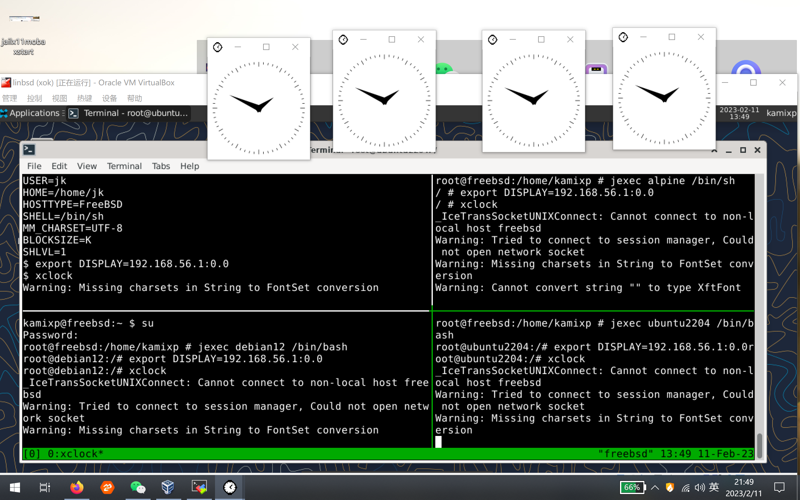
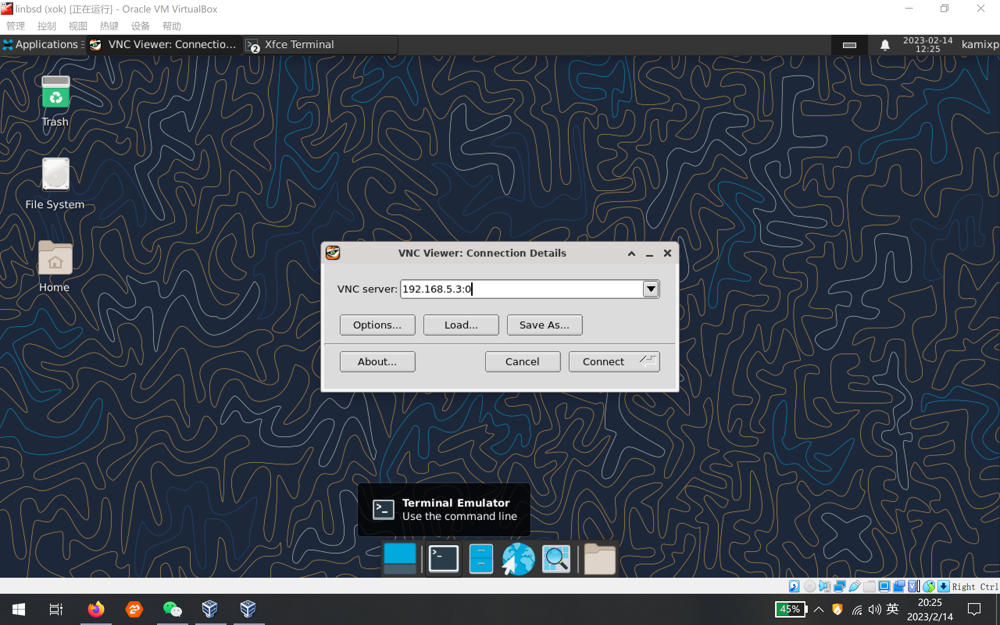
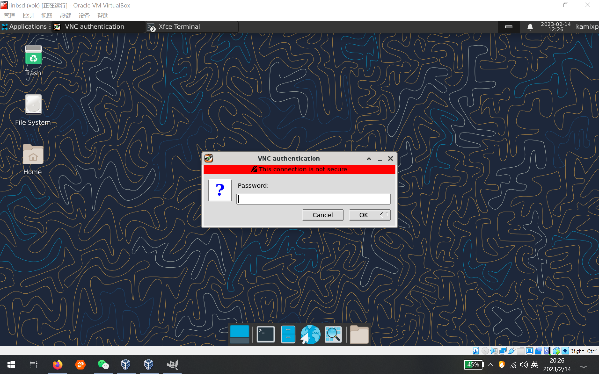

# 15.4 Linux Jail

## 概述

Linux 兼容层（Linuxulator）与 Jail 技术的结合，为 FreeBSD 提供了运行 Linux 二进制程序的能力。

Linuxulator 是 FreeBSD 内核中的一个兼容层模块，通过系统调用转换机制，使 Linux 二进制程序能够在 FreeBSD 内核上直接运行。

以下介绍在 FreeBSD Jail 中部署 Debian 用户空间环境的步骤，涵盖 debootstrap 的使用与初始化配置。

## 准备工作

本节将所有 Jail 绑定到虚拟网络接口 `lo1`，使其构成 FreeBSD 系统下的一个局域网，其中 FreeBSD 主机充当该局域网的网关。

所有 Jail 的网络流量必须通过网络接口 `lo1`，因此需要启用网络转发，本节使用 pf 防火墙实现此功能。

> **注意**
>
> 配置 pf 防火墙是实现网络访问控制的关键步骤。

### 准备网络接口

添加克隆网络接口 lo1 并启用：

```sh
# sysrc cloned_interfaces+="lo1"
# service netif cloneup
```

### 准备 pf 防火墙

提供两种配置方式，请根据需要选用。

#### 方案一

pf 防火墙的表（table）是一种命名结构，可保存地址和网络的集合，表中的地址可以通过 NAT 访问网络。

`persist` 标志使防火墙始终保留该表，即使没有相关规则引用它，从而确保表在防火墙规则重新加载时不会被自动清空。

编辑 **/etc/pf.conf** 文件，加入以下配置：

```ini
table <jails> persist
nat pass on em0 inet from <jails> to any -> em0
```

可使用 `pfctl` 对 `jails` 表进行添加或删除操作，以控制网络访问。例如：

- `pfctl -t jails -T add 192.168.5.1` 将 `192.168.5.1` 加入 jails 表使其可以访问网络。
- `pfctl -t jails -T delete 192.168.5.1` 将 `192.168.5.1` 移出 jails 表使其无法访问网络。

这种方法的特点是手动管理较为繁琐，但灵活性较高。

#### 方案二

直接在 **/etc/pf.conf** 文件中写下规则：

```ini
nat pass on em0 inet from 192.168.5.1 to any -> em0
```

此方法允许 `192.168.5.1` 访问网络，其特点是规则固化在配置文件中，对于无特殊需求的场景较为便捷。

### 启用 pf 防火墙

即使不使用防火墙规则，也需要启用 pf 服务来实现 NAT 功能：

```sh
# 启用 pf 防火墙服务开机自启动
# service pf enable

# 启动 pf 防火墙服务
# service pf start
```

### 加载 Linux 二进制兼容层（Linuxulator）内核模块

启用并启动 Linux 兼容层服务，该方式可自动加载 Linux 兼容层所需的各种内核模块：

```sh
# 设置 Linux 兼容层服务开机自启动
# service linux enable
# service linux start
```

### 准备目录

创建用于保存建立 Jail 的相关文件的目录：

```sh
# mkdir /usr/jails
```

### 文件结构

```sh
/usr/jails/
├── debian/          # Debian 12 Jail 根目录
│   ├── dev/         # devfs 挂载点
│   ├── dev/shm/     # tmpfs 挂载点
│   ├── dev/fd/      # fdescfs 挂载点
│   ├── proc/        # linprocfs 挂载点
│   ├── sys/         # linsysfs 挂载点
│   └── tmp/         # nullfs 挂载点
├── ubuntu/          # Ubuntu 22.04 Jail 根目录
│   ├── dev/
│   ├── dev/shm/
│   ├── dev/fd/
│   ├── proc/
│   ├── sys/
│   ├── tmp/
│   └── tmp/.X11-unix/  # X11 socket 挂载点
├── antix/           # antiX Linux Jail 根目录
│   ├── dev/
│   ├── dev/shm/
│   ├── dev/fd/
│   ├── proc/
│   ├── sys/
│   └── tmp/
├── alpine/          # Alpine Linux Jail 根目录
│   ├── dev/
│   ├── dev/shm/
│   ├── dev/fd/
│   ├── proc/
│   └── sys/
└── freebsd-jail/    # FreeBSD Jail 根目录

/etc/
├── fstab.debian     # Debian Jail 的 fstab 配置
├── fstab.ubuntu     # Ubuntu Jail 的 fstab 配置
├── fstab.antix      # antiX Jail 的 fstab 配置
├── fstab.alpine     # Alpine Jail 的 fstab 配置
├── jail.conf        # Jail 主配置文件
├── pf.conf          # PF 防火墙配置
└── rc.conf          # 系统启动配置
```

## 创建 Debian Jail：Debian 12 实例配置

### 下载基本系统

以 Debian 12（bookworm）为例：

构建 Ubuntu/Debian 基本系统。

```sh
# pkg install debootstrap  # 安装用于构建 Debian/Ubuntu 基本系统的工具。
# chmod 0700 /usr/local/sbin/debootstrap  # 设置可执行权限
# mkdir -p /usr/jails/debian  # 创建 Debian Jail 路径
# debootstrap bookworm /usr/jails/debian https://mirrors.ustc.edu.cn/debian/  # 使用中国科学技术大学镜像站
```

示例输出如下：

```sh
I: Retrieving InRelease
I: Retrieving Packages
I: Validating Packages
I: Resolving dependencies of required packages...
I: Resolving dependencies of base packages...
I: Checking component main on https://mirrors.ustc.edu.cn/debian...
I: Retrieving adduser 3.130
I: Validating adduser 3.130
...
I: Extracting usr-is-merged...
I: Extracting util-linux-extra...
I: Extracting zlib1g...
```

输出末尾可能出现与配置相关的提示信息，这是 debootstrap 在 chroot 环境中运行服务配置脚本时的正常现象，不影响基本系统的使用。

### 创建 Debian Jail 实例

用 Debian 12 基本系统创建 Jail 实例，命名为 debian。

#### 实例的基本配置

创建 **/etc/fstab.debian** 文件。各文件系统作用如下：

```ini
devfs      /usr/jails/debian/dev      devfs       rw                      0  0
tmpfs      /usr/jails/debian/dev/shm  tmpfs       rw,size=1g,mode=1777    0  0
fdescfs    /usr/jails/debian/dev/fd   fdescfs     rw,linrdlnk             0  0
linprocfs  /usr/jails/debian/proc     linprocfs   rw                      0  0
linsysfs   /usr/jails/debian/sys      linsysfs    rw                      0  0
/tmp       /usr/jails/debian/tmp      nullfs      rw                      0  0
```

其中 devfs 提供设备节点访问，tmpfs 为共享内存提供临时文件系统，fdescfs 提供文件描述符访问，linprocfs 和 linsysfs 分别为 Linux 应用提供兼容的 proc 和 sys 文件系统，nullfs 用于挂载宿主机的 tmp 目录。

在 **/etc/jail.conf** 文件中，加入以下内容（若无则新建）。关键配置项说明：devfs_ruleset 定义 devfs 的规则集；enforce_statfs 控制 Jail 中挂载点的可见性，取值为 0（无限制）、1（仅根目录下可见）或 2（默认，仅根目录所在挂载点可操作）：

```ini
debian {                               # Jail 名称
  host.hostname = "debian";             # 设置 Jail 的主机名
  mount.fstab = "/etc/fstab.debian";    # Jail 使用的 fstab 文件：启动或关闭 Jail 时，挂载或卸载对应的文件系统
  path = "/usr/jails/debian";           # Jail 的根目录路径
  devfs_ruleset = 4;                     # Jail 挂载 devfs 的规则集，0 表示无规则集，Jail 会继承上级规则集；
                                        # 仅在启用 allow.mount 和 allow.mount.devfs 且 enforce_statfs 小于 2 时可挂载 devfs
  enforce_statfs = 1;                    # 设置为 0：所有挂载点可用，无限制
                                        # 设置为 1：仅 Jail 根目录下的挂载点可见
                                        # 设置为 2（默认）：只能在 Jail 根目录所在挂载点操作，无法挂载 devfs、tmpfs 等
  allow.mount;                          # 允许挂载文件系统
  allow.mount.devfs;                     # 允许挂载 devfs
  exec.start = "/bin/true";              # Jail 启动时执行的命令
  exec.stop = "/bin/true";               # Jail 停止时执行的命令
  persist;                               # 允许 Jail 在无任何进程情况下仍然存在
  allow.raw_sockets;                      # 允许使用 raw Socket，例如 ping
  interface = "lo1";                      # 使用 lo1 作为网络接口
  ip4.addr = 192.168.5.1;                 # 指定 IPv4 地址
  ip6 = "disable";                        # 禁用 IPv6
}
```

`exec.start` 指定启动 Jail 时运行的命令。在 FreeBSD 中创建 Jail 时，一般使用 `exec.start = 'sh /etc/rc'` 来调用 rc 系统启动服务。

Debian 使用 systemd 作为初始化系统，而 Jail 中由于缺少必要的 cgroup 挂载和系统权限，无法使用 systemd，因此无法直接运行相应命令（但 service 命令仍可使用）。此处使用 **/bin/true** 安全返回 `true`（成功状态），不执行任何操作，这是一种在受限环境中避免服务启动失败的常用技术手段。

例如，在 debian Jail 中启用 sshd 服务后（执行 `service ssh start`），重启 Jail 时 sshd 服务不会随 Jail 自动启动。此时可设置 `exec.start = 'service ssh start'`，以确保启动 Jail 时自动启动 sshd 服务。

要启用更多服务，可按如下方式编写：

在 Jail 启动时顺序启动 SSH 和 D-Bus 服务：

```ini
exec.start += 'service ssh start'
exec.start += 'service dbus start'
```

`exec.stop` 指定停止 Jail 时运行的命令。FreeBSD Jail 通常使用 `sh /etc/rc.shutdown jail`。

同样由于 systemd 的限制，此处使用 **/bin/true** 安全返回 `true` 即可。

### 启用实例，允许网络访问

启动 Jail：

```sh
# jail -c debian
```

停止 Jail：

```sh
# jail -r debian
```

在 pf 防火墙中的 `jails` 表中加入 Jail 的地址，以允许 Jail 访问网络：

```sh
# pfctl -t jails -T add 192.168.5.1
```

### 更新系统

执行以下命令进入 Jail 并更新系统：

```sh
# jexec debian /bin/bash # 此时位于 FreeBSD
Debian # apt remove rsyslog  # 此时位于 Debian Jail
Debian # apt update # 此时位于 Debian Jail
```

### 或使用以下命令

```sh
# 在 debian Jail 内执行命令，卸载 rsyslog
# jexec -l debian /bin/bash -c "apt remove rsyslog"

# 在 debian Jail 内执行命令，更新软件包索引
# jexec -l debian /bin/bash -c "apt update"
```

至此，一个基于 Debian 12 的 Linux Jail 已成功建立，同样的方法可用于创建基于不同版本的 Debian 或 Ubuntu 的多个 Jail。

## Jail 开机自启

开机时启动 jail 服务：

```sh
# service jail enable
```

默认情况下会启动 **/etc/jail.conf** 文件中配置的所有 Jail。

也可在 **/etc/rc.conf** 文件中用 `jail_list` 变量指定在开机时启动的 Jail 的名称，编辑 **/etc/rc.conf** 文件写入：

```ini
jail_list="debian"
```

或执行：

```sh
# sysrc jail_list+=debian
```

如 `jail_list` 变量为空，则会启动所有在 **/etc/jail.conf** 文件中配置的 Jail。

## 创建 Ubuntu Jail

Ubuntu Jail 的建立方法与 Debian 相同，以 Ubuntu 22.04（Jammy）为例。

### 构建基本系统并配置

创建 Ubuntu Jail 根目录并使用 debootstrap 安装系统：

```sh
# 创建 Ubuntu Jail 根目录
# mkdir -p /usr/jails/ubuntu

# 使用 debootstrap 安装 Ubuntu Jammy 系统到 Jail，并指定镜像源
# debootstrap jammy /usr/jails/ubuntu https://mirrors.ustc.edu.cn/ubuntu/
```

创建 **/etc/fstab.ubuntu** 文件，内容如下：

```ini
devfs      /usr/jails/ubuntu/dev      devfs       rw                      0  0
tmpfs      /usr/jails/ubuntu/dev/shm  tmpfs       rw,size=1g,mode=1777    0  0
fdescfs    /usr/jails/ubuntu/dev/fd   fdescfs     rw,linrdlnk             0  0
linprocfs  /usr/jails/ubuntu/proc     linprocfs   rw                      0  0
linsysfs   /usr/jails/ubuntu/sys      linsysfs    rw                      0  0
/tmp       /usr/jails/ubuntu/tmp      nullfs      rw                      0  0
```

在 **/etc/jail.conf** 文件中写入 Ubuntu 的配置：

```ini
ubuntu {                               # Jail 名称
  host.hostname = "ubuntu";             # 设置 Jail 的主机名
  mount.fstab = "/etc/fstab.ubuntu";    # Jail 使用的 fstab 文件
  path = "/usr/jails/ubuntu";           # Jail 根目录路径
  devfs_ruleset = 4;                     # devfs 挂载规则集
  enforce_statfs = 1;                    # 设置挂载点可见性
  allow.mount;                          # 允许挂载文件系统
  allow.mount.devfs;                     # 允许挂载 devfs
  exec.start = "/bin/true";              # 启动时执行的命令
  exec.stop = "/bin/true";               # 停止时执行的命令
  persist;                               # 即使无进程也保持 Jail 存活
  allow.raw_sockets;                      # 允许使用 raw Socket
  interface = "lo1";                      # 指定网络接口
  ip4.addr = 192.168.5.2;                 # 分配 IPv4 地址
  ip6 = "disable";                        # 禁用 IPv6
}
```

### 启用实例并允许网络访问

启用实例：

```sh
# jail -c ubuntu
```

如已经在文件 **/etc/rc.conf** 中设置过 `jail_enable=YES`，也可用：

```sh
# service jail start ubuntu
```

开机启动可参考 debian Jail，执行以下命令启动名为 ubuntu 的 Jail：

```sh
# sysrc jail_list+=ubuntu
```

在 pf 防火墙中的 `jails` 表中加入 Jail 的地址，以允许 Jail 访问网络：

```sh
# pfctl -t jails -T add 192.168.5.2
```

### 更新系统

使用命令更新 Ubuntu 系统：

```sh
# jexec ubuntu /bin/bash # 此时位于 FreeBSD
Ubuntu # apt remove rsyslog  # 此时位于 Ubuntu Jail!
Ubuntu # apt update # 此时位于 Ubuntu Jail
```

还可使用以下命令：

```sh
# 在 ubuntu Jail 内执行命令，卸载 rsyslog 软件包
# jexec -l ubuntu /bin/bash -c "apt remove rsyslog"

# 在 ubuntu Jail 内执行命令，更新软件包索引
# jexec -l ubuntu /bin/bash -c "apt update"
```

过程与 Debian Jail 相同。

## 创建 antiX Linux Jail

antiX Linux 是基于 Debian 的轻量级发行版，采用 SysVinit 初始化系统而非 systemd。SysVinit 是传统的 UNIX 初始化系统，依赖运行级别（runlevels）和 init 脚本进行服务管理，在 Jail 环境中具有更好的兼容性。

### 下载镜像文件并解压

先安装 `squashfs-tools`，用以解压 antiX Linux 文件系统镜像。

使用 pkg 安装 squashfs-tools：

```sh
# pkg install squashfs-tools
```

antiX Linux 提供了四款镜像版本：full、base、core 和 net，本示例下载 core 版本：

```sh
# 下载 antiX 23.2 Core ISO 镜像
# fetch https://mirrors.tuna.tsinghua.edu.cn/mxlinux-isos/ANTIX/Final/antiX-23.2/antiX-23.2_x64-core.iso

# 将 ISO 文件挂载为内存设备
# mdconfig -a -t vnode -f antiX-23.2_x64-core.iso

# 将内存设备挂载到 /mnt，类型为 cd9660
# mount -t cd9660 /dev/md0 /mnt

# 创建 antiX Jail 根目录
# mkdir -p /usr/jails/antix

# 解压 squashfs 文件系统到 Jail 根目录
# unsquashfs -d /usr/jails/antix /mnt/antiX/linuxfs

# 创建必要的设备节点
# touch /usr/jails/antix/dev/fd
# touch /usr/jails/antix/dev/shm
```

### 配置 antiX Jail

创建 **/etc/fstab.antix** 文件，内容如下：

```ini
devfs      /usr/jails/antix/dev      devfs       rw                      0  0
tmpfs      /usr/jails/antix/dev/shm  tmpfs       rw,size=1g,mode=1777    0  0
fdescfs    /usr/jails/antix/dev/fd   fdescfs     rw,linrdlnk             0  0
linprocfs  /usr/jails/antix/proc     linprocfs   rw                      0  0
linsysfs   /usr/jails/antix/sys      linsysfs    rw                      0  0
/tmp       /usr/jails/antix/tmp      nullfs      rw                      0  0
```

在 **/etc/jail.conf** 文件中写入（只展示 antiX 相关部分）：

```ini
antix {                               # Jail 名称
  host.hostname = "antix";             # 设置 Jail 的主机名
  mount.fstab = "/etc/fstab.antix";    # Jail 使用的 fstab 文件
  path = "/usr/jails/antix";           # Jail 根目录路径
  devfs_ruleset = 4;                     # devfs 挂载规则集
  enforce_statfs = 1;                    # 设置挂载点可见性
  allow.mount;                          # 允许挂载文件系统
  allow.mount.devfs;                     # 允许挂载 devfs
  exec.start = "/etc/init.d/rc 3";       # 启动 Jail 时执行的命令（运行级别 3）
  exec.stop = "/etc/init.d/rc 0";        # 停止 Jail 时执行的命令（运行级别 0）
  persist;                               # 即使无进程也保持 Jail 存活
  allow.raw_sockets;                      # 允许使用 raw Socket
  interface = "lo1";                      # 指定网络接口
  ip4.addr = 192.168.5.3;                 # 分配 IPv4 地址
  ip6 = "disable";                        # 禁用 IPv6
}
```

此处将 `exec.start` 设置为 **/etc/init.d/rc 3**。

如前文所述，Debian 使用 systemd 作为初始化系统，在 Jail 中无法使用，因此其 Jail 配置使用 **/bin/true** 安全返回 `true` 而不执行任何操作。

antiX 不使用 systemd，而是使用 rc 进行初始化。此处 **/etc/init.d/rc 3** 指定 antiX Jail 在运行级别 3 启动，因此 Debian Jail 中的服务启动问题在这里不存在，可直接在 Jail 启动时运行服务（如 sshd）。

### 更新系统

设置开机自启，然后启动：

```sh
# sysrc jail_list+=antix  # 将 antix Jail 添加到系统开机启动列表
# jail -c antix   # 或者使用 service jail start antix
```

在 pf 中允许网络访问，方法同上：

```sh
# pfctl -t jails -T add 192.168.5.3	# 将 IP 地址 192.168.5.3 添加到 pf 防火墙的 jails 表中
```

现在进入 Jail：

```sh
# jexec antix /bin/bash     # 物理机（FreeBSD）中
root@antix:/# echo "nameserver 223.5.5.5" > /etc/resolv.conf    # Jail 中，注意提示符变化，先设置地址解析，这里使用阿里云公共 DNS
root@antix:/# echo "APT::Cache-Start 90000000;" >> /etc/apt/apt.conf   # `APT::Cache-Start` 可设置 apt 缓存大小，默认 20 MB 太小，可按提示增大
root@antix:/# apt update         # 可先修改 /etc/apt/sources.list.d/ 中的文件以使用镜像站，请参考各镜像站中 Debian 的镜像站设置
root@antix:/# apt upgrade  # 更新系统和软件包
root@antix:/# mandb       # apt upgrade 时若出现 mandb 权限错误，多次执行 `mandb` 命令即可完成索引更新。
```

apt upgrade 过程中可能出现 mandb 权限相关提示，多次执行 `mandb` 命令可完成索引更新。

## 创建 Alpine Jail

构建基本系统：

```sh
# 下载 Alpine Linux 3.17.1 minirootfs 镜像
# fetch http://mirrors.ustc.edu.cn/alpine/v3.17/releases/x86_64/alpine-minirootfs-3.17.1-x86_64.tar.gz

# 创建 Alpine Jail 根目录
# mkdir -p /usr/jails/alpine

# 解压 minirootfs 到 Jail 根目录
# tar zxf alpine-minirootfs-3.17.1-x86_64.tar.gz -C /usr/jails/alpine/

# 创建必要的设备节点
# touch /usr/jails/alpine/dev/shm
# touch /usr/jails/alpine/dev/fd
```

创建 **/etc/fstab.alpine** 文件。**/tmp** 挂载被注释掉是为了避免将整个宿主机 **/tmp** 目录暴露给 Jail，提高安全性：

```ini
devfs      /usr/jails/alpine/dev      devfs       rw                      0  0
tmpfs      /usr/jails/alpine/dev/shm  tmpfs       rw,size=1g,mode=1777    0  0
fdescfs    /usr/jails/alpine/dev/fd   fdescfs     rw,linrdlnk             0  0
linprocfs  /usr/jails/alpine/proc     linprocfs   rw                      0  0
linsysfs   /usr/jails/alpine/sys      linsysfs    rw                      0  0
#/tmp       /usr/jails/alpine/tmp      nullfs      rw                      0  0
```

在 **/etc/jail.conf** 文件中写入：

```ini
alpine {                               # Jail 名称
  host.hostname = "alpine";             # 设置 Jail 的主机名
  mount.fstab = "/etc/fstab.alpine";    # Jail 使用的 fstab 文件
  path = "/usr/jails/alpine";           # Jail 根目录路径
  devfs_ruleset = 4;                     # devfs 挂载规则集
  enforce_statfs = 1;                    # 设置挂载点可见性
  allow.mount;                          # 允许挂载文件系统
  allow.mount.devfs;                     # 允许挂载 devfs
  exec.start = "/bin/true";              # minirootfs 中未初始化系统，暂使用 /bin/true，后续会设置 openrc
  exec.stop = "/bin/true";               # 停止时使用 /bin/true
  persist;                               # 即使无进程也保持 Jail 存活
  allow.raw_sockets;                      # 允许使用 raw Socket
  interface = "lo1";                      # 指定网络接口
  ip4.addr = 192.168.5.4;                 # 分配 IPv4 地址
  ip6 = "disable";                        # 禁用 IPv6
}
```

设置开机时启动，然后立即启动：

```sh
# sysrc jail_list+="alpine"
# jail -c alpine
```

在 pf 中允许网络访问，方法同上：

```sh
# pfctl -t jails -T add 192.168.5.4
```

现在进入 Jail。minirootfs 仅提供基础环境，安装 OpenRC 可获得完整的服务管理能力：

```sh
freebsd # jexec alpine /bin/sh        # 初始只有 sh，注意 Shell 提示符的变化
alpine # sed  -i 's/dl-cdn.alpinelinux.org/mirrors.ustc.edu.cn/' /etc/apk/repositories    # 修改镜像地址
alpine # echo 'nameserver 223.5.5.5' >> /etc/resolv.conf      #  初始没有此文件，需自行创建
alpine # apk update             # Alpine 可直接运行程序，但无法启动系统服务，需安装 OpenRC 后才能管理服务，建议安装 OpenRC 以获得更完整体验
alpine # apk add openrc         # 安装 OpenRC 作为初始化系统
alpine # mkdir /run/openrc  # 创建 OpenRC 运行目录
alpine # touch /run/openrc/softlevel      # 在 Docker、Chroot 或 Jail 环境中使用 OpenRC 时建议创建此文件
alpine # exit    # 注意 Shell 提示符的变化
FreeBSD # jail -r alpine    # 先关闭 Alpine，以便在 FreeBSD 宿主机中进行 OpenRC 配置
```

修改 **/etc/jail.conf** 文件中 Alpine 的配置：

```ini
alpine {                               # Jail 名称
  host.hostname = "alpine";             # 设置 Jail 的主机名
  mount.fstab = "/etc/fstab.alpine";    # Jail 使用的 fstab 文件
  path = "/usr/jails/alpine";           # Jail 根目录路径
  devfs_ruleset = 4;                     # devfs 挂载规则集
  enforce_statfs = 1;                    # 设置挂载点可见性
  allow.mount;                          # 允许挂载文件系统
  allow.mount.devfs;                     # 允许挂载 devfs
  exec.start = "/sbin/openrc default";   # 使用 OpenRC 初始化系统，启动 default 运行级别
  exec.stop = "/sbin/openrc shutdown";   # 使用 OpenRC 初始化系统，执行 shutdown 运行级别任务
  persist;                               # 即使无进程也保持 Jail 存活
  allow.raw_sockets;                      # 允许使用 raw Socket
  interface = "lo1";                      # 指定网络接口
  ip4.addr = 192.168.5.4;                 # 分配 IPv4 地址
  ip6 = "disable";                        # 禁用 IPv6
}
```

重启 alpine Jail：

```sh
# jail -c alpine
```

## Jail 中的 GUI

本节示例环境为 Windows 10 物理机，运行 VirtualBox 安装的 FreeBSD 13.1 虚拟机。

在 FreeBSD 虚拟机中已部署了 4 个 Jail。其中包含一个 FreeBSD Jail，为区别于 VirtualBox 中的 FreeBSD 虚拟机，称其为 `freebsd-jail`：

Windows 10 物理机 → FreeBSD 13.1 虚拟机 → FreeBSD Jail（`freebsd-jail`）+ debian Jail + Ubuntu Jail + Alpine Jail。

```sh
# jls
   JID  IP Address      Hostname                      Path
     1  192.168.5.1     debian                      /usr/jails/debian
     2  192.168.5.2     ubuntu                    /usr/jails/ubuntu
     3  192.168.5.4     alpine                        /usr/jails/alpine
     4  192.168.5.5     freebsd-jail                  /usr/jails/freebsd-jail
```

目录结构：

```sh
/usr/jails/
├── debian/          # JID 1, IP 192.168.5.1
├── ubuntu/          # JID 2, IP 192.168.5.2
├── alpine/          # JID 3, IP 192.168.5.4
└── freebsd-jail/    # JID 4, IP 192.168.5.5
```

在这 4 个 Jail 中分别安装 xclock、Firefox、Chrome、jwm 这几款软件。

在 freebsd-jail、Debian、Ubuntu 和 Alpine 中均已成功安装相关软件，其中 jwm 用于美化界面。说明：Alpine 的 VNC 方法未成功，Firefox 和 Chrome 在 Alpine 中也未成功，但 xclock、xterm 等可运行。

> **技巧**
>
> 无需安装 xorg。

在 Ubuntu 22.04 中，Firefox 默认以 snap 包形式分发，snap 依赖 systemd，无法在 Jail 中使用，因此需使用 deb 包安装。Chrome 在 Ubuntu 中仅提供 deb 包，不依赖 snap，可直接安装。方法如下：

```sh
# 下载 Google Chrome 稳定版安装包
# wget https://dl.google.com/linux/direct/google-chrome-stable_current_amd64.deb

# 使用 dpkg 安装下载的 deb 包
# dpkg -i google-chrome-stable_current_amd64.deb

# 若 dpkg 安装有依赖问题，可使用 apt 安装本地 deb 包并自动处理依赖
# apt install ./google-chrome-stable_current_amd64.deb
```

### 带 X Server 的终端

使用 MobaXterm。MobaXterm 采用默认配置，无多余配置。


确保 X server 已经启用，记下 `DISPLAY` 值，格式是 `hostname:displaynumber.screennumber`，这里是 `192.168.56.1:0.0`。

登录 Jail（不限方式且不限用户）：

```sh
$ export DISPLAY=192.168.56.1:0.0  # Jail 中，这里是 sh/zsh/bash。csh/tcsh 是 setenv DISPLAY 192.168.56.1:0.0，下同
$ xclock&  # 在后台运行 xclock
```



在 Windows 10 桌面上显示了 4 个独立的 xclock，效果较为理想。

### 内嵌 X Server

Xnest/Xephyr 是嵌套式 X Server 技术，对 X11 应用来说是 X Server，对宿主 X Server 来说是 X Client，这种嵌套结构可在一个 X 窗口中运行另一个完整的 X 会话。

在 FreeBSD 虚拟机里安装 Xnest 或 Xephyr。二者择其一即可：

```sh
# pkg install Xnest
```

或：

```sh
# pkg install Xephyr
```

在 FreeBSD 中启用：

```sh
$ Xephyr :1 -listen tcp
```

参数说明：

- `:1` 即 `DISPLAY` 值中的 `displaynumber`。FreeBSD 系统 IP 为 `10.0.2.15`，所以完整的 `DISPLAY` 值为 `10.0.2.15:1.0`。因为 FreeBSD 系统 X Server 的 `displaynumber` 值为 `0`，所以从 `1` 开始。
- `-listen tcp` 侦听 TCP 端口。

在 Jail 中，采取与上面相同的方法：

```sh
$ export DISPLAY=10.0.2.15:1.0
$ xclock&
```

四个 Jail 可以同时在 FreeBSD 开启的一个 Xnest/Xephyr 窗口中打开 xclock。然而此时的 xclock 由于没有窗口管理器，缺少窗口装饰和基本交互功能。可在执行 xclock 前先执行 jwm，如下：

```sh
$ export DISPLAY=10.0.2.15:1.0
$ jwm &
$ xclock&
```

jwm 执行一次即可，无需在每个 Jail 中分别执行。此处使用 jwm 是因为其轻量级，Xfce 等桌面环境也可使用，可根据需要尝试。

### 共享主机 socket 方式

先在 FreeBSD 系统上执行：

```sh
$ xhost +
```

注意：`xhost +` 会关闭访问控制，存在安全风险。更安全的方式是指定允许访问的 IP 地址。

然后在 Jail 的 `fstab` 文件中加入下面内容，以 ubuntu Jail 的 `fstab` 为例，其他 Jail 参照修改即可：

```ini
/tmp/.X11-unix   /usr/jails/ubuntu/tmp/.X11-unix    nullfs   ro   0  0
```

必要时先 `mkdir -p /usr/jails/ubuntu/tmp/.X11-unix`，确保有挂载点。

重启 jail 后，在 jail 中执行：

```sh
$ export DISPLAY=:0.0
$ xclock &
```

上文提到 `fstab` 文件中有下面这样一行：

```sh
#/tmp   /usr/jails/ubuntu/tmp   nullfs  rw    0  0
```

该写法将 FreeBSD 的 **/tmp** 目录暴露在 Jail 中并且可读写，破坏隔离性，因此注释掉。而仅挂载 **/tmp/.X11-unix** 可显著提高安全性。

### X Server TCP 侦听加 xhost 连接管理

此处使用 SDDM 桌面管理器，如使用其他桌面管理器，请参考相应文档，原理相同。

在 FreeBSD 内编辑或新建 **/usr/local/etc/sddm.conf** 文件，修改 `ServerArguments` 内容如下：

```sh
[X11]
ServerArguments=-listen tcp
```

重启后，在 FreeBSD 上用以下方式加入 Jail IP 以允许访问：

```sh
$ xhost + 192.168.5.1
```

这种方式比 `xhost +` 更安全，仅允许指定 IP 访问。

然后在 Jail 中，执行：

```sh
$ export DISPLAY=:0.0
$ xclock &
```

将 `DISPLAY` 设为 `:0.0`、`127.0.0.1:0.0`、`10.0.2.15:0.0` 均可成功，上述几种方法也可逐一尝试。

### VNC

在 Jail 中安装 vnc server，可使用 tightvnc-server，也可使用 tigervnc-server，以 debian Jail 为例，在 Jail 中执行：

```sh
# apt install tightvncserver
$ vncpasswd
Password:
Verify:
Would you like to enter a view-only password (y/n)? n
A view-only password is not used
$ vncserver :0
```

vncserver 的端口号为 5900 加上冒号后的数字，现在为 5900，`:1` 端口号为 5901，以此类推。

使用 VNC 客户端登录：






### 备注

宿主机 X Server TCP 侦听加 xhost 连接管理的方式安全性较差，这是 TCP 侦听默认关闭的原因之一。

共享宿主机 Socket 的方式，需注意仅挂载 **/tmp/.X11-unix** 而非整个 **/tmp**，并使用 `xhost +指定IP` 而非 `xhost +`，做到这两点即可保障安全性。

带 X Server 的终端、共享主机 Socket、VNC 这三种方式较为推荐。无论采用哪种方式，Linux Jail 中的兼容性存在一定限制，不应期望每个 X 应用都能运行。FreeBSD Jail 的兼容性则更好。

除共享宿主机 Socket 的方法外，其他方法同样可在非 Jail 环境中使用。

## 参考文献

- FreeBSD Wiki. LinuxApps[EB/OL]. [2026-03-25]. <https://wiki.freebsd.org/LinuxApps>. 列出了在 FreeBSD 上运行的 Linux 应用及方法，为兼容性实践提供参考。
- FreeBSD 中文手册. 12.2. 配置 Linux 二进制兼容层[EB/OL]. [2026-03-25]. <https://handbook.bsdcn.org/di-12-zhang-linux-er-jin-zhi-jian-rong-ceng/12.2.-pei-zhi-linux-er-jin-zhi-jian-rong-ceng.html>. FreeBSD 中文手册中关于 Linuxulator 配置的详细指南。
- FreeBSD Project. linux -- Linux ABI support[EB/OL]. [2026-03-25]. <https://www.freebsd.org/cgi/man.cgi?linux>. 官方手册详细说明 Linux 兼容层的系统调用转换机制。
- FreeBSD Project. bwn -- Broadcom BCM43xx IEEE 802.11b/g wireless network driver[EB/OL]. [2026-04-17]. <https://man.freebsd.org/cgi/man.cgi?query=bwn&sektion=4>. Broadcom 无线网卡驱动手册页。
- FreeBSD Wiki. Linuxulator[EB/OL]. [2026-03-25]. <https://wiki.freebsd.org/Linuxulator>. 提供 Linuxulator 技术原理与实现细节的权威文档。
- FreeBSD Wiki. LinuxJails[EB/OL]. [2026-03-25]. <https://wiki.freebsd.org/LinuxJails>. 介绍如何在 FreeBSD Jail 中部署 Linux 用户空间环境。
- FreeBSD 中文手册. 12.3. Linux 用户空间[EB/OL]. [2026-03-25]. <https://handbook.bsdcn.org/di-12-zhang-linux-er-jin-zhi-jian-rong-ceng/12.3.-linux-yong-hu-kong-jian.html>. 中文手册中关于构建完整 Linux 用户空间环境的教程。
- Ubuntu Documentation. Install Firefox on Linux[EB/OL]. Mozilla, [2026-04-17]. <https://support.mozilla.org/en-US/kb/install-firefox-linux>. Firefox 在 Ubuntu 22.04 中默认以 snap 分发，也可通过 PPA 以 deb 包安装。

## 课后习题

1. 部署 Debian 12 Linux Jail 并在其中运行 X11 应用，验证三种不同 X Server 连接方法的安全性与功能性差异。

2. 对比 systemd（Debian）、SysVinit（antiX）和 OpenRC（Alpine）三种初始化系统在 Jail 中的兼容性，分析技术选型如何影响系统能力。

3. 修改 Linux Jail 的 enforce_statfs 配置，观察挂载点可见性变化，分析该参数的作用。
