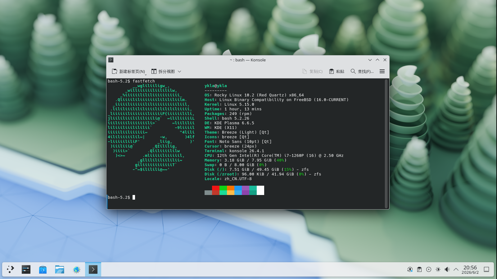

# 15.2 Rocky Linux 兼容层

FreeBSD 通过 **emulators/linux-rl9** Port（内置 linux_base-rl9）提供 Rocky Linux 9.7 兼容层。本节介绍安装步骤、版本验证及基础配置。

## 通过 FreeBSD Ports 安装 Rocky Linux 兼容层

### Rocky Linux 版本号概述

截至 2026 年 2 月 16 日，FreeBSD Ports 的 [emulators/linux-rl9](https://www.freshports.org/emulators/linux-rl9/)（其实际对应的基础包为 [emulators/linux_base-rl9](https://www.freshports.org/emulators/linux_base-rl9/)）基于 Rocky Linux 9.7 发行版构建。

在 Rocky Linux 兼容层环境中查看当前 Linux 发行版的版本信息：

```sh
bash-5.1$ cat /etc/redhat-release      # Rocky Linux 兼容层内
Rocky Linux release 9.7 (Blue Onyx)
```

该版本号仅具有参考意义，并非绝对标识。**/etc/redhat-release** 文件由 Rocky Linux 的 `rocky-release` 软件包提供，内容为静态文本。Linux 发行版本质上是多个独立软件包的集合。单一软件包的版本信息无法断定发行版中所有软件包均属于同一版本，因此 Linux 发行版的版本号是一个相对概念。

进一步观察提交记录 [emulators/linux_base-rl9: update to Rocky Linux 9.7 (+)](https://github.com/freebsd/freebsd-ports/commit/3eb21a5228ef7b1c30886e17ad3f53b0066e1fa9) 可知，真正决定版本号的是 Ports 框架中的 [Mk/Uses/linux.mk](https://github.com/freebsd/freebsd-ports/blob/main/Mk/Uses/linux.mk) 文件中的 `LINUX_DIST_VER` 变量的值：

```make
.  if empty(linux_ARGS)
.    if exists(${LINUXBASE}/etc/pki/rpm-gpg/RPM-GPG-KEY-CentOS-7)  # 检查兼容层内是否存在文件 RPM-GPG-KEY-CentOS-7，如果有则为 CentOS 7 兼容层
linux_ARGS=		c7
.    elif exists(${LINUXBASE}/etc/pki/rpm-gpg/RPM-GPG-KEY-Rocky-9) # 检查兼容层内是否存在文件 RPM-GPG-KEY-Rocky-9，如果有则为 Rocky Linux 9 兼容层
linux_ARGS=		rl9
.    else
linux_ARGS=		${LINUX_DEFAULT}
.    endif
.  endif

.  if ${linux_ARGS} == c7  # 检查是不是 CentOS 7 兼容层
LINUX_DIST_VER?=	7.9.2009    # 当前引入的是 CentOS 7.9.2009
.  elif ${linux_ARGS} == rl9   # 检查是否为 Rocky Linux 9 兼容层
LINUX_DIST_VER?=	9.7  # 当前引入的是 Rocky Linux 9.7
.  else
ERROR+=			"Invalid Linux distribution: ${linux_ARGS}"  # 如果都不是则直接打印错误信息
.  endif
```

### 启用 Linux 兼容层服务

安装 Rocky Linux 兼容层前，需先启用 Linux 兼容层服务。

启用 Linux 兼容层服务，并设置为开机自启：

```sh
# service linux enable
```

立即启动 Linux 兼容层服务：

```sh
# service linux start
```

### 安装基本系统

- 使用 pkg 安装：

```sh
# pkg install linux-rl9
```

- 也可使用 Ports 安装：

```sh
# cd /usr/ports/emulators/linux-rl9/
# make install clean
```

### 配置相关服务

安装完成后，还需配置相关服务。

```sh
# service dbus enable  # 通常桌面环境已经配置
# service dbus start  # 通常桌面环境已经配置
```

重启系统后生效。

## 通过 Shell 脚本安装 Rocky Linux 10 兼容层

以下脚本将在 **/compat/rocky** 下构建 Rocky Linux 10.2（代号 Red Quartz）。

```sh
#!/bin/sh

ROOT_DIR=/compat
DIST=rocky
DIST_FULLNAME="Rocky Linux"
VER=10
SUB_VER=2
TIME_VER="latest"
SORT=Base
FILE=Rocky-${VER}-WSL-${SORT}.${TIME_VER}.x86_64.wsl
SUBDIR=""
URL=https://mirrors.ustc.edu.cn/${DIST}/${VER}.${SUB_VER}/images/x86_64
UPDATE_CMD="dnf makecache"
UPGRADE_CMD="dnf upgrade -y"
INSTALL_CMD="dnf install -y"
UPDATE=1
UPGRADE=1
INSTALL=1

# 提前创建目标目录
TARGET_PATH="${ROOT_DIR}/${DIST}"
mkdir -p "${TARGET_PATH}"

echo "Starting ${DIST_FULLNAME} installation"
sleep 0.5

# 检查 Linux 模块
echo "Checking required modules"

if [ "$(sysrc -n linux_enable 2>/dev/null)" != "YES" ]; then
    echo "Linux service is not enabled. Enable it now? (Y|n)"
    read ANSWER
    case $ANSWER in
        [Nn][Oo]|[Nn])
            echo "Warning: You must start the Linux service with \"service linux start\" after each FreeBSD reboot."
            echo "Are you sure you want to continue without enabling the Linux service? (y|N)"
            read ANSWER
            case $ANSWER in
                [Yy][Ee][Ss]|[Yy])
                    echo "WARNING: Linux module not enabled"
                    ;;
                [Nn][Oo]|[Nn]|"")
                    echo "Enabling Linux module"
                    service linux enable
                    ;;
                *)
                    echo "Aborting."
                    exit 4
                    ;;
            esac
            ;;
        [Yy][Ee][Ss]|[Yy]|"")
            echo "Enabling Linux module"
            service linux enable
            ;;
        *)
            echo "Aborting."
            exit 4
            ;;
    esac
fi

echo "Starting Linux service"
service linux start

# 检查 dbus
if ! which -s dbus-daemon; then
    echo "dbus-daemon not found. Install D-Bus now? (Y|n)"
    read ANSWER
    case $ANSWER in
        [Nn][Oo]|[Nn])
            echo "Aborting. D-Bus not installed"
            exit 2
            ;;
        [Yy][Ee][Ss]|[Yy]|"")
            echo "Installing D-Bus"
            pkg install -y dbus
            ;;
        *)
            echo "Aborting."
            exit 4
            ;;
    esac
fi

if [ "$(sysrc -n dbus_enable 2>/dev/null)" != "YES" ]; then
    echo "D-Bus is not enabled. Enable it now? (Y|n)"
    read ANSWER
    case $ANSWER in
        [Nn][Oo]|[Nn])
            echo "WARNING: You must start D-Bus with \"service dbus start\" after each FreeBSD reboot."
            echo "Are you sure you want to continue without enabling D-Bus? (y|N)"
            read ANSWER
            case $ANSWER in
                [Yy][Ee][Ss]|[Yy])
                    echo "Warning: D-Bus service not enabled"
                    ;;
                [Nn][Oo]|[Nn]|"")
                    echo "Enabling D-Bus service"
                    service dbus enable
                    ;;
                *)
                    echo "Aborting."
                    exit 4
                    ;;
            esac
            ;;
        [Yy][Ee][Ss]|[Yy]|"")
            echo "Enabling D-Bus service"
            service dbus enable
            ;;
        *)
            echo "Aborting."
            exit 4
            ;;
    esac
fi


# =====================================================================
# 下载与解压主体逻辑
# =====================================================================
echo "${DIST_FULLNAME} will be installed in ${TARGET_PATH}"

# 动态完整性校验
check_integrity() {
    # 1. 目标文件不存在，直接返回失败
    [ -f "${FILE}" ] || return 1

    # 2. 检查校验文件是否存在
    if [ ! -f "CHECKSUM" ]; then
        echo "Error: CHECKSUM file is missing." >&2
        return 1
    fi

    # 3. 从 CHECKSUM 中提取对应文件的期望哈希值
    local expected_hash
    expected_hash=$(grep "(${FILE})" CHECKSUM | awk '{print $NF}')

    if [ -z "${expected_hash}" ]; then
        echo "Warning: No checksum found for ${FILE} in CHECKSUM file." >&2
        return 1
    fi

    # 4. 获取本地实际哈希值
    local actual_hash
    if command -v sha256 >/dev/null 2>&1; then
        actual_hash=$(sha256 -q "${FILE}")
    else
        echo "Error: sha256 command not found on this system." >&2
        return 1
    fi

    # 打印 SHA256 比对清单
    echo "========================================================"
    echo " Verifying checksum for: ${FILE}"
    echo "--------------------------------------------------------"
    echo " Expected SHA256: ${expected_hash}"
    echo " Actual   SHA256: ${actual_hash}"
    echo "========================================================"

    # 5. 字符串比对
    if [ "${expected_hash}" = "${actual_hash}" ]; then
        echo " -> Status: [ OK ] Checksum matched perfectly."
        return 0
    else
        echo " -> Status: [ FAILED ] Checksum mismatch!"
        return 1
    fi
}

# 核心前置：下载最新的 CHECKSUM 校验清单
echo "Updating verification manifest (CHECKSUM)..."
fetch "${URL}/CHECKSUM"

if [ ! -f "CHECKSUM" ]; then
    echo "Critical Error: Failed to download CHECKSUM manifest from remote server." >&2
    exit 1
fi

# 步骤 1：检查本地是否已有有效文件
if check_integrity; then
    echo "Skipping download as valid archive is already present."
else
    # 如果文件存在但校验失败，说明上一次下载未完成，尝试断点续传
    if [ -f "${FILE}" ]; then
        echo "Local file exists but is incomplete or invalid. Attempting to resume download..."
    else
        echo "Downloading basic system..."
    fi

    # 第一次下载：配合 -r 参数开启断点续传
    fetch -r "${URL}/${FILE}"

    # 步骤 2：下载后进行校验，失败则重试一次
    if ! check_integrity; then
        echo "Cleaning up corrupted cache and retrying download one last time..."

        # 清除可能损坏的断点残片，重试完整下载
        rm -f "${FILE}"
        fetch "${URL}/${FILE}"

        # 最终校验：若仍失败，终止脚本
        if ! check_integrity; then
            echo "Error: Installation aborted due to persistent checksum failures." >&2
            exit 1
        fi
    fi
fi

# 步骤 3：解压基础系统
echo "Extracting basic system"
sleep 0.5
tar xvpf "${FILE}" ${SUBDIR:-} -C "${TARGET_PATH}" --numeric-owner

# 修改兼容层默认路径
sysctl compat.linux.emul_path="${TARGET_PATH}"
if ! grep -q "compat.linux.emul_path" /etc/sysctl.conf; then
    echo "compat.linux.emul_path=${TARGET_PATH}" >> /etc/sysctl.conf
else
    # 如果已存在则更新它
    sed -i '' "s|compat.linux.emul_path=.*|compat.linux.emul_path=${TARGET_PATH}|" /etc/sysctl.conf
fi

linux_path=$(sysctl -n compat.linux.emul_path)
echo "Now compat.linux.emul_path is $linux_path"

# 设置 Linux 内核版本，否则 chroot 时将提示 FATAL: kernel too old
sysctl compat.linux.osrelease=7.0.11
if ! grep -q "compat.linux.osrelease" /etc/sysctl.conf; then
    echo "compat.linux.osrelease=7.0.11" >> /etc/sysctl.conf
else
    sed -i '' "s|compat.linux.osrelease=.*|compat.linux.osrelease=7.0.11|" /etc/sysctl.conf
fi

osrelease=$(sysctl -n compat.linux.osrelease)
echo "Now compat.linux.osrelease is $osrelease"
service linux restart

# 配置 DNS
echo "Should ${DIST_FULLNAME} use Alibaba DNS or local resolv.conf? ((A)li | (L)ocal | (C)ancel)"
read ANSWER
case $ANSWER in
    [Aa][Ll][Ii]|[Aa]|"")
        echo "Setting Alibaba DNS"
		grep -q "nameserver 223.5.5.5" "${TARGET_PATH}/etc/resolv.conf" 2>/dev/null || \
		    echo "nameserver 223.5.5.5" >> "${TARGET_PATH}/etc/resolv.conf"
		grep -q "nameserver 223.6.6.6" "${TARGET_PATH}/etc/resolv.conf" 2>/dev/null || \
		    echo "nameserver 223.6.6.6" >> "${TARGET_PATH}/etc/resolv.conf"
        ;;
    [Ll][Oo][Cc][Aa][Ll]|[Ll])
        echo "Using local resolv.conf"
        cp /etc/resolv.conf "${TARGET_PATH}/etc/resolv.conf"
        ;;
    *)
        echo "Canceled."
        echo "You must manually edit ${TARGET_PATH}/etc/resolv.conf!"
        ;;
esac

# 设置 USTC 镜像源
echo "Do you want to use the USTC mirror for ${DIST_FULLNAME}? (Y|n)"
read ANSWER
case $ANSWER in
    [Yy][Ee][Ss]|[Yy]|"")
        echo "Setting USTC mirror"
        chroot "${TARGET_PATH}" /bin/bash -c 'sed \
            -e "s|^mirrorlist=|#mirrorlist=|g" \
            -e "s|^#baseurl=http://dl.rockylinux.org/\$contentdir|baseurl=https://mirrors.ustc.edu.cn/rocky|g" \
            -i.bak \
            /etc/yum.repos.d/rocky-extras.repo \
            /etc/yum.repos.d/rocky.repo'
        ;;
    [Nn][Oo]|[Nn])
        echo "Will not set USTC mirror. Skipping update, upgrade, and installation."
        UPDATE=0
        UPGRADE=0
        INSTALL=0
        ;;
    *)
        echo "Aborting."
        exit 4
        ;;
esac

# 更新、升级和安装软件
# 在 FreeBSD 中，ping -W 参数的单位是毫秒
if ping -c 1 -W 3000 223.5.5.5 > /dev/null 2>&1; then
    echo "Network reachable, starting package operations..."

    # 1. 更新包缓存
    if [ "$UPDATE" = "1" ]; then
        echo "Updating package cache..."
        chroot "${TARGET_PATH}" /bin/bash -c "${UPDATE_CMD}" || exit 1
    fi

    # 2. 升级系统包
    if [ "$UPGRADE" = "1" ]; then
        echo "Upgrading system packages..."
        chroot "${TARGET_PATH}" /bin/bash -c "${UPGRADE_CMD}" || exit 1
    fi

    # 3. 安装工具和语言包
    if [ "$INSTALL" = "1" ]; then
        echo "Installing nano and language packs..."
        chroot "${TARGET_PATH}" /bin/bash -c "${INSTALL_CMD} nano langpacks-en glibc-all-langpacks" || exit 1
    fi

else
    echo "Network unreachable, skipping updates and installation."
fi

# 清理
echo "Cleaning up"
rm -f "${FILE}"

echo "All done."
echo "You can switch to ${DIST_FULLNAME} with \"chroot ${TARGET_PATH} /bin/bash\""
```



## 参考文献

- Rocky Linux Documentation. Rocky Linux 9 Release Notes[EB/OL]. [2026-04-17]. <https://docs.rockylinux.org/9/release_notes/>. Rocky Linux 9 系列各版本的发行说明，9.7 代号 Blue Onyx。
