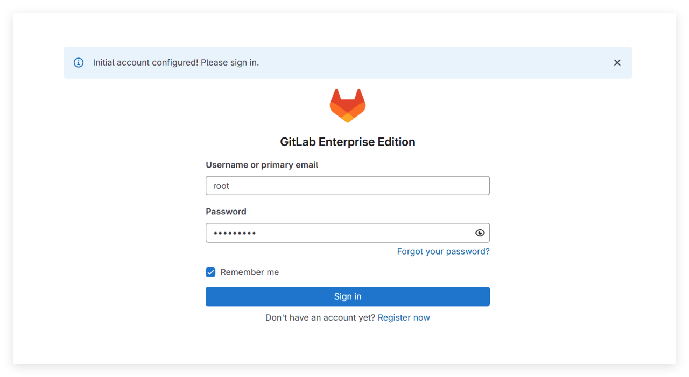
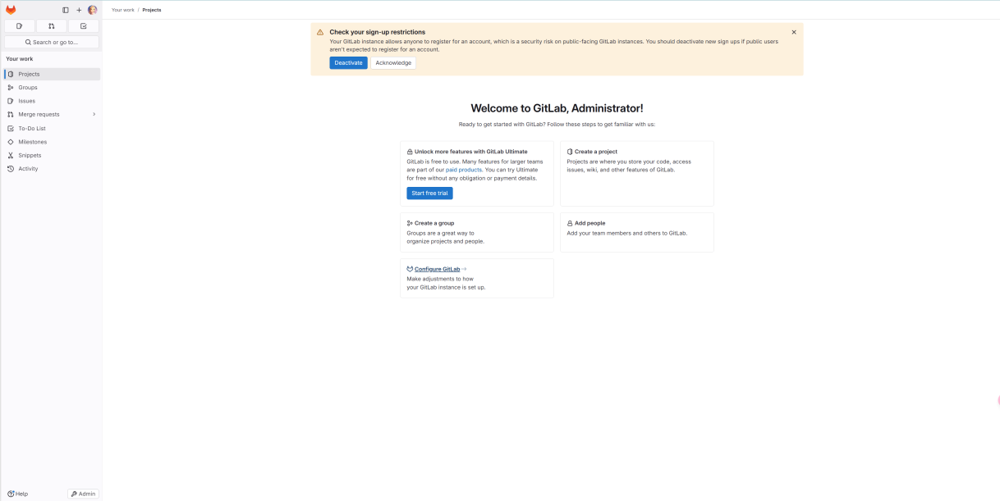
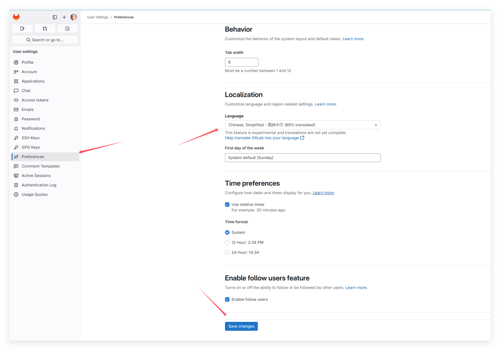

# 第 16.10 节 Gitlab-EE 17

## 安装 Gitlab-EE

```sh
# pkg install gitlab-ee
```

或使用 Ports：

该 Port 同时包含 Gitlab CE（社区版），要安装 EE（企业版），必须指定 `FLAVORS=gitlab-ee`：

```sh
# cd /usr/ports/www/gitlab/
# make FLAVORS=ee install clean
```

### 查看安装后说明

```sh
# pkg info -D  gitlab-ee
gitlab-ee-17.8.2_1:
On install:
Gitlab was installed successfully.

You now need to set up the various components of Gitlab, so please
follow the instructions in the guide at:

https://gitlab.com/mfechner/freebsd-gitlab-docu/blob/master/install/17.8-freebsd.md

On upgrade from gitlab-ee<11.9.7:
!! WARNING: Please make sure you read in UPDATING entry 20190423 !!

On upgrade:
If you just installed an major upgrade of GitLab, for example you
switched from 17.5.x to 17.6.x, please follow the instructions in the guide at:

https://gitlab.com/mfechner/freebsd-gitlab-docu/blob/master/update/17.7-17.8-freebsd.md

If you just installed an minor upgrade of GitLab please follow
the instructions in the guide at:

https://gitlab.com/mfechner/freebsd-gitlab-docu/blob/master/update/freebsd_patch_versions.md
```

开发者已经写好了安装说明，<https://gitlab.com/mfechner/freebsd-gitlab-docu/blob/master/install/17.8-freebsd.md>

如果你想赞助该开发者：<https://www.patreon.com/mfechner_gitlab_freebsd>

## 启动服务

```sh
# service gitlab enable
```

## PostgreSQL

当前 Gitlab 支持的 PostgreSQL 版本为 16 或更高版本

```sh
# pkg install postgresql16-server postgresql16-contrib
```

或

```sh
# cd /usr/ports/databases/postgresql16-server/ && make install clean
# cd /usr/ports/databases/postgresql16-contrib/ && make install clean
```

### 初始化数据库


```sh
# service postgresql enable
# service postgresql initdb
# su - postgres
$ /usr/local/bin/pg_ctl -D /var/db/postgres/data16 -l logfile start
```

### 创建数据库相关

```sql
$ psql -d template1 -U postgres -c "CREATE USER git CREATEDB SUPERUSER PASSWORD 'password';" # 将数据库密码设置为 password
CREATE ROLE
$ psql -d template1 -U postgres -c "CREATE DATABASE gitlabhq_production OWNER git;"
CREATE DATABASE
$ psql -U git -d gitlabhq_production
psql (16.8)
Type "help" for help.
gitlabhq_production-# \q
$ exit
```

### 切换回 `root`

```sh
# psql -U postgres -d gitlabhq_production -c "CREATE EXTENSION IF NOT EXISTS pg_trgm;"
# psql -U postgres -d gitlabhq_production -c "CREATE EXTENSION IF NOT EXISTS btree_gist;"
# psql -U postgres -d gitlabhq_production -c "CREATE EXTENSION IF NOT EXISTS plpgsql;"
```

## 配置 Redis

Redis 已自动作为依赖安装。

查看安装后信息：

```sh
root@ykla:/ # pkg info -D redis
redis-7.4.2:
On install:
To setup "redis" you need to edit the configuration file:
      /usr/local/etc/redis.conf

      To run redis from startup, add redis_enable="YES"
      in your /etc/rc.conf.
```

### 配置 socket

```sh
root@ykla:/ # echo 'unixsocket /var/run/redis/redis.sock' >> /usr/local/etc/redis.conf
root@ykla:/ # echo 'unixsocketperm 770' >> /usr/local/etc/redis.conf
```

### 配置服务

```sh
root@ykla:/ # service redis enable
redis enabled in /etc/rc.conf
root@ykla:/ # service redis restart
redis not running? (check /var/run/redis/redis.pid).
Starting redis.
```

### 配置用户权限

将 `git` 用户加入 `redis` 组

```sh
# pw groupmod redis -m git
```


## 配置 git（为 git 用户配置 Git 全局设置）

```sh
root@ykla:/ # su -l git -c "git config --global core.autocrlf input" # Web 编辑器需要
root@ykla:/ # su -l git -c "git config --global gc.auto 0" #  GitLab 在需要时会自动运行 git gc
root@ykla:/ # su -l git -c "git config --global repack.writeBitmaps true" # 加速仓库的对象访问和克隆操作
root@ykla:/ # su -l git -c "git config --global receive.advertisePushOptions true" # 允许服务器在 git push 时支持推送参数
root@ykla:/ # su -l git -c "git config --global core.fsync objects,derived-metadata,reference" # 减少服务器崩溃时存储库损坏的风险
root@ykla:/ # su -l git -c "mkdir -p /usr/local/git/.ssh" # 确保 .ssh 目录存在
root@ykla:/ # su -l git -c "mkdir -p /usr/local/git/repositories" # # 确保存储库目录存在，并设置正确的权限，下同
root@ykla:/ # chown git /usr/local/git/repositories
root@ykla:/ # chgrp git /usr/local/git/repositories
root@ykla:/ # chmod 2770 /usr/local/git/repositories
```
## 配置 GitLab

配置文件路径在 `/usr/local/www/gitlab`。

### 调整 GitLab 负载

```sh
root@ykla:/ # sysctl hw.ncpu
hw.ncpu: 16
```

编辑 `/usr/local/www/gitlab/config/puma.rb`，将 `workers 3` 改为上面输出的值，即改为 `workers 16`。

### 配置 GitLab 数据库

- 编辑 `/usr/local/www/gitlab/config/database.yml`：
 
将 `password: "secure password"`，修改为 `password: "password"`（`password` 是上面设置的数据库密码）


- GitLab 需要写入权限来创建符号链接：

```sh
# chown git /usr/local/share/gitlab-shell  
```

```sh
root@ykla:/ #cd /usr/local/www/gitlab # 注意路径
root@ykla:/usr/local/www/gitlab # su -l git -c "cd /usr/local/www/gitlab && rake gitlab:setup RAILS_ENV=production" #  初始化 GitLab 数据库和相关配置
Missing Rails.application.credentials.secret_key_base for production environment. The secret will be generated and stored in config/secrets.yml.
Missing Rails.application.credentials.otp_key_base for production environment. The secret will be generated and stored in config/secrets.yml.
Missing Rails.application.credentials.db_key_base for production environment. The secret will be generated and stored in config/secrets.yml.
Missing Rails.application.credentials.openid_connect_signing_key for production environment. The secret will be generated and stored in config/secrets.yml.
Missing Rails.application.credentials.active_record_encryption_primary_key for production environment. The secret will be generated and stored in config/secrets.yml.
Missing Rails.application.credentials.active_record_encryption_deterministic_key for production environment. The secret will be generated and stored in config/secrets.yml.
Missing Rails.application.credentials.active_record_encryption_key_derivation_salt for production environment. The secret will be generated and stored in config/secrets.yml.
Creating a backup of secrets file: /usr/local/www/gitlab/config/secrets.yml: /usr/local/www/gitlab/config/secrets.yml.orig.1740894999
This will create the necessary database tables and seed the database.
You will lose any previous data stored in the database.
Do you want to continue (yes/no)? yes # 此处输入 yes 按回车键

Dropped database 'gitlabhq_production'
Created database 'gitlabhq_production'

== Seed from /usr/local/www/gitlab/db/fixtures/production/001_application_settings.rb
Creating the default ApplicationSetting record.
== /usr/local/www/gitlab/db/fixtures/production/001_application_settings.rb took 0.56 seconds

== Seed from /usr/local/www/gitlab/db/fixtures/production/002_default_organization.rb

OK
== /usr/local/www/gitlab/db/fixtures/production/002_default_organization.rb took 0.04 seconds

== Seed from /usr/local/www/gitlab/db/fixtures/production/003_admin.rb
Administrator account created:

login:    root # 注意用户名
password: You'll be prompted to create one on your first visit.

== /usr/local/www/gitlab/db/fixtures/production/003_admin.rb took 1.06 seconds

== Seed from /usr/local/www/gitlab/db/fixtures/production/004_create_base_work_item_types.rb

OK
== /usr/local/www/gitlab/db/fixtures/production/004_create_base_work_item_types.rb took 0.05 seconds

== Seed from /usr/local/www/gitlab/db/fixtures/production/005_add_security_training_providers.rb

OK
== /usr/local/www/gitlab/db/fixtures/production/005_add_security_training_providers.rb took 0.02 seconds

== Seed from /usr/local/www/gitlab/db/fixtures/production/010_settings.rb
Saved CI JWT signing key
Saved CI Job Token signing key
== /usr/local/www/gitlab/db/fixtures/production/010_settings.rb took 0.37 seconds

== Seed from /usr/local/www/gitlab/db/fixtures/production/020_create_work_item_hierarchy_restrictions.rb

OK
== /usr/local/www/gitlab/db/fixtures/production/020_create_work_item_hierarchy_restrictions.rb took 0.03 seconds

== Seed from /usr/local/www/gitlab/db/fixtures/production/040_create_work_item_related_link_restrictions.rb

OK
== /usr/local/www/gitlab/db/fixtures/production/040_create_work_item_related_link_restrictions.rb took 0.02 seconds

== Seed from ee/db/fixtures/production/010_license.rb
== ee/db/fixtures/production/010_license.rb took 0.00 seconds

== Seed from ee/db/fixtures/production/027_plans.rb

OK
== ee/db/fixtures/production/027_plans.rb took 0.02 seconds

== Seed from ee/db/fixtures/production/041_create_ai_settings.rb

OK
== ee/db/fixtures/production/041_create_ai_settings.rb took 0.02 seconds
== Seeding took 2.20 seconds
```

撤销刚才授予的权限：

```sh
# chown root /usr/local/share/gitlab-shell
```

- 检查 GitLab 及其环境是否配置正确

```sh
root@ykla:/usr/local/www/gitlab # su -l git -c "cd /usr/local/www/gitlab && rake gitlab:setup RAILS_ENV=production"
Missing Rails.application.credentials.secret_key_base for production environment. The secret will be generated and stored in config/secrets.yml.
Missing Rails.application.credentials.otp_key_base for production environment. The secret will be generated and stored in config/secrets.yml.
Missing Rails.application.credentials.db_key_base for production environment. The secret will be generated and stored in config/secrets.yml.
Missing Rails.application.credentials.openid_connect_signing_key for production environment. The secret will be generated and stored in config/secrets.yml.
Missing Rails.application.credentials.active_record_encryption_primary_key for production environment. The secret will be generated and stored in config/secrets.yml.
Missing Rails.application.credentials.active_record_encryption_deterministic_key for production environment. The secret will be generated and stored in config/secrets.yml.
Missing Rails.application.credentials.active_record_encryption_key_derivation_salt for production environment. The secret will be generated and stored in config/secrets.yml.
Creating a backup of secrets file: /usr/local/www/gitlab/config/secrets.yml: /usr/local/www/gitlab/config/secrets.yml.orig.1740894999
This will create the necessary database tables and seed the database.
You will lose any previous data stored in the database.
Do you want to continue (yes/no)? yes

Dropped database 'gitlabhq_production'
Created database 'gitlabhq_production'

== Seed from /usr/local/www/gitlab/db/fixtures/production/001_application_settings.rb
Creating the default ApplicationSetting record.
== /usr/local/www/gitlab/db/fixtures/production/001_application_settings.rb took 0.56 seconds

== Seed from /usr/local/www/gitlab/db/fixtures/production/002_default_organization.rb

OK
== /usr/local/www/gitlab/db/fixtures/production/002_default_organization.rb took 0.04 seconds

== Seed from /usr/local/www/gitlab/db/fixtures/production/003_admin.rb
Administrator account created:

login:    root
password: You'll be prompted to create one on your first visit.

== /usr/local/www/gitlab/db/fixtures/production/003_admin.rb took 1.06 seconds

== Seed from /usr/local/www/gitlab/db/fixtures/production/004_create_base_work_item_types.rb

OK
== /usr/local/www/gitlab/db/fixtures/production/004_create_base_work_item_types.rb took 0.05 seconds

== Seed from /usr/local/www/gitlab/db/fixtures/production/005_add_security_training_providers.rb

OK
== /usr/local/www/gitlab/db/fixtures/production/005_add_security_training_providers.rb took 0.02 seconds

== Seed from /usr/local/www/gitlab/db/fixtures/production/010_settings.rb
Saved CI JWT signing key
Saved CI Job Token signing key
== /usr/local/www/gitlab/db/fixtures/production/010_settings.rb took 0.37 seconds

== Seed from /usr/local/www/gitlab/db/fixtures/production/020_create_work_item_hierarchy_restrictions.rb

OK
== /usr/local/www/gitlab/db/fixtures/production/020_create_work_item_hierarchy_restrictions.rb took 0.03 seconds

== Seed from /usr/local/www/gitlab/db/fixtures/production/040_create_work_item_related_link_restrictions.rb

OK
== /usr/local/www/gitlab/db/fixtures/production/040_create_work_item_related_link_restrictions.rb took 0.02 seconds

== Seed from ee/db/fixtures/production/010_license.rb
== ee/db/fixtures/production/010_license.rb took 0.00 seconds

== Seed from ee/db/fixtures/production/027_plans.rb

OK
== ee/db/fixtures/production/027_plans.rb took 0.02 seconds

== Seed from ee/db/fixtures/production/041_create_ai_settings.rb

OK
== ee/db/fixtures/production/041_create_ai_settings.rb took 0.02 seconds
== Seeding took 2.20 seconds
root@ykla:/usr/local/www/gitlab # chown root /usr/local/share/gitlab-shell
root@ykla:/usr/local/www/gitlab # su -l git -c "cd /usr/local/www/gitlab && rake gitlab:env:info RAILS_ENV=production"

System information
System:
Proxy:		no
Current User:	git
Using RVM:	no
Ruby Version:	3.2.7
Gem Version:	3.6.4
Bundler Version:2.6.4
Rake Version:	13.2.1
Redis Version:	7.4.2
Sidekiq Version:7.2.4
Go Version:	unknown

GitLab information
Version:	17.8.2-ee
Revision:	Unknown
Directory:	/usr/local/www/gitlab
DB Adapter:	PostgreSQL
DB Version:	16.8
URL:		http://localhost
HTTP Clone URL:	http://localhost/some-group/some-project.git
SSH Clone URL:	git@localhost:some-group/some-project.git
Elasticsearch:	no
Geo:		no
Using LDAP:	no
Using Omniauth:	yes
Omniauth Providers:

GitLab Shell
Version:	14.39.0
Repository storages:
- default: 	unix:/usr/local/www/gitlab/tmp/sockets/private/gitaly.socket
GitLab Shell path:		/usr/local/share/gitlab-shell

Gitaly
rake aborted!
GRPC::Unavailable: 14:connections to all backends failing; last error: FAILED_PRECONDITION: unix:/usr/local/www/gitlab/tmp/sockets/private/gitaly.socket: connect failed: addr: unix:/usr/local/www/gitlab/tmp/sockets/private/gitaly.socket error: No such file or directory. debug_error_string:{UNKNOWN:Error received from peer  {grpc_message:"connections to all backends failing; last error: FAILED_PRECONDITION: unix:/usr/local/www/gitlab/tmp/sockets/private/gitaly.socket: connect failed: addr: unix:/usr/local/www/gitlab/tmp/sockets/private/gitaly.socket error: No such file or directory", grpc_status:14, created_time:"2025-03-02T14:01:11.480621308+08:00"}} (GRPC::Unavailable)
/usr/local/www/gitlab/lib/gitlab/gitaly_client.rb:291:in `execute'
/usr/local/www/gitlab/lib/gitlab/gitaly_client/call.rb:18:in `block in call'
/usr/local/www/gitlab/lib/gitlab/gitaly_client/call.rb:60:in `recording_request'
/usr/local/www/gitlab/lib/gitlab/gitaly_client/call.rb:17:in `call'
/usr/local/www/gitlab/lib/gitlab/gitaly_client.rb:280:in `call'
/usr/local/www/gitlab/lib/gitlab/gitaly_client/server_service.rb:14:in `info'
/usr/local/www/gitlab/lib/tasks/gitlab/info.rake:99:in `block (4 levels) in <top (required)>'
/usr/local/www/gitlab/lib/tasks/gitlab/info.rake:97:in `block (3 levels) in <top (required)>'
Tasks: TOP => gitlab:env:info
(See full trace by running task with --trace)
```

- 如果使用 corepack（Node.js）

```sh
root@ykla:/ # chown git /usr/local/www/gitlab/package.json
```

```sh
root@ykla:/ # ls /usr/local/bin/python3.11
/usr/local/bin/python3.11
root@ykla:/ # su -l git -c "cd /usr/local/www/gitlab && yarn config set python /usr/local/bin/python3.11"
yarn config v1.22.19
success Set "python" to "/usr/local/bin/python3.11".
Done in 0.03s.
```

```sh
root@ykla:/ # su -l git -c "cd /usr/local/www/gitlab && yarn install --production --pure-lockfile"
yarn install v1.22.19
$ node ./scripts/frontend/preinstall.mjs
[WARNING] package.json changed significantly. Removing node_modules to be sure there are no problems.
[1/5] Validating package.json...
[2/5] Resolving packages...
[3/5] Fetching packages...
[4/5] Linking dependencies...
warning " > @gitlab/duo-ui@6.0.0" has incorrect peer dependency "@gitlab/ui@^105.0.0".
warning " > @gitlab/duo-ui@6.0.0" has unmet peer dependency "bootstrap@>=4.5.3 <=4.6.2".
warning " > @gitlab/vue-router-vue3@4.1.6" has incorrect peer dependency "vue@^3.2.0".
warning " > @gitlab/vuex-vue3@4.0.0" has incorrect peer dependency "vue@^3.0.2".
warning " > @vue/apollo-components@4.0.0-beta.4" has incorrect peer dependency "vue@^3.1.0".
warning " > @vue/apollo-option@4.0.0-beta.4" has incorrect peer dependency "vue@^3.1.0".
warning "graphiql > @graphiql/react > codemirror-graphql@2.1.1" has unmet peer dependency "@codemirror/language@6.0.0".
warning " > @gitlab/eslint-plugin@20.6.0" has incorrect peer dependency "eslint@^8.57.0".
warning "@gitlab/eslint-plugin > @typescript-eslint/eslint-plugin@7.16.0" has unmet peer dependency "@typescript-eslint/parser@^7.0.0".
warning "@gitlab/eslint-plugin > @typescript-eslint/eslint-plugin@7.16.0" has incorrect peer dependency "eslint@^8.56.0".
warning "@gitlab/eslint-plugin > eslint-config-airbnb-base@15.0.0" has incorrect peer dependency "eslint@^7.32.0 || ^8.2.0".
warning "@gitlab/eslint-plugin > @typescript-eslint/eslint-plugin > @typescript-eslint/type-utils@7.16.0" hasincorrect peer dependency "eslint@^8.56.0".
warning "@gitlab/eslint-plugin > @typescript-eslint/eslint-plugin > @typescript-eslint/utils@7.16.0" has incorrect peer dependency "eslint@^8.56.0".
warning "@gitlab/eslint-plugin > @typescript-eslint/eslint-plugin > ts-api-utils@1.3.0" has unmet peer dependency "typescript@>=4.2.0".
warning " > @vue/compat@3.5.13" has incorrect peer dependency "vue@3.5.13".
warning " > @vue/test-utils-vue3@2.3.1" has unmet peer dependency "@vue/compiler-dom@^3.0.1".
warning " > @vue/test-utils-vue3@2.3.1" has unmet peer dependency "@vue/server-renderer@^3.0.1".
warning " > @vue/test-utils-vue3@2.3.1" has incorrect peer dependency "vue@^3.0.1".
warning "@vue/test-utils-vue3 > @vue/server-renderer@3.2.47" has incorrect peer dependency "vue@3.2.47".
warning " > @vue/vue2-jest@28.1.0" has incorrect peer dependency "babel-jest@>= 28 < 29".
warning " > @vue/vue2-jest@28.1.0" has incorrect peer dependency "jest@28.x".
warning " > @vue/vue3-jest@29.2.3" has incorrect peer dependency "vue@^3.0.0-0".
warning "swagger-cli > @apidevtools/swagger-cli > @apidevtools/swagger-parser@10.1.0" has unmet peer dependency "openapi-types@>=7".
warning Workspaces can only be enabled in private projects.
[5/5] Building fresh packages...
[7/8] ⠄ tree-sitter-json
[2/8] ⠄ @gitlab/web-ide
[7/8] ⡀ tree-sitter-json
[-/8] ⡀ waiting...
[3/8] ⡀ canvas[6/8] ⡀ tree-sitter
[7/8] ⠠ tree-sitter-json[-/8] ⠠ waiting...
[3/8] ⠠ canvas
[6/8] ⠠ tree-sitter
warning Error running install script for optional dependency: "/usr/local/www/gitlab/node_modules/canvas: Command failed.
Exit code: 1
Command: node-pre-gyp install --fallback-to-build --update-binary
Arguments:
Directory: /usr/local/www/gitlab/node_modules/canvas
Output:
node-pre-gyp info it worked if it ends with ok
node-pre-gyp info using node-pre-gyp@1.0.11
node-pre-gyp info using node@22.14.0 | freebsd | x64
node-pre-gyp http GET https://github.com/Automattic/node-canvas/releases/download/v2.11.2/canvas-v2.11.2-node-v127-freebsd-unknown-x64.tar.gz
node-pre-gyp ERR! install response status 404 Not Found on https://github.com/Automattic/node-canvas/releases/download/v2.11.2/canvas-v2.11.2-node-v127-freebsd-unknown-x64.tar.gz
node-pre-gyp WARN Pre-built binaries not installable for canvas@2.11.2 and node@22.14.0 (node-v127 ABI, unknown) (falling back to source compile with node-gyp)
node-pre-gyp WARN Hit error response status 404 Not Found on https://github.com/Automattic/node-canvas/releases/download/v2.11.2/canvas-v2.11.2-node-v127-freebsd-unknown-x64.tar.gz
node-pre-gyp ERR! build error
node-pre-gyp ERR! stack Error: Failed to execute 'node-gyp clean' (Error: spawn node-gyp ENOENT)
node-pre-gyp ERR! stack     at ChildProcess.<anonymous> (/usr/local/www/gitlab/node_modules/@mapbox/node-pre-gyp/lib/util/compile.js:83:23)
node-pre-gyp ERR! stack     at ChildProcess.emit (node:events:518:28)
node-pre-gyp ERR! stack     at ChildProcess._handle.onexit (node:internal/child_process:291:12)
node-pre-gyp ERR! stack     at onErrorNT (node:internal/child_process:483:16)
node-pre-gyp ERR! stack     at process.processTicksAndRejections (node:internal/process/task_queues:90:21)
node-pre-gyp ERR! System FreeBSD 14.2-RELEASE
node-pre-gyp ERR! command \"/usr/local/bin/node\" \"/usr/local/www/gitlab/node_modules/canvas/node_modules/.bin/node-pre-gyp\" \"install\" \"--fallback-to-build\" \"--update-binary\"
node-pre-gyp ERR! cwd /usr/local/www/gitlab/node_modules/canvas
node-pre-gyp ERR! node -v v22.14.0
[7/8] ⠐ tree-sitter-json
[-/8] ⠐ waiting...
[3/8] ⠐ canvas
[6/8] ⠐ tree-sitter
warning Error running install script for optional dependency: "/usr/local/www/gitlab/node_modules/tree-sitter: Command failed.
Exit code: 127
Command: prebuild-install || node-gyp rebuild
Arguments:
Directory: /usr/local/www/gitlab/node_modules/tree-sitter
Output:
[7/8] ⠈ tree-sitter-json[7/8] ⠠ tree-sitter-json
[7/8] ⠠ tree-sitter-json
[-/8] ⠠ waiting...
[-/8] ⠠ waiting...
warning Your current version of Yarn is out of date. The latest version is "1.22.22", while you're on "1.22.19".
Done in 109.27s.
```


```sh
# su -l git -c "cd /usr/local/www/gitlab && RAILS_ENV=production NODE_ENV=production USE_DB=false SKIP_STORAGE_VALIDATION=true bundle exec rake gitlab:assets:compile"

……此处省略大概需要几十分钟，若提示内存溢出，自行增加 swap，一般来说需要执行两次，若内存溢出需要再重复执行一次……

The file does not introduce any side effects, we are all good.
`gitlab:assets:check_page_bundle_mixins_css_for_sideeffects` finished in 0.371513498 seconds
```

- 移除数据库超级管理员

```sh
root@ykla:/ # psql -d template1 -U postgres -c "ALTER USER git WITH NOSUPERUSER;"
ALTER ROLE
```

- 启动 Gitlab

```sh
# service gitlab start

……省略……

Started in 45s.
The GitLab web server with pid 8202 is running.
The GitLab Sidekiq job dispatcher with pid 8212 is running.
The GitLab Workhorse with pid 8216 is running.
Gitaly with pid 8218 is running.
GitLab and all its components are up and running.
```

## Nginx

### 安装：

```sh
# pkg install nginx
```

或者：

```
# cd /usr/ports/www/nginx/ 
# make install clean
```

### 配置 `/usr/local/etc/nginx/nginx.conf`

编辑 `/usr/local/etc/nginx/nginx.conf`，找到

```ini
http {
    include       mime.types;
    default_type  application/octet-stream;

```

修改如下：

```ini
http {
    include       mime.types;
    default_type  application/octet-stream;
    include       /usr/local/www/gitlab/lib/support/nginx/gitlab; # 加入此行
```

## 配置服务

```sh
root@ykla:/ # service nginx enable
nginx enabled in /etc/rc.conf
root@ykla:/ #  service nginx start
Performing sanity check on nginx configuration:
nginx: the configuration file /usr/local/etc/nginx/nginx.conf syntax is ok
nginx: configuration file /usr/local/etc/nginx/nginx.conf test is successful
Starting nginx.
```

## 配置 Gitlab Pages

```sh
root@ykla:/ # su -l git -c "openssl rand -base64 32 > /usr/local/www/gitlab/.gitlab_pages_secret"
root@ykla:/ # chmod 640 /usr/local/www/gitlab/.gitlab_pages_secret
root@ykla:/ # chgrp gitlab-pages /usr/local/www/gitlab/.gitlab_pages_secret
```

### 启动服务

```sh
# sysrc gitlab_pages_enable="YES"
# service gitlab_pages start
```

## 检查配置

```sh
root@ykla:/ # su -l git -c "cd /usr/local/www/gitlab && rake gitlab:check RAILS_ENV=production"
Checking GitLab subtasks ...

Checking GitLab Shell ...

GitLab Shell: ... GitLab Shell version >= 14.39.0 ? ... OK (14.39.0)
Running /usr/local/share/gitlab-shell/bin/gitlab-shell-check
Internal API available: OK
Redis available via internal API: OK
gitlab-shell self-check successful

Checking GitLab Shell ... Finished

Checking Gitaly ...

Gitaly: ... default ... OK

Checking Gitaly ... Finished

Checking Sidekiq ...

Sidekiq: ... Running? ... yes
Number of Sidekiq processes (cluster/worker) ... 1/1

Checking Sidekiq ... Finished

Checking Incoming Email ...

Incoming Email: ... Reply by email is disabled in config/gitlab.yml

Checking Incoming Email ... Finished

Checking LDAP ...

LDAP: ... LDAP is disabled in config/gitlab.yml

Checking LDAP ... Finished

Checking GitLab App ...

Database config exists? ... yes
Tables are truncated? ... skipped
All migrations up? ... yes
Database contains orphaned GroupMembers? ... no
GitLab config exists? ... yes
GitLab config up to date? ... yes
Cable config exists? ... yes
Resque config exists? ... yes
Log directory writable? ... yes
Tmp directory writable? ... yes
Uploads directory exists? ... yes
Uploads directory has correct permissions? ... yes
Uploads directory tmp has correct permissions? ... skipped (no tmp uploads folder yet)
Systemd unit files or init script exist? ... no
  Try fixing it:
  Install the Service
  For more information see:
  doc/install/installation.md in section "Install the Service"
  Please fix the error above and rerun the checks.
Systemd unit files or init script up-to-date? ... can't check because of previous errors
Projects have namespace: ... can't check, you have no projects
Redis version >= 6.2.14? ... yes
Ruby version >= 3.0.6 ? ... yes (3.2.7)
Git user has default SSH configuration? ... yes
Active users: ... 1
Is authorized keys file accessible? ... no
Trying to fix error automatically. ...Success
GitLab configured to store new projects in hashed storage? ... yes
All projects are in hashed storage? ... yes
Elasticsearch version 7.x-8.x or OpenSearch version 1.x ... skipped (Advanced Search is disabled)
All migrations must be finished before doing a major upgrade ... skipped (Advanced Search is disabled)

Checking GitLab App ... Finished


Checking GitLab subtasks ... Finished
```


## 启动 Gitlab

```sh
# service gitlab restart
```

打开浏览器输入 IP 回车，此处我的是 `192.168.197.128`。请输入你的电子邮箱、并设置密码（最小 8 位，要求复杂密码）。




登录：




## 设置中文

点击头像，再点击“Preference”，找到“Localization”，选择简体中文，然后点击“Save changes”：





## 激活

安装 `gitlab-license`（gem 是 ruby 包管理器，上面已经作为依赖自动安装了）：

```sh
root@ykla:~ # gem install gitlab-license
Fetching gitlab-license-2.6.0.gem
Successfully installed gitlab-license-2.6.0
Parsing documentation for gitlab-license-2.6.0
Installing ri documentation for gitlab-license-2.6.0
Done installing documentation for gitlab-license after 0 seconds
1 gem installed

A new release of RubyGems is available: 3.6.4 → 3.6.5!
Run `gem update --system 3.6.5` to update your installation.
```

```sh
root@ykla:~ # mkdir gitlab-license
root@ykla:~ # cd gitlab-license/
root@ykla:~/gitlab-license # ee license.rb
```

将以下文件写入 `license.rb`

```ruby
require "openssl"
require "gitlab/license"
key_pair = OpenSSL::PKey::RSA.generate(2048)
File.open("license_key", "w") { |f| f.write(key_pair.to_pem) }
public_key = key_pair.public_key
File.open("license_key.pub", "w") { |f| f.write(public_key.to_pem) }
private_key = OpenSSL::PKey::RSA.new File.read("license_key")
Gitlab::License.encryption_key = private_key
license = Gitlab::License.new
license.licensee = {
"Name" => "ykla", # 你的用户名
"Company" => "CFC", # 你的机构
"Email" => "yklaxds@gmail.com", # 你的电子邮箱
}
license.starts_at = Date.new(2025, 1, 1) # 开始时间
license.expires_at = Date.new(2050, 1, 1) # 结束时间
license.notify_admins_at = Date.new(2049, 12, 1)
license.notify_users_at = Date.new(2049, 12, 1)
license.block_changes_at = Date.new(2050, 1, 1)
license.restrictions = {
active_user_count: 10000,
}
puts "License:"
puts license
data = license.export
puts "Exported license:"
puts data
File.open("GitLabBV.gitlab-license", "w") { |f| f.write(data) }
public_key = OpenSSL::PKey::RSA.new File.read("license_key.pub")
Gitlab::License.encryption_key = public_key
data = File.read("GitLabBV.gitlab-license")
$license = Gitlab::License.import(data)
puts "Imported license:"
puts $license
unless $license
raise "The license is invalid."
end
if $license.restricted?(:active_user_count)
active_user_count = 10000
if active_user_count > $license.restrictions[:active_user_count]
    raise "The active user count exceeds the allowed amount!"
end
end
if $license.notify_admins?
puts "The license is due to expire on #{$license.expires_at}."
end
if $license.notify_users?
puts "The license is due to expire on #{$license.expires_at}."
end
module Gitlab
class GitAccess
    def check(cmd, changes = nil)
    if $license.block_changes?
        return build_status_object(false, "License expired")
    end
    end
end
end
puts "This instance of GitLab Enterprise Edition is licensed to:"
$license.licensee.each do |key, value|
puts "#{key}: #{value}"
end
if $license.expired?
puts "The license expired on #{$license.expires_at}"
elsif $license.will_expire?
puts "The license will expire on #{$license.expires_at}"
else
puts "The license will never expire."
end
```

生成相关文件：

```ruby
root@ykla:~/gitlab-license # ruby license.rb 
License:
#<Gitlab::License:0x00001333815f0f88>
Exported license:
eyJkYXRhIjoiZlhQdzNWWldFOTIrcHFrNUx1MlZqQXBaZkpQVi9yaHJxN0cy
T2pVK3dYZGk4dllHM1JTblR3S2N2YTYyXG5LTTJFVmlpMU1iZTZaaHFmOTJu
ZGRucTlpbHdRZ05OODZINkV2NCttbWx1bW95UnYyYVhtSjhPSkZjRzVcbjll
SXU1dWdJcU1jUkliQ1pNSUJ6U2cvWlJvV1dDbm9pc0E5RGxrMkk2MS9zS0Vx
dHBQc05WTDZ4V3N4MFxuL0Z6WVRTZFZkYUJjYURXRGhodHJkVm53SWZWcFBN
OS9kcU1Cb2V2OHZ1MHA0VmRXKzNMMkJWMkxTK0NaXG41eTlaVDRlV0dUWGNE
SFJXNC8vZWhpUC9hQnhqWitBdHVkc2lkNE40aVdqcVpwYnNXSmE5WmpEUVpk
OFFcbit2TitZU0N2ZUFoMDFTZHBFVUQyL01ITm5lWWlOM1A2aDlSRjdOWS80
NjFEQXM0ZitxOEFEY3pVR2dNZlxud0pCTUViNnZldGtRK3VmRXJLQU1Ldlp3
MmRMWWMzcWhhbll2Z1dzaDAzSlAvYUxrWkxTN0VOTmpoUnZuXG5CUFJzdENa
K1UreU95K0dyRGszeXI0RVFBK2hraDI3ZWNaVmRyb0FaVisxWGJSTXlsYW1y
ZnVZTXNQdzZcblBzY2NMRk5vaDRKTkFvSEtFZHI1UG5uQWs2djR3QU5XQVYv
TDJkdjE5V1pnOVpGd0NaNjlYaTJ1M1R3dlxuNTUxUjFHZXUrV3pWaFB5V28z
YXNDeHRBNnhRakhONjRTRmZZejhLdjRFUzdMMkgyU1FiSDN4eTV1dTVYXG5F
c0tXMGRQZTRCcUxWTzZGT1ROWVJINzViSEVqWk90NHNvaWp1VHpLWW1YdU5s
MjkyZlRndzgvVnZwQU9cbjFoZnQ0Ymh5WmlUZ2t3RVFNMnFBQUdOaUJ5THU5
ZUVoTUhzdWQ1NUNrUWp6bHZLc1lXV1FIWENVdDBjQ1xuRlBuSHd4Nm9HNWxU
dzlTVUFzS015YVloaWk0WGhGR3VYSXErSy9OMStCaXlQL3pnVVNsbEhrS2da
cisyXG5ZQVBvZm5mVVZ3PT1cbiIsImtleSI6IkF5Sy9WQnROYTcxV3lyWFV0
dkRwZVFyaVh3Y3JtYXB3T0tIejNwMkpoK3REYjZnNm0veHgzbStSVWFpL1xu
ZWliUnJhNkZLc0dCSitvczBpelltcUJDVjRRZEFBbHhBTFczeW5rSTh2M00r
TFRwQzViNTNzN2ZoOXdkXG4weXFYUDk3djNpTS9KcXNGWGpzQTZ1cWtFRFRs
eWxQSnpVbS9sRWtZNG1ZT1VzS09YSVU2cithbWFnRDRcblRZR1MvTVI5L3Mz
eXlQblY0My96SlZmazZWdWtiY1NIRXFGbnhCYnoxMitBWE9NQ2U4WTM0RGV5
eGxXL1xuQkxDN2R0cHcvRGlLSXFQM3BpWnNJOEQ4dVdVUGVmNFpvaS9xZTJm
Q2hNd0ViZFJCNFlpK3R2M1dYMS9LXG4xendIMEVNWFJhT3dPN1BUaDd2Mngx
NVhvSTNxZTN3STFjNTFyOUFJeGc9PVxuIiwiaXYiOiIzcDByN01MelpSck10
K2YwbWhobEpRPT1cbiJ9
Imported license:
#<Gitlab::License:0x0000133381f3ece8>
This instance of GitLab Enterprise Edition is licensed to:
Name: ykla
Company: CFC
Email: yklaxds@gmail.com
The license will expire on 2050-01-01
```

备份旧的公钥：

```sh
# cp /usr/local/www/gitlab/.license_encryption_key.pub /usr/local/www/gitlab/.license_encryption_key.pub.back
```

查看目录下文件。新生成了三个东西：

```sh
root@ykla:~/gitlab-license # ls
GitLabBV.gitlab-license	license_key
license.rb		license_key.pub
```

用破解的公钥替代原有公钥：

```sh
root@ykla:~/gitlab-license # cp license_key.pub /usr/local/www/gitlab/.license_encryption_key.pub
```

```sh
root@ykla:~/gitlab-license # cat GitLabBV.gitlab-license
eyJkYXRhIjoiZlhQdzNWWldFOTIrcHFrNUx1MlZqQXBaZkpQVi9yaHJxN0cy
T2pVK3dYZGk4dllHM1JTblR3S2N2YTYyXG5LTTJFVmlpMU1iZTZaaHFmOTJu
ZGRucTlpbHdRZ05OODZINkV2NCttbWx1bW95UnYyYVhtSjhPSkZjRzVcbjll
SXU1dWdJcU1jUkliQ1pNSUJ6U2cvWlJvV1dDbm9pc0E5RGxrMkk2MS9zS0Vx
dHBQc05WTDZ4V3N4MFxuL0Z6WVRTZFZkYUJjYURXRGhodHJkVm53SWZWcFBN
OS9kcU1Cb2V2OHZ1MHA0VmRXKzNMMkJWMkxTK0NaXG41eTlaVDRlV0dUWGNE
SFJXNC8vZWhpUC9hQnhqWitBdHVkc2lkNE40aVdqcVpwYnNXSmE5WmpEUVpk
OFFcbit2TitZU0N2ZUFoMDFTZHBFVUQyL01ITm5lWWlOM1A2aDlSRjdOWS80
NjFEQXM0ZitxOEFEY3pVR2dNZlxud0pCTUViNnZldGtRK3VmRXJLQU1Ldlp3
MmRMWWMzcWhhbll2Z1dzaDAzSlAvYUxrWkxTN0VOTmpoUnZuXG5CUFJzdENa
K1UreU95K0dyRGszeXI0RVFBK2hraDI3ZWNaVmRyb0FaVisxWGJSTXlsYW1y
ZnVZTXNQdzZcblBzY2NMRk5vaDRKTkFvSEtFZHI1UG5uQWs2djR3QU5XQVYv
TDJkdjE5V1pnOVpGd0NaNjlYaTJ1M1R3dlxuNTUxUjFHZXUrV3pWaFB5V28z
YXNDeHRBNnhRakhONjRTRmZZejhLdjRFUzdMMkgyU1FiSDN4eTV1dTVYXG5F
c0tXMGRQZTRCcUxWTzZGT1ROWVJINzViSEVqWk90NHNvaWp1VHpLWW1YdU5s
MjkyZlRndzgvVnZwQU9cbjFoZnQ0Ymh5WmlUZ2t3RVFNMnFBQUdOaUJ5THU5
ZUVoTUhzdWQ1NUNrUWp6bHZLc1lXV1FIWENVdDBjQ1xuRlBuSHd4Nm9HNWxU
dzlTVUFzS015YVloaWk0WGhGR3VYSXErSy9OMStCaXlQL3pnVVNsbEhrS2da
cisyXG5ZQVBvZm5mVVZ3PT1cbiIsImtleSI6IkF5Sy9WQnROYTcxV3lyWFV0
dkRwZVFyaVh3Y3JtYXB3T0tIejNwMkpoK3REYjZnNm0veHgzbStSVWFpL1xu
ZWliUnJhNkZLc0dCSitvczBpelltcUJDVjRRZEFBbHhBTFczeW5rSTh2M00r
TFRwQzViNTNzN2ZoOXdkXG4weXFYUDk3djNpTS9KcXNGWGpzQTZ1cWtFRFRs
eWxQSnpVbS9sRWtZNG1ZT1VzS09YSVU2cithbWFnRDRcblRZR1MvTVI5L3Mz
eXlQblY0My96SlZmazZWdWtiY1NIRXFGbnhCYnoxMitBWE9NQ2U4WTM0RGV5
eGxXL1xuQkxDN2R0cHcvRGlLSXFQM3BpWnNJOEQ4dVdVUGVmNFpvaS9xZTJm
Q2hNd0ViZFJCNFlpK3R2M1dYMS9LXG4xendIMEVNWFJhT3dPN1BUaDd2Mngx
NVhvSTNxZTN3STFjNTFyOUFJeGc9PVxuIiwiaXYiOiIzcDByN01MelpSck10
K2YwbWhobEpRPT1cbiJ9
```

打开 <http://192.168.197.128/admin/application_settings/general>（这是我的，注意改成你的 IP 地址），点击“添加许可证”，点击“请输入许可证密钥”，把上面 `GitLabBV.gitlab-license` 输出的内容复制到许可证秘钥框里：


### 参考文献

[GitLab EE 16 安装破解教程](https://blog.mengguyi.com/articles/GitLab-Install.html)


## 导入外部项目

打开 <http://192.168.197.128/admin>，点击“通用”，选择右侧“导入和导出设置”，选择所需的项目，保存。


### 参考文献

- [CI/CD 笔记 .Gitlab 系列：2024 更新后-设置 GitLab 导入源](https://bbs.huaweicloud.com/blogs/423539)


## 故障排除


### 日志

- `/var/log/nginx/gitlab_error.log`
- `/var/log/nginx/error.log`
- `/var/log/gitlab_pages.log`
- `/var/log/gitlab-shell/gitlab-shell.log`

### `500: We're sorry, something went wrong on our end`


```
root@ykla:/ # service gitlab status
The GitLab web server with pid 8202 is running.
The GitLab Sidekiq job dispatcher with pid 8212 is running.
The GitLab Workhorse with pid 8216 is running.
Gitaly with pid 8218 is running.
GitLab and all its components are up and running.
```


如果运行状态和错误日志均正常，那么可能是内存溢出了（8G 也不够）：


```
# dmesg

……省略……


swap_pager: out of swap space
swp_pager_getswapspace(11): failed
swap_pager: out of swap space
swp_pager_getswapspace(27): failed
swp_pager_getswapspace(11): failed
swp_pager_getswapspace(4): failed
swp_pager_getswapspace(1): failed
swp_pager_getswapspace(9): failed
swp_pager_getswapspace(1): failed
swp_pager_getswapspace(20): failed
swp_pager_getswapspace(4): failed
pid 7965 (node), jid 0, uid 211, was killed: failed to reclaim memory
pid 7822 (ruby32), jid 0, uid 211, was killed: failed to reclaim memory
```

如果还是报错 500，建议重来一次。

#### 参考文献

- [CentOS 7 上 GitLab 的安装、备份、迁移及恢复](https://www.ifeegoo.com/the-installation-backup-migration-restore-of-gitlab-on-centos-7.html)


