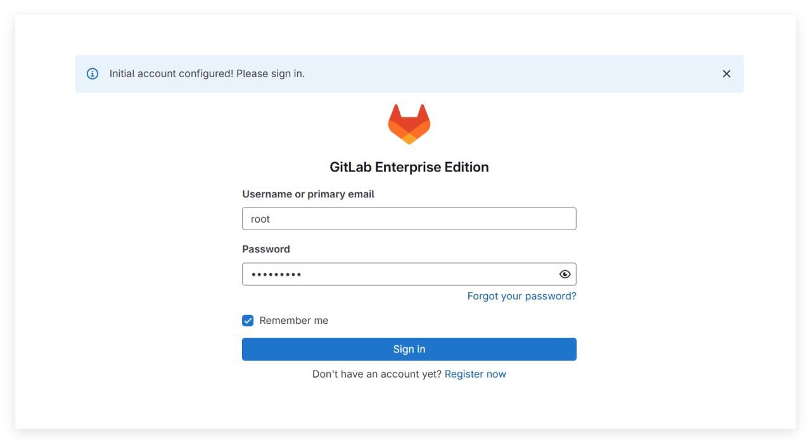
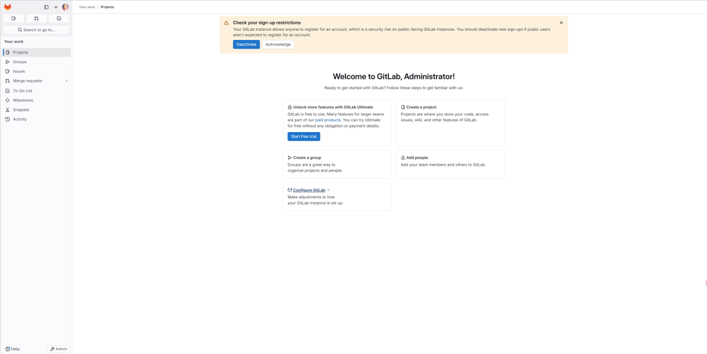
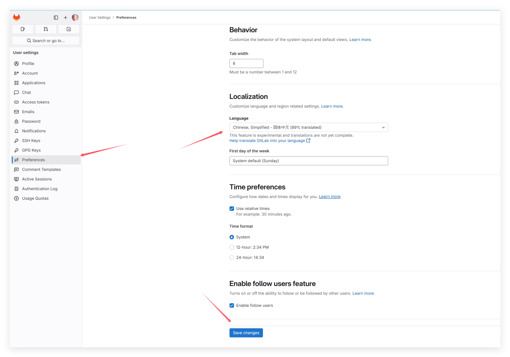
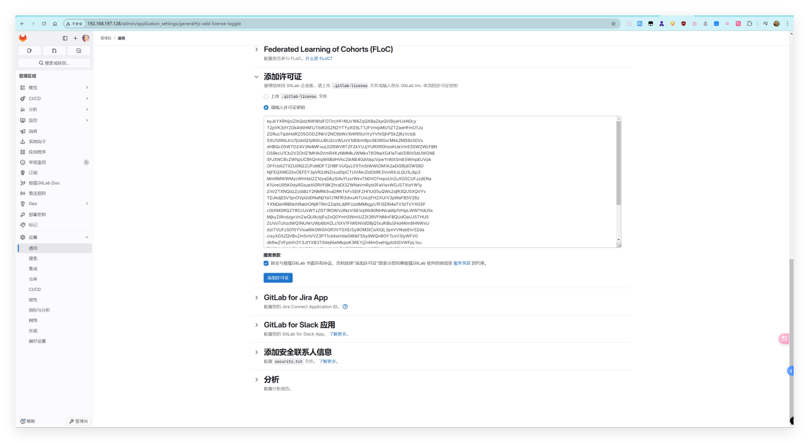
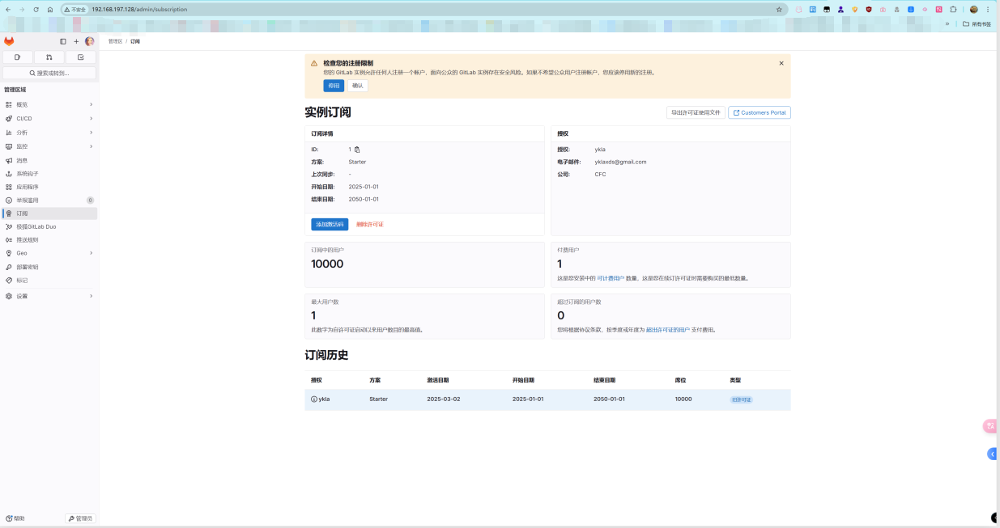

# 16.3 GitLab EE

## 安装 Gitlab EE

```sh
# pkg install gitlab-ee
```

或使用 Ports 安装：


```sh
# cd /usr/ports/www/gitlab/
# make FLAVORS=ee install clean
```

该 Port 同时包含 GitLab CE（社区版）；若要安装 EE（企业版），必须指定参数 `FLAVORS=ee`。

### 查看安装后说明

```sh
# pkg info -D gitlab-ee
gitlab-ee-17.8.2_1:
On install:
Gitlab was installed successfully.
# GitLab 已成功安装。

You now need to set up the various components of Gitlab, so please
follow the instructions in the guide at:

https://gitlab.com/mfechner/freebsd-gitlab-docu/blob/master/install/17.8-freebsd.md
# 接下来你需要配置 GitLab 的各个组件。
# 请参考上面的 FreeBSD 安装指南链接进行设置。

On upgrade from gitlab-ee<11.9.7:
!! WARNING: Please make sure you read in UPDATING entry 20190423 !!
# 如果你从低于 11.9.7 的旧版本升级，
# 请务必阅读 FreeBSD ports 树中 `UPDATING` 文件中 20190423 的条目！

On upgrade:
If you just installed an major upgrade of GitLab, for example you
switched from 17.5.x to 17.6.x, please follow the instructions in the guide at:

https://gitlab.com/mfechner/freebsd-gitlab-docu/blob/master/update/17.7-17.8-freebsd.md
# 如果你进行了主版本升级（例如从 17.5.x 升级到 17.6.x），
# 请按照上面链接的升级指南进行操作。

If you just installed an minor upgrade of GitLab please follow
the instructions in the guide at:

https://gitlab.com/mfechner/freebsd-gitlab-docu/blob/master/update/freebsd_patch_versions.md
# 如果只是进行了小版本升级（例如从 17.8.1 升级到 17.8.2），
# 请参阅上面的补丁版本更新指南。
```

开发者已提供完整安装说明，详见 <https://gitlab.com/mfechner/freebsd-gitlab-docu/blob/master/install/17.8-freebsd.md>。

如需赞助该开发者，可访问：<https://www.patreon.com/mfechner_gitlab_freebsd>。

## 启动服务

```sh
# service gitlab enable
```

## PostgreSQL 相关

当前 GitLab 支持的 PostgreSQL 版本为 16 及更高版本。

请读者参考本书其他相关章节自行完成 PostgreSQL 数据库的部署。

### 创建数据库

```sql
$ psql -d template1 -U postgres -c "CREATE USER git CREATEDB SUPERUSER PASSWORD 'password';"   # 创建 PostgreSQL 用户 git，授予创建数据库和超级用户权限，密码为 "password"
CREATE ROLE

$ psql -d template1 -U postgres -c "CREATE DATABASE gitlabhq_production OWNER git;"   # 创建数据库 gitlabhq_production，所有者为 git
CREATE DATABASE

$ psql -U git -d gitlabhq_production   # 使用 git 用户连接到 gitlabhq_production 数据库
psql (16.8)
Type "help" for help.

gitlabhq_production-# \q           # 退出 psql
$ exit                              # 退出 postgres 用户
```

### 切换回 `root`

```sh
# psql -U postgres -d gitlabhq_production -c "CREATE EXTENSION IF NOT EXISTS pg_trgm;"   # 为 gitlabhq_production 数据库创建 pg_trgm 扩展
# psql -U postgres -d gitlabhq_production -c "CREATE EXTENSION IF NOT EXISTS btree_gist;"   # 为 gitlabhq_production 数据库创建 btree_gist 扩展
# psql -U postgres -d gitlabhq_production -c "CREATE EXTENSION IF NOT EXISTS plpgsql;"   # 为 gitlabhq_production 数据库创建 plpgsql 扩展
```

## 配置 Redis

Redis 已自动作为依赖安装。

查看安装后信息：

```sh
# pkg info -D redis
redis-7.4.2:
On install:
To setup "redis" you need to edit the configuration file:
      /usr/local/etc/redis.conf
# 要配置 Redis，你需要编辑配置文件：
# /usr/local/etc/redis.conf

      To run redis from startup, add redis_enable="YES"
      in your /etc/rc.conf.
# 要使 Redis 在系统启动时自动运行，需在 /etc/rc.conf 文件中添加以下行：
# redis_enable="YES"
```

### 配置 socket

```sh
# echo 'unixsocket /var/run/redis/redis.sock' >> /usr/local/etc/redis.conf   # 配置 Redis 使用 UNIX socket
# echo 'unixsocketperm 770' >> /usr/local/etc/redis.conf                    # 设置 Redis UNIX socket 权限为 770
```

### 配置服务

```sh
# service redis enable           # 设置 Redis 服务开机启动
redis enabled in /etc/rc.conf

# service redis restart          # 重启 Redis 服务
redis not running? (check /var/run/redis/redis.pid)
Starting redis. 
```

### 配置用户权限

将用户 git 添加到 redis 用户组：

```sh
# pw groupmod redis -m git
```

## 配置 git（为 git 用户配置 Git 全局设置）

```sh
# su -l git -c "git config --global core.autocrlf input" # Web 编辑器需要
# su -l git -c "git config --global gc.auto 0" #  GitLab 在需要时会自动运行 git gc
# su -l git -c "git config --global repack.writeBitmaps true" # 加速仓库的对象访问和克隆操作
# su -l git -c "git config --global receive.advertisePushOptions true" # 允许服务器在 git push 时支持推送参数
# su -l git -c "git config --global core.fsync objects,derived-metadata,reference" # 减少服务器崩溃时存储库损坏的风险
# su -l git -c "mkdir -p /usr/local/git/.ssh" # 确保 .ssh 目录存在
# su -l git -c "mkdir -p /usr/local/git/repositories" # 确保存储库目录存在，并后续设置正确权限
# chown git /usr/local/git/repositories     # 将 /usr/local/git/repositories 所有者设置为 git 用户
# chgrp git /usr/local/git/repositories     # 将 /usr/local/git/repositories 所属组设置为 git
# chmod 2770 /usr/local/git/repositories    # 设置目录权限为 2770，启用 SGID，使组内用户可读写并继承组
```

## 配置 GitLab

配置文件路径在 `/usr/local/www/gitlab`。

### 调整 GitLab 负载

查看系统的 CPU 核心数量：

```sh
# sysctl hw.ncpu
hw.ncpu: 16
```

编辑 `/usr/local/www/gitlab/config/puma.rb`，将 `workers 3` 改为上面输出的值，即改为 `workers 16`。

### 配置 GitLab 数据库

- 编辑 `/usr/local/www/gitlab/config/database.yml`：

将 `password: "secure password"`，修改为 `password: "password"`（`password` 是上面设置的数据库密码）


- GitLab 需要写入权限来创建符号链接：

```sh
# chown git /usr/local/share/gitlab-shell      # 将 /usr/local/share/gitlab-shell 的所有者设置为 git 用户
```

```sh
# cd /usr/local/www/gitlab # 确保路径正确
root@ykla:/usr/local/www/gitlab # su -l git -c "cd /usr/local/www/gitlab && rake gitlab:setup RAILS_ENV=production" #  初始化 GitLab 数据库和相关配置
Missing Rails.application.credentials.secret_key_base for production environment. The secret will be generated and stored in config/secrets.yml.
Missing Rails.application.credentials.otp_key_base for production environment. The secret will be generated and stored in config/secrets.yml.
Missing Rails.application.credentials.db_key_base for production environment. The secret will be generated and stored in config/secrets.yml.
Missing Rails.application.credentials.openid_connect_signing_key for production environment. The secret will be generated and stored in config/secrets.yml.
Missing Rails.application.credentials.active_record_encryption_primary_key for production environment. The secret will be generated and stored in config/secrets.yml.
Missing Rails.application.credentials.active_record_encryption_deterministic_key for production environment. The secret will be generated and stored in config/secrets.yml.
Missing Rails.application.credentials.active_record_encryption_key_derivation_salt for production environment. The secret will be generated and stored in config/secrets.yml.
Creating a backup of secrets file: /usr/local/www/gitlab/config/secrets.yml: /usr/local/www/gitlab/config/secrets.yml.orig.1740894999
This will create the necessary database tables and seed the database.
You will lose any previous data stored in the database.
Do you want to continue (yes/no)? yes # 此处输入 yes 按回车键

Dropped database 'gitlabhq_production'
Created database 'gitlabhq_production'

== Seed from /usr/local/www/gitlab/db/fixtures/production/001_application_settings.rb
Creating the default ApplicationSetting record.
== /usr/local/www/gitlab/db/fixtures/production/001_application_settings.rb took 0.56 seconds

== Seed from /usr/local/www/gitlab/db/fixtures/production/002_default_organization.rb

OK
== /usr/local/www/gitlab/db/fixtures/production/002_default_organization.rb took 0.04 seconds

== Seed from /usr/local/www/gitlab/db/fixtures/production/003_admin.rb
Administrator account created:

login:    root # 注意用户名
password: You'll be prompted to create one on your first visit.

== /usr/local/www/gitlab/db/fixtures/production/003_admin.rb took 1.06 seconds

== Seed from /usr/local/www/gitlab/db/fixtures/production/004_create_base_work_item_types.rb

OK
== /usr/local/www/gitlab/db/fixtures/production/004_create_base_work_item_types.rb took 0.05 seconds

== Seed from /usr/local/www/gitlab/db/fixtures/production/005_add_security_training_providers.rb

OK
== /usr/local/www/gitlab/db/fixtures/production/005_add_security_training_providers.rb took 0.02 seconds

== Seed from /usr/local/www/gitlab/db/fixtures/production/010_settings.rb
Saved CI JWT signing key
Saved CI Job Token signing key
== /usr/local/www/gitlab/db/fixtures/production/010_settings.rb took 0.37 seconds

== Seed from /usr/local/www/gitlab/db/fixtures/production/020_create_work_item_hierarchy_restrictions.rb

OK
== /usr/local/www/gitlab/db/fixtures/production/020_create_work_item_hierarchy_restrictions.rb took 0.03 seconds

== Seed from /usr/local/www/gitlab/db/fixtures/production/040_create_work_item_related_link_restrictions.rb

OK
== /usr/local/www/gitlab/db/fixtures/production/040_create_work_item_related_link_restrictions.rb took 0.02 seconds

== Seed from ee/db/fixtures/production/010_license.rb
== ee/db/fixtures/production/010_license.rb took 0.00 seconds

== Seed from ee/db/fixtures/production/027_plans.rb

OK
== ee/db/fixtures/production/027_plans.rb took 0.02 seconds

== Seed from ee/db/fixtures/production/041_create_ai_settings.rb

OK
== ee/db/fixtures/production/041_create_ai_settings.rb took 0.02 seconds
== Seeding took 2.20 seconds
```

撤销之前授予的权限：

```sh
# chown root /usr/local/share/gitlab-shell      # 将 /usr/local/share/gitlab-shell 的所有者设置为 root 用户
```

- 检查 GitLab 及其环境是否配置正确

```sh
# su -l git -c "cd /usr/local/www/gitlab && rake gitlab:setup RAILS_ENV=production"      # 以 git 用户身份进入 GitLab 目录并执行生产环境初始化任务
Missing Rails.application.credentials.secret_key_base for production environment. The secret will be generated and stored in config/secrets.yml.
Missing Rails.application.credentials.otp_key_base for production environment. The secret will be generated and stored in config/secrets.yml.
Missing Rails.application.credentials.db_key_base for production environment. The secret will be generated and stored in config/secrets.yml.
Missing Rails.application.credentials.openid_connect_signing_key for production environment. The secret will be generated and stored in config/secrets.yml.
Missing Rails.application.credentials.active_record_encryption_primary_key for production environment. The secret will be generated and stored in config/secrets.yml.
Missing Rails.application.credentials.active_record_encryption_deterministic_key for production environment. The secret will be generated and stored in config/secrets.yml.
Missing Rails.application.credentials.active_record_encryption_key_derivation_salt for production environment. The secret will be generated and stored in config/secrets.yml.
Creating a backup of secrets file: /usr/local/www/gitlab/config/secrets.yml: /usr/local/www/gitlab/config/secrets.yml.orig.1740894999
This will create the necessary database tables and seed the database.
You will lose any previous data stored in the database.
Do you want to continue (yes/no)? yes

Dropped database 'gitlabhq_production'
Created database 'gitlabhq_production'

== Seed from /usr/local/www/gitlab/db/fixtures/production/001_application_settings.rb
Creating the default ApplicationSetting record.
== /usr/local/www/gitlab/db/fixtures/production/001_application_settings.rb took 0.56 seconds

== Seed from /usr/local/www/gitlab/db/fixtures/production/002_default_organization.rb

OK
== /usr/local/www/gitlab/db/fixtures/production/002_default_organization.rb took 0.04 seconds

== Seed from /usr/local/www/gitlab/db/fixtures/production/003_admin.rb
Administrator account created:

login:    root
password: You'll be prompted to create one on your first visit.

== /usr/local/www/gitlab/db/fixtures/production/003_admin.rb took 1.06 seconds

== Seed from /usr/local/www/gitlab/db/fixtures/production/004_create_base_work_item_types.rb

OK
== /usr/local/www/gitlab/db/fixtures/production/004_create_base_work_item_types.rb took 0.05 seconds

== Seed from /usr/local/www/gitlab/db/fixtures/production/005_add_security_training_providers.rb

OK
== /usr/local/www/gitlab/db/fixtures/production/005_add_security_training_providers.rb took 0.02 seconds

== Seed from /usr/local/www/gitlab/db/fixtures/production/010_settings.rb
Saved CI JWT signing key
Saved CI Job Token signing key
== /usr/local/www/gitlab/db/fixtures/production/010_settings.rb took 0.37 seconds

== Seed from /usr/local/www/gitlab/db/fixtures/production/020_create_work_item_hierarchy_restrictions.rb

OK
== /usr/local/www/gitlab/db/fixtures/production/020_create_work_item_hierarchy_restrictions.rb took 0.03 seconds

== Seed from /usr/local/www/gitlab/db/fixtures/production/040_create_work_item_related_link_restrictions.rb

OK
== /usr/local/www/gitlab/db/fixtures/production/040_create_work_item_related_link_restrictions.rb took 0.02 seconds

== Seed from ee/db/fixtures/production/010_license.rb
== ee/db/fixtures/production/010_license.rb took 0.00 seconds

== Seed from ee/db/fixtures/production/027_plans.rb

OK
== ee/db/fixtures/production/027_plans.rb took 0.02 seconds

== Seed from ee/db/fixtures/production/041_create_ai_settings.rb

OK
== ee/db/fixtures/production/041_create_ai_settings.rb took 0.02 seconds
== Seeding took 2.20 seconds
```

重新设置权限：

```sh
# chown root /usr/local/share/gitlab-shell      # 将 /usr/local/share/gitlab-shell 的所有者更改为 root 用户
```

编译资源：

```sh
# su -l git -c "cd /usr/local/www/gitlab && rake gitlab:env:info RAILS_ENV=production"      # 以 git 用户身份执行命令，切换到 GitLab 目录并显示生产环境信息

System information
System:
Proxy:		no
Current User:	git
Using RVM:	no
Ruby Version:	3.2.7
Gem Version:	3.6.4
Bundler Version:2.6.4
Rake Version:	13.2.1
Redis Version:	7.4.2
Sidekiq Version:7.2.4
Go Version:	unknown

GitLab information
Version:	17.8.2-ee
Revision:	Unknown
Directory:	/usr/local/www/gitlab
DB Adapter:	PostgreSQL
DB Version:	16.8
URL:		http://localhost
HTTP Clone URL:	http://localhost/some-group/some-project.git
SSH Clone URL:	git@localhost:some-group/some-project.git
Elasticsearch:	no
Geo:		no
Using LDAP:	no
Using Omniauth:	yes
Omniauth Providers:

GitLab Shell
Version:	14.39.0
Repository storages:
- default: 	unix:/usr/local/www/gitlab/tmp/sockets/private/gitaly.socket
GitLab Shell path:		/usr/local/share/gitlab-shell

Gitaly
rake aborted!
GRPC::Unavailable: 14:connections to all backends failing; last error: FAILED_PRECONDITION: unix:/usr/local/www/gitlab/tmp/sockets/private/gitaly.socket: connect failed: addr: unix:/usr/local/www/gitlab/tmp/sockets/private/gitaly.socket error: No such file or directory. debug_error_string:{UNKNOWN:Error received from peer  {grpc_message:"connections to all backends failing; last error: FAILED_PRECONDITION: unix:/usr/local/www/gitlab/tmp/sockets/private/gitaly.socket: connect failed: addr: unix:/usr/local/www/gitlab/tmp/sockets/private/gitaly.socket error: No such file or directory", grpc_status:14, created_time:"2025-03-02T14:01:11.480621308+08:00"}} (GRPC::Unavailable)
/usr/local/www/gitlab/lib/gitlab/gitaly_client.rb:291:in `execute'
/usr/local/www/gitlab/lib/gitlab/gitaly_client/call.rb:18:in `block in call'
/usr/local/www/gitlab/lib/gitlab/gitaly_client/call.rb:60:in `recording_request'
/usr/local/www/gitlab/lib/gitlab/gitaly_client/call.rb:17:in `call'
/usr/local/www/gitlab/lib/gitlab/gitaly_client.rb:280:in `call'
/usr/local/www/gitlab/lib/gitlab/gitaly_client/server_service.rb:14:in `info'
/usr/local/www/gitlab/lib/tasks/gitlab/info.rake:99:in `block (4 levels) in <top (required)>'
/usr/local/www/gitlab/lib/tasks/gitlab/info.rake:97:in `block (3 levels) in <top (required)>'
Tasks: TOP => gitlab:env:info
(See full trace by running task with --trace)
```

- 如果使用 corepack（Node.js）

将 `package.json` 文件的所有者更改为 git 用户：

```sh
# chown git /usr/local/www/gitlab/package.json
```

设置 Python 版本，设置前用 `ls` 先看看：

```sh
# ls /usr/local/bin/python3.11
/usr/local/bin/python3.11
```

在确认版本后，以 git 用户身份设置 Yarn 使用指定的 Python 解释器

```
# su -l git -c "cd /usr/local/www/gitlab && yarn config set python /usr/local/bin/python3.11"
yarn config v1.22.19
success Set "python" to "/usr/local/bin/python3.11".
Done in 0.03s.
```

编译资源，以 git 用户身份在 GitLab 目录安装生产依赖并使用 lockfile 文件：

```sh
# su -l git -c "cd /usr/local/www/gitlab && yarn install --production --pure-lockfile"
yarn install v1.22.19
$ node ./scripts/frontend/preinstall.mjs
[WARNING] package.json changed significantly. Removing node_modules to be sure there are no problems.
[1/5] Validating package.json...
[2/5] Resolving packages...
[3/5] Fetching packages...
[4/5] Linking dependencies...

……此处省略部分输出内容……

[7/8] ⠈ tree-sitter-json[7/8] ⠠ tree-sitter-json
[7/8] ⠠ tree-sitter-json
[-/8] ⠠ waiting...
[-/8] ⠠ waiting...
warning Your current version of Yarn is out of date. The latest version is "1.22.22", while you're on "1.22.19".
Done in 109.27s.
```

以 git 用户身份在生产环境下编译 GitLab 资产，同时跳过数据库和存储验证：

```sh
# su -l git -c "cd /usr/local/www/gitlab && RAILS_ENV=production NODE_ENV=production USE_DB=false SKIP_STORAGE_VALIDATION=true bundle exec rake gitlab:assets:compile"

……此处省略大概需要几十分钟，若提示内存溢出，自行增加 swap，一般来说需要执行两次，若内存溢出需要再重复执行一次……

The file does not introduce any side effects, we are all good.
`gitlab:assets:check_page_bundle_mixins_css_for_sideeffects` finished in 0.371513498 seconds
```

- 将 PostgreSQL 用户 git 设置为非超级用户：

```sh
# psql -d template1 -U postgres -c "ALTER USER git WITH NOSUPERUSER;"
ALTER ROLE
```

- 启动 GitLab 服务：

```sh
# service gitlab start

……省略……

Started in 45s.
The GitLab web server with pid 8202 is running.
The GitLab Sidekiq job dispatcher with pid 8212 is running.
The GitLab Workhorse with pid 8216 is running.
Gitaly with pid 8218 is running.
GitLab and all its components are up and running.
```

## Nginx

### 安装

使用 pkg 安装：

```sh
# pkg install nginx
```

或者使用 ports 安装：

```
# cd /usr/ports/www/nginx/ 
# make install clean
```

### 配置 `/usr/local/etc/nginx/nginx.conf`

编辑 `/usr/local/etc/nginx/nginx.conf`，找到

```ini
http {
    include       mime.types;
    default_type  application/octet-stream;
```

修改如下以包含 GitLab 提供的 Nginx 配置文件：

```ini
http {
    include       mime.types;
    default_type  application/octet-stream;
    include       /usr/local/www/gitlab/lib/support/nginx/gitlab; # 加入此行
```

## 配置服务

设置 Nginx 在系统启动时自动启动：

```sh
# service nginx enable
nginx enabled in /etc/rc.conf
```

启动 Nginx 服务：

```sh
# service nginx start
Performing sanity check on nginx configuration:
nginx: the configuration file /usr/local/etc/nginx/nginx.conf syntax is ok
nginx: configuration file /usr/local/etc/nginx/nginx.conf test is successful
Starting nginx.
```

## 配置 GitLab Pages

```sh
# su -l git -c "openssl rand -base64 32 > /usr/local/www/gitlab/.gitlab_pages_secret"   # 以 git 用户身份生成 GitLab Pages 密钥
# chmod 640 /usr/local/www/gitlab/.gitlab_pages_secret   # 设置密钥文件权限为 640
# chgrp gitlab-pages /usr/local/www/gitlab/.gitlab_pages_secret   # 将密钥文件的用户组更改为 gitlab-pages
```

### 启动服务

```sh
# sysrc gitlab_pages_enable="YES"   # 设置 GitLab Pages 在系统启动时自动启动
# service gitlab_pages start        # 启动 GitLab Pages 服务
```

## 检查配置

以 git 用户身份检查 GitLab 生产环境配置：

```sh
# su -l git -c "cd /usr/local/www/gitlab && rake gitlab:check RAILS_ENV=production"
Checking GitLab subtasks ...

Checking GitLab Shell ...

GitLab Shell: ... GitLab Shell version >= 14.39.0 ? ... OK (14.39.0)
Running /usr/local/share/gitlab-shell/bin/gitlab-shell-check
Internal API available: OK
Redis available via internal API: OK
gitlab-shell self-check successful

Checking GitLab Shell ... Finished

Checking Gitaly ...

Gitaly: ... default ... OK

Checking Gitaly ... Finished

Checking Sidekiq ...

Sidekiq: ... Running? ... yes
Number of Sidekiq processes (cluster/worker) ... 1/1

Checking Sidekiq ... Finished

Checking Incoming Email ...

Incoming Email: ... Reply by email is disabled in config/gitlab.yml

Checking Incoming Email ... Finished

Checking LDAP ...

LDAP: ... LDAP is disabled in config/gitlab.yml

Checking LDAP ... Finished

Checking GitLab App ...

Database config exists? ... yes
Tables are truncated? ... skipped
All migrations up? ... yes
Database contains orphaned GroupMembers? ... no
GitLab config exists? ... yes
GitLab config up to date? ... yes
Cable config exists? ... yes
Resque config exists? ... yes
Log directory writable? ... yes
Tmp directory writable? ... yes
Uploads directory exists? ... yes
Uploads directory has correct permissions? ... yes
Uploads directory tmp has correct permissions? ... skipped (no tmp uploads folder yet)
Systemd unit files or init script exist? ... no
  Try fixing it:
  Install the Service
  For more information see:
  doc/install/installation.md in section "Install the Service"
  Please fix the error above and rerun the checks.
Systemd unit files or init script up-to-date? ... can't check because of previous errors
Projects have namespace: ... can't check, you have no projects
Redis version >= 6.2.14? ... yes
Ruby version >= 3.0.6 ? ... yes (3.2.7)
Git user has default SSH configuration? ... yes
Active users: ... 1
Is authorized keys file accessible? ... no
Trying to fix error automatically. ...Success
GitLab configured to store new projects in hashed storage? ... yes
All projects are in hashed storage? ... yes
Elasticsearch version 7.x-8.x or OpenSearch version 1.x ... skipped (Advanced Search is disabled)
All migrations must be finished before doing a major upgrade ... skipped (Advanced Search is disabled)

Checking GitLab App ... Finished


Checking GitLab subtasks ... Finished
```


## 启动 Gitlab

重启 GitLab 服务：

```sh
# service gitlab restart
```

在浏览器中输入服务器 IP 并回车，例如本示例为 `192.168.197.128`。请填写你的电子邮箱并设置密码（至少 8 位，需包含复杂字符）。


登录：





## 设置中文

点击头像，进入“Preferences”，找到“Localization”，选择“简体中文”，然后点击“Save changes”保存设置：




## 激活

>**警告**
>
>此部分内容仅供个人学习参考，不得用于商业用途。本书不承担相关责任。请支持正版：[购买许可证](https://about.gitlab.com/pricing/)。

安装 `gitlab-license`（gem 是 ruby 包管理器，上面已经作为依赖自动安装了）：

```sh
# gem install gitlab-license
Fetching gitlab-license-2.6.0.gem
Successfully installed gitlab-license-2.6.0
Parsing documentation for gitlab-license-2.6.0
Installing ri documentation for gitlab-license-2.6.0
Done installing documentation for gitlab-license after 0 seconds
1 gem installed

A new release of RubyGems is available: 3.6.4 → 3.6.5!
Run `gem update --system 3.6.5` to update your installation.
```

```sh
# mkdir gitlab-license           # 创建 gitlab-license 目录
# cd gitlab-license/             # 进入 gitlab-license 目录
# ee license.rb                  # 使用 ee 编辑器创建或编辑 license.rb 文件
```

将以下内容写入 `license.rb` 文件：

```ruby
require "openssl"
require "gitlab/license"
key_pair = OpenSSL::PKey::RSA.generate(2048)
File.open("license_key", "w") { |f| f.write(key_pair.to_pem) }
public_key = key_pair.public_key
File.open("license_key.pub", "w") { |f| f.write(public_key.to_pem) }
private_key = OpenSSL::PKey::RSA.new File.read("license_key")
Gitlab::License.encryption_key = private_key
license = Gitlab::License.new
license.licensee = {
"Name" => "ykla", # 你的用户名
"Company" => "CFC", # 你的机构
"Email" => "yklaxds@gmail.com", # 你的电子邮箱
}
license.starts_at = Date.new(2025, 1, 1) # 开始时间
license.expires_at = Date.new(2050, 1, 1) # 结束时间
license.notify_admins_at = Date.new(2049, 12, 1)
license.notify_users_at = Date.new(2049, 12, 1)
license.block_changes_at = Date.new(2050, 1, 1)
license.restrictions = {
active_user_count: 10000,
}
puts "License:"
puts license
data = license.export
puts "Exported license:"
puts data
File.open("GitLabBV.gitlab-license", "w") { |f| f.write(data) }
public_key = OpenSSL::PKey::RSA.new File.read("license_key.pub")
Gitlab::License.encryption_key = public_key
data = File.read("GitLabBV.gitlab-license")
$license = Gitlab::License.import(data)
puts "Imported license:"
puts $license
unless $license
raise "The license is invalid."
end
if $license.restricted?(:active_user_count)
active_user_count = 10000
if active_user_count > $license.restrictions[:active_user_count]
    raise "The active user count exceeds the allowed amount!"
end
end
if $license.notify_admins?
puts "The license is due to expire on #{$license.expires_at}."
end
if $license.notify_users?
puts "The license is due to expire on #{$license.expires_at}."
end
module Gitlab
class GitAccess
    def check(cmd, changes = nil)
    if $license.block_changes?
        return build_status_object(false, "License expired")
    end
    end
end
end
puts "This instance of GitLab Enterprise Edition is licensed to:"
$license.licensee.each do |key, value|
puts "#{key}: #{value}"
end
if $license.expired?
puts "The license expired on #{$license.expires_at}"
elsif $license.will_expire?
puts "The license will expire on #{$license.expires_at}"
else
puts "The license will never expire."
end
```

使用 Ruby 执行 `license.rb` 脚本：


```ruby
# ruby license.rb 
License:
#<Gitlab::License:0x00001333815f0f88>
Exported license:
eyJkYXRhIjoiZlhQdzNWWldFOTIrcHFrNUx1MlZqQXBaZkpQVi9yaHJxN0cy
T2pVK3dYZGk4dllHM1JTblR3S2N2YTYyXG5LTTJFVmlpMU1iZTZaaHFmOTJu
ZGRucTlpbHdRZ05OODZINkV2NCttbWx1bW95UnYyYVhtSjhPSkZjRzVcbjll
……省略一部分……
Q2hNd0ViZFJCNFlpK3R2M1dYMS9LXG4xendIMEVNWFJhT3dPN1BUaDd2Mngx
NVhvSTNxZTN3STFjNTFyOUFJeGc9PVxuIiwiaXYiOiIzcDByN01MelpSck10
K2YwbWhobEpRPT1cbiJ9
Imported license:
#<Gitlab::License:0x0000133381f3ece8>
This instance of GitLab Enterprise Edition is licensed to:
Name: ykla
Company: CFC
Email: yklaxds@gmail.com
The license will expire on 2050-01-01
```

备份旧的公钥：

```sh
# cp /usr/local/www/gitlab/.license_encryption_key.pub /usr/local/www/gitlab/.license_encryption_key.pub.back
```

查看目录下文件。在目录下生成三个文件：

```sh
root@ykla:~/gitlab-license # ls
GitLabBV.gitlab-license	license_key
license.rb		license_key.pub
```

用新生成的公钥替换原有公钥：

```sh
root@ykla:~/gitlab-license # cp license_key.pub /usr/local/www/gitlab/.license_encryption_key.pub
```

查看公钥：

```sh
root@ykla:~/gitlab-license # cat GitLabBV.gitlab-license
eyJkYXRhIjoiZlhQdzNWWldFOTIrcHFrNUx1MlZqQXBaZkpQVi9yaHJxN0cy
T2pVK3dYZGk4dllHM1JTblR3S2N2YTYyXG5LTTJFVmlpMU1iZTZaaHFmOTJu
ZGRucTlpbHdRZ05OODZINkV2NCttbWx1bW95UnYyYVhtSjhPSkZjRzVcbjll
……省略一部分……
Q2hNd0ViZFJCNFlpK3R2M1dYMS9LXG4xendIMEVNWFJhT3dPN1BUaDd2Mngx
NVhvSTNxZTN3STFjNTFyOUFJeGc9PVxuIiwiaXYiOiIzcDByN01MelpSck10
K2YwbWhobEpRPT1cbiJ9
```

访问 [http://192.168.197.128/admin/application\_settings/general](http://192.168.197.128/admin/application_settings/general)（请替换为你的 IP 地址），点击“添加许可证”，然后在“请输入许可证密钥”框中粘贴 `GitLabBV.gitlab-license` 文件中的内容：






### 参考文献

[GitLab EE 16 安装破解教程](https://blog.mengguyi.com/articles/GitLab-Install.html)


## 导入外部项目

打开 <http://192.168.197.128/admin>，点击“通用”，选择右侧“导入和导出设置”，选择所需的项目，保存。


### 参考文献

- [CI/CD 笔记 .Gitlab 系列：2024 更新后 - 设置 GitLab 导入源](https://bbs.huaweicloud.com/blogs/423539)


## 故障排除与未竟事宜


### 日志

- `/var/log/nginx/gitlab_error.log`
- `/var/log/nginx/error.log`
- `/var/log/gitlab_pages.log`
- `/var/log/gitlab-shell/gitlab-shell.log`

### `500: We're sorry, something went wrong on our end`

查看 GitLab 服务的当前状态：

```sh
# service gitlab status
The GitLab web server with pid 8202 is running.
The GitLab Sidekiq job dispatcher with pid 8212 is running.
The GitLab Workhorse with pid 8216 is running.
Gitaly with pid 8218 is running.
GitLab and all its components are up and running.
```

如果服务运行状态正常且错误日志无异常，可能是内存不足（例如 8G 内存仍可能不够）：

显示内核环缓冲区消息：

```sh
# dmesg

……省略……

swap_pager: out of swap space
swp_pager_getswapspace(11): failed
swap_pager: out of swap space
swp_pager_getswapspace(27): failed
swp_pager_getswapspace(11): failed
swp_pager_getswapspace(4): failed
swp_pager_getswapspace(1): failed
swp_pager_getswapspace(9): failed
swp_pager_getswapspace(1): failed
swp_pager_getswapspace(20): failed
swp_pager_getswapspace(4): failed
pid 7965 (node), jid 0, uid 211, was killed: failed to reclaim memory
pid 7822 (ruby32), jid 0, uid 211, was killed: failed to reclaim memory
```

如果还是报错 500，建议重来一次。

#### 参考文献

- [CentOS 7 上 GitLab 的安装、备份、迁移及恢复](https://www.ifeegoo.com/the-installation-backup-migration-restore-of-gitlab-on-centos-7.html)


