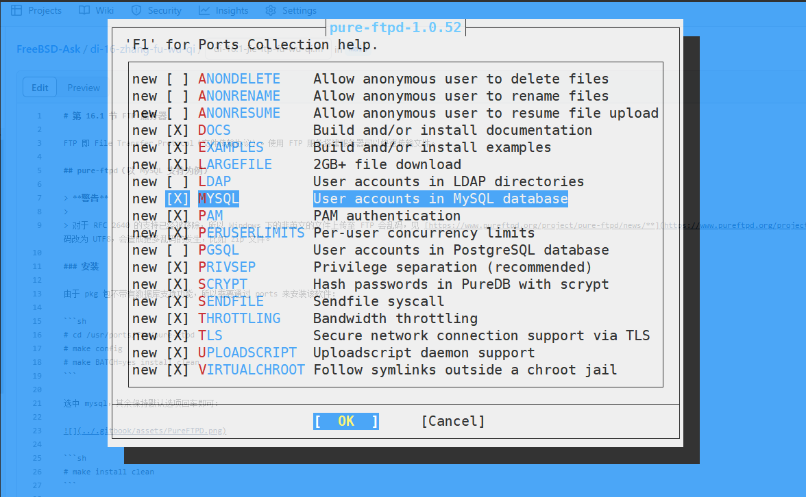

# 16.1 FTP 服务器

FTP 即 File Transfer Protocol（文件传输协议）。通过搭建 FTP 服务器可以实现文件的快速传输。

## Pure-FTPd（基于 MySQL）

### Pure-FTPd 不支持中文环境

Pure-FTPd 已移除对 [RFC 2640](https://www.rfc-editor.org/rfc/rfc2640)（Internationalization of the File Transfer Protocol，FTP 协议的国际化）的支持，因此在 Windows 系统下使用 ftp 命令行访问包含非英文字符的文件可能出现乱码，且无法修改编码。参见 [Version 1.0.48 released](https://www.pureftpd.org/project/pure-ftpd/news)。

FTP 服务器发送原始命令 `OPTS UTF8 ON`，请求启用 UTF-8 编码：

```powershell
ftp> quote opts utf8 on
504 Unknown command
```

在 FreeBSD 中使用命令行或 WinSCP 等客户端测试 Pure-FTPd 时，不会出现乱码问题。

### 安装

由于通过 pkg 安装的包不包含数据库支持功能，因此需要通过 ports 来安装该软件：

```sh
# cd /usr/ports/ftp/pure-ftpd
# make config
```

在配置过程中选择 `MYSQL`，其余选项保持默认并回车确认即可：




```sh
# make BATCH=yes install clean
```

### 配置 `/usr/local/etc/pure-ftpd.conf` 文件

#### 生成配置文件

```sh
# cp /usr/local/etc/pure-ftpd.conf.sample /usr/local/etc/pure-ftpd.conf          # 复制 Pure-FTPd 配置示例文件为默认配置
# cp /usr/local/etc/pureftpd-mysql.conf.sample /usr/local/etc/pureftpd-mysql.conf   # 复制 Pure-FTPd MySQL 配置示例文件为默认配置
```

#### 编辑配置文件并增加 mysql 的支持

编辑 `/usr/local/etc/pure-ftpd.conf` 文件，按如下方式修改相关配置项：


```ini
# 兼容 ie 等非正规化的 ftp 客户端

BrokenClientsCompatibility yes

# 被动连接响应的端口范围。

PassivePortRange 30000 50000

# 允许认证用户登录的最小 UID。
# 例如，值为 100 会阻止所有 UID 小于 100 的用户登录。
# 如果你希望 root 能够登录，请使用 0。

MinUID 2000

# 仅允许认证用户进行 FXP 传输。

AllowUserFXP yes

# 若不禁止或注释，日志会报错找不到 ftp 用户

# AntiWarez                    yes

# 用户主目录不存在的话，自动创建

CreateHomeDir yes

# MySQL 配置文件（参见 README.MySQL）

MySQLConfigFile /usr/local/etc/pureftpd-mysql.conf
```

### 配置 MySQL

本文以 MySQL 8.x 为基础。有关 MySQL 的安装和基本配置，请参见其他章节。

请自行安装配置 MySQL 8.x。

#### 创建数据库

```sql
CREATE DATABASE pureftpd;   -- 创建名为 pureftpd 的数据库
USE pureftpd;                -- 选择使用 pureftpd 数据库

DROP TABLE IF EXISTS `users`;  -- 如果存在 users 表则删除
CREATE TABLE `users` (  
   `User` varchar(255) CHARACTER SET utf8mb4 COLLATE utf8mb4_bin NOT NULL,  -- 用户名，主键
   `Password` varchar(255) CHARACTER SET utf8mb4 COLLATE utf8mb4_bin NOT NULL,  -- 密码
   `Uid` int(11) NOT NULL DEFAULT -1 COMMENT '用户 ID',  -- 用户 ID
   `Gid` int(11) NOT NULL DEFAULT -1 COMMENT '用户组 ID',  -- 用户组 ID
   `Dir` varchar(255) CHARACTER SET utf8mb4 COLLATE utf8mb4_bin NOT NULL,  -- 用户目录
   `quotafiles` int(11) NULL DEFAULT 500,  -- 文件数量配额
   `quotasize` int(11) NULL DEFAULT 30,  -- 存储空间配额
   `ulbandwidth` int(11) NULL DEFAULT 80,  -- 上传带宽限制
   `dlbandwidth` int(11) NULL DEFAULT 80,  -- 下载带宽限制
   `ipaddress` varchar(255) CHARACTER SET utf8mb4 COLLATE utf8mb4_general_ci NULL DEFAULT '*',  -- 限制 IP 地址
   `comment` varchar(255) NULL DEFAULT NULL,  -- 备注
   `status` tinyint(4) NULL DEFAULT 1,  -- 用户状态
   `ulratio` int(11) NULL DEFAULT 1,  -- 上传比例
   `dlratio` int(11) NULL DEFAULT 1,  -- 下载比例
   PRIMARY KEY (`User`) USING BTREE  -- 设置主键为 User
) ENGINE=InnoDB DEFAULT CHARSET=utf8mb4 COLLATE=utf8mb4_general_ci ROW_FORMAT=Dynamic;  -- 表引擎和字符集配置
```

#### 创建登录数据库用户及设置密码

```sql
CREATE USER 'pftp'@'localhost' IDENTIFIED BY 'abc123';   -- 创建 MySQL 用户 pftp，允许从本地主机连接
GRANT SELECT, INSERT, UPDATE, DELETE ON pureftpd.* TO 'pftp'@'localhost';   -- 授予 pftp 用户对 pureftpd 数据库的增删改查权限
FLUSH PRIVILEGES;   -- 刷新权限，使配置立即生效
```

测试数据库连接。

使用 pftp 用户连接本地主机上的 pureftpd 数据库，系统提示输入密码：

```sh
# mysql -u pftp -p -h localhost pureftpd
```

### 配置文件 `/usr/local/etc/pureftpd-mysql.conf`

`/usr/local/etc/pureftpd-mysql.conf` 文件完整示例：

```ini
##############################################
#                                            #
# 示例 Pure-FTPd 的 MySQL 配置文件。         #
# 详细说明请参阅 README.MySQL。              #
#                                            #
##############################################

# MYSQLServer 数据库服务器地址
MYSQLServer     127.0.0.1

# MYSQLServer 数据库服务器端口
MYSQLPort       3306

# 可选：如果数据库服务器运行在本机，指定 mysql.sock 的路径。
MYSQLSocket     /var/run/mysqld/mysqld.sock

# 数据库用户名
MYSQLUser       pftp

# 数据库密码
MYSQLPassword   abc123

# 数据库名
MYSQLDatabase   pureftpd

# 密码加密方式（此处为明文）
# 有效值包括："cleartext"（明文）、"argon2"、"scrypt"、"crypt" 和 "any"
MYSQLCrypt      cleartext

# 以下设置中的字符串部分在运行时会被替换：
#
# \L 会被替换为尝试认证的用户名。
# \I 会被替换为用户连接到的 IP 地址。
# \P 会被替换为用户连接到的端口号。
# \R 会被替换为用户来源的 IP 地址。
# \D 会被替换为远程 IP 地址的长整数形式。
#
# 使用这些替换字符串可以执行非常复杂的查询，特别适用于虚拟主机设置。

# 用于获取密码的 SQL 查询语句
MYSQLGetPW      SELECT Password FROM users WHERE User='\L'

# 用于获取系统用户名或 UID 的 SQL 查询语句
MYSQLGetUID     SELECT Uid FROM users WHERE User='\L'

# 默认 UID - 设置后将覆盖 MYSQLGetUID 的查询结果
MYSQLDefaultUID 2000

# 用于获取系统用户组名或 GID 的 SQL 查询语句
MYSQLGetGID     SELECT Gid FROM users WHERE User='\L'

# 默认 GID - 设置后将覆盖 MYSQLGetGID 的查询结果
MYSQLDefaultGID 2000

# 用于获取用户主目录的 SQL 查询语句
MYSQLGetDir     SELECT Dir FROM users WHERE User='\L'

# 可选：用于获取最大文件数的查询（虚拟配额支持需开启）
MySQLGetQTAFS  SELECT QuotaFiles FROM users WHERE User='\L'

# 可选：用于获取最大磁盘使用量（单位为 MB，需要虚拟配额支持）
MySQLGetQTASZ  SELECT QuotaSize FROM users WHERE User='\L'

# 可选：上传/下载比率，服务器需支持比率功能
MySQLGetRatioUL SELECT ULRatio FROM users WHERE User='\L'
MySQLGetRatioDL SELECT DLRatio FROM users WHERE User='\L'

# 可选：带宽限制，单位为 KB/s，服务器需支持带宽限制功能
MySQLGetBandwidthUL SELECT ULBandwidth FROM users WHERE User='\L'
MySQLGetBandwidthDL SELECT DLBandwidth FROM users WHERE User='\L'

# 启用 ~ 路径扩展。**切勿盲目启用，除非满足以下条件：**
# 1) 你明确知道自己在做什么。
# 2) 实际用户与虚拟用户一致。
# MySQLForceTildeExpansion 1

# 如果你使用事务型存储引擎，可以启用 SQL 事务以避免竞态条件。
# 如果使用传统的 MyISAM 引擎，请保持此项注释。
# MySQLTransactions On
```

### 添加 ftp 组和用户

>**警告**
>
>使用数据库后，`pure-pw` 命令就不生效了。

```sh
# pw groupadd ftpgroup -g 2000   # 创建用户组 ftpgroup，GID 为 2000
# pw useradd ftpuser -u 2001 -g 2000 -s /sbin/nologin -w no -d /home/pureftp -c "VirtualUser Pure-FTPd" -m   # 创建虚拟 FTP 用户 ftpuser，UID 2001，主目录 /home/pureftp，不允许登录系统，自动创建主目录
```

- 添加 FTP 登录用户（必须手动写入 mysql 数据库），以下命令创建的用户是 `test`。密码是 `test2`。

```sql
USE pureftpd;   -- 选择 pureftpd 数据库
INSERT INTO `users` (`User`, `Password`, `Uid`, `Gid`, `Dir`, `quotafiles`, `quotasize`, `ulbandwidth`, `dlbandwidth`, `ipaddress`, `comment`, `status`, `ulratio`, `dlratio`)
VALUES ('test', 'test2', 2001, 2000, '/home/pureftp/www', 500, 30, 80, 80, '*', NULL, 1, 1, 1);   -- 向 users 表中插入一个测试用户记录
```

>**注意**
>
>写入表中的 `Uid` 和 `Gid` 必须与之前通过 `pw useradd` 创建的用户保持一致。

>**技巧**
>
>基本思路是数据库中的虚拟用户将继承 `pw useradd` 创建的用户的权限及 GID/UID，然后通过数据库中的用户进行 FTP 操作。以下内容同理。

实际操作示例：

```sql
root@localhost [(none)]> show databases;	-- 显示当前 MySQL 服务器上的所有数据库列表
+--------------------+
| Database           |
+--------------------+
| information_schema |
| mysql              |
| performance_schema |
| pureftpd           |
| sys                |
+--------------------+
5 rows in set (0.00 sec)
root@localhost [pureftpd]> USE pureftpd;   -- 选择 pureftpd 数据库作为当前操作的数据库
Database changed
root@localhost [pureftpd]> INSERT INTO `users` (`User`, `Password`, `Uid`, `Gid`, `Dir`, `quotafiles`, `quotasize`, `ulbandwidth`, `dlbandwidth`, `ipaddress`, `comment`, `status`, `ulratio`, `dlratio`)
    -> VALUES ('test', 'test2', 2001, 2000, '/home/pureftp/www', 500, 30, 80, 80, '*', NULL, 1,1, 1);
Query OK, 1 row affected (0.01 sec)
root@localhost [pureftpd]> select * from users;   -- 查询 users 表中的所有记录
+------+----------+------+------+-------------------+------------+-----------+-------------+-------------+-----------+---------+--------+---------+---------+
| User | Password | Uid  | Gid  | Dir               | quotafiles | quotasize | ulbandwidth | dlbandwidth | ipaddress | comment | status | ulratio | dlratio |
+------+----------+------+------+-------------------+------------+-----------+-------------+-------------+-----------+---------+--------+---------+---------+
| test | test2    | 2001 | 2000 | /home/pureftp/www |        500 |        30 |          80 |    80 | *         |    NULL |      1 |       1 |       1 |
+------+----------+------+------+-------------------+------------+-----------+-------------+-------------+-----------+---------+--------+---------+---------+
1 row in set (0.01 sec)
```

- 配置 FTP 目录

```sh
# mkdir -p /home/pureftp/www                   # 创建 FTP 用户的主目录及子目录
# chown -R ftpuser:ftpgroup /home/pureftp     # 设置目录所有者为 ftpuser，所属组为 ftpgroup
# chmod -R 775 /home/pureftp                  # 设置目录权限为 775，允许同组用户读写
```

#### 参考文献

- [Linux 环境下 FTP 权限设置详解与操作步骤全攻略](https://my.oschina.net/emacs_8748786/blog/17171107),775 权限设置来自此处

### 服务操作

```sh
# service pure-ftpd enable    # 设置 Pure-FTPd 服务开机启动
# service pure-ftpd start     # 启动 Pure-FTPd 服务
# service pure-ftpd stop      # 停止 Pure-FTPd 服务
# service pure-ftpd restart   # 重启 Pure-FTPd 服务
```

### 参考文献

- [Virtual Hosting With PureFTPd And MySQL](http://km.npru.ac.th/userfiles/R013/km_articles_files/20120227104346_Virtual%20Hosting%20With%20PureFTPd%20And%20MySQL.pdf)，本文框架基于此

### 故障排除与未竟事宜

- Pure-FTPd 日志在 `/var/log/messages`。

## ProFTPD（基于 MySQL）

>**技巧**
>
>ProFTPD 在 Windows 自带的 FTP 链接下不会乱码。

### 安装 ProFTPD

> **注意**
>
>本文基于 MySQL 8.0。关于 MySQL 的安装、基本设置请看其他章节。

请自行安装配置 MySQL 8.x——需要与 `proftpd-mod_sql_mysql` 安装的 `databases/mysql8X-client` 版本相一致。

```sh
# pkg install proftpd proftpd-mod_sql_mysql
```

或

```sh
# cd /usr/ports/ftp/proftpd/ && make install clean
# cd /usr/ports/databases/proftpd-mod_sql_mysql/ && make install clean
```

### ProFTPD 配置文件 `/usr/local/etc/proftpd.conf`

- 编辑 ProFTPD 的配置文件 `/usr/local/etc/proftpd.conf` 如下

>**技巧**
>
>示例文件参见 `/usr/local/etc/proftpd.conf.sample`。

```ini
ServerName "Test Ftp Server"                     # FTP 服务器名称
ServerType standalone                             # 独立运行模式
DefaultServer on                                  # 设置为默认服务器
ServerIdent on "FTP Server ready"                # 客户端连接时显示的服务器标识
Port 21                                          # 监听端口
Umask 022                                        # 文件创建掩码

# 超时设置
TimeoutLogin 300                                 # 登录超时时间（秒）
TimeoutIdle 36000                                # 空闲超时时间（秒）
TimeoutNoTransfer 36000                          # 无传输超时时间（秒）

# 资源限制
User proftpd                                     # 运行服务的用户
Group proftpd                                    # 运行服务的用户组
RLimitMemory 256M 256M                           # 内存限制
RLimitOpenFiles 1024 1024                        # 打开文件数量限制
PassivePorts 50000 60000                          # 被动模式端口范围

# 日志配置
LogFormat default "%h %l %u %t \"%r\" %s %b"     # 默认日志格式
LogFormat auth "%v [%P] %h %t \"%r\" %s"         # 认证日志格式
SystemLog /var/log/proftpd/proftpd.log           # 系统日志路径
TransferLog /var/log/proftpd/xfer.log            # 文件传输日志路径
ExtendedLog /var/log/proftpd/auth.log AUTH auth  # 扩展认证日志

# MySQL 模块加载
LoadModule mod_sql.c
LoadModule mod_sql_mysql.c
LoadModule mod_sql_passwd.c

# 只允许访问自己的目录
DefaultRoot ~                                    # 将用户限制在主目录下

# 运行覆盖文件
AllowOverwrite on                                # 允许文件覆盖

<Global>
  # 数据库连接
  SQLConnectInfo proftpd@localhost proftpd 123456   # 数据库连接信息（用户、主机、密码）

  # 密码认证设置
  SQLAuthTypes SHA256                             # 使用 SHA256 加密认证
  SQLPasswordEngine on                            # 启用 SQL 密码引擎

  # 用户表映射
  SQLUserInfo users username password uid gid homedir shell   # 映射 users 表字段
  SQLDefaultGID 2000                              # 默认 GID
  SQLDefaultUID 2000                              # 默认 UID
  RequireValidShell off                            # 不要求有效 shell

  # 认证顺序
  AuthOrder mod_sql.c
  SQLAuthenticate users                            # 使用 SQL 用户表认证

  # 登录统计
  SQLNamedQuery getcount SELECT "CONCAT('Total logins: ', count) FROM users WHERE username='%u'"   # 查询登录次数
  SQLNamedQuery updatecount UPDATE "count=count+1 WHERE username='%u'" users                       # 更新登录次数
  SQLShowInfo PASS "230" "%{getcount}"              # 显示登录统计信息
  SQLLog PASS updatecount                            # 记录登录统计

  # 文件操作日志
  SQLNamedQuery log_work FREEFORM "INSERT INTO worklog (user_name, file_and_path, bytes, send_time, client_ip, client_name, client_command) VALUES ('%u', '%f', %b, NULLIF('%T', ''), '%a', '%h', '%m')"  # 文件操作日志记录
  SQLLog RETR,STOR,DELE log_work                    # 将 RETR、STOR、DELE 操作记录到 worklog 表
</Global>
```


- 创建一个目录来存储 FTP 服务器的日志：


```sh
# mkdir /var/log/proftpd
```

>**警告**
>
>如果不 **手动** 创建目录（即使系统已自动创建，也建议再次手动创建），会提示 `proftpd[3435]: warning: handling possibly truncated configuration data at line 65 of '/usr/local/etc/proftpd.conf'`。


>**技巧**
>
>ProFTPD 配置文件 `/usr/local/etc/proftpd.conf` 有语法检查命令 `proftpd -t -d5`。

在本设置中，服务器将在主动模式下使用端口 21，在被动模式下使用 50000-60000 范围的端口。应确保这些端口在防火墙中已开放。

对于 PF 防火墙，这是通过以下规则完成的。

允许从外部接口 `$ext_if`（读者需要替换成自己的网络接口）到本机端口 21 及 50000-60000 的 TCP 入站流量：

```ini
pass in quick on $ext_if proto tcp from any to $ext_if port { 21, 50000:60000 }
```

### 创建用户

出于安全目的，我们将以非 root 用户身份运行 Proftpd。因此，我们将交互式地添加一位新用户：

```sh
# adduser
Username: proftpd # 用户名
Full name: FTP User # 用户全名
Uid (Leave empty for default): 
Login group [proftpd]:
Login group is proftpd. Invite proftpd into other groups? []:
Login class [default]:
Shell (sh csh tcsh bash nologin) [sh]: nologin # 不允许登录系统
Home directory [/home/proftpd]:
Home directory permissions (Leave empty for default):
Enable ZFS encryption? (yes/no) [no]:
Use password-based authentication? [yes]: no
Lock out the account after creation? [no]:
Username    : proftpd
Password    : <disabled>
Full Name   : FTP User
Uid         : 1002
ZFS dataset : zroot/home/proftpd
Class       :
Groups      : proftpd
Home        : /home/proftpd
Home Mode   :
Shell       : /usr/sbin/nologin
Locked      : no
adduser: INFO: Successfully created ZFS dataset (zroot/home/proftpd).
adduser: INFO: Successfully added (proftpd) to the user database.
Add another user? (yes/no) [no]:
Goodbye!
```


### 数据库相关

- 创建一个 MySQL 数据库和一个对创建的数据库具有完全访问权限的用户：

```sql
CREATE DATABASE `proftpd` CHARACTER SET utf8mb4 COLLATE utf8mb4_general_ci;	 -- 创建 proftpd 数据库，使用 utf8mb4 字符集和通用校对规则
```

- 创建数据库用户和密码 (授权 proftpd 数据库)：

```sh
CREATE USER 'proftpd'@'localhost' IDENTIFIED BY '123456';   -- 创建 MySQL 用户 proftpd，仅允许从本地主机连接
GRANT SELECT, INSERT, UPDATE, DELETE ON proftpd.* TO 'proftpd'@'localhost';   -- 授予 proftpd 用户对 proftpd 数据库的增删改查权限
FLUSH PRIVILEGES;   -- 刷新权限，使配置立即生效
```

- 创建数据表：

```sql
USE proftpd;   -- 选择 proftpd 数据库

-- 创建 users 表
DROP TABLE IF EXISTS users;  
CREATE TABLE `users` (
   `username` VARCHAR(30) NOT NULL,   -- 用户名
   `descr` TEXT CHARACTER SET utf8mb4 COLLATE utf8mb4_0900_ai_ci NOT NULL,   -- 用户描述
   `password` VARCHAR(64) NOT NULL,   -- 用户密码（SHA256 加密）
   `uid` INT(11) DEFAULT NULL,        -- 用户 UID
   `gid` INT(11) DEFAULT NULL,        -- 用户 GID
   `homedir` VARCHAR(255) DEFAULT NULL,   -- 用户主目录
   `shell` VARCHAR(255) DEFAULT NULL,     -- 用户 Shell
   `count` INT(11) NOT NULL DEFAULT 0,    -- 登录次数统计
   PRIMARY KEY (`username`)                 -- 主键为 username
) ENGINE=InnoDB DEFAULT CHARSET=utf8mb4 COLLATE=utf8mb4_0900_ai_ci;

-- 创建 worklog 表
DROP TABLE IF EXISTS worklog;  
CREATE TABLE worklog (
   id BIGINT UNSIGNED NOT NULL AUTO_INCREMENT,   -- 日志 ID，自增主键
   date TIMESTAMP(0) DEFAULT CURRENT_TIMESTAMP(0),   -- 操作时间
   user_name VARCHAR(20) CHARACTER SET utf8mb4 COLLATE utf8mb4_0900_ai_ci DEFAULT NULL,  -- 用户名
   file_and_path VARCHAR(1024) CHARACTER SET utf8mb4 COLLATE utf8mb4_0900_ai_ci DEFAULT NULL,  -- 文件及路径
   bytes BIGINT UNSIGNED DEFAULT NULL,   -- 文件大小
   send_time VARCHAR(9) CHARACTER SET utf8mb4 COLLATE utf8mb4_0900_ai_ci DEFAULT NULL,  -- 文件传输时间
   client_ip VARCHAR(15) CHARACTER SET utf8mb4 COLLATE utf8mb4_0900_ai_ci DEFAULT NULL,  -- 客户端 IP
   client_name TEXT CHARACTER SET utf8mb4 COLLATE utf8mb4_0900_ai_ci DEFAULT NULL,        -- 客户端名称
   client_command VARCHAR(5) CHARACTER SET utf8mb4 COLLATE utf8mb4_0900_ai_ci DEFAULT NULL,  -- 客户端命令
   PRIMARY KEY (id),  
   UNIQUE INDEX id (id)  
) ENGINE=InnoDB CHARACTER SET=utf8mb4 COLLATE=utf8mb4_0900_ai_ci ROW_FORMAT=DYNAMIC;

-- 插入测试用户
INSERT INTO `proftpd`.`users` (`username`, `descr`, `password`, `uid`, `gid`, `homedir`, `shell`, `count`)
VALUES ('test', 'Test user', SHA2('FTPpassword_here', 256), '1002', '1002', '/home/www/ftp', NULL, '0');   -- 添加测试用户记录
```

创建了：

- FTP 用户名 `test`
- FTP 登录密码 `FTPpassword_here`
- UID `1002`
- GID `1002`

>**警告**
>
>上面的 UID GID 必须与 proftpd 用户相同！否则只能读不能写！
>
>
>你可以通过以下方式确定用户 proftpd 的 UID、GID 及所属组信息：
>
>```sh
># id proftpd
>uid=1002(proftpd) gid=1002(proftpd) groups=1002(proftpd)
>```


- 测试数据库链接：

```sql
# mysql -u proftpd -p -h localhost proftpd	# 使用 proftpd 用户连接本地主机上的 proftpd 数据库，系统提示输入密码

proftpd@localhost [proftpd]> show databases;   -- 显示 MySQL 服务器上的所有数据库列表
+--------------------+
| Database           |
+--------------------+
| information_schema |
| performance_schema |
| proftpd            |
+--------------------+
3 rows in set (0.00 sec)

proftpd@localhost [proftpd]> use proftpd;   -- 选择 proftpd 数据库作为当前操作的数据库
Database changed
proftpd@localhost [proftpd]> select * from users;   -- 查询 users 表中的所有记录
+----------+-----------+------------------------------------------------------------------+------+------+---------------+-------+-------+
| username | descr     | password                                                         | uid  | gid  | homedir       | shell | count |
+----------+-----------+------------------------------------------------------------------+------+------+---------------+-------+-------+
| test     | Test user | d1d6930fda5f964acba51ec4c35d0ddb3b36d25bfef59f1120abd2e4f9f140d9 | 1002 | 1002 | /home/www/ftp | NULL  |     0 |
+----------+-----------+------------------------------------------------------------------+------+------+---------------+-------+-------+
1 row in set (0.00 sec)
```

创建一个目录和一个测试 FTP 用户，将创建的目录指定为用户目录：

```sh
# mkdir -p /home/www/ftp                  # 创建 FTP 用户的主目录及子目录
# chown -R proftpd:proftpd /home/www/ftp # 设置目录所有者和所属组为 proftpd
# chmod -R 775 /home/www/ftp             # 设置目录权限为 775，允许同组用户读写
```

### 服务操作

```sh
# service proftpd enable    # 设置 ProFTPD 服务开机启动
# service proftpd start     # 启动 ProFTPD 服务
# service proftpd stop      # 停止 ProFTPD 服务
# service proftpd restart   # 重启 ProFTPD 服务
```

使用用户 `test`，密码 `FTPpassword_here` 登录 FTP 即可。

## vsftpd

vsftpd 即 Very Secure FTP Daemon（非常安全的 FTP 守护进程）。在 Linux 上比较流行。经过测试在 Windows 上 FTP 客户端中也不会乱码。

### 安装 vsftpd

- 通过 pkg 安装

```sh
# pkg install vsftpd-ssl pam_pwdfile apache24
```

| 名称            | 说明         |
|:-----------------|:----------|
| vsftpd-ssl      | 带 SSL 支持的 vsftpd 包       |
| pam_pwdfile     | 一个 PAM 模块，允许使用纯文本密码文件进行用户身份验证。 |
|apache24|提供了 `htpasswd` 命令 |

>**技巧**
>
>在 FreeBSD 系统中，`/etc/passwd` 仅用于兼容性目的，实际认证使用的是相应的数据库文件。


- 通过 Ports：

```
# cd /usr/ports/ftp/vsftpd/ && make install clean
# cd /usr/ports/security/pam_pwdfile/ && make install clean
# cd /usr/ports/www/apache24 && make install clean
```

观察安装输出：

```sh
[2/2] Installing vsftpd-ssl-3.0.5_2...
===> Creating groups
Using existing group 'ftp'
===> Creating users
Creating user 'ftp' with uid '14'
===> Creating homedir(s)
[2/2] Extracting vsftpd-ssl-3.0.5_2: 100%
```

看到 vsftpd 会创建一个用户叫 `ftp`，查看用户 ftp 的 UID、GID 及所属组信息：

```sh
# id ftp
uid=14(ftp) gid=14(ftp) groups=14(ftp)
```

### 创建虚拟用户

交互式添加新用户：

```sh
# adduser
Username: ftptest
Full name:
Uid (Leave empty for default):
Login group [ftptest]: ftp # 注意此处
Login group is ftp. Invite ftptest into other groups? []:
Login class [default]:
Shell (sh csh tcsh nologin) [sh]: nologin # 注意此处
Home directory [/home/ftptest]:
Home directory permissions (Leave empty for default):
Enable ZFS encryption? (yes/no) [no]:
Use password-based authentication? [yes]:
Use an empty password? (yes/no) [no]:
Use a random password? (yes/no) [no]:
Enter password: # 注意此处，我设置密码为 z
Enter password again:
Lock out the account after creation? [no]:
Username    : ftptest
Password    : *****
Full Name   :
Uid         : 1003
ZFS dataset : zroot/home/ftptest
Class       :
Groups      : ftp
Home        : /home/ftptest
Home Mode   :
Shell       : /usr/sbin/nologin
Locked      : no
OK? (yes/no) [yes]:
adduser: INFO: Successfully created ZFS dataset (zroot/home/ftptest).
adduser: INFO: Successfully added (ftptest) to the user database.
Add another user? (yes/no) [no]:
Goodbye!
```

以上：

- 用户名 `ftptest`
- 密码 `z`
- 组 `ftp`

### 配置 pam_pwdfile

- 创建文件 `/etc/pam.d/vsftpd`，写入：

```ini
auth required /usr/local/lib/pam_pwdfile.so pwdfile /usr/local/etc/vsftpd_login.db   # 使用 PAM 模块 pwdfile 进行用户认证
account required /usr/lib/pam_permit.so                                           # 使用 PAM 模块 permit 进行账户验证
```

- 创建密码数据库（我上面添加了用户 `ftptest`，密码是 `z` ）

```sh
# htpasswd -c -b /usr/local/etc/vsftpd_login.db ftptest z
Adding password for user virtual
```

创建或覆盖 vsftpd 登录数据库，添加用户 `ftptest` 并设置密码为 `z`。

后续再添加（可能需要再 `adduser`，未测试）：

```sh
# htpasswd -b /usr/local/etc/vsftpd_login.db 新建的用户名 新建的用户密码
```

向现有 vsftpd 登录数据库添加新用户及密码。

### 配置 `vsftpd.conf`

vsftpd 的主配置文件位于 `/usr/local/etc/vsftpd.conf`，可直接进行修改；同时还提供了一个备用模板文件 `/usr/local/etc/vsftpd.conf.sample`。

将 `/usr/local/etc/vsftpd.conf` 配置修改为如下内容：


```ini
# /usr/local/etc/vsftpd.conf 示例配置文件 
#
# 默认编译设置相当保守。此示例文件略微放宽了一些设置，使 FTP 守护进程更实用。
# 参阅 vsftpd.conf.5 可获取所有默认编译设置。
#
# 请注意：此示例文件不是 vsftpd 选项的详尽列表。
# 请阅读 vsftpd.conf.5 手册页，以全面了解 vsftpd 的功能。
#
# 不允许匿名 FTP 吗？
anonymous_enable=NO
#
# 允许本地用户登录。
local_enable=YES
#
# 取消注释以启用任何形式的 FTP 写命令。
write_enable=YES
#
# 本地用户的默认 umask 值为 077。如果需要，可以将其更改为 022，
# 以满足用户需求。（大多数其他 FTP 服务的默认 umask 值）
# local_umask=022
#
# 取消注释以允许匿名 FTP 用户上传文件。仅当启用了上面的全局写入功能时，才会生效。
# 此外，你还需要为 FTP 用户创建一个可写的目录。
# anon_upload_enable=YES
#
# 如果你希望匿名 FTP 用户能够创建新目录，取消注释此项。
# anon_mkdir_write_enable=YES
#
# 启用目录消息 - 在远程用户进入某个目录时，给出相关的消息。
dirmessage_enable=YES
#
# 启用上传/下载日志记录。
xferlog_enable=YES
#
# 确保 PORT 传输连接来自端口 20 (ftp-data)。
connect_from_port_20=YES

local_root=/home/ftp
anon_root=/home/ftp
#
# 如果需要，你可以安排上传的匿名文件由不同的用户拥有。注意！不建议将上传文件归属于 "root" 用户！
# chown_uploads=YES
# chown_username=whoever
#
# 你可以覆盖日志文件的存放位置。默认路径如下。
# xferlog_file=/var/log/vsftpd.log
#
# 如果需要，你可以使用标准 ftpd xferlog 格式的日志文件。
# 注意，在这种情况下，默认的日志文件位置为 /var/log/xferlog。
# xferlog_std_format=YES
#
# 你可以更改超时闲置会话的默认值。单位秒，下同
idle_session_timeout=1800
#
# 你可以更改超时数据连接的默认值。
data_connection_timeout=1200
#
# 建议你在系统上定义一个唯一的用户，供 FTP 服务器使用，作为完全隔离且没有特权的用户。
# nopriv_user=ftpsecure
#
# 启用此选项，服务器将识别异步 ABOR 请求。由于代码较为复杂，安全性方面不推荐启用此项。
# 如果不启用，某些旧的 FTP 客户端可能会遇到问题。
# async_abor_enable=YES
#
# 在默认情况下，服务器会假装允许 ASCII 模式，但实际上会忽略该请求。
# 打开以下选项，服务器将在 ASCII 模式下对文件进行 ASCII 格式的修改。
# 注意：在某些 FTP 服务器中，ASCII 支持允许通过 "SIZE /big/file" 命令在 ASCII 模式下发起拒绝服务攻击（DoS）。vsftpd 已经预测到此攻击并始终保持安全，报告的是原始文件的大小。
# ASCII 格式修改是该协议的一项糟糕特性。
# ascii_upload_enable=YES
# ascii_download_enable=YES
#
# 你可以完全自定义登录横幅信息：
ftpd_banner=Welcome to blah FTP service.
#
# 你可以指定一个禁止匿名电子邮件地址的文件。此功能对于防范某些 DoS 攻击可能很有用。
# deny_email_enable=YES
# (默认值如下)
# banned_email_file=/etc/vsftpd.banned_emails
#
# 你可以指定一个本地用户的显式列表，将这些用户 chroot() 到他们的主目录。如果 chroot_local_user 为 YES，
# 则此列表变为不进行 chroot() 操作的用户列表。
# (警告！chroot() 可能非常危险。如果使用 chroot，请确保用户对 chroot 目录的顶级目录没有写权限)
# chroot_local_user=NO 即 chroot_list_file 文件中用户将会被限制在其家目录中
chroot_local_user=NO
chroot_list_enable=YES
# (默认值如下)
chroot_list_file=/usr/local/etc/vsftpd.chroot_list
allow_writeable_chroot=YES
#
# 可以启用内置 ls 的 "-R" 选项。默认情况下该选项被禁用，以防止远程用户在大站点上产生过多 I/O 负载。
# 然而，一些有缺陷的 FTP 客户端（如 "ncftp" 和 "mirror"）假设存在 "-R" 选项，因此启用它有一定的理由。
# ls_recurse_enable=YES
#
# 当启用 "listen" 指令时，vsftpd 以独立模式运行，并监听 IPv4 套接字。此指令不能与 listen_ipv6 指令同时使用。
listen=YES
#
# 此指令启用监听 IPv6 套接字。如果要同时监听 IPv4 和 IPv6 套接字，则必须使用两个不同的配置文件运行两个 vsftpd 实例。
# 确保其中一个 listen 选项被注释掉！！
# listen_ipv6=YES

# 此选项应该是一个空目录的路径。
# 此目录不应可写给 FTP 用户。该目录在 vsftpd 不需要文件系统访问时用作安全的 chroot() 监狱。
secure_chroot_dir=/usr/local/share/vsftpd/empty

# 如果启用后台模式，此选项才有效。
# 它会将运行中的守护进程的 PID 写入指定路径的文件中。
# 默认情况下不创建 PID 文件。
# pid_file=/var/run/vsftpd.pid

# 如果在独立模式下使用 vsftpd，请取消注释下面两行：
listen=YES
background=YES

# 使用本地时间
use_localtime=YES
```

官网文档在此 [VSFTPD.CONF](https://security.appspot.com/vsftpd/vsftpd_conf.html)，中文翻译在金步国的 [vsftpd.conf 中文版](https://www.jinbuguo.com/vsftpd/vsftpd.conf.html)。

### `vsftpd.chroot_list`

创建并编辑 `/usr/local/etc/vsftpd.chroot_list`，加入用户 `ftptest`。


### 创建路径

```sh
# mkdir -p /home/ftp              # 创建 FTP 用户的主目录
# chown -R ftp:ftp /home/ftp     # 设置目录所有者和所属组为 ftp
# chmod -R 775 /home/ftp         # 设置目录权限为 775，允许同组用户读写
```

### 服务管理

```sh
# service vsftpd enable    # 设置 vsftpd 服务开机启动
# service vsftpd start     # 启动 vsftpd 服务
# service vsftpd stop      # 停止 vsftpd 服务
# service vsftpd restart   # 重启 vsftpd 服务
```

- 使用用户 `ftptest`，密码 `z` 登录 FTP 即可。

- vsftpd 日志在 `/var/log/vsftpd.log`

### 参考文献

- [How to set up vsftpd on FreeBSD 12?](https://www.osradar.com/how-to-set-up-vsftpd-on-freebsd-12/)，其修改自 [Installing and configuring vsftpd on FreeBSD](https://dnaeon.github.io/installing-and-configuring-vsftpd-on-freebsd/)。本文框架基于此。

## 连接到 FTP 服务器

简单示例：

```powershell
# telnet localhost 21
Trying 127.0.0.1...
Connected to localhost.
Escape character is '^]'.
220 FTP Server ready
quit
221 Goodbye.
```

测试本地主机 FTP 服务是否在端口 21 上可用。

---

使用 `ftp` 命令可以快速连接到 FTP 服务器。

用法：

```sh
ftp [选项] [IP 地址]
```

---

FTP 命令：

```sh
account [密码] 提交补充密码

put 上传

bell 在文件传送完后发出提示音

dir/ls 显示该目录下的文件及文件夹

cd 切换目录

delete 删除文件

features 显示该服务器支持的功能

get 远程文件 下载服务器上的远程文件

bye 结束与服务器的会话
```

操作示例：

```powershell
PS C:\Users\ykla> ftp 192.168.179.150	# 使用 FTP 客户端连接指定 FTP 服务器 `192.168.179.150`。
连接到 192.168.179.150。
220 Welcome to blah FTP service.
200 Always in UTF8 mode.
用户(192.168.179.150:(none)): ftptest
331 Please specify the password.
密码:

230 Login successful.
ftp> ls	# 列出当前 FTP 目录下的文件和子目录
200 PORT command successful. Consider using PASV.
150 Here comes the directory listing.
FreeBSD完全攻略QA版 (冯宝坤，陈子鸿编著, 冯宝坤, 陈子鸿编著, 冯宝坤, 陈子鸿).pdf
FreeBSD技术内幕 ((美) Michael Urban，(美)Brian Tiemann著 智慧东方工作室译).pdf
哲学史期末.docx
马克思主义哲学原理.doc
226 Directory send OK.
ftp: 收到 288 字节，用时 0.00秒 96.00千字节/秒。
ftp> delete 哲学史期末.docx
250 Delete operation successful.
ftp> dir	# 显示当前 FTP 目录的详细文件列表，包括权限、大小和修改时间
200 PORT command successful. Consider using PASV.
150 Here comes the directory listing.
-rw-------    1 1003     14       147170778 Mar 06 15:39 FreeBSD完全攻略QA版 (冯宝坤，陈子鸿编著, 冯宝坤, 陈子鸿编著, 冯宝坤, 陈子鸿).pdf
-rw-------    1 1003     14       47037557 Mar 06 15:39 FreeBSD技术内幕 ((美) Michael Urban，(美)Brian Tiemann著 智慧东 方工作室译).pdf
-rw-------    1 1003     14         591146 Oct 20 11:28 马克思主义哲学原理.doc
226 Directory send OK.
ftp: 收到 435 字节，用时 0.01秒 54.38千字节/秒。
ftp> get 马克思主义哲学原理.doc
200 PORT command successful. Consider using PASV.
150 Opening BINARY mode data connection for 马克思主义哲学原理.doc (591146 bytes).
226 Transfer complete.
ftp: 收到 591146 字节，用时 0.01秒 42224.71千字节/秒。
ftp> ls
200 PORT command successful. Consider using PASV.
150 Here comes the directory listing.
FreeBSD完全攻略QA版 (冯宝坤，陈子鸿编著, 冯宝坤, 陈子鸿编著, 冯宝坤, 陈子鸿).pdf
FreeBSD技术内幕 ((美) Michael Urban，(美)Brian Tiemann著 智慧东方工作室译).pdf
马克思主义哲学原理.doc
226 Directory send OK.
ftp: 收到 266 字节，用时 0.00秒 66.50千字节/秒。
ftp> lcd
目前的本地目录 C:\Users\ykla。
ftp> put UOS使用打印机.pdf	# 上传本地文件 "UOS使用打印机.pdf" 到 FTP 服务器
200 PORT command successful. Consider using PASV.
150 Ok to send data.
226 Transfer complete.
ftp: 发送 1269989 字节，用时 0.04秒 36285.40千字节/秒。
ftp> dir
200 PORT command successful. Consider using PASV.
150 Here comes the directory listing.
-rw-------    1 1003     14       147170778 Mar 06 15:39 FreeBSD完全攻略QA版 (冯宝坤，陈子鸿编著, 冯宝坤, 陈子鸿编著, 冯宝坤, 陈子鸿).pdf
-rw-------    1 1003     14       47037557 Mar 06 15:39 FreeBSD技术内幕 ((美) Michael Urban，(美)Brian Tiemann著 智慧东 方工作室译).pdf
-rw-------    1 1003     14        1269989 Mar 27 15:13 UOS使用打印机.pdf
-rw-------    1 1003     14         591146 Oct 20 11:28 马克思主义哲学原理.doc
226 Directory send OK.
ftp: 收到 515 字节，用时 0.01秒 46.82千字节/秒。
ftp> bye	# 断开 FTP 连接并退出客户端
221 Goodbye.
```

FTP 默认下载路径是 `C:\Users\你的用户名`，笔者的下载路径是 `C:\Users\ykla`。
